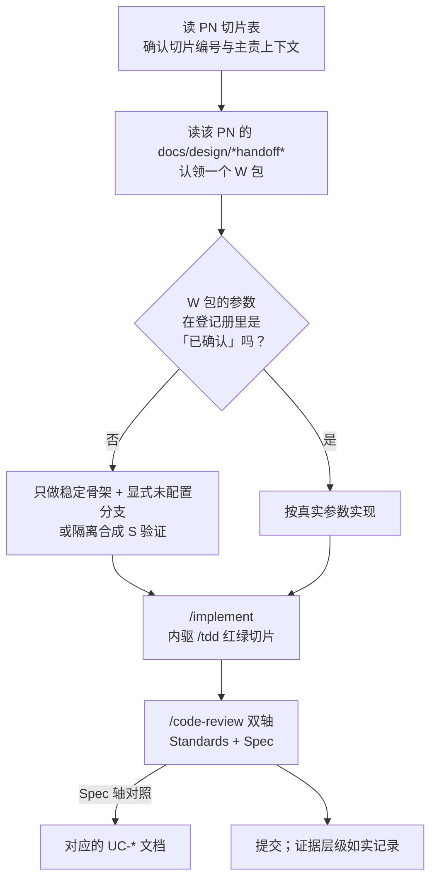

# 技能流程在本仓的落法

[idp-skills](https://github.com/idp-xyz/idp-skills) 的通用流程（`/which-skill` 是权威路由）假设一个从零开始的仓库。本仓不是——产品主线、限界上下文、用例和工作包都已经存在。本文只写**这个落差**：哪些流程步骤本仓已经用文档做过了，一个 PN 切片实际怎么走，以及红线在流程的哪一步生效。

技能本身怎么用不在这里，见各 `SKILL.md` 与 `docs/<bucket>/<name>.md`；本仓的技能路由表在 [AGENTS.md](../../AGENTS.md)。

## 记号

本文用到的编号都在别处权威定义，这张表只给一句话和入口，不展开成第二套定义。

| 记号 | 是什么 | 权威定义 |
|---|---|---|
| `PN-01`..`PN-08` | 首发纵向开发切片编号 | [首发开发主线](../product/PARCEL-NETWORK-FIRST-RELEASE-DEVELOPMENT-BASELINE.md#首发纵向开发切片) |
| `W01`..`W09` | 一个切片内的工作包编号；全称带切片前缀，如 `PN03-W01`、`CC-S0-W01`、`S02-W01` | 各 `docs/design/*handoff*` 的「取证与开发工作包」 |
| `P` `R` `S` `N/A` | 证据层级：真实生产、历史回放、受控模拟、本期不适用 | [验收矩阵](../product/PILOT-ACCEPTANCE-MATRIX.md#证据层级) |
| `UC-*` | 应用用例，形如 `UC-PS-001` | [应用用例编写约定](../application/README.md#编写约定) |
| `BD-*` | 未确认的业务选择，形如 `BD-PS-001` | 同上 |

## 本仓已经做过的上游步骤

通用流程里有三步在本仓**已经有产物**。对着已有产物再跑一遍，产出的是第二套口径，违反红线「单一权威」。

| 上游步骤 | 本仓的等价产物 | 因此 |
|---|---|---|
| `/wayfinder` 铺决策地图 | [首发开发主线](../product/PARCEL-NETWORK-FIRST-RELEASE-DEVELOPMENT-BASELINE.md) 的 PN-01..08 切片表 | 地图已成型，不重铺。只有出现基线未覆盖的新方向时才考虑 |
| `/to-tickets` 拆带阻塞边的工单 | `docs/design/*handoff*` 的 `W01..W09` 工作包，阻塞关系写在交接文档里 | 直接认领 `W` 包，不重拆 |
| `/setup-idp-skills` 配 tracker 与布局 | [issue-tracker.md](./issue-tracker.md)、[triage-labels.md](./triage-labels.md)、[domain.md](./domain.md) | 前置已满足，不用跑 |

`/grill-with-docs` 与 `/domain-modeling` 仍然常用，但在本仓是**演进**而非创建：九个 `CONTEXT.md` 和十一份 ADR 已经存在。改动走 [AGENTS.md 的「改文档」](../../AGENTS.md#改文档)——ADR 只新增或 supersede，不改写已接受的历史。

`.scratch/` 留给**交接文档没覆盖**的工作：外来 bug、临时需求、基线之外的探索。已经是 `W` 包的东西不进 tracker，也不要 `/triage`。

## 一个 PN 切片怎么走

第一步的判据在 [AGENTS.md 的「开工顺序」](../../AGENTS.md#开工顺序)，这里不复述。

**参数是否已确认**只看[参数登记册](../product/PILOT-PARAMETER-REGISTER.md)。登记册说「待提供」就是待提供——不用技术默认值补齐，也不因为合成数据跑通了就改状态。

**`/code-review` 的 Spec 轴**对照的是 `UC-*` 用例文档，不是工单描述。用例的输入、结果、失败边界就是验收口径。

## 红线在哪一步生效

四条红线不是审查清单，是流程里的具体动作。

**证据层级诚实**——在提交那一步。三件事最容易做错：

- 隔离环境跑出来的一律是 `S`，重放结果与真实完全一致也不能升级为 `R`
- 影子运行不是第五种层级，按其实际数据来源记为 `R` 或 `S`；影子通过本身不构成 `P`
- `/prototype` 的产出**最高只能是 `S`**，而且按技能本身的规矩，原型代码不进生产实现——它只提供证据，赢的设计交给 `/tdd` 重写

**只实现已确认规则**——在设计那一步。未确认参数与 `BD-*` 保持可配置或显式未决分支。

**所有权清晰**——在分层那一步。变更落在正确的 `internal/<context>/` 下；领域包不依赖 HTTP 或 `pgx`。跨上下文只传递自己拥有的事实、判断或授权引用，接收方形成自己的结果。

**单一权威**——在写文档那一步。用例与交接只引用，不复制第二套口径。本文自己也守这条：凡是别处有权威的都用链接。

## 本机环境

这些查不到，踩过才知道。

- `~/.cursor/skills` 下 37 个条目是**指向 `D:\tops\idp-skills` 克隆的目录联接**（Windows 无管理员权限，用不了符号链接）。改技能要去那个克隆改并推回上游，就地编辑等于改上游工作区。更新用 `git pull`。
- **GitHub 只能走代理。** Clash Verge 在 `127.0.0.1:7897`，但系统代理开关常是关的，导致 git 直连失败——单次连接尝试约 21 秒超时，但 GitHub 有多个解析地址，git 逐个重试，整条命令实测约 5 分钟才报错，看着像卡死。`idp-skills` 与 `idp-parcel` 两个克隆都已设仓库级 `http.proxy`；新克隆需要自己加 `-c http.proxy=http://127.0.0.1:7897`。
- **`idp-parcel` 是私有仓，远程操作必过 Git Credential Manager**（凭据存在 Windows 凭据管理器的 `git:https://github.com`）。GCM 偶尔挂住不返回，症状和没配代理一样都是命令无输出；区分靠查进程，有 `git-credential-manager get` 挂着就是凭据卡住，杀掉重跑即可，不用动代理。
- 开发机 `idp-110-dev`（`/workspace/idp/`）上技能装在 `~/.claude/skills` 与 `~/.agents/skills`，是 `scripts/link-skills.sh` 建的符号链接，与本机布局不同。
- 技能变更**要新开会话才加载**。当前会话的技能列表是会话开始时的快照。
