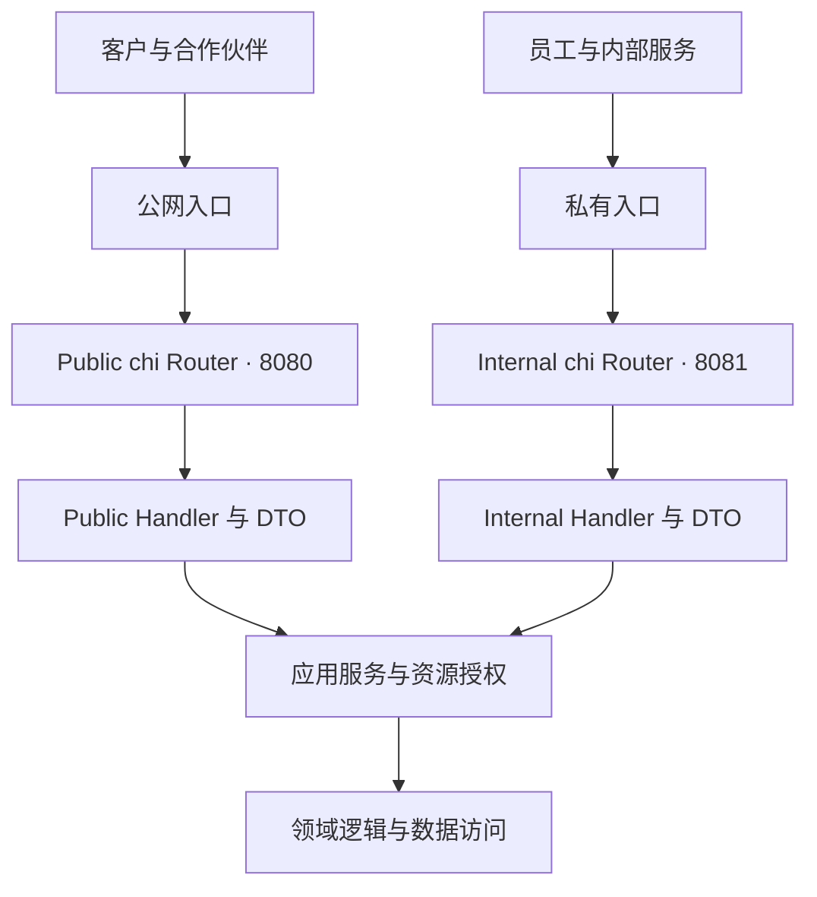
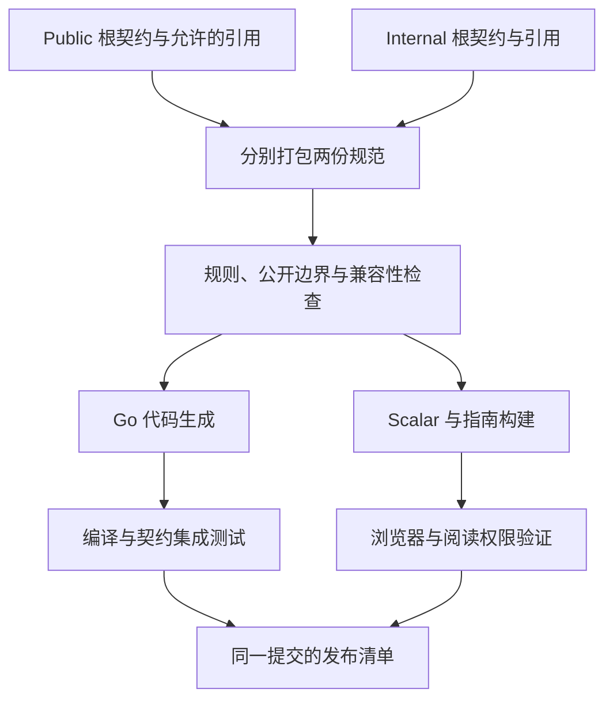

# Go + chi RESTful API 内外接口与文档治理最终方案

> 版本：V1.0  
> 日期：2026-09-09  
> 状态：方案定稿，可作为研发实施与验收基线  
> 主线：chi + OpenAPI + oapi-codegen + Scalar  
> 适用范围：Go REST API 的接口契约、对内与对外边界、开发者文档、访问控制及发布流程

本文整理当前讨论形成的最终工程方案。文中的域名、业务接口和目录是实施示例，不代表现有系统已经采用这些配置。本文交付的是设计与实施说明；尚未接入实际代码仓库，也未执行真实系统的编译、集成测试或部署。

## 目录

1. [最终决策](#1-最终决策)
2. [范围、术语与接口分类](#2-范围术语与接口分类)
3. [总体架构与部署边界](#3-总体架构与部署边界)
4. [工具选型与成本边界](#4-工具选型与成本边界)
5. [契约管理与目录设计](#5-契约管理与目录设计)
6. [URL、环境与版本规范](#6-url环境与版本规范)
7. [OpenAPI 编写规范与示例](#7-openapi-编写规范与示例)
8. [Go 与 chi 接入](#8-go-与-chi-接入)
9. [身份认证、授权与数据边界](#9-身份认证授权与数据边界)
10. [Scalar 文档接入](#10-scalar-文档接入)
11. [文档内容与开发者体验](#11-文档内容与开发者体验)
12. [构建、校验与 CI](#12-构建校验与-ci)
13. [发布、兼容性与回滚](#13-发布兼容性与回滚)
14. [日志、审计与可观测性](#14-日志审计与可观测性)
15. [现有项目迁移](#15-现有项目迁移)
16. [实施工作包与职责](#16-实施工作包与职责)
17. [验收标准](#17-验收标准)
18. [常见问题与明确约束](#18-常见问题与明确约束)
19. [实施参数与交付清单](#19-实施参数与交付清单)
20. [官方参考资料](#20-官方参考资料)

## 1. 最终决策

### 1.1 推荐组合

**以 OpenAPI 契约为接口事实源，使用 oapi-codegen 生成 Go HTTP 接入代码，chi 承担路由与中间件，Scalar 展示文档。**

| 层次 | 最终选择 | 职责 |
| --- | --- | --- |
| HTTP 路由 | go-chi/chi v5 | 路由注册、请求链组织、不同入口的隔离 |
| 接口契约 | OpenAPI | 描述方法、路径、参数、响应、鉴权声明与示例 |
| 契约基线 | OpenAPI 3.0.3 | 作为本方案的初始互操作基线；按完整工具链验证结果升级 |
| Go 代码生成 | oapi-codegen v2 系列 | 模型、chi 路由胶水、强类型服务端接口；按需要生成客户端 |
| 请求规范校验 | nethttp-middleware / kin-openapi | 按契约验证传入请求 |
| 文档展示 | Scalar API Reference 开源组件 | 文档导航、模型展示、调用示例及交互调试 |
| 多文件打包 | Redocly CLI | 将各契约的引用汇总成独立发布文件 |
| 文档规则 | Spectral | 校验规范结构及团队定义的规则 |
| 兼容性检查 | oasdiff | 对比已发布契约并检测破坏性变更 |
| 身份与权限 | 现有身份系统、网关及 Go 授权层 | 验证员工、客户和服务身份，执行资源权限 |

OpenAPI 3.0.3 是主动选择的兼容基线，不表示 3.1 或更新规范不可用。引入 3.1 前，应一起验证代码生成、运行时验证、文档渲染、差异检测和目标语言客户端，尤其是 null、联合类型和 JSON Schema 行为。仓库主分支文档可能包含尚未发布的能力，应以项目实际锁定版本为准。[OpenAPI 3.0.3](https://spec.openapis.org/oas/v3.0.3.html)、[oapi-codegen](https://github.com/oapi-codegen/oapi-codegen)

### 1.2 核心组织方式

- 一个代码库起步，核心业务服务复用。
- 对外与对内分别定义 HTTP 适配层和 DTO。
- 两份独立的 OpenAPI 根契约：public 与 internal。
- 两个 Scalar 文档入口，分别绑定允许访问的规范。
- 推荐同一进程提供两个独立 chi Router 和监听端口，由基础设施控制可达性。
- API 调用鉴权、文档阅读鉴权、资源授权分别实现。
- 同一接口只允许一个契约事实源；生成结果不手工维护。

### 1.3 对现有代码的处理

以上是目标架构，不要求为了上线文档一次性改写全部 Handler。

已有 chi 项目可以先将经过核对的契约交给 Scalar 展示，保留现有 Handler，再按模块引入生成接口和验证中间件。已有 Huma 的模块可以继续以 Huma 注册定义为事实源，导出契约纳入相同文档与 CI 流程。同一个 operation 不同时由 Huma、手写 YAML 和 Swaggo 注释独立维护。

## 2. 范围、术语与接口分类

### 2.1 三种边界必须分别确定

| 边界 | 要回答的问题 | 实现位置 |
| --- | --- | --- |
| 网络可达性 | 哪些客户端能连接服务？ | 网关、负载均衡、网络策略、监听端口 |
| 文档可见性 | 谁能读取哪些接口定义？ | 文档入口、规范文件入口、登录及角色控制 |
| 调用权限 | 谁可以对哪个资源执行什么操作？ | 认证中间件、权限策略、应用服务与数据访问层 |

`public` 在本文表示“向外部调用方提供的 API 契约”，不表示匿名可调用。对外文档是否匿名可读是独立的产品策略。

### 2.2 接口分类

| 类型 | 使用者 | 示例 | 初始组织建议 |
| --- | --- | --- | --- |
| Public API | 客户、合作伙伴及其服务器 | 创建订单、查询订单、订阅通知 | public 契约与公网 API 入口 |
| Console/BFF API | 自家客户前端或控制台 | 页面聚合查询、会话管理 | 按真实访问网络部署；有明显差异时独立契约 |
| Internal Admin API | 员工、运营及支持人员 | 人工修正、任务重跑、配置维护 | internal 契约中的管理操作，员工身份与角色控制 |
| Internal Service API | 受信任的内部工作负载 | 服务间查询、执行控制 | internal 契约中的服务操作，使用服务身份 |
| Webhook Ingress | 承运商或其他外部系统 | 外部系统推送状态事件 | 独立入站认证规则，按需单独规范 |
| Webhook Egress | 本系统向客户发送通知 | 订单状态变更事件 | 对外回调协议、签名与重试说明 |

**自家前端调用的 API，也可能需要公网可达。** 不能仅因为接口由“自己的页面”调用，就放入私有网络或取消租户授权。

初期仍保留 public、internal 两份主契约。Console、Webhook 在调用方、认证方式、发布节奏明显独立时再拆分。面向员工的操作和服务间操作即使暂时共用 internal 根契约，也需要按 operation 声明允许的身份类型。

### 2.3 本方案的非目标

本文不替代业务 PRD、领域模型设计、数据库设计和身份提供方的实施文档；不要求新增微服务平台、采购付费文档 SaaS 或统一迁移所有内部通信协议。

## 3. 总体架构与部署边界

### 3.1 运行时架构



图中的端口为示例，实际由部署配置确定。两个 Router 可以位于同一进程中；进程启动、故障退出和优雅关闭需要同时管理两个 HTTP Server。

### 3.2 推荐部署规则

1. 公网负载均衡只连接 public 监听端口。
2. internal 监听端口仅由私有入口和授权工作负载访问。
3. public Router 不注册 internal API、内部文档或内部规范文件。
4. 后端端口不另行暴露成可绕过网关的公网地址。
5. 内部入口继续验证身份与权限，网络位置不代替授权。
6. 需要审计和限权的管理接口不注册到健康检查监听入口。

同端口、分路由组可以作为迁移阶段方案，但需同时实施网关精确放行与后端鉴权，并验证后端不可绕过网关直接访问。生产目标优先采用两个 Router、两个监听端口，以减少路由误暴露的概率。

### 3.3 文档部署

建议由各自入口提供对应 Scalar 页面和规范文件：

| 入口 | 提供内容 | 阅读控制 |
| --- | --- | --- |
| Public 文档入口 | 公开 API 参考、接入指南、public 规范 | 初期仅合作伙伴登录可读；产品决定公开时再调整 |
| Internal 文档入口 | 内部 API 参考、运维说明、internal 规范 | 员工 SSO 与文档阅读权限 |
| Internal 的 public 镜像 | 与对外发布内容一致的 public 规范副本 | 随内部文档访问策略 |

内部文档可以聚合 public 与 internal 两份规范。public 镜像仅复用同一发布产物，不另行编辑。若未来不同内部角色只能看到部分操作，应为不同受众生成独立规范，而不是仅隐藏菜单。

## 4. 工具选型与成本边界

### 4.1 Scalar 的定位

Scalar API Reference 读取 OpenAPI 文件并展示文档。它不从任意 Go Handler 中自动推断业务契约，也不负责保护后端接口。

开源 Scalar 仓库采用 MIT 许可证，可商用、修改和自行部署，分发时保留相关版权与许可证声明。本方案使用自托管组件，不依赖 Scalar 云平台订阅。自身服务器、域名、维护等成本仍由部署方承担。[Scalar LICENSE](https://github.com/scalar/scalar/blob/main/LICENSE)

官方云平台有免费和付费方案；云平台协作、托管与企业功能的套餐限制，不应直接套用到自托管文档组件。本方案不采购这些服务。[Scalar 定价](https://scalar.com/pricing)

### 4.2 其他路线的定位

| 方案 | 适用情况 | 本方案处理 |
| --- | --- | --- |
| Huma + chi | 新项目偏代码优先，或已有 Huma 模块 | 保留为明确替代路线，导出契约接同一文档流程 |
| Swaggo | 既有注释覆盖充分，希望渐进改造 | 可以先复用；按实际版本处理 Swagger/OpenAPI 差异 |
| Swagger UI | 团队已经统一使用该界面 | 可以替代 Scalar，契约和权限设计保持一致 |
| chi/docgen | 查看路由、中间件及代码导航 | 作为内部辅助清单，不作为完整契约来源 |

Huma 提供 chi 适配与 OpenAPI 自动生成能力；Swaggo v1 传统工作流和 v2 OpenAPI 路线需要分别评估，不能笼统视为同一能力集。[Huma](https://huma.rocks/features/bring-your-own-router/)、[Swaggo](https://github.com/swaggo/swag)、[Swaggo v2 发布记录](https://github.com/swaggo/swag/releases/tag/v2.0.0-rc5)、[chi/docgen](https://github.com/go-chi/docgen)

## 5. 契约管理与目录设计

### 5.1 事实源与产物

| 内容 | 类型 | 是否人工修改 |
| --- | --- | --- |
| `api/public/openapi.yaml` | public 根契约 | 是 |
| `api/internal/openapi.yaml` | internal 根契约 | 是 |
| `api/public/paths/`、`api/internal/paths/` | 分模块操作定义 | 是 |
| `api/common/schemas/` | 已审核的跨受众公共结构 | 是 |
| `api/public/schemas/` | 对外专属模型 | 是 |
| `api/internal/schemas/` | 内部专属模型 | 是 |
| `api/bundled/public.openapi.json` | 打包后的 public 契约 | 否 |
| `api/bundled/internal.openapi.json` | 打包后的 internal 契约 | 否 |
| `internal/transport/publicapi/` | 生成的 Go 类型与接口 | 否 |
| `internal/transport/internalapi/` | 生成的 Go 类型与接口 | 否 |
| `internal/transport/publichandler/` | 对外接口实现与 DTO 转换 | 是 |
| `internal/transport/internalhandler/` | 内部接口实现与 DTO 转换 | 是 |
| `internal/application/` | 用例、资源授权与事务组织 | 是 |
| `internal/domain/` | 领域规则 | 是 |
| `web/docs-public/`、`web/docs-internal/` | Scalar HTML、初始化脚本 | 是 |
| `web/assets/` | 构建生成的 Scalar 静态资源 | 否 |
| `docs/guides/` | 接入、错误处理、版本迁移指南 | 是 |
| `tools/oapi-codegen/` | public/internal 生成配置 | 是 |
| `tools/` 下的版本记录及规则配置 | 固定工具链和团队规则 | 是 |

目录表给出目标组织结构，不表示这些目录已经存在。

### 5.2 公共结构复用规则

- 可复用结构以稳定、无内部语义的值对象为主，例如分页游标、金额、地址片段。
- 对外与对内的完整实体响应分别定义，不直接复用数据库模型或内部领域对象。
- public 根契约只允许引用 public 与已审核的 common 路径。
- common 不反向引用 internal。
- 共享 Schema 的修改同时影响引用方，必须触发 public 兼容性检查。
- Go 层可以通过生成器 import mapping 复用模型；初期允许分别生成相同的简单值类型，通过适配层转换，避免过早扩大类型耦合。

### 5.3 发布产物约束

各根契约分别打包，内部 `$ref` 可以保留，但交付文件不能依赖不可访问的外部规范文件。打包工具沿引用合并相关定义；清理未引用组件可以缩小产物，但不能识别“已引用模型中的敏感字段”。这部分仍依赖模型边界与审核。[Redocly bundle](https://redocly.com/docs/cli/commands/bundle)

公开产物检查覆盖路径、组件、字段、示例、描述、扩展属性和服务器地址。若采用 `x-audience` 标签，它只是团队元数据，必须由构建规则解释；标签本身不提供访问控制。

## 6. URL、环境与版本规范

### 6.1 建议路径

以下域名均为占位示例，应替换为组织真实域名。

| 项目 | 示例主机 | 路径 |
| --- | --- | --- |
| 对外 API | `api.example.com` | `/api/v1/orders` |
| 对外文档 | `api.example.com` | `/docs` |
| 对外规范 | `api.example.com` | `/openapi/public.json` |
| 内部 API | `api-internal.example.com` | `/internal/v1/event-replays` |
| 内部文档 | `api-internal.example.com` | `/docs` |
| 内部规范 | `api-internal.example.com` | `/openapi/internal.json` |
| 内部 public 镜像 | `api-internal.example.com` | `/openapi/public.json` |
| 沙箱 API | `sandbox-api.example.com` | `/api/v1/orders` |

### 6.2 避免路径前缀重复

本方案统一采用：

- OpenAPI `servers.url` 填写服务 origin，例如 `https://api.example.com`，不附加 `/api/v1`。
- `paths` 中保留完整 `/api/v1/...` 或 `/internal/v1/...`。
- 生成的路由直接注册到对应 Router，额外 base URL 为空。
- 网关保持上述 API 路径，不做无必要的前缀剥离。

这样可避免出现 `/api/v1/api/v1/orders`，也便于校验器对照真实请求路径。现有网关必须改写路径时，应统一更新注册方式、运行时校验副本和文档服务器配置，并增加专门的路径匹配验收。

### 6.3 三种版本不要混用

| 字段 | 含义 | 示例 |
| --- | --- | --- |
| `openapi` | 文档规范版本 | `3.0.3` |
| `info.version` | 本次 API 契约版本 | `1.2.0` |
| URL 主版本 | 调用方使用的兼容性边界 | `/api/v1` |

服务镜像版本和 Git commit 另行记录。规范版本、业务 API 版本和工具版本各自独立。

## 7. OpenAPI 编写规范与示例

### 7.1 每个 operation 的最低内容

| 项目 | 要求 |
| --- | --- |
| `operationId` | 在单份契约内唯一且稳定；建议所有对外 API 全局唯一 |
| `summary` / `description` | 明确用途、前置条件、权限、边界和副作用 |
| `tags` | 采用业务模块分组，例如 Orders、Tracking、Webhooks |
| 参数 | 标明位置、类型、长度、范围、必填、默认值及格式 |
| 请求体 | 精确定义可写字段、枚举、可空性和未知字段策略 |
| 响应 | 描述实际可能返回的成功与失败状态，包括网关错误 |
| `security` | 声明该操作的认证方案与必要 scope；运行时另行执行 |
| 示例 | 真实形状的合成数据，包含成功和典型失败 |
| 异步行为 | 明确何时返回、如何查询任务、何时形成最终结果 |
| 幂等与重试 | 对会产生重复副作用的操作明确规则 |
| 可见范围 | 在根契约归属及团队审核记录中明确 |

请求未知字段推荐拒绝，需在 Schema 和运行时实现中保持一致。对外响应通常采用可扩展策略，要求客户端忽略未识别字段；谨慎使用响应 `additionalProperties: false`，避免增加响应字段破坏严格客户端。

### 7.2 对外契约示例

以下是可用于说明查询接口结构的独立 YAML 示例。它只覆盖一个查询操作，不是完整业务 API 清单。

```yaml
openapi: 3.0.3
info:
  title: Public API
  version: 1.0.0
  description: 面向客户和合作伙伴的订单查询接口。
servers:
  - url: https://sandbox-api.example.com
    description: 沙箱环境
  - url: https://api.example.com
    description: 生产环境
tags:
  - name: Orders
    description: 订单查询
security:
  - BearerAuth: []
paths:
  /api/v1/orders/{order_id}:
    get:
      operationId: getOrder
      summary: 查询当前客户有权访问的订单
      description: 需要 orders:read 权限，并校验订单所属租户。
      tags: [Orders]
      x-required-permissions: [orders:read]
      parameters:
        - name: order_id
          in: path
          required: true
          description: 系统分配的订单标识。
          schema:
            type: string
            minLength: 1
            maxLength: 64
      responses:
        '200':
          description: 查询成功
          content:
            application/json:
              schema:
                $ref: '#/components/schemas/Order'
              example:
                id: ord_demo_001
                status: processing
                created_at: '2026-09-09T08:00:00Z'
        '400':
          $ref: '#/components/responses/BadRequest'
        '401':
          $ref: '#/components/responses/Unauthorized'
        '403':
          $ref: '#/components/responses/Forbidden'
        '404':
          $ref: '#/components/responses/NotFound'
        '429':
          $ref: '#/components/responses/TooManyRequests'
        '500':
          $ref: '#/components/responses/InternalError'
components:
  securitySchemes:
    BearerAuth:
      type: http
      scheme: bearer
      bearerFormat: JWT
      description: 客户访问令牌；服务端验证签名、声明、权限及租户。
  schemas:
    Order:
      type: object
      required: [id, status, created_at]
      properties:
        id:
          type: string
        status:
          type: string
          description: 当前状态。客户端应保留未知状态值并采用通用展示。
          example: processing
        created_at:
          type: string
          format: date-time
    Problem:
      type: object
      required: [type, title, status, code, request_id]
      properties:
        type:
          type: string
          format: uri
        title:
          type: string
        status:
          type: integer
        detail:
          type: string
        code:
          type: string
        request_id:
          type: string
  responses:
    BadRequest:
      description: 请求参数不符合契约
      content:
        application/problem+json:
          schema:
            $ref: '#/components/schemas/Problem'
    Unauthorized:
      description: 缺少有效身份凭证
      content:
        application/problem+json:
          schema:
            $ref: '#/components/schemas/Problem'
    Forbidden:
      description: 当前身份缺少此操作所需权限
      content:
        application/problem+json:
          schema:
            $ref: '#/components/schemas/Problem'
    NotFound:
      description: 订单不存在或不属于当前租户
      content:
        application/problem+json:
          schema:
            $ref: '#/components/schemas/Problem'
    TooManyRequests:
      description: 调用频率超过当前额度
      headers:
        Retry-After:
          description: 再次尝试前应等待的秒数
          schema:
            type: integer
            minimum: 1
      content:
        application/problem+json:
          schema:
            $ref: '#/components/schemas/Problem'
    InternalError:
      description: 服务端处理失败
      content:
        application/problem+json:
          schema:
            $ref: '#/components/schemas/Problem'
```

`x-required-permissions` 是本方案定义的团队扩展元数据，需要构建检查与后端权限绑定。对 HTTP Bearer 安全方案，`security` 数组中的值保持为空；若实际采用 OAuth2，则使用 OAuth2 Security Scheme 正式表达 scope。

### 7.3 内部操作的表达方式

内部管理操作建议面向明确业务动作，例如 `POST /internal/v1/event-replays`，而不是提供任意脚本执行入口。

| 项目 | 示例约定 |
| --- | --- |
| operationId | `createEventReplay` |
| 权限 | `events:replay`，并校验允许处理的租户/业务范围 |
| 输入 | 事件选择条件、原因、dry-run 标志、幂等键 |
| 响应 | `202 Accepted`，返回已持久化任务 ID 与查询位置 |
| 完成查询 | 独立任务查询接口，记录状态、进度及结果 |
| 审计 | 发起人、身份类型、原因、目标范围、任务 ID、结果 |
| 重复请求 | 同一幂等键和相同请求返回同一任务；请求不一致返回冲突 |

对外 API 不暴露内部任务队列名、堆栈、服务拓扑、成本信息和供应商密钥。内部文档也只使用合成示例，不嵌入真实凭证。

### 7.4 错误、幂等和分页约定

- 错误响应采用 Problem Details 结构，并扩展稳定的 `code` 与 `request_id`；对外屏蔽堆栈及内部实现细节。[RFC 9457](https://www.rfc-editor.org/rfc/rfc9457.html)
- 认证、参数验证、业务错误和网关错误应保持约定的状态码与格式；无法统一的网关故障要在文档中说明。
- 创建订单、扣费、重放等操作按需要求 `Idempotency-Key`，以租户、操作和键确定作用域，并记录请求摘要。
- 幂等窗口由业务承诺确定并写入文档；并发请求要由持久化唯一约束或等效机制防重，不能仅依赖进程内缓存。
- 相同键但请求摘要不同返回 `409`；并发未完成请求的等待或冲突策略必须固定。
- 列表使用有上限的分页参数；游标应绑定过滤条件、排序及访问上下文，不能扩大资源权限。
- 超时不等于操作失败；客户端应按幂等规则查询或重试。

## 8. Go 与 chi 接入

### 8.1 代码生成配置

`tools/oapi-codegen/public.yaml`：

```yaml
package: publicapi
output: internal/transport/publicapi/api.gen.go
generate:
  models: true
  chi-server: true
  strict-server: true
  embedded-spec: true
```

`tools/oapi-codegen/internal.yaml`：

```yaml
package: internalapi
output: internal/transport/internalapi/api.gen.go
generate:
  models: true
  chi-server: true
  strict-server: true
  embedded-spec: true
```

生成器配置与输入契约一同提交。生成代码不得包含手工业务实现。Handler 实现接口后，完成身份上下文读取、DTO 转换、应用服务调用和结果映射。

`strict-server` 主要解决类型与编解码，不能代替完整请求 Schema 校验或资源授权。请求校验由独立中间件完成；响应契约一致性通过测试验证，必要时在非生产环境加入响应验证。[oapi-codegen](https://github.com/oapi-codegen/oapi-codegen)、[nethttp-middleware](https://github.com/oapi-codegen/nethttp-middleware)

### 8.2 两个 Router 的装配原则

以下 Go 片段表达装配结构，属于接入示意。`publicAuth`、`publicValidator`、`publicServer` 等由实际项目实现或构造；此片段不是可独立运行的程序。

```go
// publicRouter 与 internalRouter 分别交给不同的 http.Server。
publicRouter := chi.NewRouter()
internalRouter := chi.NewRouter()

// 文档路由另有阅读权限，不经过业务 OpenAPI 校验器。
mountPublicDocs(publicRouter)
mountInternalDocs(internalRouter)

publicRouter.Group(func(r chi.Router) {
    r.Use(publicAuth)
    r.Use(publicRateLimit)
    r.Use(publicValidator)
    // 生成路径已经包含 /api/v1，不额外添加相同前缀。
    publicapi.HandlerFromMux(
        publicapi.NewStrictHandler(publicServer, nil), r,
    )
})

internalRouter.Group(func(r chi.Router) {
    r.Use(internalIdentity)
    r.Use(internalRateLimit)
    r.Use(internalValidator)
    internalapi.HandlerFromMux(
        internalapi.NewStrictHandler(internalServer, nil), r,
    )
})
```

生产装配还需要设置 Request ID、请求体大小上限、超时、恢复、日志和 CORS 等处理。必要认证配置缺失时启动失败；不要用空函数或默认放行作为生产降级。

示意代码使用生成器的简化构造方式。正式接入时还要通过所锁定版本提供的错误回调/选项统一请求解析失败、严格接口返回失败及验证中间件的响应；框架默认错误不保证符合本方案的 Problem 模型。404、405、413 等由路由或基础中间件产生的结果也应有明确约定。

### 8.3 校验器与认证衔接

推荐请求处理顺序为：基础请求保护 → 身份验证 → 客户/服务限流 → 契约与操作级权限校验 → Handler → 应用服务资源授权。

需要在校验器的 `AuthenticationFunc` 中验证前置认证结果满足当前 operation 的安全声明。JWT 签名等昂贵工作可在前置中间件做一次，并将验证后的 Principal 放入 context；回调必须检查正确的方案、权限和身份上下文，不能无条件返回成功。

校验器对 `servers` 可能执行主机匹配。发布规范保留正确的外部服务器地址；为运行时校验单独加载规范副本，在可信网关场景下按设计清空该副本的 `Servers`，并保留完整请求路径匹配。主机与来源限制由可信入口实施，不能修改发布规范来迁就任意 Host。[验证中间件说明](https://github.com/oapi-codegen/nethttp-middleware)

### 8.4 应用层边界

public Handler 与 internal Handler 可以调用同一应用服务，但携带不同 Principal 与明确的命令参数。应用服务仍要对目标资源和特权参数进行授权。

禁止让客户通过请求体中的 `tenant_id`、`role`、`is_admin` 等字段自行确定身份权限。跨租户管理操作必须显式授权并审计。对外返回模型采用白名单映射，避免将内部实体直接序列化。

## 9. 身份认证、授权与数据边界

### 9.1 身份模型

| 场景 | 推荐方式 | 必须验证的内容 |
| --- | --- | --- |
| 客户服务器调用 public API | OAuth2 Client Credentials 签发的访问令牌；现有 API Key 可按现状保留 | 客户、租户、有效期、用途、权限、撤销状态或相应失效机制 |
| 客户浏览器调用 API | Authorization Code + PKCE，或经过保护的 BFF 会话 | 用户会话、组织成员关系、操作和资源权限 |
| 员工阅读内部文档 | SSO / OIDC 网关会话 | 员工身份、文档阅读权限 |
| 员工执行内部操作 | 面向内部 API 的访问令牌；或带 CSRF 防护的受控会话 | 员工角色、操作权限、目标租户、资源范围 |
| 服务间调用 | 工作负载身份、面向目标服务的令牌；按基础设施使用 mTLS | 调用服务、audience、操作与资源范围 |

令牌的可信 issuer、audience 和身份类型必须与入口匹配。内部令牌与外部令牌即使使用同一身份平台，也不能因签名有效而互相获得权限。

本文的 Bearer 示例不限定身份提供方。实际采用 OAuth2 时，在 OpenAPI 中补充真实的授权地址、令牌地址、flow 和 scope；浏览器页面不放置服务端 client secret。

### 9.2 权限执行位置

1. 网关控制可达入口、TLS 和基础流量策略。
2. 认证层将可信凭证转换为 Principal，不能信任未经清理的客户端身份头。
3. 操作权限层将 operationId 或团队权限元数据映射到 scope/策略。
4. 应用服务在查询或修改前验证租户、资源归属及特权字段。
5. 数据访问层使用明确租户范围，避免先全量读取再仅在展示层过滤。

角色、scope 和资源权限可以接到已有授权组件，不必为了 Scalar 新建权限系统。

### 9.3 资源访问返回策略

- 缺少或无效凭证：`401`。
- 已认证但没有操作权限：`403`。
- 资源不存在或属于其他租户：对外统一采用 `404`，减少资源枚举信息。
- 内部跨租户操作：仅在显式授权后允许，并记录目标租户和原因。

不同系统若已有其他状态码约定，迁移时先保持兼容，再通过版本机制调整。

### 9.4 文档访问规则

文档 HTML、OpenAPI JSON、规范镜像及静态下载入口分别纳入路由审核。保护 HTML 但公开规范 URL，会直接暴露同样的接口信息。

初始 internal 文档可仅授予统一的工程阅读组。如果运营或外包角色只允许阅读部分内部能力，应增加对应受众的独立文档产物；不要将全量规范送到客户端后再通过 JavaScript 过滤。

内部规范响应建议使用 `Cache-Control: private, no-store`。若组织确需受控缓存，需验证身份隔离、注销后可见性和中间缓存行为。公共已审定文档产物可以使用 ETag 与版本化缓存。

## 10. Scalar 文档接入

### 10.1 自托管方式

使用固定版本的 `@scalar/api-reference` 构建浏览器可用资源，将 HTML、初始化脚本和所需静态资源一起打包到服务镜像或组织静态站点。

本方案中 `/assets/scalar-api-reference.js` 是构建输出约定，不表示 npm 包内必然存在同名文件。构建任务负责产出该文件并在浏览器中验证全局 `Scalar.createApiReference` 可用；如果采用模块导入方式，则相应调整初始化代码。

不在生产 HTML 中依赖浮动版本 CDN 地址。内部文档同时自托管字体等资源，并检查浏览器网络请求，确认未意外调用公共代理或外部扩展服务。

### 10.2 对外 HTML 与初始化配置

`web/docs-public/index.html` 示例：

```html
<!doctype html>
<html lang="zh-CN">
  <head>
    <meta charset="utf-8">
    <meta name="viewport" content="width=device-width, initial-scale=1">
    <title>Public API 文档</title>
  </head>
  <body>
    <div id="app"></div>
    <script src="/assets/scalar-api-reference.js" defer></script>
    <script src="/assets/docs-public.js" defer></script>
  </body>
</html>
```

`docs-public.js` 的生产配置示例：

```javascript
Scalar.createApiReference('#app', {
  url: '/openapi/public.json',
  persistAuth: false,
  withDefaultFonts: false,
  hideTestRequestButton: true,
  hideClientButton: true,
  agent: { disabled: true }
});
```

上述生产页面以阅读为主。沙箱文档构建使用沙箱专属 `servers` 列表，并将两个 `hide...` 选项设为 `false`，允许在沙箱发起测试请求。关闭按钮只是交互策略，真实 API 的访问控制继续由服务端执行。

沙箱专属规范由同一契约确定性生成，只投影环境服务器地址，不另行维护接口定义。发布清单记录每个实际投影文件的哈希，内部 public 镜像对应明确的生产或沙箱版本。

### 10.3 内部聚合配置

内部 HTML 使用相同页面结构，改为加载 `docs-internal.js`：

```javascript
Scalar.createApiReference('#app', {
  sources: [
    {
      title: 'Internal API',
      slug: 'internal',
      url: '/openapi/internal.json'
    },
    {
      title: 'Public API',
      slug: 'public',
      url: '/openapi/public.json'
    }
  ],
  persistAuth: false,
  withDefaultFonts: false,
  hideTestRequestButton: true,
  hideClientButton: true,
  agent: { disabled: true }
});
```

这里 public 规范是已发布产物的同源镜像，可以减少文档读取时跨域或跨登录域的问题。API 调试仍依赖各契约的 `servers` 和对应凭证；镜像规范不会自动代理 API 请求。

Scalar 支持多规范来源及上述相关配置；具体配置项要与最终锁定的组件版本核对。本方案的开关组合是部署策略。[Scalar 配置](https://scalar.com/products/api-references/configuration)、[Scalar HTML 接入](https://scalar.com/products/api-references/getting-started)

### 10.4 文档会话与 API 凭证

| 操作 | 使用的身份 | 处理方式 |
| --- | --- | --- |
| 打开内部文档 | 员工文档会话 | 网关或 Go 文档中间件验证 |
| 获取内部 JSON 规范 | 同源文档会话 | 规范端点执行同样的阅读权限 |
| 沙箱调用 API | 对应沙箱访问令牌 | 在调试界面输入，或使用集成的 PKCE 流程 |
| 生产调用 API | 生产客户端身份 | 通过正式客户端/受控操作台执行，按真实资源授权 |

文档登录状态不会自动成为目标 API 的调用凭证。关闭凭证持久化，避免将长期令牌嵌入 HTML、示例、URL 或浏览器可见的客户端 secret 配置。

### 10.5 网络、CORS 与浏览器策略

- 页面与规范优先同源，避免为了读取规范配置宽泛 CORS。
- 沙箱调试跨域时，仅放行明确的文档 origin、方法和所需请求头。
- 预检请求需正常通过 CORS 协商，不能要求预检携带业务令牌；真实请求继续鉴权。
- 使用 Cookie 认证执行写操作时，实施 CSRF 防护；不要用 CORS 代替 CSRF 或资源授权。
- 本方案不配置公共 `proxyUrl`。确需代理时，使用组织受控代理，固定允许的上游目标并保护凭证。
- CSP 按实际资源设置 `script-src`、`style-src`、`font-src`、`connect-src` 等；由沙箱浏览器验证后收紧，避免照抄与组件不兼容的策略。
- 对内部文档禁用不需要的远程 Agent 功能；如将来启用，需要明确其规范上传与数据流向。

## 11. 文档内容与开发者体验

### 11.1 对外文档必须包含

1. 五分钟接入：环境选择、获取凭证、首次请求和预期响应。
2. 认证与权限：令牌用途、scope、租户、轮换和失效处理。
3. API 参考：路径、参数、模型、成功/失败响应和示例。
4. 业务流程：典型任务的调用顺序、前置条件和终态判断。
5. 错误处理：错误码、request_id、是否可重试、重试等待。
6. 幂等、分页、限流、时间格式、时区和金额精度约定。
7. Webhook：订阅、验签、去重、乱序、重试和补偿查询。
8. 沙箱说明：测试数据、生产差异、凭证边界与清理规则。
9. 版本与变更：发布记录、弃用周期、迁移示例。
10. 支持渠道：提交 request_id、时间、接口及脱敏请求信息。

OpenAPI 负责结构化接口参考，业务教程使用 Markdown 页面。初期将两者放在同一文档入口导航中即可，无需先建设复杂开发者门户。

### 11.2 内部文档额外包含

- 模块 Owner、调用方、运行环境与依赖。
- 特权操作的适用条件、目标范围、失败处理和审计查询方式。
- 长任务状态、重试语义、取消能力与并发限制。
- 运行手册链接、告警与排障信息，确保链接有对应阅读权限。
- 内部接口变更对调用服务、运营工具和自动化任务的影响。

文档可以说明操作风险和执行条件，但不包含可直接复用的真实凭证。

### 11.3 Webhook 的规范版本处理

OpenAPI 3.0.3 没有 3.1 的顶层 `webhooks` 对象。V1 可在订阅操作上使用规范支持的 `callbacks` 描述相关回调；独立事件推送使用明确标为“客户接收端”的补充 OpenAPI 文档或独立事件协议说明，并提供完整 payload Schema。

补充规范如果包含客户侧接收路径，不送入本服务的服务端代码生成任务。必须在导航与说明中明确调用方向，避免把客户接收端误认为本平台可调用 API。[OpenAPI 3.0.3 Callback Object](https://spec.openapis.org/oas/v3.0.3.html#callback-object)

Webhook 协议至少说明事件 ID、事件类型、发生时间、Schema 版本、签名原文构造、时间窗口、密钥轮换、响应确认和重试策略。接收方按事件 ID 幂等处理，不假定通知只到达一次或严格有序。

## 12. 构建、校验与 CI

### 12.1 构建依赖关系



### 12.2 固定工具版本

| 工具/依赖 | 锁定位置 | 规则 |
| --- | --- | --- |
| Go、chi、验证中间件 | `go.mod`、`go.sum`、构建镜像 | 满足所选发布版的最低 Go 要求 |
| oapi-codegen | Go tool 依赖或项目工具清单 | 使用明确发布版本，不在 CI 使用浮动 latest |
| Scalar、Redocly CLI、Spectral | 精确 npm 依赖与 `package-lock.json` | 使用 `npm ci`，构建日志记录实际版本 |
| oasdiff | 工具清单或固定镜像 digest | 记录版本并验证退出码行为 |

依赖的具体发布号应在真实仓库首次基线构建时锁定，并与现有 Go/Node 环境兼容。本方案未读取实际仓库，故不声称某一组发布号已经完成组合测试。后续升级单独提交，不能随普通业务 PR 隐式升级。

### 12.3 基础命令模板

以下命令假定对应的固定版本 CLI 已安装并进入 PATH，目标生成目录已创建。它们是实施模板，本次未实际运行。

```bash
redocly bundle api/public/openapi.yaml --remove-unused-components --output api/bundled/public.openapi.json
redocly bundle api/internal/openapi.yaml --remove-unused-components --output api/bundled/internal.openapi.json

spectral lint --fail-severity error api/bundled/public.openapi.json api/bundled/internal.openapi.json

oapi-codegen --config tools/oapi-codegen/public.yaml api/bundled/public.openapi.json
oapi-codegen --config tools/oapi-codegen/internal.yaml api/bundled/internal.openapi.json

go test ./...
git diff --exit-code -- api/bundled internal/transport/publicapi internal/transport/internalapi

oasdiff breaking --fail-on ERR baseline/public.openapi.json api/bundled/public.openapi.json
```

`baseline/public.openapi.json` 必须从当前线上已发布的不可变产物取得，或从可追溯的发布标签按同一固定工具链重建。不能取开发分支的任意最新文件作为线上兼容基线。无历史发布的首版应显式标记首次基线，并在发布后归档。

`git diff` 不包含未跟踪的新文件，CI 还需检查生成目录下未跟踪文件并在存在时失败。兼容性检查应另与目标合并分支比较，避免并行开发互相覆盖；对线上兼容性仍以已发布版本为准。

oasdiff 必须配置失败阈值，避免仅输出报告却不阻断不兼容变更。[oasdiff breaking](https://github.com/oasdiff/oasdiff/blob/main/docs/BREAKING-CHANGES.md)

### 12.4 Spectral 与团队自定义检查

最小 `.spectral.yaml`：

```yaml
extends:
  - spectral:oas
```

在基础规则上加入团队规则。以下能力需要自行配置或实现，不能假定 Spectral 默认全部提供：

| 检查 | 实施方式 | 失败条件 |
| --- | --- | --- |
| operationId 与说明完整 | Spectral 规则 | 缺失、重复或不满足命名规范 |
| 认证声明 | Spectral / 自定义脚本 | 无明确 security 且未列入匿名例外清单 |
| public 引用边界 | 解析引用图 | 引用 internal 文件或受限组件 |
| public 路径白名单 | 解析打包结果 | 出现未批准的方法与路径组合 |
| public 元数据检查 | 遍历规范字段与示例 | 内部地址、真实凭证或明确禁止的内部字段 |
| 模型与示例一致 | Schema 验证 | 示例类型、必填或枚举不匹配 |
| 操作权限绑定 | 对照 operationId 权限表 | 缺少策略映射或绑定不存在的操作 |
| 路由覆盖 | 对照 chi 路由清单与契约 | 文档与注册路由不一致且不在例外清单 |
| 生成一致性 | 重生成及 Git 状态检查 | 有未提交差异或未跟踪生成文件 |

规范边界检查必须解析 YAML/JSON 和 `$ref`，字符串搜索只作补充。敏感字段识别无法完全自动化，public 模型变更仍需负责人审核。[Spectral](https://github.com/stoplightio/spectral)

### 12.5 必要集成测试

- 请求类型、范围、未知字段和必填项的有效/无效边界。
- 请求校验器及鉴权错误返回格式。
- 响应状态、Content-Type 和模型与规范一致。
- 租户 A 无法读取、修改或通过列表发现租户 B 的资源。
- 无特权身份无法调用内部管理操作。
- public 入口没有 internal 路由，包括不同方法、尾部斜杠和网关规范化路径。
- 浏览器能读取有权访问的规范，退出后不能重新获取受保护规范。
- 并发幂等请求只产生一个业务操作或一个异步任务。

生产响应验证是否启用应基于性能和数据策略评估；V1 至少在契约集成测试中覆盖实际响应。

## 13. 发布、兼容性与回滚

### 13.1 版本演进原则

| 变更 | 默认评估 |
| --- | --- |
| 新增独立接口 | 通常兼容，仍需评审权限、配额和 SDK 影响 |
| 新增请求必填字段 | 破坏性变更 |
| 删除/重命名响应字段 | 破坏性变更 |
| 改变字段类型、单位或语义 | 破坏性或需要显式迁移 |
| 增加可选响应字段 | 取决于客户端及 Schema 是否允许未知字段 |
| 扩展响应枚举 | 可能破坏使用穷举或封闭枚举的客户端 |
| 收紧校验、缩小范围 | 可能使现有请求失效 |
| 提高权限要求、降低限额 | 对调用方有实质影响，需要沟通与迁移 |
| 修改文字说明 | 通常不改变行为；仍检查是否隐藏了语义变化 |

自动差异工具不能证明行为完全兼容。排序、时区、金额单位、错误语义和异步完成条件等还需人工评审及场景测试。

### 13.2 发布顺序

1. 固定提交、依赖版本与两份契约，生成完整候选发布产物。
2. 在沙箱部署同一候选产物，完成契约、权限、路径及浏览器验证。
3. 先发布兼容的服务能力并确认生产探针，再切换正式文档版本指针。
4. 有破坏性变更时使用新的 URL 主版本或明确迁移计划，旧版在约定窗口继续可用。
5. 发布说明同时记录接口变更、迁移要求和支持窗口。

文档不能提前展示尚未部署的正式接口；预览能力应明确标为 preview 并指向对应环境。多实例滚动升级时，公开新能力前应确认所有承接流量的实例或路由已支持该能力。

### 13.3 发布清单

每次发布至少记录：Git commit、服务镜像 digest、public/internal 契约版本与 SHA-256、Scalar 资源版本、生成器及校验工具版本、测试报告位置、发布时间和负责人。

### 13.4 回滚规则

服务、规范、文档资源按发布清单回滚到匹配版本。文档静态资源使用内容哈希命名或版本路径，避免旧 HTML 引用新脚本。

回滚之前检查已经存在的业务数据、数据库变更、已发出的事件和已开始使用新能力的客户端是否兼容。无法安全回滚时采用向前修复；回滚页面不能撤销已经发生的 API 副作用。

## 14. 日志、审计与可观测性

### 14.1 推荐记录字段

| 类型 | 字段 |
| --- | --- |
| 请求定位 | request_id、trace_id、operationId、路由模板、状态码、耗时 |
| 调用主体 | 经过验证的主体 ID、主体类型、租户 ID、客户端 ID |
| 契约验证 | public/internal 契约版本、验证失败类别 |
| 特权审计 | 操作人、目标租户、目标资源、原因、结果、任务 ID |
| 发布定位 | 服务版本、commit、契约哈希 |

不记录 Authorization、Cookie、API Key 或完整敏感请求体。指标标签使用路由模板和 operationId，避免把订单 ID、完整 URL 或主体 ID 放入高基数指标。

### 14.2 监控建议

- API 按操作统计吞吐、错误率、延迟与限流。
- 单独统计契约校验失败，识别客户端不兼容或发布错误。
- 对重复权限拒绝、异常管理操作和审计写入失败设置告警。
- 监测文档页面与规范文件的可用性，以及文档版本和当前服务版本是否匹配。
- 高权限操作产生持久化审计记录；若审计是执行前置条件，审计失败应阻止操作，或通过可靠事务/Outbox 保证记录，不静默丢弃。

## 15. 现有项目迁移

### 15.1 推荐阶段

| 阶段 | 执行内容 | 完成条件 |
| --- | --- | --- |
| 盘点 | 导出实际路由，识别调用方、权限、DTO 和网关转发 | 每条路由都有 Owner 与受众 |
| 建立文档基线 | 整理 public/internal 契约，接入两个 Scalar 页面 | 核心接口可读且示例与实现一致 |
| 分离访问入口 | 拆分 Router/监听端口，保护内部规范与操作 | 公网入口无法到达内部资源 |
| 引入契约验证 | 先在沙箱评估现有请求，再按模块启用 | 有效历史请求保持兼容，无效请求有明确错误 |
| 引入生成接口 | 按业务模块实现生成的强类型服务端接口 | 生成器与业务实现分离，模块测试通过 |
| 建立发布治理 | 启用规则、差异检测和发布清单 | 每次接口变更自动经过检查 |

### 15.2 迁移限制

- 不让手写路由和生成路由同时注册同一个方法、同一条路径；每次切换明确一个注册 Owner。
- 启用请求验证会改变过去宽松解析的行为，必须先评估真实客户端使用情况。
- 现有 Swagger 2.0 转换到 OpenAPI 3 后，人工检查请求体、文件上传、nullable、鉴权和响应格式。
- 共享业务服务可以渐进整理，不能仅为符合目录示例进行无收益的大规模重写。
- 保留已发布对外行为，必要的收紧和破坏性调整进入版本迁移流程。

### 15.3 若项目选择 Huma

Huma 模块可以建立两个 API 实例，将操作注册到 public/internal 对应 Router；其生成契约作为构建输入导出、打包、检查和发布。不要再维护同一 operation 的独立手写契约。

Huma 默认导出 OpenAPI 3.1；若需要与本方案 3.0.3 基线对齐，使用其提供的 3.0 导出并验证相关语义没有丢失。团队一旦确定某模块采用 Huma，就按该模块的事实源持续维护。[Huma OpenAPI 生成与导出](https://huma.rocks/features/openapi-generation/)

## 16. 实施工作包与职责

以下采用工作包安排，不在缺少接口数量和仓库状态的情况下承诺固定天数。

| 工作包 | 主要输出 | 负责角色 | 依赖 |
| --- | --- | --- | --- |
| WP1 接口盘点 | 路由清单、受众分类、Owner、现有认证方式 | 后端负责人 | 无 |
| WP2 契约基线 | public/internal 根契约、公共模型、命名与错误规范 | API Owner、后端 | WP1 |
| WP3 入口与权限 | Router/端口、网关规则、主体模型、权限映射 | 后端、平台工程 | WP1 |
| WP4 文档门户 | Scalar 页面、规范端点、沙箱配置、指南 | 后端或前端 | WP2、WP3 |
| WP5 代码与验证 | 生成配置、Handler 适配、运行时验证 | 后端 | WP2、WP3 |
| WP6 自动检查 | bundle、lint、兼容性检查、契约及隔离测试 | 后端、测试、平台工程 | WP4、WP5 |
| WP7 发布基线 | 发布清单、版本记录、回滚说明、验收报告 | 发布负责人 | WP6 |

小团队可由同一人承担多个角色，但对外契约变更必须有明确责任人。日常新增接口遵循“契约与用途评审 → 实现 → 自动验证 → 同版本发布”的顺序。

## 17. 验收标准

本章是实施后的验收矩阵，不表示本次已经执行这些测试。

| 编号 | 测试/检查 | 预期结果 | 证据 |
| --- | --- | --- | --- |
| A01 | 对外文档正常打开 | 按所定阅读策略显示 public 文档 | 浏览器截图与访问记录 |
| A02 | 未登录读取内部文档 | 返回登录流程或拒绝，无内部内容 | HTTP 与浏览器记录 |
| A03 | 未登录直接读取内部 JSON | 返回 401/403 等拒绝响应，无规范正文 | HTTP 响应 |
| A04 | 有内部文档权限的员工访问 | 能读取允许的规范与 public 镜像 | 登录态测试 |
| A05 | 检查 public 发布文件 | 没有 internal 路径、内部模型或受限元数据 | 解析检查报告 |
| A06 | 公网调用 internal 路径 | public Router 不提供该路由，实际内部操作未执行 | 网关与后端测试 |
| A07 | 绕过网关访问内部端口 | 非授权网络不可达 | 网络/部署验证 |
| A08 | 无凭证调用 public API | 401，无业务数据 | 集成测试 |
| A09 | 有身份但缺少操作权限 | 403，操作未执行 | 授权测试 |
| A10 | 租户 A 访问租户 B 资源 | 查询返回约定的 404；修改无副作用 | 跨租户测试 |
| A11 | 外部令牌尝试内部 API | 不因签名有效而获取内部权限 | 令牌交叉测试 |
| A12 | 无效参数、未知写入字段 | 按契约拒绝，返回统一错误 | 边界测试 |
| A13 | 正常及错误响应 | 状态、媒体类型、字段满足契约 | 响应验证报告 |
| A14 | 并发重复提交幂等请求 | 单一操作；冲突按固定规则处理 | 并发测试 |
| A15 | 网关路径与文档服务器组合 | 无重复前缀或找不到接口的问题 | 沙箱实际请求 |
| A16 | 重生成代码和规范 | 与提交产物一致，无未跟踪生成文件 | CI 日志 |
| A17 | 人为删除对外响应字段 | 兼容性检查按策略失败 | CI 负例 |
| A18 | 浏览器查看网络请求 | 无意外公共代理、远程 Agent 或外部资源依赖 | 网络记录 |
| A19 | 生产文档与沙箱调试 | 生产页面按策略只读；沙箱可用专属凭证调用 | 浏览器测试 |
| A20 | 特权操作审计 | 可定位主体、目标、原因及结果，敏感凭证未记录 | 脱敏审计样本 |
| A21 | 发布清单与回滚演练 | 服务、契约和文档版本匹配，可恢复允许的上一版本 | 演练记录 |

功能验收之外，按系统现有 SLO 对启用校验前后的延迟、内存及吞吐进行对比。本文不预设没有实测依据的性能增幅或固定百分比门槛。

## 18. 常见问题与明确约束

### 18.1 是否需要拆成两个微服务？

初期不需要。同一进程中两个 Router、两个监听端口可以共享业务层。未来出现独立伸缩、资源隔离或发布节奏要求时，再拆部署单元。

### 18.2 能否用一个 Scalar 页面切换内外文档？

可以用于拥有相应权限的内部入口。对外入口只加载 public 规范。不同规范的可见范围由服务端控制，选择器不承担权限隔离。

### 18.3 对外接口是否必须匿名开放？

不必。对外表示面向客户和合作伙伴；API 可以要求令牌，文档也可以要求合作伙伴登录。

### 18.4 `securitySchemes`、tags 或 `x-internal` 是否自动保护接口？

不会。它们是规范声明或扩展元数据。实际认证与授权由后端或网关执行，规范过滤由构建任务执行。

### 18.5 是否要购买 Scalar 企业版才能接内部 SSO？

本方案自托管开源文档页面，由组织现有网关或应用实施 SSO，不依赖 Scalar 云平台的 SSO 套餐。组织需要自行维护接入和相关基础设施。

### 18.6 是否只要生成文档就能保证一致性？

不能。契约驱动可以减少结构漂移，仍需验证响应、错误码、权限、业务语义、网关行为及真实客户端兼容性。

### 18.7 是否需要同时部署 Huma 与 oapi-codegen？

主线不需要同时使用。既有模块允许各自采用明确的事实源，通过导出的 OpenAPI 统一展示和治理；同一 operation 不由两套机制分别定义。

### 18.8 是否要另存一份“内部全量契约”？

初期不需要复制合并。内部 Scalar 通过多来源展示 public 与 internal 两份已发布文件，减少重复维护。真正需要统一 SDK 或统一规范时，再设计专门的聚合产物与命名冲突规则。

## 19. 实施参数与交付清单

### 19.1 上线参数由现有环境确定

| 参数 | 本方案约定 | 实施时来源 |
| --- | --- | --- |
| public/internal 域名 | 独立 origin，文档与对应规范同源 | 组织域名与网关配置 |
| 监听端口 | 示例 8080/8081，均可配置 | 部署规范 |
| 身份提供方 | 复用现有平台 | 当前 issuer、audience、客户端注册 |
| 文档阅读策略 | 对外初期合作伙伴登录；内部 SSO | 产品与组织权限策略 |
| API 权限 | operationId 映射明确权限 | 业务授权模型 |
| 工具发布版本 | 固定版本并通过组合测试 | 现有 Go/Node 环境与依赖锁文件 |
| 契约兼容基线 | 当前线上不可变 public 产物 | 发布归档 |
| 弃用周期 | 在首次对外发布前明确 | 对客户的服务承诺 |
| 幂等窗口、配额、超时 | 每项业务契约中明确 | 业务与容量设计 |

这些属于真实环境的实施参数，不改变本文架构决策；不能把示例域名或任意默认配额当成已确定的生产配置。

### 19.2 研发完成时应交付

- public/internal 两份根契约、允许的共享 Schema 与经过校验的打包产物。
- 固定版本的工具链、生成配置、生成 Go 代码和实际 Handler 实现。
- 两个 Router/监听入口及对应网关规则。
- 文档阅读控制、API 身份验证、操作授权及资源授权实现。
- Scalar 对外与内部页面、静态资源、规范端点和沙箱配置。
- 接入指南、错误与重试说明、Webhook 文档和版本记录。
- CI 规则、权限绑定表、公开产物检查、契约与隔离测试。
- 发布清单、回滚说明和第 17 章对应验收证据。

### 19.3 完成定义

只有在“文档可读、规范正确、调用受控、资源隔离、代码一致、发布可追溯”全部满足验收要求后，才将工程任务标记为完成。页面能打开只是其中一项。

## 20. 官方参考资料

核查日期：2026-09-09。以下用于确认工具能力与协议语义；本文的接口划分、目录、部署策略、示例和工作包是本方案的工程设计选择。工具文档可能随版本变化，应优先查阅实际锁定发布版的说明。

| 资料 | 用途 |
| --- | --- |
| [go-chi/chi](https://github.com/go-chi/chi) | 路由、分组和中间件 |
| [oapi-codegen](https://github.com/oapi-codegen/oapi-codegen) | chi 代码生成、strict-server、模型与多文件支持 |
| [nethttp-middleware](https://github.com/oapi-codegen/nethttp-middleware) | OpenAPI 请求验证与认证回调 |
| [Scalar 开源仓库](https://github.com/scalar/scalar) | 文档组件源码与集成入口 |
| [Scalar MIT 许可证](https://github.com/scalar/scalar/blob/main/LICENSE) | 开源授权与保留声明要求 |
| [Scalar 配置](https://scalar.com/products/api-references/configuration) | 多规范来源、认证体验、调试和资源配置 |
| [Scalar Getting Started](https://scalar.com/products/api-references/getting-started) | HTML/JavaScript 文档接入 |
| [Scalar Go 集成](https://scalar.com/products/api-references/integrations/go) | 官方文档列出的 Go 社区集成 |
| [Scalar 云平台定价](https://scalar.com/pricing) | 区分自托管组件与官方云平台套餐 |
| [Redocly CLI bundle](https://redocly.com/docs/cli/commands/bundle) | 多文件规范打包 |
| [Spectral](https://github.com/stoplightio/spectral) | OpenAPI 规则检查 |
| [oasdiff](https://github.com/oasdiff/oasdiff) | 契约差异与兼容性检测 |
| [oasdiff breaking 用法](https://github.com/oasdiff/oasdiff/blob/main/docs/BREAKING-CHANGES.md) | CI 失败阈值 |
| [OpenAPI 3.0.3](https://spec.openapis.org/oas/v3.0.3.html) | security、servers、paths、callbacks 等协议定义 |
| [RFC 9457](https://www.rfc-editor.org/rfc/rfc9457.html) | HTTP Problem Details 错误结构 |
| [Huma 路由适配](https://huma.rocks/features/bring-your-own-router/) | 已有 Huma 模块的 chi 集成 |
| [Huma OpenAPI 导出](https://huma.rocks/features/openapi-generation/) | 代码优先模块的规范导出 |
| [Swaggo](https://github.com/swaggo/swag) | 注释生成路线及迁移背景 |
| [chi/docgen](https://github.com/go-chi/docgen) | 路由清单辅助工具 |
