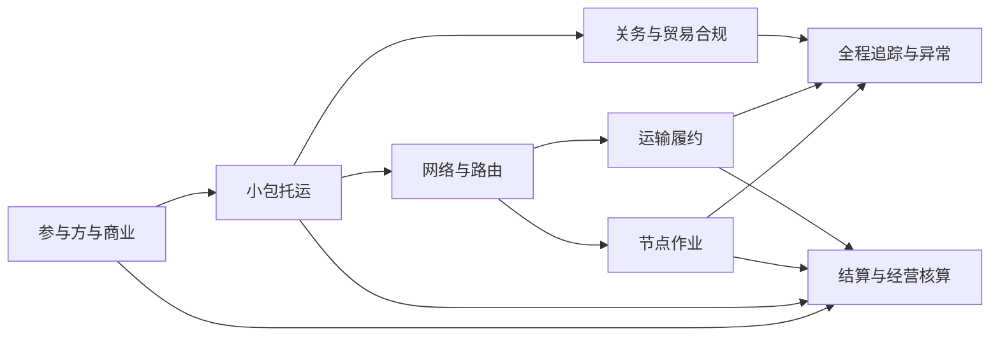

# 领域发现问答工作副本

Status: Archived

本文件保留领域访谈过程中形成的工作副本，可能包含重复问题、候选方案和未完成分支。它不是当前产品或领域规则的权威来源；已确认结论以 `docs/product`、`docs/domain` 和 `docs/adr` 下的权威文档为准。

### 第一问：首发经营模型

`idp-parcel` 是否明确服务于：

> 一个国际小包物流运营企业，在自己的集货、分拣、干线、清关和尾程网络中，同时服务多个货主客户？

为什么重要：这决定租户、客户账户、跨客户集包、数据隔离、应收应付和单票毛利的基础模型。

我的建议：选择多货主共享网络。运营企业集团是租户，货主是租户内相互隔离的客户账户。

主要代价：客户级权限、合同、报价和账单隔离会更复杂；但这是国际小包物流商真实的经营模式。

请选择：

- A：多货主共享运营网络（推荐）
- B：只服务单一企业自己的包裹网络
- C：首版同时兼容两种模式


已确认：

- 一个国际小包运营企业是系统租户和运输服务责任主体。
- 多个货主是租户内相互隔离的客户。
- 包裹可以跨客户集包进入共享网络。

### 第二问：系统的核心业务对象是什么？

建议明确区分三个对象：

- **客户寄递委托**：货主向运营企业购买一次寄递服务的商业请求，包含客户、收寄方、服务产品和结算条件。
- **包裹**：实际称重、贴标、扫描、集包、运输、清关和妥投的物理单元；一个委托可以包含一个或多个包裹。
- **上游业务订单**：来自客户 OMS、ERP 或电商平台的外部引用，不由本系统拥有。

例如：一个客户委托包含两个包裹，一个妥投、一个丢失。系统必须分别追踪包裹，同时在委托层统一处理客户承诺、计费和索赔。

为什么重要：如果把“订单、委托、包裹、运单号”合并成同一个对象，未来多件运输、换单号、分批妥投、部分退件和单件索赔都会非常难处理。

我的建议：选择 A。代价是首版多一层对象，但可以避免后期迁移核心数据模型。

- A：客户寄递委托包含一个或多个包裹；运单号只是外部运输标识（推荐）
- B：一个客户委托永久只能对应一个包裹
- C：直接把客户电商订单作为系统核心对象


已确认采用 A：

- 客户寄递委托是商业服务对象。
- 一个委托可以包含一个或多个包裹。
- 包裹是强制物理追踪单元。
- 上游订单只作为外部引用。
- 运单号和追踪号是可变化的外部运输标识。

### 第三问：自营与外包如何共存？

国际小包运营企业是否需要在同一包裹旅程中同时支持：

- 自营集货、分拣或干线；
- 外包航空、清关或尾程；
- 不同国家使用不同合作商；
- 某一运输环节临时更换服务商？

我的建议是：采用混合网络模型。运营企业始终对货主承担端到端服务责任，但每个网络环节分别标明由内部组织还是外部服务商履行。

例如：

```text
自营揽收 → 自营分拣 → 外包航空干线 → 外包进口清关 → 当地合作商派送
```

为什么重要：这决定运输旅程、合同责任、交接、容量、采购成本和异常归责的基础结构。

主要代价：需要在环节级管理履约责任、交接和成本；但如果只按“整票自营”或“整票外包”设计，未来几乎一定需要重构。

请选择：

- A：同一旅程支持自营与外包环节混合，运营企业承担端到端客户责任（推荐）
- B：首版只支持全部自营
- C：首版只支持全部外包，不管理内部网络作业

阶段检查：

- 一个运营企业服务多个货主客户。
- 客户寄递委托与包裹分离。
- 包裹是强制追踪单元。
- 同一包裹旅程允许自营和外包环节混合。
- 无论实际履约方是谁，运营企业对客户承担端到端责任。

### 第四问：客户购买的是标准产品，还是定制线路？

我的建议是建立运营企业自己的、可版本化的**国际小包服务产品**。

一个服务产品应明确：

- 可达国家、地区和邮编范围；
- 重量、尺寸、货物及禁限运条件；
- 时效和轨迹承诺；
- 清关模式和税费承担方式；
- 揽收、交仓及截单规则；
- 派送、重派、退件和销毁规则；
- 可使用的候选路由和履约渠道。

客户合同只决定该客户可以购买哪些产品、客户价格以及允许覆盖的商务条件。每个客户寄递委托保存当时选择的产品版本快照。

例如，对客户销售的是“欧洲经济小包”，其底层可以根据容量和异常情况选择不同航空、清关及尾程服务商；不能把某个供应商渠道直接当成客户购买的产品。

为什么重要：如果服务产品和供应商渠道混为一体，更换渠道就会被错误地理解为改变客户承诺；如果每个客户复制一套产品，又会产生大量不可维护的规则副本。

主要代价：需要管理产品版本、客户合同和适用规则的解析，但可以稳定客户承诺并允许底层网络调整。

请选择：

- A：标准服务产品版本 + 客户合同价格及受限覆盖（推荐）
- B：每个客户完全定制自己的服务产品
- C：不建立产品层，客户直接选择具体供应商渠道

### 第五问：运营企业何时真正接管包裹？

建议区分两个业务边界：

1. **委托受理**
   - 客户资料、服务产品和基础合规检查通过；
   - 创建客户寄递委托；
   - 可以分配内部包裹号、面单和预报信息；
   - 运营企业尚未实际控制包裹，包裹不能视为在途。

2. **实物收寄**
   - 运营企业或其授权揽收合作方完成有效收件扫描；
   - 确认实际重量、尺寸、数量和外包装状况；
   - 运营企业开始承担实物控制责任；
   - 包裹旅程正式开始，并根据产品规则启动时效和计费。

例如客户创建面单后一直没有交货，该包裹只能是“已受理、未收寄”，不能算作在途、丢失或运输延误。

为什么重要：这决定责任起点、时效计算、取消规则、账单形成、货损认定以及大量“创建面单但未交货”数据的处理方式。

主要代价：委托和包裹需要分别维护受理与实物履约状态，但这是避免虚假在途和责任争议的必要区分。

请选择：

- A：区分委托受理和实物收寄，以有效收件事实作为包裹履约及实物责任起点（推荐）
- B：面单或追踪号生成时即开始履约并承担责任
- C：包裹进入首个干线班次时才开始履约并承担责任

这个场景修正了前面的假设：

> “运营企业承担端到端客户责任”不能是全系统统一规则，必须由客户购买的服务产品决定。

建议在同一系统中支持两种明确的**服务责任模式**：

1. **网络运输服务**
   - 运营企业向客户承担端到端服务责任；
   - 可以混合使用自营和外包环节；
   - 实物收寄后形成包裹控制责任；
   - 系统管理旅程、集包、清关、异常、索赔和服务达成。

2. **面单渠道服务**
   - 运营企业只提供渠道选择、承运商下单、面单和费用服务；
   - 包裹由客户直接交给实际承运商；
   - 运营企业不形成实物收寄和货物控制责任；
   - 系统引用承运商轨迹、账单和异常结果；
   - 运输责任与索赔责任根据渠道合同确定。

这两种模式适合留在同一系统，因为它们共享客户、服务产品、报价、面单、承运商账户、追踪和结算；但履约生命周期必须分开，不能让纯面单订单伪装成运营企业已经收货。

主要代价：服务产品必须声明责任模式，异常、SLA和索赔规则也要按模式区分；好处是不会为面单客户虚构仓内及运输作业。

请选择：

- A：同一系统支持两种责任模式，由服务产品版本和客户合同明确决定（推荐）
- B：即使只提供面单，运营企业仍统一承担端到端运输责任
- C：把面单服务建设成另一个独立系统

已确认两种服务责任模式共存，并由服务产品版本与客户合同明确决定。

### 第六问：包裹身份能否依赖运单号？

国际小包可能发生：

- 客户创建面单后取消并重新下单；
- 出口渠道调整，需要更换主运单号；
- 目的国注入后生成新的尾程追踪号；
- 退件产生新的退运单号；
- 同一面单重复打印，但实际包裹没有变化。

我的建议：

- 每个包裹拥有一个永久不变的**内部包裹标识**；
- 面单号、运单号、承运商追踪号和尾程单号都是外部运输标识；
- 一个包裹可以在不同时间和旅程环节关联多个外部运输标识；
- 外部标识的分配、替换、失效和适用环节必须保留历史；
- 重打相同面单不产生新包裹，换渠道也不改变包裹身份；
- 只有实际拆包、合包或重新包装形成新的物理单元时，才建立新包裹及其来源关系。

为什么重要：如果直接用运单号作为包裹主键，换单、尾程换号和退件都会切断全程轨迹、费用与索赔关系。

主要代价：需要维护包裹与多个外部标识的映射及有效期，但这是全链路追踪的必要基础。

请选择：

- A：永久内部包裹标识 + 多个可版本化外部运输标识（推荐）
- B：使用首个运单号作为包裹永久身份
- C：包裹有内部标识，但永久只允许一个外部运单号


### 第七问：两种服务模式的履约起点是否分别定义？

我的建议是分别定义：

#### 网络运输服务

- 委托受理和面单生成不代表已经收到包裹。
- 运营企业或其授权揽收方完成有效实物收件扫描后：
  - 运营企业取得包裹控制责任；
  - 包裹旅程正式开始；
  - 根据服务产品规则启动运输时效；
  - 实测重量、尺寸和包装状况成为计费及异常依据。

#### 面单渠道服务

- 面单生成只表示渠道服务已经创建，不产生运营企业的实物控制责任。
- 客户将包裹交给实际承运商后，由承运商收寄事件启动被观察的运输旅程。
- 运营企业引用承运商轨迹和异常，但不虚构自己的收寄、仓内或运输事件。
- 面单服务何时计费由客户合同决定，可以发生在下单、面单成功或承运商收寄时，不与实物责任强制绑定。

例如，同一客户创建了100张面单，只实际交给承运商80个包裹：系统应形成100笔渠道服务记录，但只有80个包裹进入承运商运输过程。

为什么重要：如果两种模式共用同一个“已收寄/运输开始”定义，系统会产生虚假库存、虚假在途、错误时效和责任争议。

主要代价：两种模式具有不同履约起点和状态投影，但共享客户委托、包裹、产品、面单及费用基础。

请选择：

- A：按服务责任模式分别定义履约和责任起点（推荐）
- B：两种模式都在面单生成时开始履约
- C：两种模式都在实际承运商首次扫描时开始履约

### 第八问：包裹如何组成袋、笼、板和航空容器？

自营网络不能只记录“某批次包含哪些包裹”，还必须表达真实的物理装载关系。

我的建议是建立独立的**集运单元**：

- 包括袋、笼车、托盘、箱、航空集装器等具有独立标识的物理单元；
- 集运单元可以包含包裹，也可以受控地包含下一级集运单元；
- 一个包裹或子集运单元在同一时点最多只能属于一个有效父单元；
- 装入、移出、封袋、封签、开封、交接和拆解都形成不可覆盖的作业事实；
- 扫描父单元可以推导其成员包裹的候选位置与控制关系，但不能伪造每个包裹的独立扫描；
- 总单、交接清单和舱单是某一时点的业务文件或成员快照，不等同于物理集运单元。

示例：

```text
包裹 → 邮袋 → 托盘 → 航空集装器
```

如果目的国发现邮袋封签不一致，系统可以确定当时袋内有哪些包裹、由谁封袋、经过哪些交接点，而不是只看到一份已经被修改的包裹列表。

为什么重要：这决定批量扫描、分拣、少货、多货、错装、破袋、交接责任和包裹位置推导能否可靠实现。

主要代价：需要管理层级关系和装拆历史。为避免过度设计，首版可以只启用“包裹→袋、袋→托盘”两级，但底层模型不应永久限制为单层。

请选择：

- A：建立支持受控层级的集运单元，首版限制启用类型和层级（推荐）
- B：只支持包裹直接装袋，不允许任何嵌套
- C：不建立物理集运单元，只维护总单或清单中的包裹列表

### 第九问：客户承诺、计划旅程和实际轨迹是否分离？

假设包裹原计划：

```text
深圳中心 → 香港机场 → 阿姆斯特丹清关 → 荷兰邮政派送
```

因航班取消，实际改为：

```text
深圳中心 → 广州机场 → 法兰克福清关 → 荷兰邮政派送
```

客户购买的仍然是同一个“欧洲经济小包”产品，时效与服务承诺不应因为内部改道而被重写。

我的建议是严格区分三层：

1. **客户服务承诺**
   - 来自服务产品版本和客户合同；
   - 表达时效、轨迹、清关、妥投和异常响应等客户权益；
   - 内部改道不能静默放宽承诺。

2. **计划包裹旅程**
   - 表达预计经过的节点、网络环节、班次和履约方；
   - 可以因容量、航班、清关或异常形成新版本；
   - 每次改道保留原因、影响范围和新旧版本关系。

3. **实际旅程事实**
   - 来自收件、分拣、装袋、交接、起飞、到港、清关及妥投等有效事件；
   - 已发生事实不能被重新计划覆盖或删除。

面单渠道服务也遵循这种分离，但计划旅程通常只引用所选承运渠道，实际事实主要来自外部承运商。

为什么重要：如果计划变化能够覆盖客户承诺或实际事实，系统将无法判断延误、解释改道、核算成本或认定责任。

主要代价：需要维护承诺快照、计划旅程版本和实际事件三套不同语义；但这是专业运输系统保持可解释性的基础。

请选择：

- A：严格分离客户服务承诺、计划旅程版本和实际旅程事实（推荐）
- B：改道后同时修改客户承诺和计划旅程
- C：不维护计划旅程，只根据实际扫描事件展示轨迹

### 第十问：关务应该由系统拥有到什么程度？

国际小包可能由运营企业自己的关务团队申报，也可能委托报关行或渠道商处理，但海关的查验、扣留、放行和税费裁定不能由企业系统自行决定。

我的建议是系统拥有**关务作业与申报案件**，但不冒充海关权威系统。

系统负责：

- 保存包裹级跨境申报资料快照；
- 记录品名、数量、申报价值、币种、原产国、HS 编码来源及税费承担方式；
- 完成资料完整性、禁限运和产品适用性检查；
- 建立申报案件并确定内部关务团队或外部报关服务商；
- 管理申报、补充、撤回和重新申报版本；
- 接收并保留海关或报关服务商原始回执；
- 根据权威回执形成待审、查验、补资料、扣留、放行或退运等当前判断；
- 在未获得有效放行依据时阻止后续适用网络环节。

系统不负责：

- 将内部人员的操作直接认定为海关放行；
- 覆盖海关原始回执；
- 在没有合法依据时自动决定最终税费或监管结论；
- 用修改当前状态的方式删除旧申报及驳回历史。

内部关务团队与外部报关行只是不同的申报执行方，使用同一申报案件模型。

为什么重要：过度收缩为一个“已清关”字段无法处理补资料、查验和重新申报；建设成自称拥有海关裁决权的完整关务系统又会产生严重合规风险。

主要代价：需要维护申报版本、执行方、权威回执和放行门禁，但能同时支持自营关务及外包报关。

请选择：

- A：系统拥有关务作业和申报案件，海关及授权机构拥有最终监管决定（推荐）
- B：系统内部直接拥有完整归类、税费裁定和最终放行决定
- C：系统只保存外部返回的“清关成功/失败”状态

### 第十一问：申报案件是一包一报，还是批量申报？

不同国家、渠道和监管模式可能采用：

- 单个包裹独立申报；
- 多个包裹组成低值清单申报；
- 按总单或批次申报；
- 出口采用批量申报，进口又拆分为逐票申报；
- 一个批次中部分包裹放行、部分包裹查验。

我的建议是建立独立的**申报单元**：

- 申报单元可以包含一个或多个包裹；
- 包裹、集运单元、运输总单和申报单元保持不同身份；
- 申报方式由国家、口岸、服务产品、货物和监管规则决定；
- 每次正式提交都锁定当时的包裹成员及申报资料快照；
- 提交后增删包裹必须形成更正、拆分或新的申报版本，不能直接修改原成员；
- 同一个包裹可以先后参与出口申报、进口申报和重新申报，但必须保留各自司法辖区、阶段和版本；
- 查验、扣留、放行结果应保留其实际适用范围，不能因为批次部分放行就把全部包裹标记为已放行。

例如一个1000票清单中有5票需要补资料，系统应允许995票继续流转，同时准确阻断5票，而不是冻结整个袋或错误地全部放行。

为什么重要：永久限定“一包一报”会无法支持低值清单和集中申报；永久限定“一批一报”又无法处理逐票查验、拆分和重新申报。

主要代价：需要维护申报单元、包裹成员快照和结果适用范围，但可以覆盖不同国家及渠道模式。

请选择：

- A：申报单元独立于包裹和集运单元，可按规则包含一个或多个包裹（推荐）
- B：永久采用一个包裹一个申报案件
- C：永久采用一个袋或运输批次一个申报案件

### 第十二问：客户收入和履约成本是否使用独立模型？

同一个包裹可能产生：

- 向客户收取的基础运费、挂号费、燃油费、偏远费或关税服务费；
- 向航空公司、报关行、海外仓和尾程服务商支付的成本；
- 自营分拣中心、干线车辆和人工形成的内部网络成本；
- 后续补收、退款、赔付和供应商账单差异。

我的建议是严格分离：

1. **客户计价与应收依据**
   - 依据客户合同、服务产品、客户价卡和实际计费重量形成；
   - 原始报价、最终收费和调整记录分别保留。

2. **供应商成本与应付依据**
   - 依据渠道合同、外包环节、供应商账单和实际履约事实形成；
   - 不允许供应商成本变化自动覆盖客户价格。

3. **内部网络成本**
   - 自营揽收、分拣、干线、关务和场站资源形成的成本；
   - 按明确规则分摊到包裹、委托、班次或产品。

4. **利润结果**
   - 单票利润、客户利润、产品利润和线路利润由收入与成本推导；
   - 利润不是允许人工直接修改的金额；
   - 迟到供应商账单可以形成新的利润版本，但不能改写历史收入和成本事实。

例如客户按2千克计费，而航空公司最终按2.5千克计费，这应形成成本差异和利润变化，不能自动回写客户账单，除非客户合同明确允许补收。

为什么重要：如果只在供应商成本上加一个百分比生成售价，客户合同、补收规则、内部成本和真实利润都会失真。

主要代价：需要分别维护销售价、采购价、成本分摊和利润版本，但这是物流运营企业经营分析的核心能力。

请选择：

- A：客户收入、外部供应商成本、内部网络成本和利润结果严格分离（推荐）
- B：统一使用供应商成本加固定加价率
- C：系统只管理客户收费，不管理成本和利润

### 第十三问：重量和尺寸是否允许被“最终值”覆盖？

同一包裹可能同时存在：

- 客户下单时申报的重量与尺寸；
- 揽收或入库时运营企业的实测值；
- 分拣设备复核值；
- 航空公司或尾程承运商的审计值；
- 海关查验形成的测量结果。

这些数值可能不同，而且服务产品、客户合同和供应商合同可能使用不同的体积系数、进位方式和最低计费重量。

我的建议：

- 所有测量都作为独立的**测量事实**保存，包含来源、设备、人员、时间、单位和适用对象；
- 客户申报值不能被实测值覆盖；
- 后续复测不能删除前一次测量；
- **计费重量**不是测量事实，而是依据明确计价规则从实际重量、体积重量和其他条件计算出的结果；
- 客户计费重量与供应商计费重量分别计算，可以不同；
- 客户补收是否成立由客户合同决定，不能因为供应商提高计费重量就自动补收客户；
- 重量或尺寸超出产品限制时，应触发拒收、换产品、改道或异常处置，不能只改价格继续运输。

例如：

```text
客户申报重量：1.8kg
运营企业实测重量：2.1kg
客户计费重量：2.5kg
航空供应商计费重量：3.0kg
```

四者都具有不同业务含义，不能只保留一个“最终重量”。

为什么重要：单一可编辑重量会导致客户争议、供应商对账失败、产品适用性错误和利润失真。

主要代价：需要维护测量历史及多套计费结论，但能完整解释每一笔收费和成本。

请选择：

- A：保留全部测量事实，客户与供应商计费重量独立计算（推荐）
- B：以运营企业最后一次称重覆盖所有历史数值
- C：以最终承运商审计重量作为客户和供应商共同计费重量

### 第十四问：包裹状态是可以直接修改的字段吗？

扫描枪、分拣设备、航空公司、海关、尾程承运商和人工操作可能同时上报数据，而且会出现重复、迟到、顺序颠倒或错误事件。

我的建议：

- 原始上报首先作为**来源事实**保存；
- 通过关联、去重和业务校验后，才能形成有效的**包裹事件**；
- 外部承运商状态映射为统一业务事件时，必须保留原始状态码和原始内容；
- 包裹直接扫描与通过袋、托盘或航空容器推导的位置必须明确区分；
- 包裹当前状态、当前位置和当前控制方由有效事件推导，不允许人工直接修改；
- 错误事件通过新增撤销或更正事件处理，不能删除或编辑原事件；
- 迟到事件可以触发重新推导，但不能覆盖已经保存的历史；
- 面向客户、内部运营和关务的状态视图可以不同，但必须来自同一组可信事实。

例如尾程承运商先上报“已妥投”，两小时后才补传“派送中”。系统应按业务发生时间重新组织轨迹，而不是把包裹从“已妥投”倒退成“派送中”。

为什么重要：如果“最新接口消息”直接覆盖状态，高频异步数据会导致状态倒退、丢失轨迹，甚至错误触发赔付和账单。

主要代价：需要维护事件校验、映射和状态投影；但能保证轨迹、异常、SLA和责任判断都可追溯。

请选择：

- A：保存来源事实，形成有效事件，并由事件推导包裹状态（推荐）
- B：每次上报直接更新包裹当前状态
- C：始终以最后收到的外部承运商状态为准

### 第十五问：异常是否自动冻结包裹？

国际小包每天可能产生大量异常信号，例如：

- 长时间没有扫描；
- 错分、漏装或破袋；
- 重量不符；
- 清关补资料；
- 航班延误；
- 派送失败；
- 承运商返回未知状态。

我的建议严格区分三个对象：

1. **异常信号**
   - 由扫描事实、超时规则或外部承运商状态产生；
   - 表示可能存在偏差；
   - 可以消失、被证伪或升级，但不能直接代表责任结论。

2. **异常案件**
   - 对需要人工或跨组织协同的问题建立；
   - 管理负责人、影响范围、证据、处置、客户沟通、责任和关闭；
   - 同一事故可以关联多个包裹、集运单元或班次，避免每个扫描都建立一个案件。

3. **流转限制**
   - 因安全、禁限运、关务扣留、资料缺失或其他硬约束，禁止明确包裹或集运单元进入下一环节；
   - 与异常案件分别管理；
   - 必须满足对应解除条件后才能恢复；
   - 异常案件关闭不能自动解除限制，限制解除也不代表案件已经完成责任和费用处理。

异常严重程度只决定响应优先级，不自动决定是否冻结。普通轨迹缺失可以继续运输；低级别信号如果涉及危险品或海关扣留，仍必须限制流转。

面单渠道服务中，系统可以根据承运商异常建立客户服务案件，但不能虚构运营企业对包裹的实物冻结。

为什么重要：如果每个异常都自动冻结，会造成大面积滞留；如果异常只是一条备注，又无法控制真正的安全和合规风险。

主要代价：需要分别维护异常信号、异常案件和流转限制，但能兼顾自动化效率与风险控制。

请选择：

- A：分离异常信号、异常案件和流转限制，由明确规则决定升级与阻断（推荐）
- B：任何异常信号都自动建立案件并冻结包裹
- C：系统不自动识别异常，全部依赖人工建立案件

### 第十六问：退件是原旅程倒退，还是新的旅程？

包裹派送失败后可能发生：

- 再次派送；
- 修改地址；
- 转为网点自提；
- 退回境外仓；
- 退回发件人；
- 当地销毁、弃置或捐赠；
- 重新包装后退运。

我的建议：

1. 派送失败首先形成**待处置结果**，不直接把包裹改为“退件中”。
2. 根据服务产品、客户授权、货物条件、关务要求和费用形成明确的**处置决定**。
3. 再次派送仍属于原配送环节的后续履约。
4. 确定退运后建立独立的**退运旅程**：
   - 保留原出境旅程及妥投失败结果；
   - 重新形成退运路由、关务处理、服务商、费用和外部运输标识；
   - 不允许让原旅程状态从“派送失败”倒退成“国际运输中”。
5. 如果仍是同一个未拆分、未重新包装的物理包裹，继续使用原内部包裹标识。
6. 如果发生拆包、分件或重新包装形成新的物理单元，则创建新包裹并保留来源关系。

例如包裹在德国派送失败后退回中国，系统中应同时存在：

```text
原出境旅程：派送失败
退运旅程：德国 → 中国
```

而不是把原出境旅程反向修改。

为什么重要：原路倒退会破坏原服务达成、客户责任、清关记录和收入成本；无条件创建新包裹又会切断对同一实物的追踪。

主要代价：需要维护旅程之间的关联和单独费用，但可以完整解释出境、退件、索赔及再次寄递。

请选择：

- A：退运形成独立旅程；物理包裹未变化时沿用内部包裹标识（推荐）
- B：直接让原出境旅程反向运行
- C：任何退运都创建全新的包裹，且不保留原包裹身份

### 第十七问：分拣中心是否需要建设成完整 WMS？

国际小包场站需要知道：

- 哪些包裹或集运单元已经进入场站；
- 当前位于哪个作业区、格口、暂存区或异常区；
- 是否完成称重、安检、分拣、装袋和交接；
- 哪些包裹应到未到、已到未处理或已装错袋；
- 当前由哪个内部组织或外部合作方控制。

但它通常不需要管理商品库存、拣货、补货、批次、库龄和库存可用量。

我的建议是建立独立的**包裹场站作业**能力：

- 管理收货、称重、安检、分拣、集包、封签、暂存、装车和交接；
- 管理场站、作业区域、格口、暂存位和异常区；
- 包裹或集运单元在同一时点具有一个当前作业位置和控制方；
- 位置和“在场”状态由有效作业事件推导，不允许直接修改；
- 能够进行应到、实到、少货、多货、错分和滞留核对；
- 不拥有客户商品库存，也不建设采购入库、销售出库、拣货和补货等 WMS 生命周期；
- 如果客户需要仓储履约，由外部 WMS 管理商品库存，向本系统交接已经形成的包裹。

为什么重要：完全依赖 WMS 会缺少包裹网络特有的扫描、集包和交接语义；建设完整 WMS 又会严重扩大系统边界。

主要代价：需要自建轻量但专业的场站作业模型，同时与客户或运营企业现有 WMS 对接。

请选择：

- A：建设包裹场站作业能力，但明确不建设完整商品库存 WMS（推荐）
- B：所有场站作业都交给外部 WMS，本系统只接收结果
- C：在本系统内同时建设完整 WMS

### 第十八问：固定线路与实际班次是否分离？

例如“深圳分拨中心 → 香港机场”是一条长期存在的网络连接，但每天可能有多个车辆班次；“香港 → 阿姆斯特丹”也可能每天对应不同航班、舱位和供应商。

我的建议区分：

1. **网络线路**
   - 描述两个网络节点之间可重复使用的运输连接；
   - 包含运输方式、运营方、截单规则、标准时效、适用产品、容量规则和有效期；
   - 它不是某一天实际发生的运输。

2. **运输班次**
   - 网络线路在明确日期和时间的一次实际执行；
   - 可以是车辆班次、航空班次、铁路班次或目的国注入批次；
   - 保存计划时间、实际时间、执行资源、承运方、预订容量、实际装载及班次状态。

3. **装载分配**
   - 将包裹或集运单元安排到具体运输班次；
   - 截单或实际装载前可以受控换班；
   - 换班必须保留原分配、原因和新旧班次关系；
   - 班次取消不能覆盖客户承诺，只能触发重新计划、异常和风险预警。

例如原定航班取消后，邮袋可以改配下一航班，但原计划、取消事实、额外成本和时效影响都必须保留。

为什么重要：只维护地点序列无法管理舱位、截单、漏装和班次延误；让每个包裹各自建立一个运输任务又无法表达集约化网络运营。

主要代价：需要维护网络线路、班次、容量和装载分配，但这是干线计划与容量管理的基础。

请选择：

- A：分离可复用网络线路、实际运输班次和装载分配（推荐）
- B：只维护包裹经过的地点顺序，不管理班次与容量
- C：每个包裹单独建立完整车辆或航班运输任务

### 第十九问：客户赔付与供应商追偿是否分离？

包裹丢失或破损后可能同时发生：

- 客户向运营企业提出索赔；
- 运营企业依据客户合同赔付客户；
- 运营企业向航空公司、尾程承运商或保险机构追偿；
- 最终追偿金额低于、等于或高于客户赔付金额；
- 责任仍在调查，但为了客户体验先行赔付。

我的建议区分：

1. **异常案件**
   - 管理发生事实、运营处置、证据和责任调查；
   - 异常关闭不代表赔付或追偿完成。

2. **客户索赔**
   - 记录索赔人、依据、申报金额、证据、审核结论和批准金额；
   - 客户申报金额、批准金额和实际支付金额分别保留。

3. **客户赔付**
   - 依据客户合同和索赔审核结果形成；
   - 不等待供应商追偿完成；
   - 不通过修改原运费或删除收入表达。

4. **供应商或保险追偿**
   - 针对实际责任方独立建立；
   - 保存追偿金额、认可金额、到账金额和差异；
   - 可以关联一个或多个客户赔付，但不能覆盖客户赔付历史。

5. **责任模式差异**
   - 网络运输服务通常由运营企业直接受理客户索赔；
   - 面单渠道服务根据产品合同，可以由运营企业协助索赔，也可以由客户直接向实际承运商索赔；
   - 不能因为系统提供了面单就默认运营企业承担运输赔偿责任。

例如运营企业赔付客户100美元，但只从尾程承运商追回60美元，剩余40美元应成为实际损失或内部责任成本，不能把客户赔付改成60美元。

为什么重要：把赔付与追偿合并，会导致客户服务等待供应商处理，并使实际经营损失无法计算。

主要代价：需要分别管理异常、索赔、赔付和追偿生命周期，但能准确支持客户体验、责任认定和利润核算。

请选择：

- A：异常、客户索赔与赔付、供应商或保险追偿分别管理（推荐）
- B：异常关闭时统一生成一个最终赔偿金额
- C：所有索赔和赔付都在外部财务系统手工处理

### 第二十问：多货主混装时，数据归属和访问权限如何控制？

多个客户的包裹可以进入同一个邮袋、托盘、航班和申报批次，但这不意味着客户可以看到彼此的数据。

我的建议：

- 一个国际小包运营企业集团对应一个系统租户；
- 每个货主建立独立的**客户账户**；
- 每个客户寄递委托和包裹必须明确归属一个客户账户；
- 同时明确由运营企业中的哪个法人签约、计费并承担服务责任；
- 不同客户的包裹可以在运营层混装，但合同、价格、申报资料、收寄人信息、账单和索赔默认相互隔离；
- 客户用户只能访问自己账户或明确授权的客户账户；
- 运营企业内部用户依据组织、场站、职责和数据范围访问；
- 航空公司、报关行和尾程服务商只能看到其受托范围内履约所需的最小数据；
- 不能因为多个客户包裹属于同一个袋、总单或班次，就继承对其他客户数据的访问权；
- 操作界面可以展示混装数量和作业状态，但应按角色隐藏客户价格、联系方式或商品敏感信息。

例如一个邮袋包含A客户500票和B客户300票。场站人员可以看到并处理全部800票，但A客户不能看到B客户的收件人、价格或包裹明细。

为什么重要：把每个货主做成独立租户会割裂跨客户集包和网络运营；全部放在一个租户却没有明确数据归属，又会造成严重数据泄露。

主要代价：权限模型必须同时处理客户账户、运营组织、场站职责和外部协作范围，但这是多货主共享网络的必要安全基础。

请选择：

- A：运营企业集团为租户，货主为隔离客户账户，物理混装不改变数据归属（推荐）
- B：每个货主都是独立租户，通过接口向运营网络交接
- C：所有客户数据放在同一租户，仅依赖普通角色权限区分

### 第二十一问：面单使用运营企业账号，还是客户自己的承运商账号？

面单渠道业务通常存在两种模式：

1. **运营企业渠道账号**
   - 运营企业与承运商或渠道商签约；
   - 运营企业采购运输服务，再向客户销售；
   - 承运商向运营企业结算，运营企业向客户收费；
   - 系统需要计算供应商成本、客户收入和渠道利润。

2. **客户自有承运商账号**
   - 客户已经与 DHL、UPS、邮政或其他承运商签约；
   - 系统使用客户授权的账号生成面单；
   - 承运商通常直接向客户结算；
   - 运营企业只收取软件、接口或面单处理服务费；
   - 运输索赔和责任主要依据客户与承运商的合同。

我的建议建立独立的**承运渠道账号**：

- 明确账号所有方、签约方、付款方、凭证管理方和适用客户；
- 账号具有有效期、产品范围、目的地区域和使用授权；
- 每次面单申请保存实际使用的账号、合同和费率来源快照；
- 后续更换账号不能改变历史面单的责任及结算关系；
- 客户账号凭证只能用于其授权范围，其他客户和普通运营人员不得查看或使用；
- 同一客户可以按产品分别使用运营企业账号或客户自有账号。

为什么重要：如果不区分账号所有权，系统会错误生成供应商应付、渠道利润和索赔责任，也可能导致客户账号被越权使用。

主要代价：同一面单流程需要支持不同计费和责任路径，但能覆盖渠道转售与技术服务两类真实业务。

请选择：

- A：同时支持运营企业账号和客户自有账号，由服务产品及客户授权决定（推荐）
- B：只允许使用运营企业统一渠道账号
- C：只允许客户提供自己的承运商账号

### 第二十二问：面单是否只是一个 PDF 文件？

客户调用承运商接口时可能发生：

- 请求超时，但承运商实际上已经成功下单；
- 客户或系统自动重试；
- 同一包裹被重复购买多张面单；
- 面单可以重打，但不应重复收费；
- 原面单作废后换渠道生成新面单；
- 承运商接受作废，但费用尚未退回。

我的建议建立独立的**渠道下单事务**：

- 每次业务请求具有客户范围内唯一的请求标识；
- 相同请求重复提交时返回原事务及结果，不能再次向承运商购买；
- 如果相同请求标识携带不同包裹或产品内容，必须拒绝而不是覆盖；
- 请求超时后进入“结果待确认”，先向承运商查询或对账，不能立即盲目重试；
- 保存请求时使用的包裹、服务产品、渠道账号、报价和申报资料快照；
- 面单成功、失败、待确认、作废和替换具有明确生命周期；
- **面单重打**只重新获取或渲染同一面单，不产生新运输标识和新费用；
- **面单替换**形成新的渠道下单事务和运输标识，并保留与原面单的替代关系；
- 面单作废、供应商退款和客户退款分别判断，不能因为本地点击作废就直接认定退款成功。

为什么重要：如果面单只是一份文件，每次重试都可能产生真实供应商成本、重复追踪号和无法解释的客户账单。

主要代价：需要处理待确认、查询和对账状态，但能够防止重复购买和资金损失。

请选择：

- A：建立可防重复、可查询、可作废和可替换的渠道下单事务（推荐）
- B：每次客户重试都重新向承运商申请面单
- C：只保存最终面单文件，不保存渠道下单过程


已确认第 35 项：委托资料采用“按业务阶段限制修改，并保留全部版本”。

核心规则：

- 面单生成前允许修改，但必须重新校验。
- 面单生成后，地址、产品、申报资料等关键字段变更，可能触发作废、换单或重新下单。
- 实物收寄、装袋或正式申报后，不得覆盖历史资料，只能显式更正、重新包装或重新申报。

下一项决策：客户妥投时效承诺何时正式生效？

我的建议是 **A**。

- **A：两阶段承诺（推荐）**  
  委托或面单生成时提供“预计时效”；有效实物收寄后，根据收寄时间、截单时间、服务资格和资料完整性，生成并锁定正式承诺。锁定后不得静默修改，只能通过带原因的新版本进行暂停或调整。
- **B：委托或面单生成时立即锁定**  
  客户体验直接，但客户迟交货、错过截单或资料错误也可能被计入运营企业延误。
- **C：干线发运或清关后才锁定**  
  企业风险最低，但承诺产生得太晚，无法支持专业的售前时效和SLA管理。

补充：上门揽收承诺应作为独立承诺管理，不与妥投时效混为一体。

请选择 **A / B / C**。

已确认第 36 项：采用“两阶段客户承诺”。

- 委托或面单生成时提供预计时效。
- 有效收寄并完成截单、资料及服务资格校验后，正式承诺生效。
- 生效后不得覆盖原承诺；调整必须形成新版本、原因和客户通知。
- 面单渠道服务的承诺责任，归属于该面单绑定的承运商合同来源。

下一项决策：实测重量或尺寸与客户申报不一致时，如何处理？

我的建议是 **A：分层自动化处理**。

- 仍符合原产品限制，且费用变化在客户合同授权范围内：自动重算计费重量和应收费用，并通知客户，不阻断流转。
- 超出原产品限制，但客户已预先授权替代产品：执行显式“服务变更”，重新生成价格与承诺版本。
- 未获得授权，或者涉及禁限运品、关务、线路及尺寸硬限制：暂停流转，创建异常案件，等待客户处理。
- 申报值、实测事实和调整结果分别保存，禁止相互覆盖。

例如客户申报 1kg、实测 1.2kg，仍符合产品规则，可自动补收；实测 3kg 导致原产品不可用，则不能静默换成更贵的服务。

其他选项：

- **B：全部自动补收并自动换产品**：效率最高，但容易产生资费争议和未经授权的服务变更。
- **C：任何差异都暂停并等待客户确认**：风险保守，但会造成大量卡货和人工处理。

请选择 **A / B / C**。

已确认第 37 项：实测差异采用“分层自动化处理”。

- 客户申报值与各次实测事实分别保存。
- 合同授权范围内自动重算并补收或退费。
- 只有预先授权时才能自动更换服务产品。
- 涉及产品硬限制、禁限运或关务风险时必须暂停流转。
- 服务、价格和承诺的变化全部形成新版本。

下一项决策：收件人个人信息应采用什么治理模式？

国际小包中的姓名、电话、地址、证件等信息会在货主、场站、报关机构、干线商和尾程商之间跨主体、跨境流转。我的建议是 **A**。

- **A：按目的和线路最小化共享（推荐）**
  - 每个参与方只能获得完成当前职责所需的字段。
  - 页面默认脱敏；查看明文、下载和导出必须有权限、业务目的及审计记录。
  - 跨境传输根据始发国、目的国、服务商和数据类型执行可配置策略。
  - 记录“向谁、何时、为何、传输了哪些字段”。
  - 按国家、合同、数据类别及法定要求配置留存期限；到期后删除或匿名化。
  - 报关、财务等依法必须保留的业务证据继续保存，但尽可能剥离个人身份信息。
  - 法律冻结、索赔或调查期间暂停删除。

- **B：各业务模块完整复制个人信息，仅靠角色权限控制**  
  开发简单，但数据扩散严重，难以处理跨境合规、删除请求和泄露追踪。

- **C：所有个人信息集中保管，每次使用都人工审批**  
  控制最严格，但会阻断制单、报关和尾程接口的自动化作业。

A 的代价是需要数据分类、字段级权限、留存策略和传输审计，但这是专业国际物流系统应具备的基础能力。

请选择 **A / B / C**。

已确认第 38 项：个人信息采用“目的限定、最小共享、全程审计、到期处置”的治理模式。

下一项决策：运营集团下的多个法人，应如何隔离并协同履约？

我的建议是 **A：集团作为租户，法人作为责任与账务边界**。这与之前确认的租户模型一致。

- 集团：系统租户和共享网络边界。
- 法人：独立的合同、责任、税务和会计边界。
- 部门、场站、仓库：运营组织，不得代替法人。
- 每份客户合同、供应商合同、应收和应付单据必须归属明确法人。
- 每段运输记录实际履约法人；签约法人、履约法人和结算法人可以不同，但必须明确。
- 跨法人履约形成显式内部委托关系，不能因为属于同一集团而省略。
- 内部结算、成本分摊和转移价格可按集团政策配置，但履约事实始终保留。
- 网络线路、场站和运力可以在集团内授权共享。

例如：中国法人签约收货，香港法人采购航空干线，欧洲法人负责清关和尾程。系统必须同时回答“谁对客户负责、谁实际履约、成本归谁、由谁结算”。

其他选项：

- **B：每个法人都是独立租户**  
  隔离最强，但会推翻此前的集团租户决策，并造成客户、包裹和网络数据割裂。
- **C：集团内不区分法人，统一合同和结算**  
  开发简单，但无法支撑跨国税务、责任追溯和独立账簿。

A 会增加合同归属、法人权限和内部交易模型的复杂度，但这是多国家物流集团长期运营所必需的。

请选择 **A / B / C**。


已确认第 39 项：采用“集团租户 + 法人责任边界”。

- 客户合同、供应商合同及财务单据必须归属明确法人。
- 签约法人、履约法人和结算法人可以不同。
- 跨法人履约必须显式记录。
- 内部结算可以配置，但履约事实不得省略。

下一项决策：首发版本应该做多宽？

我的建议是 **A：选一条代表性线路，做完整业务闭环**。

首发范围控制为：

- 一个主要始发国。
- 一个目的国或单一关区。
- 一种主要网络运输产品。
- 一条真实的集货—分拣—干线—清关—尾程链路。
- 接入一个主要面单或尾程渠道。
- 覆盖下单、收寄、测量、装袋、干线、申报、清关、尾程、签收、计费、异常和退运。
- 核心模型保持国际化，但不得把首发国家和渠道规则硬编码进领域模型。

其他选项：

- **B：先支持很多国家和渠道，只做下单、面单与轨迹**  
  上线看起来快，但无法验证场站、关务、成本和异常等真正核心能力。
- **C：首发就覆盖多国、多线路和多渠道的完整履约**  
  市场覆盖广，但规则组合会迅速失控，难以形成可交付版本。

A 的代价是首发市场较窄，但能够验证完整经营闭环，并形成可复制的第二条线路模板。

请选择 **A / B / C**。

已确认第 40 项：首发版本以一条代表性线路完成端到端经营闭环，其他国家和渠道通过配置扩展。

下一项决策：首发线路应依据什么选定？

我的建议是 **A：由真实试点客户的主力线路决定**。

入选线路应同时满足：

- 有真实、持续的业务量。
- 能接触实际运营人员、合同和异常案例。
- 能获得报关、干线及尾程服务商的测试条件。
- 能跑通收入、外部成本和内部成本。
- 业务相对稳定，但包含测量差异、换单、查验、退运等代表性场景。
- 首发只选一个始发国和一个目的国或关区。

如果目前没有确定试点客户，不应凭空锁定国家；文档中可以使用“中国至英国”等参考场景验证模型，但不能将其写成产品硬边界。

其他选项：

- **B：直接把中国至英国设为标准首发线路**  
  范围清晰，但可能与首个客户的实际业务不匹配。
- **C：选择中国至欧盟多国线路验证通用性**  
  覆盖全面，但首发就会引入多国税务、关务和尾程组合，风险过高。

A 的代价是产品团队需要与销售和试点客户协同，国家级适配器不能提前完全确定；收益是避免开发一套“理论正确、客户不用”的系统。

请选择 **A / B / C**。

已确认第 41 项：首发线路由真实试点客户的主力业务决定，不把假设线路固化为产品边界。

## 决策简报 v0.1

### 产品范围

- `idp-parcel` 是独立的国际小包运营系统，不是 `idp-tms` 的子模块。
- 独立领域模型、业务数据库、部署及发布周期。
- 只复用公司级技术组件，不共享 TMS 业务表和业务模型。
- 服务拥有集货、分拣、干线、清关及尾程网络的物流运营企业。
- 建设专业包裹场站能力，但不建设完整商品库存 WMS。

### 组织与客户

- 物流运营集团是租户，货主是隔离的客户账户。
- 集团内法人是合同、责任、税务和账务边界。
- 多客户包裹可物理混装，但价格、合同、账单、申报和个人信息保持隔离。
- 跨法人履约必须显式记录，内部结算可配置。

### 核心业务模型

- 客户寄递委托可以包含多个包裹。
- 包裹是强制物理追踪单元，拥有永久内部标识。
- 面单号、追踪号和尾程号是可更换、可版本化的外部标识。
- 支持“包裹—袋—托盘”等受控集运层级。
- 总单、舱单、申报单元与物理集运单元相互独立。

### 服务与履约

- 同时支持网络运输服务和面单渠道服务。
- 一次旅程可以混合自营与外包环节。
- 网络服务责任从有效实物收寄开始。
- 面单服务不虚构本企业收寄，运输观察从实际承运商收寄开始。
- 客户承诺、计划旅程和实际履约事实严格分离。
- 妥投承诺采用“预计承诺—正式承诺”两阶段机制。

### 作业与关务

- 网络线路、实际班次和装载分配分别管理。
- 换班、卸载、取消均保留历史，不回写客户原承诺。
- 关务案件属于运营系统，监管决定属于海关或授权机构。
- 申报单元可包含一个或多个包裹。
- 每次申报提交锁定成员及资料快照，支持部分查验、放行和重新申报。

### 面单渠道

- 支持运营企业渠道账号和客户自有账号。
- 每张面单固定绑定账号、合同、费率、结算和责任来源。
- 面单是完整渠道交易，不只是PDF文件。
- 防重复、结果待确认、查询、重打、作废、替换和退款分别处理。

### 事件、异常与售后

- 保存来源事实，校验后形成有效事件，再由事件推导状态。
- 原始状态、直接扫描、集运推导和人工更正分别留存。
- 异常信号、异常案件和流转限制相互独立。
- 严重程度不自动冻结包裹，只有明确硬约束才能限制流转。
- 退运形成独立旅程；物理包裹不变时沿用内部标识。
- 异常、客户索赔、客户赔付及供应商追偿分别管理。

### 计量与财务

- 申报重量尺寸与每次实测事实分别保存。
- 客户计费重量和供应商计费重量独立计算。
- 实测差异根据合同授权分层自动处理。
- 客户收入、供应商成本、内部网络成本及利润结果严格分离。
- 利润只能推导，不能人工直接修改。

### 数据治理

- 委托资料按业务阶段限制修改，所有版本完整保留。
- 个人信息按业务目的、参与方和线路最小化共享。
- 明文访问、导出及跨境传输必须授权并审计。
- 留存、匿名化、删除和法律冻结规则按国家及数据类型配置。

### 首发策略

- 首发只做一条代表性线路的完整经营闭环。
- 线路由真实试点客户、真实业务量和可获得的上下游测试条件决定。
- 国家、关区和渠道规则必须配置化，不能硬编码进核心领域模型。

## 尚未确定

- 首个试点客户及具体线路。
- 首批承运商、报关机构和尾程渠道。
- 国家级关务、税务及隐私规则包。
- 峰值包裹量、可用性和灾备指标。
- 技术架构、部署方式及系统集成方案。

目前没有发现相互冲突的已确认决策，也尚未向 `D:\tops\idp-parcel` 写入文件。

请选择：

- **A：确认此决策简报，进入 `D:\tops\idp-parcel\docs` 文档体系规划（推荐）**
- **B：暂不确认，先修正决策简报**

方案已收敛：所有系统设计文档只放在 `D:\tops\idp-parcel\docs`，初期只设 `product`、`domain`、`adr` 三类目录，不提前创建 API、数据库、微服务等技术目录。

## 推荐目录

```text
D:\tops\idp-parcel\docs\
├─ README.md
├─ product\
│  ├─ PRODUCT-BASELINE.md
│  └─ PILOT-SCOPE.md
├─ domain\
│  ├─ CONTEXT-MAP.md
│  ├─ GLOSSARY.md
│  ├─ SCENARIOS.md
│  ├─ party-commercial\CONTEXT.md
│  ├─ parcel-shipment\CONTEXT.md
│  ├─ network-routing\CONTEXT.md
│  ├─ node-operations\CONTEXT.md
│  ├─ transport-fulfillment\CONTEXT.md
│  ├─ customs-compliance\CONTEXT.md
│  ├─ visibility-exception\CONTEXT.md
│  └─ settlement-accounting\CONTEXT.md
└─ adr\
   ├─ README.md
   ├─ 0001-autonomous-product-domain-boundary.md
   ├─ 0002-independent-data-runtime-release-boundary.md
   ├─ 0003-group-tenant-legal-entity-customer-account.md
   ├─ 0004-separate-commitment-plan-actual.md
   ├─ 0005-source-facts-effective-events-derived-state.md
   └─ 0006-parcel-node-operations-not-full-wms.md
```

## 八个领域上下文



- 参与方与商业：集团、法人、客户账户、合作伙伴、服务产品、合同及销售规则。
- 小包托运：委托、包裹、永久内部标识、外部单号、面单交易、资料版本及客户承诺。
- 网络与路由：节点、线路、班期、截单规则、计划旅程及改路版本。
- 节点作业：收寄、测量、安检、分拣、装袋、拆袋、集运单元和节点交接。
- 运输履约：揽收、干线、尾程、自营或外包执行、实际班次及装载分配。
- 关务与贸易合规：申报案件、申报单元、提交快照、查验、放行及重新申报。
- 全程追踪与异常：事件投影、客户状态、ETA、异常案件、限制、索赔和追偿流程。
- 结算与经营核算：客户应收、供应商应付、内部成本、分摊及利润结果。

这八个上下文只是业务知识边界，不代表八个微服务，也不提前决定数据库内部如何拆分。

## 文档职责

- `PRODUCT-BASELINE.md`：产品定位、服务模式、目标客户、能力边界和非目标。
- `PILOT-SCOPE.md`：首条线路的选择标准、待确认信息、包含范围和验收闭环。
- `CONTEXT-MAP.md`：上下文所有权及相互关系的唯一权威来源。
- `GLOSSARY.md`：重点解决“委托、包裹、袋、总单、运输任务”等跨领域术语冲突。
- 各 `CONTEXT.md`：只记录该领域的语言、业务规则、不变量、生命周期和所有权。
- `SCENARIOS.md`：用正常出境、换袋改路、实测差异、关务重报、退运索赔等场景校验模型。
- ADR：只记录六项代价高、难以逆转的选择，避免为每条业务规则建立 ADR。

## 暂不创建

在真实试点及技术架构决策出现前，不创建以下目录：

- `api`
- `database`
- `microservices`
- `ui`
- `integration`
- `rules`
- `test`
- `deployment`

这样可以避免空目录、重复文档和未经确认的设计污染项目。

请选择：

- **A：确认目录规划，开始向 `D:\tops\idp-parcel\docs` 写入第一批基础文档（推荐）**
- **B：先调整目录或上下文边界**


是的，渠道必须包含 CARRIER 的代理商、转售商和聚合平台。

关键原则是：

> 渠道不是一种固定企业类型，而是一次面单交易的获取路径。代理商不能自动等同于实际承运商。

需要分开记录以下角色：

| 维度 | 含义 |
|---|---|
| 账号持有人 | 运营企业或货主客户 |
| 渠道服务方 | 直接承运商、承运商代理商、转售商或聚合平台 |
| 合同/结算相对方 | 实际向谁采购、付款、退款和对账 |
| 底层承运商 | 渠道产品所使用的承运网络 |
| 实际承运商 | 在具体运输环节真正完成运输的企业 |
| 责任承担方 | 根据本次交易合同向运营企业承担责任的一方 |

例如，运营企业通过某代理商账号购买 DHL 面单：

- 账号持有人：运营企业
- 渠道服务方：代理商
- 合同及结算相对方：代理商
- 底层承运商：DHL
- 实际承运商：DHL或其实际履约伙伴
- 责任承担方：根据合同判断，可能是代理商，也可能直接指向 DHL

如果使用客户自有的代理商账号：

- 账号持有人：客户
- 渠道服务方：代理商
- 运营企业不能把该交易记录成自己的渠道采购。
- 费用、退款、索赔和责任必须按照客户账号对应的合同来源处理。

如果代理商销售自己的物流产品并承担端到端责任，它在该笔交易中应记录为“签约物流服务商”；底层实际承运商仍需单独记录。

现有文档能够容纳这种情况，但还没有明确区分“渠道服务方、代理商、底层承运商和实际承运商”，属于术语缺口，不需要新增限界上下文。

我的建议是 **A**：

- **A：代理商属于渠道服务方，各交易角色分别记录（推荐）**
- **B：代理商统一视为承运商**
- **C：系统只支持承运商直营渠道**

确认 A 后，应补充 `GLOSSARY.md`、`CONTEXT-MAP.md` 和面单渠道场景。

下一阶段应进入“核心领域详模”，暂时不要设计数据库、接口或微服务。

当前基础文档已经完成，但八个上下文还没有各自的 `CONTEXT.md`。建议按依赖顺序推进：

| 顺序 | 上下文 | 主要内容 |
|---|---|---|
| 1 | `party-commercial` | 集团、法人、客户账户、服务产品、合同、渠道账号及代理关系 |
| 2 | `parcel-shipment` | 委托、包裹、面单交易、资料版本、承诺和取消 |
| 3 | `network-routing` | 线路、可达性、路由计划及改路 |
| 4 | `node-operations` | 收寄、测量、分拣、集包、拆包和交接 |
| 5 | `transport-fulfillment` | 班次、装载、自营/外包履约和实际承运商 |
| 6 | 其余三个上下文 | 关务、追踪异常、结算核算 |

每个上下文文档只写：

- 统一语言
- 规则与不变量
- 生命周期和无效转换
- 所有权与跨上下文关系
- 已确认的边界案例

完成后再用现有七个端到端场景检查，随后才进入技术架构阶段。

第一步应从 `party-commercial` 开始，因为包裹委托必须先知道它引用的客户、法人、合同、服务产品和渠道角色。

现在最关键的下一项决策是：

客户购买的“运营企业服务产品”，是否与承运商或代理商的渠道产品绑定？

我的建议是 **A**：

- **A：运营企业服务产品独立，可以映射多个渠道产品（推荐）**  
  客户购买运营企业自己的产品；系统根据线路、规则和成本选择承运商或代理商渠道，并在每次交易中锁定实际选择。
- **B：一个运营企业产品固定绑定一个渠道产品**  
  简单，但渠道停用、涨价或切换承运商时必须修改客户产品。
- **C：直接把承运商或代理商产品销售给客户**  
  适合纯面单转售，但难以建设自己的网络产品、客户承诺和利润管理。

A 的代价是需要维护产品与渠道产品的版本化映射，但这是专业国际小包运营系统长期可切换渠道的基础。

已确认 `party-commercial` 的第一项核心规则：

- 客户购买运营企业服务产品。
- 服务产品独立于承运商或代理商渠道产品。
- 一个服务产品可以映射多个渠道产品。
- 每次面单或履约交易锁定实际选择及其商业依据。

下一项决策：渠道映射变化是否影响已经存在的委托？

例如代理商 A 停服，运营企业把产品改为使用代理商 B。

我的建议是 **A：映射版本化，不追溯覆盖既有业务**。

- 新创建的委托使用当时有效的映射版本。
- 已接受委托保留服务产品、客户合同和履约选择依据的快照。
- 在面单成功、订舱、实物收寄等不可逆边界前，可以按有效规则重新选择渠道，但必须保留原选择历史。
- 面单成功或履约已经开始后，必须显式作废换单、重新订舱或改路，不能直接把代理商 A 改成代理商 B。
- 如果变化影响客户价格、承诺或责任来源，必须形成客户可见的服务变更，并遵守已有授权规则。

其他选项：

- **B：映射修改后立即影响所有未完成委托**  
  配置简单，但会静默改变既有面单、价格、责任和结算关系。
- **C：每次渠道变化都新建一个运营企业服务产品**  
  历史清楚，但会造成大量重复产品和客户合同维护。

A 会增加映射版本和交易快照，但能避免渠道切换污染历史业务。

请选择 **A / B / C**。

已确认第二项规则：

- 产品—渠道映射具有有效期和版本。
- 新委托使用当时有效版本。
- 既有委托保留映射及渠道选择快照。
- 不可逆边界后只能显式换单、改路或重新订舱。
- 配置变化不得追溯覆盖历史业务。

下一项决策：客户合同能否限制底层渠道或承运商？

例如某客户禁止邮政渠道，或者明确要求使用 DHL；另一些客户只关心时效和价格，不关心底层承运商。

我的建议是 **A：同时支持“结果型约束”和“指定渠道”两种模式**。

- 网络运输产品通常采用结果型约束：
  - 客户可以限定允许或禁止的承运商、渠道、运输方式、国家、关区或责任条件。
  - 运营企业在这些约束内自主选择实际渠道。
  - 客户合同不直接指定每票实际履约方案。
- 指定渠道或面单服务：
  - 客户购买明确的渠道产品、承运商品牌或使用客户自有账号。
  - 渠道和账号是合同条件，不能未经授权自动替换。
- 每个服务产品必须明确是“运营企业自主履约”还是“客户指定渠道”，不能靠操作人员临时判断。

其他选项：

- **B：客户完全不能约束底层渠道**  
  运营最灵活，但无法满足客户合规、品牌和供应链政策。
- **C：所有客户合同都固定具体渠道和承运商**  
  责任直接，但会失去运营企业切换渠道和优化网络的能力。

A 的代价是合同规则更丰富，但能同时支持自营网络产品和指定面单业务。

请选择 **A / B / C**。

已确认第三项规则：

- 网络产品允许客户设置承运商、渠道、运输方式和合规约束。
- 运营企业在约束范围内自主选择渠道。
- 指定渠道及客户自有账号属于合同条件，未经授权不能替换。

下一项决策：运营企业如何使用客户自有渠道账号？

我的建议是 **A：建立显式、可撤销、带范围的账号使用授权**。

每份授权需要明确：

- 账号持有人：货主客户。
- 被授权方：运营企业的具体法人或业务组织。
- 适用渠道账号和渠道服务方。
- 允许的服务产品、国家、线路或业务范围。
- 允许执行的操作，例如下单、查询、重打、作废、退款和索赔。
- 生效时间、失效时间及授权版本。
- 费用、退款和责任仍归属于谁。

核心规则：

- 获得账号凭据不等于获得业务授权。
- 每次面单交易保存所依据的授权版本。
- 授权撤销后禁止创建新交易，但不得删除历史交易。
- 已存在交易能否查询、作废、退款或索赔，按照撤销后的剩余权限和合同责任处理，不能让在途包裹失去处置能力。

其他选项：

- **B：只要配置了账号凭据，运营企业即可执行全部操作**  
  实现简单，但存在严重的越权、费用和退款责任风险。
- **C：客户自有账号只能由客户亲自操作**  
  控制严格，但无法支持运营企业代客户批量制单和自动化运营。

A 会增加授权维护，但能同时解决客户账号安全、责任追溯和离场后的在途业务处理。

请选择 **A / B / C**。


阶段检查：`party-commercial` 已确认：

- 运营企业产品独立于渠道产品，可映射多个渠道。
- 产品—渠道映射按有效期版本化，不追溯修改既有委托。
- 网络产品允许客户设置约束，指定渠道产品则锁定渠道。
- 客户自有账号采用有范围、可撤销、可追溯的授权。
- 账号凭据不等于业务授权，既有交易保留授权快照。

最后一项基础决策：服务产品和客户合同自身如何版本化？

我的建议是 **A：产品版本与合同版本分别管理，已发布版本不可覆盖**。

- 服务产品具有稳定身份。
- 产品版本采用“草稿—已发布—已退役”生命周期。
- 已发布版本不得直接修改；服务范围、承诺或适用条件变化时创建新版本。
- 客户合同独立版本化，引用明确的服务产品版本，并增加客户价格、覆盖限制、渠道约束和账号授权。
- 新产品版本不会自动修改既有客户合同，必须通过合同变更或预先约定的迁移机制采用。
- 已接受委托始终保留当时的产品和合同快照。
- 产品退役只阻止新销售和新引用，不终止已经接受的委托。
- 监管禁令或安全风险属于显式暂停/限制，不能通过修改或退役产品掩盖。

其他选项：

- **B：直接编辑当前产品和合同记录**  
  维护简单，但历史委托的价格、承诺和责任依据会变化。
- **C：每次变化都创建全新的产品和合同身份**  
  历史清楚，但无法表达同一产品的连续演进，会造成主数据爆炸。

A 会增加版本管理，但能保证合同、报价、面单和历史委托长期可解释。

请选择 **A / B / C**。

## `party-commercial` 决策简报

### 范围

参与方与商业上下文负责：

- 运营集团、法人和货主客户账户。
- 角色中立的业务参与方及合作关系。
- 运营企业服务产品、渠道产品及其映射。
- 客户合同、渠道约束和客户自有账号授权。

### 已确认决策

- 运营企业服务产品独立于承运商或代理商渠道产品。
- 一个运营企业产品可以映射多个渠道产品。
- 产品—渠道映射按有效期版本化，不追溯修改既有委托。
- 新委托使用有效映射；既有委托保留映射和实际选择快照。
- 网络产品由运营企业在客户约束内自主选择渠道。
- 指定渠道产品、指定承运商和客户自有账号未经授权不得替换。
- 客户自有账号必须建立有范围、有效期和操作权限的显式授权。
- 账号凭据不等于业务授权；授权撤销不删除历史交易。
- 服务产品与客户合同分别版本化。
- 已发布产品版本不可直接覆盖，变化创建新版本。
- 新产品版本不自动修改既有合同。
- 已接受委托永久保留当时的产品、合同、映射和授权快照。
- 产品退役不终止既有委托；监管或安全暂停单独管理。

### 风险控制

- 防止渠道切换静默改变客户价格、承诺和责任。
- 防止客户自有账号被越权制单、退款或索赔。
- 防止修改产品配置后历史委托失去可解释性。
- 防止代理商、渠道服务方和实际承运商角色混淆。

### 后续再确定

以下内容不阻塞领域文档：

- 首发真实产品目录和渠道清单。
- 具体定价结构及审批岗位。
- 渠道凭据的技术存储方式。
- 产品、合同和授权的具体界面及接口。
- 渠道自动选择算法。

### 推荐下一步

创建：

`D:\tops\idp-parcel\docs\domain\party-commercial\CONTEXT.md`

并最小更新：

- `docs/README.md`
- `docs/domain/CONTEXT-MAP.md`
- `docs/domain/GLOSSARY.md`

这些规则属于领域语言、不变量和生命周期，不新增 ADR。

请选择：

- **A：确认简报并写入文档（推荐）**
- **B：先修改简报**


第一项决策：多包裹为什么属于同一委托？

这会决定后续的部分接单、取消、承诺、面单和结算规则。

- **A（建议）——多件服务委托**：同一委托中的包裹共享客户、责任法人、合同与服务产品、寄收件关系和目的服务范围；每个包裹仍有独立物理身份和面单。批量导入另建“提交批次”，不冒充委托。
- **B——批量业务容器**：不同收件人、产品和服务的包裹也能放入同一委托。操作方便，但委托几乎失去明确的责任和承诺含义。
- **C——两种模式共存**：通过委托类型区分多件服务与批量容器。灵活，但会让生命周期和权限规则产生大量条件分支。

我建议选 **A**，这是成熟快递和国际小包系统更稳健的对象划分。代价只是以后需要单独定义“导入批次”。

请选择 A、B 或 C。


第二项决策：多包裹委托是否必须整单同步推进？

例如委托包含 P1、P2、P3，P1/P2 已有效收寄，P3 始终未交货。

- **A（建议）——包裹独立履约**：委托负责锁定共同商业依据；每个包裹分别跨越责任起点、形成正式承诺并进入履约。委托状态由包裹结果汇总，可以出现“部分收寄、部分取消、部分完成”。
- **B——整单原子履约**：所有包裹满足条件后才共同推进；任一包裹失败都会阻塞整份委托。
- **C——按产品配置**：部分产品按包裹推进，部分产品要求整单推进。最灵活，但会显著增加承诺、取消、关务和结算分支。

我建议选 **A**。国际小包的收寄、面单、测量、清关、异常和交付天然以包裹为主要粒度。代价是系统必须准确展示委托的部分状态。

请选择 A、B 或 C。

第三项决策：委托接受后，包裹组成还能否修改？

- **A（建议）——接受时冻结组成**：草稿阶段可以增删包裹；委托接受后不得删除或追加成员。原包裹退出时记录包裹取消并保留历史；新增包裹建立一份关联的新委托。
- **B——不可逆操作前允许版本化修订**：在面单生成、收寄或申报前，可以形成新的委托组成版本。更灵活，但产品、合同、承诺和计价快照都需要重新判断。
- **C——履约完成前持续可变**：随时增删包裹。操作最自由，但会破坏审计、承诺、关务和结算边界。

我建议选 **A**。委托接受已经锁定商业依据，其组成也应同时确定。代价是客户临时增加包裹时会产生关联的新委托，但业务责任最清晰。

请选择 A、B 或 C。


第四项决策：真实物理拆分或合并后，包裹身份怎么处理？

例如 P1 因超重被拆成两个需要分别跟踪和交付的纸箱。

- **A（建议）——同委托内受控身份替换**：生成新的包裹身份 P1-A、P1-B，保留与 P1 的拆分来源关系；P1 不再代表后续实物。它不属于客户自由追加包裹，而是同一委托内的物理身份演化。真实合并采用相同原则。
- **B——建立关联新委托**：拆分后的包裹全部进入新委托。严格遵守组成冻结，但会割裂原合同责任、承诺、异常和结算关系。
- **C——继续使用原包裹身份**：多个实物共享 P1。实现简单，但扫描、计费、货损和签收将无法区分。

补充边界：一对一重新包装且物理服务件保持连续时，不创建新身份；装袋、拆袋或混装只是集运关系变化，也不改变包裹身份。

我建议选 **A**。代价是必须保存拆分、合并和替代谱系，但它最符合真实物理世界。

请选择 A、B 或 C。


第五项决策：一笔面单交易可以覆盖多少个包裹？

例如渠道一次受理三个包裹，返回一个渠道订单号、一个主跟踪号和三个包裹件号。

- **A（建议）——按渠道业务请求划分**：一笔面单交易可以关联一个或多个明确包裹，并分别保存交易级结果和包裹级结果；同一包裹也可以因失败、作废或换单先后关联多笔交易。
- **B——一包裹一交易**：多件渠道请求在系统中强制拆成多笔交易。模型简单，但会丢失渠道原本的共同订单、统一作废和责任关系。
- **C——一委托一交易**：同一委托中的所有包裹必须共同下单。最整齐，但无法支持部分下单、部分失败或不同渠道处理。

我建议选 **A**，这符合主流承运商多件托运的实际业务。代价是必须支持一笔交易中的部分成功、部分失败和共同结果。

请选择 A、B 或 C。


第六项决策：外部单号应该归属于谁？

- **A（建议）——按真实标识对象归属**：每个外部标识记录号码类型、分配方、所标识对象、适用范围和替代关系。例如：
  - 客户参考号关联委托；
  - 渠道订单号、主号关联面单交易；
  - 包裹件号、尾程件号关联包裹；
  - 总单号、舱单号归运输履约对象。
- **B——全部挂在包裹上**：查询方便，但共享主号需要重复保存，也会混淆委托号、交易号和包裹号。
- **C——每个包裹只保留一个当前单号**：模型最简单，但换单、多承运段和尾程改号会覆盖历史。

我建议选 **A**。系统仍可以通过关联关系用任意号码查到包裹，但不会错误地把所有号码都解释成包裹身份。

主要代价是标识关联模型更丰富，但这是多件面单、换单和多承运网络正确运行的基础。

请选择 A、B 或 C。

第七项决策：“取消”可以作用到哪个阶段？

- **A（建议）——以责任起点为取消边界**：
  - 包裹尚未进入责任阶段时，可以取消；
  - 已生成面单的，取消只产生独立的作废或退款请求，不删除面单交易；
  - 网络服务有效收寄后，或面单服务发生实际承运商收寄后，不再允许回退为“已取消”，只能形成服务终止、退运或其他后续处置；
  - 关务、节点和运输对象由各自上下文处理，委托取消不能级联抹除其事实。
- **B——任何阶段都可取消并级联终止**：操作统一，但会把已经发生的运输和监管事实错误地回滚。
- **C——委托接受后完全不可取消**：规则简单，但无法支持面单未使用、包裹未交货等正常业务。

我建议选 **A**。代价是“取消、面单作废、服务终止和退运”必须分别表达，但这是头部物流系统保持责任和审计清晰的基本做法。

请选择 A、B 或 C。

第八项决策：一份多包裹委托何时完成？

- **A（建议）——由全部包裹的终局服务结果汇总形成**：当固定成员中的每个包裹都已交付、责任起点前取消、完成退运，或形成其他明确终局结果时，委托完成。不同包裹可以具有不同结果。
- **B——只有全部成功交付才完成**：任何取消、退运或遗失都会让委托永久无法完成。
- **C——人工或财务关闭才完成**：运营、异常、索赔和结算全部结束后人工关单，容易把不同生命周期混成一个状态。

我建议选 **A**。异常案件、客户索赔、供应商追偿和财务结算可以在委托完成后继续，不阻塞服务生命周期。

代价是委托必须展示清楚的汇总结果，例如“3 件：2 件交付、1 件退运”，不能只有一个模糊的“完成”。

请选择 A、B 或 C。

审计发现还缺少一个真正的上游决策：什么时点算“委托接受”。成员冻结、预计承诺和取消边界都依赖它。

第九项决策：委托接受如何成立？

- **A（建议）——提交与接受分离**：客户提交后先进入待接受；完成客户与合同有效性、服务产品适用性、必要资料和包裹成员基线校验后，由明确业务规则或授权人员形成“接受决定”。此时冻结成员基线和商业快照，并形成预计承诺。
- **B——客户提交即接受**：最简单，但无效合同、资料缺失或不适用服务也会被错误锁定。
- **C——有效实物收寄时才接受**：可以确保货物真实存在，但会把商业接受与实物责任起点混成同一事件，也无法正确处理面单渠道服务。

我建议选 **A**。代价是需要区分“草稿、已提交、已接受或已拒绝”，但这是清晰生命周期所必需的最小复杂度。

请选择 A、B 或 C。

第十项决策：不同服务形态如何判定委托完成？

- **A（建议）——统一汇总机制、按服务责任定义终局结果**：
  - 网络服务按当前有效包裹谱系叶子是否达到交付、退运或其他合同终局结果判断；
  - 被拆分或合并替代的原包裹不重复计数；
  - 面单渠道服务按合同约定的面单交易责任是否形成终局结果判断，不默认等待实际运输交付；
  - 异常、索赔和财务闭环继续独立处理。
- **B——所有服务都等待实际交付**：口径统一，但会错误扩大面单渠道服务的责任。
- **C——不同服务均由人工关单**：灵活，但结果不可稳定推导，也难以审计。

我建议选 **A**。代价是服务产品必须明确自己的终局责任规则，但委托的汇总逻辑仍保持统一。

请选择 A、B 或 C。真实的大版本迁移

## `parcel-shipment` 决策简报

### 范围

定义客户委托、包裹身份、成员关系、面单交易、外部标识、取消边界及委托完成机制；不设计接口、数据库或微服务。

### 已确认决策

- 委托是多件服务请求，不是批量导入容器。
- 同一委托共享客户账户、责任法人、合同与服务产品、寄收件关系及服务范围。
- 客户提交与委托接受分离；接受后冻结客户声明的成员基线和商业快照。
- 包裹独立跨越责任起点、正式承诺和履约阶段；委托状态由包裹结果汇总。
- 客户不能在接受后自由增删包裹；新增业务建立关联委托。
- 真实物理拆分或合并创建新包裹身份并保留谱系；它是受控身份演化，不是重新开放成员编辑。
- 一对一重新包装及装袋、拆袋、换袋不改变包裹身份。
- 面单交易按真实渠道业务请求划分，可以关联多个包裹；一个包裹也可先后关联多笔交易。
- 多件面单交易分别保留交易级和包裹级结果，支持部分成功、失败、作废与替代。
- 外部号码归属于其真实标识对象，不再统一作为包裹的“当前运单号”。
- 包裹取消只适用于责任起点前；面单作废、收寄后终止、退运和关务处置分别表达。
- 委托完成由当前有效包裹谱系叶子的终局服务结果汇总形成。
- 网络服务和面单渠道服务按照各自合同责任定义终局结果。
- 异常、索赔、追偿和财务结算不阻塞委托服务完成。

### 风险与处理

- 成员冻结不能被实现成任意加件：保留不可覆盖的接受基线，物理衍生包裹必须有明确谱系。
- 面单交易与包裹形成多对多关系：必须保存关联范围及逐包裹结果。
- 收寄事实迟到或被更正：取消与承诺判断必须保留原判断和更正依据。
- 当前 `GLOSSARY.md` 中“面单交易只针对一个包裹”“所有外部号码都关联包裹”的定义需要修正。

### 非阻塞待细化项

- 各服务产品具体有哪些终局服务结果。
- 不同渠道的号码唯一性范围、部分成功和作废能力。
- 试点渠道及场站的真实拆分、合并案例。

### 建议写入

- 新建 `docs/domain/parcel-shipment/CONTEXT.md`
- 最小同步 `README.md`
- 修正 `CONTEXT-MAP.md`
- 修正 `GLOSSARY.md`
- 补充或调整 `SCENARIOS.md`
- 不创建代码、数据库设计、微服务方案或新 ADR

请选择：

- **A（建议）**：确认简报并写入文档。
- **B**：返回修改某项决策。

已完成并正式写入 `D:\tops\idp-parcel\docs`。

本轮共同步 7 份文档，核心见：

- [小包托运上下文](D:/tops/idp-parcel/docs/domain/parcel-shipment/CONTEXT.md:44)
- [产品基线](D:/tops/idp-parcel/docs/product/PRODUCT-BASELINE.md:40)
- [参与方与商业上下文](D:/tops/idp-parcel/docs/domain/party-commercial/CONTEXT.md:23)
- [统一领域语言](D:/tops/idp-parcel/docs/domain/GLOSSARY.md:307)
- [业务场景](D:/tops/idp-parcel/docs/domain/SCENARIOS.md:33)

最终规则是：

- 渠道受理形成责任和正式承诺，但不自动表示服务终局。
- 面单服务终局边界由服务产品和客户合同定义。
- 终局前允许按约定取消，面单作废、退款和结算独立处理。
- 委托完成后，不会因为正常退款或作废回退为“已取消”。
- 实际承运商收寄只是运输事实，不是所有纯面单服务的统一完成条件。

下一项决策：

首发纯面单服务默认采用哪种终局规则？

- **A（建议）**：渠道明确失败、面单成功作废/失效，或实际承运商首次有效收寄时形成终局；仅返回面单不算终局。
- **B**：面单成功返回即形成终局，之后不再允许取消委托。
- **C**：必须由客户人工确认“使用或放弃面单”后才形成终局。


核心规则：

- 按包裹跨全部相关面单交易判断终局。
- 面单返回、交易级失败、单笔包裹失败或换单时作废旧面单，都不直接形成终局。
- 结果待确认、重试、替代或换单进行中时禁止终局。
- 实际承运商首次有效收寄可以形成终局。
- 自然失效必须有渠道确认或接受时固定的规则。
- 退款和对账可以滞后。
- 迟到事实按业务发生时间重新派生，不按消息到达顺序覆盖。
- 原有包裹取消规则未改变，不需要等待面单作废成功。

主要文档：

- [产品基线](D:/tops/idp-parcel/docs/product/PRODUCT-BASELINE.md:41)
- [小包托运上下文](D:/tops/idp-parcel/docs/domain/parcel-shipment/CONTEXT.md:65)
- [参与方与商业上下文](D:/tops/idp-parcel/docs/domain/party-commercial/CONTEXT.md:54)
- [验证场景](D:/tops/idp-parcel/docs/domain/SCENARIOS.md:53)


下一项决策：如何正式认定“继续尝试已结束”？

- **A（建议）**：形成包裹级、带生效时间的受控关闭决定。已有交易必须定案；关闭后禁止重试、替代和换单，授权角色可显式重开。
- **B**：永久关闭。关闭后不得重开，后续需求必须建立新委托。
- **C**：不设置关闭决定，根据当前没有活动交易自动推断。容易产生并发误判，不建议。


现有文档已经确认：路由以包裹为执行判断单位，同一委托中的包裹可以采用不同路由。因此不再重复讨论这一点。

第一个关键决策：路由计划是否绑定具体班次并锁定容量？

- **A（建议）**：路由计划选择逻辑线路、计划节点和履约段，可参考截单、班次可用性及容量信号，但不锁定具体班次或容量。具体订舱、班次和装载由 `transport-fulfillment` 负责；分配失败时请求受控改路。
- **B**：路由计划直接绑定具体班次并预占容量。确定性更强，但会混合路由与运输履约的所有权。
- **C**：路由完全不考虑班次和容量。模型简单，但容易产生无法执行的路由计划。

我建议采用 **A**，这也是头部小包网络较科学的“路径规划与运输执行分离”方式。

选择 A、B 还是 C？

已确认决策 1：

> 路由计划负责逻辑路径，可参考截单、班次和容量信号，但不锁定具体班次或容量；实际分配由 `transport-fulfillment` 负责。

第二个关键决策：首次路由应该在什么阶段形成？

- **A（建议）**：两阶段路由。委托接受后依据客户声明形成“初始路由计划”；有效收寄后依据实际始发节点、实测数据、当前截单及限制重新校验，必要时形成新版本。初始计划不代表容量锁定或正式履约事实。
- **B**：只在有效实物收寄后生成路由。结果更可靠，但接单、面单和前置计划阶段无法提供可达性及预计路径。
- **C**：只在委托接受时生成一次，后续仅发生异常时改路。简单，但容易让过期截单、实测差异和网络变化进入执行。

我建议 **A**，即头部小包网络常用的“预路由 + 入网复核”机制。

选择 A、B 还是 C？

已确认决策 2：

> 委托接受后进行预路由；有效收寄后依据实测、截单、限制和当前网络重新校验，必要时生成新版本。

第三个关键决策：一个包裹能否同时存在多个“有效路由”？

- **A（建议）**：任何时点只能有一个当前有效路由计划。系统可以计算并保存候选路径、排序和淘汰原因，但节点作业只能执行唯一的当前有效计划；改路通过新版本替代旧版本。
- **B**：允许多个有效路由并存，直到装载时再选择。灵活性高，但分拣指令、关务准备和责任判断容易冲突。
- **C**：只保存最终路由，不保留候选路径及选择原因。实现简单，但无法解释为什么选路，也难以审计自动改路。

我建议 **A**：一个有效执行计划，同时保留候选方案和决策证据。

选择 A、B 还是 C？

阶段检查点：

- 路由计划与具体班次、容量分配分离。
- 采用“预路由 + 有效收寄复核”。
- 每个包裹同一时点只有一个当前有效路由，同时保留候选及选择证据。

第四个关键决策将确定网络拓扑模型：是否区分“网络连接”和“线路”？

- **A（建议）**：明确分离。  
  `网络连接` 是两个相邻节点之间可直接通行的有向关系；`线路` 是由一个或多个网络连接组成的、可重复运营的有序路径；包裹路由计划再选择具体计划节点和履约段。
- **B**：线路只能连接两个相邻节点，不单独建立网络连接。模型简单，但固定多站干线需要被拆成多个互不关联的线路。
- **C**：线路可以任意包含多个节点，但不建立底层网络连接。配置较少，但可达性计算、局部改路和截单规则容易模糊。

我建议 **A**。这能同时支持网络图计算和固定多站运营线路。

选择 A、B 还是 C？

已确认决策 4：

> 区分底层有向“网络连接”和可重复运营的多段“线路”；包裹路由计划基于这些网络结构形成。

第五个关键决策：包裹已经开始履约后，改路从哪里生效？

例如原计划为 `A → B → C → D`，包裹已到达 B，但 B→C 已不可用。

- **A（建议）**：改路只能作用于尚未执行的剩余旅程。保留 `A → B` 的原计划及实际事实，从当前可控节点 B 形成新版本，例如 `B → E → D`。如果包裹正在运输途中，则从下一个重新取得货物控制权的节点生效。
- **B**：收到改路决定后立即生效，即使包裹已经装载或正在运输途中。响应快，但计划可能脱离实际控制能力。
- **C**：用新路径覆盖整条原计划。显示简单，但会破坏历史计划、责任和差异分析。

我建议 **A**：改路必须具有明确的业务生效边界，并且不能改写已经执行的旅程。

选择 A、B 还是 C？

阶段检查点：

- 网络拓扑已区分网络连接、线路和包裹路由计划。
- 改路只改变尚未执行的剩余旅程。
- 已执行计划、实际事实和原改路原因永久保留。
- 运输途中不能假设立即改路，只能从下一个可控节点生效。

第六个关键决策：改路应采用自动还是人工决定？

- **A（建议）**：配置化分级。符合版本化路由策略、包裹位于可控节点、只影响未执行部分且不存在硬限制或未解除的装载/关务约束时，可以自动形成改路决定；其他情况只生成改路建议，由授权运营角色确认。
- **B**：所有网络变化都自动改路。效率高，但可能与已订舱、已装载、已申报或现场实际控制发生冲突。
- **C**：所有改路都必须人工确认。控制严格，但大批量网络运营容易形成处理瓶颈。

我建议 **A**：正常可逆变化自动化，涉及不可逆履约事实或责任变化时转为显式决定。

选择 A、B 还是 C？

已确认决策 6：

> 改路采用版本化策略控制：安全、可逆的变化可以自动处理；涉及已订舱、已装载、已申报或责任变化时，只形成建议并等待授权决定。

第七个关键决策：逻辑可达性是否是委托接受的前置条件？

注意：这里判断的是“是否存在合规的逻辑路径”，不代表已经锁定班次或容量。

- **A（建议）**：由服务产品配置接受策略。标准网络服务默认必须存在至少一条可行逻辑路径才能接受委托；只有明确配置为“允许待路由”的特殊产品，才可以先接受、后安排路径。
- **B**：所有委托都必须先有可行路由才能接受。责任清楚，但不支持需要人工安排的特殊服务。
- **C**：先接受所有委托，再尝试路由。接单宽松，但可能在没有履约路径时已经承担服务责任。

我建议 **A**。它把正常产品做严格，同时为特殊业务保留显式、受控的例外。

选择 A、B 还是 C？

已确认决策 7：

> 标准网络服务必须通过逻辑可达性校验才能接受；只有服务产品明确允许时，才可进入“已接受但待路由”的受控模式。

第八个关键决策：存在多条可行路径时，系统按什么原则选择？

- **A（建议）**：采用版本化路由策略。先排除禁限运、关务、节点能力和服务范围等硬约束；再保证客户承诺及截单要求；最后按产品配置的时效、可靠性、成本和容量风险优先级排序，并保存选择及淘汰原因。
- **B**：所有业务统一选择最低成本路径。成本可控，但可能牺牲时效和稳定性。
- **C**：所有业务统一选择最快路径。规则直观，但高成本线路可能被过度使用。

我建议 **A**。头部小包系统通常不是“最短路径”，而是“满足约束后按产品策略选择最优路径”。

选择 A、B 还是 C？

阶段检查点：

- 标准网络服务只有逻辑可达时才能接受。
- 特殊产品可以显式允许“接受后待路由”。
- 多路径选择遵循“硬约束 → 客户承诺与截单 → 产品优化策略”。
- 每次选择保留策略版本、候选路径和淘汰原因。

第九个关键决策：跨国网络的截单时间和服务日历按哪个时区解释？

- **A（建议）**：每个节点、网络连接和适用线路明确自己的业务时区；截单、营业日、节假日和临时停运规则均版本化。路由计算保存所使用的时区和日历版本，跨节点时间使用带时区的绝对时刻比较。
- **B**：全部按运营集团总部时区解释。配置简单，但跨国节点容易出现日期和截单判断错误。
- **C**：全部直接使用 UTC 定义截单。技术统一，但运营人员难以维护当地营业日、节假日和夏令时规则。

我建议 **A**，这是国际网络避免夏令时、跨日航班和当地节假日错误的必要做法。

选择 A、B 还是 C？

已确认决策 9：

> 节点、网络连接和线路分别使用明确的业务时区及版本化服务日历；跨节点计算使用绝对时刻，并保留当时使用的日历版本。

第十个关键决策：不绑定具体班次的逻辑路由，如何表达计划时间？

- **A（建议）**：为每个计划节点和履约段保存预计到达/离开时间窗口、节点处理时间及换乘缓冲；这些时间来自服务日历和线路规则，不是客户承诺，也不是实际班次锁定结果。
- **B**：直接保存唯一、精确的计划时间。展示简单，但在尚未分配具体班次时会产生虚假的精确性。
- **C**：逻辑路由只保存节点顺序，不保存任何时间信息。模型简单，但无法判断截单、衔接可行性和预计延误。

我建议 **A**：使用计划时间窗口，而不是虚构精确班次时间。

选择 A、B 还是 C？

阶段检查点：

- 路由时间使用本地时区、版本化日历和时间窗口。
- 路由可行性包含节点处理时间与衔接缓冲。
- 硬变化必须重新计算；软优化受到冻结边界和改善阈值控制。
- 已经下发的现场分拣和履约安排不会因微小成本变化而反复摆动。

第十二个关键决策：已接受的服务范围内没有可行路由时，路由系统能否自动更换服务产品？

- **A（建议）**：`network-routing` 可以在原服务产品、责任范围和客户承诺内选择其他线路或履约渠道，但不能自行更换产品、降低服务等级、改变责任法人或调整客户价格。确实无路可走时形成“无可行路由”结果，交由服务替换或异常处置流程决定。
- **B**：系统可以自动改用任何可达产品或渠道，费用和承诺事后调整。流转速度快，但可能未经客户授权改变合同责任。
- **C**：原路径失效后完全停止自动处理，任何线路变化都人工决定。控制严格，但正常网络波动也会产生大量人工任务。

我建议 **A**：路由系统优化履约路径，但不取得商业服务替换权。

选择 A、B 还是 C？

已确认决策 12：

> 路由可以在已接受的服务范围内更换路径或履约候选，但不能自行更换服务产品、客户承诺、责任法人或价格；无可行路径时必须输出明确结果并进入处置流程。

第十三个关键决策：出口口岸、进口口岸和清关路径由哪个上下文决定？

- **A（建议）**：`customs-compliance` 判断哪些关务区域、口岸及申报路径合规可用；`network-routing` 只能在这些合格候选中选择网络路径。改路如果改变关务区域、口岸或报关服务方，必须先获得新的关务适用性判断，不能直接沿用原申报。
- **B**：路由系统自由选择口岸，关务系统随后适配。路由灵活，但可能在申报完成后产生无法执行或违规的路径。
- **C**：关务上下文直接决定完整运输路径。合规控制最强，但会让关务取得不属于它的网络成本、时效和运营选择权。

我建议 **A**：关务决定“哪些路径合法”，路由决定“合法路径中走哪一条”。

选择 A、B 还是 C？

已确认决策 13：

> 关务上下文决定候选口岸和申报路径是否合规；路由上下文只在合规候选中进行时效、可靠性和成本选择。

第十四个关键决策：收寄后的实际重量和尺寸与客户申报不一致时，路由使用哪一组数据？

- **A（建议）**：预路由使用委托接受时的客户声明快照；有效收寄后改用 `node-operations` 提供的当前有效实测结果重新校验。声明值和每次实测都保留，路由不自行覆盖或选择测量事实；计费重量仍由结算上下文独立计算。
- **B**：始终使用客户声明数据，只有承运商拒收后才改路。路径稳定，但超尺寸、超重件可能进入不具备能力的节点或线路。
- **C**：直接使用客户计费重量进行路由。数据统一，但会混淆物理能力判断与商业计费规则。

我建议 **A**：路由使用有效物理事实，计费继续使用独立商业规则。

选择 A、B 还是 C？

阶段检查点：

- 路由不能越权改变商业服务范围。
- 关务负责合法性，路由负责合法候选中的网络选择。
- 预路由使用客户声明，收寄复核使用有效实测。
- 物理测量、路由资格和商业计费保持三套独立依据，互不覆盖。

第十五个关键决策：具体班次或订舱分配失败时，是否立即判定整条逻辑路由失效？

- **A（建议）**：区分“班次分配失败”和“逻辑路径失效”。如果同一线路存在下一可用班次且仍满足时间窗口和客户承诺，保留逻辑路由并重新分配；如果已无可行班次、连接关闭或将违反承诺，再触发剩余旅程改路。
- **B**：任何一次班次或订舱失败都立即重新选路。响应积极，但容易因临时分配竞争频繁改路。
- **C**：始终保留原路线并持续重试班次。计划稳定，但可能错过替代路径并持续扩大延误。

我建议 **A**：先判断运输机会是否仍存在，再决定重新分配还是改路。

选择 A、B 还是 C？

已确认决策 15：

> 班次分配失败不自动等于逻辑路径失效；先判断同一线路是否还有满足承诺的运输机会，再决定重新分配或改路。

第十六个关键决策：改路决定与实际装载几乎同时发生时，以什么判断先后？

- **A（建议）**：按权威业务发生时间、生效边界和明确因果判断，不按消息到达顺序。实际装载先发生时，改路从下一个可控节点生效；改路先有效时，随后按旧计划发生的装载仍保留为真实事实，但应认定为偏离计划并进入处置。
- **B**：改路决定永远优先，可以撤销已经发生的装载事实。计划控制强，但会篡改真实物理过程。
- **C**：实际装载永远优先，直接丢弃同时发生的改路决定。现场优先，但可能忽略已生效的安全或合规改路。

我建议 **A**，与项目已经确认的“来源事实—有效事件—派生状态”原则一致。

选择 A、B 还是 C？

已确认决策 16：

> 改路和装载冲突按业务发生时间及生效边界裁决；任何已经发生的物理事实都不能被计划决定撤销。

第十七个关键决策：原路由已经失效、但暂时算不出替代路径时，是否允许包裹没有当前有效路由？

- **A（建议）**：允许形成明确的“无当前有效路由”判断。原计划标记为失效但保留历史，包裹停留在当前可控节点，禁止继续进行需要下一跳路由的装载；同时进入异常或服务处置，但不自动取消委托或判定终局失败。
- **B**：替代路径形成前继续把原失效计划显示为有效。操作连续，但现场可能继续按照已不可执行的路径分拣和装载。
- **C**：无法立即生成替代路径就自动取消或判定服务失败。处理明确，但会把暂时网络中断错误地当成终局结果。

我建议 **A**：真实表达暂时无路可走，不伪造路径，也不提前终结服务责任。

选择 A、B 还是 C？

阶段检查点：

- 班次分配失败与逻辑路径失效已经分离。
- 改路、装载并发按业务时间和控制边界裁决。
- 原计划失效但无替代方案时，允许形成“无当前有效路由”。
- 该结果阻止无依据的下一跳装载，但不会自动取消委托或形成终局失败。

第十八个关键决策：包裹发生真实物理拆分或合并后，原路由计划如何处理？

- **A（建议）**：被替代的原包裹路由保留为历史；拆分或合并产生的每个新包裹，从身份变化发生的节点分别形成新的路由计划。新计划可以引用已执行的共同前缀和原计划依据，但拥有独立身份、资格及后续路径。
- **B**：所有新包裹继续共用原包裹的同一份路由计划。配置较少，但无法表达拆分后不同重量、关务资格或不同后续路径。
- **C**：拆分或合并后必须完全人工重新录入路线。控制明确，但会阻断正常自动化运营。

我建议 **A**，与已确认的永久包裹身份和拆分、合并谱系保持一致。

选择 A、B 还是 C？


已确认决策 18：

> 真实拆分或合并会终止原包裹当前路由的适用性；每个后继包裹从身份变化节点形成独立的新路由，并保留共同历史前缀。

第十九个关键决策：包裹装入袋、笼或箱等集运单元后，是否改为由集运单元统一拥有路由？

- **A（建议）**：包裹始终保留自己的当前路由。集运单元可以拥有面向下一节点或运输段的共同移动计划，但不能替代成员包裹的端到端路由；封装和装载前必须校验每个成员是否与该共同移动段兼容。
- **B**：封袋后由集运单元拥有统一端到端路由，成员包裹直接继承。执行方便，但混装、拆袋和部分改路时容易丢失包裹级责任。
- **C**：集运单元完全不保存任何移动计划。包裹模型纯粹，但现场每次操作都需要逐件解析完整路由。

我建议 **A**：包裹拥有端到端路由，集运单元只表达共同的下一段执行意图。

选择 A、B 还是 C？

已确认决策 19：

> 包裹拥有端到端路由；集运单元只拥有共同下一节点或运输段的移动计划，封装和装载前必须校验成员兼容性。

第二十个关键决策：面单或包裹上已经打印的分拣码，是否可以作为永久路由依据？

- **A（建议）**：分拣码是某个路由计划版本派生出的路由指令快照，不是永久事实。节点扫描时应校验其版本和当前适用性；改路后，旧码不得继续授权未来分拣，必要时换标、覆盖标识或形成明确的现场处置。
- **B**：一旦打印，分拣码就锁定包裹路线，直到交付。离线执行方便，但后续关务限制、网络关闭或实测差异无法安全改路。
- **C**：面单不携带任何分拣信息，所有节点都必须实时查询系统。信息始终最新，但网络中断时现场无法正常作业。

我建议 **A**：保留可离线使用的版本化分拣指令，同时允许受控失效和改路。

选择 A、B 还是 C？

阶段检查点：

- 拆分、合并后的后继包裹分别获得新路由。
- 集运单元只表达共同移动段，不取得包裹端到端路由所有权。
- 打印分拣码是版本化路由指令，不是永久路线事实。
- 路由改变后，旧分拣指令必须能被识别并受控失效。

第二十一个关键决策：节点临时关闭、线路暂停或节假日停运时，是否直接修改线路基础定义？

- **A（建议）**：不直接覆盖线路。临时变化形成带来源、适用范围、生效时间和解除时间的“网络可用性调整”；永久网络变化才形成新的网络连接或线路版本。临时恢复只恢复候选资格，不自动改写已经形成的路由。
- **B**：每次临时变化都直接修改当前线路及服务日历。维护直观，但无法还原某次路由计算当时看到的网络。
- **C**：每次停运和恢复都创建一条新线路。历史完整，但会产生大量重复线路并破坏稳定身份。

我建议 **A**：稳定网络定义与临时运营可用性分离。

选择 A、B 还是 C？

已确认决策 21：

> 稳定的网络结构与临时运营可用性分离；临时停运、恢复和节点关闭通过有时效的可用性调整表达，不覆盖线路历史。

第二十二个关键决策：集团内多个运营法人是否各自复制一套节点和线路？

- **A（建议）**：物理节点、网络连接和线路身份可以在集团租户内共享；但节点经营方、线路责任方、可使用法人、服务产品适用范围、合同资格和有效期必须分别配置。每个包裹路由计划保存各计划段适用的责任及资格依据。
- **B**：每个运营法人完全复制一套网络。法人隔离直观，但共享节点和跨法人线路会产生大量重复数据及同步问题。
- **C**：集团只维护一套无任何法人范围的网络。配置最少，但跨法人履约责任和结算依据会被混合。

我建议 **A**：共享物理网络身份，同时严格隔离法人责任和使用资格。

选择 A、B 还是 C？

已确认决策 22：

> 集团共享稳定的物理网络身份，但法人责任、使用资格、服务产品范围和合同依据必须分别版本化；路由计划保留每个计划段的适用责任依据。

第二十三个关键决策：路由计划是否维护“已装载、运输中、已到达、已交付”等执行状态？

- **A（建议）**：路由计划只维护自身的适用性生命周期，例如候选、当前有效、已失效、已被替代和已结束。装载、出发、到达及交付均由节点作业和运输履约记录；系统通过计划与事实比较派生是否按计划执行。
- **B**：路由计划同时维护全部运输执行状态。查询方便，但会与节点和运输上下文形成第二套事实源。
- **C**：路由计划完全没有生命周期，只保存节点列表。模型简单，但无法判断当前有效版本或改路替代关系。

我建议 **A**：计划只说明“现在应当走哪条路”，执行上下文说明“实际上发生了什么”。

选择 A、B 还是 C？

阶段检查点：

- 稳定网络定义与临时可用性调整已经分离。
- 物理网络可由集团共享，但法人责任与使用资格严格分开。
- 路由计划只维护计划适用性，不复制装载、运输和交付状态。
- 是否按计划执行，由计划与节点、运输事实比较后派生。

第二十四个关键决策：包裹实际扫描出现在非计划节点时，系统如何处理？

- **A（建议）**：接受并保留真实到达事实，形成“偏离路由”判断；原计划不被改写，再从实际取得控制权的节点重新校验或生成新路由。若后续证明扫描错误，则通过源事实更正重新派生判断。
- **B**：自动把计划节点修改成实际扫描节点。页面看起来一致，但会把异常伪装成原计划。
- **C**：拒绝接收非计划节点的扫描。计划保持整洁，但真实货物位置会丢失。

我建议 **A**：先忠实记录货在哪里，再决定接下来该怎么走。

选择 A、B 还是 C？

已确认决策 24：

> 非计划节点扫描必须作为真实事实保留，并形成路由偏离；系统从实际控制节点重新规划，不能修改旧计划来掩盖异常。

第二十五个关键决策：客户寄件、收件地址如何映射到物流网络？

- **A（建议）**：地址继续由 `parcel-shipment` 保存；`network-routing` 维护版本化的服务区域、邮编范围及节点覆盖关系，把地址解析为候选收寄节点、交付节点或尾程注入节点，并保存当次解析依据。
- **B**：把每个客户地址直接建成物流节点。路径计算直观，但会产生海量节点并混合客户个人信息与稳定网络拓扑。
- **C**：只按国家选择始发和目的节点。配置简单，但无法处理邮编禁区、偏远区和不同尾程覆盖范围。

我建议 **A**：地址是客户业务资料，服务区域与节点覆盖才是网络模型。

选择 A、B 还是 C？


已确认决策 25：

> 客户地址不进入网络拓扑；路由通过版本化服务区域、邮编范围和节点覆盖关系解析候选收寄、交付或尾程注入节点。

第二十六个关键决策：端到端路由计划是否包含揽收和尾程派送？

- **A（建议）**：网络服务的路由计划覆盖运营企业责任范围内的完整旅程，包括计划揽收、始发节点、转运、关务口岸、干线、尾程注入和交付段；每段可以自营或外包。仅提供面单渠道服务时，不虚构运营企业拥有的端到端网络路由。
- **B**：路由只规划内部场站和国际干线，揽收及尾程完全独立。边界简单，但无法统一判断端到端可达性和客户时效承诺。
- **C**：所有服务都生成完整路由，包括仅提供面单的外部承运网络。视图统一，但会把外部承运商不可控制的路径误认为运营企业计划。

我建议 **A**：网络服务做责任范围内的端到端计划，面单服务只记录真实拥有或可观察的范围。

选择 A、B 还是 C？

阶段检查点：

- 非计划节点到达不会被计划覆盖。
- 地址通过服务区域和节点覆盖关系进入路由计算。
- 网络服务采用责任范围内的端到端路由。
- 仅提供面单服务时，不虚构运营企业无法控制的网络路径。

第二十七个关键决策：外包承运商不公开其内部中转网络时，系统如何表达该履约段？

- **A（建议）**：建立“外部履约段”，只记录已知交接节点、预期返回控制节点或交付范围、服务条件、责任方及时间窗口。承运商内部节点只有在存在可靠数据和明确业务用途时才纳入，不能猜测补齐。
- **B**：按照经验在系统中虚构承运商内部节点，使路线看起来完整。展示直观，但会产生不真实计划和错误异常判断。
- **C**：系统不允许存在内部路径未知的外包履约段。模型严格，但无法支持大量真实的干线和尾程合作模式。

我建议 **A**：允许不透明但责任明确的外部履约段。

选择 A、B 还是 C？


已确认决策 27：

> 外包履约允许使用边界清楚的“不透明外部履约段”；系统只记录可靠已知的交接点、责任方、服务条件和时间窗口，不虚构合作方内部网络。

第二十八个关键决策：客户能否在委托中直接指定实际线路、口岸或中转节点？

- **A（建议）**：客户可以提出服务要求或偏好；只有合同、服务产品明确承诺的必经、禁行或渠道条件才成为路由约束。具体线路和节点仍由 `network-routing` 按当前网络决定，并保留客户要求与最终选择的差异。
- **B**：客户提交的线路和口岸直接成为必须执行的计划。客户控制力强，但可能与当前合规、节点能力和网络可用性冲突。
- **C**：完全忽略客户的任何路径要求。运营简单，但无法支持合同约定口岸、指定渠道或避开区域等真实需求。

我建议 **A**：客户决定所购买的服务与合同约束，运营企业决定如何在合规网络中履约。

选择 A、B 还是 C？

已确认决策 28：

> 客户要求只在合同或服务产品明确承诺时成为路由约束；具体运营路径仍由路由上下文决定。

第二十九个关键决策：新的线路版本或路由策略发布后，是否立即重算所有在途包裹？

- **A（建议）**：新版本具有明确生效时间和适用范围，不追溯改写既有路由。尚未进入冻结边界且符合重评条件的包裹可以使用新版本；已经执行或仍可正常履约的计划保持原依据。安全、监管或线路紧急关闭通过独立的硬限制立即作用，而不是修改策略历史。
- **B**：新版本发布后立即重算全部未交付包裹。规则统一，但会造成大规模改路和现场指令震荡。
- **C**：新版本只用于新接受的委托，所有既有包裹永不重评。稳定性高，但无法响应真实网络变化。

我建议 **A**：版本有明确时间边界，紧急限制与普通策略发布分开处理。

选择 A、B 还是 C？


决策简报

范围：

- 国际小包网络拓扑、可达性、路由选择、计划版本和受控改路。
- 不涉及具体 API、数据库、算法实现或某个国家/渠道配置。

已确认：

- 路由按包裹形成；同一时点只有一个当前有效计划。
- 区分网络连接、线路、路由候选、路由计划和实际班次。
- 采用“委托预路由 + 有效收寄复核”。
- 标准网络服务必须可达；特殊产品才能允许接受后待路由。
- 路由参考班次和容量信号，但不预占容量。
- 多路径按照“硬约束 → 承诺与截单 → 产品优化策略”选择。
- 时间采用节点本地时区、版本化日历和计划时间窗口。
- 改路只作用于未执行旅程，并从当前或下一个可控节点生效。
- 自动改路由版本化策略、冻结边界和改善阈值控制。
- 无替代路径时允许明确表达“无当前有效路由”，但不自动终结服务。
- 计划、打印分拣指令、装载和实际运输事实严格分离。
- 物理拆分、合并后的新包裹分别形成新路由。
- 集运单元只拥有共同移动段，不取代包裹端到端路由。
- 关务决定候选路径是否合法，路由决定合法候选中走哪条。
- 客户声明、节点实测和结算计费数据互不覆盖。
- 外包网络可以使用责任清楚的不透明履约段。
- 集团可共享物理网络，但法人责任与使用资格必须隔离。
- 临时停运与稳定线路版本分离，新策略不追溯改写历史。

依赖和风险：

- 具体节点能力需要在 `node-operations` 中细化。
- 班次、订舱和容量信号需要在 `transport-fulfillment` 中细化。
- 关务候选与限制生命周期需要在 `customs-compliance` 中细化。
- 国家、线路、节假日和真实截单规则仍等待试点参数，不能提前虚构。

第一题：节点收到“无法识别的实物”怎么办？

现有 ADR 已确认：节点以物理控制关系管理货物，不建设 WMS 库存账。因此当前最关键的未决边界是：标签破损、重复号码、先到货后到数据、错码件或袋内多出件，能否先被系统如实接收。

为什么重要：它决定系统能否处理孤儿件，同时避免 `node-operations` 越权创建正式包裹身份。

推荐 A。

- A（推荐）：建立临时“待识别实物”

  `node-operations` 记录临时标识、控制节点、暂存位置、实测和证据，但它不是正式包裹、库存或路由对象。识别成功后关联既有包裹；真实拆分、合并或新包裹身份仍由 `parcel-shipment` 决定。未识别前不得正常路由、集包或装载。

- B：未匹配包裹身份就拒绝有效接收

  模型简单，但系统无法真实记录已经进入场站的孤儿件和错码件。

- C：所有实物都建立独立“作业件身份”

  物理层最完整，但正常包裹也会长期维护第二套身份，复杂度和同步风险较高。

A 的代价是需要待识别、关联、无法识别处置等生命周期，但能兼顾真实作业和清晰边界。

选择 A、B 还是 C？


第一题：节点收到“无法识别的实物”怎么办？

现有 ADR 已确认：节点以物理控制关系管理货物，不建设 WMS 库存账。因此当前最关键的未决边界是：标签破损、重复号码、先到货后到数据、错码件或袋内多出件，能否先被系统如实接收。

为什么重要：它决定系统能否处理孤儿件，同时避免 `node-operations` 越权创建正式包裹身份。

推荐 A。

- A（推荐）：建立临时“待识别实物”

  `node-operations` 记录临时标识、控制节点、暂存位置、实测和证据，但它不是正式包裹、库存或路由对象。识别成功后关联既有包裹；真实拆分、合并或新包裹身份仍由 `parcel-shipment` 决定。未识别前不得正常路由、集包或装载。

- B：未匹配包裹身份就拒绝有效接收

  模型简单，但系统无法真实记录已经进入场站的孤儿件和错码件。

- C：所有实物都建立独立“作业件身份”

  物理层最完整，但正常包裹也会长期维护第二套身份，复杂度和同步风险较高。

A 的代价是需要待识别、关联、无法识别处置等生命周期，但能兼顾真实作业和清晰边界。

选择 A、B 还是 C？

第二题：节点的物理控制权在什么边界转移？

这决定货损、短少和错交责任。实际场景中，包裹可能已经装车但又被卸回，也可能车辆已离场而交接回执迟到，因此“装载成功”不能天然等于控制权已经转移。

推荐 A。

- A（推荐）：以明确的接收或交接结果转移控制权

  必须明确交接对象、交出方、接收方、业务发生时间、范围和证据。扫描、位置变化、装载分配、实际装载或卸载都只是事实依据，不能单独转移控制权。证据冲突时形成“待确认或争议”，不伪造已经完成的交接。

- B：实际装载或卸载自动转移控制权

  操作简单，但装车后撤回、承运方拒收、部分接收和数量差异会导致责任判断失真。

- C：按最新可信扫描位置推导控制方

  实现最简单，但误扫、补扫和迟到扫描会使责任反复变化。

采用 A 后，术语也会明确区分：

- `有效收寄`：包裹首次进入网络服务责任范围。
- `节点接收`：节点取得实物控制。
- `运输交接`：节点与运输履约方之间转移控制。

A 的代价是需要维护交接确认、待确认和争议判断，但责任链最清晰。

选择 A、B 还是 C？

第三题：接收一个已封装的集运单元，是否等于全部成员包裹已经直接实收？

例如：袋内清单为 100 件，节点只扫描完整封袋；下一节点拆袋后只有 98 件。如果把袋扫描直接变成 100 条包裹实收事实，短少责任会被错误判断。

推荐 A。

- A（推荐）：区分三层事实

  集运单元完成交接后，接收方取得单元及封装内容的控制。依据交接时固定的成员快照和封签完整性，成员可以派生为“随集运单元受控”，但不能伪装成逐件直接实收。只有逐件扫描、拆包清点或产品明确认可的等效验证，才能形成成员直接实收。

- B：单元接收自动形成全部成员直接实收

  吞吐效率最高，但错装、漏装、迟到成员关系和封签破损会制造不存在的包裹实收事实。

- C：必须拆包逐件扫描后才能完成单元接收

  成员事实最直接，但封闭转运、直通节点和高吞吐作业无法正常运行。

采用 A 后：

- 原交接时的成员快照不得被迟到数据追溯修改。
- 拆包发现 98 件时，保留原单元交接，同时形成 2 件短少差异。
- “随单元受控”不等于逐件实收，也不自动等于包裹首次有效收寄。

A 的代价是需要同时表达单元控制、成员派生控制和成员直接实收，但最符合专业小包网络的责任追踪要求。

选择 A、B 还是 C？


第四题：集运单元采用层级包含，还是允许包裹同时直接属于多个单元？

例如：包裹装入袋，袋装入笼，笼再上托盘。如果把包裹同时直接登记在袋、笼和托盘中，拆袋或换笼时很容易产生重复归属和数量错误。

推荐 A。

- A（推荐）：层级物理包含

  包裹、待识别实物或下级集运单元，在同一业务时点最多只有一个直接物理父级；集运单元允许嵌套，因此可以形成“包裹 → 袋 → 笼 → 托盘”。禁止循环包含，装入、移出、拆包和重新组合均保留时间与作业依据。

- B：允许包裹直接属于多个集运单元

  查询方便，但无法区分真实物理包含和逻辑关联，容易重复计数并产生冲突控制关系。

- C：只允许包裹直接装入一个单元，不支持单元嵌套

  模型最简单，但袋装笼、笼上托盘等真实网络作业只能通过备注或运输单据间接表达。

采用 A 后：

- 一个对象只有一个直接物理位置，但可以通过祖先链处于多个层级。
- 批次、舱单、班次和申报集合仍是逻辑关联，不伪装成物理父级。
- 换袋只终止旧成员关系并建立新关系，不修改包裹身份。
- 拆开上层单元不会自动解除未实际拆出的下层成员关系。

A 的代价是需要维护层级、防循环和历史查询，但能够准确支持袋、箱、笼、托盘等国际小包场站作业。

选择 A、B 还是 C？

第五题：集运单元封装或加封后，成员关系还能否直接修改？

如果封袋后还能补删成员，封签、交接清单和短少责任都会失去可信基准。

推荐 A。

- A（推荐）：封装冻结成员快照

  封装或加封时固定成员快照、层级关系、封签标识、作业人和业务时间。封装后不得直接新增或移除成员；需要改变实物内容时，必须先形成明确开封结果，说明原因和授权，再完成移出、装入及重新封装。新封签形成新记录，旧封签和旧成员快照永久保留。

- B：封装后允许授权人员直接修正成员

  操作方便，但无法区分数据补录与真实开袋，交接责任基准不可靠。

- C：封装只记录一个当前状态，不冻结成员

  实现简单，但封签无法证明交接时实际声明了哪些成员。

采用 A 时还需区分：

- 实物确实发生变化：必须开封后执行成员变更。
- 后来发现原记录错误：形成来源事实更正及新的判断版本，不覆盖封装时声明的成员快照。
- 非授权破封：保留真实破封事实，并形成作业偏差或异常信号，不能静默修改为正常开封。
- 重新封装：保持原集运单元身份时使用新的封装与封签记录，不删除历史。

A 的代价是现场多出开封、授权和重新封装步骤，但能建立可靠的封签与责任链。

选择 A、B 还是 C？

第六题：同一包裹多次称重、量方后，如何确定“当前有效实测”？

这会直接影响路由资格、关务复核和费用计算。如果简单采用最后一次数据，迟到上传、误测或设备故障可能覆盖正确结果。

推荐 A。

- A（推荐）：测量事实不可覆盖，另行形成当前有效实测判断

  每次测量都保留被测对象、重量、尺寸、包装状态、节点、业务时间、来源设备或操作人及有效性证据。当前有效实测依据明确规则选择；错误测量通过失效或更正关系排除，不删除原事实，也不默认采用最后上传的数据。

- B：最后一次测量自动覆盖前值

  实现简单，但消息迟到、补录和误测会直接污染路由、关务及结算依据。

- C：维护一个可人工修改的最终重量和尺寸

  操作灵活，但无法解释由谁、为何以及基于哪次测量形成当前结果。

采用 A 后：

- 包裹与集运单元分别形成测量事实，不能混为同一对象。
- 物理实测由 `node-operations` 拥有。
- 路由只引用当前有效物理实测判断。
- `settlement-accounting` 基于合同另行计算客户计费重量和供应商计费重量，不能回写物理实测。
- 多次有效测量存在冲突时，必须按适用测量规则形成选择或待复核，不能用“最后写入”裁决。

A 的代价是需要测量有效性、冲突处理和更正历史，但能保证所有下游结果可解释。

选择 A、B 还是 C？

第七题：现场已经发生真实拆分或合并，但新包裹身份尚未形成，系统怎么处理？

例如包裹破损后现场紧急拆成两件。物理变化已经发生，系统不能否认事实；但 `node-operations` 也不能越权创建正式包裹身份。

推荐 A。

- A（推荐）：先记录物理事实，后由 `parcel-shipment` 形成身份结果

  `node-operations` 保存拆分或合并的真实对象、时间、位置、原因、操作和证据。新形成的实物暂时进入“身份待确认”，可以被控制、隔离、定位和测量，但不得正常路由、集包或装载。随后由 `parcel-shipment` 创建后继包裹身份并形成拆分或合并谱系。

- B：由节点作业直接创建新包裹身份

  现场处理顺畅，但会使物理作业上下文取得客户服务身份和谱系的所有权。

- C：必须先创建新身份，节点才能记录拆分或合并

  正常计划作业容易控制，但无法如实记录破损、事故或先发生后补录的物理事实。

采用 A 后：

- 有计划的拆分或合并可以提前获得业务授权，但授权不是记录真实事实的前提。
- 未授权操作仍必须保留事实，同时形成作业偏差或异常信号。
- 一对一重新包装且仍是同一物理服务件时，不创建新包裹身份。
- 新身份形成后关联原物理事实，不能追溯删除“身份待确认”阶段。
- 跨客户或跨责任范围的实物不得通过“合并”形成同一包裹身份，只能形成集运关系。

A 的代价是需要跨上下文协调和身份待确认阶段，但能同时保证现场真实性与身份所有权。

选择 A、B 还是 C？


第八题：路由指令缺失、已过期或与现场标签冲突时，节点作业可以继续到什么程度？

如果现场直接修改下一跳，会越过 `network-routing` 的所有权；如果完全禁止记录，又会掩盖已经发生的真实操作。

推荐 A。

- A（推荐）：安全处置可以继续，方向性作业必须暂停

  节点仍可接收、隔离、测量、安全性重新包装和移入待处理区域。分拣到下一出口、装入出港集运单元、装载或交接等方向性作业，必须具有当前适用的路由指令并通过硬限制校验。操作人员只能请求重路由或授权处置，不能直接改写路由。

- B：允许节点人员现场选择下一跳并覆盖路由

  吞吐较快，但会让节点作业取得路由决定权，客户承诺、关务路径和后续责任可能被绕过。

- C：始终按包裹上现有标签或最后一条指令作业

  操作统一，但改路后的旧标签、离线缓存或失效分拣码会持续造成错分。

采用 A 后：

- 缺少当前有效路由不妨碍保存真实接收和控制事实。
- 已经发生的违规分拣或装载仍必须记录为实际事实，并形成路由偏离或作业偏差，不能删除。
- 现场覆盖标签只是执行新指令的载体，不产生新的路由决定。
- 安全、关务或其他硬限制不能由人工放行或异常关闭绕过。

A 的代价是会产生受控等待和重路由队列，但能保持计划、执行和责任边界清晰。

选择 A、B 还是 C？


第九题：可重复使用的袋、笼、箱，是“集运单元本身”，还是承载多次集运的“载具”？

例如同一个笼今天装 A 批包裹，明天清空后装 B 批。如果始终使用同一个集运单元身份，交接、封签和成员快照容易跨周期混淆。

推荐 A。

- A（推荐）：区分可复用载具与集运单元实例

  可复用载具拥有稳定资产标识；每次独立装载、集运和交接周期形成新的集运单元实例，并关联当次使用的载具。上一周期结束并清空后，同一载具可以服务新的集运单元。一次性袋可以与集运单元一一对应。

- B：同一载具永久使用同一个集运单元身份

  对现场扫码较简单，但每次清空、重新装载、封签和交接都依赖复杂的周期判断，容易把不同批次成员混在一起。

- C：载具每次使用都创建新的物理资产身份

  作业周期清晰，但无法追踪同一笼、箱或托盘的长期使用、损坏和归还。

采用 A 后：

- 载具身份回答“用了哪个物理容器”。
- 集运单元回答“本次哪些对象被组合并共同作业”。
- 重新封签不必自动创建新集运单元；只要仍属于同一次集运周期，就形成新的封装记录。
- 上一集运周期结束后，不得通过清空当前成员来复用原集运单元身份。
- 本上下文只需引用载具身份并管理其作业使用关系，不必因此扩展为完整资产管理系统。

A 的代价是需要维护载具与集运单元两个身份，但能避免跨周期污染。

选择 A、B 还是 C？

第十题：分拣批次是否应成为独立于集运单元的作业对象？

例如一批 10,000 件包裹共同进入同一轮分拣，最终可能被装入几十个袋和笼。分拣批次是逻辑作业范围，不是物理容器。

推荐 A。

- A（推荐）：建立独立的作业批次

  作业批次用于归组同一轮接收、测量、分拣或复核工作，保存作业类型、节点、时间窗口、适用指令版本、成员范围和执行结果。成员加入或移出保留历史，但不改变包裹身份、物理控制、路由或集运关系。

- B：直接使用集运单元代表分拣批次

  对简单场景方便，但会把“共同处理”误认为“已经装在一起”，无法支持一批分拣后进入多个袋或班次。

- C：不建立作业批次，只记录逐件操作

  模型最窄，但难以管理波次处理、批量复核、设备任务和作业进度。

采用 A 后：

- 作业批次可以跨多个客户，但客户数据和责任仍隔离。
- 一个包裹可以先后进入多个不同作业阶段的批次。
- 批次完成只表示本轮作业范围已经处理，不代表包裹交接、集运单元封装或运输完成。
- 批次拆分、合并或重排不会改变包裹及集运单元身份。
- 具体设备调度和人员排班可以后续设计，不进入当前稳定领域模型。

A 的代价是增加作业批次生命周期，但能支撑中大型国际小包场站的真实吞吐模式。

选择 A、B 还是 C？

第十一题：交接清单与现场实物不一致时，整批交接应当成功、失败，还是逐对象判断？

例如交接 100 件，实际确认 98 件、短少 2 件，同时多出 1 个无法识别的实物。使用单一“交接失败”会否定已经真实接收的 98 件；使用“交接成功”又会虚构短少件已经到达。

推荐 A。

- A（推荐）：逐对象核对，交接汇总结果派生

  固定交接时的预期对象快照，对每个包裹或集运单元分别形成匹配、短少、多出、破损、无法识别或待确认结果。已确认对象独立完成接收与控制转移；短少对象不形成接收；多出实物按已识别对象或待识别实物处理。

- B：任一差异导致整批交接失败

  责任边界简单，但已经实际接收的对象无法取得准确控制关系，也会阻塞正常流转。

- C：先按清单整批成功，后续再修改数量

  吞吐最快，但会先制造不存在的接收事实，并通过后续覆盖破坏原交接证据。

采用 A 后：

- 交接可以部分成立，不因一个对象异常回滚其他对象。
- 短少对象仍保持上一份已确认控制关系或进入控制待确认，不能自动归入接收节点。
- 多出但无法识别的实物沿用已确认的“待识别实物”机制。
- 后续找到短少件时形成新的接收事实，不追溯修改原核对结果。
- 整批“已完成、部分完成、待确认”只是成员结果的汇总判断，不能独立手工设置。

A 的代价是需要对象级核对和差异结果，但能准确支持高吞吐网络中的部分交接。

选择 A、B 还是 C？

第十二题：节点发现泄漏、破损、疑似危险品等情况时，能否立即形成硬性作业限制？

异常严重程度本身不应自动阻断业务，但现场安全问题又不能等待跨部门案件处理后才停止操作。

推荐 A。

- A（推荐）：节点可以形成有明确范围的本地安全作业限制

  `node-operations` 根据已接受的物理事实，对明确包裹、待识别实物、集运单元或特定作业形成“节点安全限制”，记录原因、范围、生效时间、证据和解除权限。限制只阻止相关接触、分拣、集包、装卸或交接动作，并立即支持隔离处置。

- B：节点只能报告异常，不能阻止后续作业

  所有权较窄，但在异常案件尚未处理时，危险实物仍可能继续流转。

- C：发现严重异常就自动全局停止包裹服务

  安全最保守，但会把本地物理风险直接扩大为合同取消、路由失效或全网络禁运，超出节点作业权力。

采用 A 后：

- 节点安全限制与异常案件分离；`visibility-exception` 可以协调案件，但不能替代限制或自行解除。
- 只有该限制的责任来源或明确授权的覆盖责任方可以解除。
- 关务、监管和其他上下文拥有的限制仍由各自来源形成与解除。
- 本地限制不自动取消委托、不修改客户承诺，也不直接形成终局服务结果。
- 风险扩大到其他节点、线路或产品时，应由相应所有者形成更大范围的限制，节点不能自行扩大。

A 的代价是需要明确限制范围、授权和解除流程，但能同时满足现场安全与领域分权。

选择 A、B 还是 C？


第十三题：待识别、受限或严重破损实物的销毁、退回、移交监管等不可逆处置，由谁决定？

节点实际保管货物，不代表节点天然拥有改变客户服务或销毁他人财物的决定权。

推荐 A。

- A（推荐）：处置决定与物理执行分离

  `node-operations` 可以立即隔离、止损和采取必要安全措施，但销毁、退回、移交监管、放弃或其他不可逆处置，必须取得责任来源明确的有效决定。决定记录对象、方式、原因、决定方、授权依据、生效范围和时间；节点只负责执行并保存实际处置事实与证据。

- B：由节点主管根据现场情况直接决定并执行

  响应最快，但容易越过客户合同、关务监管、财产权和责任法人授权。

- C：全部由 `visibility-exception` 的异常案件统一决定

  协调入口统一，但异常上下文会越权替代关务、客户服务、安全和监管责任来源。

采用 A 后：

- 关务扣留、退运或销毁要求由 `customs-compliance` 提供决定依据。
- 客户服务终止或退回安排由拥有相应服务决定权的上下文形成。
- 本地安全责任方可以决定其授权范围内的安全处置，但不能扩大到合同或监管范围。
- `visibility-exception` 负责协调、证据和责任案件，不自动取得最终处置权。
- 节点执行失败、部分执行或方式改变时形成新的执行结果，不回写原处置决定。

A 的代价是需要跨上下文授权协调，但能保护财产权、监管责任和审计链。

选择 A、B 还是 C？

第十四题：外包场站是否使用与自营场站相同的节点作业模型？

外包节点可能提供完整扫描，也可能只返回接收和交接结果。系统既不能为它虚构内部作业，也不应把能够可靠获得的事实全部压成一个黑盒状态。

推荐 A。

- A（推荐）：统一业务语义，允许事实颗粒度不同

  自营和外包节点都使用接收、控制、测量、集拆、封装、装卸和交接等统一术语。每项事实必须记录实际作业主体、责任法人、来源和证据。外包方能够可靠提供的事实正常接受；无法观察的内部步骤保持未知，不自动补齐。

- B：要求外包节点完整执行并返回内部标准流程

  数据最整齐，但现实中很多合作方无法提供逐件、逐工序信息，系统容易制造伪事实。

- C：所有外包节点一律作为不透明黑盒

  集成简单，但合作方已经提供的测量、分拣、封签和差异事实无法用于运营、追责和结算。

采用 A 后：

- “未知”不等于“未发生”或“异常”。
- 外包方只返回袋级接收时，可以形成单元控制及成员派生控制，不能虚构成员逐件实收。
- 同一物流节点可以由不同法人或合作方执行作业，每条事实都必须保存实际作业主体。
- 外包节点事实仍需经过来源校验后成为有效事件，不能直接写入当前状态。
- 外部完全不可观察的移动过程继续由运输履约的不透明履约段表达，不在节点作业中虚构。

A 的代价是查询和流程必须容忍不同完整度，但最适合软件企业面对多种客户网络和合作方能力。

选择 A、B 还是 C？

第十五题：待识别实物成功匹配到正式包裹后，临时记录如何收口？

如果直接删除临时记录，会丢失识别前的接收、位置、测量和控制证据；如果复制这些事实，又会产生两份来源记录。

推荐 A。

- A（推荐）：永久保留待识别实物，并建立版本化身份关联

  待识别实物继续保留自己的临时作业标识和全部历史事实。识别决定将其关联到一个当前有效包裹身份，记录依据、决定方和生效时间；后续查询通过该关联解释识别前事实，不移动或复制原记录。

- B：识别成功后把临时记录转换为包裹并删除原记录

  当前数据简洁，但无法审计识别前系统实际控制的是哪个未知实物，也难以纠正错误匹配。

- C：把临时记录的事实复制到包裹，再保留原记录

  两边查询方便，但会产生重复测量、重复接收和重复控制事实。

采用 A 后：

- 一个待识别实物同一时点最多关联一个当前包裹身份。
- 匹配错误时，使原关联失效并形成新的识别决定，不覆盖历史。
- 临时作业标识不是包裹外部标识，也不能继续作为正常路由或面单号码。
- 真实拆分或合并时，先由 `parcel-shipment` 形成正确的后继包裹身份，再建立关联。
- 身份关联不追溯改变当时的未知状态，只让后续业务能够解释此前事实。

A 的代价是历史查询需要跨身份关联，但能保持事实唯一和识别过程可审计。

选择 A、B 还是 C？

第十六题：节点内部位置应如何建模，才能精确找货又不演变成 WMS？

例如包裹在袋中、袋在笼中、笼位于出港暂存区。若给每个成员重复写当前位置，移动笼时就需要批量伪造包裹移动事实。

推荐 A。

- A（推荐）：建立节点作业位置，并通过物理层级派生位置

  节点可以定义作业区、工位、分拣口、暂存位、隔离区和装卸口等作业位置。直接受控的包裹、待识别实物或集运单元，同一时点最多只有一个直接作业位置；装在集运单元内的成员通过父级层级派生当前位置，不重复生成移动事实。

- B：只在对象上保存一个可修改的位置文本

  实现简单，但无法处理位置历史、同名位置、误扫更正和嵌套集运关系。

- C：采用完整 WMS 库位与库存账

  找货和容量管理成熟，但会引入库存数量、可用量、盘点、补货和拣选等超出国际小包节点的职责。

采用 A 后：

- 每次实际移动形成不可覆盖的位置变化事实，当前位置由有效事实派生。
- 移动上层集运单元时，其成员位置随层级派生变化，不伪造逐件扫描。
- 作业位置可以维护可用性和操作容量，但不产生商品库存数量、库存价值或库存所有权。
- 无法确认具体位置时可以保留“节点内位置待确认”，不能猜测一个默认库位。
- 外包节点只提供节点级位置时，内部作业位置保持未知。

A 的代价是需要层级位置查询和历史派生，但能兼顾现场找货、责任追踪与非 WMS 边界。

选择 A、B 还是 C？

第十七题：节点是否需要独立的“作业任务”，还是直接把路由指令或扫描当作任务？

路由指令回答“应去哪里”，作业任务回答“本节点准备执行什么”，实际事实回答“现场发生了什么”。三者混合后，取消任务可能误删实际扫描，现场扫描也可能反向改写路由。

推荐 A。

- A（推荐）：建立节点作业任务，严格分离计划与事实

  作业任务明确对象范围、作业类型、节点、适用路由指令或限制依据、作业批次、目标位置和当前安排。任务可以分配、调整、取消或被替代，但这些变化不证明作业已经执行；完成情况由匹配的有效作业事实派生。

- B：直接把路由指令作为节点作业任务

  对简单流程方便，但路由改版会直接改变现场任务历史，也无法表达测量、复核、隔离和重新包装等非路由作业。

- C：扫描发生时直接修改作业状态，不建立任务

  实现最轻，但无法表达待处理、分派、取消、重作业和计划与实际偏差。

采用 A 后：

- `network-routing` 继续拥有路由指令。
- `node-operations` 拥有本节点作业任务和实际作业事实。
- 作业批次可以归组多个任务，但批次完成不自动完成其中每个对象。
- 任务取消不撤销已经发生的实际作业。
- 现场发生了无任务作业时仍保存事实，并形成计划外作业判断。
- 人员、设备和自动化调度细节留到详细设计，不进入当前稳定领域规则。

A 的代价是增加任务生命周期及计划实际核对，但能支持专业场站的分派、自动化和重作业。

选择 A、B 还是 C？

第十八题：节点发现包裹破损时，是否可以直接认定损坏发生在上一履约段并归责？

“在这里发现”只证明当前观察到的物理状况，不一定证明损坏发生的时间、地点和责任方。

推荐 A。

- A（推荐）：物理状况观察与损坏责任分离

  `node-operations` 保存检查对象、外观状况、破损类型、程度、封签状态、业务时间、位置、检查方及图片等证据。只有现场直接观察到损坏发生时，才能记录明确的损坏发生事实；原因、发生区间和责任归属由 `visibility-exception` 结合交接、控制和运输证据判断。

- B：接收时发现破损就自动归责给上一控制方

  处理快捷，但包装可能在更早阶段受损、原本就有缺陷，或证据不足以确定发生区间。

- C：只维护一个可修改的“是否破损”状态

  操作简单，但无法区分不同节点的观察、状况变化、修复和责任证据。

采用 A 后：

- 每个控制边界都可以形成独立状况观察，不覆盖前次记录。
- 接收方签署“外观完好”只证明当时适用范围内的检查结果，不证明内部货物一定完好。
- 重新包装或修复形成新的作业事实，不删除原破损证据。
- 节点安全限制可依据当前物理状况立即形成，但不自动产生赔偿责任。
- 责任案件关闭也不能修改原状况观察或交接事实。

A 的代价是责任判断不会即时自动完成，但能避免错误归责并支持可靠索赔。

选择 A、B 还是 C？

第十九题：包裹已经取消或形成终局结果后，实物仍然到达节点，系统怎么处理？

业务结果不能抹掉已经到站的实物，但节点接收也不能自动重开原服务。

推荐 A。

- A（推荐）：如实接收和控制，但不自动恢复正常服务

  `node-operations` 保存实际到达、接收、位置、测量和控制事实，并将对象置于受控待处置范围。取消或终局结果继续有效；节点接收不自动形成正式承诺、恢复原路由或授权出港作业。后续退回、重新服务或其他处置必须取得明确决定。

- B：已取消或终局包裹不得在节点系统中接收

  表面保持状态一致，但会导致现场真实存在的货物无法纳入控制、找货和责任追踪。

- C：实物一旦到站就自动撤销取消或重开服务

  运营连续，但节点事实会越权修改 `parcel-shipment` 拥有的服务结果和授权边界。

采用 A 后：

- 节点仍可进行必要的安全检查、隔离和保全作业。
- 未取得新决定前，不得按原路由正常分拣、集包或装载。
- 若后续证据证明有效收寄实际发生在取消生效之前，由 `parcel-shipment` 按业务发生时间重新派生服务判断；不是节点自行重开。
- 已终局服务如需新的运输责任，应形成关联的新服务范围，而不是倒退原终局状态。
- 实物最终退回、销毁或移交仍遵守已确认的不可逆处置授权规则。

A 的代价是会产生终局后到件的待处置队列，但能保持物理真实性和服务所有权。

选择 A、B 还是 C？

已确认第 20 项：支持“在场核对”，但不形成库存账、可用量或库存调整。

第 21 题：**节点在什么条件下可以打开已封闭包裹？**

这会影响货损责任、监管合规和证据链。仅凭操作员权限或普通作业任务，不应允许拆封。

我建议 **A**：

- **A. 受控开封**：必须引用有效授权，例如关务查验、安检、客户约定、异常处置授权或明确的紧急安全权限。节点记录开封前状态、原封签、授权来源、执行人、时间、内容物观察、差异以及重新封装后的新封签。授权来源拥有“是否允许”的决定，`node-operations` 只拥有实际开封和重新封装事实。
- **B. 作业任务授权**：只要生成开封任务且操作员有权限即可执行。效率较高，但任务可能越过关务、安全或客户授权边界。
- **C. 节点禁止开封**：只能交给外部监管或专门机构。边界简单，但无法支持查验、破损处理和合规重包装。

推荐 **A**。代价是需要更完整的授权和证据记录，但这是头部国际小包系统应具备的控制强度。

第 22 题：**节点与运输方之间的交接结果，由哪个领域拥有唯一权威？**

这项边界必须明确，否则 `node-operations` 和 `transport-fulfillment` 会各自维护一套交接结果，进而产生两套控制权事实。

我建议 **A**：

- **A. 跨边界交接归运输履约**：`transport-fulfillment` 唯一拥有节点与运输方之间的交接结果；`node-operations` 拥有备货、点验、装卸以及节点侧交出或接收证据。双方引用同一交接范围，节点控制关系根据权威交接结果派生。
- **B. 所有交接归节点作业**：包括与司机、航司、卡车公司及其他运输方的交接。模型集中，但运输履约失去关键责任事实。
- **C. 双方各自确认**：节点和运输履约分别形成结果，再通过协调机制判定最终结果。证据丰富，但容易长期存在冲突状态和双重事实源。

推荐 **A**。这样节点负责“现场做了什么”，运输履约负责“运输责任是否完成转移”。

第 23 题：**客户包裹首次进入运营网络时，权威收寄事实由谁拥有？**

这不推翻上一题。上一题处理节点与运输方的内部交接；本题决定客户责任起点，直接影响取消边界、货损责任和服务承诺。

我建议 **A**：

- **A. 按实际接收场景归属**：客户送到节点，由 `node-operations` 拥有节点收寄事实；上门揽收或场外接货，由 `transport-fulfillment` 拥有揽收交接事实；`parcel-shipment` 消费统一的“有效网络收寄结果”，据此确定责任起点。
- **B. 到达节点才算收寄**：揽收车辆已经取走包裹，也要等进站后才开始责任。模型简单，但会形成真实责任空档。
- **C. 全部归节点作业**：包括上门揽收，把车辆或揽收人员视为移动节点。表面统一，但会让 `node-operations` 越界成为运输履约系统。

推荐 **A**。代价是需要统一两类来源的收寄结果语义，但能如实覆盖客户自送和上门揽收。

第 24 题：**一个集运单元实例何时终局关闭，关闭后能否复用？**

我建议 **A**：

- **A. 一次使用周期一个实例**：实例贯穿装入、封装、交接、运输、接收、开封和拆出过程。周期内授权开封、成员调整和重新封签仍属于同一实例，并保留全部版本；成员全部移出或剩余成员已有明确处置后，显式关闭。关闭后永久终局，不得重开。可复用袋、笼、托盘下次使用必须创建新实例。
- **B. 每次节点交接后关闭**：到达下一节点即创建新实例。节点边界清晰，但会割裂同一实物单元的跨节点责任链。
- **C. 载具身份与实例共用**：袋、笼或托盘清空后继续使用原实例。操作简单，但不同批次的成员、封签和责任历史会混在一起。

推荐 **A**。它既保持一次跨节点集运周期的连续性，也与已经确认的“可复用载具身份和集运单元实例分离”一致。

第 25 题：**封签缺失、破损或与记录不一致的集运单元到站时，如何接收？**

封闭单元能够批量接收的前提，是封签连续性能够证明成员快照未被破坏。一旦封签异常，这个前提就不存在。

我建议 **A**：

- **A. 接收实物但不确认成员**：如实接收集运单元，记录封签和外观状况并实施隔离；不得根据原成员快照推导成员已经到站。经授权开封后逐件核对，分别形成匹配、缺失、多出、身份不明和位置差异结果。
- **B. 整个单元拒收**：不取得控制，退回交出方。责任边界简单，但可能造成实物流失、现场滞留或安全风险。
- **C. 先按原快照全部接收**：随后开封盘点并调整差异。操作较快，但会先制造并不存在的逐件接收事实。

推荐 **A**。它保留真实的单元接收事实，同时不让已经失效的封签证明力扩散到成员级事实。

第 26 题：**同一外部条码出现在两件实物上，或者一件实物出现相互冲突的多个条码时，系统如何处理？**

外部条码只是身份线索，不应直接等同于实物身份。自动合并会导致包裹丢失、错发和证据链破坏。

我建议 **A**：

- **A. 保持实物独立并建立身份冲突**：每件实物继续保留独立记录，保存全部扫描和标签观察，限制方向性作业；`parcel-shipment` 负责确认正式包裹身份及版本化关联，`node-operations` 根据确认结果继续作业，不删除冲突历史。
- **B. 以后一次扫描为准**：覆盖之前的条码关联。操作简单，但可能把两件实物错误合并，或把同一实物改成错误身份。
- **C. 现场人员直接选择身份**：由操作员解除冲突并继续分拣。效率较高，但把正式身份决定下放给了没有完整业务依据的节点岗位。

推荐 **A**。它与“待识别实物”和“包裹正式身份归 `parcel-shipment`”的既有边界一致。

第 27 题：**节点是否可以自行补打、替换或移除包裹标签？**

标签的物理操作与标签代表的业务身份必须分开。承运商面单、关务标签和内部作业标签具有不同权威来源。

我建议 **A**：

- **A. 按标签语义受控处理**：`node-operations` 可以生成和更换内部作业标签；正式包裹标签、承运商面单或监管标签，只有收到所属领域的有效指令后，节点才能执行打印、粘贴、遮盖或移除。节点记录实际操作和新旧标签观察，但不能自行改变标签代表的身份、交易或监管含义。
- **B. 节点按作业需要处理所有标签**：只要标签损坏或无法扫描，就可以复制并替换。效率高，但可能复制已失效面单或破坏监管证据。
- **C. 节点不处理任何标签**：所有标签问题都退回上游。边界最窄，但无法支持正常换标、重包装和分拣恢复。

推荐 **A**。这既支持现场运营，也保持面单交易、包裹身份和监管标签的权威边界。


# 结算

本轮范围：完整设计 `settlement-accounting`，覆盖网络服务和面单渠道服务的客户应收、供应商应付、内部成本、费用调整、分摊及毛利。

第 1 题：**每条费用明细应归属于什么计费对象？**

这是计费模型最基础的决定。国际小包中，客户运费通常按包裹计算，但面单服务、申报服务、班次成本和集运成本并不天然属于同一种对象。

我建议 **A**：

- **A. 多范围费用模型**：每条费用明细只有一个明确的主要计费范围。网络运费通常归包裹；面单服务费可归包裹或面单交易；关务费用可归申报单元；共享运输和节点成本先归班次、集运单元或作业范围，再按明确规则分摊。账单只是费用归组，不取得费用所有权。
- **B. 全部按包裹计费**：所有收入和成本都强制落到包裹。查询简单，但共享成本和交易级费用必须提前制造不真实的包裹分摊。
- **C. 全部按委托或账单计费**：先形成整单总额，再按需查看。操作简单，但无法准确支持多件委托、部分退款、单包裹调价和单票毛利。

推荐 **A**。代价是需要管理多种计费范围和分摊关系，但能保持费用来源真实，并支持网络服务、面单服务及共享履约成本。

第 3 题：**费用是否采用“预估、暂估、确认、调整”的分阶段生命周期？**

小包提交时只有客户声明，收寄后才有实测，运输或渠道附加费还可能更晚到达。如果始终维护一个可变金额，客户和财务无法判断当前金额的可靠程度。

我建议 **A**：

- **A. 分阶段计费**
  - **预估费用**：根据客户声明和当前价格规则形成，仅用于报价或预览，不形成应收应付。
  - **暂估费用**：根据已经取得的实测或履约事实形成，可用于运营预估和成本计提，但尚未正式结算。
  - **确认费用**：合同要求的计费事实和确认条件满足后形成，成为对账、账单或结算依据。
  - **费用调整**：确认后出现复测、附加费、退款或账单差异时，追加补收、冲减或替代明细，不覆盖原确认费用。
- **B. 只计算一次最终费用**：全部事实齐全后再计费。模型简单，但客户无法提前报价，运营期间也无法观察收入和成本。
- **C. 始终显示一个当前金额**：事实变化就直接重算并覆盖。使用直观，但无法解释客户曾看到什么、财务曾确认什么以及后来为什么变化。

推荐 **A**。预估、暂估和确认是不同业务可靠性层次；确认后只能通过可追溯调整改变结算结果。

第 4 题：**价格规则版本应按哪个业务时点选择？**

价格可能在委托提交、接受、收寄、运输和供应商出账之间发生变化。若按系统实际计算时间取“当前价格”，重算同一包裹可能得到不同结果。

我建议 **A**：

- **A. 每类价格规则定义计价基准时点**
  - 客户基础服务价格默认按委托接受时适用的合同和价格版本。
  - 面单交易费用可以按交易建立时的渠道及费率快照。
  - 燃油、退运等费用可按合同明确的业务事件时点选择版本。
  - 供应商成本按供应商合同约定的订舱、承运接受、实际履约或其他明确时点选择。
  - 每条费用明细保存实际采用的基准时点和规则版本。
- **B. 全部按委托接受时间**：客户价格稳定，但无法正确处理后续供应商服务、动态附加费和退运费用。
- **C. 全部按实际计算时间**：总能使用最新价格，但补算、重算和系统延迟会改变历史金额。

推荐 **A**。不存在适用于所有费用的统一价格日期，但每种费用必须预先定义唯一、可审计的计价基准时点，不能由计算程序临时选择。

第 5 题：**同一包裹存在客户申报、节点多次实测和承运商复核重量时，如何形成计费重量？**

我建议 **A**：

- **A. 按结算方向独立选择计量依据**
  - 所有原始重量和尺寸事实永久保留。
  - 客户计费重量按客户合同选择允许的计量来源、体积系数、实重与体积重比较、进位单位、最低重量和封顶规则。
  - 供应商计费重量按供应商合同及其有效复核依据独立计算。
  - 每个计费重量结果保存采用的测量事实和规则版本。
  - 确认后出现新测量，只能触发新的计价版本或费用调整，不能覆盖原结果。
- **B. 使用一个全局当前计费重量**：客户应收和供应商应付共用。实现简单，但无法支持不同体积系数、进位规则和供应商复核结果。
- **C. 始终采用承运商最终重量**：客户和供应商都按承运商账单结算。对转售场景方便，但会把供应商规则错误地变成客户合同规则。

推荐 **A**。同一包裹出现不同客户计费重量和供应商计费重量是正常结果，关键是每个结果都能追溯到合同、测量事实和计算规则。

第 6 题：**所有费用是否等待包裹服务完成后统一确认？**

不同费用的成立条件并不相同：面单服务费可能在渠道受理时成立，节点操作费在作业完成时成立，退运费则要等退运事实发生。

我建议 **A**：

- **A. 每类费用独立定义确认条件**：费用项目或价格规则明确所需业务事实、确认边界和适用范围。满足条件的费用可以先确认，其他费用继续保持预估或暂估；同一包裹允许同时存在不同阶段的费用。
- **B. 包裹终局后统一确认**：所有费用等待服务完成。口径简单，但国际运输周期较长，会延迟收入、成本和客户对账。
- **C. 首次收寄时全部确认**：包裹进入网络后立即确认全部费用。确认及时，但后续运输、关务、偏远、退运和供应商附加费尚未发生。

推荐 **A**。费用确认应由该费用自身的业务成立条件决定，不应依赖一个笼统的包裹完成状态；账单可以归组已确认费用，但不能替代费用确认。

第 7 题：**班次、集运单元或节点产生的共享成本，是否直接拆成包裹级供应商应付？**

例如一趟干线产生一笔 `10,000` 元供应商成本，这笔真实应付属于班次或运输履约范围，并不天然属于某个包裹。

我建议 **A**：

- **A. 来源成本与分摊结果分离**
  - 原供应商应付完整保留在真实费用范围，例如班次、集运单元或报关服务范围。
  - 另行形成版本化成本分摊，把该成本分配到包裹、委托、客户或产品，用于单票成本和毛利分析。
  - 分摊规则保存数量、重量、体积、计费重量或其他分配依据。
  - 分摊总额必须与被分摊来源金额一致；无法分配的差额作为明确未分摊余额保留。
  - 调整原成本后形成新的分摊版本，不覆盖旧结果。
- **B. 直接拆分原供应商应付**：只保留包裹级成本。单票查询方便，但无法与供应商原始账单、班次成本和付款范围对账。
- **C. 不进行成本分摊**：共享成本只保留在班次或节点。应付最真实，但无法形成可靠的单票、客户、产品和线路毛利。

推荐 **A**。供应商应付回答“公司欠谁多少钱”，成本分摊回答“这笔成本由哪些业务对象承担”，两者不能合并。


第 8 题：**共享成本是否统一按一个指标分摊？**

不同成本的消耗逻辑不同：干线空间更接近重量或体积，节点逐件操作更接近件数，专属报关费用则可能直接归属明确包裹或申报单元。

我建议 **A**：

- **A. 按成本类型配置版本化分摊规则**
  - 规则明确来源费用类型、来源范围、可参与分摊的对象和适用时点。
  - 支持直接归属、件数、实重、体积、计费重量或明确组合依据。
  - 每笔来源成本在同一版本中只能采用一套权威分摊规则。
  - 保存各对象使用的分摊因子、计算结果、取整差额和未分摊余额。
  - 新规则只影响其生效后的适用成本，不能追溯改写既有分摊。
- **B. 全部按客户计费重量分摊**：规则统一，但客户计费重量包含销售策略，不一定代表真实资源消耗。
- **C. 每次由运营人员手工分摊**：灵活，但难以重复计算、解释利润差异或防止人为调节毛利。

推荐 **A**。分摊依据应反映成本的真实驱动因素，而不是为了让结果整齐而使用一个全局比例。

第 9 题：**费用的责任法人和结算相对方在什么时候确定？**

同一集团可能有多个法人，渠道账号也可能属于客户。只在开账单时临时判断“谁向谁收钱”，会让历史责任随配置变化。

我建议 **A**：

- **A. 每条确认费用固定结算责任**
  - 明确费用方向、责任法人、结算相对方、结算账户关系和合同依据。
  - 保存这些依据的适用版本及计价基准时点。
  - 客户账户只是业务归组，不能替代承担应收的法人。
  - 渠道账号持有人不能自动推导供应商应付责任。
  - 集团内其他法人实际履约时，客户应收和法人间结算分别形成。
  - 后续主体或合同变化不改写已确认费用，只能形成调整或新的费用。
- **B. 生成账单时确定**：费用先不带责任方，按当时客户和供应商配置归组。配置简单，但历史费用可能被归到后来变化的法人或相对方。
- **C. 根据客户账号或渠道账号自动推断**：操作最少，但客户、账号持有人、合同相对方和实际责任法人并不总是同一主体。

推荐 **A**。金额和结算责任必须同时可追溯，否则系统只能算价格，不能形成可靠应收、应付和多法人核算。


第 10 题：**费用确认、对账单、开票和收付款是否使用同一个生命周期？**

一笔费用可能已经成立，但尚未进入账单；也可能已对账但未开票，或者已部分付款并仍存在争议。用一个“未结算/已结算”状态无法表达这些情况。

我建议 **A**：

- **A. 四类对象分别管理**
  - **确认费用**：已经满足业务计费条件的应收、应付或调整明细。
  - **对账单**：按相对方、责任法人、币种和结算周期归组确认费用，允许逐项确认、拒绝或争议。
  - **发票或适用税务凭证**：引用明确的费用或对账范围，不反向决定费用是否成立。
  - **收付款及核销**：把实际收款或付款分配到明确债权债务，允许部分、多次和跨单核销。
  - 四者通过范围关系连接，各自保留独立生命周期。
- **B. 使用一张结算单贯穿全部过程**：从计费、对账、开票到付款维护一个状态机。操作集中，但部分开票、部分付款和争议处理会非常复杂。
- **C. 费用确认即视为已开票、已结算**：模型最简单，但无法与真实财务过程对接。

推荐 **A**。对账、开票和收付款是对已经形成费用的后续业务关系，任何一步都不应覆盖或重新定义原费用。


第 11 题：**费用发生争议时，是否冻结整张对账单并直接修改原费用？**

我建议 **A**：

- **A. 按争议范围独立处理**
  - 争议关联明确费用明细、金额范围、提出方、原因和证据。
  - 争议本身不使原费用自动无效，也不允许直接修改原金额。
  - 无争议费用继续对账、开票和收付款；同一费用存在部分争议时，只限制争议金额。
  - 争议解决可以形成维持原费用、部分接受、全部接受或不适用的结论。
  - 需要改账时追加补收、冲减或替代明细，并关联争议结论和原费用。
- **B. 冻结整张对账单**：只要一项有争议，整单全部停止。控制简单，但会让大量无争议金额无法正常结算。
- **C. 直接修改原费用**：协商后把原金额改成新金额。界面直观，但无法审计最初主张、争议范围和最终让步。

推荐 **A**。争议是针对费用主张的协商过程，不是修改历史事实的权限；限制范围必须精确到费用及金额。


第 12 题：**结算完成后出现迟到事实，应修改历史账单还是向前调整？**

例如承运商两个月后补收偏远附加费，或复测证明原客户费用少收。直接重开历史账期会破坏已经完成的对账、开票和核销关系。

我建议 **A**：

- **A. 默认向前调整**
  - 保留原费用、对账单、凭证和核销结果。
  - 根据迟到事实形成新的补收、冲减、退款或成本调整明细，并关联原费用。
  - 新调整进入当前适用的开放结算周期。
  - 如适用财务或税务规则要求撤销、冲销或重开凭证，则形成明确的撤销与替代关系，不覆盖原凭证。
  - 已收或已付金额因此形成多收、少收、预收余额或未清余额时，继续通过后续核销处理。
- **B. 重新打开原账期并修改**：历史报表看起来整齐，但会改变已经确认、开票和付款的结果。
- **C. 账期关闭后不再调整**：财务最稳定，但真实附加费、复测和退款无法进入系统，只能线下处理。

推荐 **A**。业务事实可以迟到，历史不能被重写；系统应通过向前调整保持真实金额与完整审计链。


第 13 题：**供应商应付应以内部预估还是供应商账单为准？**

供应商可能漏计、重复计费、使用不同重量或追加附加费。内部合同计算和供应商账单都不能天然等于最终应付。

我建议 **A**：

- **A. 三层分离**
  - **预期供应商成本**：依据供应商合同、计费重量和履约事实计算，用于成本预估和账单校验。
  - **供应商账单主张**：如实保存供应商提交的账单及明细，不因内部判断而改写。
  - **审核应付结果**：逐项匹配预期成本与账单主张，形成接受、部分接受、拒绝、待核实或无匹配结果。
  - 实际付款依据审核应付结果，不直接依据预估或供应商原始账单。
  - 差异保留重量、费率、费用范围、重复、缺失或其他明确原因。
- **B. 供应商账单即应付**：收到什么就支付什么。流程简单，但无法发现重复收费、错误重量和合同价格差异。
- **C. 内部计算即应付**：只承认系统按合同算出的金额。控制严格，但无法处理合同外已授权费用、供应商复核和真实账单责任。

推荐 **A**。内部计算回答“预计应付多少”，供应商账单回答“对方主张多少”，审核结果才回答“公司最终承认应付多少”。


第 14 题：**供应商账单明细是否必须与内部费用一对一匹配？**

供应商可能按包裹、总单、班次、申报批次或账期汇总收费，一条供应商账单明细可能对应多个内部对象，反之亦然。

我建议 **A**：

- **A. 支持带金额范围的多对多匹配**
  - 每个匹配结果明确连接供应商账单明细、内部预期成本及各自承担金额。
  - 支持一条账单对应多个包裹，也支持多条账单共同对应一项运输或关务成本。
  - 已匹配金额、差异金额和未匹配余额分别保留。
  - 无法唯一判断时保持待匹配或争议，不因单号相似自动确认应付。
  - 重复账单、部分账单和后续补单均保留与原匹配的关系。
- **B. 强制按包裹或跟踪号一对一匹配**：查询简单，但无法处理总单、班次、最低消费和批量关务收费。
- **C. 只比较整张账单总额**：对账速度快，但无法定位重量、费率、重复收费或单票成本差异。

推荐 **A**。匹配关系必须适应真实账单颗粒度，同时保持每一部分金额可追溯，不能为了方便对账而伪造包裹级原始账单。

第 15 题：**使用客户自有渠道账号时，渠道运费是否进入运营企业的供应商应付和成本？**

账号由谁持有，不必然等于谁承担付款责任。若处理错误，会把客户直接采购的运费虚增为运营企业收入和成本。

我建议 **A**：

- **A. 按合同责任判断**
  - 客户直接向渠道承担付款责任时，不形成运营企业供应商应付或运输成本；系统可以在授权范围内保存参考金额和外部账单关系。
  - 运营企业只对自己提供的面单、技术、操作或其他服务形成客户应收。
  - 若合同明确由运营企业先行承担渠道费用，再向客户收取，则分别形成渠道供应商应付和客户转收费应收，不能只保存净差额。
  - 渠道账号持有人、合同与结算相对方、付款责任方必须分别保存。
- **B. 所有渠道费用都记为运营企业成本**：再统一向客户收取。利润分析方便，但会虚增不属于运营企业的收入、成本和应付。
- **C. 客户自有账号的渠道费用一律不进入系统**：边界简单，但无法支持运营企业依法承担代付责任的合同场景。

推荐 **A**。是否进入运营企业账务取决于合同付款责任，而不是账号凭据、账号持有人或接口由谁调用。


第 16 题：**包裹取消、面单作废或服务终止时，是否自动删除或全额冲销相关费用？**

取消服务不代表已经发生的面单、节点、运输或渠道成本不存在；渠道退款也可能失败、部分成立或不适用。

我建议 **A**：

- **A. 业务结果与财务结果分别判断**
  - 原费用永久保留，不删除也不直接改成零。
  - 包裹取消、面单作废、退运或服务终止只提供费用重新判断的业务依据。
  - 客户是否退款、退多少，由客户合同和退款规则形成独立客户调整。
  - 渠道或供应商是否退款，由其实际退款、贷项或账单结果形成供应商成本调整。
  - 客户退款不等待供应商退款；供应商退款也不自动等于必须全额退给客户。
  - 每个调整关联原费用、业务结果、责任方和适用范围，允许部分成立。
- **B. 服务取消即全额冲销所有费用**：客户体验简单，但会删除已经真实发生且无法追回的成本。
- **C. 已形成费用永不退款**：财务最稳定，但无法遵守合同取消权、渠道退款和服务失败补偿。

推荐 **A**。取消、作废、退款和费用冲销是不同业务结果，必须分别追踪，最终损失才能真实进入经营核算。

第 17 题：**多币种费用是否统一换算成系统本位币后只保存一个金额？**

客户报价币种、供应商账单币种、实际支付币种和经营报表币种可能不同。只保存换算后金额会丢失合同责任和汇率差异。

我建议 **A**：

- **A. 原币、结算币和报告币分层保存**
  - 每条费用永久保存原始金额与原币种。
  - 合同要求使用其他结算币种时，形成结算金额并保存汇率来源、汇率日期、换算规则和精度。
  - 经营报表需要统一币种时，另行形成报告币换算结果，不修改原币或结算币金额。
  - 实际收付款采用不同汇率产生的汇兑差额独立记录，不伪装成运费、附加费或价格调整。
  - 汇率更正或报表重述形成新版本，不能覆盖历史换算依据。
- **B. 计费时全部换成本位币**：查询简单，但无法与客户合同、供应商账单和实际付款金额准确对账。
- **C. 每个客户只允许一个固定币种**：能简化应收，却仍无法解决供应商账单、跨法人和实际付款币种不同的问题。

推荐 **A**。金额必须始终与币种和换算依据一起存在；经营汇总是派生结果，不是删除原币责任的理由。

第 18 题：**`settlement-accounting` 是否建设完整财务、税务和总账能力？**

计费结算需要管理应收应付，但法定发票、银行流水、会计凭证、税务申报和总账属于另一类专业系统边界。

我建议 **A**：

- **A. 定位为物流业务结算分户账**
  - 拥有计费结果、应收应付责任、对账单、争议、费用调整、成本分摊和经营毛利。
  - 发起或关联开票、付款和退款请求，并消费财务系统返回的发票、付款及核销事实。
  - 保存费用与发票、收付款之间的业务匹配关系。
  - 不拥有法定税务规则、会计科目、会计凭证、银行账户流水、资金管理和公司总账。
  - 没有外部财务系统时可以登记经过授权确认的外部结果，但不能把人工登记伪装成银行或税务源事实。
- **B. 在 `idp-parcel` 内建设完整 ERP 财务**：覆盖税务、总账、资金和会计凭证。功能完整，但产品边界、合规责任和维护成本会显著扩大。
- **C. 只计算运费并导出**：不管理应收应付、对账、争议或核销关系。边界最小，但无法支撑物流企业的日常结算运营。

推荐 **A**。专业小包系统应拥有物流费用与结算责任，但不应复制完整 ERP；它需要能解释每笔钱来自哪项业务，并把法定财务结果与业务费用可靠关联。

第 19 题：**同一费用范围命中多条价格、附加费或优惠规则时，是否默认全部叠加？**

客户专属价格、基础运费、燃油附加、偏远附加、最低消费和折扣可能同时适用。没有明确组合规则，会造成重复收费或计算顺序不同。

我建议 **A**：

- **A. 每条规则显式声明组合语义**
  - 先判断规则适用范围，不适用规则保留淘汰原因。
  - 基础价格在同一费用范围内只能形成一个明确结果。
  - 附加费声明可叠加、互斥组、优先级或替代关系。
  - 折扣声明作用对象、计算基数、先后顺序、上限和是否可与其他优惠并用。
  - 最低收费、最高收费、进位和精度具有明确执行顺序。
  - 费用明细保存实际命中的规则及完整计算展开，不能只保存最终金额。
- **B. 所有命中规则直接相加**：实现简单，但客户专价、默认价和互斥附加费可能重复生效。
- **C. 只采用优先级最高的一条规则**：避免重复，却无法同时计算基础运费、燃油和其他合法附加费。

推荐 **A**。价格计算必须具有确定、可重复的组合顺序；规则配置不能依赖录入顺序或程序偶然行为。

已确认第 19 项：**计价规则不默认全部叠加**。每条规则必须声明组合方式、互斥组、优先级与替代关系；基础价格唯一，折扣、封顶保底、进位按确定顺序计算，并保存完整命中轨迹。

**第 20 题：赔付与追偿如何入账？**

包裹丢失、破损或延误后，客户赔付、供应商追偿、保险赔款，是否应与原运费收入和运输成本分开核算？

**建议 A。** 将其建模为相互关联但独立的结算事项：

- 原运费收入和运输成本保留，不被赔付覆盖或改写。
- 客户赔付形成独立应付或退款。
- 供应商追偿、保险赔款分别形成独立应收。
- 各事项通过索赔案件、包裹和责任方建立关联。
- 赔付可以先确认，追偿尚未确定时不得提前冲抵。
- 毛利报表再分别展示运输毛利、赔付损失和追偿收益。

代价是账务明细更多，但能真实表达“已赔客户但尚未追回”“部分追偿”“跨账期追偿”等头部国际小包业务中的常见情况。

- **A：独立核算并建立关联，推荐**
- **B：直接冲减原收入或原成本**
- **C：同账期净额处理，跨账期才独立处理**

已确认第 20 项：**客户赔付、供应商追偿和保险赔款独立核算，并与原费用及索赔案件关联；未确定的追偿不得提前冲抵赔付。**

**第 21 题：单票毛利应该是账务事实，还是派生指标？**

**建议 A：毛利只作为可追溯的派生指标，不作为独立费用入账。**

系统保存收入、成本、共享成本分摊、赔付、追偿、汇兑差额等原始账务事实，再按明确口径计算：

- 预估贡献毛利
- 已确认运输毛利
- 已结算毛利
- 索赔调整后经营收益

每个口径必须记录计算版本、币种、汇率和截至时点。账期关闭后保留当期快照；迟到费用通过后续调整反映，不能悄悄改写历史报表。

- **A：保存账务事实，毛利按版本化口径派生，推荐**
- **B：包裹完成时固化一个“最终毛利”**
- **C：维护一个随费用变化不断覆盖的毛利字段**

已确认第 21 项：**收入、成本等是账务事实；毛利是带口径、版本、币种和截至时点的派生指标，不能维护一个不断覆盖的“最终毛利”字段。**

当前已经明确了计价叠加、索赔账务和利润口径。下一步处理跨包裹、跨账期的合同费用。

**第 22 题：最低消费、保底量和阶梯返利如何计费？**

这类费用无法准确归属于某一个包裹，例如月度最低消费补差、季度货量返利、年度渠道奖励。

**建议 A：按合同或结算账户的考核周期形成汇总费用，包裹分摊仅用于经营分析。**

- 汇总费用的主要计费范围是合同、结算账户或考核周期。
- 达到周期截止条件后统一计算。
- 可以按版本化规则分摊到包裹，用于客户、产品、线路毛利分析。
- 分摊结果不得改变对账单上的原始汇总费用。
- 后续货量变化通过调整明细处理，不重写已关闭周期。

选项：

- **A：汇总计费，分析时再分摊，推荐**
- **B：强制拆分为每个包裹的费用**
- **C：系统不处理，全部交给财务线下调整**

已确认第 22 项：**最低消费、保底量和阶梯返利按合同或结算账户周期汇总计费；包裹分摊只服务于经营分析，不改变原始结算事实。**

**第 23 题：计费过程应在哪一步取整？**

重量进位、单价精度、费用金额和结算币种精度可能各不相同。若每一步随意取整，同一批数据在试算、对账和重算时可能出现不同结果。

**建议 A：采用合同版本化的精度与取整链。**

- 重量、数量和金额分别定义精度。
- 重量进位发生在合同指定的计费步骤。
- 中间计算保留规定精度，不跟随页面显示精度取整。
- 每条费用明细在合同指定节点形成结算金额。
- 对账单总额必须等于其费用明细结算金额之和。
- 所有取整方式和顺序进入计算展开，可解释、可重放。
- 汇总分摊产生的尾差另行按确定规则处理，不能静默丢弃。

选项：

- **A：合同定义精度、取整节点和顺序，推荐**
- **B：每个计算步骤都按页面显示位数取整**
- **C：只在对账单总额处取整，再反向调整费用明细**

已确认第 23 项：**计费精度、取整节点和执行顺序由合同规则版本明确规定，并进入可重放的计算展开。**

**第 24 题：分摊产生的尾差由谁承担？**

例如将 `100.00` 元共享成本分摊到 3 个包裹，理论结果可能都是 `33.333...` 元。

**建议 A：遵守总额守恒，按最大余数法确定性分配最小货币单位。**

- 先按完整精度计算每个包裹的理论分摊额。
- 取整后的剩余金额优先分配给小数余数最大的包裹。
- 余数相同时，使用稳定且不可变的业务顺序裁决。
- 同一输入重复计算必须得到完全相同的结果。
- 保存理论金额、实际分摊金额和尾差承接记录。
- 所有分摊明细之和必须严格等于原始汇总费用。

选项：

- **A：最大余数法确定性分配，保证总额守恒，推荐**
- **B：尾差保留为独立未分摊金额**
- **C：尾差始终放到最后一个包裹**


已确认第 24 项：**分摊尾差采用最大余数法确定性分配，确保分摊总额守恒且相同输入可重复得到相同结果。**

至此，跨包裹费用、计算精度和尾差处理已经闭合。下一步确定对账单的周期归属。

**第 25 题：一条费用凭什么进入某一期对账单？**

**建议 A：按费用的“可结算状态 + 结算归属日 + 截单快照”决定，而不是按包裹整体状态决定。**

- 每个结算账户明确对账周期、时区和截单时刻。
- 费用达到自身确认条件后，才能成为可结算费用。
- 价格规则或合同决定该费用的结算归属日。
- 截单时纳入本期尚未出账且归属本期的可结算费用。
- 未确认费用继续保留为未出账费用，不阻塞其他费用结算。
- 对账单生成后冻结纳入范围。
- 截单后迟到或调整的费用进入后续对账单，并关联原费用和原账期。

选项：

- **A：费用级结算资格和截单快照，推荐**
- **B：根据包裹揽收、发运或签收日期统一归期**
- **C：等待包裹全部完成后一次性进入对账单**

已确认第 25 项：**费用按可结算状态、结算归属日和截单快照进入对账单；不等待包裹整体完成。**

**第 26 题：系统是否维护可用于业务控制的客户预付余额？**

这对“只提供面单服务”的客户尤其重要：购买面单时可能必须先冻结资金，不能等财务月底对账。

**建议 A：维护运营结算余额，但不把它做成完整支付钱包。**

运营结算账户区分：

- 入账余额：来自财务系统或支付渠道已确认的收款。
- 冻结金额：面单购买或订单受理时预占。
- 可用余额：入账余额加授信额度，扣除冻结和已确认应收。
- 费用确认后，将冻结转为正式扣费。
- 取消或计费失败时释放冻结；调账通过独立借记或贷记处理。
- 不同责任法人、客户结算账户和币种默认不得互相抵扣。
- 银行流水、资金清算和法定会计余额仍由财务或支付系统负责。

代价是必须处理冻结、释放、重复回调和跨系统对账，但可以支持预付客户、授信客户以及纯面单服务。

选项：

- **A：维护运营余额与资金冻结，外部系统提供真实收付款事实，推荐**
- **B：不维护余额，只在账期结束后出具对账单**
- **C：建设完整钱包、支付清算和银行账务系统**

已确认第 26 项：**系统维护运营结算余额及费用冻结，但银行资金、支付清算和法定账务仍由外部财务或支付系统负责。**

**第 27 题：预冻结金额不足以覆盖最终费用时怎么办？**

例如购买面单时预冻结 `50` 元，仓库复秤和附加费确认后实际费用为 `65` 元，但客户已无可用余额。

**建议 A：真实费用必须完整入账，差额形成欠款，并按信用策略限制后续业务。**

- `65` 元全部确认为客户费用，不能因余额不足只记 `50` 元。
- 原冻结金额转为扣费，剩余 `15` 元形成负可用余额或逾期敞口。
- 根据客户信用策略暂停新面单、限制新订单或要求补款。
- 已经发生的运输服务和费用确认不被回滚。
- 可按客户风险等级配置预冻结缓冲比例。
- 补款后按核销顺序恢复可用余额和业务权限。

选项：

- **A：完整入账，形成欠款并控制后续业务，推荐**
- **B：最终费用不得超过预冻结金额**
- **C：余额不足时拒绝确认费用，等待客户充值**

已确认第 27 项：**最终费用必须完整入账；预冻结不足的差额形成客户欠款，并通过信用策略限制后续业务。**

对账归期、预付余额和余额不足场景已经闭合。接下来确定坏账处置的系统边界。

**第 28 题：逾期欠款和坏账由哪个系统认定？**

**建议 A：小包系统负责运营催收与账龄，财务系统负责法定坏账认定和核销审批。**

- `settlement-accounting` 维护未核销金额、到期日、账龄、催收状态和业务限制。
- 逾期可触发停用面单、停止接单或降低授信。
- 坏账减值、核销及税务处理由财务系统审批并形成正式事实。
- 小包系统接收核销结果，通过独立处置记录关闭相应未结项。
- 原费用、对账单和发票不得删除或改写。
- 已核销款项后续追回时，作为独立坏账收回记录处理。

选项：

- **A：运营账龄归小包系统，法定坏账认定归财务系统，推荐**
- **B：小包系统独立认定并核销坏账**
- **C：所有逾期和催收信息都只放在财务系统**

已确认第 28 项：**小包系统负责账龄、催收状态和业务管控；财务系统负责法定坏账认定、核销审批及税务处理。**

**第 29 题：客户收款没有明确对应账单时，系统如何核销？**

**建议 A：先按客户付款指示匹配；只有结果唯一时才自动核销，存在歧义则保留为未分配收款。**

匹配顺序建议为：

1. 银行附言、付款通知或外部财务凭证明确指定的对账单。
2. 精确匹配责任法人、结算账户、币种和金额。
3. 按该结算账户配置的规则匹配，例如先到期、再最早账期。
4. 仍存在多个合理结果时，不强制分配，进入人工处理。

同时支持部分核销、一笔收款核销多张账单、多笔收款核销一张账单，以及核销撤销。不同法人、账户或币种默认不能自动混抵。

选项：

- **A：确定性自动匹配，歧义款项保留未分配，推荐**
- **B：全部按最早账单强制自动核销**
- **C：所有收款都必须人工核销**

已确认第 29 项：**收款优先依据客户付款指示自动匹配；只有结果唯一时才自动核销，歧义款项保持未分配。**

现有上下文已经明确“关务提供费用依据、结算形成金额”，但尚未区分关税本身、代垫款和服务收入。这是国际小包特有的高影响边界。

**第 30 题：关税、进口税及代垫费用是否按普通物流收入计费？**

**建议 A：分开建模，不能把代垫税费直接混成运输收入。**

- 海关税费核定及监管依据归 `customs-compliance`。
- 合同明确付款责任方，例如货主、收件人或运营企业。
- 运营企业实际垫付后，形成独立的代垫款及待收回金额。
- 报关服务费、代垫手续费等形成独立服务费用。
- 预收税费与最终核定金额分别保留，并形成补收或退回。
- 收件人直接支付且运营企业不承担付款责任时，不进入客户应收。
- 代垫款采用收入总额还是净额列报，由财务会计政策决定；结算系统保留足够分类和依据，不自行混并。
- 原税额、代垫金额、客户回收金额和服务费必须能够分别追溯。

选项：

- **A：税费、代垫款、回收款和服务费分别核算，推荐**
- **B：全部作为普通运费附加费计入收入**
- **C：关税相关金额完全不进入小包系统**


已确认第 30 项：**关税税额、代垫款、客户回收款和关务服务费分别核算，不能统一包装成物流收入。**

**第 31 题：集团内不同法人共同履约时，内部费用只是成本分摊，还是正式法人间结算？**

例如中国法人签约收款，香港法人完成干线，新加坡法人采购尾程。若只算一个集团总成本，各法人自己的收入、成本和往来都会失真。

**建议 A：形成成对的法人间应收与应付；经营成本分摊不能代替法人间结算。**

- 客户应收固定归属于客户合同责任法人。
- 外部供应商应付固定归属于实际采购责任法人。
- 跨法人提供服务时，依据内部协议形成法人间应收和应付。
- 成对记录引用同一内部结算依据，但双方账务身份和币种分别保留。
- 内部结算价格与共享成本分摊是两个概念，不能互相替代。
- 集团合并抵销由财务系统负责，小包系统保留抵销前的业务事实。
- 没有有效内部协议或定价依据时，可以记录待结算事项，但不得自动编造内部价格。

选项：

- **A：显式形成成对的法人间应收应付，推荐**
- **B：所有收入和成本统一归集团主法人**
- **C：只做经营分析分摊，不形成法人间结算**

已确认第 30 项：**关税税额、代垫款、客户回收款和关务服务费分别核算，不能统一包装成物流收入。**

**第 31 题：集团内不同法人共同履约时，内部费用只是成本分摊，还是正式法人间结算？**

例如中国法人签约收款，香港法人完成干线，新加坡法人采购尾程。若只算一个集团总成本，各法人自己的收入、成本和往来都会失真。

**建议 A：形成成对的法人间应收与应付；经营成本分摊不能代替法人间结算。**

- 客户应收固定归属于客户合同责任法人。
- 外部供应商应付固定归属于实际采购责任法人。
- 跨法人提供服务时，依据内部协议形成法人间应收和应付。
- 成对记录引用同一内部结算依据，但双方账务身份和币种分别保留。
- 内部结算价格与共享成本分摊是两个概念，不能互相替代。
- 集团合并抵销由财务系统负责，小包系统保留抵销前的业务事实。
- 没有有效内部协议或定价依据时，可以记录待结算事项，但不得自动编造内部价格。

选项：

- **A：显式形成成对的法人间应收应付，推荐**
- **B：所有收入和成本统一归集团主法人**
- **C：只做经营分析分摊，不形成法人间结算**

已确认第 31 项：**跨法人履约形成成对的法人间应收应付；内部结算与经营成本分摊分别管理，集团抵销交由财务系统。**

现有模型还缺少一个关键对象：客户账户不能直接承担所有结算语义。

**第 32 题：客户账户是否等同于结算账户？**

同一客户可能同时使用人民币预付、美元月结，并分别与集团不同法人签约。如果只维护一个“客户余额”，资金和账单会被错误混合。

**建议 A：建立独立的结算账户。**

一个结算账户至少固定：

- 记账责任法人和结算相对方。
- 应收或应付方向。
- 合同或有效商业依据。
- 结算币种。
- 预付、现结或账期等结算方式。
- 对账周期、截单时区和付款条件。
- 发票及税务资料引用。
- 信用政策引用。

同一客户账户可以拥有多个结算账户；每条确认费用只能进入一个明确结算账户。对账单、未分配收款、预付余额、账龄和核销都不得默认跨账户混用。条件变化通过新版本或新账户生效，不能改写历史费用。

选项：

- **A：客户账户与结算账户分离，推荐**
- **B：一个客户永远只有一个结算账户**
- **C：不设结算账户，每张账单临时组合费用**

已确认第 32 项：**客户账户与结算账户分离；结算账户按责任法人、相对方、方向、币种和结算政策隔离，多个合同只有在协议明确允许时才能归集。**

关税分类、法人间结算和结算账户边界已经闭合。现有文档下一处实质空缺是：供应商采购价格规则还没有明确所有者。

**第 33 题：供应商合同和采购价格规则由哪个上下文管理？**

**建议 A：由 `party-commercial` 管理商业协议及价格版本，履约和结算分别消费。**

- `party-commercial` 拥有供应商关系、商业协议、采购价格规则、结算条款及其版本生命周期。
- `transport-fulfillment` 拥有实际运输委托、承运接受、履约事实和交易采用的商业依据快照。
- `node-operations`、`customs-compliance` 等上下文同样只提供实际服务与成本来源事实。
- `settlement-accounting` 根据合同版本和履约事实形成预期成本、供应商账单匹配及审核应付。
- 合同或价格后来变更，不得覆盖已经发生交易所采用的版本。
- 结算人员可以发起差异和调整，但不能直接修改供应商合同或采购价格规则。

选项：

- **A：商业协议归 `party-commercial`，履约与结算分别消费，推荐**
- **B：供应商合同和采购价全部归 `transport-fulfillment`**
- **C：供应商合同和采购价全部归 `settlement-accounting`**

已确认第 33 项：**供应商商业协议、采购价格和结算条款版本归 `party-commercial`；履约上下文保存实际采用依据，结算上下文形成预期成本与审核应付。**

**第 34 题：对账单发布后发现错误，是否允许重新打开并直接修改？**

**建议 A：发布后不可覆盖；通过调整单或保留原单的作废替代处理。**

对账单需要分开表达三个维度，不能压成一个线性状态：

- 单据状态：草稿、已发布、已作废、已替代。
- 对账状态：待确认、部分确认、已确认、存在争议。
- 结清状态：未结清、部分结清、已结清。

具体规则：

- 草稿阶段允许重新计算和调整纳入范围。
- 发布后，单号、费用范围和金额快照不可修改。
- 普通计费差错通过后续借项或贷项调整处理。
- 技术重复、对象错误等使整单无效的情况，允许作废并发布替代单，但必须保留原单及替代关系。
- 客户提出争议不会撤销对账单，无争议部分继续结算。
- 收款或核销只改变结清状态，不改变对账单内容。

选项：

- **A：发布后不可变，使用调整或作废替代，推荐**
- **B：允许重新打开已发布对账单并覆盖修改**
- **C：发现错误后删除原单并重新生成**

已确认第 34 项：**对账单草稿可以重算；发布后不可覆盖，错误通过调整单或保留原单的作废替代处理。单据、对账和结清状态分别表达。**

**第 35 题：合同价格的含税方式是否全系统统一？**

国际小包可能同时存在中国增值税、境外服务税、零税率服务以及不属于服务收入的关税代垫，不能使用一个全局“含税开关”。

**建议 A：每个价格规则或费用项目明确税务处理方式，法定税额由财税系统确认。**

- 商业规则声明含税、未税或不适用，并引用服务税务分类。
- `settlement-accounting` 保存未税金额、税额、含税金额及其来源关系，不自行维护法定税率真相。
- 财税系统根据责任法人、相对方、服务类型、发生地和适用日期确认税码、税率及税额。
- 发票结果回传后，与费用和对账单建立明确映射。
- 税务判断变化通过税额调整或红冲结果处理，不覆盖已发布单据。
- 关税及进口税代垫继续遵守第 30 项规则，不与服务增值税混合。

选项：

- **A：费用级税务模式，财税系统确认法定税额，推荐**
- **B：全系统所有价格统一按未税价处理**
- **C：全系统所有价格统一按含税价处理**

已确认第 35 项：**含税、未税或不适用由费用规则分别声明；法定税码、税率和税额由财税系统确认并回传。**

供应商商业规则、对账单不可变性和服务税边界已经闭合。下一步处理高风险的人工调账权限。

**第 36 题：人工调价、减免、赔付和坏账是否可以共用一个“费用冲销”操作？**

**建议 A：必须分类处理，并采用可配置的授权额度。**

至少区分：

- 计价纠错：修正计价依据或规则应用错误。
- 商业让利：折扣、减免或客户关系补偿。
- 客户赔付：依据索赔责任形成。
- 收款退款：退回已经收到的资金。
- 坏账处置：依据财务系统批准结果执行。
- 技术纠错：处理重复或错误业务记录。

共同规则：

- 不覆盖原费用，追加关联的调整明细。
- 保存调整类型、原因、证据、金额、申请人和决定人。
- 按责任法人、角色、金额、比例和费用类型配置权限。
- 小额可在授权范围内直接决定；超额或高风险事项必须升级审批。
- 已发布对账单上的调整进入后续借项或贷项。
- 一种调整类型不得冒充另一种类型绕过权限和报表口径。

选项：

- **A：分类调整并采用额度化授权，推荐**
- **B：所有调整统一为一个正负费用操作**
- **C：任何金额的调整都使用同一套固定审批流程**


已确认第 36 项：**人工调整必须按计价纠错、商业让利、赔付、退款、坏账和技术纠错分类，并采用额度化授权；原费用不可覆盖。**

核心计费与结算主链已经基本闭合。还有一个国际小包特有、不能误并入运费账户的资金边界。

**第 37 题：代收货款（COD）是否直接进入物流结算账户？**

COD 是代客户向收件人收取的商品货款，不是物流收入。若与运费余额混合，会造成客户资金、运营收入和清算责任混乱。

**建议 A：支持 COD，但作为独立的“代收与清分”限界上下文。**

- 尾程承运商或支付渠道提供实际代收事实。
- COD 上下文管理应收代收款、实收款、渠道在途款、待清分款和应付客户款。
- `settlement-accounting` 只管理 COD 服务费，以及经协议允许的运费抵扣关系。
- 未收到的代收款不得提前形成可付客户余额。
- 不同客户、责任法人、币种和代收渠道的资金默认隔离。
- 向客户汇款、失败退回及渠道短款必须独立对账。
- 银行资金与法定会计事实继续由支付或财务系统提供。
- 首期若没有 COD 客户，可以暂不实现该上下文，但必须保留这一边界，不能以后塞进普通运费余额。

选项：

- **A：COD 独立建模，按需要分阶段实现，推荐**
- **B：COD 与运费共用同一个结算余额**
- **C：产品永久不支持 COD**

已确认第 37 项：**COD 代收资金独立建模，不与运费结算余额混合；首期可以暂不实现，但必须保留领域边界。**

计费结算的高影响决策已经完成，继续追问的边际价值较低。以下是写入文档前的决策简报。

**范围**

为自营国际小包网络运营企业设计 `settlement-accounting`，覆盖网络运输、面单服务、多客户、多供应商、多法人及多币种业务。

**确认结论**

| 领域 | 确认结果 |
|---|---|
| 费用模型 | 费用项目、价格规则版本、实际费用明细分离；每条费用只有一个主要计费范围 |
| 费用生命周期 | 预估、暂估、确认、调整；原费用不删除、不覆盖 |
| 计价 | 基准时点由规则定义；客户和供应商计费重量分别形成 |
| 规则组合 | 显式定义优先级、互斥、叠加、折扣基数、封顶保底和执行顺序 |
| 精度 | 合同定义精度与取整节点；尾差按最大余数法确定性分配 |
| 费用确认 | 每类费用独立确认，不等待包裹整体完成 |
| 供应商应付 | 预期成本、供应商主张和审核应付三层分离，支持金额范围的多对多匹配 |
| 成本分摊 | 原供应商应付与经营分摊分离；跨包裹费用先汇总、后分析分摊 |
| 结算责任 | 每条确认费用固定责任法人、相对方、合同依据和结算账户 |
| 结算账户 | 与客户账户分离，按法人、相对方、方向、币种和结算政策隔离 |
| 对账单 | 按费用资格、归属日和截单快照生成；发布后不可覆盖 |
| 纠错 | 迟到费用向前调整；错误通过借贷调整或保留原单的作废替代处理 |
| 争议 | 按费用及金额范围处理，无争议部分继续结算 |
| 收付款 | 与费用、对账单、发票分开；确定性匹配，歧义款项保持未分配 |
| 预付与授信 | 维护运营余额和冻结；最终费用不足时完整入账并控制后续业务 |
| 坏账 | 小包系统管理账龄和催收，财务系统负责法定坏账认定及核销 |
| 取消与退款 | 取消、作废、客户退款、供应商退款分别判断 |
| 索赔 | 原收入成本、客户赔付、供应商追偿和保险赔款独立核算 |
| 币种 | 原币、合同结算币、报告币及汇兑差额分层保存 |
| 税费 | 关税、代垫款、回收款、服务费及服务税分别管理 |
| 多法人 | 法人间应收应付与经营成本分摊分离，集团抵销交由财务系统 |
| 毛利 | 由账务事实按版本化口径派生，不维护可覆盖的“最终毛利” |
| 人工调整 | 分类追加并采用额度化授权，不能用通用冲销绕过责任 |
| 商业规则所有权 | 客户及供应商协议、销售和采购价格版本归 `party-commercial` |
| 系统边界 | 本上下文是物流运营结算分户账，不建设银行、法定税务、总账或完整 ERP |
| COD | 独立的代收与清分上下文；物流结算只管理相关服务费和合法抵扣 |

**假设**

- 财务、税务或支付系统能够提供可信的收付款、税额、发票、坏账和总账事实。
- 所有合同、价格、汇率、分摊及授权规则均可按生效时间版本化。
- 上游测量、履约、关务和责任事实不可由结算上下文修改。

**主要风险**

- 结算账户隔离不严会造成跨法人、跨币种或跨客户串账。
- 迟到费用和供应商账单差异会长期改变预估毛利。
- 复杂价格组合若缺少计算展开，将无法处理客户和供应商争议。
- 预付差额、税费代垫和 COD 若混入运费余额，会形成资金与合规风险。

目前没有阻塞基础领域模型的未决问题。实施阶段仍需按落地国家确认税务规则、财务系统接口，以及 COD 是否进入首期范围。


下一项决策：**实际承运商未知、自营履约或发生转包时，系统如何表达？**

这决定运输责任、轨迹解释、成本归属和索赔证据是否可信。头部 TMS 的原则是：**允许未知，绝不通过渠道品牌或签约方制造虚假的“实际承运商”。**

我建议选择 **A**：

- 实际承运商尚无有效证据时，明确记录为“待确认”。
- 自营段记录真实执行运输的运营法人，但不虚构供应商或外部承运合同。
- 签约服务商、责任承担方、底层承运商和实际承运商分别记录。
- 可验证的承运责任或实物控制边界发生变化时，结束原实际履约段并建立下一段。
- 外部网络发生不可见转包时保持未知，不虚构内部承运商或履约段。

代价是系统需要支持“待确认”和后续证据更正，但这是比错误归责更专业、可审计的设计。

- **A：严格分离并允许未知（推荐）**
- **B：没有证据时默认把签约服务商当作实际承运商**
- **C：同一实际履约段允许挂多个未划分责任范围的实际承运商**

请选择 `A`、`B` 或 `C`。


下一项决策：**什么证据足以形成“实际承运商首次有效收寄”？**

这会直接结束面单服务的取消权，因此不能把“面单生成、预报成功、订舱接受、舱单建立或车辆到场”误认为承运商已经收货。

建议选择 **A**：

- 只有证据明确关联包裹、实际承运商、业务发生时间，并表达承运商已接收实物或取得运输控制时，才可形成有效收寄事件。
- 合格证据可以是承运商直接收寄扫描、承运商签发的收货凭证、权威运输交接结果，或保留原始承运商来源的可信渠道回传。
- 单个合格证据即可成立，不强制双重确认。
- 不设“某类来源永远优先”；冲突证据进入待确认。
- 原始事实永久保留；误扫被更正后，依据 ADR-0005 重新派生当前有效结果，不删除历史。

例如：聚合平台回传底层承运商 Y 已收寄，随后又更正为误扫。系统应先保存两次来源事实；只有通过当时有效证据规则的事件才能识别 Y，并触发取消权结束。

- **A：按版本化证据规则认定，冲突时待确认（推荐）**
- **B：承运商或渠道一旦回传收寄代码就立即认定**
- **C：任何首次收寄都必须人工复核后才生效**

请选择 `A`、`B` 或 `C`。


阶段检查：目前已确认实际履约段独立于计划段，实际承运商允许待确认且不得推断，“首次有效收寄”必须基于合格证据。下一步需要确定实际履约段的生命周期。

**实际履约段应当何时成立、何时结束？**

建议选择 **A：事实驱动的生命周期**：

- 运输方通过有效收寄或权威交接取得实物控制时，实际履约段才成立。
- 计划段、运输委托、订舱、承运接受和装载分配只表达执行准备，不能提前制造实际履约段。
- 实际履约段持续到明确交付、下一次权威交接，或其他结束当前运输控制的有效事实。
- 达成计划目标、途中终止、拒收或异常转交是不同结束结果，不能都压缩为“已完成”。
- 尚未开始的执行意图可以取消；已经开始的实际履约段不能取消或删除，只能如实结束。
- 误扫等证据被更正时，原段标记为失效或被替代并重新派生关联，不覆盖历史。

例如，承运商已接受订舱但尚未拿到包裹，此时只有运输委托和承运接受；承运商有效扫描收寄后，实际履约段才成立。

- **A：以实物控制事实建立和结束实际履约段（推荐）**
- **B：订舱或承运接受时预先创建实际履约段，后续不断修改**
- **C：运输全部结束后再补建实际履约段**

请选择 `A`、`B` 或 `C`。 


下一项决策：**运输委托、订舱、容量预占、承运接受和装载分配，是否共用一条状态链？**

建议选择 **A：对象独立、结果关联、数量分别守恒**。这是头部 TMS 更可靠的做法：

- 运输委托表达“向谁请求完成什么运输范围”。
- 订舱表达“向哪个班次或服务机会申请多少容量”。
- 容量预占表达“实际保留了多少重量、体积、件数或舱位”。
- 承运接受表达“服务方接受了哪些责任范围及条件”。
- 装载分配表达“哪些载运对象计划使用哪些班次、资源或位置”。
- 每个对象独立处理提交、部分确认、拒绝、取消、到期和释放。
- 上游取消只对尚未消耗的下游范围发出释放或取消请求，不覆盖已经形成的接受、分配或履约事实。
- 订舱确认不等于承运商已经收寄，装载分配也不等于实际装载。

例如：申请订舱 `500kg`，承运商只确认 `350kg`，运营人员错误分配了 `380kg`，最终实际装载 `340kg`。系统必须同时保留四个数字并暴露超配和短装，不能把它们同步改成 `340kg`。

代价是对象和关联更多，但可以正确支持部分确认、候补、换班、释放、超配和短装。

- **A：独立生命周期并显式关联（推荐）**
- **B：合并成“待订舱→已接受→已分配→已装载”的统一状态链**
- **C：以订舱为主对象，其余全部作为订舱的附属字段**

请选择 `A`、`B` 或 `C`。


下一项决策：**节点交出证据与运输方接收证据不一致时，权威交接结果如何成立？**

建议选择 **A：逐对象证据裁决，未决时不转移控制**：

- 节点和运输方的扫描、点验、签字、装卸及拒收记录都作为来源证据永久保留。
- `transport-fulfillment` 针对每个包裹或集运单元形成“已交接、已拒收、待确认”等权威结果。
- 没有足够证据形成有效交接时，实物控制默认仍属于原控制方，不能因为车辆离场或节点扫了“交出”就自动转移。
- 明确拒收只作用于拒收对象；批次中的其他对象可以正常交接。
- 不规定节点或运输方永远优先，也不强制所有场景必须双边签字；按当时有效的证据规则裁决。
- 后续证据或更正形成新的权威判断版本，原证据和原判断继续保留。
- 整车、整批或整单结果只能由成员结果汇总派生。

例如节点声称交出 `100` 件，承运商只确认 `98` 件并明确拒收 `1` 件，另 `1` 件无法核实。结果应分别是 `98` 件已交接、`1` 件已拒收、`1` 件待确认，而不是整批成功或整批失败。

代价是待确认期间必须继续维护原控制责任并推动核查，但能避免丢件责任被错误转移。

- **A：逐对象裁决，未决时保持原控制（推荐）**
- **B：交出方记录成功即视为控制已转移**
- **C：所有交接必须双方逐件完全一致后才能成立**

请选择 `A`、`B` 或 `C`。

下一项决策：**班次和运输资源的容量，采用什么模型及超配规则？**

建议选择 **A：多维容量账本，并区分硬限制与可配置软容量**：

- 每个班次或容量池按适用维度管理，例如重量、体积、件数、托盘位、袋位或舱位；不要求所有运输方式使用相同维度。
- 各维度分别记录有效容量、已预占、已确认、已释放和实际使用量，不能折成一个“剩余运力”数字。
- 物理安全、法规和明确不可突破的资源上限属于硬限制，任何角色都不能超配。
- 商业可售容量或运营缓冲属于软限制，可以按班次、线路、供应商和容量维度配置超配阈值及审批权限。
- 容量后来缩减时不改写既有预占，而是形成超配缺口并触发释放、换班或升级处理。
- 实际装载仍是独立事实，不能反向把预占和确认数量修改成实装数量。

例如，某班次剩余 `300kg`、`0.5m³`，新货需要 `250kg`、`1m³`。即使重量足够，体积维度仍然超限；只有该体积容量属于允许超配的软限制且在授权阈值内，才能继续分配。

代价是容量计算比单一重量复杂，但能适配航空、卡车、集装箱和尾程渠道，也能准确暴露超配原因。

- **A：多维容量账本，硬限制不可超、软限制配置化超配（推荐）**
- **B：统一折算为计费重量，只管理一个容量数字**
- **C：不做预占和超配控制，仅在实际装载时检查**

请选择 `A`、`B` 或 `C`。

下一项决策：**场外揽收和末端派送，按一个不断修改的任务状态管理，还是把每次尝试独立记录？**

建议选择 **A：任务与尝试分离，每次尝试独立且不可覆盖**：

- 揽收任务或派送任务表达需要完成的服务范围。
- 每次实际上门形成独立尝试，保存计划窗口、实际到场、执行方、对象范围、证据和逐对象结果。
- 尝试可形成成功、部分成功、客户不在、地址无法进入、货物未备好、包装不合格、收件人拒收等结果。
- 一次失败不自动结束任务，也不自动创建退运；是否重试、改约、终止或退运由适用服务规则和授权决定。
- 新一次上门创建新尝试，不重开或覆盖旧尝试。
- 只有成功取得实物控制的揽收对象才建立实际履约段；失败揽收只保留尝试事实。
- 派送失败时，原实际履约段继续存在，除非发生明确的控制转移或终止事实。

例如司机上门揽收 `20` 件，实际收走 `18` 件，`1` 件未备好、`1` 件包装不合格。结果是一次部分成功尝试，只有 `18` 件形成揽收交接，其余两件可以进入后续尝试。

代价是记录数量增加，但可以准确计算首投成功率、重试次数、失败原因、额外成本和责任。

- **A：任务与每次尝试分离，逐对象保存结果（推荐）**
- **B：任务只保留最新状态和最后一次失败原因**
- **C：每次尝试都创建一条新的完整旅程**

请选择 `A`、`B` 或 `C`。


下一项决策：**什么条件才构成有效交付，POD 应当如何表达？**

建议选择 **A：交付结果与 POD 证据分离，并按服务规则认定**：

- 交付尝试保存实际发生过程；只有满足适用服务产品、国家地区、客户合同和交付方式规则时，才形成有效交付结果。
- 有效交付必须明确关联包裹、交付尝试、实际承运商、业务时间、地点、接收方式和接收对象。
- POD 是支持交付结果的证据集合，不是一个可人工直接修改的“已签收”状态。
- POD 可以包括签名、照片、OTP、证件核验、智能柜投递、邻居代收或承运商原始凭证；具体必需项按交付规则配置。
- 无人签收、地址错误或收件人拒收不构成交付成功；控制仍属于当前运输方。
- 重新派送创建新的交付尝试，不修改旧尝试。
- 拒收是否触发退运、再次联系或服务终止，必须由适用处置规则决定，不能自动把拒收写成“已签收”或“已退回”。
- POD 被证明错误或失效时，保留原证据和判断，重新派生当前有效交付结果。

例如，“允许安全投放”的产品可以凭合格照片和位置证据完成交付；要求本人签收的产品只有门口照片则不能完成。

代价是需要维护版本化交付规则和证据校验，但能适配不同国家、客户和渠道，同时避免虚假签收。

- **A：规则驱动的交付结果，POD 作为证据集合（推荐）**
- **B：实际承运商回传 `DELIVERED` 即无条件认定交付**
- **C：所有产品都必须取得收件人手写签名**

请选择 `A`、`B` 或 `C`。

下一项决策：**总单、运输舱单和外部承运凭证，是否可以合并成一张不断修改的“运输单”？**

建议选择 **A：身份分离、版本化管理，并与实际装载事实分离**：

- 总单表达运营企业与运输服务方之间的主承运或订舱凭证关系。
- 运输舱单表达某次运输申报或计划载运的对象清单。
- 外部承运凭证按其真实语义关联运输委托、订舱、班次、载运对象或实际履约段。
- 舱单提交、接受、拒绝、撤销和更正形成独立生命周期；更正创建新版本，不覆盖已提交版本。
- 对象列入舱单不证明已装载、已交接或已运输；实际装载和权威交接仍由事实决定。
- 总单或舱单撤销不能删除已经发生的装载、交接和运输事实。
- 一个包裹可以先后出现在多个有替代关系的舱单版本中，但同一版本内必须保持明确且可审计的成员范围。

例如舱单 V1 包含 `100` 件，截单前移除 `3` 件并加入 `2` 件形成 V2，共 `99` 件；最终实际装载 `98` 件。系统必须同时保留 V1、V2 和 `98` 件实装结果，并明确哪一件发生短装，不能把 V2 直接修改成 `98` 件。

代价是单证版本和实际事实需要关联，但能正确处理补舱单、改单、短装、甩货和承运商争议。

- **A：总单、舱单、外部凭证分别建模并保留版本（推荐）**
- **B：统一为一张运输单，以最新内容覆盖历史**
- **C：只保存外部号码和当前状态，完整单证完全依赖外部系统**

请选择 `A`、`B` 或 `C`。

下一项决策：**渠道回传“已代收”或“已回款”，是否可以直接视为运营企业已经收到 COD 资金？**

现有文档已经确认 COD 本金独立于运费和普通结算；这里需要补齐证据层次。建议选择 **A：四层事实严格分离并逐层对账**：

- **收件人付款证据**：证明末端履约方从收件人处收取了多少，由 `transport-fulfillment` 保存。
- **渠道代收报告**：渠道主张已代收的包裹、金额、币种和时间；它是渠道来源事实，不等于运营企业到账。
- **渠道回款通知**：渠道声称将汇出多少、包含哪些包裹及扣除什么；仍不等于真实到账。
- **运营企业真实到账**：只能由银行或支付系统确认。
- `collection-remittance` 关联四层事实，形成渠道在途、待清分、合法抵扣、短款、溢款和可汇付客户金额。
- POD 或“已签收”不能单独证明 COD 金额已经收取；付款方式、金额、币种和证据必须明确。
- 任一层发生更正时保留原记录并重新对账，不覆盖其他层事实。

例如应收 COD `100`，渠道报告已收 `100`，回款通知为 `97` 并声称扣费 `3`，银行实际到账 `96`。系统应保留四个事实，校验 `3` 是否属于有效协议允许的抵扣，并把剩余 `1` 识别为短款；不能把任一数字覆盖成最终金额。

代价是对账关系更多，但这是防止提前垫付、渠道短款和客户资金错付的必要控制。

- **A：收款证据、渠道报告、回款通知、真实到账分层管理（推荐）**
- **B：渠道回传已收或已回款即视为运营企业到账**
- **C：只认银行到账，到账前完全不记录渠道代收责任**

请选择 `A`、`B` 或 `C`。

下一项决策：**具体班次的身份是否随车辆、司机、飞机或其他运输资源替换而改变？**

建议选择 **A：班次身份稳定，资源分配版本化，计划状态与执行事实分离**：

- 周期班次模板只是重复安排；每个明确日期和运行方向的运输机会创建独立班次。
- 更换车辆、司机、飞机、舱位或其他资源时，保留原班次身份并形成新的资源分配版本；已经实际使用的资源另行保存为事实。
- 班次可以开放或关闭订舱、暂停、延误、取消或被替代，这些计划管理结果不能覆盖出发、到达和实际移动事实。
- 首个有效出发或移动事实形成前可以取消班次；运输已经开始后不能再标记“已取消”，只能形成中断、改降、折返或提前终止等实际结果。
- 原运输机会真正取消并由另一个班次承接时，创建新班次并保存替代关系；原订舱和装载分配只发起释放或重分配，不被自动删除。
- 班次完成依据实际执行范围结束派生，不能由人工按钮替代事实。

例如计划班次使用车辆 A，出发前改用车辆 B，仍是同一班次；原班次取消并改到次日另一运输机会，则必须建立替代班次。若车辆已经出发后故障，则原班次是“执行中断”，不是“已取消”。

代价是班次、资源分配和执行事实需要分别查询，但可以正确处理换车、延误、取消、替班和途中故障。

- **A：稳定班次身份，资源和执行结果独立版本化（推荐）**
- **B：每次资源变化都取消原班次并创建新班次**
- **C：不建立日期级班次，只在周期模板上更新当前状态**

请选择 `A`、`B` 或 `C`。

**运输履约决策简报**

**范围**

覆盖场外揽收、节点间运输、班次与容量、外包承运、运输交接、末端派送、运输单证及履约侧 COD 证据；不接管路由规划、节点作业、异常案件或资金账本。

**已确认决策**

- 计划履约段、班次、运输委托、订舱、容量预占、装载分配、实际装载和实际履约段分别建模。
- 实际履约段是共同执行与控制责任范围，可承载多个对象，并与计划段形成多对多关系。
- 实际履约段在运输方有效取得实物控制时成立，在交付、权威交接或控制终止时结束；开始后不得取消或删除。
- 实际承运商允许待确认；签约服务商、责任承担方、底层承运商和实际承运商严格分离。
- 自营段记录真实运营法人，不虚构供应商合同；不可验证的外部转包保持未知。
- 首次有效收寄必须依据版本化证据规则；面单、订舱、舱单和车辆到场均不能替代收寄。
- 权威交接逐对象裁决；证据未决时保持原控制，拒收、成功和待确认可以同时存在。
- 班次采用稳定身份，资源分配版本化；开始运输后只能记录中断、折返或终止，不能取消。
- 容量采用多维账本；安全与法规硬限制不可超，商业软容量按范围和权限配置超配。
- 揽收和派送采用“任务 + 独立尝试”；失败不自动结束任务、履约段或创建退运。
- 有效交付按产品和合同规则认定；POD 是证据集合，不是可直接修改的签收状态。
- 总单、运输舱单和外部凭证分别建模并版本化，单证成员不证明实际装载或运输。
- COD 的收件人付款证据、渠道报告、回款通知和真实到账分层保存并逐层对账。
- 继续沿用既有规则：部分交接、封签证明力、外部不透明网络及独立退运旅程。

**假设**

- 外部来源能够提供对象范围、原始来源、业务时间、承运商身份及更正关系。
- 服务产品和客户合同能够版本化定义交付方式、POD、重派、拒收和终止规则。
- 银行或支付系统能够提供可信的真实到账事实。

**风险**

- 待确认交接会产生暂时的控制责任悬而未决，需要核查时限和升级机制。
- 误扫更正可能改变取消边界、交付结果及下游投影，所有派生结果必须带版本。
- 软容量配置不当可能造成系统性短装；硬限制必须不可被普通授权绕过。
- 外部网络不透明时实际承运商可能长期未知，系统必须接受这种不确定性。

**文档差异**

- 当前缺少 `docs/domain/transport-fulfillment/CONTEXT.md`。
- [CONTEXT-MAP.md](D:/tops/idp-parcel/docs/domain/CONTEXT-MAP.md:112) 当前暗示每个履约段必然已有实际承运商，需要改为允许待确认。
- 现有结论分散在上下文地图、术语表和场景中，尚未形成统一生命周期。
- 根目录仍有 `QA.md`；按照此前确认的目录原则，应归档到 `docs` 内。

**下一步**

确认本简报后，我会创建运输履约权威文档，并同步更新上下文地图、术语表、跨上下文场景和产品基线；已有 ADR-0004、ADR-0005 足以承载“计划与事实分离、来源事实与派生状态分离”，暂不新增重复 ADR。

请确认这份简报是否代表我们的共同结论。


第一项决策：**关务作业的稳定业务身份如何划分？**

现有模型已经确认：

- 申报单元可以包含一个或多个包裹。
- 每次对外提交都必须保存不可覆盖的快照。
- 监管机构拥有最终决定。

但尚未定义“关务案件”与申报单元、提交版本之间的关系。成熟关务系统通常分离 `Customs Case / Declaration Unit / Submission / Regulatory Decision`。

我的建议是 **A**：

- **A：按一次明确监管程序建立独立关务案件（推荐）**  
  一个关务案件固定监管辖区、进出口方向、监管程序及法定义务范围，可以关联一个或多个申报单元和多次不可覆盖的申报提交。出口与进口分别建立案件，补充、退回、更正和重报保留在案件内。

- **B：每个包裹只有一个贯穿全程的关务案件**  
  对象较少，但会把出口、进口、不同海关及不同法定义务混成一个状态机。

- **C：每次对外提交都建立新关务案件**  
  实现直接，但更正、重报、撤回和监管决定之间难以形成稳定连续关系。

A 的代价是多一层案件身份和关联关系，但能正确支持多包合报、出口进口分离、退回补充、重报和部分放行。

请选择 `A`、`B` 或 `C`。

已确认的关务案件身份需要依附明确的法律责任主体。第二项决策：**一次监管程序中的法律角色如何建模？**

我的建议是 **A**：

- **A：分别记录全部适用法律角色（推荐）**  
  分离出口申报责任主体、进口申报责任主体、申报人、实际申报执行方或报关代理、法定义务人、税费债务人及商业税费承担方。  
  同一参与方可以兼任多个角色，但每个角色都必须显式记录，并保存当时有效的授权、资格和依据快照。

- **B：只记录货主、运营法人和报关服务商**  
  对首版较简单，但无法准确判断谁有权申报或改单、谁承担税费、处罚和资料责任。

- **C：默认运营责任法人承担全部关务角色**  
  实现最简单，但在客户自有进口资质、第三方报关、DDP/DDU 等场景中会产生错误法律责任。

A 会增加角色和授权管理，但这是关务系统不能省略的复杂度。寄件人、收件人、运营法人、报关账号持有人都不能自动推导为法定申报主体或税费债务人。

请选择 `A`、`B` 或 `C`。


第三项决策：**一个申报单元能否包含不同货主客户的包裹？**

这是国际小包批量清关的核心能力。若强制一客户一申报单元，会削弱低值小包合并申报效率；若按袋或舱单直接混合，又会串联客户资料、法定义务、税费和部分扣留范围。

我的建议是 **A**：

- **A：允许受控跨客户合报（推荐）**  
  只有监管程序明确允许，且监管辖区、进出口方向、申报模式、申报责任主体、法定义务范围及资料条件兼容时，多个客户的包裹才能进入同一申报单元。每个包裹及申报明细仍保留客户、货物、价值、税费、责任和监管结果；部分退回、查验或扣留不得自动扩大到其他包裹。

- **B：一个申报单元只能属于一个货主客户**  
  隔离简单，但会显著增加申报数量和操作成本，难以支撑规模化小包清关。

- **C：同一集运单元、总单或舱单中的包裹自动合报**  
  操作方便，但会错误地把物理混装等同于监管兼容，风险不可接受。

A 的代价是必须建立严格的合报资格判断和逐包裹监管结果，但这更符合头部国际小包平台的批量申报方式。

请选择 `A`、`B` 或 `C`。

第四项决策：**关务案件中的参与方角色是否必须分别记录？**

同一家企业可能同时承担多个角色，但这些角色的法律责任不同。尤其不能因为某公司负责接口提交，就推断它是申报人、进口责任主体或税费义务人。

我的建议是 **A**：

- **A：按案件和提交版本显式记录各项角色（推荐）**  
  至少分别记录货物相关主体、出口责任主体、进口责任主体、申报人、报关服务商、申报渠道账号持有人、税费法定义务人、实际付款方及运营责任法人。同一参与方可以承担多个角色，但每项角色、适用范围、依据和有效版本必须明确。

- **B：根据客户合同预设一套固定角色模板**  
  可以作为候选默认值，但无法应对不同国家、渠道、服务商或单票责任变化。

- **C：只保存一个“清关服务商”或“报关方”**  
  实现简单，但会混淆提交操作、法律申报责任、进口责任和税费责任。

例如代理商使用自己的接口代为提交，并不因此自动成为进口责任主体或税费承担方；实际付款方也不一定是法定义务人。

A 的代价是角色校验和资料要求更复杂，但这是避免责任串位、税费错记和多法人业务失真的必要成本。

请选择 `A`、`B` 或 `C`。

第五项决策：**正式申报数据应如何从不同来源形成？**

客户声明、节点实测、商品归类、监管证件和报关服务商补充资料可能互相不同。若维护一个可编辑的“当前申报资料”，将无法解释最终向监管机构申报了什么、为何采用该值。

我的建议是 **A**：

- **A：来源分层并形成版本化申报资料快照（推荐）**  
  客户原始资料继续归 `parcel-shipment`，节点实测和查验观察归 `node-operations`；`customs-compliance` 引用这些事实，并保存商品归类、原产地、申报价值、监管条件等关务判断及其依据，最终形成待提交的申报资料版本。每个申报字段能够追溯来源、转换规则、决定人和适用时间。必要字段存在未解决冲突时不得提交。

- **B：把所有资料复制到关务案件中，以最后修改值为准**  
  操作简单，但会覆盖客户声明、实测事实和归类依据，无法可靠审计。

- **C：始终以客户原始资料申报，只有监管机构可以修改**  
  责任看似清晰，但无法处理复秤、商品归类、许可证要求和明显资料错误。

例如客户声明重量 `1.0kg`、节点实测 `1.3kg`，系统应同时保留两项事实，并在申报版本中明确采用哪个值及依据，而不是把客户原值修改为 `1.3kg`。

A 的代价是需要字段级来源与冲突处理，但这是可审计申报、更正和责任追溯的基础。

请选择 `A`、`B` 或 `C`。


第六项决策：**商品归类、禁限运和监管资格判断采用什么自动化策略？**

我的建议是 **A：规则驱动的分层自动化（推荐）**：

- 输入完整、命中确定规则且风险在允许范围内时，系统可以自动形成合规判断。
- 资料缺失、来源冲突、多种归类均可能、受管制商品或超过风险阈值时，必须进入人工复核。
- 每次自动或人工判断都保存规则版本、输入依据、结果、决定方式和责任角色。
- 外部监管机构的决定仍是最终监管事实，不能被内部规则覆盖。

其他选择：

- **B：所有申报逐票人工审核**  
  法律风险较保守，但无法支撑国际小包规模和时效。

- **C：全部自动判断，只处理监管退回**  
  吞吐量最高，但会把错误归类和禁限运风险推迟到申报后暴露。

A 的代价是需要维护规则版本、风险阈值和复核队列，但能够兼顾规模、可解释性与合规控制。

请选择 `A`、`B` 或 `C`。


A 已确认：**申报就绪不等于提交授权**。只有符合版本化自动提交政策且具备授权依据时，系统才能自动提交；每次提交仍生成不可变快照和提交尝试。

阶段检查点：关务案件、申报版本、参与方角色、资料形成、自动化判断、监管结果分层和提交授权已经明确。下一步处理规则时效。

**决策 9：关务规则发生变化时，是否重新影响进行中的案件？**

这关系到税率、禁限运、证照要求变化后，系统能否准确复现当时为什么允许申报，也决定在途案件是否需要重新判断。

我建议选择 **A**。

- **A：按规则法定生效时间和适用时点判断**
  - 每个规则版本记录辖区、生效区间及法定适用时点，例如申报日、受理日、入境日。
  - 已有判断和提交快照不得覆盖。
  - 新规则确实适用于进行中案件时，生成新的合规判断；需要更正或重报时建立新版本并关联原版本。
  - 不默认追溯，也不默认全部冻结，以法规本身的适用规则为准。
- **B：案件创建时锁定规则版本，后续永不变化**
  - 简单，但可能继续按照已经失效的法规办理。
- **C：规则发布后重新计算所有未关闭案件**
  - 看似稳妥，但会错误追溯，并可能改变已提交事实。

A 的代价是规则必须具备严格的版本、法域和时间适用模型，但这是专业关务系统实现审计与合规复现所必需的。

请选择 `A`、`B` 或 `C`。


A 已确认：规则版本按**法定生效区间和适用时点**选择；任何重新判断都生成新版本，不覆盖历史结论。

**决策 10：内部合规限制与海关扣留/放行是否采用独立生命周期？**

例如海关已经放行，但企业内部制裁名单复核尚未完成。此时包裹仍不应继续流转。

我建议选择 **A**：

- **A：两类限制完全独立**
  - 内部合规限制记录触发规则、作用范围、责任来源和解除依据。
  - 海关扣留、查验、放行记录为外部监管事实。
  - 海关放行不会自动解除内部限制；内部解除也不代表海关已经放行。
  - 只有作用于当前对象的所有阻断性限制均解除，运营流程才可继续。
- **B：合并成一个“关务状态”**
  - 操作简单，但无法判断是谁限制、谁有权解除。
- **C：以海关结果为最高状态**
  - 海关一旦放行便允许流转，会绕过企业自身的贸易合规责任。

A 的代价是需要汇总多个并行限制，并向操作人员清楚展示阻断来源，但责任边界和审计结果最可靠。

请选择 `A`、`B` 或 `C`。
