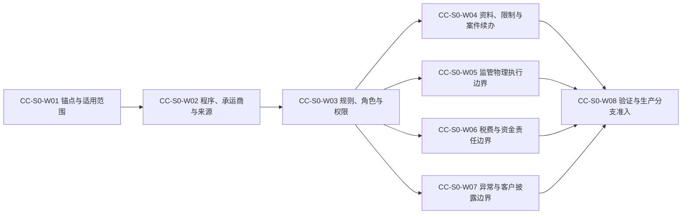

# IDP Parcel 关务切片 0 真实参数取证与生产语义准入交接

状态：业务取证与生产准入基线；选择约束、所有权边界和取证顺序已确认，真实试点实例及证据仍按参数登记册当前状态推进

本文把[关务与贸易合规专项开发基线](../product/CUSTOMS-FIRST-RELEASE-DEVELOPMENT-BASELINE.md)中的专项切片 0 组织成可执行的业务取证、核验和生产分支准入工作包。它只服务于产品主线中的 `PN-05` 关务控制域，不代表产品总体首发顺序；不重新定义领域规则，也不规定 API、数据库字段、消息 Schema、监管报文、MinIO 实施、渠道技术方案、部署拓扑或未经证据确认的国家、口岸、角色、阈值、时限和默认状态。

切片 0 不是要求所有参数完成后才允许编写任何代码。它区分：

- **稳定业务骨架**：不依赖具体国家、渠道和实例值的身份、版本、范围、结果分层、未配置、审计和恢复能力。
- **验证分支**：只能使用已批准的历史回放 `R` 或隔离模拟 `S` 证明业务语义，不取得生产权威。
- **生产分支**：只有所依赖参数均为`已确认`或有权威`本期不适用`依据，并完成相应准入决定后，才允许使用真实生产证据 `P`。

以上是交付和证据分层，不是领域对象的新生命周期状态。参数当前状态仍只由[首发试点参数与证据登记册](../product/PILOT-PARAMETER-REGISTER.md)维护。

## 交付目标与边界

切片 0 完成后，业务与开发团队能够：

- 确定本期真实锚点客户、责任法人、产品合同、成熟线路、出口和进口监管范围，而不是从测试数据或页面默认值推导适用范围。
- 对出口和进口分别登记真实监管程序、责任承运商、报关服务方、渠道账号、外部监管舱单来源以及各自的身份、版本、范围和变更语义。
- 对同一业务对象、事实类型、业务身份和适用范围内的外部事实、决定、动作和金额明确唯一权威形成方、传输来源、责任方和结果层；不同上下文继续分别拥有各自的事实或判断，不把“谁传来”误认为“谁拥有”。
- 分别确认请求、判断、授权、提交、结果解释、执行交接、实际执行、核对、关闭、重开和客户披露权限，不从企业类型、岗位名称、登录能力或管理员权限推导。
- 明确未就绪参数只阻断其依赖的生产分支；非依赖分支、稳定骨架和合格 `R/S` 验证可以继续。
- 形成逐生产分支的准入结论，使切片 1 至 6 的开发任务知道哪些只能实现骨架、哪些只能回放/模拟、哪些可以进入限量生产 backlog。

切片 0 不负责：

- 选择或替业务责任方决定真实客户、国家、线路、承运商、报关服务方、渠道、合同模式、税费责任或异常阈值。
- 把候选实例、口头说明、行业惯例、历史相似线路或测试账号标记为`已确认`。
- 保存真实客户名称、账号凭据、受限监管资料、合同副本或脱敏标识映射；仓库只保存受控证据索引。
- 实现外部渠道、财务系统、消息渠道、对象存储或节点设备集成。
- 以切片 0 完成代替限量生产 `Go/No-Go`、完整非功能验收或正式试点验收。

## 权威依据

| 职责 | 权威文档 | 本文如何使用 |
|---|---|---|
| 真实参数状态、证据责任和最低证据 | [首发试点参数与证据登记册](../product/PILOT-PARAMETER-REGISTER.md) | 唯一参数状态台账；本文不复制当前值 |
| 可选范围与明确排除项 | [首发试点范围](../product/PILOT-SCOPE.md) | 限制候选范围，不证明具体实例已确认 |
| 场景证据层级和验收门槛 | [首发试点验收场景矩阵](../product/PILOT-ACCEPTANCE-MATRIX.md) | 决定使用 `P/R/S` 的条件和证据责任 |
| 关务闭环与专项顺序 | [关务与贸易合规专项开发基线](../product/CUSTOMS-FIRST-RELEASE-DEVELOPMENT-BASELINE.md) | 确定专项切片 0 对切片 1 至 6 的准入责任 |
| 所有权与术语 | [领域上下文地图](../domain/CONTEXT-MAP.md)、[关务与贸易合规上下文](../domain/customs-compliance/CONTEXT.md) | 约束参数不能改变领域所有权 |
| 来源事实、有效判断和派生结果 | [ADR-0005](../adr/0005-source-facts-effective-events-derived-state.md) | 约束来源、解释、当前采用和历史不得覆盖 |
| 租户、法人和客户隔离 | [ADR-0003](../adr/0003-group-tenant-legal-entity-customer-account.md) | 约束集团、责任法人和客户账户不得互相代替 |

参数值、本文或开发任务之间发生冲突时，领域所有权和权威用例优先；参数登记册只实例化已确认规则，不能借参数配置改写领域规则。

## 准入层级与精确参数范围

| 层级 | 参数要求 | 可以开展 | 仍然禁止 |
|---|---|---|---|
| 稳定业务骨架 | 不要求真实实例参数已确认 | 身份、范围、版本、结果分层、显式未配置、审计、恢复和测试骨架 | 真实外部动作、当前结果解释、不可逆执行或金额成立 |
| 渠道或国家专属详细设计 | 31 项门槛参数完成：`PAR-COM-01/03/05/06/13`、`PAR-NET-01..09`、`PAR-CUS-01..07`、`PAR-INT-01..05`、`PAR-NFR-01..05` | 只对证据覆盖的真实程序、渠道和范围形成专属设计 | 从相邻国家、方向、渠道、伙伴或历史项目复制未证实语义 |
| 条件生产分支 | 在上述参数外，完成该分支的附加参数 | 已批准范围的税费/代垫、退运、自动异常或客户通知等分支 | 用一个分支的确认推导另一分支已就绪 |
| 限量生产 | 满足参数登记册的限量生产门槛和 `Go/No-Go` 决定 | 明确范围的生产证据 `P` | 以切片 0 文档完成或计划日期代替准入决定 |
| 正式验收 | 满足参数登记册的正式验收门槛 | 对实际执行记录、参数版本、在途对象和未关闭偏差形成可审计验收结论 | 以限量生产启动或局部生产证据代替正式验收 |

31 项详细设计门槛是参数登记册现有规则的精确展开，不是新增范围。条件分支至少包括：退运的 `PAR-NET-11`，真实客户通知的 `PAR-INT-06`，税费/实际代垫的 `PAR-SET-01/08`，异常与披露的 `PAR-VIS-04..07`，以及阶段治理参数。是否还有其他依赖，按具体生产分支和验收场景继续从参数登记册判定。

## 五项不可混用

切片 0 取证必须始终区分：

| 概念 | 要回答的问题 | 不能代替 |
|---|---|---|
| 业务责任方 | 谁依法或依合同承担该程序、动作或结果责任 | 不能由消息发送方、账号持有人或当前操作员代替 |
| 权威事实来源 | 哪个主体或系统有权形成该类来源事实 | 不能由 API、文件、Webhook 或人工录入方式代替 |
| 传输来源 | 本产品通过什么受控入口收到事实 | 不能因此取得事实所有权或结果解释权 |
| 业务身份与版本 | 外部对象、消息、结果和更正如何被唯一识别并保留历史 | 不能用本地任务号、文件名或到达顺序代替 |
| 结果层与当前采用 | 技术回执、监管接收、业务受理、查验、税费、放行等分别表示什么，以及哪一版本当前有效 | 不能把技术成功、承运商“已提交”或页面状态升级成更高结果层 |

## 依赖顺序

候选资料可以并行收集，但参数不能越过依赖直接确认。例如，账号可以先登记候选，却必须在程序、责任主体、账号持有人、授权范围和有效时间可共同核验后才可标记为`已确认`。

## 业务取证工作包

### `CC-S0-W01` 锚点客户、法人、产品、合同与线路适用范围

主责参数：`PAR-COM-01`、`PAR-COM-03`、`PAR-COM-05`、`PAR-COM-06`、`PAR-NET-01..03`。

执行工作单：[锚点范围首批证据请求工作单](./customs-slice-0-w01-evidence-request.md)。

交付：

- 核验 `CUST-PILOT-01`、`LEGAL-ENTITY-PILOT-01`、`LANE-PILOT-01` 的受控映射引用、选择决定、有效区间和相互适用关系。
- 固定唯一真实客户、责任法人、产品版本、合同版本、单一起运区域、出口路径、进口路径和目的服务区域。
- 证明所选线路是该客户持续运营的成熟线路，并能够取得关务、履约、异常和结算闭环证据。
- 记录候选被撤销或替换时的新旧标识关系、停止新增准入边界及在途对象处理责任，不复用旧脱敏标识。

阻断规则：任何一项未确认时，不得宣称真实出口/进口案件、生产渠道、客户责任、合同适用或端到端生产范围已经就绪；开发仍可完成稳定身份引用、隔离、显式未配置和测试骨架。

### `CC-S0-W02` 出口/进口程序、责任承运商与权威来源

主责参数：`PAR-CUS-01`、`PAR-CUS-02`、`PAR-INT-02`、`PAR-INT-03`。

执行工作单：[程序、承运商与权威来源证据工作单](./customs-slice-0-w02-source-evidence-request.md)。

交付：

- 出口和进口分别登记监管程序、方向、责任主体、报关服务方、渠道账号及本产品实际提交范围，不从另一方向复制配置。
- 分别登记出口和进口监管舱单的真实责任承运商；继续保持“承运商外部形成并提交，本产品只接收引用”的已确认边界。
- 对外部监管舱单登记来源身份、对象身份/版本、范围、形成与提交语义、更正/撤销/替代关系、后续结果来源和当前采用依据。
- 对本产品申报登记外部业务关联、结果来源，以及真实程序明确支持的原提交查询和安全再次发送语义；对承运商外部舱单引用只登记外部身份、版本、范围、来源事实、变更关系和后续结果，即使来源提供状态快照，也不建立本产品舱单查询或再次发送流程。两条链不能共用本地提交身份。
- 网络服务履约需要调用面单渠道时，通过 `PAR-INT-02` 登记真实渠道、账号持有人和授权；确实不适用时形成权威`本期不适用`依据。该渠道不能改变对客网络服务责任，也不能成为监管舱单来源的默认值。
- 建立逐来源、逐结果层的权威矩阵，至少区分技术回执、监管接收、业务受理、查验/扣留/处置、税费和放行。

阻断规则：责任承运商、来源契约、身份版本或结果层任一未确认时，只能实现引用、待关联、解释未决、冲突和未形成骨架；不得接收为生产当前结果，也不得创建本地监管舱单提交或查询流程。

### `CC-S0-W03` 关务规则、参与方角色与逐动作权限

主责参数：`PAR-CUS-03`、`PAR-CUS-04`。

执行工作单：[关务角色、逐动作权限与规则证据工作单](./customs-slice-0-w03-roles-permissions-evidence-request.md)。

交付：

- 对货物相关主体、进出口责任主体、申报人、报关服务方、渠道账号持有人、税费法定义务人、实际付款方和运营责任法人分别登记资格与适用范围。
- 分别登记请求、判断、人工复核、授权、实际提交、结果解释、关联修正、冲突处置、本产品原提交查询、关务执行协作事项建立、交接请求和关务核对权限。节点、运输和其他执行方的实际执行权限由相应执行上下文结合 `party-commercial` 权限治理形成；W03 只记录该权限的核验引用以及关务对交接和执行结果的核对权限，不能由关务权限矩阵授予或代替。
- 登记规则权威来源、版本、生效区间和适用时点；出口规则、进口规则和内部合规规则不得互相推导。
- 明确生产首发不启用自动申报；自动规则只可形成已明确授权的判断，不能替代逐次提交授权。
- 对监管凭证登记身份、范围、有效期、额度、占用单位，以及使用、释放、核销和迟到权威结果或后续监管更正所形成的调整、补充核销与冲突的权威结果依据。

阻断规则：登录成功、管理员身份、渠道账号可用、历史操作习惯或企业类型均不能补齐权限。缺少明确权限或规则时，相应判断和动作保持未决/未配置，不得先执行后补授权。

### `CC-S0-W04` 客户资料更正、内部限制与案件关闭后续办

主责参数：`PAR-COM-13`、`PAR-INT-01`、`PAR-CUS-06`、`PAR-CUS-07`。

交付：

- 确认接受后客户原始资料补充/更正的生产入口、允许资料组和字段、适用阶段、显式清空、请求方、决定方、基础版本、并发和迟到语义。
- 确认客户资料更正只形成不可覆盖来源版本，不能改变接受基线、成员、客户/法人/合同/产品或覆盖正式申报、实测、运输和费用事实。
- 对每类内部限制登记责任来源、对象/范围、受限动作、适用监管边界、形成/解除权限、规则版本和生效时间。
- 对每个锚点程序登记义务目录、终结依据、责任承接、关闭责任来源、受控重开和关联后续案件的分类与权限。
- 保留关闭、重开、后续案件、资料更正和来源事实各自生命周期，不允许任何一方级联回退其他事实。

阻断规则：`PAR-COM-13` 未确认时，客户资料版本骨架可开发，但不能开放生产字段或阶段；`PAR-CUS-06/07` 未确认时，不能自动关闭/重开案件、形成真实限制或解除限制。

### `CC-S0-W05` 查验、扣留、处置与退运执行责任

主责参数：`PAR-NET-04..09`、`PAR-NET-11`。

必须消费：`PAR-CUS-01..04`。

交付：

- 登记主通道节点顺序、自营节点、参与场站、日常揽收/干线/尾程伙伴及各自责任法人、服务范围和权威交接边界。
- 对查验、扣留、隔离、开封、重封、移交、销毁和退运分别登记合格执行方、授权范围、作业位置、证据能力和回接来源。
- 退运只有在真实路径、责任、费用和交接规则明确且纳入范围时才进入生产；否则只保留目标、关联与 `R/S` 验证。
- 保持关务决定、节点任务、运输准备、实际执行事实和关务核对分离；执行方页面或任务完成不能成为监管结果。

阻断规则：缺少执行方、路径、授权或证据规则时，只能形成`待交接`和相应未配置骨架，不得生产派发不可逆动作或创建无责任方的退运旅程。

### `CC-S0-W06` 税费、外部资金、实际代垫与客户回收边界

主责参数：`PAR-INT-04`、`PAR-INT-05`、`PAR-SET-01`、`PAR-SET-08`。

必须消费：`PAR-CUS-01..04`。

交付：

- 对出口和进口分别确认锚点程序是否产生税费、法定义务人、是否要求付款、付款覆盖范围及付款阻断的明确拟执行动作。
- 确认唯一财务系统边界能够分别提供实际付款、付款失败、追加付款、资金退回、付款撤销和事实更正结果；传输成功不能成为资金事实。
- 为每个日常主伙伴通过 `PAR-INT-04` 确认唯一供应商账单入口、账期和主张范围；供应商账单主张不能与履约事实、轨迹事实或外部资金事实合并。
- 确认实际代垫的合格付款方、运营责任法人、客户最终承担责任、合同依据、结算账户、币种、换算依据和调整条件。
- 监管核定、外部资金事实、实际代垫、客户代垫回收和服务费分别形成；客户实际付款/到账事实由银行、支付或财务来源形成，运营应收核销关系由 `settlement-accounting` 形成。任何一层不能由相邻金额相等推导。
- 锚点程序确实不适用税费或代垫时，登记权威`本期不适用`依据，不保留看似可用的空生产分支。

阻断规则：税费、付款或资金结果层未确认时，不得形成生产付款覆盖、实际代垫、客户代垫回收或付款驱动的放行门禁；不影响无税费且已有权威不适用依据的其他范围。

### `CC-S0-W07` 关务异常、协调响应与逐客户披露

主责参数：`PAR-VIS-04..07`、`PAR-INT-06`。

交付：

- 只从锚点线路历史中选择能够由各源上下文已接受事实可靠识别、且有责任团队和处置入口的最小异常类型；各源上下文仍拥有原业务事实，`visibility-exception` 只据此形成异常信号、分诊、案件和处置请求，正常查验、扣留、等待和资料补充不自动成为异常。
- 由 `visibility-exception` 分别登记异常信号、分诊、重复与发作期、自动建案条件、首次响应、下一行动、客户更新和解决目标。
- 由 `visibility-exception` 登记逐客户最小披露、披露决定、内容快照、通知义务、模板版本和人工/自动授权；通过 `PAR-INT-06` 另行登记消息渠道、内容更正和渠道结果语义。
- 保持源业务事实、异常信号与案件、披露决定与内容快照、消息渠道提交、渠道接受、送达、失败和客户确认分层；`visibility-exception` 拥有披露决定、内容快照和通知义务判断，消息能力拥有渠道提交及其接受/送达/失败/客户确认结果；消息能力不能形成披露决定，渠道接受不等于送达，送达不等于客户确认。
- 自动建案和自动发布只有在严格范围完成回放或影子验证并取得准入决定后启用；其他范围保持人工分诊或草稿确认。

阻断规则：参数未确认时，源上下文事实、`visibility-exception` 的异常/披露骨架和消息能力的渠道结果骨架可以分别开发，但相应生产分支必须保持未配置，并继续遵守上述所有权分层；现有业务即使另有人工受控流程，也不能把临时操作解释为本产品通知渠道或异常分支已就绪。不得启用自动建案、自动发布或虚构响应时限。

### `CC-S0-W08` 复杂验证、证据索引与生产分支准入

主责参数：`PAR-CUS-05`、`PAR-NFR-01..05`、`PAR-GOV-01..07`、`PAR-GOV-09`、`PAR-GOV-11`。

交付：

- 为正常主链和每个未自然发生的高风险分支指定 `P`、`R` 或 `S` 证据层级；不得为了验收主动制造拒绝、查验、重复申报、错误舱单、冲突、迟到结果或真实金额。
- 确认历史回放数据范围、影子运行范围、差异口径和限量生产准入单元；对同一业务对象、事实类型、业务身份和适用范围确认唯一权威形成方，不把关务、节点、运输、异常和结算分别拥有的事实或判断压缩成同一写入权；不同事实类型或上下文可以各自拥有其权威结果。
- 在锚点范围确认后取得 `PAR-NFR-01..05` 的真实观察期、日均/峰值业务量、包裹与集运规模、事件放大倍数和业务增长余量；行业估算只能登记缺口，不能成为详细设计门槛证据。
- 确认阶段决定权限、紧急暂停硬风险、最小暂停范围、恢复证据、回退/接管边界和偏差阻断规则。
- 在 `PAR-GOV-11` 只登记已经由基础设施责任方完成核验的证据平台引用、逻辑命名空间、对象版本和访问责任；本文不细化 MinIO 实施。
- 按生产分支形成准入清单，记录所依赖参数版本、证据版本、当前允许的 `P/R/S` 层级、剩余偏差和决定方。

阻断规则：合格验证环境未就绪时，高风险复杂分支不能转为生产 backlog；证据平台未就绪时，临时文件、邮件或个人目录不能作为正式准入证据，但不阻止团队继续收集候选资料并登记`待核验`。

## 证据包最小内容

每个参数可以引用一个或多个受控证据对象，但提交核验时必须形成一个可审计证据包。下表是业务取证要求，不是 API、表结构或对象存储路径规范。

| 内容 | 要求 |
|---|---|
| 参数与候选 | 参数 ID、稳定脱敏标识、候选业务断言；候选不能写成已确认事实 |
| 适用范围 | 租户、责任法人、客户账户、产品/合同、线路、监管程序、方向、动作、对象或事实类型中的适用组合 |
| 责任分离 | 事实所有者、证据提供方、业务核验方和最终决定方分别记录 |
| 来源与版本 | 权威证据索引、对象版本、生效时间、失效时间或明确当前有效性 |
| 业务语义 | 该证据能证明什么、不能证明什么；外部代码或页面文案须关联受控语义解释 |
| 身份与关系 | 业务身份、消息身份、版本、更正/撤销/替代关系和重复边界 |
| 冲突与缺口 | 相反证据、候选差异、尚未核验内容和对应生产阻断范围 |
| 核验与决定 | 核验结论、依据版本、决定人/角色、决定时间和生效范围 |

账号密钥、真实映射、完整合同、个人信息和受限监管内容不得写入仓库。登记册只保存脱敏标识、证据索引、版本、有效时间和访问责任。

## 外部来源权威矩阵

`CC-S0-W02` 和 `CC-S0-W06` 至少要为每个真实来源形成以下业务矩阵。矩阵可以由受控证据对象承载，参数登记册只引用其版本。

| 维度 | 必须回答 |
|---|---|
| 业务对象或事实类型 | 本产品申报、承运商外部监管舱单、监管结果、履约事实、轨迹事实、资金事实或消息结果中的哪一类 |
| 业务责任方与事实所有者 | 谁承担责任，谁有权形成该来源事实 |
| 传输来源 | 通过哪个伙伴、服务方、系统和受控入口收到 |
| 身份与版本 | 来源身份、业务身份、消息身份、版本和唯一关联范围如何确定 |
| 时间语义 | 来源时间、业务发生时间、适用时间、接收时间和快照截至时间分别如何解释 |
| 结果层 | 该来源可以形成哪些结果层，明确不能形成哪些结果层 |
| 变更关系 | 重发、重复、更正、撤销、替代、迟到和查询快照如何关联 |
| 冲突处理 | 来源响应冲突、不同来源结果冲突、冲突前当前判断和依赖动作门禁由谁复核 |
| 当前采用 | 何种权威规则决定当前采用版本；不得按最后到达覆盖 |

## 参数状态与局部准入规则

- `待提供`表示尚无足以核验的证据，不得为赶进度填候选默认值。
- `待核验`表示候选和部分证据已存在，但最低证据、责任核验或决定尚未完成；它不允许生产。
- `待决策`表示两个或多个合格候选仍需有权决定方选择；候选列表不能同时成为当前配置。
- `已确认`必须同时具有证据索引、版本/有效时间、适用范围、证据责任和生效决定。
- `本期不适用`必须说明真实锚点范围为何不适用及其权威依据，不能仅因实现困难使用。
- `已失效`保留历史，不得改回`待提供`或用新值覆盖；替代实例形成新版本或新登记关系。
- 一个参数确认只解除直接依赖它的阻断。上游客户、法人或线路改变时，所有依赖该适用范围的确认都必须重新核验，不能静默沿用。
- 同一工作包允许部分参数先确认，但生产分支必须按其完整依赖集合判断；非交集分支不因无关参数缺失被一并阻断。
- 切片 1 至 6 可以并行实现稳定骨架；任何真实外部动作、当前结果解释、不可逆物理执行或金额成立都必须等待对应切片 0 分支准入。

## 第一批取证顺序

第一批只收集能够固定真实适用范围和外部舱单责任链的证据，不同时要求业务团队填完全部 71 个参数：

1. 完成 `PAR-COM-01/03/05/06` 与 `PAR-NET-01..03` 的候选证据核验，确认客户、责任法人、产品合同和线路适用范围。
2. 分别为 `PAR-CUS-01` 和 `PAR-CUS-02` 提交出口/进口程序证据包，不以一方资料推导另一方。
3. 为出口、进口外部监管舱单分别提交真实责任承运商和来源契约，回填 `PAR-INT-03` 的来源身份、版本、范围和变更能力。
4. 依据上述真实实例启动 `PAR-CUS-03` 权限核验和 `PAR-CUS-05` 验证环境盘点。
5. 第一批核验完成后，再并行推进资料更正、限制/关闭、执行、资金和异常披露工作包。

第一批尚未取得真实证据时，文档和开发任务应保持现有`待提供`或`待核验`，不得把本文中的取证要求当成实际值。

## 切片完成定义

切片 0 的某一生产分支只有同时满足以下条件才完成准入：

1. 该分支依赖的参数全部为`已确认`或具有权威`本期不适用`依据，且证据版本与适用范围完整。
2. 同一业务对象、事实类型、业务身份和适用范围内的每个外部事实、决定、动作和金额都只有一个明确权威形成方；事实所有者、传输来源和业务决定方没有混用，不同上下文的独立结果不被合并。
3. 出口和进口程序、申报链与承运商外部监管舱单链分别登记，未从相邻方向、线路或渠道复制语义。
4. 请求、判断、授权、实际动作和结果解释权限分别核验，未使用管理员、登录或企业类型作为万能授权。
5. 来源身份、业务身份、消息版本、范围、时间、结果层、更正/撤销/替代和当前采用规则能够通过合格样本重复验证。
6. 未自然发生的高风险分支已有获准的 `R/S` 证据方案；生产不会为了验收主动制造监管、物流、资金或客户风险。
7. 每个未准入分支都有明确阻断范围、责任方和续办入口；不存在开发自行补默认值的“临时放行”。
8. 参数登记册已经更新当前状态和证据索引，准入决定能够追溯到实际采用的参数及证据版本。

完成切片 0 只证明指定生产分支具备真实业务语义准入，不证明整个试点已经通过限量生产或正式验收。其余参数仍须遵守参数登记册中的渠道/国家详细设计、限量生产和正式验收门槛。
