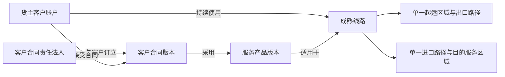

# IDP Parcel `CC-S0-W01` 锚点范围首批证据请求工作单

状态：业务取证执行模板；只定义提交、核验和开发交接要求，不维护参数当前值

本文执行[关务切片 0](./customs-slice-0-business-development-handoff.md)中的 `CC-S0-W01`，用于取得真实锚点客户、责任法人、服务产品、客户合同、成熟线路及出口/进口适用区域的首批证据。真实候选标识、当前状态、证据索引和生效决定仍只在[首发试点参数与证据登记册](../product/PILOT-PARAMETER-REGISTER.md)中维护。

本文不保存真实客户名称、法人名称、合同正文、线路真实映射、个人信息、账号凭据或受限监管资料，也不规定 API、数据库字段、消息 Schema、对象存储路径、审批系统或 MinIO 实施。

## 本次必须固定的关系

这些关系必须同时在一个明确有效期间内成立。证明其中一个对象真实存在，不能推导其他对象或关系已经成立。

## 七项不可混用

| 对象 | 本次要证明 | 不能用来代替 |
|---|---|---|
| 货主客户账户 | 集团租户内真实客户业务隔离和商业关系 | 客户法人、联系人、登录用户或结算账户 |
| 客户合同责任法人 | 与该客户签约、承担客户服务责任并拥有客户运营应收的运营企业法人 | 运营集团、仓库、操作组织或实际履约法人 |
| 服务产品版本 | 运营企业已经发布并对客户提供的网络服务产品版本 | 外部渠道产品、价卡、线路或客户合同 |
| 客户合同版本 | 责任法人与客户在明确期间接受的商务和服务条件 | 服务产品版本、报价单、账单或口头承诺 |
| 成熟线路 | 该客户持续真实运营且可取得端到端闭环证据的一条线路 | 单段运价、路由候选、计划路径或一次运输记录 |
| 起运区域与出口路径 | 实际适用的单一起运监管区域及出口路径 | 收货仓城市、发件人地址或默认国家配置 |
| 进口路径与目的服务区域 | 实际适用的单一进口路径、监管区域及目的服务范围 | 收件国家、尾程产品名称或目的地址覆盖 |

对象身份和所有权继续遵守[参与方与商业上下文](../domain/party-commercial/CONTEXT.md)、[网络与路由上下文](../domain/network-routing/CONTEXT.md)和 [ADR-0003](../adr/0003-group-tenant-legal-entity-customer-account.md)。本工作单不能通过参数取证改变这些领域边界。

## 证据提交封面

业务方提交的受控证据包应在仓库外保存真实内容，并向登记册提供以下可审计信息：

| 内容 | 提交要求 |
|---|---|
| 覆盖参数 | 明确列出本证据支持的参数 ID；同一证据可以支持多项参数，但必须逐项解释 |
| 候选引用 | 使用登记册中的稳定脱敏标识；真实映射只提供受控索引和访问责任 |
| 候选断言 | 用一句可核验的话说明准备证明什么，不能把“拟选”写成“已确认” |
| 适用范围 | 客户账户、责任法人、产品版本、合同版本、线路、方向、区域和有效期间的适用组合 |
| 证据对象 | 受控对象标识、版本、生效时间、失效时间或明确的当前有效性 |
| 证明边界 | 分别说明证据能证明什么、不能证明什么 |
| 责任分离 | 证据提供方、各领域核验方、最终决定方和登记册更新责任分别明确 |
| 冲突与缺口 | 列出相反证据、版本差异、无法核验内容和受影响的生产范围 |
| 撤销与替换 | 说明证据或候选失效时由谁决定停止新增、撤销选择并处理在途对象 |

邮件、个人目录、临时链接或仓库内的真实映射不能成为正式证据索引。一个文件被成功上传，也不表示其业务断言已经核验通过。

## 分参数证据要求

### `PAR-COM-01` 真实锚点货主客户

必须提交：

- 货主客户账户的稳定脱敏标识及受控真实映射引用。
- 当前有效客户关系、有效合同和明确试点授权的证据引用。
- 商业、运营、网络规划、客户接入、技术和结算分别对本领域硬门槛的核验结论。
- 该客户持续使用拟选成熟线路，并能够提供接单、履约、关务、异常和结算闭环证据的证明。
- 有权决定方对合格候选的最终指定依据；收入、业务量或配合便利性不能单独成为指定依据。

不能据此推导：客户合同责任法人、产品版本、合同版本和线路已经分别确认。它们仍须完成各自参数核验。

### `PAR-COM-03` 客户合同责任法人

必须提交：

- 责任法人的稳定脱敏标识及受控法人主数据引用。
- 当前合同主体、客户服务责任和客户运营应收责任的证据。
- 责任范围、生效时间、失效时间，以及与客户账户和合同版本的明确关系。
- 合同签署主体与日常作业主体不一致时，各自角色及责任边界的说明。

运营集团、仓库、操作组织、当前登录组织或实际履约法人均不能自动代替合同责任法人。

### `PAR-COM-05` 服务产品及版本

必须提交：

- 已发布服务产品版本的稳定标识、版本、生效区间和当前适用性依据。
- 该版本属于网络服务产品，并适用于锚点客户、合同和线路的证明。
- 服务范围、责任边界和关键适用条件的受控业务说明。
- 后续版本、退役或暂停存在时，当前版本为何仍适用于本次范围的判断依据。

外部承运商产品、渠道产品、尾程产品或单份价卡不能代替运营企业服务产品版本。

### `PAR-COM-06` 客户合同版本与有效期

必须提交：

- 客户合同的稳定标识、版本、生效区间、当前有效性和受控合同证据索引。
- 客户账户、合同责任法人、服务产品版本和线路适用范围之间的明确关系。
- 本次试点授权、服务责任和端到端业务验证的依据；数据使用另有合同约束时，提供相应条款引用。
- 存在补充协议、续签、变更或到期安排时，版本关系和当前采用依据。

报价、口头承诺、历史合同或后续续签计划不能替代当前有效合同版本。

### `PAR-NET-01` 成熟主力线路

必须提交：

- 线路的稳定脱敏标识及受控真实映射引用。
- 能证明该客户持续真实运营的近期业务记录和适用观察期间。
- 正常时效分布、主要节点、交接边界和各阶段责任范围。
- 接单、集货/分拣、出口、干线、进口、尾程、异常和结算证据的可取得性说明。
- 线路范围变化、临时改路和异常切换与稳定主线路的区分依据。

单份价卡、单段运输产品、一次成功运输、未来路由计划或业务量排名不能单独证明线路成熟。

### `PAR-NET-02` 始发国家或关务区域

必须提交：

- 单一起运区域、实际出口监管区域和出口路径的受控引用。
- 线路主数据、现行运营事实和实际监管路径之间的一致性证据。
- 起点节点、出口节点、监管区域和出口程序之间的区别与关系。
- 存在转关、跨区集货或多个候选出口路径时，本期唯一适用路径的决定依据。

仓库所在地、发件地址、航班起点或国家默认值不能自动成为出口监管区域。

### `PAR-NET-03` 目的国家或关务区域

必须提交：

- 单一进口路径、实际进口监管区域和目的服务区域的受控引用。
- 线路主数据、现行运营事实、进口路径和尾程服务范围的一致性证据。
- 进口节点、监管区域、目的服务区域和最终收件范围之间的区别与关系。
- 存在转关、异地清关或多个进口候选路径时，本期唯一适用路径的决定依据。

收件国家、目的地址、尾程承运商覆盖或渠道产品名称不能自动成为进口监管区域。

## 跨参数一致性核验

七项参数逐项证据充分后，还必须完成以下交叉核验：

1. 合同中的客户相对方与该客户账户所代表的受控客户关系一致；客户账户本身不冒充客户法人，客户联系人或集团名称也没有替代客户账户身份。
2. 合同签约运营法人、客户服务责任法人和客户运营应收责任法人符合已确认的同一责任边界；存在差异时必须先形成权威解释，不能由项目组自行归并。
3. 合同版本明确采用服务产品版本；产品后续发布、退役或暂停没有静默改写合同。
4. 客户和产品均真实适用于所选线路，线路不是从价卡、渠道名称或一次历史记录推导。
5. 线路的起运区域、出口路径、进口路径和目的服务区域形成完整连续范围，没有用国家或城市默认值补空。
6. 客户、法人、产品、合同和线路证据的有效期间存在共同交集，并覆盖拟试点期间。
7. 关务、履约、异常和结算证据能够在同一脱敏业务范围内关联，但各自事实所有权仍然分离。
8. 任一候选、合同、产品或线路发生变化时，依赖关系重新核验；新候选不复用旧脱敏标识，也不覆盖旧证据。

任一交叉关系冲突时，七项参数不能以“各自文件都存在”为由整体确认。

## 核验结论与登记册动作

本工作单不建立新的参数状态。核验完成后只允许由登记册责任方执行以下动作：

| 核验结论 | 登记册动作 |
|---|---|
| 证据完整、一致，责任与有效期间明确，并取得有权决定 | 将对应参数及证据版本更新为`已确认` |
| 已取得候选或部分证据，但最低证据或交叉关系未完成 | 保持或更新为`待核验`，登记精确缺口和局部阻断范围 |
| 尚无可核验候选或证据 | 保持`待提供`，不得用默认值补齐 |
| 多个合格候选仍需有权决定方选择 | 使用`待决策`，候选不能同时成为当前配置 |
| 证据冲突、过期或无法证明当前适用 | 不得确认；登记冲突、责任方和续办要求 |
| 已选锚点失去任一硬门槛 | 停止新的试点准入，由有权决定方显式撤销；替代候选重新完成全部核验 |

本工作包七项均是已确认首发范围所必需的身份和适用边界。不能仅因资料难以取得而登记为`本期不适用`；如真实业务证明其中一项确实不存在，应先重新决策首发范围，而不是在本工作包局部绕过。

锚点撤销或替换不自动取消、迁移或改写已纳入的在途委托；在途处理继续遵守登记册中的回退与接管边界。

## 给开发的交接

证据尚未确认时，开发可以继续：

- 支持客户、法人、产品、合同、线路和区域的稳定不透明引用及版本关系。
- 支持有效期间、适用范围、历史关系、跨客户/法人隔离和显式未配置结果。
- 使用合成或脱敏测试身份验证关系完整性、冲突和候选替换，不把测试身份解释为生产实例。

开发仍然不得：

- 将候选脱敏标识、显示名称、国家、城市、渠道或价卡写成生产默认值。
- 把客户账户、责任法人、合同、产品和线路压缩成一个“客户配置”。
- 因某一项参数确认而推导其他六项已确认。
- 在七项范围未共同核验前宣称真实出口/进口案件、生产渠道或端到端生产范围已经就绪。

七项参数全部确认，只解除锚点身份与适用范围阻断。渠道或国家专属详细设计仍需继续完成 `CC-S0-W02` 至 `CC-S0-W08` 所依赖的其他参数。

## 首次提交清单

业务责任方可以按证据责任分批提交；完成 `CC-S0-W01` 交叉核验前，汇总证据必须覆盖：

- 七项参数分别对应的受控证据索引和版本。
- 客户、法人、产品、合同、线路、出口范围和进口范围的关系说明。
- 各领域硬门槛核验方及结论。
- 有效期间交集和拟试点适用期间。
- 已知冲突、缺口、过期风险及其责任方。
- 最终决定方的授权依据和决定记录引用。

提交后由业务核验方逐项形成结论，再由登记册责任方更新唯一当前状态。未提交真实证据前，本工作单本身不能作为任何参数已就绪的证明。
