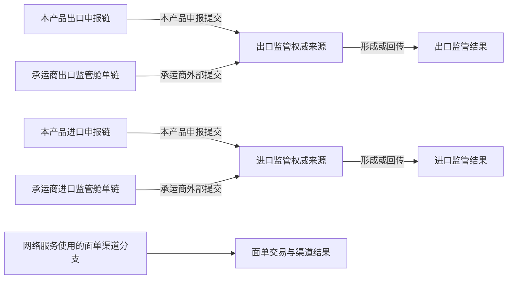

# IDP Parcel `CC-S0-W02` 程序、承运商与权威来源证据工作单

状态：业务取证执行模板；只定义程序、责任、来源和结果语义的核验要求，不维护参数当前值

本文执行[关务切片 0](./customs-slice-0-business-development-handoff.md)中的 `CC-S0-W02`，覆盖 `PAR-CUS-01`、`PAR-CUS-02`、`PAR-INT-02` 和 `PAR-INT-03`。真实国家、监管程序、责任承运商、服务方、渠道、账号、来源契约、当前状态和证据索引仍只在[首发试点参数与证据登记册](../product/PILOT-PARAMETER-REGISTER.md)中维护。

本文不规定监管报文、API、数据库字段、消息 Schema、渠道 SDK、文件目录、凭据保存、MinIO 实施或未经证据确认的结果代码、查询间隔、重发时限和默认程序。

## 权威依据

| 主题 | 权威来源 |
|---|---|
| 关务对象、所有权与生命周期 | [关务与贸易合规上下文](../domain/customs-compliance/CONTEXT.md) |
| 参与方、代理关系和渠道账号授权 | [参与方与商业上下文](../domain/party-commercial/CONTEXT.md) |
| 运输舱单、实际承运和运输事实 | [运输履约上下文](../domain/transport-fulfillment/CONTEXT.md) |
| 节点扫描、实测和节点作业事实 | [节点作业上下文](../domain/node-operations/CONTEXT.md) |
| 轨迹投影、标准里程碑和可见性判断 | [全程追踪与异常上下文](../domain/visibility-exception/CONTEXT.md) |
| 本产品提交版本、尝试和原提交恢复 | [UC-CC-005](../application/customs-compliance/UC-CC-005-FREEZE-SUBMISSION-AND-INITIATE-ATTEMPT.md) |
| 外部结果关联、解释和冲突 | [UC-CC-006](../application/customs-compliance/UC-CC-006-RECEIVE-AND-RECONCILE-EXTERNAL-RESULTS.md) |
| 承运商外部监管舱单引用 | [UC-CC-012](../application/customs-compliance/UC-CC-012-RECEIVE-AND-RELATE-EXTERNAL-REGULATORY-MANIFEST.md) |
| 来源事实、有效判断和派生结果 | [ADR-0005](../adr/0005-source-facts-effective-events-derived-state.md) |

证据、参数或本工作单与上述权威规则冲突时，权威领域文档和用例优先；参数不能借配置改变所有权。

## 前置关系

`CC-S0-W01` 的锚点客户、责任法人、产品合同和线路范围是 W02 最终确认的前提。W02 候选资料可以并行收集，但在 W01 适用范围确认前：

- 不能把候选程序或来源解释为该客户、合同和线路的生产配置。
- 不能从国家、渠道历史项目或相似线路复制出口/进口语义。
- 只能形成来源身份、版本、范围、结果层、未配置和冲突处理的稳定骨架。

W02 只确认真实程序、参与方、来源能力和结果语义。逐动作权限由 `CC-S0-W03` 核验，规则适用性由 `PAR-CUS-04` 核验，复杂重复、冲突、乱序和恢复验证由 `PAR-CUS-05` 负责；本工作单不能代替它们。

## 可能存在且必须分开的五条链

锚点范围实际存在的链即使由同一家企业、同一个账号或同一个技术入口提供，也必须分别登记身份、责任、范围和结果层。本产品申报链只在真实程序由本产品发起申报时存在；面单渠道分支只在网络服务实际调用渠道时存在，且不属于监管申报或监管舱单链。不适用链必须有真实依据，不能保留看似可用的空配置。

## 角色与来源不可混用

| 概念 | 必须回答 | 不能据此推导 |
|---|---|---|
| 监管程序 | 哪个辖区、方向、程序和法定义务范围适用 | 国家相同不表示程序相同 |
| 进出口责任主体 | 谁依法承担该程序中的责任 | 不能由客户、账号持有人或操作员自动代替 |
| 报关服务方 | 谁依据委派提供申报服务 | 不必然是责任主体、渠道服务方或账号持有人 |
| 责任承运商 | 谁拥有外部监管舱单的形成与提交责任 | 代理商、消息发送方或实际运输承运商不能自动代替 |
| 渠道服务方或承运商代理商 | 谁提供商业或技术通道 | 不能仅因传输消息取得舱单所有权或监管决定权 |
| 渠道账号持有人 | 账号由谁持有，谁授权本次范围使用 | 拥有凭据不等于拥有业务授权或事实所有权 |
| 传输来源 | 本产品从哪个受控入口收到信息 | API、Webhook、文件或人工入口不是事实所有者 |
| 监管决定来源 | 谁有权形成监管接收、受理、查验、税费或放行事实 | 承运商“已提交”或渠道技术成功不能代替 |

同一企业可以同时承担多个角色，但每个角色都必须有独立证据和适用范围。承运商代理商、转售商或聚合平台是参与方关系和交易角色，不是永久企业类型。

## 分参数证据要求

### `PAR-CUS-01` 出口监管程序、服务方和渠道

必须提交一份仅适用于出口方向的证据包，至少包括：

- 监管辖区、出口方向、程序身份、法定义务范围和有效期间。
- 出口责任主体、申报人、报关服务方、实际提交方、渠道服务方和渠道账号持有人及其关系。
- 本产品在该程序中实际拟发起的动作范围；未由本产品发起的动作必须明确排除。
- 本产品申报的外部业务身份、提交版本/尝试与外部关联方式，以及来源能够形成的结果层。
- 出口监管结果代码与技术回执、监管接收、业务受理、过程决定、税费和放行等业务层次的版本化解释依据。
- 来源时间、业务发生时间、适用时间、接收时间和查询快照截至时间的语义。
- 补充、更正、撤销、重报和替代关系在真实程序中的身份保持及生效依据；动作权限和适用规则仍交由 W03、`PAR-CUS-04` 核验。
- 出口外部监管舱单责任承运商、来源契约和后续监管结果来源，且与本产品出口申报链分开。

只有真实出口程序支持时，才能登记本产品原提交查询、“无记录”和安全再次发送语义。查询或再次发送不得扩展到承运商外部监管舱单。

### `PAR-CUS-02` 进口监管程序、服务方和渠道

必须按与出口相同的证据维度提交一份独立进口证据包，并额外证明：

- 进口辖区、程序、责任主体、申报模式、服务方、渠道和账号没有从出口配置复制。
- 进口结果代码、范围粒度、时间语义、税费和放行关系采用进口程序自己的权威依据。
- 进口外部监管舱单具有独立责任承运商、外部身份、范围、来源版本和变更关系。
- 同一企业或同一技术入口同时服务出口与进口时，两条链仍有明确方向、程序、身份和适用范围。
- 进口程序不支持某项出口动作或结果层时，显式记录不适用依据，而不是保留空的可用配置。

出口证据充分不能推导进口证据充分；反之亦然。

### `PAR-INT-02` 面单渠道和账号

本参数只处理网络服务履约过程中是否实际调用面单渠道：

- 如适用，提交渠道产品、渠道服务方、账号持有人、账号使用授权、产品—渠道映射、有效期间和适用范围证据。
- 区分运营企业渠道账号与客户自有账号；客户自有账号必须有明确授权双方、范围和有效期。
- 区分渠道服务方、承运商代理商、合同与结算相对方、底层承运商、实际承运商和责任承担方。
- 证明调用渠道不改变运营企业对客户承担的网络服务责任。
- 如锚点网络服务不调用面单渠道，提供基于真实产品和线路的权威`本期不适用`依据。

面单渠道不能成为出口/进口申报渠道、监管舱单来源或责任承运商的默认值。技术上能够访问账号也不能证明有权生产使用。

### `PAR-INT-03` 外部履约、轨迹与承运商监管舱单主数据源

W02 作为本参数的主责工作包，必须汇总锚点线路全部适用外部来源；关务生产分支重点消费监管舱单与监管结果行，但不能只完成关务子集就把整个 `PAR-INT-03` 标记为已确认。证据至少包括：

- 对每个外部揽收、干线、尾程和其他履约伙伴，逐事实类型列明承运接受、收寄、交接、移动、到达、派送与交付等适用事实的一种主要生产来源。
- 对节点或伙伴提供的扫描与轨迹数据，逐来源列明原始事件、来源里程碑、业务时间、范围和版本；轨迹接入不能绕过节点或运输上下文直接制造相应源业务事实。
- 出口、进口分别列明责任承运商、外部监管舱单和后续监管结果的一种主要生产来源。
- 来源提供方、事实所有者、责任承运商、传输中介和本产品接收入口分别登记。
- 外部监管舱单身份、版本、方向、程序、范围、形成/提交来源事实和更正/撤销/替代关系。
- 原始样本能够证明消息身份、业务身份、来源序列、版本、时间语义和唯一关联范围。
- 后续监管回执或决定由谁形成、由谁传输，以及来源最多能够证明到哪个结果层。
- 重复、同身份不同内容、不同来源冲突、待关联、迟到版本和来源不可用时的业务处理依据。

代理商或平台可以是传输来源，但不能因此替代责任承运商。承运商提供的“已形成”或“已提交”只形成相应承运商来源事实；只有可验证监管来源才能形成监管接收、业务受理或更高监管结果。

外部履约或轨迹来源提供数据，不改变领域所有权：`transport-fulfillment` 拥有运输交接、移动和交付事实，`node-operations` 拥有节点扫描、实测和作业事实，`visibility-exception` 只在各源上下文已接受事实之上形成标准里程碑、轨迹投影和可见性判断。自营环节由本产品内部源上下文形成事实时，应在来源目录中明确为内部权威来源，不虚构外部伙伴。

## 每个来源必须形成的权威矩阵

锚点范围实际存在的出口申报、进口申报、出口外部监管舱单、进口外部监管舱单、适用面单渠道，以及逐伙伴逐事实类型的外部履约与轨迹来源，必须分别形成来源记录；不适用链只登记权威不适用依据，不创建空来源行。每行至少回答：

| 维度 | 核验要求 |
|---|---|
| 对象或事实类型 | 明确是本产品申报、外部监管舱单、监管结果还是面单渠道结果 |
| 方向与程序 | 监管来源登记出口/进口、辖区、程序和法定义务范围；非监管来源登记产品、线路阶段和适用范围 |
| 责任与所有权 | 业务责任方、事实所有者及其证据；监管舱单另须登记责任承运商 |
| 参与方关系 | 服务方、代理商、账号持有人、实际提交方和传输方 |
| 身份 | 外部业务身份、消息身份、版本、来源序列和唯一范围 |
| 时间 | 来源、业务发生、适用、接收和快照截至时间 |
| 可形成结果 | 该来源能形成的最高结果层及明确不能形成的结果 |
| 变化 | 重复、重发、更正、撤销、替代、迟到和查询快照关系 |
| 冲突 | 来源响应冲突、外部结果冲突、待关联和解释未决的责任入口 |
| 当前采用 | 哪个权威规则决定当前采用版本；不得按最后到达覆盖 |

“每类对象一种主要生产来源”只约束同一伙伴、业务对象或事实类型、业务身份和适用范围，不会把申报、舱单、履约、轨迹和监管结果压缩成一个全局来源。

## 结果层核验

真实程序不一定产生下列每一层，但证据必须明确哪些存在、哪些不存在及依据：

1. 发送意图或待发送结果。
2. 实际发起与技术回执。
3. 承运商外部舱单已形成或已提交来源事实。
4. 监管机构接收。
5. 业务受理或拒绝。
6. 查验、扣留、资料补充或其他过程决定。
7. 监管核定税费及其更正。
8. 全部、部分或附条件放行。
9. 撤销、替代或其他后续监管结果。

技术成功不能自动升级为监管接收，监管接收不能自动升级为业务受理，承运商已提交不能代替任何监管结果，付款完成也不能制造放行。

## 身份、查询与变化边界

- 关务案件、申报单元、本产品提交版本、本产品提交尝试、外部业务关联、消息身份、外部监管舱单身份和运输舱单身份分别存在。
- 本产品原提交查询必须绑定原提交尝试、渠道和范围；查询快照需保留截至时间，“无记录”不能直接证明原提交从未到达。
- 只有形成安全再次发送判断后，才允许对同一提交版本建立新的受控尝试；超时不能盲目换身份重发。
- 外部监管舱单更正、撤销或替代只由责任承运商来源提供，本产品形成新引用版本和关系，不修改原引用。
- 对承运商舱单的来源状态查询若由外部提供，只作为接收证据；本产品不建立舱单查询、重发、更正或替代动作。
- 来源身份相同且业务内容相同可以识别为重复；同一消息身份携带不同内容形成来源响应冲突，不得覆盖。
- 不同合格来源对同一业务范围给出互不兼容结果时形成外部结果冲突；在责任复核前不得按最后到达选取当前结果。

## 最小业务核验样本

W02 每条真实链至少需要一个能够脱敏复核的现行样本：

| 样本 | 必须证明 |
|---|---|
| 本产品出口申报 | 程序、责任角色、提交身份/版本、外部关联及分层结果 |
| 本产品进口申报 | 与出口独立的程序、身份、来源和结果解释 |
| 出口外部监管舱单 | 责任承运商形成/提交、本产品接收引用及后续结果来源 |
| 进口外部监管舱单 | 独立进口范围、责任承运商、版本关系及后续结果来源 |
| 面单渠道（如适用） | 渠道产品、账号持有人、使用授权和渠道业务结果边界 |
| 外部履约与轨迹来源 | 每个伙伴、每类适用事实的来源身份、业务身份、时间、范围及其能够证明和不能证明的结果 |

如果本产品在某方向不发起申报，不能伪造正常提交样本；应提交真实不适用依据并只核验实际存在的外部链。复杂冲突、重复、乱序和恢复样本由 `PAR-CUS-05` 后续规划，W02 不要求在生产主动制造。

## 登记册动作与阻断

本工作单不建立新的参数状态。证据可以分批提交，但只有对应参数的程序、责任、身份、来源、结果层、变化关系、有效期间和适用范围均完整，并取得有权决定后，登记册责任方才可更新为`已确认`或有权威依据的`本期不适用`。

出现以下任一情况时，相应生产分支继续保持未配置：

- W01 锚点范围尚未确认，无法证明来源适用于哪个客户、合同和线路。
- 出口或进口程序、责任主体、服务方、渠道或账号关系不清。
- 责任承运商、来源契约、外部身份/版本或范围无法核验。
- 传输来源被误当成事实所有者，或承运商提交被误当成监管结果。
- 查询、无记录或安全再次发送语义没有真实程序依据。
- 出口语义被直接复用于进口，或外部监管舱单链被实现成本产品提交链。

一个方向未就绪只阻断该方向及其依赖分支；不能因此阻止无关稳定骨架，也不能把另一方向的确认复制过来补空。

## 给开发的交接

证据未确认时，开发可以实现：

- 方向、程序、责任角色、来源、外部对象、消息、版本、范围和结果层的稳定不透明引用。
- 本产品申报与承运商外部监管舱单引用的双入口和独立身份关系。
- 待关联、解释未决、来源响应冲突、外部结果冲突、业务未决、未受理和技术未形成等稳定结果。
- 不按最后到达覆盖的历史保全、当前采用判断入口、跨客户/法人/程序隔离和测试骨架。

开发仍然不得：

- 写入默认国家、监管程序、责任主体、承运商、渠道、账号、结果代码或时限。
- 创建本地监管舱单、舱单提交尝试或舱单查询/重发流程。
- 把技术回执、承运商已提交、监管接收、业务受理、税费和放行压缩为一个清关状态。
- 由 W02 工作单推导逐动作权限、规则适用、复杂恢复验证或生产准入已经完成。

W02 的四项主责参数完成确认或取得权威`本期不适用`依据后，仍须完成 W01、`PAR-CUS-03/04/05`、其余详细设计门槛及具体生产分支参数，才能进入渠道或国家专属详细设计和生产准入。

## 首轮提交清单

证据可以按出口、进口、外部舱单和面单渠道分批提交；完成 W02 交叉核验前，汇总证据必须覆盖：

- 出口和进口各自的程序、责任主体、服务方、渠道、账号和拟提交动作。
- 出口和进口外部监管舱单的责任承运商、来源契约、身份/版本、范围和变更关系。
- 每个外部履约伙伴与轨迹来源按事实类型形成的主要生产来源目录及现行样本。
- 每个来源的权威矩阵、现行脱敏样本和结果层解释版本。
- 本产品原提交查询、无记录和安全再次发送语义，或明确不支持依据。
- 适用面单渠道的账号持有人、授权和映射；不适用时的权威依据。
- 已知冲突、证据缺口、有效期间和各自责任方。

提交后由业务核验方逐项形成结论，再由登记册责任方更新唯一当前状态。工作单、接口连通或单个正常样本本身都不能证明生产来源已经准入。
