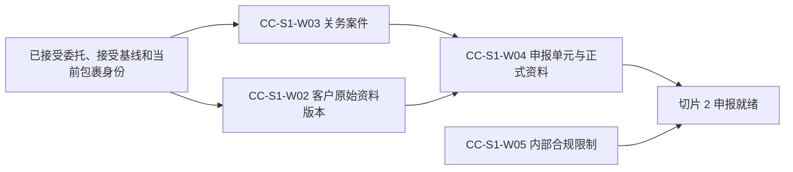

# IDP Parcel 关务切片 1 业务开发交接

状态：开发交接基线；稳定业务边界和验收范围已确认，真实试点参数待提供

本文把[关务与贸易合规专项开发基线](../product/CUSTOMS-FIRST-RELEASE-DEVELOPMENT-BASELINE.md)中的专项切片 1 组织成可以直接拆分、实现和验收的业务工作包。它只服务于产品主线中的 `PN-05` 关务控制域，不代表产品总体首发顺序；不重新定义领域规则，也不规定 API、数据库表、消息 Schema、事务组件或部署拓扑。

## 交付目标

切片 1 完成后，系统能够：

- 保全已接受委托后的客户原始资料补充或更正，并形成不可覆盖的来源版本及当前采用判断。
- 按固定监管程序和责任范围建立稳定关务案件，不使用包裹、委托、批次或国家作为未经确认的默认案件键。
- 在明确案件中形成申报单元、逐包裹成员结果、正式申报资料快照和字段级来源关系。
- 由明确责任来源对对象、范围和动作形成内部合规限制，并只接受相应来源的部分或全部解除。
- 对重复、冲突、业务条件不足、规则未决、越权和技术未形成分别返回稳定业务结果。

切片 1 不形成申报就绪、提交授权、提交版本、提交尝试、外部监管结果、监管放行、节点执行、运输事实或结算金额。这些结果不能以临时状态、人工改值或“先占位后补齐”提前进入本切片。

## 权威依据

| 能力 | 权威文档 | 验收范围 |
|---|---|---|
| 客户原始资料补充与更正 | [UC-PS-002](../application/parcel-shipment/UC-PS-002-AMEND-CUSTOMER-SOURCE-DATA.md) | `AT-PS-014..032` |
| 建立关务案件 | [UC-CC-001](../application/customs-compliance/UC-CC-001-ESTABLISH-CUSTOMS-CASE.md) | `AT-CC-001..022` |
| 申报单元与正式资料 | [UC-CC-002](../application/customs-compliance/UC-CC-002-FORM-DECLARATION-UNIT-AND-DATA.md) | `AT-CC-023..047` |
| 内部合规限制及解除 | [UC-CC-011](../application/customs-compliance/UC-CC-011-MANAGE-INTERNAL-COMPLIANCE-RESTRICTIONS.md) | `AT-CC-339..375` |
| 上下文所有权 | [领域上下文地图](../domain/CONTEXT-MAP.md)、[小包托运上下文](../domain/parcel-shipment/CONTEXT.md)、[关务与贸易合规上下文](../domain/customs-compliance/CONTEXT.md) | 所有权、不变量和生命周期 |

发生冲突时，领域文档和应用用例优先于本文。本文中的工作包、顺序和完成检查只是开发交接，不取得业务定义所有权。

## 依赖顺序

`CC-S1-W01` 的共享业务结果机制先行建立。`CC-S1-W02` 与 `CC-S1-W03` 可以并行，但 `CC-S1-W04` 必须只消费已建立案件和可引用的客户来源版本。`CC-S1-W05` 可以并行形成限制能力，但不得在本切片内实现申报就绪；它只为切片 2 提供范围化只读判断。

## 开发工作包

### `CC-S1-W01` 共享业务结果与保护机制

交付：

- 稳定请求身份、相同请求同内容的已有结果和相同请求不同内容的冲突结果。
- 业务负向判断、权威依据未决、请求未受理和技术未形成的独立表达。
- 追加保存来源、版本、决定、有效性和发布意图，不按最后到达覆盖。
- 租户、客户、法人、案件和范围隔离，以及最小错误披露和完整审计。
- 批量请求逐对象返回结果；局部失败不回滚其他已经合法形成的业务结果。

完成检查：四个权威用例的重复、冲突、越权、并发输入失效、持久化失败和发布恢复场景能够使用同一稳定机制验证，但每个用例仍保留自己的业务结果名称和所有权。

### `CC-S1-W02` 客户原始资料版本

交付：

- 保全补充或更正请求、来源、目标委托/包裹/字段范围、基础版本、原因和业务时间。
- 形成不可覆盖的客户原始资料版本、版本关系和当前采用判断。
- 明确区分已记录、已形成、待补充、业务拒绝、冲突、未受理和技术未形成。
- 向关务提供版本引用、适用范围和当前采用结果，不允许关务回写客户来源。

业务边界：不能修改接受基线或成员，不能改变客户、责任法人、合同或产品，也不能覆盖节点实测、正式申报、运输事实或费用结果。真实字段、阶段和授权尚未登记时，只能完成通用版本与显式未配置骨架。

验收：完成 `AT-PS-014..032`，并证明新版本只触发下游重新判断，不自动形成申报更正、重报、改路、重新包装或费用调整。

### `CC-S1-W03` 建立关务案件

交付：

- 关联已接受委托、接受基线、当前包裹身份和服务责任依据。
- 对监管辖区、方向、程序和法定义务范围形成固定案件身份判断。
- 保存包裹关联、触发来源、初始关务参与方角色和资格依据快照。
- 返回案件已建立、部分范围已建立、已有案件、条件不足、未形成、请求冲突、未受理或不适用。

业务边界：案件建立不表示已经存在申报单元、正式资料、就绪、授权、提交或监管结果。真实案件划分规则未确认时，不得默认一个包裹、一个委托、一个国家或一个运输批次建立一个案件。

验收：完成 `AT-CC-001..022`，并证明跨客户和不同固定监管范围不能复用案件；同一合法请求不会创建第二个案件。

### `CC-S1-W04` 申报单元与正式资料

交付：

- 在明确案件中形成候选成员、兼容判断、逐包裹纳入/排除结果和成员快照。
- 形成正式资料快照、字段级来源、转换、责任角色、业务适用时间和规则版本。
- 保留自动合规判断和人工复核/人工判断的决定方式及历史。
- 返回已形成、部分范围已形成、资料准备未决、已有结果、请求冲突、未形成或不适用。

业务边界：客户声明、节点实测、关务判断和正式资料分别保存；不能以外部渠道字段、附件、运输单证、界面显示或操作员身份替代字段来源和资格依据。资料准备中不等于申报已就绪。

验收：完成 `AT-CC-023..047`，并证明缺少真实字段目录或单元规则时保持未决/未配置，不自动填默认字段、不自动合报，也不静默创建并行活跃单元。

### `CC-S1-W05` 内部合规限制及解除

交付：

- 保存限制来源、责任方、对象、范围、受限动作、依据、适用监管边界、开始时间和解除条件。
- 支持人工或已登记规则形成限制，并由原责任来源形成部分或全部解除。
- 对明确对象、范围、动作和时点派生当前限制适用判断。
- 返回限制已形成、当前范围无内部限制、适用待确认、适用冲突、部分/全部解除、解除不成立、请求冲突、未受理或技术未形成。

业务边界：解除条件满足不自动解除；外部放行、异常关闭、商业批准和节点完成都不能代替来源解除。不能实现为全局 `blocked` 字段、万能解除角色或外部监管状态镜像。

验收：完成 `AT-CC-339..375`。生产主链与 `R/S` 复杂分支的具体划分以 `UC-CC-011` 为准；多个独立限制存在时，解除一个限制不能把当前动作错误判断为无其他限制。

### `CC-S1-W06` 跨用例验收与切片交接

交付一组可重复执行的业务序列：

1. 已接受包裹建立关务案件，再形成申报单元和正式资料。
2. 客户原始资料形成新版本后，关务只读消费并形成新的资料准备结果，不覆盖旧快照。
3. 资料缺口、案件条件不足和限制适用待确认分别保持业务未决，不伪装成技术错误或成功。
4. 同请求重复、同键不同内容、并发版本变化、发布失败恢复和批量部分成功均不重复形成业务事实。
5. 跨客户、跨法人、跨程序和越权请求被隔离，错误结果不泄露其他业务对象是否存在。
6. 已形成内部限制只提供给切片 2 消费，不在本切片创建“申报未就绪”结果。

完成检查：`AT-PS-014..032`、`AT-CC-001..047` 和 `AT-CC-339..375` 均可追溯到明确工作包；任何通过结果都能回查输入版本、规则或决定依据、业务时间、决定方式和审计历史。

## 参数门禁

| 当前参数状态 | 切片 1 可以完成 | 不得宣称完成 |
|---|---|---|
| `CUST-PILOT-01`、`LANE-PILOT-01`、`LEGAL-ENTITY-PILOT-01` 仅为预留标识 | 稳定身份引用、隔离、未配置和合成测试骨架 | 真实客户、线路或责任法人已经提供并完成证据核验 |
| `PAR-COM-05/06/13` 待提供 | 产品/合同/资料版本引用和重新判断机制 | 真实服务适用、允许字段、阶段或授权规则 |
| `PAR-NET-02/03` 待提供 | 监管区域和方向的显式输入及未配置结果 | 真实出口或进口案件自动划分 |
| `PAR-CUS-01..05` 待提供 | 程序、渠道、角色、规则和字段的版本化引用框架 | 国家或渠道专属申报模式、字段、合报和自动判断 |
| `PAR-CUS-07` 待提供 | 限制、覆盖、解除和当前判断的通用业务骨架 | 真实限制来源、动作矩阵、自动形成或解除 |
| `PAR-NFR-06` 待提供 | 指标采集位置和待配置目标 | 生产响应时间、新鲜度、批量窗口或恢复承诺 |

参数未确认时的安全结果必须是明确未配置、业务未决、未受理或技术未形成；不能返回一条看似成功但依据为空的案件、资料或限制结果。

## 切片完成定义

切片 1 只有同时满足以下条件才完成：

1. 六个工作包全部完成，并能从每个工作包追溯到权威用例和验收编号。
2. 同一业务事实不会被客户资料、关务案件、正式资料和内部限制重复拥有或相互覆盖。
3. 正向结果、负向业务判断、规则未决、越权未受理和技术未形成均有独立测试。
4. 所有历史版本、决定、限制及解除关系可追溯；迟到或更正不会按到达顺序覆盖历史。
5. 批量部分成功、并发冲突、恢复和跨客户隔离测试通过。
6. 未提供的真实参数保持显式未配置，且不产生外部提交、监管结果、物流动作或金额。
7. 向切片 2 提供的只有案件、资料版本、正式资料、角色资格依据和当前限制判断；切片 1 不预先实现第二套就绪规则。

完成切片 1 证明稳定业务骨架和测试合同可供后续开发使用，不证明真实出口、进口程序或生产渠道已经上线。
