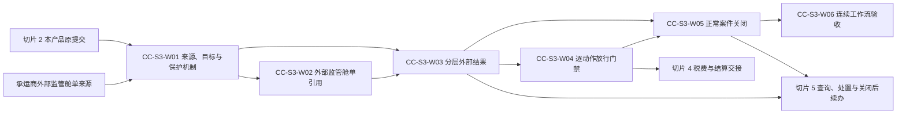

# IDP Parcel 关务切片 3 业务开发交接

状态：开发交接基线；稳定业务边界和首发分层已确认，真实承运商、来源契约、结果映射、动作门禁和关闭参数待提供

本文把[关务与贸易合规专项开发基线](../product/CUSTOMS-FIRST-RELEASE-DEVELOPMENT-BASELINE.md)中的专项切片 3 组织成可以直接拆分、实现和验收的业务工作包。它只服务于产品主线中的 `PN-05` 关务控制域，不代表产品总体首发顺序；不重新定义领域规则，也不规定 API、数据库表、消息 Schema、渠道适配、财务接口、事务组件或部署拓扑。

## 交付目标

切片 3 完成后，系统能够：

- 通过独立入口接受并关联承运商在外部形成和提交的出口、进口监管舱单引用，不创建本地监管舱单、提交版本或提交尝试。
- 在解释之前保全外部来源，并把外部结果关联到互斥的本产品原提交或已接受外部监管舱单引用；关联不足时形成`来源响应已保全待关联`，不补造占位对象。
- 分别形成技术回执、监管接收、业务受理、监管过程决定、监管核定税费、放行结果和监管处置决定，不维护一个“提交成功”或“清关状态”。
- 按来源权威、结果层、业务时间、明确范围和更正关系形成当前解释；未知形成`外部结果解释未决`，冲突保留，不按最后到达覆盖。
- 对明确申报范围、拟执行动作和监管边界形成动作化放行门禁核对；`放行门禁已满足`不生成外部放行，外部放行也不自动解除内部限制。
- 对正常关务案件完整盘点在册义务，逐项形成关闭依据，并在全部义务已终结或有效承接后由有权角色形成`关务案件已关闭`。

切片 3 不代表承运商形成、提交或查询监管舱单，不完成税费实际付款、客户代垫回收或结算，不执行查验和监管处置，不决定补充、更正、撤销重报，不完成结果待确认查询、安全再次发送、受控重开或后续案件，也不直接形成异常案件和客户披露。上述能力分别交给切片 4、切片 5 和相应权威用例。

## 权威依据

| 能力 | 权威文档 | 完整验收范围 | 切片 3 交付范围 |
|---|---|---|---|
| 承运商外部监管舱单引用 | [UC-CC-012](../application/customs-compliance/UC-CC-012-RECEIVE-AND-RELATE-EXTERNAL-REGULATORY-MANIFEST.md) | `AT-CC-376..410` | 完整业务骨架；出口、进口正常引用使用 `P`，复杂更正、冲突、乱序和跨客户分支使用 `R/S` |
| 外部监管结果 | [UC-CC-006](../application/customs-compliance/UC-CC-006-RECEIVE-AND-RECONCILE-EXTERNAL-RESULTS.md) | `AT-CC-140..180` | 来源保全、互斥关联和正常分层结果；查询待确认、安全再次发送及早期尝试迟到生效交给切片 5 |
| 逐动作放行门禁 | [UC-CC-009](../application/customs-compliance/UC-CC-009-RECONCILE-TAX-PAYMENT-RECOVERY-AND-RELEASE-GATE.md) | `AT-CC-258..295` | 门禁框架、明确无需付款/付款不构成当前动作前置条件和外部放行回接；金额化税费、资金与客户回收交给切片 4 |
| 正常关闭关务案件 | [UC-CC-010](../application/customs-compliance/UC-CC-010-CLOSE-REOPEN-AND-ESTABLISH-FOLLOW-UP-CASE.md) | `AT-CC-296..338` | `AT-CC-296..313`、`AT-CC-331`、`AT-CC-333..335`；迟到事实分类、受控重开和后续案件交给切片 5 |
| 上下文所有权 | [领域上下文地图](../domain/CONTEXT-MAP.md)、[关务与贸易合规上下文](../domain/customs-compliance/CONTEXT.md) | 所有权、不变量和生命周期 | 全部适用 |

发生冲突时，领域文档和应用用例优先于本文。本文中的工作包、生产分层、顺序和完成检查只是开发交接，不取得业务定义所有权。被分配到切片 4 或切片 5 的验收场景仍属于原权威用例，不因开发切片拆分而改变所有权。

## 依赖顺序

承运商外部监管舱单与本产品原提交是两条独立入口。外部舱单结果必须先定位 `UC-CC-012` 已接受的引用，本产品申报结果必须关联切片 2 形成的提交版本和尝试；不得为了统一处理而给外部舱单补造本地提交。`CC-S3-W04` 只形成动作化门禁，`CC-S3-W05` 只消费各义务来源的当前依据形成正常关闭，不反向修改外部结果、限制、付款、物流或结算事实。

## 开发工作包

### `CC-S3-W01` 外部来源、结果目标与共享保护机制

交付：

- 在读取候选业务内容前执行最小来源安全校验；通过后保全不可覆盖的来源身份、原始业务语义、来源时间、接收时间、完整性和原始内容引用。
- 明确区分承运商监管舱单源事实、外部监管舱单引用、外部结果来源响应、已接受分层外部事实和当前解释。
- 对每项外部结果建立互斥目标关系：本产品提交版本/尝试，或者 `UC-CC-012` 已接受的外部监管舱单引用；不允许同时引用两类目标或创建占位目标。
- 支持相同来源身份/版本/内容返回已有结果、同身份不同内容形成来源冲突、明确更正形成新版本关系，以及迟到来源不按接收顺序覆盖。
- 对逐来源、逐结果项、逐范围的业务结果、审计和发布意图提供可恢复保护；批量一项失败不回滚其他已合法形成结果。
- 统一执行集团租户、责任法人、客户账户、案件和监管范围隔离及最小披露，但保留各用例自己的业务结果名称。

业务边界：共享机制只负责来源保全、稳定关联、隔离和恢复，不能把引用接受、承运商已提交、技术回执、监管接收、业务受理、门禁满足和案件关闭压缩为通用状态。

验收：覆盖四个权威用例中的重复、冲突、越权、批量部分处理、持久化失败、并发输入变化和发布恢复场景；证明来源已经保全但业务处理未完成时能够从同一来源恢复，不要求外部系统换身份重发。

### `CC-S3-W02` 承运商外部监管舱单引用与关联

交付：

- 依据真实程序和责任关系识别出口、进口监管舱单责任承运商及受控传输来源；不从签约方、渠道品牌、代理商或实际承运商自动推导。
- 保全外部身份、来源版本、程序、方向、明确范围、承运商形成/提交语义、业务时间及更正、撤销、替代或范围变化关系。
- 逐范围关联关务案件、申报单元、运输总单、运输舱单、班次或载运对象，同时保持各对象身份和所有权独立。
- 精确形成`外部监管舱单引用已接受`、`外部监管舱单已关联`、`外部监管舱单待关联`、`外部监管舱单解释未决`、`外部监管舱单冲突`、`外部监管舱单来源未受理`、`外部监管舱单结果未形成`和`批量逐项结果`。
- 对更正、撤销、替代和关联修正追加形成版本、关系和当前采用判断；保留原引用、原范围、原关系以及既有监管和物流事实。

业务边界：运输舱单、外部监管舱单引用和实际装载是三个独立层次。同一编号、同袋、同班次或成员相同都不能合并对象；承运商报告已提交只形成承运商来源事实，不形成监管接收或业务受理。本产品不提供监管舱单编辑、授权、提交、查询或再次发送路径。

验收：实现 `AT-CC-376..410` 的可重复业务测试。出口和进口各至少一个真实外部引用、来源版本及关务/运输关联使用 `P`；更正、替代、范围冲突、跨客户、乱序和关联修正未自然发生时使用 `R/S`，不得向生产监管渠道制造虚假舱单。

### `CC-S3-W03` 正常外部结果的来源保全与分层解释

交付：

- 把技术回执、监管接收、业务受理、监管过程决定、监管核定税费、放行结果和监管处置决定逐层、逐范围形成；高层结果先到时不补造低层结果。
- 对每项结果保存合格来源角色、原始语义、解释规则版本、业务/适用/接收时间、明确范围、当前有效性和更正关系。
- 精确形成`分层外部结果已形成`、`来源响应已保全待关联`、`外部结果解释未决`、`已有来源处理结果`、`来源响应冲突`、`外部结果冲突`、`来源信封逐项处理汇总`、`来源响应未受理`和`未形成外部结果`。
- 对本产品原提交和外部监管舱单引用采用不同关联前提；外部舱单分支不要求本地提交版本/尝试，也不建立本地查询或再次发送分支。
- 逐范围处理全部、部分和附条件放行；未覆盖范围保持原判断或待确认，跨客户结果只向各客户披露其有权范围。
- 将税费结果交给切片 4，将补充/更正/查验/处置、异常协调、查询待确认和关闭后事实交给切片 5；交接失败只恢复同一发布意图。

业务边界：同步返回、文件到达、HTTP 成功、报关服务方页面文案和人工备注都不能直接生成监管事实。切片 3 可以保留切片 2 的`提交尝试结果待确认`关系，但原提交查询、`原提交结果仍待确认`、`原提交安全再次发送条件已确认`及早期尝试迟到生效后的处理由切片 5 完成。

验收：完成正常来源保全、关联、技术回执、监管接收/业务受理和范围明确放行的 `P` 证据；`AT-CC-140..180` 中除查询待确认、安全再次发送和关闭后迟到事实外的复杂结果分支形成 `R/S` 骨架。`AT-CC-141`、`AT-CC-165..170`、`AT-CC-178` 和 `AT-CC-180` 在切片 5 完成业务闭环，本切片只保证来源和交接不丢失。

### `CC-S3-W04` 范围化、动作化放行门禁

交付：

- 对明确申报范围、拟执行动作和监管边界读取当前外部结果、内部限制、监管处置、税费/付款适用判断及其他真实程序前置条件。
- 分别形成`当前范围无需付款`、`付款不构成当前动作前置条件`、`放行门禁待满足`、`放行门禁已满足`、`放行门禁冲突或待确认`、`外部放行结果已回接`、`当前事项无需继续`、`未受理`和`未形成税费/门禁核对`。
- 对没有税费消息但也没有明确无需付款依据的范围保持条件未决；不得以“未收到税费”推导无需付款。
- 使节点和运输履约只消费与当前对象、拟执行动作和监管边界完全匹配的门禁及外部结果；不允许把出库门禁复用于装载出发、跨关务区域移动或交付。
- 外部放行、门禁判断和内部限制分别保留：门禁满足只允许进入外部结果等待/复核，外部放行也不能解除仍有效内部限制。

业务边界：本工作包不接收实际付款，不形成税费付款覆盖、实际代垫、客户回收或结算金额。真实锚点程序存在税费时，由切片 4 完成 `UC-CC-009` 的金额化税费、外部资金事实、付款核对、客户回收输入交接及 `UC-SA-001`；切片 3 只提供稳定门禁契约和显式未决结果。

验收：以 `AT-CC-259/260/276..280/291..295` 验证“无需付款不等于放行”“付款义务不等于当前动作被阻断”“门禁满足不生成放行”“外部放行不解除其他限制”和“门禁不能跨动作复用”。其中依赖真实付款覆盖的场景在切片 4 完成生产证据，切片 3 使用稳定测试输入验证门禁消费边界；`AT-CC-258`、`AT-CC-261..275` 和 `AT-CC-281..290` 的金额化税费、外部资金及结算交接也由切片 4 完成。

### `CC-S3-W05` 正常关务案件关闭

交付：

- 以明确基准时点盘点当前申报、外部结果、内部限制、监管处置、税费及其他适用义务，逐义务、逐范围形成关闭依据项。
- 对每项依据只形成已终结、已移交、未解决或冲突；单项完成、外部放行、付款完成、运输完成、交付完成或长期无消息不能推出整案可关闭。
- 对真实程序允许后续处理的剩余责任，保存来源方、接收方、明确范围、接受结果和续办引用；通知送达、任务创建、未响应或部分接受不构成完整承接。
- 精确形成`关闭核对已形成`、`案件可关闭`、`案件关闭未决`、`剩余责任已承接`、`关务案件已关闭`、`已有关闭结果`、`关闭或续办请求冲突`、`关闭或续办请求未受理`和`未形成关闭或续办结果`。
- 只允许有权责任角色引用仍为当前的完整关闭核对、逐项关闭责任来源和授权依据形成不可覆盖关闭决定。

业务边界：`案件可关闭`只是关闭核对结论，`关务案件已关闭`才是有权角色形成的生命周期决定。关闭不删除监管或业务事实，不解除限制，不关闭异常、作业、运输、付款或结算对象，也不表示法定追溯期结束。迟到事实分类、受控重开、后续案件及再次关闭周期由切片 5 完成。

验收：完成 `AT-CC-296..313`、`AT-CC-331` 和 `AT-CC-333..335`。证明新义务与关闭并发时旧核对失效，发布失败只恢复原关闭结果，跨客户案件逐客户隔离，并且案件不存在“部分关闭”。

### `CC-S3-W06` 双入口连续工作流验收及后续交接

交付一组可重复执行的业务序列：

1. 出口和进口分别接收责任承运商外部监管舱单来源，形成外部引用和明确关务/运输关联，不建立本地监管舱单或本地提交。
2. 切片 2 的本产品原提交收到正常技术回执、监管接收或业务受理；同一结果处理机制按本地提交目标解释，但不与外部舱单目标合并。
3. 承运商外部舱单携带可验证监管结果时，先形成或定位外部引用，再由 `UC-CC-006` 独立形成分层监管事实；承运商已提交本身不升级为监管结果。
4. 对部分或附条件放行逐范围形成结果，再对明确拟执行动作形成门禁；其他未放行范围和内部限制继续有效。
5. 案件只有在全部在册义务逐项终结或有效承接后才能由有权角色关闭；关闭不产生“清关成功”，也不改变物流、资金、结算或异常对象。
6. 税费/资金分支稳定交给切片 4；结果待确认查询、补充/更正、查验/处置、迟到事实、受控重开、后续案件和异常披露稳定交给切片 5，任一交接失败不重建来源或改写原事实。

完成检查：每项业务结果都能回查来源身份、业务目标、规则版本、明确范围、业务适用时间、当前有效性、决定依据和发布历史；两条结果入口、七个结果层、动作门禁和案件关闭具有独立身份及所有权。

## 参数门禁

| 当前参数状态 | 切片 3 可以完成 | 不得宣称完成 |
|---|---|---|
| `CUST-PILOT-01`、`LANE-PILOT-01`、`LEGAL-ENTITY-PILOT-01` 仅为预留标识 | 稳定身份引用、隔离、显式未决和合成测试骨架 | 真实客户、线路或责任法人已经提供并完成证据核验 |
| `PAR-COM-05/06` 待提供 | 产品/合同版本引用和最小披露骨架 | 真实服务责任、结果披露和客户范围已经确认 |
| `PAR-CUS-01/02`、`PAR-INT-03` 待提供 | 出口/进口独立入口、来源保全、外部身份/版本、范围和结果分层骨架 | 真实责任承运商、外部舱单来源或监管结果映射可生产使用 |
| `PAR-CUS-03` 待提供 | 来源接收、人工关联、解释复核、门禁复核和关闭权限的独立校验骨架 | 任一真实主体有权关联、解释、放行复核或关闭案件 |
| `PAR-CUS-04` 待提供 | 规则版本、未知代码未决、凭证保持和动作门禁框架 | 真实结果代码、凭证定案或放行门禁可以自动判断 |
| `PAR-CUS-05` 待提供 | 重复、冲突、乱序、更正、跨客户、部分范围和恢复测试骨架 | 复杂分支已有合格生产、回放或模拟证据 |
| `PAR-CUS-06` 待提供 | 完整义务清单、关闭依据、责任承接和人工关闭框架 | 真实程序的案件可以生产关闭 |
| `PAR-CUS-07` 待提供 | 消费当前内部限制适用性判断 | 外部放行后真实受限动作可以继续执行 |
| `PAR-INT-05`、`PAR-SET-01/08` 待提供 | 向切片 4 提供税费、付款和客户责任的稳定交接边界 | 实际付款、实际代垫或客户回收已经形成 |
| `PAR-NFR-06` 待提供 | 来源、积压、关闭和恢复指标采集位置 | 来源新鲜度、等待窗口、批量规模、性能或恢复承诺 |

参数未确认时，`UC-CC-012` 分别形成`外部监管舱单解释未决`、`外部监管舱单来源未受理`或`外部监管舱单结果未形成`，`UC-CC-006` 分别形成`外部结果解释未决`、`来源响应未受理`或`未形成外部结果`，`UC-CC-009` 分别形成`放行门禁冲突或待确认`、`未受理`或`未形成税费/门禁核对`，`UC-CC-010` 分别形成`案件关闭未决`、`关闭或续办请求未受理`或`未形成关闭或续办结果`。不得创建跨用例通用状态，也不得用默认国家、承运商、程序、渠道、结果代码、动作、角色、期限、阈值或管理员权限让对应分支看似可用。

## 切片完成定义

切片 3 只有同时满足以下条件才完成：

1. 六个工作包全部完成，并能从每个工作包追溯到权威用例、首发分层和验收编号。
2. 承运商外部监管舱单和本产品原提交保持两条独立结果入口；任何分支都不创建占位提交或把运输舱单改名为监管舱单。
3. 来源响应、已接受外部事实和当前解释分别保存；技术回执、监管接收、业务受理、过程决定、税费、放行和处置不合并。
4. 外部结果只作用于其明确范围；门禁必须绑定拟执行动作和监管边界，门禁满足不生成放行，外部放行不解除内部限制。
5. `案件可关闭`与`关务案件已关闭`分别测试；每项义务均有权威终结或有效承接依据，关闭不回退或删除其他上下文事实。
6. 同一来源重复、同身份不同内容、未知解释、跨客户、批量部分处理、并发变化、发布恢复、越权和最小披露测试通过。
7. `UC-CC-012` 的完整业务骨架、`UC-CC-006` 的正常结果主链、`UC-CC-009` 的动作门禁契约和 `UC-CC-010` 的正常关闭范围均可重复验证；分配给切片 4、5 的场景具有明确交接，不被伪装成本切片已完成。
8. 未提供的真实参数保持显式未决或对应权威负向结果，阻止真实外部来源解释、动作放行和案件关闭。

完成切片 3 证明本产品能够把承运商外部监管舱单及本产品原提交的正常外部结果转为可信、范围明确的关务事实，并据此形成不冒充监管放行的动作门禁和正常案件关闭；不证明税费资金闭环、复杂监管异常和关闭后续办已经生产就绪。
