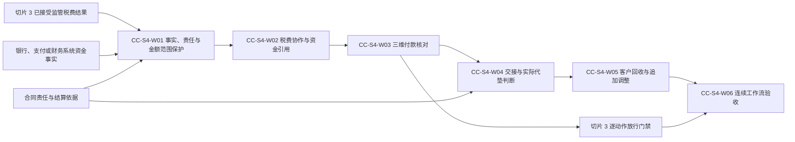

# IDP Parcel 关务切片 4 业务开发交接

状态：开发交接基线；税费、资金、实际代垫和客户回收边界已确认，真实税费程序、资金来源、合同责任、结算账户、币种及价格规则待提供

本文把[关务与贸易合规专项开发基线](../product/CUSTOMS-FIRST-RELEASE-DEVELOPMENT-BASELINE.md)中的专项切片 4 组织成可以直接拆分、实现和验收的业务工作包。它只服务于产品主线中的 `PN-05` 关务控制域，不代表产品总体首发顺序；不重新定义领域规则，也不规定 API、数据库表、消息 Schema、银行或支付接入方式、法定财务接口、事务组件、对象存储或部署拓扑。

## 交付目标

切片 4 只在真实锚点出口或进口监管程序确有税费时进入生产。真实程序没有税费时，应在参数登记册记录权威 `N/A` 依据，本切片不得为了流程完整制造税费、付款或代垫。

切片 4 完成后，系统能够：

- 接受范围明确、当前有效的监管核定税费，形成税费付款协作事项，但不创建实际付款、客户回收或监管放行。
- 接受银行、支付或财务系统拥有的外部资金事实引用，并按税费版本、法定义务、付款方、金额、币种、范围和业务适用时间建立权威关联。
- 把税费付款核对拆成覆盖、差额和有效性三个并存维度；部分付款只作用于已证明金额范围，超额不自动覆盖其他义务。
- 向 `settlement-accounting` 交接税费、付款核对、外部资金事实、付款方和合同责任输入，由结算独立判断实际代垫是否成立。
- 仅在实际代垫和客户最终承担责任都成立时形成客户代垫回收；客户真实付款、核销、开票和法定会计结果继续独立形成。
- 对税费、资金或合同更正追加实际代垫判断和客户回收调整，不覆盖原税费、原付款、原判断、原回收或已发布对账单。
- 使报关或代垫服务费只按独立费用项目和有效价格规则形成，不因实际代垫或客户回收成立自动生成。

切片 4 不形成或修改监管核定、法定义务、银行或支付资金事实、客户合同、价格规则、外部监管放行、节点/运输执行、客户真实收款、核销、发票、总账或关务案件生命周期。付款覆盖和客户回收均不能解除内部限制或制造监管放行；合法结算输入也不因关务案件已经关闭而失效。

## 权威依据

| 能力 | 权威文档 | 完整验收范围 | 切片 4 交付范围 |
|---|---|---|---|
| 税费、付款与结算交接 | [UC-CC-009](../application/customs-compliance/UC-CC-009-RECONCILE-TAX-PAYMENT-RECOVERY-AND-RELEASE-GATE.md) | `AT-CC-258..295` | `AT-CC-258`、`AT-CC-261..275`、`AT-CC-281..290`；其余动作门禁范围由切片 3 交付 |
| 实际代垫与客户回收 | [UC-SA-001](../application/settlement-accounting/UC-SA-001-ASSESS-ACTUAL-ADVANCE-AND-FORM-CUSTOMER-RECOVERY.md) | `AT-SA-001..034` | 完整业务骨架；正常真实主链使用 `P`，复杂分配、更正、撤销、退回和调整分支使用 `R/S` |
| 上下文所有权 | [领域上下文地图](../domain/CONTEXT-MAP.md)、[关务与贸易合规上下文](../domain/customs-compliance/CONTEXT.md)、[结算与经营核算上下文](../domain/settlement-accounting/CONTEXT.md) | 所有权、不变量和生命周期 | 全部适用 |
| 事实与财务边界 | [ADR-0005](../adr/0005-source-facts-effective-events-derived-state.md)、[ADR-0007](../adr/0007-separate-operational-settlement-from-statutory-finance.md) | 来源事实、当前判断、运营结算和法定财务分离 | 全部适用 |

发生冲突时，领域文档和应用用例优先于本文。本文中的工作包、生产分层、顺序和完成检查只是开发交接，不取得业务定义所有权。

## 切片 3 与切片 4 的验收分配

| 开发切片 | `UC-CC-009` 验收编号 | 责任边界 |
|---|---|---|
| 切片 3 | `AT-CC-259/260/276..280/291..295` | 明确无需付款或条件未决、逐对象逐动作门禁、外部放行回接及绕过防护；不完成金额化付款与结算 |
| 切片 4 | `AT-CC-258/261..275/281..290` | 税费付款协作、外部资金事实引用、覆盖/差额/有效性核对、结算交接及结算结果回接 |

两组编号合计完整覆盖 `AT-CC-258..295`，没有遗漏或重复所有权。切片 4 可以调用切片 3 已稳定的动作门禁契约验证付款核对的消费边界，但不得据此重新取得门禁验收所有权。

## 依赖顺序

监管税费、外部资金事实和合同责任由三个不同责任方形成。`CC-S4-W01` 只建立稳定引用、版本、范围和保护机制，不把三类事实合并。`CC-S4-W03` 的付款核对既供结算交接，也可被切片 3 的动作门禁消费；两条下游关系彼此独立。

## 开发工作包

### `CC-S4-W01` 税费、资金、责任与金额范围共享保护

交付：

- 明确区分监管核定税费、外部资金事实、税费付款核对、实际代垫成立判断、客户代垫回收、客户真实收款/核销、服务费和外部监管放行。
- 对税费版本、资金事实版本、付款方、法定义务人、运营责任法人、客户账户、合同责任版本、结算依据及明确金额范围建立稳定引用，不复制或修改来源所有者的事实。
- 按集团租户、责任法人、客户账户、关务案件、税费义务、结算账户、币种和金额范围执行隔离与最小披露；跨客户合报只消费已经权威分配的范围。
- 支持相同请求和内容返回已有结果、相同身份不同内容形成冲突、来源更正追加版本、并发输入分别保全，以及批量逐客户、逐义务、逐金额范围处理。
- 对各用例的业务结果、采用版本、判断依据、发布意图和恢复引用形成可恢复保护；共享技术机制不得把两个用例的结果压缩为跨用例通用状态。

业务边界：本工作包不形成税费、资金、合同、代垫或回收业务结论。`UC-CC-009` 和 `UC-SA-001` 必须分别使用各自完整结果名称；资料不足、业务冲突、未受理和技术未形成不能互相替代。

验收所有权：`AT-CC-267`、`AT-CC-281/282`、`AT-CC-287/289`；`AT-SA-013/014`、`AT-SA-022..026`、`AT-SA-031..034`。这些场景仍使用两个权威用例各自的完整结果名称，不新增“请求冲突”“分配冲突”“技术失败”等顶层业务状态。证明任一来源或结果失败都不会覆盖其他已经合法形成的事实和金额判断。

### `CC-S4-W02` 税费付款协作与外部资金事实引用

交付：

- 接受 `UC-CC-006` 已形成的当前有效监管核定税费，绑定税费版本、法定义务人、原币金额、币种、明确范围、付款条件来源和业务适用时间，形成`税费付款协作事项已形成`。
- 当当前范围需要付款但尚无合格实际付款事实时形成`待付款`；付款申请、技术受理、银行待处理、账户余额或客户预收都不能替代实际付款。
- 接受银行、支付或财务系统提供的实际付款、付款失败、追加付款、资金退回、付款撤销或资金事实更正引用，形成`外部资金事实已接收`，不在本产品内伪造资金结果。
- 只有在来源身份、外部业务引用、结果层、版本、付款方、金额、币种、业务时间和有效性合格时才允许进入关联；依据不足形成`外部资金事实待关联`。
- 相同资金事实经回调、文件、查询或人工核实重复到达时只采用一次；人工点击“已缴税”不能产生外部资金事实或付款覆盖。
- 客户预收只作为独立结算事实，不能转换为监管付款；技术处理未完成使用`未形成税费/门禁核对`，不能伪装成付款失败或待付款。

业务边界：关务只保留外部资金事实的稳定引用和实际采用版本，不取得银行、支付或财务事实所有权，也不发起支付、清算、退款或撤销。

验收所有权：`AT-CC-258`、`AT-CC-261/262`、`AT-CC-268`、`AT-CC-275`、`AT-CC-290`。正常税费与合格真实付款使用 `P`；付款申请、客户预收和无合格资金事实的人工操作可以使用真实回放或 `R/S`，不得向生产资金系统制造虚假付款。

### `CC-S4-W03` 覆盖、差额和有效性三维付款核对

交付：

- 对每个税费版本和明确金额范围同时形成覆盖维度、差额维度和有效性维度；不得实现为一个互斥的“缴税状态”。
- 覆盖维度使用`税费付款核对无覆盖`、`税费付款核对部分覆盖`或`税费付款核对已覆盖`；差额维度独立形成`税费付款差额不足`、`税费付款差额超额`，或者保留无差额/待确认维度值；有效性维度独立保留有效、失效、冲突或待确认依据。
- 部分付款只覆盖已经证明的金额范围；超额付款形成`税费付款差额超额`及核实/资金退回入口，不自动覆盖其他税费、客户或案件。
- 付款人、币种、范围、分配或来源相互矛盾时形成`税费付款冲突`；金额相同、时间相近、同一客户或人工选择都不能裁决关联。
- 资金退回、付款撤销或资金事实更正使已覆盖范围不再适用时形成`税费付款覆盖失效`，保留原付款和原核对；税费增减也形成新税费版本和新核对。
- 税费或付款要求被权威取消、替代，或者范围被明确移除时形成`当前事项无需继续`，保留既有付款、核对和结算历史。
- 一笔付款覆盖多个税费范围必须有权威分配，一项合报付款只处理已经明确的客户成员和范围；未分配部分保持待关联，不按比例、包裹数或客户数猜测。
- 关务案件关闭后的合法税费或付款事实仍予保全和核对；是否受控重开由 `UC-CC-010` 根据原关闭责任来源决定，本工作包不自行重开案件。

业务边界：法定义务人、实际付款方、运营责任法人和最终承担费用的客户分别记录。客户或收件人直接付款可以完成税费付款核对，但运营企业没有付款责任时不能因此形成客户代垫回收。

验收所有权：`AT-CC-263..266`、`AT-CC-269..271`、`AT-CC-286`、`AT-CC-288`。正常完整覆盖使用 `P`；部分、超额、币种/付款人冲突、多范围分配、退回、撤销、更正和迟到场景使用真实自然证据或 `R/S`。

### `CC-S4-W04` 结算输入接收与实际代垫判断

交付：

- `UC-CC-009` 向结算交接付款方、监管税费、外部资金事实引用、付款核对、运营责任法人、客户账户和合同责任输入，只有结算返回接收结果后才形成`客户回收输入已交接`。
- `settlement-accounting` 独立校验并固定采用版本，形成`结算输入已接收`；交接或接收成功均不表示实际代垫或客户回收成立。
- 逐税费义务、逐资金事实和逐金额范围判断运营企业是否实际替他方付款，分别形成`实际代垫成立`、`实际代垫不成立`、`实际代垫待判断`或`实际代垫冲突`。
- 客户或收件人直接付款且运营企业无付款责任时形成适用的`实际代垫不成立`，不创建客户代垫回收；运营企业付款但合同明确由其最终承担时也不把成本转嫁给客户。
- 部分付款只对已证明金额范围形成`实际代垫成立`，剩余范围分别待判断、不成立或尚无付款事实，不建立吞并全部范围的“部分代垫”状态。
- 税费、资金、分配、付款方或责任版本不足时形成`实际代垫待判断`，合格输入矛盾时形成`实际代垫冲突`；不得选择最后到达或对运营企业有利的结果。

业务边界：实际代垫成立不自动形成客户回收、服务费、客户已收款、核销、发票、法定应收或监管放行。关务案件关闭不阻止合法判断，结算判断也不自动重开关务案件。

验收所有权：`AT-CC-273/274`；`AT-SA-001..012`。其中正常成立场景由本工作包主责串联下一工作包完成客户回收，不把一个端到端场景拆成两个互相矛盾的结果。

### `CC-S4-W05` 客户代垫回收、独立服务费与追加调整

交付：

- 对已经成立的实际代垫独立采用客户最终承担责任、合同版本、结算账户、原币/结算币和金额规则，形成`客户代垫回收已形成`、`客户代垫回收不成立`或`客户代垫回收待判断`。
- 客户代垫回收成立时形成可追溯的本金费用明细和客户运营应收关系；回收金额可以依据已确认比例、限额或免赔规则与实际代垫不同，但不得使用默认比例、币种、汇率或账户。
- 报关或代垫服务费只按独立费用项目、价格规则和成立条件形成；实际代垫、回收本金或资金事实不能自动生成服务费。
- 税费增减、追加付款、资金退回、付款撤销/更正或合同责任更正导致已形成回收变化时，追加`客户代垫回收调整已形成`；没有金额责任变化时形成`当前无需调整`。
- 已发布对账单不被迟到更正覆盖，差额进入适用后续账期；客户真实付款、核销、核销撤销和坏账处理只改变各自关系，不改写原回收成立历史。
- 将稳定结算结果引用回接 `UC-CC-009`；关务只保存关系，不改变监管税费、付款核对、门禁或放行。

业务边界：客户回收形成不表示客户已经付款、已经核销、已经开票或监管已经放行。监管税费退回决定不等于真实资金退回，真实资金退回也不自动等于已经退还客户。

验收所有权：`AT-SA-015..021`、`AT-SA-027/028`。正常本金回收使用 `P`；比例/限额、税费更正、资金退回、付款撤销、对账单后调整和客户收款核销使用真实自然证据或 `R/S`。本工作包提供稳定结算结果，结果回接及其对关务边界的连续验收由下一工作包主责。

### `CC-S4-W06` 关务到结算连续验收及后续交接

交付一组可重复执行的业务序列：

1. 先确认真实锚点程序确有税费；无税费时记录权威 `N/A` 并停止本切片生产序列，不制造税费或付款样本。
2. `UC-CC-006` 接受范围明确的监管核定税费，`UC-CC-009` 形成付款协作事项；银行、支付或财务系统随后提供具有稳定身份和业务语义的真实资金事实。
3. 关务逐税费、逐范围形成覆盖、差额和有效性三维核对；付款未覆盖、部分覆盖、超额、失效或冲突都保留各自依据，不压缩为“已缴/未缴”。
4. 关务把稳定输入交给 `UC-SA-001`，结算先形成输入接收，再逐金额范围判断实际代垫；只有实际代垫与客户责任均成立时形成客户代垫回收。
5. 独立服务费规则适用时另行形成服务费；客户后续真实付款和核销只新增自身关系，不回写监管、资金、代垫或回收历史。
6. 付款核对可以供切片 3 的动作门禁使用，但付款覆盖不生成外部放行，客户回收结果不影响门禁；外部放行仍由 `UC-CC-006` 接受。
7. 税费、资金或合同后续变化追加新判断和回收调整；关务关闭不阻止结算，结算变化也不自动重开关务案件。

完成检查：每个金额结果都能回查监管税费版本、资金事实、付款方、法定义务人、运营责任法人、客户账户、合同责任、结算账户、币种、明确金额范围、业务适用时间、采用版本、判断依据和发布历史。关务付款核对、结算实际代垫、客户回收和服务费必须具有独立身份及所有权。

验收所有权：`AT-CC-272`、`AT-CC-283..285`；`AT-SA-029/030`。`CC-S4-W06` 可以复跑其他工作包的正常连续序列，但不得重复取得其验收主责；关务只保存结算稳定结果引用和关系，不新增“客户回收结果已回接”等状态。

## 参数门禁

| 当前参数状态 | 切片 4 可以完成 | 不得宣称完成 |
|---|---|---|
| `PAR-CUS-01/02/04` 待提供 | 税费版本、范围、法定义务、付款要求和显式未决骨架 | 锚点程序存在生产税费，或真实税费语义可以自动解释 |
| `PAR-CUS-03`、`PAR-CUS-05` 待提供 | 独立授权校验，以及重复、冲突、跨客户、部分范围、更正、迟到和恢复的 `R/S` 骨架 | 关务、资金关联、结算交接或复核权限可以互相推导，或复杂分支已有合格生产证据 |
| `PAR-INT-05` 待提供 | 外部资金事实引用、待关联、重复、冲突和恢复骨架 | 任一银行、支付或财务结果层可作为生产实际付款依据 |
| `PAR-COM-06/09/10`、`PAR-SET-01/04/08` 待提供 | 合同责任、结算账户、原币/结算币、换算、代垫/回收和调整测试骨架 | 生产实际代垫、客户回收、运营应收或币种换算已经成立 |
| `PAR-SET-02` 待提供 | 独立服务费项目和价格规则入口 | 报关或代垫服务费可以因代垫成立自动计收，或真实服务费已经生产就绪 |
| `PAR-NFR-06` 待提供 | 处理、积压、失败位置和恢复指标采集位置 | 资金事实新鲜度、批量窗口、性能、时限或恢复承诺 |

参数未确认时，`UC-CC-009` 应按实际处理阶段形成`外部资金事实待关联`、`税费付款冲突`、`未受理`或`未形成税费/门禁核对`等权威结果；`UC-SA-001` 应形成`实际代垫待判断`、`实际代垫冲突`、`客户代垫回收待判断`、`未受理`或`未形成结算结果`。不得创建“业务未决”“技术失败”等跨用例通用状态，也不得用默认国家、程序、付款人、客户、合同责任、账户、币种、汇率、比例、限额、免赔、价格或管理员权限让对应分支看似可用。

## 切片完成定义

切片 4 只有同时满足以下条件才完成：

1. 六个工作包全部完成，并能从每个工作包追溯到权威用例、验收编号和生产参数。
2. `UC-CC-009` 的切片 4 范围与切片 3 范围合计完整覆盖 `AT-CC-258..295`，每个场景只有一个主责工作包，没有遗漏、重复所有权或跨切片通用状态。
3. `UC-SA-001` 的 `AT-SA-001..034` 全部可重复执行且每个场景只有一个主责工作包；未自然发生的复杂分配、更正、退回、撤销和调整具有合格 `R/S` 证据。
4. 监管税费、外部资金事实、付款核对、实际代垫、客户回收、客户真实收款/核销、服务费和外部放行分别形成并保持独立所有权。
5. 覆盖、差额和有效性三个付款核对维度分别测试；部分付款不覆盖全部范围，超额不跨义务分配，失效不删除原付款。
6. 客户或收件人直接付款且运营企业无付款责任时不形成实际代垫或客户回收；实际代垫成立也不自动生成回收或服务费。
7. 税费、资金和合同变化通过追加版本、关系和借贷调整处理，不覆盖原判断、原回收、已发布对账单或来源事实。
8. 付款覆盖不制造监管放行，客户回收不冒充客户已付款或核销，结算变化不自动重开关务案件。
9. 真实锚点程序无税费时具有权威 `N/A` 依据并阻止本切片生产启用；有税费时，真实税费、资金、合同、账户、币种和价格参数均已登记。

完成切片 4 证明本产品能够把真实监管税费和外部资金事实转为范围明确、可追溯的关务付款核对，并由结算独立形成可调整的实际代垫和客户代垫回收；不证明资金系统、法定财务、客户收款核销、发票或监管放行由本产品关务流程拥有。
