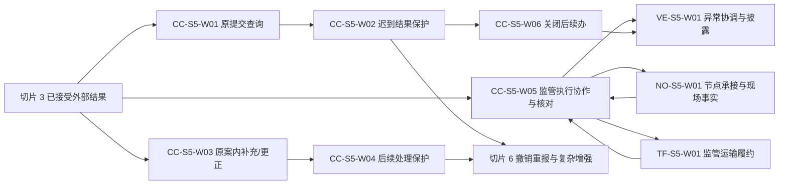

# IDP Parcel 关务切片 5 业务开发交接

状态：开发交接基线；查询、原案内补充/更正、监管执行协作、关闭后续办和异常披露边界已确认，真实程序、执行方、异常规则、披露规则和消息渠道参数待提供

本文把[关务与贸易合规专项开发基线](../product/CUSTOMS-FIRST-RELEASE-DEVELOPMENT-BASELINE.md)中的专项切片 5 组织成可以直接拆分、实现和验收的业务工作包。它只服务于产品主线中的 `PN-05` 关务控制域，不代表产品总体首发顺序；不重新定义领域规则，也不规定 API、数据库表、消息 Schema、调度算法、仓内设备协议、运输资源模型、消息渠道实现或部署拓扑。

## 交付目标

切片 5 完成后，系统能够：

- 对本产品原提交的通信超时或结果缺失形成可追溯查询，在权威依据不足时持续保持`原提交结果仍待确认`，不盲目重发或更换外部标识。
- 对真实程序自然发生的原案内资料补充或申报更正形成独立目标，并重新经过资料、就绪、授权、提交和外部结果链，不复用首次申报判断或授权。
- 把已接受查验、扣留和监管处置决定转为范围明确的关务执行协作事项，由节点、运输或其他执行方独立承接并形成实际事实，再由关务逐范围核对。
- 只在监管决定明确要求实际移动时建立独立监管旅程；原地查验、扣留和节点销毁不创建运输对象，监管退运也不回退原运输历史。
- 对关闭后迟到事实按固定案件身份、原关闭决定、受影响依据项和原关闭责任来源分类为受控重开、后续案件或无需改变生命周期。
- 只基于关务已经接受、范围明确的事实形成异常信号、分诊、异常案件、处置请求和逐客户披露；正常查验、扣留、税费或等待不自动成为异常。
- 把通知决定、消息提交、渠道接受、送达、失败和客户确认分层保存；任何前一层都不冒充后一层。

切片 5 不重新解释监管来源，不代表监管机构作决定，不直接修改客户资料、申报内容或原提交，不自动撤销重报，不形成节点/运输事实，不解除关务限制，不回退已经发生的物流、资金或结算事实，也不把异常案件关闭、客户通知或消息送达当作关务义务终结。

## 权威依据与验收分配

| 能力 | 权威文档 | 完整验收范围 | 切片 5 主责范围 | 其他切片边界 |
|---|---|---|---|---|
| 原提交查询与迟到结果保护 | [UC-CC-006](../application/customs-compliance/UC-CC-006-RECEIVE-AND-RECONCILE-EXTERNAL-RESULTS.md) | `AT-CC-140..180` | `AT-CC-141`、`AT-CC-165..170`、`AT-CC-178`、`AT-CC-180` | 其余验收由切片 3 主责；查询和安全再次发送不适用于承运商外部监管舱单 |
| 原案内补充/更正 | [UC-CC-007](../application/customs-compliance/UC-CC-007-MANAGE-POST-SUBMISSION-ACTIONS-AND-REPLACEMENT.md) | `AT-CC-181..220` | `AT-CC-181..190`、`AT-CC-208..214`、`AT-CC-216..220` | `AT-CC-191..207`、`AT-CC-215` 的撤销、重报和复杂替代留给切片 6 |
| 查验、扣留与处置协作 | [UC-CC-008](../application/customs-compliance/UC-CC-008-COORDINATE-INSPECTION-DETENTION-AND-RECONCILE-DISPOSITION.md) | `AT-CC-221..257` | 完整业务骨架；真实自然决定与执行使用 `P`，复杂分支使用 `R/S` | 多执行方处置等复杂生产增强留在 `UC-CC-008` 后续产品 backlog，不改变本切片验收主责 |
| 节点监管协作 | [UC-NO-001](../application/node-operations/UC-NO-001-ACCEPT-AND-EXECUTE-CUSTOMS-NODE-COLLABORATION.md) | `AT-NO-001..014` | 完整业务骨架 | 只有登记的真实节点、动作和权限可进入生产 |
| 监管运输处置 | [UC-TF-001](../application/transport-fulfillment/UC-TF-001-ACCEPT-AND-FULFILL-REGULATORY-TRANSPORT-DISPOSITION.md) | `AT-TF-001..012` | 完整业务骨架 | 无真实监管移动时只完成 `R/S`，不得建立虚假旅程 |
| 关闭后续办 | [UC-CC-010](../application/customs-compliance/UC-CC-010-CLOSE-REOPEN-AND-ESTABLISH-FOLLOW-UP-CASE.md) | `AT-CC-296..338` | `AT-CC-314..330`、`AT-CC-332`、`AT-CC-336..338` | `AT-CC-296..313`、`AT-CC-331`、`AT-CC-333..335` 仍由切片 3 主责 |
| 关务异常与客户披露 | [UC-VE-001](../application/visibility-exception/UC-VE-001-COORDINATE-CUSTOMS-EXCEPTIONS-AND-CUSTOMER-DISCLOSURE.md) | `AT-VE-001..037` | 完整业务骨架 | 正常事实和自然异常使用 `P`，未自然发生的复杂分支使用 `R/S` |
| 上下文所有权 | [领域上下文地图](../domain/CONTEXT-MAP.md)、[关务上下文](../domain/customs-compliance/CONTEXT.md)、[节点上下文](../domain/node-operations/CONTEXT.md)、[运输履约上下文](../domain/transport-fulfillment/CONTEXT.md)、[全程追踪与异常上下文](../domain/visibility-exception/CONTEXT.md) | 所有权、不变量和生命周期 | 全部适用 | 开发切片不能改变领域所有权 |

发生冲突时，领域文档和应用用例优先于本文。本文中的工作包、生产分层、顺序和完成检查只是开发交接，不取得业务定义所有权。跨工作包连续验收可以复跑依赖场景，但每个验收编号只有表中指定的一个开发切片和下文指定的一个主责工作包。

## 依赖顺序

节点和运输只消费关务已经形成的范围化协作依据，关务只引用执行方拥有的承接决定和实际事实。图中的回接表示稳定引用和业务核对，不表示两个上下文共同维护一个对象或共享状态机。

## 开发工作包

### `CC-S5-W01` 原提交待确认、查询与安全再次发送

交付：

- 只针对本产品的明确提交版本、原提交尝试和原外部业务关联形成查询请求、查询尝试和查询技术结果；查询不创建提交版本、提交尝试、授权使用或新凭证占用。
- 技术失败但来源不能证明监管侧未收到时形成`原提交结果仍待确认`；查询失败、超时、无查询能力、“无记录”或空结果也不改变该判断。
- 查询响应按切片 3 已交付的来源接受、关联、分层、重复、时效和冲突规则处理；查询接口成功本身不形成监管结果，状态快照不重复制造监管事件。
- 查询来源已经安全保全但关联、解释、持久化或发布因技术原因没有完成时形成`未形成外部结果`，从同一来源记录恢复，不要求渠道换标识重发。
- 只有合格来源和真实规则共同证明原尝试未形成可继续有效的外部申报身份，且再次发送同一版本不会重复申报时，才形成`原提交安全再次发送条件已确认`并请求 `UC-CC-005` 受控新尝试。
- 待确认期间拒绝换外部标识盲目重报，不释放凭证占用，不把原尝试改写为从未发生。

业务边界：承运商外部监管舱单由承运商形成和提交，本产品没有其原提交尝试，因此不进入本查询和安全再次发送流程。

验收所有权：`AT-CC-141`、`AT-CC-165..170`。真实锚点自然发生的超时、查询和查询响应可以使用 `P`；无记录、安全再次发送、无查询能力和失败边界未自然发生时使用 `R/S`，不得为验收制造重复申报风险。

### `CC-S5-W02` 关闭后迟到结果与早期尝试身份保护

交付：

- 关务案件关闭后收到迟到更正、补税或稽核消息时，先按切片 3 的来源规则形成不可覆盖的分层外部事实，再交 `UC-CC-010` 分类；不忽略事实或覆盖原关闭。
- 已形成 A2 后，A1 迟到取得监管接收或其他可继续有效外部身份时，使原安全再次发送判断不再有效，关联 A1、A2 及全部外部身份，并停止继续尝试和错误释放凭证。
- 凭证已经释放时形成适用调整或补充核销关系；额度已被其他提交占用时保留冲突或超用判断并阻止新增占用，不用一个当前余额覆盖历史。
- 将 A1/A2 重复风险交给切片 6 的撤销、更正或其他受控后续动作；本工作包不自动选择 A2 为替代者，也不形成撤销或重报目标。

验收所有权：`AT-CC-178`、`AT-CC-180`。默认使用 `R/S`；真实自然发生时保留 `P` 证据，但不得主动制造关闭后消息或重复申报。

### `CC-S5-W03` 原案内资料补充与申报更正目标

交付：

- 只有 `UC-CC-006` 已接受的外部要求或关务已经形成的当前有效合规判断可以触发后续处理；截图、邮件、客户改值请求和操作员备注不能直接形成目标。
- 真实程序明确保留原案件和原申报单元身份时，分别形成`原案内资料补充目标已形成`或`原案内申报更正目标已形成`；目标形成不创建资料、就绪、授权、提交或监管结果。
- 客户资料先通过 `UC-PS-002` 形成不可覆盖来源版本，再由 `UC-CC-002` 形成新的资料准备版本；直接覆盖已提交资料的请求必须拒绝覆盖式修改。
- 补充和更正目标绑定精确触发、原案件、原单元、原资料/提交版本、明确范围、规则和决定版本；未覆盖范围保持原判断。
- 来源称“改单”但真实程序不能确定身份连续性或动作分类时形成`后续处理决定未决`，不得默认原案内更正。

业务边界：同版本技术再次尝试交回 `UC-CC-005`；撤销、重报、替代层次和有效替代关系由切片 6 处理。所有补充和更正目标都重新经过资料、就绪、授权、提交和结果流程，不复用首次判断。

验收所有权：`AT-CC-181..190`。真实自然发生的补充或更正可以按参数准入使用 `P`；无效触发、范围更正、未知动作语义和负向边界使用 `R/S`。

### `CC-S5-W04` 后续处理幂等、权限、并发与恢复保护

交付：

- 相同请求、触发版本、原申报、范围、规则和输入返回`已有后续处理结果`；同一身份携带不同内容形成`后续处理请求冲突`，不按最后到达覆盖。
- 批量或多范围请求逐项形成原案内目标、`后续处理决定未决`、`无需形成当前后续申报目标`、`请求未受理`、`不适用本产品处理`或`未形成后续处理结果`，并只形成非监管的`来源范围逐项处理汇总`。
- 处理决定提交前触发、规则、原结果或范围变化时，不提交过期目标；目标已提交后触发被更正或撤销时，保留目标和提交，形成新的处理决定并继续接收外部结果。
- 后续动作决定、替代层次判断、提交授权和实际提交分别授权；有提交权限或系统管理员身份不能取得动作分类权限。
- 已关闭案件的后续要求先交 `UC-CC-010`，合法重开或后续案件结果形成后再建立目标；本工作包不自行重开案件。
- 每个补充/更正目标使用自己的资料、就绪、授权、提交版本、尝试和结果；不复活旧授权、旧凭证适用性或旧门禁。
- 结果或下游关联发布失败时只恢复同一意图，不重复建立目标、案件、单元或提交。

验收所有权：`AT-CC-208..214`、`AT-CC-216..220`。重复、冲突、并发、批量、越权、发布恢复和提交后触发变化默认使用 `R/S`；自然发生时可以保留 `P` 证据。

### `CC-S5-W05` 监管执行协作事项、事实接收与处置核对

交付：

- 只消费 `UC-CC-006` 已接受、当前有效且范围明确的监管决定，按法律结果层分别形成`查验协作事项已形成`、`扣留协作事项已形成`或`监管处置协作事项已形成`。
- 决定有效但执行方、能力、位置或授权不足时形成`待交接`；下游逐范围接受、部分接受、拒绝或要求补充后形成`执行交接结果已形成`，不把交接结果当作物理执行。
- 两个或多个合格执行方对同一协作事项中不可并行的交集范围均形成接受，且没有当前有效的责任分配、合法顺序或共同执行规则时形成`执行交接冲突`；保留全部接受结果，只阻断交集范围，非交集范围和已发生事实不受影响。
- 引用节点、运输或外部执行方拥有的实际事实，分别形成`执行事实已接收`、`部分执行事实已接收`或`执行失败事实已接收`，不复制或修改来源事实。
- 按真实程序要求的对象、数量、范围、时间、条件和证据维度形成`查验协作执行已核对`、`扣留控制证据已核对`、`处置执行核对已覆盖`、`处置执行核对部分覆盖`、`执行差异`、`执行事实冲突`或`核对证据不足`。
- `处置执行核对已覆盖`只结束本次物理执行待办；真实程序仍要求监管最终确认时继续等待 `UC-CC-006`，不得制造放行、义务终结或案件关闭。
- 决定取消、替代、范围收缩或事实迟到时形成新核对版本，已发生事实永久保留；未执行范围按当前决定停止或转交。
- 新决定明确取消、替代当前事项或移除范围时形成`当前事项无需继续`；同一请求身份携带不同决定、范围、动作或执行方时形成`协作请求冲突`；越权或不能合法关联时形成`未受理`；技术处理未完成时形成`未形成协作/核对结果`。
- 两个或多个已分别接受且各自当前有效的监管决定不构成`外部结果冲突`，但在同一对象的交集范围和适用期间要求互斥动作，且没有权威裁决或合法执行顺序时形成`监管决定执行要求冲突`；只阻断交集范围的新执行，非交集范围继续处理，不得复用`协作请求冲突`或`执行事实冲突`。
- 外部扣留与内部合规限制分别形成和解除；异常关闭、节点任务完成、运输到达或一方解除不能推导另一方解除。
- 同一请求、执行事实、范围和批量逐项执行幂等、冲突、越权、最小披露和发布恢复；不得重复派发或累计执行数量。

验收主责分配：

| 子范围 | 验收所有权 | 重点 |
|---|---|---|
| 事项形成、分类与责任交接 | `AT-CC-221..226`、`AT-CC-228`、`AT-CC-242..244`、`AT-CC-251..255` | 决定、事项、范围和下游承接分离 |
| 执行事实接收与关务核对 | `AT-CC-227`、`AT-CC-229..236`、`AT-CC-257` | 执行事实、内部核对与外部监管结果分离 |
| 更正、取消、迟到、并发与恢复 | `AT-CC-237..241`、`AT-CC-245..250`、`AT-CC-256` | 交接冲突只阻断交集范围；决定变化只停止剩余范围，不回退既有事实 |

`AT-CC-221..257` 合计完整覆盖且没有重复主责。真实程序自然产生的决定和执行使用 `P`；查验、扣留、销毁、退运、部分执行、冲突、并发、越权、失败和取消未自然发生时使用 `R/S`，不得为验收主动制造监管风险或不可逆动作。

权威结果已闭合：`AT-CC-242` 使用`监管决定执行要求冲突`表达多个当前有效决定在交集范围上的互斥执行要求；`AT-CC-246` 使用`执行交接冲突`表达稳定协作依据下多个合格执行方对不可并行交集范围均已接受、却没有当前有效责任分配、合法顺序或共同执行规则；`协作请求冲突`只表达同一请求身份携带不同内容，`执行事实冲突`只表达执行来源事实矛盾。四者不得互换，两类交集冲突都只阻断各自交集范围，不影响非交集范围或回退既有事实。

### `NO-S5-W01` 节点承接、作业任务与现场执行事实

交付：

- 节点只对当前有效、范围明确且指向本节点责任的关务事项逐对象、逐动作形成`节点协作已承接`、`节点协作部分承接`、`节点协作待补充`或`节点协作已拒绝`。
- 已承接范围形成`节点作业任务已形成`；任务只固定对象、动作、节点、依据和执行授权，不表示动作已经发生。
- 保存受控开封、隔离、清点、观察、重封、销毁、移交和退运装载等实际事实，形成`节点执行事实已形成`；节点事实不形成监管查验结论、放行或关务核对。
- 部分或未能执行形成`节点任务部分完成或未完成`；事项取消、替代或范围收缩只对尚可停止范围形成`当前剩余范围已停止`，不删除不可逆事实。
- 节点装载、交出扫描和节点侧证据不转移控制；只有 `transport-fulfillment` 的逐对象权威交接结果可以转移控制。
- 重复、冲突、迟到、更正、批量逐项、跨客户、权限和技术恢复分别形成`节点协作冲突`、`节点协作未受理`或`节点协作结果未形成`等权威结果，不要求现场重复不可逆动作。

验收所有权：`AT-NO-001..014`。真实自然节点协作可以使用 `P`；查验、扣留、销毁、越权、冲突、取消和不可逆部分执行未自然发生时使用 `R/S`。

### `TF-S5-W01` 监管运输承接、权威交接与独立旅程

交付：

- 只承接明确要求真实移动的范围，逐对象形成`监管运输协作已承接`、`监管运输协作部分承接`、`监管运输协作待补充`或`监管运输协作已拒绝`；扣留本身不是移动授权。
- 原地查验、原地扣留或节点销毁交 `UC-NO-001`，不建立运输委托、占位旅程、交接或移动事实。
- 真实路由、责任和移动授权成立后形成`独立监管旅程已建立`；新旅程与原旅程关联但身份独立，不回退原计划、交接、移动、交付或终局。
- 节点和运输方证据满足逐对象规则后形成`权威运输交接已形成`；订舱、承运接受、装载和节点扫描均不能单独代替。
- 出发、移动和到达形成`监管运输履约事实已形成`，到达只证明运输事实，仍由 `UC-CC-008` 核对处置覆盖。
- 协作取消、替代或收缩时只对尚未出发且可停止范围形成`当前剩余范围已停止`；重复、冲突、迟到、更正、越权和技术恢复使用`监管运输协作冲突`、`未受理`或`未形成履约结果`等权威结果。

验收所有权：`AT-TF-001..012`。只有 `PAR-NET-11` 真实路径、责任、伙伴能力和交接规则确认后才能使用 `P`；锚点线路无自然监管移动时完成 `R/S` 并登记生产剩余风险，不创建虚假退运旅程。

### `CC-S5-W06` 迟到事实分类、受控重开与后续案件

交付：

- 已关闭案件的迟到事实先保全，再逐范围比较原案件固定辖区、方向、程序、法定义务身份、原关闭决定和受影响关闭依据项，形成`迟到事实待分类`或明确分类。
- 同一程序续办只有在相关原关闭责任来源和当前授权共同允许时形成`关务案件已受控重开`；编辑权限、管理员身份或旧关闭授权不能替代当前重开授权。
- 固定身份改变或形成独立补税、稽核、申诉等义务时形成`后续关务案件已建立`，原案保持关闭；建案条件不足时不得改为重开规避缺口。
- 合格重复或不产生新义务的事实形成`当前事实无需改变案件生命周期`；请求冲突、越权和技术处理分别使用`关闭或续办请求冲突`、`关闭或续办请求未受理`和`未形成关闭或续办结果`。
- 同一来源含可分离范围时，分别受控重开原案和建立后续案件；一条消息不能强制归为一个结果。
- 重开后再次关闭重新形成`关闭核对已形成`、`案件可关闭`或`案件关闭未决`以及新的`关务案件已关闭`决定；不得复用旧核对或重置历史关闭周期。
- 重开和后续案件只恢复或建立关务责任，不撤销节点、运输、交付、资金、结算或异常事实，也不复活旧就绪、授权、凭证适用性或门禁。

验收主责分配：

| 子范围 | 验收所有权 | 重点 |
|---|---|---|
| 迟到事实保全与逐范围分类 | `AT-CC-314..316`、`AT-CC-324/325`、`AT-CC-330`、`AT-CC-336` | 先保全再分类，不按消息级二选一 |
| 受控重开、再次关闭与历史保护 | `AT-CC-317..319`、`AT-CC-327/328`、`AT-CC-337/338` | 尊重使当前关闭期成立的原关闭责任来源 |
| 独立义务后续案件 | `AT-CC-320..323`、`AT-CC-326`、`AT-CC-329`、`AT-CC-332` | 新案件固定身份，原案保持关闭 |

这些编号合计完整覆盖切片 5 的 `UC-CC-010` 主责范围。除重开后再次关闭的能力骨架外默认使用 `R/S`；真实迟到事实自然发生时保留 `P`，不得为验收制造补税、稽核、重开或独立监管义务。切片 3 主责的越权、跨客户和对象所有权场景只做新增分支交叉回归，不重复取得验收编号。

### `VE-S5-W01` 关务异常识别、协调和逐客户披露

交付：

- 只对已接受、范围明确的关务事实或判断形成`关务输入已接收`；原始监管消息、截图、自由备注和待关联输入不能直接形成异常。
- 按版本化异常规则形成`当前无需异常信号`、`异常信号已形成/更新`或`信号待分诊`；正常查验、扣留、税费和结果等待只有命中已登记异常/客户影响规则时才进入异常处理。
- 分诊形成`当前不建案`、`异常案件已关联`或`异常案件已建立`；后续按案件内必需动作、新事实和案件关系分别形成`异常案件已关闭`、`异常案件已受控重开`、`关联新异常案件已建立`或`重复异常案件已受控归并`。信号、案件、业务限制、责任结论和客户披露继续分离。
- 向源上下文形成`处置请求已形成`，并以`处置结果已回接`保存接受、拒绝、部分接受、待补充或实际结果引用；请求发送或接受不表示动作完成。
- 逐客户、逐对象和逐披露范围形成`当前暂不披露`、`客户披露待授权`或`客户异常通知已形成`；跨客户内部案件可以共享共同原因，但不能共享客户内容或泄露其他客户。
- 消费消息能力拥有的提交、接受、送达、失败和客户确认结果，形成`通知义务已满足/未满足/待确认`；渠道接受不冒充送达，送达不冒充客户确认。
- 已发布内容变化时追加更正或替代通知，不静默删除原内容；重复请求形成`已有异常/披露处理结果`，同一请求身份内容变化形成`异常/披露请求冲突`，越权形成`未受理`，技术失败形成`未形成异常/披露结果`，四者不得互换。
- 关务案件和异常案件各自按自己的固定身份或因果链、责任与处置范围关闭、重开或建立关联案件；重复异常案件以“已归并”关闭结论受控归并，不产生第四主状态；任一生命周期不自动驱动另一方。

验收所有权：`AT-VE-001..037`。正常关务输入、当前无需信号和自然发生异常使用 `P`；冲突、部分覆盖、跨客户、自动建案/自动发布、消息失败、更正、异常案件重开/新案/归并、双生命周期交错和技术恢复未自然发生时使用 `R/S`。不得主动制造监管冲突、客户恐慌、跨客户泄露或消息失败。

权威结果已闭合：异常案件关闭、受控重开、关联新案和重复案件归并分别使用`异常案件已关闭`、`异常案件已受控重开`、`关联新异常案件已建立`和`重复异常案件已受控归并`。其中“已归并”只是重复案件的关闭结论，案件主状态仍只有待响应、处理中和已关闭；重复、请求冲突、越权和技术未形成也各自拥有独立结果。

## 连续业务验收

至少形成以下可重复序列：

1. 本产品原提交通信结果待确认时形成查询；查询失败或无记录继续待确认，只有权威安全依据成立才请求同版本受控新尝试。
2. 监管返回正常补充或更正要求时形成原案内目标，新资料重新经过资料、就绪、授权、提交和结果链；旧提交及其全部结果保持可查。
3. 已接受查验、扣留或处置决定形成关务协作事项；节点只承接现场动作，运输只承接明确移动范围，关务只引用真实事实形成核对。
4. 节点部分执行、运输部分交接或执行证据不足时，逐对象保留已完成与剩余范围；批次汇总不冒充全部完成。
5. 执行核对已覆盖但仍需监管最终确认时继续等待外部结果；任务完成、运输到达和内部核对都不生成放行、解除或案件关闭。
6. 关务案件关闭后出现迟到事实时先分类，再按原关闭责任来源受控重开或建立后续案件；已经完成的物流、资金和结算事实不回退。
7. 只有关务稳定判断命中异常规则时才形成信号和案件；异常处置请求回接源上下文结果，但不修改源事实。
8. 每个客户独立形成披露决定和内容；消息接受、送达和客户确认分层回接，失败或更正不重复建案或覆盖历史通知。

## 参数门禁

| 参数 | 切片 5 可以完成 | 未确认时不得宣称完成 |
|---|---|---|
| `PAR-CUS-01/02/03/04` | 查询、动作分类、协作事项、权限和显式未决骨架 | 真实来源、查询语义、动作、执行证据、权限或安全再次发送可以生产判断 |
| `PAR-CUS-05` | 复杂分支的回放、正式测试或隔离模拟骨架 | 冲突、迟到、并发、撤销风险、多执行方或不可逆动作已有合格证据 |
| `PAR-CUS-06/07` | 迟到分类、重开/后续案件及限制独立性骨架 | 生产受控重开、后续案件或限制解除可以由默认角色决定 |
| `PAR-COM-01/03/05/06/13`、`PAR-INT-01` | 客户、法人、产品/合同隔离及客户资料新版本入口 | 客户资料改值、合同变化或管理员操作可以直接形成更正目标 |
| `PAR-NET-04..06`、`PAR-INT-03` | 节点、执行方、事实来源、控制和证据能力骨架 | 未登记节点、执行方、动作、完成证据或事实来源可进入生产 |
| `PAR-NET-11` | 监管运输的待补充、边界和 `R/S` 骨架 | 真实退运/监管移动路径、责任、伙伴能力和交接规则已生产就绪 |
| `PAR-VIS-04..07` | 异常信号、分诊、案件、响应、披露和人工授权骨架 | 默认异常类型、观察窗口、严重度、自动建案阈值、披露内容或通知时限可使用 |
| `PAR-INT-06` | 消息结果分层和失败恢复骨架 | 渠道接受、送达、失败或客户确认语义可以互相推导 |
| `PAR-NFR-06` | 查询、待办、执行、消息和恢复指标采集位置 | 查询周期、等待窗口、阈值、批量规模、重试次数、性能或恢复承诺 |

参数未确认时必须使用各权威用例的完整结果名称，不能创建“查询成功”“可重试”“处置完成”“清关异常”“通知成功”“业务未决”或“技术失败”等跨用例通用状态。任何默认国家、口岸、动作、数量、期限、执行方、权限、异常阈值、披露内容、渠道顺序或 SLA 都不得进入生产判断。

## 切片完成定义

切片 5 只有同时满足以下条件才完成：

1. 九个工作包全部完成，并能从每个工作包追溯到权威用例、唯一验收主责、生产分层和参数门禁。
2. `UC-CC-006` 切片 5 的九个验收场景、`UC-CC-007` 的二十二个验收场景和 `UC-CC-010` 的二十一个验收场景没有与切片 3 或切片 6 重复主责。
3. `AT-CC-221..257`、`AT-NO-001..014`、`AT-TF-001..012` 和 `AT-VE-001..037` 各自连续、无遗漏，并保持关务事项、执行方承接、任务/准备、实际事实、关务核对和异常协调分层。
4. 查询失败、无记录或无能力均不生成申报失败或安全重发；A1 迟到生效时旧安全判断失效，系统停止继续扩大重复风险。
5. 补充和更正只形成精确目标并重新经过完整链路；撤销、重报和复杂替代不越界进入本切片。
6. 节点装载和扫描不转移控制，运输到达不形成处置覆盖，处置核对覆盖不形成监管确认、放行或案件关闭。
7. 部分承接、部分执行、部分交接、部分移动和部分核对均逐对象/范围保留，批量汇总不吞并剩余范围或泄露其他客户。
8. 关务案件与异常案件的关闭、重开和新案生命周期互不级联；任何生命周期变化都不回退监管、物流、资金或结算事实。
9. 客户披露逐客户隔离，通知决定、消息提交、渠道接受、送达、失败和客户确认分别验证，已发布内容只能追加更正。
10. `监管决定执行要求冲突`、`执行交接冲突`、四项异常案件生命周期结果及异常/披露重复与请求冲突结果均以权威完整名称实现，开发没有复用相邻结果或自行创造跨用例状态；所有未就绪真实参数保持对应权威未决、待补充、未受理、未形成或 `R/S` 结果。

完成切片 5 证明本产品能够在不改写监管、现场、运输和消息来源事实的前提下，对查询待确认、正常补充/更正、监管执行、关闭后续办和客户披露形成可追溯最小闭环；不证明复杂撤销重报、多执行方生产处置、自动异常决策或自动客户发布已经生产就绪。
