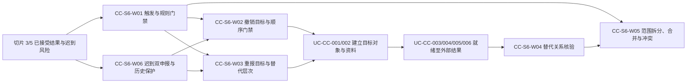

# IDP Parcel 关务切片 6 业务开发交接

状态：开发交接基线；复杂撤销、重报、替代层次、顺序门禁和替代关系边界已确认，真实出口/进口程序的动作语义、权限、顺序和生效结果参数待提供

本文把[关务与贸易合规专项开发基线](../product/CUSTOMS-FIRST-RELEASE-DEVELOPMENT-BASELINE.md)中的专项切片 6 收窄为可以直接拆分、实现和验收的“复杂撤销、重报与替代关系”工作。它只服务于产品主线中的 `PN-05` 关务控制域，不代表产品总体首发顺序；只承接 [UC-CC-007](../application/customs-compliance/UC-CC-007-MANAGE-POST-SUBMISSION-ACTIONS-AND-REPLACEMENT.md) 的 `AT-CC-191..207` 和 `AT-CC-215`，不重新定义领域规则，也不规定 API、数据库字段、消息 Schema、监管报文、渠道实现、部署拓扑或未经证据确认的时限。

## 交付目标与边界

切片 6 完成后，系统能够：

- 针对明确原外部申报身份形成独立的`申报撤销动作目标已形成`，但不把目标、请求发送、技术成功、监管接收或业务受理冒充监管撤销成立。
- 把撤销原申报和建立重报替代申报表达为相关但独立的业务目标；每个目标分别经过资料（如需）、就绪、授权、提交和外部结果链。
- 依据真实程序区分替代申报单元与替代关务案件，建立精确的`重报替代目标已形成`和拟替代关系，不修改原案件固定身份。
- 只在 `UC-CC-006` 已接受的权威外部结果和真实程序规则共同满足时形成`有效替代关系已形成`；条件未满足时保持既有目标和可查询的拟替代关系，不增加“待生效”状态。
- 对跨客户或多范围要求逐范围拆分、关联和判断，只在真实规则明确允许时合并或拆分目标。
- 对多个当前有效要求的互斥动作形成`后续申报动作要求冲突`，对规则尚不能决定的兼容、拆分、顺序或层次形成`后续处理决定未决`，不复用`后续处理请求冲突`。
- 在 A2 已发起后 A1 迟到取得有效外部申报身份时保留 A1、A2 和全部外部身份，并把受控处理映射到已经定义的明确动作结果。

切片 6 不执行：

- 修改原提交、原资料、原监管结果、原案件、原申报单元或已经发生的物流、资金和结算事实。
- 重新解释原始监管消息，或从待关联、解释未决、来源响应冲突、外部结果冲突中猜测撤销和重报动作。
- 代表监管机构形成撤销、重报、受理、放行或其他外部结果。
- 直接建立替代关务案件或申报单元；稳定目标分别交给 `UC-CC-001` 和 `UC-CC-002`。
- 复用首次申报的就绪、授权、提交版本、凭证判断或外部结果，也不在本用例占用、释放、核销或调整监管凭证。
- 自动关闭或重开关务案件。已关闭案件必须先由 `UC-CC-010` 形成合法受控重开或后续案件结果。
- 处理承运商外部监管舱单的更正、撤销或替代。该舱单仍由责任承运商形成和提交，本产品只通过 `UC-CC-012` 接受外部引用与关系。

## 权威依据与唯一验收主责

| 能力 | 权威来源 | 切片 6 唯一验收范围 | 其他切片边界 |
|---|---|---|---|
| 后续动作与替代关系 | [UC-CC-007](../application/customs-compliance/UC-CC-007-MANAGE-POST-SUBMISSION-ACTIONS-AND-REPLACEMENT.md) | `AT-CC-191..207`、`AT-CC-215`，共 18 项 | `AT-CC-181..190`、`AT-CC-208..214`、`AT-CC-216..220` 仍由切片 5 主责 |
| 关务领域规则 | [关务与贸易合规上下文](../domain/customs-compliance/CONTEXT.md) | 撤销与重报分离、案件固定身份、拟替代/有效替代、历史不可覆盖 | 本文不得改变领域语言、所有权或生命周期 |
| 原结果与后续结果 | [UC-CC-006](../application/customs-compliance/UC-CC-006-RECEIVE-AND-RECONCILE-EXTERNAL-RESULTS.md) | 只读消费已接受触发和后续动作外部结果 | 本切片不形成或重新解释外部结果 |
| 新案件、新单元和资料 | [UC-CC-001](../application/customs-compliance/UC-CC-001-ESTABLISH-CUSTOMS-CASE.md)、[UC-CC-002](../application/customs-compliance/UC-CC-002-FORM-DECLARATION-UNIT-AND-DATA.md) | 只形成并交接稳定目标 | 不在本切片建立或修改这些对象 |
| 就绪、授权和提交 | [UC-CC-003](../application/customs-compliance/UC-CC-003-ASSESS-DECLARATION-READINESS.md)、[UC-CC-004](../application/customs-compliance/UC-CC-004-AUTHORIZE-DECLARATION-SUBMISSION.md)、[UC-CC-005](../application/customs-compliance/UC-CC-005-FREEZE-SUBMISSION-AND-INITIATE-ATTEMPT.md) | 各新目标重新进入完整链路 | 顺序门禁由 `UC-CC-003` 唯一判断，`UC-CC-005` 只复核当前就绪依据 |
| 关闭后续办 | [UC-CC-010](../application/customs-compliance/UC-CC-010-CLOSE-REOPEN-AND-ESTABLISH-FOLLOW-UP-CASE.md) | 已关闭案件的前置生命周期结果 | 本切片不能自行重开或吸收独立义务 |

发生冲突时，领域上下文和权威应用用例优先于本文。跨工作包可以复跑依赖场景，但每个验收编号只有下文指定的一个主责工作包。

## 依赖顺序

图中的箭头表示稳定目标、依据和结果引用，不表示多个用例共同维护一个对象。撤销和重报可以按真实程序具有不同顺序，但任何顺序都必须由已登记规则形成，不能从图示位置推导生产顺序。

## 开发工作包

### `CC-S6-W01` 当前触发、动作规则与决定门禁

交付：

- 只接受能够确定关联原案件、原申报单元、原提交、外部身份和明确范围的当前有效触发；待关联、解释未决或未裁决外部冲突不形成动作目标。
- 出口和进口分别选择 `PAR-CUS-01/02` 的动作、身份保持、替代层次、顺序和生效规则，不从另一程序、页面文案或行业惯例推导。
- 动作类型、身份连续性、替代层次、顺序、生效条件或范围缺少权威规则时形成`后续处理决定未决`，列明已知依据、缺口和续办入口。
- 请求、动作分类、替代层次、拟替代关系建立、有效替代确认、提交授权和实际提交分别授权；拥有管理员、渠道或提交权限不能推导动作决定权限。
- 原提交仍处于`原提交结果仍待确认`且没有权威后续要求时，继续 `UC-CC-006` 查询，不用撤销重报绕过待确认。

验收所有权：`AT-CC-195`。使用 `R/S`；真实顺序与生效规则未登记时只完成显式未决、权限、审计和恢复骨架。

### `CC-S6-W02` 独立撤销目标与发送顺序门禁

交付：

- 对明确原外部申报身份和范围形成`申报撤销动作目标已形成`，保存触发、撤销规则、顺序门禁和决定版本；目标不改变原申报的外部效力。
- 撤销目标拥有自己的就绪、授权、提交版本、尝试和分层外部结果。撤销请求技术成功不生成监管撤销，也不使拟替代关系生效。
- 真实程序要求先取得指定撤销外部结果才能发送重报时，把该要求交给 `UC-CC-003` 作为唯一就绪规则入口判断；`UC-CC-005` 只复核该就绪判断及依据仍为当前。
- 规则只允许提前准备替代资料时，可以形成资料准备目标，但准备完成不等于重报可发送，不得在 `UC-CC-005` 再建一套顺序规则。

验收所有权：`AT-CC-191`、`AT-CC-192`、`AT-CC-194`、`AT-CC-196`。默认使用 `R/S`；不得为验收主动撤销生产申报。

### `CC-S6-W03` 新逻辑重报目标与替代层次

交付：

- 规则要求撤销并重新申报时，分别形成撤销目标和`重报替代目标已形成`，保存二者逐范围关系，不压缩成一个“撤销重报”状态或一次提交。
- 重报内容即使与原提交完全相同，也形成新的逻辑申报目标，重新经过资料、就绪、授权、提交和外部结果链；不得伪装为同版本技术再次尝试。
- 原申报单元不能继续使用，但案件辖区、方向、程序和法定义务范围不变时，形成替代申报单元目标并交给 `UC-CC-002`。
- 案件固定身份变化或形成独立监管义务时，形成替代/关联新案件目标并交给 `UC-CC-001`；角色、渠道、账号或报关服务方变化本身不自动建立新案件。
- 新目标和拟替代关系不得循环、自替代或无规则依据地形成多个并行当前替代者。

验收所有权：`AT-CC-193`、`AT-CC-197..199`。默认使用 `R/S`；真实对象建立只能在程序、范围和权限参数齐备后进行。

### `CC-S6-W04` 拟替代到有效替代关系核验

交付：

- `重报替代目标已形成`同时建立指向精确原对象和目标的拟替代关系；目标对象已建立不表示原对象已撤销、作废或被替代。
- 后续外部结果尚未满足生效条件时，返回既有后续处理结果并保持可查询的拟替代关系，不创建“替代待生效”等新状态。
- 只有 `UC-CC-006` 已接受真实程序指定的全部外部结果，且范围、顺序和其他生效条件共同满足时，才形成`有效替代关系已形成`。
- 技术成功、监管接收、业务受理或程序未指定为生效依据的其他层次不能互相推导，也不能提前升级关系。
- 关系生效只作用于明确范围；原案件、单元、资料、提交、尝试和所有监管结果永久可查。

验收所有权：`AT-CC-200..202`。真实替代自然发生且参数已批准时可以保留 `P`，否则使用 `R/S`。

### `CC-S6-W05` 部分范围、目标拆分/合并与要求冲突

交付：

- 跨客户或多范围要求只作用于明确成员。一个客户/包裹的更正、撤销或重报不得扩大到同单、同袋、同舱单、同班次或其他客户范围。
- 一个要求产生多个目标，或多个要求由一个目标满足，只在真实规则明确允许且逐触发、逐范围关系完整时成立；不能为了减少操作静默合并或拆分。
- 一个目标或范围失败、未决或冲突不回滚其他已经合法形成的目标；非监管汇总不成为整单动作或监管结果。
- 多个已接受且各自当前有效的触发依据对同一原申报交集范围明确要求互斥动作，且没有权威兼容或裁决规则时形成`后续申报动作要求冲突`，只阻断交集范围。
- 要求是否兼容、是否可以合并/拆分或规则适用性本身未知时形成`后续处理决定未决`；同一请求身份携带不同内容才形成`后续处理请求冲突`，三者不得互换。

验收所有权：`AT-CC-204..207`。跨客户、拆分、合并和冲突默认使用 `R/S`，不得为验收制造生产冲突或跨客户监管风险。

### `CC-S6-W06` 迟到双申报与历史、凭证关系保护

交付：

- 有效替代形成后，原资料、提交、尝试、接收、受理、税费、查验、放行和撤销结果仍完整可查，不把原对象回退为从未提交。
- A2 发起后 A1 迟到取得有效外部申报身份时，保留 A1、A2、全部提交尝试和外部身份，不按发送时间自动选择替代者。
- 受控处理必须映射为`申报撤销动作目标已形成`、`原案内申报更正目标已形成`或`重报替代目标已形成`中的适用结果；无法映射时形成`后续处理决定未决`，互斥要求形成`后续申报动作要求冲突`，不得创建通用“其他目标”。
- 本工作包只引用凭证占用、释放、核销，以及迟到权威结果或后续监管更正形成的调整、补充核销和冲突关系；这些结果分别由 `UC-CC-005/006` 拥有，`UC-CC-007` 不修改凭证额度或历史。
- 已经发生的放行、节点作业、运输交接、移动、交付、资金和结算事实不因撤销、重报或替代关系变化而回退。

验收所有权：`AT-CC-203`、`AT-CC-215`。默认使用 `R/S`；真实迟到双申报风险只能按自然发生事实保留 `P`，不得主动制造。

## 连续业务验收

至少形成以下可重复序列：

1. 已接受撤销要求形成独立撤销目标；技术成功只保留技术结果，原申报外部效力和拟替代关系不被提前改变。
2. 撤销与重报分别形成目标；`UC-CC-003` 按真实顺序门禁形成就绪结果，`UC-CC-005` 只复核当前依据并分别发送。
3. 同案重报建立替代申报单元目标，固定案件身份变化时建立替代/关联新案件目标；原对象均保持不变。
4. 新目标取得部分外部结果时仍保持拟替代关系；只有全部权威生效条件成立才形成有效替代，随后原历史仍完整可查。
5. 跨客户和多范围要求逐项形成目标、未决或冲突，交集范围阻断不扩大到非交集范围，批量汇总不形成整单替代。
6. A1 迟到与 A2 并存时，系统保留全部身份并按明确动作规则受控处理；无法分类时显式未决，不自动选择替代者。

## 参数门禁与证据分层

| 参数 | 可以完成的稳定骨架 | 未确认时不得宣称完成 |
|---|---|---|
| `PAR-CUS-01/02` | 程序隔离、动作/层次/顺序/生效规则引用、显式未决 | 出口或进口的撤销、重报、替代层次、发送顺序和有效替代可以生产判断，或一方配置可用于另一方 |
| `PAR-CUS-03` | 分离权限点、最小披露、未受理和审计 | 管理员、提交授权或渠道权限可以形成动作决定、替代层次或有效替代 |
| `PAR-CUS-04` | 版本化规则、限制/凭证影响引用和当前性复核 | 未登记法定时点、限制或凭证规则可以用默认值支持发送或关系生效 |
| `PAR-CUS-05` | 撤销重报、拆分/合并、冲突、迟到和关系生命周期的 `R/S` 骨架 | 复杂分支已经具有合格生产证据，或可以主动制造生产风险验收 |
| `PAR-CUS-06` | 已关闭案件的前置结果引用 | 本切片可以自行重开案件或吸收独立后续义务 |
| `PAR-COM-01/03/05/06` | 客户、责任法人、产品、合同和范围隔离引用 | 待核验客户、法人、产品或合同范围可以进入生产撤销重报 |
| `PAR-NFR-06` | 各阶段观测与失败位置 | 可以填写未经真实基线确认的响应、提醒、批量或恢复时限 |

18 个验收场景默认采用 `R/S`。真实业务自然发生，并且对应程序、责任、权限、范围和生产批准均已登记时，才保留 `P` 证据。不得为验收主动制造撤销、重复申报、迟到监管结果、跨客户冲突或替代关系。

参数缺失时可以实现稳定请求、目标、拟替代关系、显式未决/冲突、权限、审计、发布恢复和测试骨架，但不得向真实监管渠道发送动作或形成生产有效替代。

## 后续增强边界

以下能力不属于本切片的额外验收主责：

- 多执行方处置仍沿用切片 5 与 `UC-CC-008` 的验收所有权，只有真实执行方、责任和证据支持时再建立独立生产增强任务。
- 多付款分配、监管税费退回决定、资金退回和付款撤销仍沿用切片 4、`UC-CC-009` 与 `UC-SA-001` 的所有权，不进入撤销重报目标。
- `AT-CC-204` 只证明既有跨客户申报中的后续动作范围隔离，不代表扩大首发跨客户合报生产范围。
- 承运商外部监管舱单的更正、撤销和替代仍由承运商负责；本产品不得因此补造本地撤销或重报提交。

这些能力应在真实业务量、程序和责任证据支持时分别进入产品 backlog，不再合并成一个无边界的“后续增强”工作包。

## 切片完成定义

切片 6 只有同时满足以下条件才完成：

1. 六个工作包全部完成，`AT-CC-191..207` 和 `AT-CC-215` 共 18 项验收连续、无遗漏、无重复主责。
2. 切片 5 的 `AT-CC-181..190`、`AT-CC-208..214`、`AT-CC-216..220` 没有被重新取得主责。
3. 撤销与重报分别形成目标、就绪、授权、提交和外部结果，不存在合并的“撤销重报成功”状态。
4. `UC-CC-003` 是顺序门禁的唯一就绪判断入口，`UC-CC-005` 只复核当前判断；开发没有建立两套规则。
5. 重报不复用原提交版本、就绪、授权、凭证判断或外部结果，替代层次不修改原案件固定身份。
6. 拟替代关系在权威生效条件满足前保持可查询但不升级，也不新增“替代待生效”状态。
7. 有效替代只作用于明确范围，原案件、单元、资料、提交、结果和既有物流/资金事实均未删除或回退。
8. 部分范围、跨客户、一个要求多目标、多个要求一目标和互斥要求均逐项保存；非交集范围不被冲突扩大。
9. A1/A2 迟到双申报使用现有明确动作结果或显式未决/动作要求冲突，不存在通用“其他目标”或自动替代者。
10. 所有未确认参数稳定阻断生产发送和有效替代；`P/R/S` 证据分层、权限、审计、幂等、并发和恢复均可重复验证。

完成切片 6 证明本产品能够把复杂撤销、重报和替代关系组织为不覆盖历史、可逐范围验收的业务链；不证明多执行方处置、多付款分配、税费退回或资金撤销已经进入生产范围。
