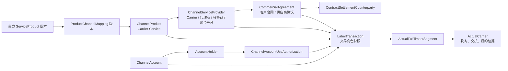

# IDP Parcel 代理商、Carrier 与 Carrier Service 关系开发交接

状态：关系语义已确认；真实伙伴、协议、账号和渠道实例待参数化，当前生产结论为 `No-Go / 待参数化`

本文把代理商、Carrier、Carrier Service（领域规范名：`渠道产品`）之间已经确认的业务关系整理为开发可消费的最小契约。它是跨上下文开发交接，不新增限界上下文，不建立第二套领域规则，也不把当前设计扩展成通用 Carrier 主数据平台。

本文的权威来源仍是[参与方与商业上下文](../domain/party-commercial/CONTEXT.md)、[统一领域语言](../domain/GLOSSARY.md)、[小包托运上下文](../domain/parcel-shipment/CONTEXT.md)、[运输履约上下文](../domain/transport-fulfillment/CONTEXT.md)和[领域上下文地图](../domain/CONTEXT-MAP.md)。本文只组织实现边界、最小字段和验收情形；不规定 API、数据库表、外部承运商协议、凭据保存或真实实例值。

## 一句话决策

不要建立一个含义不清的 `carrier_id`。一笔业务至少要分别回答：

1. 客户购买的是我方哪个 `ServiceProduct`。
2. 本次使用哪个外部 `ChannelProduct`（Carrier Service）。
3. 谁直接提供这个渠道并接收下单请求。
4. 谁持有本次使用的渠道账号，谁授权我方使用。
5. 谁是合同与结算相对方。
6. 渠道声明的底层承运商是谁，以及谁最终被履约证据证明为实际承运商。

同一参与方可以同时承担其中多个角色，但每个角色都必须有自己的字段、依据、有效期和交易快照。

## 关系图

上图中的箭头不是“自动推导”。它表示可引用关系：例如 `ChannelProduct` 有一个渠道服务方，但不能据此自动得到实际承运商；`ProductChannelMapping` 只给出候选范围，具体交易仍需选择并锁定。

## 角色关系矩阵

| 对象/角色 | 回答的问题 | 典型参与方 | 权威上下文 | 禁止推导 |
|---|---|---|---|---|
| `ServiceProduct` | 我方卖给货主的是什么服务 | 运营企业 | `party-commercial` | 不等于外部 Carrier Service |
| `ChannelProduct` | 可以向外部渠道购买或调用什么服务 | Carrier、代理商、转售商、聚合平台提供的服务 | `party-commercial` | 不等于实际承运商或面单交易 |
| `ProductChannelMapping` | 我方服务产品允许哪些渠道候选 | 运营企业配置 | `party-commercial` | 不等于本次已经选用 |
| `ChannelServiceProvider` | 谁直接接收面单/渠道请求并返回渠道结果 | Carrier 直营渠道、代理商、转售商、聚合平台 | `party-commercial`；交易快照由 `parcel-shipment` 保存 | 不等于底层或实际承运商 |
| `ChannelAccountHolder` | 本次使用的渠道账号归谁 | 我方、货主客户或实际账号持有人 | `party-commercial` | 凭据可用不等于业务授权 |
| `ContractSettlementCounterparty` | 谁依据合同负责账单、退款、对账或结算 | Carrier、代理商、转售商或平台 | 合同由 `party-commercial`，结果由 `settlement-accounting` | 不等于实际承运商 |
| `UnderlyingCarrier` | 渠道产品或渠道结果明确声明的底层网络提供方是谁 | Carrier 或其网络方 | `parcel-shipment` 保存交易快照 | 不保证亲自完成每一段运输 |
| `ActualCarrier` | 谁实际接收并运输明确载运对象 | 每个实际履约段的执行方 | `transport-fulfillment` | 不从品牌、单号、订舱或代理商接口成功推断 |
| `ResponsibleParty` | 对某个责任范围依法或依合同承担责任的是谁 | 代理商、Carrier、运营企业或其他合同主体 | 依据合同和履约责任快照 | 不从账号持有人或渠道品牌推断 |

`ChannelServiceProvider`、`ChannelAccountHolder`、`ContractSettlementCounterparty`、`UnderlyingCarrier`、`ActualCarrier` 和 `ResponsibleParty` 可以指向同一个 `Party`，也可以全部不同；实现不得用一个企业分类字段代替这组交易角色。

## 商业关系的最小表达

`party-commercial` 中的参与方关系必须至少保留以下维度：

| 维度 | 要求 |
|---|---|
| 双方 | `fromPartyId`、`toPartyId`，不能只保存名称或品牌 |
| 关系语义 | 至少能表达代理/授权、转售、提供渠道产品、账号持有、账号使用授权、供应商关系和责任委派 |
| 方向 | 明确谁代理谁、谁授权谁、谁向谁提供服务；不能用无向标签替代 |
| 适用范围 | 租户、责任法人、客户账户、服务产品/渠道产品、国家/线路或业务动作等适用边界 |
| 有效区间 | `effectiveFrom`、`effectiveTo`；到期或撤销不删除历史 |
| 依据 | 合同/协议/授权版本及受控证据索引 |
| 修订 | 单调 `revisionId` 或等价当前修订标识，用于判断历史解析是否仍相容 |
| 状态 | 草稿、已生效、已到期、已撤销、已替代等生命周期结果；不能由账号连通性代替 |

关系类型不是企业永久标签。比如“代理商 A 代理 Carrier B”的关系可以有效，但在某笔交易中 A 可能只是渠道服务方；是否由 A 承担面单退款或运输责任，仍由该笔交易引用的合同确定。

## 面单交易的最小快照

`parcel-shipment` 建立面单交易时，至少固定下列引用。以下是业务字段契约，不是要求直接采用同名 API 或数据库字段：

| 字段组 | 最小内容 |
|---|---|
| 我方商业选择 | `serviceProductVersion`、`customerContractVersion`、`productChannelMappingVersion` |
| 渠道选择 | `channelProductVersion`、`channelServiceProviderParty`、渠道选择原因/锁定依据 |
| 账号授权 | `channelAccount`、`channelAccountHolderParty`、`accountUseAuthorizationVersion`、授权范围和有效期 |
| 合同责任 | `contractSettlementCounterpartyParty`、采用的客户/供应商协议版本、责任范围 |
| 渠道声明 | `underlyingCarrierParty`（允许为空）、声明状态、来源和业务时间 |
| 责任快照 | `responsibleParty` 及其责任范围，例如面单受理、渠道退款、运输履约、索赔或客户费用 |
| 证据与版本 | 商业选择锚点、采用版本、`asOf`、当前修订标识、来源证据索引和快照形成时间 |

任何一项对当前服务形态确实不适用，都要记录“不适用”及原因；缺失不能默认为“我方”“Carrier”或“代理商”。后续合同、映射、账号授权或关系变化只影响新交易，不能改写已经形成的交易快照。

## 实际承运判断的最小快照

`transport-fulfillment` 对每个实际履约段和载运对象保存：

- 实际履约段身份和对象范围。
- 当前实际承运商身份，或“待确认/冲突”结果。
- 形成判断的收寄、权威交接、控制转移、移动和交付证据索引。
- 每项证据的来源身份、业务发生时间、对象范围和版本。
- 判断版本、补证关系和未知期间；后续补证不得删除原来的未知判断。

只有证据证明明确承运方已接收实物或取得运输控制，才能形成首次有效收寄和实际承运商判断。代理商接口返回成功、预报、订舱、舱单、品牌或单号格式都不能单独触发该判断。

一段旅程可以有多个实际承运商。干线、转运和尾程应分别建立实际履约段；不能用一个 `actualCarrier` 覆盖全程。

## 交易判定顺序

1. `party-commercial` 按商业选择锚点解析客户、责任法人、我方服务产品、客户合同和规则包。
2. 在客户合同和产品—渠道映射允许的范围内得到渠道候选。
3. 校验渠道产品当前有效性、账号持有人及账号使用授权；客户指定的渠道产品形成交易级锁定，不能静默替换。
4. `parcel-shipment` 创建面单交易，并保存上述商业和角色快照。
5. 渠道返回的受理、失败、作废或退款结果，只形成渠道交易结果；不直接形成实际收寄或实际承运商。
6. `transport-fulfillment` 根据收寄、交接和履约证据形成实际履约段及实际承运商判断；证据不足保持待确认。
7. `parcel-pricing` 分别形成对客户的 `SELL` 评价和对供应商/渠道的 `BUY` 评价；`settlement-accounting` 依据合同相对方、运输收费发生项和账单审核形成实际金额责任。

## 必须通过的验收情形

| 情形 | 预期结果 |
|---|---|
| Carrier 直营渠道 | 渠道服务方、底层承运商可能都是 Carrier；实际承运商仍等收寄/交接证据 |
| 代理商转售 Carrier Service | 代理商可为渠道服务方和结算相对方；不得自动写成实际承运商 |
| 代理商承担端到端合同责任 | 代理商可成为责任承担方；底层/实际承运商仍分别保存 |
| 客户自有账号 | 保存客户账号持有人和我方使用授权；不自动产生我方采购、退款权或供应商应付 |
| 聚合平台分配多个 Carrier | 渠道服务方是平台；底层承运商可按渠道结果确定；各履约段实际承运商独立判断 |
| 代理商接口返回成功但无实物交接证据 | 面单交易可形成渠道受理责任；实际承运商和取消边界相关收寄事实保持待确认 |
| 渠道账号撤销或渠道产品停用 | 拒绝新的渠道使用；不删除历史交易，也不自动关闭或重开包裹 |
| 后续补充实际承运证据 | 追加实际承运商判断和来源；保留之前的待确认期间及历史 |
| 渠道服务方与结算相对方不同 | 两个角色分别记录，按合同确定退款、账单和付款责任 |

## 开发工作包

### `PCR-W01` 商业关系与渠道目录

实现参与方关系、渠道产品、产品—渠道映射、供应商协议、账号持有人和账号使用授权的版本化读取。未确认的真实伙伴、线路和账号只允许显式未配置或隔离 `S`。

### `PCR-W02` 面单交易角色快照

在 `parcel-shipment` 锁定具体渠道后保存交易角色快照、采用版本、范围和证据索引。交易快照不可被后续主数据变更覆盖。

### `PCR-W03` 实际承运商证据判定

在 `transport-fulfillment` 按实际履约段消费收寄/交接证据，支持已确认、待确认、冲突和后续补证；不从渠道结果直接推导。

### `PCR-W04` 计价与结算责任交接

保持 `SELL`、`BUY`、合同相对方、运输收费发生项、供应商账单和审核应付分层；禁止按面单上显示的 Carrier 直接生成应付。

### `PCR-W05` 联合验证

覆盖上表九类情形，并验证同一参与方多角色、跨段实际承运商、账号授权失效、迟到证据和历史不可覆盖。真实生产分支仍需参数登记册证据和 PN-08 准入。

## 明确不做的事情

- 不创建一个全局 `Carrier` 类型枚举并据此推导所有责任。
- 不把 Carrier Service、渠道账号、面单交易、运输委托和实际履约段合并成一个对象。
- 不根据品牌、单号前缀、API 主体或最后一条消息自动认定实际承运商。
- 不因为代理商关系自动生成采购、退款、应付或索赔责任。
- 不在本交接文档中保存真实账号凭据、合同正文、伙伴名称或 MinIO 对象内容。
- 不因新增关系矩阵创建新的限界上下文；它只连接现有 `party-commercial`、`parcel-shipment`、`transport-fulfillment`、`parcel-pricing` 和 `settlement-accounting`。

## 完成定义

本交接达到完成的条件是：开发能够依据权威上下文实现上述角色引用、交易快照和实际承运判断的稳定骨架；所有无法由现有真实证据确认的实例字段都明确返回未配置/待确认，并且测试证明任何一个角色不能静默替代另一个角色。完成本文不代表真实 Carrier、代理商、账号或线路已经取得生产准入。
