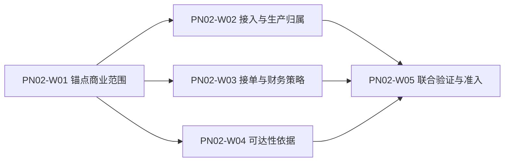

# IDP Parcel `PN-02` 真实参数取证与开发交接

状态：业务取证与开发准入基线；接单机制和取证责任已确认，真实实例、参数状态及证据仍以参数登记册为准

本文把 [`PN-02`](../product/PARCEL-NETWORK-FIRST-RELEASE-DEVELOPMENT-BASELINE.md) 的商业权威发布与解析、生产接入与归属、接受前可达性、委托接受和决定前撤回组织成可并行执行的取证与开发工作包。它不重新定义 [`UC-PC-001/002`](../application/party-commercial/UC-PC-001-MAINTAIN-AND-PUBLISH-COMMERCIAL-AUTHORITY.md)、[`UC-PS-001/002/005`](../application/parcel-shipment/UC-PS-001-SUBMIT-SHIPMENT-REQUEST.md)、[`UC-NR-002`](../application/network-routing/UC-NR-002-ASSESS-PARCEL-REACHABILITY.md) 或领域规则，也不维护第二套参数当前值。

本文不规定 API、文件格式、数据库字段、消息 Schema、部署方式、国家专属规则、真实金额、阈值、角色名单或 SLA。真实客户名称、合同正文、账号凭据、地址、货物资料和受限证据不得写入仓库。

## 交付目标

`PN-02` 必须同时推进两条工作线：

- **稳定业务骨架**：实现独立商业对象及不可覆盖版本、商业发布/解析结果、来源保全、重复与冲突、生产归属结果、`已提交`委托、接受判断任务、决定前撤回、显式未配置和安全续办，不依赖真实客户、线路、金额或渠道值。
- **真实参数取证**：取得锚点范围、接入身份、接单规则、财务控制、网络可达性和试点治理证据，使相应配置分支可以从合成验证逐步进入限量生产。

参数未提供时只阻断依赖它的分支，不能阻断稳定骨架开发；稳定骨架完成也不能被解释为已经具备生产接单能力。

## 权威依据

| 职责 | 权威文档 | 本文如何使用 |
|---|---|---|
| 参数当前状态和证据责任 | [首发试点参数与证据登记册](../product/PILOT-PARAMETER-REGISTER.md) | 唯一状态台账；本文只组织取证依赖 |
| 试点范围和明确排除项 | [首发试点范围](../product/PILOT-SCOPE.md) | 限制真实候选范围，不证明候选已经确认 |
| 商业权威发布 | [`UC-PC-001`](../application/party-commercial/UC-PC-001-MAINTAIN-AND-PUBLISH-COMMERCIAL-AUTHORITY.md) | 固定独立商业对象、不可覆盖版本、发布批准、冲突与替代边界 |
| 商业依据解析 | [`UC-PC-002`](../application/party-commercial/UC-PC-002-RESOLVE-COMMERCIAL-BASIS.md) | 固定独立商业选择锚点、唯一解析和逐项 `asOf` 的两阶段机制 |
| 接单业务编排 | [`UC-PS-001`](../application/parcel-shipment/UC-PS-001-SUBMIT-SHIPMENT-REQUEST.md) | 固定生产归属先于建单、接受判断和决定边界 |
| 决定前撤回 | [`UC-PS-005`](../application/parcel-shipment/UC-PS-005-WITHDRAW-SUBMITTED-SHIPMENT-REQUEST.md) | 固定撤回与接受/拒绝并发、判断任务停止及冻结释放补偿边界 |
| 接受前可达性 | [`UC-NR-002`](../application/network-routing/UC-NR-002-ASSESS-PARCEL-REACHABILITY.md) | 固定三值判断、证据完整性和失效重判 |
| 领域所有权 | [领域上下文地图](../domain/CONTEXT-MAP.md) | 参数不能改变规则、判断、金额或决定所有者 |
| 试点验收 | [首发试点验收场景矩阵](../product/PILOT-ACCEPTANCE-MATRIX.md) | 确定 `P/R/S/N/A` 证据层级和阻断范围 |
| 首个代码子切片 | [Go 首个消费者切片实施决策简报](./parcel-go-first-consumer-slice-decision-brief.md) | 固定 `PS-W1-S1` 的代码边界和未实现范围 |

发生冲突时，领域上下文和应用用例定义业务语义，参数登记册只实例化这些规则，本文只决定取证与开发顺序。

## 三档开发准入

| 档位 | 参数要求 | 可以交付 | 不得宣称 |
|---|---|---|---|
| 稳定骨架 | 不要求真实参数已确认 | 强类型身份、来源保全、重复/冲突、生产归属三类结果、已提交委托、接受判断任务、未配置与续办测试 | 已接受、已拒绝、真实可达、真实冻结或生产就绪 |
| 配置验证 | 相关候选、规则和样本已有受控证据，可使用脱敏回放 `R` 或隔离模拟 `S` | 规则装配、时点选择、三值可达性、财务控制和决定编排的可重复验证 | 候选已成为当前生产配置或已取得生产权威 |
| 生产分支 | 该精确分支直接依赖的适用参数组成均已确认或有权威不适用依据，并取得适用阶段准入决定；参数整体状态仍按登记册保守汇总 | 明确锚点范围的生产接入、判断和决定 | 将局部组成或一个范围的确认推广到整个参数、其他客户、线路、合同、渠道或期间 |

以上是交付层级，不是委托或接受判断任务的新生命周期状态。

## 当前实现闸门

当前的代码准入比本文件描述的最终稳定骨架更窄：

- `PN02-W01` 和 `PN02-W02` 的业务语义证据未完成前，只继续独立商业对象/版本、发布冲突、建单前作用域身份、来源重放/冲突、最小委托候选和提交批次候选内核；不创建伪造的生产商业发布、生产归属端口、`已提交`委托、接受判断任务或领域事件。
- W02 的范围、版本、`asOf`、有效区间、当前修订、权威身份和安全交接语义完成核验后，才评审一个足够表达完整结果的应用端口和归属编排；该评审不等于真实生产参数已经准入。
- 即使 W02 已经允许建立`已提交`委托，`PN02-W03` 的规则/财务证据和 `PN02-W04` 的可达性证据未完成前，也不得实现或宣称真实`已接受`、`已拒绝`、接受基线或预计承诺。
- 业务写入、Repository、事务和 Outbox 还必须等待不可变 Bento RC 及其消费者合同通过；不得用本地替身、`replace`、伪事务或浮动分支提前实现。

这条闸门把“可以先验证的业务内核”“可以定义的业务合同”和“可以承担生产写入责任的实现”分开，避免工作单或测试夹具被误报为生产能力。

## 取证依赖

候选证据可以并行收集，但生产分支不能绕过依赖。例如，接入渠道已经可调用，不等于本产品已经取得该委托的生产归属；线路已经存在，也不等于每个包裹已经形成可达判断。

## 取证与开发工作包

### [`PN02-W01` 锚点商业与服务范围](./pn-02-w01-anchor-commercial-scope-evidence-request.md)

主责参数：`PAR-COM-01`、`PAR-COM-03`、`PAR-COM-05`、`PAR-COM-06`、`PAR-NET-01`。

必须取得：

- 唯一锚点货主客户账户、合同责任法人、已发布服务产品版本、当前合同版本和成熟线路的稳定脱敏标识。
- 五个对象的受控真实映射、版本、有效区间和相互适用关系；客户、法人、产品、合同和线路不能压缩成一个“客户配置”。
- 客户账户、服务产品、合同、规则包和财务策略分别经过有权批准并形成不可覆盖发布版本；导入成功、页面可见或技术同步不能替代发布。
- 每项证据的提供方、核验方、最终决定方、能证明的事实和不能证明的事实。
- 任一对象失效或替换时停止新增准入、保留历史引用并重新核验依赖关系的责任。

开发交付：按 `UC-PC-001` 建立相互独立的身份、关系、版本、发布/拒绝/冲突/未决和显式未配置结果。任一参数未确认时，不得形成真实商业发布或资格通过结果。

### [`PN02-W02` 生产接入、请求身份与生产归属](./pn-02-w02-ingress-production-ownership-evidence-request.md)

主责参数：`PAR-INT-01`、`PAR-GOV-03` 至 `PAR-GOV-07`。

必须取得：

- 锚点客户唯一生产接入渠道及其来源身份、委托业务身份、来源请求键组成、规范化内容摘要（`PayloadDigest`）覆盖字段、重试、冲突、纠错和查询边界；必须明确 `requestEffectiveAt` 的值/缺失状态进入摘要，`occurredAt`/`receivedAt` 不进入摘要且变化本身不形成冲突。
- 完整拟受理范围的准入规则版本、适用客户/产品/线路/时间窗口/容量范围和具体判断时点。
- 本产品、其他当前权威和生产归属未决三类权威身份的稳定业务语义，以及独立的 `OPEN/PAUSED` 准入控制；`OPEN` 只表示没有生效暂停，其他权威存在时仍须保留渠道中立关联和安全交接证据。
- 暂停、恢复、回退和对象级接管的决定权限、生效边界及在途责任；暂停不改变权威身份或既有责任，不得永久默认任何旧系统为权威。

开发交付：先保全来源，再形成生产归属；只有本产品取得当前唯一生产权威时才建立委托、提交版本、声明包裹和接受判断任务。未配置、非本产品归属或归属未决均不得伪装成委托拒绝。

### [`PN02-W03` 接单规则、决定授权与财务控制](./pn-02-w03-acceptance-rules-and-financial-control-evidence-request.md)

主责参数：`PAR-COM-08`、`PAR-COM-14`、`PAR-COM-15`、`PAR-SET-01`、`PAR-SET-02`；按锚点范围消费 `PAR-COM-09` 的合同结算币种证据。

必须取得：

- 锚点产品与合同采用的接单规则包、有效区间、硬规则、资料规则、人工复核条件、主动拒绝权限、结构化原因和证据目录。
- 独立于待选规则包的商业选择锚点策略，以及客户、责任法人、产品、合同、规则包和财务策略零匹配、多匹配、依赖未决与唯一成功样本。
- 商业基线唯一解析后，已选规则包为五类下游判断声明各自 `asOf` 选择策略；每项保存语义、值、新鲜度、有效区间、当前修订和提交前失效重判规则，不能用一个全局时间替代。
- 合同实际采用的接受前财务控制：预付冻结、信用校验、明确无控制或合同明确组合；不得把未配置解释为无控制。
- 控制项的共同通过条件、判断顺序、价格和账户依据、失败处置、冻结释放和提交失败补偿边界。
- 正常、无适用商业依据、适用冲突、解析未决、资料缺失、依赖未决、授权主动拒绝、规则失效、并发接受/拒绝/撤回、提交结果不确定和冻结释放补偿的可重复样本。

开发交付：`party-commercial` 按 `UC-PC-002` 先唯一解析商业基线；`parcel-shipment` 再依据已选规则包逐项形成判断时点并拥有接受、拒绝或撤回决定；`settlement-accounting` 只形成实际金额、冻结、信用暴露、限制或释放结果。任何缺失、冲突或未决结果都不能默认通过。

### [`PN02-W04` 接受前逻辑可达性](./pn-02-w04-pre-acceptance-logical-reachability-evidence-request.md)

核验范围：`PAR-NET-01` 至 `PAR-NET-06`、`PAR-COM-14`、`PAR-NFR-06`。其中 `PAR-NET-01` 复用 W01 证据，`PAR-COM-14` 复用 W03 证据；W04 只补充并交叉核验接受前可达性所需组成。

按锚点范围消费：`PAR-CUS-01` 至 `PAR-CUS-04` 中仅用于候选路径资格和当前限制的证据；本工作包不要求提前实现正式申报、监管舱单或关务案件流程。

必须取得：

- 服务区域、节点覆盖、有向连接、线路、业务时区、服务日历、截单条件和临时可用性调整的真实版本与有效区间。
- 产品、合同、责任法人、服务区域和线路之间的适用关系，以及候选关务区域、口岸或申报路径的资格和当前硬限制引用。
- 可达、不可达和资料不足的证据完整性规则；候选范围、逐候选淘汰依据和“已有一个完整合格候选”的成立条件。
- 可达性判断的 `asOf`、新鲜度、当前修订、失效重判和安全续办要求。
- 单次容量、订舱或装载失败不得改写逻辑可达性的验证样本。

开发交付：`network-routing` 逐包裹形成三值判断并保留原结果；它不接受或拒绝委托，不创建路由计划、班次或容量结果。

### [`PN02-W05` 联合验证与生产分支准入](./pn-02-w05-joint-verification-and-production-branch-admission.md)

主责依据：`CPS-01` 至 `CPS-04`、`CPS-06`、`CPS-08` 至 `CPS-11`，以及适用的 `INT-01`、`DAT-01` 至 `DAT-03`、`NFR-01` 至 `NFR-03`。

必须完成：

- 使用同一组参数版本和有效区间贯通“商业权威发布 → 两阶段唯一解析 → 来源保全 → 生产归属 → 已提交 → 商业/资料/财务判断 → 逐包裹可达性 → 接受、拒绝、撤回或尚未决定”。
- 覆盖商业版本重叠、零匹配、适用冲突、解析未决、同键重复、同键冲突、输入未受理、非本产品归属、归属未决、依赖失败、提交前依据失效、成员不合格、无成员级部分接受和并发决定。
- 证明撤回、自动接受、人工接受和主动拒绝竞争同一不可覆盖决定边界；撤回先成立时停止判断并续办原冻结释放，接受先成立时不释放合法冻结并转入 `UC-PS-006` 的接受后路径。
- 证明接受状态、接受决定、接受基线、预计承诺和事件发布意图同一提交成立；拒绝事实同样保存决定、原因、证据和发布意图。
- 证明输出、日志、事件和测试夹具不泄露真实客户、地址、联系人、货物或申报资料。
- 对每个仍未准入的分支记录缺失参数、责任方、允许的 `R/S` 层级和安全续办入口，不设置临时默认值。

W05 只形成精确能力分支的联合验证结论和生产候选证据，不自行批准真实客户流量。只有直接依赖参数、验证证据和技术门槛都成立，才能提交 PN-08 的阶段评审；实际影子、限量生产和正式验收 `Go/No-Go` 仍由 PN-08 统一形成。

## 无真实数据阶段的合成交接

当前没有真实客户、合同、账户、线路或交易数据，W01 至 W05 的真实证据路径保持阻断。开发只按以下两个合成包验证稳定业务契约：

- [`PN02-S02` 来源保全与生产归属](./pn-02-synthetic-ingress-and-production-ownership-development-handoff.md)：先验证来源、重复/冲突、三类权威身份、准入门禁、安全交接、暂停恢复和未来建单门禁；遵守当前闸门，不创建生产归属端口、`已提交`聚合、接受任务或持久化写入。
- [`PN02-S01` 商业与财务控制](./pn-02-synthetic-commercial-and-financial-control-development-handoff.md)：使用 `SYN-COM-01..04` 验证预付/账期范围唯一解析、冲突、无适用依据及依赖故障；它只是未来契约和隔离测试规格，不创建 `party-commercial`/`settlement-accounting` 生产应用端口、持久化、Repository、事务、Outbox，也不形成真实冻结、信用、费用、收款或核销。
- [`PN02-SYN` 合成业务契约开发任务包](./pn-02-synthetic-business-contract-development-task-pack.md)：把 S01/S02 拆成可领取的纯业务规则、隔离夹具和负向契约任务；完成不解除真实参数、生产端口或 PN-08 阶段阻断。

两个合成包可以并行执行，但结果只能标记为隔离 `S`。它们不改变参数登记册、正式验收矩阵、W01 至 W05 的完成状态或 PN-08 阶段决定，也不得提供任何生产默认值。

## 证据包最小内容

每个证据包必须能够被参数登记册引用，但不得把真实敏感内容复制进仓库。

| 内容 | 最低要求 |
|---|---|
| 参数与候选 | 参数 ID、稳定脱敏标识、待核验业务断言 |
| 适用组合 | 租户、客户账户、责任法人、产品、合同、线路、服务/关务范围和有效期间 |
| 来源与版本 | 受控证据索引、对象版本、生效/失效时间或明确当前有效性 |
| 责任 | 事实或规则所有者、证据提供方、业务核验方和最终决定方分别记录 |
| 证明边界 | 证据能证明什么、不能证明什么；不能由页面显示或技术可访问性升级业务语义 |
| 冲突与缺口 | 相反证据、候选差异、未核验内容和受影响生产分支 |
| 替换与撤销 | 原依据失效时停止新增、保留在途责任、替换版本和重新核验规则 |
| 决定 | 核验结论、采用依据、决定时间、生效范围和证据版本 |

`待提供`、`待核验`、`待决策`、`已确认`、`本期不适用`和`已失效`的当前状态只在参数登记册更新。候选文件上传成功、代码分支完成或测试通过都不能自动改变参数状态。

## 第一批执行清单

第一批不要求一次填完全部首发参数，只提交解除 `PN-02` 直接阻断所需的四组证据：

1. 商业与产品责任方按 [`PN02-W01`](./pn-02-w01-anchor-commercial-scope-evidence-request.md) 提交 `PAR-COM-01`、`PAR-COM-03`、`PAR-COM-05`、`PAR-COM-06` 和 `PAR-NET-01` 的锚点范围证据，并关联已经登记的候选。
2. 客户接入与试点治理责任方按 [`PN02-W02`](./pn-02-w02-ingress-production-ownership-evidence-request.md) 提交 `PAR-INT-01`、`PAR-GOV-03..07` 的来源请求身份、生产归属、交接、暂停恢复和回退证据。
3. 商业、产品与结算责任方按 [`PN02-W03`](./pn-02-w03-acceptance-rules-and-financial-control-evidence-request.md) 提交 `PAR-COM-08`、`PAR-COM-14`、`PAR-COM-15`、`PAR-SET-01`、`PAR-SET-02` 的接单规则包、判断时点策略和当前合同财务控制证据。
4. 网络规划责任方按 [`PN02-W04`](./pn-02-w04-pre-acceptance-logical-reachability-evidence-request.md) 提交 `PAR-NET-01..06`、适用时点和候选资格证据；关务责任方只补充本次可达性判断所需的候选路径资格和当前限制引用。
5. W01 至 W04 的责任方按 [`PN02-W05`](./pn-02-w05-joint-verification-and-production-branch-admission.md) 固定同一联合验证范围、参数/证据版本、业务样本、技术门槛、阻断和剩余风险；通过的分支只提交 PN-08 阶段评审。

业务核验后由参数登记册责任方更新唯一当前状态。本文本身不能作为任何参数已经就绪的证明。

## 完成定义

`PN-02` 的精确能力分支只有同时满足以下条件，才可以标记为“已通过 W05 联合验证并可提交 PN-08 生产候选评审”：

1. 完整拟受理范围先取得唯一生产归属，且归属规则、版本、时点和安全交接可以追溯。
2. 客户、法人、产品、合同、线路、接单规则包和财务策略分别具有稳定身份及不可覆盖发布版本，不存在合并配置、技术同步即发布或生产默认值。
3. 来源请求身份、重复、冲突、纠错和结果查询边界已经由真实接入证据确认。
4. 每个相关包裹已经取得证据完整的可达、不可达或资料不足结果；未形成判断不伪装成三值结果。
5. 商业基线按独立选择锚点唯一解析；零匹配、多个候选、权威读取失败和已失效分别形成明确结果，不由系统任选或默认通过。
6. `parcel-shipment` 只在全部适用硬规则和权威结果成立时形成接受；未决不伪装成拒绝，不进行成员级部分接受。
7. 每个下游判断保存自己的实际 `asOf`、版本、有效区间和当前修订，并在决定提交前完成失效复核。
8. 接受、拒绝、撤回和已提交各自的业务记录与事件发布意图满足已确认提交边界；撤回/接受/拒绝并发只有一个结果成立，冻结释放失败只续办原补偿；提交结果不确定时可以查询原结果。
9. 参数登记册、验收矩阵和 W05 实际执行证据引用同一范围与版本，并已形成明确的 W05 分支评估结论；实际阶段准入决定留待 PN-08 形成。

未满足这些条件时，团队仍可继续稳定骨架和合格 `R/S` 验证，但不得宣布锚点范围已具备生产接单能力。即使全部满足，实际影子、限量生产和正式验收仍须由 PN-08 形成阶段 `Go/No-Go`。
