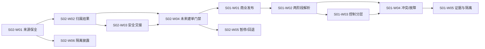

# IDP Parcel `PN02-SYN` 合成业务契约开发任务包

状态：合成开发任务包；只指导隔离 `S` 验证，不代表真实参数、生产权威或生产代码准入已经确认

## 目的

当前没有真实客户、合同、账户、线路、接入渠道或交易数据。本任务包把 [`PN02-S01`](./pn-02-synthetic-commercial-and-financial-control-development-handoff.md) 与 [`PN02-S02`](./pn-02-synthetic-ingress-and-production-ownership-development-handoff.md) 收束成一组可以直接交给开发执行的业务契约任务：

- 用合成夹具验证来源保全、重复/冲突、完整范围和生产归属结果；
- 用合成夹具验证商业两阶段解析、预付/账期分支、范围冲突和依赖未决；
- 证明各结果可以追溯、查询和安全续办，而不把技术回执或测试成功写成业务决定；
- 明确当前可编码的纯领域/测试边界，以及真实证据和技术候选到达前必须禁止的生产实现。

本文件不新增领域规则，不维护参数当前值，也不替代 [`PN-02` 真实参数取证与开发交接](./pn-02-real-parameter-evidence-and-development-handoff.md)、[`PN02-W02`](./pn-02-w02-ingress-production-ownership-evidence-request.md) 或 [`PN02-W03`](./pn-02-w03-acceptance-rules-and-financial-control-evidence-request.md)。

## 权威依据

| 内容 | 权威文档 | 本任务包的用法 |
|---|---|---|
| 来源身份、委托边界和生产归属 | [`UC-PS-001`](../application/parcel-shipment/UC-PS-001-SUBMIT-SHIPMENT-REQUEST.md)、[`parcel-shipment`](../domain/parcel-shipment/CONTEXT.md) | 固定来源先保全、归属先于建单、输入未受理和未决语义 |
| 接入、暂停、恢复、回退和安全交接 | [`PN02-W02`](./pn-02-w02-ingress-production-ownership-evidence-request.md) | 固定 `S02-W01..W06` 的三类权威身份、准入门禁和交接证据边界 |
| 商业发布、唯一解析和财务控制 | [`party-commercial`](../domain/party-commercial/CONTEXT.md)、[`settlement-accounting`](../domain/settlement-accounting/CONTEXT.md) | 固定 `S01-W01..W05` 的对象、版本和结果分层 |
| 合成夹具和隔离规则 | [`PN02-S01`](./pn-02-synthetic-commercial-and-financial-control-development-handoff.md)、[`PN02-S02`](./pn-02-synthetic-ingress-and-production-ownership-development-handoff.md) | 唯一合成输入、预期结果和禁止推导 |
| 当前代码闸门 | [`Go 首个消费者切片简报`](./parcel-go-first-consumer-slice-decision-brief.md)、[`PN-02`](./pn-02-real-parameter-evidence-and-development-handoff.md) | 约束可以编码什么，不把合成结果升级为生产实现 |
| 参数状态和验收层级 | [`PILOT-PARAMETER-REGISTER`](../product/PILOT-PARAMETER-REGISTER.md)、[`PILOT-ACCEPTANCE-MATRIX`](../product/PILOT-ACCEPTANCE-MATRIX.md) | 合成结果只记录为 `S`，不更新真实参数或 `P/R` 场景状态 |

发生冲突时，领域上下文和 `UC-PS-001` 的业务语义优先；本任务包只编排执行顺序和开发闸门。

## 合成隔离基线

所有任务必须在隔离的合成测试范围内执行：

- 只使用 `SYN-*` 标识、专用测试租户和虚构主体；不得引用真实客户、合同、账号、线路、地址、货物、金额或凭据。
- 使用非生产有效期间、虚构金额/币种和不可出网端点。任何外部连接都必须被测试替身或网络门禁明确拒绝。
- 输出只保留合成标识、内容摘要、版本、`asOf`、有效区间、当前修订和隔离证据索引；不得输出受限业务资料。
- 每次执行标记为隔离 `S`。测试通过不能升级为历史回放 `R`、真实生产 `P`、参数`已确认`或 PN-08 阶段 `Go`。
- 合成“同一货主同时支持预付和账期”只验证产品设计的可表达性，不代表现实客户存在该合同组合，也不选择首发分支。

## 任务顺序

图中的“未来建单门禁”只产生合成的可放行/阻断判断。当前开发闸门在此处停止，不落地 `ShipmentRequest`、`已提交`或事件。

## 开发任务清单

### 来源与生产归属：`S02-W01..W06`

| 任务 | 当前可编码交付 | 完成标准 | 当前禁止 |
|---|---|---|---|
| `S02-W01` 来源保全 | 使用现有 Parcel 领域值对象验证显式租户、客户账户、来源、请求键、规范化摘要及 `occurredAt`/`receivedAt` 独立性；覆盖 `requestEffectiveAt` 的值/缺失状态和不可变来源输入 | `SYN-ING-01..03`、`S02-AT-01..03` 可重复；同键同摘要是重放，同键不同摘要是冲突，原内容不覆盖 | 不建立生产接入适配器、真实入口、客户回执或外部文件/API 契约 |
| `S02-W02` 归属结果合同 | 在测试夹具中表达“本产品/其他权威/未决”及“`OPEN`/`PAUSED`”两个正交维度；验证完整拟受理范围整体判断 | `SYN-ING-01`、`SYN-ING-04..08`、`S02-AT-01`、`S02-AT-04..07` 结果携带范围引用与摘要、规则版本、`asOf`、判断时间、有效区间和当前修订；条件字段缺失不得构造结果 | 不创建生产归属端口、真实权威解析、生产默认权威或成员级拆分 |
| `S02-W03` 安全交接 | 以离线值对象模拟完整范围确认、部分确认、超时、查询不可用和失败重试；保留中立关联 | 只有范围摘要完全匹配、目标确认、查询关联和生效边界同时存在才是合成交接成功；`OTHER` 归属必须引用该确认，其他结果回到未决并保留续办引用 | 不发送真实交接、外部指令或渠道请求；不把“已转发”写成交接完成 |
| `S02-W04` 未来建单门禁 | 对归属结果执行纯门禁断言，验证只有 `IDP_PARCEL + OPEN +` 当前范围/修订/有效期匹配时才返回“未来可放行” | `SYN-ING-01`/`S02-AT-01` 只返回带来源决策和结构化原因的门禁结果；其他结果全部阻断 | 当前不创建委托、提交版本、声明包裹、接受判断任务、领域事件、Repository、事务或 Outbox |
| `S02-W05` 暂停恢复与回退 | 以测试侧合成治理记录验证暂停、原因解除、一致性核对、在途盘点、显式恢复、发布回退和对象级接管顺序 | `SYN-ING-07..10`、`S02-AT-07..09` 证明恢复准备度不自动 `OPEN`，发布回退不改变业务权威，接管准备度要求原权威停写、范围和责任盘点、目标确认/查询、授权与生效边界齐备但不自动转移权威 | 不实现生产暂停开关、自动放量、真实接管、权威切换或在途迁移 |
| `S02-W06` 来源与客户隔离 | 使用完整 `TenantID + CustomerAccountID + Source + SourceRequestKey` 复合键和测试侧授权作用域，验证跨租户/客户作用域拒绝、跨来源不回退、重放结果隔离、统一不可见语义和日志最小披露 | `S02-AT-10` 及跨作用域负向测试不泄露对象存在、内容、范围、客户或冲突状态；同客户不同来源必须精确定位且不能复用另一来源结果 | 不接入真实身份、凭据、客户查询、IAM、共享结果表或生产日志平台 |

### 商业与财务控制：`S01-W01..W05`

| 任务 | 当前可编码交付 | 完成标准 | 当前禁止 |
|---|---|---|---|
| `S01-W01` 合成商业发布 | 以测试侧独立对象表达客户、法人、产品、合同、规则包和预付/账期政策版本；验证 `DRAFT -> APPROVED -> PUBLISHED` | 对象类型/标识/版本、批准与发布时间、有效区间、夹具版本、范围、当前修订和证据等级可追溯；同版本语义变化形成冲突，新版本保留旧版本 | 不建立真实商业主数据、发布后台、真实审批或生产配置同步 |
| `S01-W02` 两阶段解析 | 对 `SYN-COM-01..04` 使用独立选择锚点和通用结算控制范围验证唯一、零、多和未决结果；唯一基线后由已选规则包声明逐项 `asOf` 策略 | 唯一结果包含选择锚点、共享商业基线、采用版本、有效区间和当前修订；同范围预付/账期重叠形成冲突；非成功结果只保留结构化原因、候选/依赖和权威视图修订；唯一后新增候选使旧结果失效 | 不创建生产商业解析端口、让调用方指定 `PREPAID/TERMS`、客户级默认 `paymentMode`、真实合同解析或控制结果 |
| `S01-W03` 控制结果分层 | 在离线测试替身中分别表达预付估价/冻结请求和账期信用暴露/限制；验证失败、查询和补偿语义 | `S01-AT-01..02`、`S01-AT-06` 不重复冻结/释放，不写费用确认、应收、收款或核销 | 不调用真实余额/额度、支付、银行、结算账户或财务系统 |
| `S01-W04` 冲突与依赖故障 | 注入范围重叠、无适用范围、读取失败和提交前失效，保留处理尝试和续办关联 | `S01-AT-03..07` 形成结构化冲突、无依据或未决，不默认通过或拒绝 | 不以技术异常、自由文本或旧版本结果代替业务语义，不自动形成接受/拒绝 |
| `S01-W05` 证据与隔离 | 生成合成执行索引、版本、结果层级和隔离证据引用；验证无真实外部副作用 | `S01-AT-08` 通过，输出仅含合成标识和审计字段，结果层级为 `S` | 不把测试日志当生产证据，不更新参数登记册、正式矩阵或 PN-08 决定 |

#### `S01-W02` 执行断言

- 第一阶段解析键必须显式包含租户、客户账户、责任法人候选、服务/控制范围、用途、独立商业选择锚点、锚点策略版本和通用依据槽位；结算控制槽位不能由调用方预选预付或账期。
- `SYN-COM-01` 与 `SYN-COM-02` 共享同一客户、法人、产品、合同和接单规则包基线，只在非重叠范围解析不同政策；`SYN-COM-03` 在同一范围命中两类政策时必须形成适用冲突。
- 权威确认零候选时返回 `NO_APPLICABLE_BASIS`；依赖缺失、读取失败、修订不可确认或候选全集不可确定时返回 `RESOLUTION_PENDING`。两类结果不能互相冒充，也不能形成客户拒绝。
- 只有 `UNIQUE_RESOLVED` 可以携带完整采用对象闭包并进入第二阶段。规则包先声明逐项 `asOf` 语义/策略版本，消费方再形成具体值，权威提供方必须回显实际值、判断标识、采用版本、有效区间和当前修订；空策略、调用方发明策略或不匹配回显均保持未决。
- `asOf` 声明必须属于第一阶段采用的已发布规则包版本，不能附着在候选或请求上临时注入；政策版本的 `scopeReference` 必须与请求控制范围一致，单个候选同时携带预付和账期政策时直接形成冲突。
- 冲突结果保留候选的稳定对象/版本、适用区间和当前修订；未决结果保留缺失依赖、权威视图修订和续办关联；非成功结果不得伪造采用版本、`asOf` 或财务控制结果。
- 唯一结果和逐项权威回显必须保留夹具版本；权威回显的对象身份、版本、适用区间、范围引用和当前修订必须与基线快照完全一致。
- 相同完整输入和相同修订重试返回原解析语义；唯一解析后新增同范围候选、对象修订变化或候选集合变化，提交前必须重解，旧结果标记 `STALE`。

对应测试契约为 [`commercial_resolution_contract_test.go`](../../internal/partycommercial/domain/commercial_resolution_contract_test.go)。它只使用内存合成夹具，所有结果等级固定为 `S`。

#### `S01-W03` 执行断言

- 控制请求只能消费 `UNIQUE_RESOLVED` 的商业依据。预付/账期模式、结算账户、币种、范围、策略版本和当前修订必须与该依据完全一致；调用方不能覆盖模式、借用其他范围账户或使用客户级默认值。
- 预付分支先形成隔离估价，再提交一次冻结。相同租户、客户、请求身份和完整输入重试返回原控制/冻结结果；同一请求身份携带不同金额、范围、账户、币种、模式或版本形成 `CONTROL_CONFLICT`，不得再次冻结。
- 账期分支只形成 `CREDIT_WITHIN_POLICY`、`CREDIT_RESTRICTED` 或 `CONTROL_PENDING`，保存暴露、额度/限制依据和实际判断版本；不得创建冻结、费用、应收、收款或核销事实。
- 冻结提交返回不确定时先查询原冻结和接受决定。接受已成立保留合法冻结；接受确定未成立才按原关联释放；释放失败或结果不确定形成 `COMPENSATION_PENDING` 并可续办，重复查询/释放不得追加副作用。
- 每个结果必须保存控制标识、稳定业务关联、提交版本、实际 `asOf`、策略版本、有效区间、当前修订、判断时间、夹具版本和隔离证据索引；所有输出保持 `S`，不得升级为真实财务事实。

对应测试契约为 [`financial_control_contract_test.go`](../../internal/settlementaccounting/domain/financial_control_contract_test.go)。它只使用离线内存替身并计数冻结、查询、释放和外部调用，验证 `S01-AT-01/02/06` 的正向、冲突、未决和补偿边界。

## 联合契约检查

联合检查只验证顺序和边界，不创建跨上下文业务事实。每项都应使用固定夹具版本和确定性时钟/标识：

| 检查 | 通过标准 |
|---|---|
| `SYN-CHAIN-01` 来源到门禁 | 先形成来源保全和归属判定，再返回未来建单门禁；来源记录不是委托，阻断结果不是客户拒绝 |
| `SYN-CHAIN-02` 本产品路径 | 本产品权威、门禁为 `OPEN` 且范围/修订/有效期仍匹配时仅返回“未来可放行”关联；当前仍没有 `ShipmentRequest`、接受任务或事件 |
| `SYN-CHAIN-03` 其他权威路径 | 完整交接确认才返回中立关联；部分确认、超时和失败均保持未决且可续办 |
| `SYN-CHAIN-04` 商业/财务路径 | 商业唯一解析完成后才形成预付或账期控制结果；控制结果不等于接受、费用、收款或核销 |
| `SYN-CHAIN-05` 失效重判 | 归属、商业版本或财务依赖在后续步骤失效时，旧结果不可直接使用；重判不可用则保持未决 |
| `SYN-CHAIN-06` 作用域隔离 | 来源复合键不能跨租户、客户或来源复用；未授权与不存在查询返回同一不可见结果；输出和审计只保留最小字段 |
| `SYN-CHAIN-07` 无外部副作用 | 所有合成路径只使用离线测试替身；不存在真实业务写入、外部消息、资金变化或客户通知 |

## 当前可编码边界

| 层级 | 当前允许 | 解锁条件 | 当前不允许 |
|---|---|---|---|
| 领域纯函数和值对象 | 来源身份、摘要、时间语义、重复/冲突、成员完整性、合成结果分类和结构化错误 | 无真实参数要求；仍须通过现有领域测试 | 把测试结果当生产权威或默认配置 |
| 测试夹具与离线合同 | `SYN-*` 夹具、确定性时钟/标识、内存或记录式替身、授权作用域结果、`S01/S02-AT-*` 和 `SYN-CHAIN-*` | 测试输出保持 `S` 且不可出网 | 真实入口、真实商业/财务端点或跨客户生产数据 |
| 应用生产归属端口与建单编排 | 仅可写接口形状和负向契约草案，不实现生产调用 | `PN02-W01/W02` 真实证据完成、范围/版本/`asOf`/权威/交接确认，并通过端口评审 | 生产归属端口、`ShipmentRequest`/`已提交`聚合、接受判断任务、领域事件、Repository、事务和 Outbox |
| 商业/财务生产协作 | 仅可验证合成解析和控制结果代数 | `PN02-W03` 真实规则/财务证据，依赖可用且技术候选通过 | 真实账户、余额/额度、冻结、应收/应付、收款、核销或财务系统写入 |
| 接受与生产准入 | 仅可记录未配置/未决/未来可放行等测试结果 | W01-W05 同版本联合验证、Bento 技术门槛和 PN-08 阶段决定 | 已接受、已拒绝、真实生产流量、客户通知或 Go/No-Go 自动升级 |

## 完成定义

任务包完成必须同时满足：

1. `S01-W01..W05` 与 `S02-W01..W06` 的合成验收场景在隔离环境中可重复执行，失败、冲突、重试和未决路径均有结构化结果。
2. `SYN-CHAIN-01..07` 通过；测试能够证明来源先于归属、归属先于未来建单门禁，商业控制不越权形成接受或财务事实。
3. 代码只触及现有建单前领域内核和测试合同边界；不新增生产归属端口、持久化聚合、领域事件、Repository、事务、Outbox 或真实外部适配器。
4. 测试、日志和证据索引只包含合成标识和最小审计字段（作用域引用、对象引用、结果类别、版本、判断时间、证据索引）；网络出口、真实凭据和真实金额均被隔离门禁阻断。
5. 参数登记册继续保持真实实例 `待提供`，正式验收矩阵不因合成通过改变，生产结论继续为 `No-Go / 待参数化`。

完成本任务包只说明稳定业务契约已经可用来指导后续开发。只有真实 W01/W02 证据和不可变 Bento 消费者技术候选共同通过后，才能重新评审生产归属端口；再取得 W03/W04/W05 和 PN-08 阶段决定，才可讨论真实接受和生产写入。

## 链接

- [`PN02-S01` 合成商业与财务控制开发交接](./pn-02-synthetic-commercial-and-financial-control-development-handoff.md)
- [`PN02-S02` 合成来源保全与生产归属开发交接](./pn-02-synthetic-ingress-and-production-ownership-development-handoff.md)
- [`PN-02` 真实参数取证与开发交接](./pn-02-real-parameter-evidence-and-development-handoff.md)
- [`PN02-W02` 生产接入与生产归属证据工作单](./pn-02-w02-ingress-production-ownership-evidence-request.md)
- [`PN02-W03` 接单规则、决定授权与接受前财务控制证据工作单](./pn-02-w03-acceptance-rules-and-financial-control-evidence-request.md)
- [`UC-PS-001` 客户提交国际小包请求](../application/parcel-shipment/UC-PS-001-SUBMIT-SHIPMENT-REQUEST.md)
- [`S01-W03` 测试侧财务控制契约](../../internal/settlementaccounting/domain/financial_control_contract_test.go)
- [`PILOT-PARAMETER-REGISTER`](../product/PILOT-PARAMETER-REGISTER.md)
- [`PILOT-ACCEPTANCE-MATRIX`](../product/PILOT-ACCEPTANCE-MATRIX.md)
