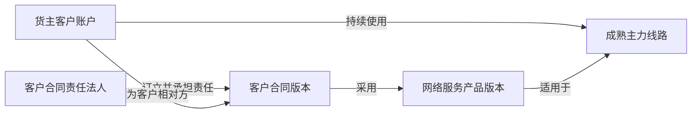

# IDP Parcel `PN02-W01` 锚点商业与服务范围证据工作单

状态：业务取证执行模板；只定义提交、核验和开发交接要求，不维护参数当前值

本文执行 [`PN-02` 真实参数取证与开发交接](./pn-02-real-parameter-evidence-and-development-handoff.md) 的 `PN02-W01`，覆盖 `PAR-COM-01`、`PAR-COM-03`、`PAR-COM-05`、`PAR-COM-06` 和 `PAR-NET-01`。它把货主、责任法人、服务产品、客户合同和成熟线路作为五个独立对象交叉核验，并按 [`UC-PC-001`](../application/party-commercial/UC-PC-001-MAINTAIN-AND-PUBLISH-COMMERCIAL-AUTHORITY.md) 核验商业对象的稳定身份、批准和不可覆盖发布边界，供商业接入和开发使用。

真实名称、合同正文、地址、联系人、账号、价卡和受限证据必须留在受控证据库；仓库只登记稳定脱敏标识、证据索引、版本和核验结论。本工作单不规定 API、文件格式、数据库字段、消息 Schema、部署或对象存储实现，也不创建第二套参数状态。

## 使用边界

关务专项已经提交的同一受控证据包，可以在本工作单中引用其证据索引，不得复制真实内容或重新形成一套结论。`CC-S0-W01` 的出口/进口区域要求属于关务专项范围；本工作单只确认 PN-02 所需的商业对象、产品合同适用关系和成熟线路，不把关务专项完成误判为小包主链已经生产准入。

候选标识 `CUST-PILOT-01`、`LEGAL-ENTITY-PILOT-01` 和 `LANE-PILOT-01` 已在登记册中作为待核验候选使用。候选选择、脱敏映射和证据状态仍以 [首发试点参数与证据登记册](../product/PILOT-PARAMETER-REGISTER.md) 为唯一权威；本段不表示任何候选已经确认。

## 必须同时成立的关系

五个对象必须在拟试点期间具有共同有效交集，且每条关系都有独立依据。客户账户、服务产品和合同等商业对象还必须分别形成稳定身份及有权批准的不可覆盖发布版本；导入、同步、页面可见或文件上传不构成发布。证明客户存在，不能推导责任法人、产品、合同或线路；证明一条线路可运行，也不能推导该客户已经有权使用该线路。

## 证据提交封面

每个提交包在受控环境外只向项目登记册提供下列可审计信息：

| 项目 | 必须说明 |
|---|---|
| 覆盖参数 | 明确列出支持的参数 ID，并逐项写明支持的业务断言 |
| 候选引用 | 使用登记册稳定脱敏标识；真实映射只给受控证据索引 |
| 适用组合 | 客户账户、责任法人、产品、合同、线路、服务范围和有效期间 |
| 对象版本 | 对象稳定标识、版本、生效/失效时间或当前有效性依据 |
| 发布依据 | 商业对象类型、不可覆盖版本、批准方/授权、批准时间、生效边界、替代/退役关系和当前修订标识 |
| 证明边界 | 能证明什么、不能证明什么，不能从技术可访问性升级业务语义 |
| 责任分离 | 证据提供方、领域核验方、最终决定方、登记册更新责任方 |
| 冲突与缺口 | 相反证据、版本差异、未核验字段和受影响生产分支 |
| 撤销与替换 | 失效时停止新增、保留在途引用、替换候选和重新核验责任 |

上传成功、代码完成或测试通过都不能自动把参数更新为`已确认`。

## 分参数要求

### `PAR-COM-01` 锚点货主客户

必须证明：

- 客户账户在租户内的稳定隔离身份及受控真实映射。
- 当前有效客户关系、合同关系和试点授权；客户联系人、登录账号和集团名称不能代替客户账户。
- 该客户持续使用拟选 `PAR-NET-01` 线路，并能取得接单、履约、异常和结算闭环样本。
- 商业、运营、网络、接入、技术和结算责任方分别完成硬门槛核验，最终指定依据由有权决定方记录。

不能据此推导责任法人、合同版本或产品版本已经核验。

### `PAR-COM-03` 客户合同责任法人

必须证明：

- 与客户签约、承担客户服务责任并拥有客户运营应收责任的唯一法人身份。
- 法人主数据、合同主体、责任范围和生效区间，以及与客户账户和合同版本的关系。
- 签约法人、日常作业组织、仓储主体或实际履约法人不一致时，各自角色和责任边界。

集团租户、当前登录组织或账号持有人不能自动代替合同责任法人。

### `PAR-COM-05` 网络服务产品版本

必须证明：

- 已发布产品的稳定标识、版本、生效区间和当前适用性。
- 产品是运营企业对客户提供的端到端网络服务，并适用于锚点客户、合同和成熟线路。
- 服务责任边界、主要服务条件以及产品退役、暂停或换版时的采用依据。

外部承运商产品、面单渠道产品、尾程产品或一份价卡不能代替网络服务产品版本。

### `PAR-COM-06` 客户合同版本

必须证明：

- 当前合同稳定标识、版本、生效区间、有效性和受控合同证据索引。
- 客户账户、责任法人、产品版本和成熟线路之间的适用关系。
- 试点授权、服务责任、端到端验证和数据使用限制；补充协议、续签、变更或到期安排必须说明采用版本。

报价、口头承诺、历史合同或计划中的续签不能替代当前合同版本。

### `PAR-NET-01` 成熟主力线路

必须证明：

- 线路稳定脱敏标识、受控映射和观察期间。
- 近期持续业务记录、正常时效分布、主要节点、交接边界和阶段责任。
- 接单、集货/分拣、出口、干线、进口、尾程、异常和结算证据可以在同一脱敏范围内关联。
- 临时改路、异常切换和候选线路与稳定主线路的区分依据。

单份价卡、单段运输产品、一次成功运输或未来路由计划不能单独证明线路成熟。

## 交叉核验

业务核验方必须用同一组候选和有效期间完成以下检查：

1. 客户合同相对方与客户账户代表的客户关系一致，未用联系人或集团名称替代账户。
2. 合同签约法人、客户服务责任和客户运营应收责任符合已确认的法人边界。
3. 合同版本明确采用产品版本，产品换版、退役或暂停没有静默改写合同。
4. 客户账户、产品和合同各自的建立/发布结果、批准依据及替代关系可追溯，未把批次导入成功或技术同步当作商业发布。
5. 客户和产品均适用于成熟线路；线路不是由价卡、渠道名称或一次历史记录推导。
6. 五个对象的有效期间存在共同交集并覆盖拟试点期间。
7. 关务、履约、异常和结算样本可以关联到同一脱敏范围，但事实所有权仍由各上下文分别拥有。
8. 任一对象变更、失效或撤销时，依赖关系重新核验；新候选不复用旧标识或覆盖旧证据。

任一关系冲突时，不得因五份文件都存在而整体确认；必须登记冲突、责任方和受影响范围。

## 结论与登记册动作

本工作单不改变参数状态。登记册责任方依据核验结论执行：

| 结论 | 动作 |
|---|---|
| 证据完整、一致，责任、有效期间和最终决定明确 | 对应参数更新为`已确认`并引用证据版本 |
| 有候选但最低证据或交叉关系未完成 | 保持`待核验`，登记精确缺口和局部阻断 |
| 没有可核验候选 | 保持`待提供`，不得用默认值补齐 |
| 多个合格候选等待指定 | 使用`待决策`，不得并列作为当前配置 |
| 证据冲突、过期或无法证明当前适用 | 不确认，登记冲突和安全续办入口 |
| 已选对象失去硬门槛 | 停止新增准入，由有权决定方显式撤销；替代对象重新完成全部核验 |

撤销或替换不自动取消、迁移或改写已经纳入的在途委托。

## 给开发的交接

证据未确认时可以继续：

- 使用不透明的客户、法人、产品、合同、线路、版本和有效期间引用。
- 用合成或脱敏夹具验证关系完整性、跨客户隔离、冲突和候选替换。
- 保持缺失、冲突和过期为显式未配置或待核验结果。

证据未确认时不得：

- 把上述候选标识、显示名称、国家、城市、渠道或价卡写成生产默认值。
- 把五个对象压缩成一个客户配置，或从一个对象推导其余对象已确认。
- 宣称真实客户、合同、产品或线路已经具备生产接单资格。

当前首个 Go 子切片仍只保留建单前作用域身份、来源重放/冲突、最小候选和提交批次候选内核；本工作单完成后还需单独评审生产归属结果合同，不能借工作单直接创建`已提交`委托、领域事件或持久化端口。

## 完成清单

- [ ] 五项参数各有受控证据索引、版本、有效期间、证明边界和责任分离记录。
- [ ] `CUST-PILOT-01`、`LEGAL-ENTITY-PILOT-01`、`LANE-PILOT-01` 的真实映射仍只在受控环境中维护。
- [ ] 产品—合同—客户—线路关系通过同一范围和期间的交叉核验。
- [ ] 客户账户、产品和合同等商业对象的独立发布、批准、冲突、替代/退役和当前修订证据可追溯，未用技术同步成功代替发布。
- [ ] 冲突、缺口、撤销和替换规则已记录并由有权决定方确认。
- [ ] 登记册责任方已按唯一权威状态更新，而非由本工作单或开发测试自动更新。
- [ ] 只解除 PN-02 商业范围阻断；其他接入、治理、财务、可达性和技术门槛仍按各自工作包推进。

提交本清单不等于生产准入；只有登记册状态、验收矩阵和阶段 `Go/No-Go` 决定共同成立，才可进入对应生产分支。
