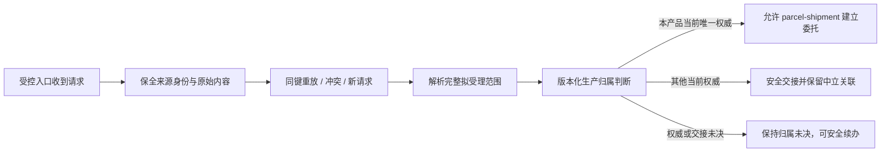

# IDP Parcel `PN02-W02` 生产接入与生产归属证据工作单

状态：业务取证执行模板；只定义来源身份、生产归属、交接和治理证据要求，不维护参数当前值

本文执行 [`PN-02` 真实参数取证与开发交接](./pn-02-real-parameter-evidence-and-development-handoff.md) 的 `PN02-W02`，覆盖 `PAR-INT-01`、`PAR-GOV-03`、`PAR-GOV-04`、`PAR-GOV-05`、`PAR-GOV-06` 和 `PAR-GOV-07`。目标是让开发能够区分“请求从哪里来”“哪一个系统当前负责”和“是否可以在本产品建立委托”，而不是把入口连通误当成生产接单。

真实渠道名称、账号、凭据、客户资料、旧系统映射、治理名单和受限运行记录必须留在受控证据库；仓库只登记稳定脱敏标识、证据索引、版本、有效期间和核验结论。本工作单不规定 API、文件格式、数据库字段、消息 Schema、部署或 MinIO/S3 实现。

## 前置与权威

`PN02-W01` 的客户、法人、产品、合同和线路范围是最终确认生产归属的前提。W02 可以并行收集来源和治理候选，但在 W01 适用范围未确认前，任何渠道都只能进入设计、回放或隔离模拟，不能形成生产委托。

业务语义以以下文档为准：

- [小包托运上下文](../domain/parcel-shipment/CONTEXT.md)：委托身份、生命周期和接受前边界。
- [`UC-PS-001`](../application/parcel-shipment/UC-PS-001-SUBMIT-SHIPMENT-REQUEST.md)：先判生产归属，再建单；三类归属结果不是接受/拒绝。
- [首发试点范围](../product/PILOT-SCOPE.md)：整体纳入/排除、唯一生产写入方、暂停、恢复和回退原则。
- [首发试点验收场景矩阵](../product/PILOT-ACCEPTANCE-MATRIX.md)：生产证据层级和阻断门槛。
- [参与方与商业上下文](../domain/party-commercial/CONTEXT.md)：客户账户、授权和交易角色边界。

参数登记册是唯一实例状态台账；本工作单不另行确认客户或系统为当前生产权威。

## 业务链条

在 `Authority` 之前不得创建`已提交`委托、接受判断任务或“委托已提交”事件。`Submit` 也只表示建立了`已提交`委托，不表示接受、拒绝、预计承诺、容量或财务控制已经成立。

## 证据提交封面

每个来源或治理证据包必须提供：

| 项目 | 必须说明 |
|---|---|
| 覆盖参数 | 参数 ID、待核验断言和适用的生产分支 |
| 范围引用 | 租户、客户账户、产品、合同、线路、时间窗口、容量范围和全部委托成员范围 |
| 来源/规则版本 | 稳定脱敏标识、版本、生效/失效时间或当前有效性依据 |
| 责任分离 | 事实提供方、规则维护方、核验方、最终决定方、技术交接责任方 |
| 证明边界 | 能形成的业务事实、不能形成的结果，以及技术可访问性不代表的授权 |
| 冲突与缺口 | 相反来源、版本差异、未决权威、无法安全交接的范围和责任方 |
| 变化处理 | 重放、冲突、纠错、暂停、恢复、回退、接管和在途责任 |
| 决定记录 | 采用的证据版本、判断时间、有效范围、生效时间和查询关联 |

接口连通、账号可登录、消息成功发送或一次正常样本都不能单独证明生产归属。

## `PAR-INT-01` 客户生产委托接入渠道

必须取得锚点范围唯一主用生产入口的受控证据：

1. 入口的稳定脱敏身份、使用客户账户和产品/合同范围、来源认证与授权责任。
2. 来源请求键由哪些业务组件组成、在哪个租户/客户/来源作用域内唯一，以及重试时如何保持；不能把客户参考号默认当作全局键。
3. 原始内容的不可变保全、规范化业务内容摘要（`PayloadDigest`）或等价内容身份的产生责任，以及同键同摘要和同键不同摘要的业务处理。摘要必须覆盖 `requestEffectiveAt` 的值及缺失/显式存在状态，不覆盖信封元数据。
4. 来源发生时间（`occurredAt`）、客户请求生效时间（`requestEffectiveAt`）和系统接收时间（`receivedAt`）的独立语义；前后两者是来源/接收元数据，不因其变化单独形成冲突，不得用接收时间覆盖来源事实，也不得用任一信封时间默认补齐 `requestEffectiveAt`。
5. 一次入口请求包含多个委托时的批次边界、每份委托最小身份和完整包裹成员边界。
6. 纠错、重提、成员重组和取消的身份关联、版本关系、客户回执和查询边界。
7. 同步、异步或批次结果的查询关联；提交超时、网络重试和结果未知时如何查询原处理，不得盲目再次建立业务事实。
8. 入口停用、替换或迁移时的生效边界、历史查询和在途对象责任。

至少提交以下脱敏样本：首次请求、同键同内容重试、同键不同内容冲突、受控纠错、批次中一份请求的结果查询，以及入口不可用时的安全续办。样本只证明来源契约，不证明本产品已经获得生产归属。

## `PAR-GOV-03` 完整委托准入与生产归属规则

必须取得当前版本化规则及其适用关系：

- 客户账户、责任法人、服务产品、合同、成熟线路、时间窗口和容量上限的完整范围。
- 规则版本、生效区间、判断 `asOf`、当前修订和失效重判条件。
- 当前提交版本声明的全部包裹成员必须整体纳入或整体排除；若后续接受，该成员集合成为接受基线。不得在准入判断时按成员随机拆分到新旧系统。
- 本产品、其他当前权威和生产归属未决三类结果的明确判定条件，以及结果对后续动作的限制。
- 后续装袋、拆袋、实物合并/拆分、外部单号变化和异常改路不改变已形成的生产归属；范围变化必须通过版本化治理规则处理。

规则必须能回答“当前谁是唯一生产写入方”，并独立回答准入控制是没有生效暂停（`OPEN`）还是暂停（`PAUSED`）。`OPEN` 不等于最终允许本产品建单；最终门禁还必须确认本产品是当前唯一权威、完整范围和当前修订匹配且判断仍在有效区间内。试点排除回答权威身份，容量已满或暂停回答准入控制；暂停不是第四种权威身份，不是 `parcel-shipment` 的客户业务拒绝，也不改变已经形成的权威身份和在途责任。

## `PAR-GOV-04` 阶段证据与 `Go/No-Go`

必须取得：

- 每个阶段和生产范围需要的证据清单、证据层级、观察期间和未解决偏差记录。
- 最终决定方的授权依据、决定记录格式、采用的证据版本、当前执行阶段、评审目标和生效时间。
- 日期到达、指标达标、系统建议或单次成功不能自动升级阶段；扩大范围必须重新明确范围和决定。
- `R/S` 验证结果只解除相应的验证阻断，不自动变成 `P` 生产准入。

## `PAR-GOV-05` 紧急暂停新准入

必须证明暂停规则只覆盖继续接收会造成不可逆、违法、跨客户或事实完整性风险的情形，并记录：触发来源/规则版本、证据、对象范围、自动执行身份或决定方、发生时间和生效边界。

暂停只阻止新的生产委托进入本产品，不取消、迁移或改写已纳入的在途委托，也不自动改变阶段或接受决定。超过授权范围的人工操作不能作为暂停依据。

## `PAR-GOV-06` 恢复准入

必须证明恢复需要原因解除、必要的一致性核对、在途盘点和有权决定方明确授权，并记录采用的证据版本、范围和生效时间。风险指标恢复、规则暂不命中或服务重新可用都不能自动恢复新准入。

## `PAR-GOV-07` 回退与安全接管

必须取得可执行的回退/接管边界：

- 触发条件、决定权限、适用对象/能力/事实类型和生效时间。
- 先停止原范围的新准入和新写入，再核对已接受事实、外部指令、未完成动作和当前责任。
- 在途委托原则上继续由原权威处理；只有原权威确实无法继续时，才对明确对象执行受控接管。
- 新旧权威、交接确认、查询关联、失败重试和责任转移结果可审计；同一范围不能双写或盲目重提外部交易。
- 交接前历史保持不变；撤销或替换不自动改写已形成的生产归属。

## 三类归属结果的验收语义

| 结果 | 必须能证明 | 后续动作 | 明确禁止 |
|---|---|---|---|
| 本产品当前唯一权威 | 范围完整、规则版本有效、当前唯一写入方和生效边界 | 仅在准入控制为 `OPEN` 且范围、修订和有效期仍匹配时，允许 `parcel-shipment` 建立最小委托和`已提交`记录 | 只凭权威身份或 `OPEN` 单独放行，或直接宣称已接受、已拒绝、已承诺或已分配容量 |
| 其他当前权威 | 其他系统身份、同一范围有效性、接收确认和中立查询关联 | 安全交接；本产品只保留来源和归属关联 | 在本产品建立委托，或同时投递多个生产系统 |
| 生产归属未决 | 权威不唯一、规则失效/缺失或无法证明安全交接的具体缺口 | 保留来源、范围、处理尝试和续办入口 | 默认归入本产品、伪装成拒绝或以技术成功代替业务决定 |

安全交接必须至少证明目标权威确实承接该完整范围、请求身份不会被重复解释、交接结果可查询、交接失败仍能回到未决状态；“已转发”不是交接完成。

## 联合验证样本

| 样本 | 必须证明 |
|---|---|
| 首次有效请求 | 来源保全、完整范围、当前规则和三类结果之一 |
| 同键同内容重试 | 返回原处理关联，不产生第二份来源、归属或委托 |
| 同键不同内容 | 形成接入冲突，原内容和原结果不被覆盖 |
| 输入未受理 | 最小范围或成员身份不足时不创建占位委托 |
| 其他权威且可交接 | 只形成中立关联并得到目标确认，不在本产品建单 |
| 权威未决/交接失败 | 保持未决，可查询和安全续办，不伪装成拒绝 |
| 暂停与恢复 | 暂停阻断新准入；恢复需显式决定，在途责任不被改写 |
| 回退与接管 | 停止新写入、盘点在途、明确交接范围且不双写 |

每个样本必须绑定参数版本、有效区间、判断 `asOf`、当前修订和证据索引；样本通过不等于参数状态自动更新。

## 结论与登记册动作

本工作单不改变参数状态。只有来源契约、规则版本、范围、责任、变化处理和安全交接证据完整，并取得有权决定后，登记册责任方才可更新对应参数为`已确认`或有权威依据的`本期不适用`。缺口、冲突或过期保持`待提供`、`待核验`、`待决策`或`已失效`，不得用默认系统、旧系统或技术可用性补齐。

一个治理参数未就绪，只阻断依赖它的生产分支；不阻止当前建单前领域内核和合成/脱敏回放继续验证。

无真实数据阶段的命名夹具、建单门禁和隔离验收统一见 [`PN02-S02` 合成来源保全与生产归属开发交接](./pn-02-synthetic-ingress-and-production-ownership-development-handoff.md)。该合成包不得反向解除本工作单的证据阻断。

## 给开发的交接

证据未确认时可以继续：

- 现有建单前强类型作用域、来源保全输入、重放/冲突分类、最小候选和提交批次候选验证。
- 使用命名夹具表达三类结果的业务场景，但不把夹具当作生产配置。
- 记录未配置、归属未决、冲突和安全续办的文档验收案例。

证据未确认时不得：

- 创建生产归属端口、接受判断任务、`ShipmentRequest`/`已提交`聚合、领域事件、Repository、事务或 Outbox。
- 把一个布尔值或简单三值枚举当成“当前唯一生产权威”证明；结果至少要能回溯完整范围、版本、`asOf`、有效区间、当前修订、权威身份和交接语义。
- 使用本地 Bento 替身、`replace`、伪事务、浮动分支或复制框架源码。

本工作单完成业务语义取证后，才能进行下一次应用端口评审；真实不可变 Bento RC 仍是持久化消费者切片的独立技术门槛。

## 完成清单

- [ ] `PAR-INT-01` 有唯一主用生产入口、请求身份、重放/冲突、纠错和结果查询证据。
- [ ] `PAR-GOV-03` 有完整范围、规则版本、时点、容量和整体纳入/排除语义。
- [ ] `PAR-GOV-04` 至 `PAR-GOV-07` 有授权、暂停、恢复、回退、接管和在途责任证据。
- [ ] 三类归属结果及安全交接失败路径由脱敏样本验证。
- [ ] 证据版本、有效期间、当前修订、决定方和登记册动作可追溯。
- [ ] 没有把权威身份、准入门禁、客户拒绝、接受决定或技术回执混为同一结果；`occurredAt`/`receivedAt` 变化不会被当作接入冲突。

提交本清单不等于生产准入；还必须满足 `PN02-W05` 联合验证和适用阶段 `Go/No-Go` 决定。
