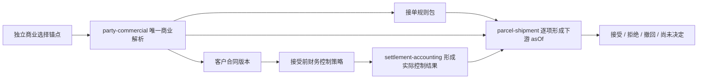

# IDP Parcel `PN02-W03` 接单规则、决定授权与接受前财务控制证据工作单

状态：业务取证执行模板；只定义规则、授权、判断时点和财务控制的提交与核验要求，不维护参数当前值

本文执行 [`PN-02` 真实参数取证与开发交接](./pn-02-real-parameter-evidence-and-development-handoff.md) 的 `PN02-W03`，主责覆盖 `PAR-COM-08`、`PAR-COM-14`、`PAR-COM-15`、`PAR-SET-01` 和 `PAR-SET-02`，并消费 `PAR-COM-09` 的合同结算币种证据完成一致性核验。目标是让业务方提交真实接单依据，使开发能够区分规则选择、权威判断、财务控制结果和最终委托决定。

真实合同正文、价卡、金额、额度、账户资料、角色名单、客户资料和受限运行记录必须留在受控证据库；仓库只登记稳定脱敏标识、证据索引、版本、有效期间和核验结论。本工作单不规定 API、数据库字段、消息 Schema、规则引擎、审批系统、财务接口或对象存储实现。

## 已确认机制与待取证实例

以下机制已经由领域文档、[`UC-PC-002`](../application/party-commercial/UC-PC-002-RESOLVE-COMMERCIAL-BASIS.md)、[`UC-PS-001`](../application/parcel-shipment/UC-PS-001-SUBMIT-SHIPMENT-REQUEST.md) 和 [`UC-PS-005`](../application/parcel-shipment/UC-PS-005-WITHDRAW-SUBMITTED-SHIPMENT-REQUEST.md) 确认，本工作单不得重新讨论或通过参数改变：

- 全部适用硬规则和权威结果通过时自动接受；人工复核必须由规则显式要求。
- 主动拒绝只由适用责任法人授权角色依据结构化原因和证据形成，不能覆盖硬规则或缺失结果。
- 接受前财务控制可以是预付冻结、信用校验、明确无控制或合同明确且不冲突的组合；未配置不能默认放行。
- `parcel-shipment` 拥有接受、拒绝或决定前撤回；`party-commercial` 拥有规则、商业策略和撤回授权版本；`settlement-accounting` 拥有实际金额、冻结、信用暴露、限制和冻结释放结果。
- 一份当前提交版本只形成一个委托级决定，不支持成员级部分接受；未决不是拒绝。

本次只取证锚点产品和合同实际采用哪一套规则、角色、时点、结算模式、账户、价格依据和财务控制。参数当前状态仍以[首发试点参数与证据登记册](../product/PILOT-PARAMETER-REGISTER.md)为唯一权威。开始提交前必须重新读取登记册；当前工作单不得把`待提供`或`待决策`改写成已确认。

## 所有权与协作边界

| 责任方 | 拥有 | 不得代替 |
|---|---|---|
| `party-commercial` | 独立商业选择锚点策略、商业依据唯一解析、接单规则包、下游判断时点策略、人工复核条件、主动拒绝/决定前撤回授权、接受前财务控制策略、价格规则和结算政策版本 | 具体委托接受/拒绝/撤回，实际余额、冻结或信用结果 |
| `parcel-shipment` | 提供按独立策略形成的商业选择锚点；规则包选出后为当前提交版本逐项形成下游判断 `asOf`，保存采用依据并形成唯一接受、拒绝或撤回决定 | 让待选规则包决定自身选择时间，或修改规则、价格、账户、金额、冻结或信用结果 |
| `settlement-accounting` | 估价、冻结、信用暴露、业务限制及释放/补偿的实际结果 | 自行增加接单门槛或决定委托接受/拒绝/撤回 |
| 财务、银行或支付系统 | 真实收付款、清算和法定财务事实 | 直接形成小包委托接受决定 |

## 证据提交封面

每个证据包必须提供：

| 项目 | 必须说明 |
|---|---|
| 覆盖参数 | 参数 ID、待核验断言和适用生产分支 |
| 适用组合 | 客户账户、责任法人、产品、合同、服务/关务范围、线路及有效期间 |
| 规则或对象版本 | 稳定脱敏标识、版本、生效/失效时间、当前修订及受控证据索引 |
| 决定责任 | 规则所有者、证据提供方、业务核验方、授权决定方和登记册更新责任方 |
| 证明边界 | 能证明的规则、权限或金额事实，以及明确不能证明的业务结果 |
| 冲突与缺口 | 相反证据、未配置项、过期版本、无法复现分支和受影响范围 |
| 替换与失效 | 新版本适用范围、旧版本历史引用、失效重判和在途责任 |
| 验证样本 | 输入范围、采用版本、实际 `asOf`、结果、决定或续办引用及预期结论 |

页面显示、配置存在、账号可访问、单次计算成功或人工口头确认都不能替代证据核验。

## `PAR-COM-14` 接单规则包、授权与判断时点

### 规则包范围

必须提交锚点产品和合同当前采用的规则包，并证明：

- 规则包按客户账户、责任法人、产品、合同、服务或关务范围和有效期间选择，且引用关系可追溯。
- 接入最小身份、委托通用不变量、产品/合同资料、监管原始资料和跨字段条件分别表达；正式关务判断仍由 `customs-compliance` 拥有。
- 每项规则明确适用对象、硬规则或资料规则属性、通过/确定不通过/待补充/未决等业务反应、是否可纠正和稳定原因语义。
- 渠道字段、枚举和临时错误只映射到稳定业务语义；原外部错误保留为来源证据，不成为核心规则或自由文本拒绝原因。
- 规则版本变化只影响声明范围内的新判断，不覆盖已经形成的提交版本、判断或决定。

### 自动接受、人工复核和主动拒绝

必须分别提交：

- 哪些硬规则和权威判断全部通过后自动接受；不得增加隐藏的全量人工审批。
- 哪些明确条件确实需要人工业务复核、复核能判断什么、不能覆盖什么，以及授权角色和有效期间。
- 主动拒绝的责任法人、授权角色、适用范围、结构化原因目录、最低证据和决定时点。
- 决定前撤回的客户/运营代表授权、适用范围、稳定原因、有效期间、客户回执和已有冻结的释放/补偿责任。
- 客户可补充缺口的期限及届满后果；没有明确届满后果时只能继续未决或进入授权处置，不能自动拒绝。
- 自动接受、人工接受、主动拒绝与决定前撤回并发时的唯一决定边界：先合法提交的决定成为当前结果，其他请求只能读取既有结果或得到明确冲突。

普通备注、客服意见、通知超时或依赖故障不能形成主动拒绝。人工复核不能把硬规则失败、财务控制失败或缺失权威结果改成通过。

### 五类时间与逐项 `asOf`

在这五类时间参与具体判断之前，必须先提交一个独立的商业选择锚点策略。该策略不能依赖尚未选出的接单规则包，也不能由客户回填时间或消息到达顺序直接决定；它只负责让 `party-commercial` 唯一解析产品、合同和规则包。实际采用哪一种锚点语义仍属于 `PAR-COM-14` 真实参数，未确认时保持未配置。这里的“业务适用时间”仅指客户请求生效时间（`requestEffectiveAt`），不把来源发生或系统接收时间泛称为业务时间。

| 时间 | 本次要证明 | 不能用于 |
|---|---|---|
| 来源发生时间（`occurredAt`） | 来源声明何时发生，用于溯源和因果关系；属于信封元数据 | 单独决定当前合同或授权有效，或因变化形成接入冲突 |
| 系统接收时间（`receivedAt`） | 本产品何时收到来源，用于接入审计、迟到和重试观察；属于信封元数据 | 覆盖来源发生时间或业务适用时间，或因变化形成接入冲突 |
| 客户请求生效时间（`requestEffectiveAt`） | 客户请求在哪个业务时点适用，可参与服务日历等判断；值及缺失/显式存在状态属于规范化内容摘要 | 由 `occurredAt`/`receivedAt` 默认补齐，或通过回填恢复已失效合同、产品、授权或信用资格 |
| 判断依据时点 | 当前规则为每类判断选择的 `asOf` 语义和值 | 被一个全局时间替代 |
| 接受/拒绝/撤回决定时间 | 唯一决定提交的业务时点和当前资格复核边界 | 追溯改写已经合法提交的历史决定 |

第一阶段商业解析必须返回解析标识、商业选择锚点、采用版本、有效区间和当前修订标识。规则包唯一选出后，每类跨上下文判断再返回判断标识、判断时间、实际 `asOf` 语义和值、采用版本、有效区间和当前修订标识。证据必须明确新鲜度、失效条件和提交前复核规则；依据过期、被替代或被当前限制推翻时重新判断，无法及时重判则保持未决。

## `PAR-COM-08` 首发客户结算模式范围

必须用合同结算政策和现行操作证据确定预付与账期各自的适用范围，并明确：

- 每一模式对应的责任法人、客户相对方、适用合同版本、结算账户、币种、服务/费用与控制范围及有效期间。
- 产品设计已确认两种模式按完整业务分支独立闭环；当前没有真实锚点客户或合同，本工作单先用合成样本验证边界，真实合同、账户、服务/费用范围和有效期间证据以及首发分支仍待提供。
- 首发生产分支、另一独立分支的隔离边界，以及结算模式变化、新旧合同切换或范围调整时的采用边界。

结算模式不等于接受前财务控制策略：账期不能推导无需信用校验，预付不能推导冻结金额就是最终费用，合同明确组合冻结和信用校验也不自动表示同一金额同时采用两种结算模式。预付或账期不是客户级枚举；同一金额或控制范围只能命中一种方式，重叠时形成适用冲突。首发设计按两个可独立闭环的分支建模；合成或未来真实输入出现重叠时必须阻断，不得强行二选一或写成无边界“混合模式”。

## `PAR-SET-01` 客户结算账户分支

必须提交当前试点账户的稳定脱敏引用和受控证据，证明：

- 账户固定责任法人、结算相对方、收付方向、结算币种和结算政策。
- 账户与锚点客户合同及 `PAR-COM-08` 的结算模式适用范围一致，且多个合同或模式范围是否允许归集有明确政策。
- 当前可用于接受前控制的运营余额、冻结或信用范围由该账户承担；真实银行账户或法定总账不是本对象。
- 账户暂停、替换、币种或责任变化时停止新增使用并保留历史引用。

货主客户账户、合同、银行账户、总账科目或页面余额不能代替客户结算账户。

## `PAR-SET-02` 销售价格规则

W03 只消费接受前估价所需的价格依据，不提前确认完整计费、对账和发票闭环。证据至少证明：

- 价格规则稳定标识、版本、适用范围、有效期间和计价基准时点。
- 责任法人、客户、产品、合同、币种、含税/未税/税务不适用口径和必要输入来源明确。
- 规则组合、互斥、顺序、精度和取整能够通过受控脱敏计算展开复现；相同输入、版本和基准时点得到相同结果。
- 接受前估价的金额范围能够与 `PAR-SET-01` 账户和 `PAR-COM-15` 控制项对应，但不冒充最终确认费用。

若 `PAR-SET-02` 的其他生产适用组成尚未核验，只能登记 W03 所需分支证据，参数整体状态继续保守汇总。

## `PAR-COM-15` 接受前财务控制策略

策略必须绑定锚点合同版本和明确范围，并逐项证明：

| 控制分支 | 必须提交 | 不能推导 |
|---|---|---|
| 预付冻结 | 估价依据、账户/币种、冻结范围、足额条件、稳定业务关联、失败和释放条件 | 冻结等于收款、最终费用或接受决定 |
| 信用校验 | 信用政策版本、额度/暴露/逾期/暂停范围、判断时点和失败处置 | 账期天然通过或人工备注可以恢复信用 |
| 明确无控制 | 合同版本、适用范围和商业不适用依据 | 后续不计费、不结算或没有其他信用治理 |
| 合同明确组合 | 控制项顺序、独立结果、共同通过条件和失败/补偿责任 | 任一结果通过即可接受，或把多个结果压成一个布尔值 |

所有实际控制结果由 `settlement-accounting` 形成，并保存判断标识、判断时间、实际 `asOf`、策略版本、金额或额度范围、有效区间和当前修订。任何必需结果缺失、超时、冲突或过期时保持未决，不得制造零金额冻结、默认信用通过或“无需控制”。

### 冻结与接受提交补偿

预付或组合策略还必须通过真实历史回放或隔离模拟证明：

1. 同一委托提交版本和控制关联的重复请求、查询或重试不会形成重复冻结。
2. 冻结成功但接受提交确定失败、委托被拒绝/放弃或冻结依据失效时，按原业务关联显式释放。
3. 接受已经合法提交但响应丢失或事件投递失败时，保留合法冻结并查询原决定，不再次冻结或释放。
4. 接受提交结果不确定时先查询决定和冻结结果，不盲目补偿；只有确认接受未成立后才能释放。
5. 重复释放、迟到释放或补偿失败保持可查询结果，不删除原冻结和补偿历史。
6. 最终费用高于冻结金额时完整形成费用和欠款，不把已发生费用截断到冻结金额，也不回滚已发生服务。

## 跨参数一致性核验

1. `PAR-COM-14`、`PAR-COM-15` 与 W01 确认的同一产品、合同、责任法人和有效期间一致。
2. `PAR-COM-08` 的每个结算模式范围、`PAR-COM-09` 合同结算币种、`PAR-SET-01` 账户和 `PAR-SET-02` 价格规则适用同一责任、金额/控制和币种范围；同一客户的其他范围不能被借用。
3. 接单规则包只装配财务控制要求；实际金额、冻结和信用结果仍来自 `settlement-accounting`。
4. 明确无控制具有合同依据，并且没有静默取消其他范围或组合策略中的控制项。
5. 每项判断的 `asOf`、版本、有效区间和当前修订相容；接受提交前失效的结果被重新判断。
6. 自动接受、人工接受、主动拒绝和决定前撤回共享同一唯一决定边界，不存在并行相反决定；撤回先成立时冻结释放失败只续办补偿，接受先成立时不释放合法冻结。

任一关系冲突时，不得以配置对象都存在或单项测试通过为由确认整组参数。

## 最小业务验证样本

| 场景 | 必须证明 |
|---|---|
| 全部硬规则和结果通过 | 没有人工复核要求时自动接受，不增加隐藏审批 |
| 可补充资料缺失 | 按规则形成待补充或未决；只有明确届满后果时才可拒绝 |
| 确定性硬规则失败 | 整份当前提交版本不能接受，人工不能覆盖 |
| 商业或财务依赖不可用 | 保持`已提交`和未决，使用内部续办而非客户拒绝 |
| 规则明确人工复核 | 授权角色只处理规则允许的判断，保存依据和结果 |
| 授权主动拒绝 | 结构化原因、证据、范围、实际决定方和授权有效 |
| 撤回、自动/人工接受与主动拒绝并发 | 只形成一个合法决定；撤回先成立时停止判断并续办冻结释放，接受先成立时返回接受并转接受后路径 |
| 判断提交前失效 | 原结果不再用于接受；重判失败时保持未决 |
| 客户回填较早时间 | 不恢复已失效合同、产品、授权或信用资格 |
| 明确无财务控制 | 保存商业不适用依据，不生成虚假冻结或信用结果 |
| 信用校验失败或未形成 | 按策略确定不接受/授权处置或未决，不默认通过 |
| 预付冻结与提交失败 | 按确定结果释放、保留或查询，不重复冻结/释放 |
| 组合控制部分通过 | 各结果独立保留，共同条件未满足时不得接受 |
| 账户、币种、结算模式或价格范围不匹配 | 控制不成立或保持未决，不从同一客户的其他账户、模式或规则借用结果 |
| 同一货主有预付与账期两个非重叠范围 | 分别解析政策、账户和控制，不形成客户级模式或交叉使用余额/额度 |
| 同一金额或控制范围同时命中预付与账期 | 形成适用冲突，不任选一种模式，也不形成可供接受使用的财务结果 |

样本必须绑定受控证据索引和采用版本；不得在仓库写入真实金额、账户资料或客户内容。

### 无真实数据阶段的合成夹具

以下标识和结果只用于隔离 `S` 验证，不是客户、合同、账户或生产参数：

| 夹具 | 合成范围 | 预期结果 |
|---|---|---|
| `SYN-COM-01` | `SYN-CUST-01`、`SYN-CONTRACT-01`、`SYN-ACCOUNT-PREPAID-01`；服务/费用范围 `SYN-SCOPE-PREPAID-01` | 唯一命中预付政策；只形成预付估价/冻结结果，不形成信用通过 |
| `SYN-COM-02` | 同一合成货主和合同族；`SYN-ACCOUNT-TERMS-01`；服务/费用范围 `SYN-SCOPE-TERMS-01` | 唯一命中账期政策；只形成信用暴露/限制结果，不借用预付余额 |
| `SYN-COM-03` | 将 `SYN-SCOPE-PREPAID-01` 与 `SYN-SCOPE-TERMS-01` 的适用范围人为重叠 | 返回适用冲突；不冻结、不形成信用通过或默认无控制 |
| `SYN-COM-04` | 使用未被任何政策覆盖的 `SYN-SCOPE-UNMAPPED-01` | 返回无适用依据或未决；不从客户级默认值补齐 |

夹具必须使用合成金额、币种、有效期间和权限，所有外部财务、客户通知、运输或关务端点保持隔离；夹具通过只能证明业务语义可重复，不能解除 `PAR-COM-*` 的真实实例取证阻断。

开发执行顺序、故障注入、分层结果和隔离验收统一见 [`PN02-S01` 合成商业与财务控制开发交接](./pn-02-synthetic-commercial-and-financial-control-development-handoff.md)。该交接不维护第二套参数状态。

## 登记册动作

本工作单不建立新状态。证据完整、一致并取得有权决定后，由登记册责任方更新对应参数；部分证据只解除明确分支阻断，参数整体状态按登记册规则保守汇总。

- `PAR-COM-08` 的模式共存与可独立拆分机制已确认；当前实例仍无真实数据，只有预付与账期的合成规则样本。真实适用范围、账户、首发生产分支及隔离证据核验后，实例参数才能离开`待提供`或`待核验`。
- `PAR-COM-09` 仍由登记册独立维护；W03 只消费其锚点合同币种证据，不能由账户或价格规则反向确认该参数。
- `PAR-COM-14` 必须同时覆盖规则包、接受/拒绝/撤回授权、原因、五类时间和关键验证样本。
- `PAR-COM-15` 必须覆盖实际策略分支、共同条件、失败处置和补偿边界；明确无控制必须有权威依据。
- `PAR-SET-01` 和 `PAR-SET-02` 只在各自适用组成均完成时整体确认；W03 的局部证据不能替代后续完整结算验收。

## 给开发的交接

证据未确认时可以继续维护现有建单前身份、来源重放/冲突和最小候选内核，并使用命名夹具编写业务场景清单。不得把示例规则、角色、金额、额度、时点、价格或账户写成默认配置。

`PN02-W02` 完成并评审通过后，最多解锁生产归属和`已提交`链路；在 W03 规则/财务证据与 `PN02-W04` 可达性证据完成前，仍不得实现或宣称真实`已接受`/`已拒绝`、接受基线和预计承诺。持久化、事务与 Outbox 继续受不可变 Bento RC 门槛约束。

开发实现时必须保持以下端口语义，不把它们压成一个通用“校验通过”结果：

- 商业解析、资料、可达性和每项财务控制分别返回原权威结果及版本。
- `parcel-shipment` 逐项解析判断时点、复核有效性并独立形成唯一接受、拒绝或撤回决定。
- 无控制使用商业不适用依据；缺失、冲突、过期和依赖失败保持未决。
- 接受、拒绝、撤回、冻结、释放及补偿各自保留稳定业务关联和历史。

## 完成清单

- [ ] 五项参数都有稳定脱敏引用、受控证据索引、版本、适用范围和有效期间。
- [ ] 接单规则包区分硬规则、资料规则和人工复核；主动拒绝及决定前撤回授权分别可追溯。
- [ ] 五类时间、逐项 `asOf`、新鲜度和提交前失效重判已经验证。
- [ ] 预付与账期的适用范围、合同结算币种、客户结算账户、销售价格规则和财务控制策略相互一致，且同一金额/控制范围不存在模式重叠。
- [ ] 实际策略分支及重复、接受/拒绝/撤回并发、冻结释放、提交失败和结果不确定补偿样本通过。
- [ ] 没有把财务控制结果、人工复核、客户撤回或试点排除互相写成错误的委托接受/拒绝决定。
- [ ] 登记册由责任方按唯一状态更新，本工作单和测试本身没有自动升级生产准入。

完成 W03 只解除接单规则和财务控制语义阻断；仍须完成 W04、W05 和适用阶段 `Go/No-Go` 才能进入真实生产接受候选。
