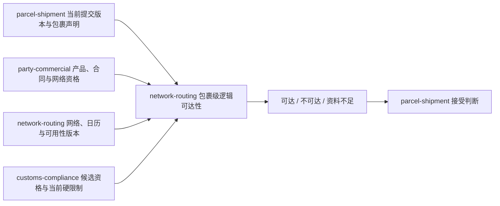

# IDP Parcel `PN02-W04` 接受前逻辑可达性证据工作单

状态：业务取证执行模板；只定义接受前网络依据、候选资格、三值判断和时效目标的提交与核验要求，不维护参数当前值

本文执行 [`PN-02` 真实参数取证与开发交接](./pn-02-real-parameter-evidence-and-development-handoff.md) 的 `PN02-W04`，核验范围覆盖 `PAR-NET-01` 至 `PAR-NET-06`、`PAR-COM-14` 和 `PAR-NFR-06`。目标是让业务方提交真实网络与判断依据，使开发能够针对当前委托提交版本中的每个包裹，可靠区分`可达`、`不可达`、`资料不足`和本次`未形成判断`。

本工作单只按锚点范围消费 `PAR-CUS-01` 至 `PAR-CUS-04` 中与候选关务区域、口岸、申报路径资格及当前硬限制有关的权威结果。它不要求在本阶段完成正式关务建案、申报、监管舱单、监管受理或放行，也不规定 API、数据库字段、消息 Schema、路由算法、班次、容量、订舱、装载或部署方式。

真实网络地图、地址样本、日历、截单、限制内容、客户资料和运行记录必须留在受控证据库；仓库只登记稳定脱敏标识、证据索引、版本、有效期间和核验结论。

## 已确认机制与待取证实例

以下机制已经由[网络与路由上下文](../domain/network-routing/CONTEXT.md)和 [`UC-NR-002`](../application/network-routing/UC-NR-002-ASSESS-PARCEL-REACHABILITY.md) 确认，本工作单不得通过真实参数重新定义：

- 接受前可达性按包裹判断，不形成一个覆盖全部成员差异的委托级可达状态。
- `可达`要求至少存在一条已经完整证明满足服务要求和全部适用硬约束的逻辑路径。
- `不可达`要求候选空间已经闭合，并且全部候选都被有效权威依据确定性淘汰。
- `资料不足`表示已形成业务判断，但现有业务证据不能证明可达或不可达；依赖超时、配置损坏或提交失败属于`未形成判断`。
- 可达性判断、委托接受和接受后路由计划是三个独立结果，任何一方都不得替代另一方。
- 具体班次、容量、订舱、装载和实际履约不是逻辑可达性的成立条件；单次资源失败不能直接改写原可达性。

本次只取证锚点产品、合同和成熟线路实际采用的服务区域、网络拓扑、日历、截单、可用性调整、候选资格、时点和新鲜度。`PAR-NET-01` 复用 W01 的线路证据，`PAR-COM-14` 复用 W03 的规则与时点证据，其他重叠参数同样引用原受控证据并补充可达性所需组成，不重复建立证据所有权或第二套材料。参数当前状态仍以[首发试点参数与证据登记册](../product/PILOT-PARAMETER-REGISTER.md)为唯一权威；提交前必须重新读取登记册，不能把候选存在或样本通过写成参数已确认。

## 所有权与协作边界

| 责任方 | 拥有 | 不得代替 |
|---|---|---|
| `parcel-shipment` | 委托、当前提交版本、包裹身份、客户地址与声明、服务要求，以及为本次判断解析的 `asOf` | 生成三值可达性结果、修改网络或关务资格 |
| `party-commercial` | 责任法人、服务产品、合同、网络使用资格和具有合同效力的客户约束 | 评估具体逻辑路径或形成委托接受决定 |
| `network-routing` | 服务区域、节点覆盖、有向连接、线路、日历、截单、可用性调整、候选范围、淘汰依据和三值判断 | 接受/拒绝委托、修改客户地址、建立正式关务结果或预占履约资源 |
| `customs-compliance` | 候选关务区域、口岸、申报路径的资格和当前硬限制 | 在本工作单中建立正式案件、申报、监管受理或放行 |
| `transport-fulfillment` | 具体班次、容量、订舱、装载分配、承运接受和实际履约 | 用一次资源结果决定接受前逻辑可达性 |

## 证据提交封面

每个证据包必须提供：

| 项目 | 必须说明 |
|---|---|
| 覆盖参数 | 参数 ID、待核验业务断言和受影响生产分支 |
| 适用组合 | 客户账户、责任法人、产品、合同、起止服务区域、线路、服务/关务范围和有效期间 |
| 网络或规则版本 | 稳定脱敏标识、版本、生效/失效时间、当前修订及受控证据索引 |
| 来源与责任 | 对象所有者、证据提供方、业务核验方、最终决定方和登记册更新责任方 |
| 证明边界 | 能证明的覆盖、方向、资格、时间或限制，以及明确不能证明的容量、执行或监管结果 |
| 冲突与缺口 | 相反证据、未发布版本、未知候选、过期依据及受影响范围 |
| 替换与失效 | 新旧版本关系、临时调整、停止新增、失效重判和历史保留规则 |
| 验证样本 | 包裹和提交版本的脱敏引用、实际 `asOf`、采用版本、候选范围、逐候选结果和预期结论 |

页面显示一条线路、地图能够连线、历史上走通过、节点正在运营或某次订舱成功，都不能单独证明当前包裹逻辑可达。

## `PAR-NET-01..06` 网络事实与适用关系

六项网络参数必须作为同一锚点范围交叉核验，但继续保持独立对象和版本：

| 参数 | 必须提交 | 不能据此推导 |
|---|---|---|
| `PAR-NET-01` 成熟主力线路 | 脱敏线路身份、组成连接与节点顺序、运营企业责任范围、适用产品/法人、版本、有效期间和成熟性证据 | 当前每个包裹可达、当天有舱位或该线路是唯一候选 |
| `PAR-NET-02` 始发区域 | 起运服务区域版本、地址解析依据、候选收寄节点、出口路径边界、业务时区和有效期间 | 已收寄、已形成正式出口申报或出口路径当前无任何限制 |
| `PAR-NET-03` 目的区域 | 目的服务区域版本、地址解析依据、候选注入/交付节点、进口路径边界、业务时区和有效期间 | 已获得尾程资源、已形成正式进口申报或必然可以交付 |
| `PAR-NET-04` 起点、终点和中间节点 | 各节点网络身份、相邻有向连接、节点角色、覆盖范围、业务时区、顺序和版本 | 包裹已到达、节点已取得实物控制或已经发生扫描与处理 |
| `PAR-NET-05` 自营节点 | 经营法人、当前服务范围及会影响候选资格的处理边界 | 实时产能、完整仓储能力、实际作业完成或完整 WMS 职责 |
| `PAR-NET-06` 场站及作业方式 | 首发场站、适用作业方式及会确定性排除节点或路径的硬边界 | 作业任务、库存、设备状态、装卸结果或具体班次资源 |

上述证据还必须为适用节点、连接或线路提供版本化服务日历、营业窗口、截单条件和临时网络可用性调整。稳定网络定义与临时停运、关闭或恢复必须分开；临时调整到期或解除只恢复重新评估资格，不改写历史判断。

首发只实施一条成熟线路，不等于业务候选空间天然只有一条。业务方必须证明本次产品、合同、责任法人、服务目的和有效期间下的候选范围如何闭合；其他真实可用路径应作为候选纳入，或用权威适用依据明确排除，不能因为系统暂未配置而消失。

## 商业与候选资格引用

`PAR-COM-14` 必须为可达性判断提供实际时点选择策略，并与 W01、W03 已核验的客户、责任法人、产品、合同及接单规则包一致。业务证据还须区分：

- 服务产品和合同承诺的线路、节点、口岸或渠道要求，这些要求可以成为候选硬约束。
- 客户普通偏好或备注，这些内容不能淘汰其他合格候选，也不能绕过硬限制。
- 标准网络服务与明确允许待路由的产品；只有产品规则明确允许，`parcel-shipment` 才能在不可达结果下继续判断是否接受。
- 仅提供面单渠道服务且运营企业不控制端到端网络的范围，应以明确产品依据形成`不适用`，不得虚构端到端可达性。

`PAR-CUS-01..04` 在 W04 中只提供候选关务区域、口岸、申报路径资格和当前硬限制的权威判断引用。证据包只需证明引用的对象、范围、版本、适用时点、结果、当前修订和来源责任；不复制关务专项证据，不以“尚未建关务案件”判断不可达，也不以历史放行推导当前候选合格。

若候选路径所需关务资格或限制仍未知，按证据性质形成`资料不足`或本次`未形成判断`。W04 的引用核验不能自动把 `PAR-CUS-01..04` 的整体状态更新为已确认。

## 候选空间与三值证据

每个包裹的证据必须先形成明确候选空间，再保存每条候选的合格、确定性淘汰或证据未知结果：

| 结论 | 必须证明 | 禁止捷径 |
|---|---|---|
| 可达 | 至少一条候选已经完整满足服务区域、商业资格、时间可行性和全部适用硬约束；其他缺口不能推翻该候选 | 仅证明线路存在、历史走通过或部分规则通过 |
| 不可达 | 候选空间已经闭合，全部候选均由当前有效权威依据确定性淘汰 | 只评估首选线路、把未知候选当作不存在或把技术失败当淘汰 |
| 资料不足 | 没有候选已经完整证明可达，且明确业务证据缺口影响剩余候选 | 使用默认地址、默认区域、默认口岸或将缺口写成不可达 |
| 未形成判断 | 权威依赖不可用、网络版本未发布/损坏、计算或提交失败、并发冲突，未形成完整三值结果 | 将系统或依赖问题写成资料不足、不可达或可达 |

候选空间的闭合依据至少说明：起止服务区域、适用产品和法人、可用网络版本、允许的节点与有向连接、服务日历和截单、候选关务路径及全部当前硬限制。候选只是被评估的逻辑路径，不是已选择路线、当前路由计划或资源预留。

## 判断时点、版本与新鲜度

W04 不重新选择 `asOf` 策略，而是验证 `PAR-COM-14` 已定义策略能否在真实网络依据上执行：

1. `parcel-shipment` 为当前提交版本中的每个包裹解析本次可达性判断的 `asOf` 语义和值。
2. `network-routing` 校验并回显实际采用值，按该时点选择服务区域、网络、日历、截单、可用性、资格和限制版本。
3. 每个权威结果保留判断时间、有效区间、当前修订标识、来源责任和新鲜度要求；不得用一个全局时间覆盖不同依据。
4. 节点和线路的日历、截单按各自业务时区解释，跨节点衔接按绝对时刻比较；不得把服务器时区作为业务默认值。
5. 接受提交前发现关键依据过期、被替代、修订变化或被新限制推翻时，原判断不得继续用于接受；重新判断暂时失败时保持委托未决。
6. 新版本和迟到事实不覆盖原判断。接受后发生的网络变化进入接受后路由或异常协作，不追溯改写已经合法形成的接受前判断。

`PAR-NFR-06` 必须为可达性流程分别提供适用的响应、新鲜度、批量窗口和恢复目标，注明指标起止点、业务日历、适用范围、例外、锚点流程负载、外部依赖能力基线和证据来源。目标未确认时不得写入行业默认数值；业务依据有效期与系统响应目标也不能合并为同一个“超时”。

## 跨参数一致性核验

1. `PAR-NET-01` 的线路只能由 `PAR-NET-04` 已登记的有向连接和节点按顺序组成，起止覆盖与 `PAR-NET-02/03` 一致。
2. `PAR-NET-05/06` 的经营与作业边界只参与节点资格，不把节点存在、设备或 SOP 证明扩张为实际容量和执行结果。
3. 产品、合同、责任法人、线路和网络使用资格必须与 W01、W03 的同一版本及有效期间相容。
4. 每个节点、连接、线路的业务时区、日历和截单能够按判断 `asOf` 复现，不存在服务器默认时区或覆盖历史的当前配置。
5. 稳定拓扑和临时可用性调整分别有来源、版本和有效区间；关闭、恢复和到期关系不相互覆盖。
6. 候选关务资格和限制引用对应同一候选区域、口岸、申报路径及适用时点，不要求或伪造正式关务结果。
7. 候选空间覆盖当前产品责任范围内所有可能路径；试点选择、界面过滤或实现缺口不能代替业务排除依据。
8. `PAR-NFR-06` 的目标能够区分业务资料缺口、权威依赖失败和系统处理失败，不改变三值结果语义。

任一关系冲突时，不得因单项配置存在、历史运输成功或一个候选测试通过而确认整组参数。

## 最小业务验证样本

| 场景 | 必须证明 |
|---|---|
| 至少一个完整合格候选 | 形成可达，保留候选及全部采用依据；不接受委托、不建路由计划、不占资源 |
| 完整候选空间全部淘汰 | 形成不可达及逐候选稳定原因；不直接写委托已拒绝 |
| 地址缺少区域解析所需资料 | 形成资料不足和再次判断条件；不使用默认区域 |
| 已发布服务区域明确排除地址 | 证据完整时形成不可达，不误写为资料不足 |
| 部分候选淘汰、剩余候选证据未知 | 形成资料不足，不用已淘汰部分证明整体不可达 |
| 一个候选完整合格、其他候选局部未知 | 只有未知项不能推翻合格候选时才形成可达 |
| 商业、网络或资格依赖超时 | 本次未形成判断，保留请求和安全续办引用 |
| 网络版本未发布或损坏 | 本次未形成判断，不伪装成业务资料不足 |
| 客户普通偏好指定线路 | 未形成合同约束时不排除其他合格候选 |
| 合同明确指定有效路径条件 | 条件作为硬约束参与当前候选判断并可追溯 |
| 临时关闭覆盖一个候选 | 仅在调整范围和有效期间内淘汰候选，不覆盖稳定拓扑或历史判断 |
| 截单跨时区边界 | 使用各自业务时区并按绝对时刻比较，可重复得到同一结论 |
| 单次容量、订舱或装载失败 | 不改写接受前逻辑可达性，不在本用例处理资源对象 |
| 同一委托多个包裹结果不同 | 各自形成判断；`network-routing` 不形成委托级接受或部分接受 |
| 相同请求重试及同键不同内容 | 相同版本返回已有结果；冲突不覆盖原请求和判断 |
| 判断后关键依据失效 | 新请求形成新判断版本；接受提交前无法重判时保持未决 |
| 判断已经提交但首次结果投递失败 | 保留原判断及发布意图并重试投递，不重复判断或构造默认结果 |
| 仅面单渠道服务范围 | 依据产品规则形成不适用，不虚构运营网络 |
| 关务资格淘汰一个候选 | 只保存资格或限制引用，其他合格候选仍可支持可达；不建立关务案件 |
| 首发只配置一条线路 | 仍能证明业务候选空间完整，或明确暴露未配置候选而不形成错误不可达 |

样本必须绑定脱敏输入、受控证据索引、采用版本和实际 `asOf`。不可达、依赖失败、临时关闭和冲突优先使用脱敏历史回放或隔离模拟，不主动制造真实网络或监管失败。

## 登记册动作

本工作单不建立新状态。证据完整、一致并取得有权决定后，由登记册责任方更新对应参数；部分证据只解除明确分支阻断，参数整体状态按登记册规则保守汇总。

- `PAR-NET-01` 的锚点候选和成熟性核验不能代替当前包裹可达性，也不能自动确认 `PAR-NET-02..06`。
- `PAR-NET-02..04` 必须覆盖真实服务区域、地址解析、节点、有向连接、顺序、时区及有效期间。
- `PAR-NET-05/06` 只按首发专业节点和作业边界核验，不扩展为完整 WMS 或实时容量验收。
- `PAR-COM-14` 只有 W03 的规则、授权、五类时间与 W04 的实际时点执行证据共同完整后，才可按整体状态评估。
- `PAR-NFR-06` 的可达性分支完成不代表其他关键流程目标已经完成；整体状态继续保守汇总。
- `PAR-CUS-01..04` 只有其责任方按各自完整证据要求核验后才能更新；W04 消费一个资格或限制结果不构成整体确认。

## 给开发的交接

真实参数未确认时，可以实现包裹级请求身份、三值结果、候选/淘汰/未知依据、显式未配置、版本化重判和安全续办的稳定骨架，并使用命名合成夹具覆盖 [`AT-NR-016..032`](../application/network-routing/UC-NR-002-ASSESS-PARCEL-REACHABILITY.md#验收示例)。不得写入默认国家、区域、线路、节点、时区、日历、截单、口岸、资格或新鲜度。

开发实现必须保持以下独立语义：

- 商业资格、网络依据和候选关务资格分别返回原权威结果及版本，不能压成一个通用“校验通过”。
- `可达`、`不可达`、`资料不足`是三值领域判断；`未形成判断`、重复、冲突、未受理和不适用是应用处理结果。
- 每个包裹分别形成判断并保留完整候选范围；委托是否接受仍由 `parcel-shipment` 决定。
- 接受前候选不得复制成接受后当前路由计划，也不得创建班次、容量、订舱、装载或正式关务对象。
- 失效依据形成新判断版本，原判断与原输入不被覆盖；响应丢失时查询原结果，不构造默认值。

W02、W03 和 W04 证据完成后，只能进入 W05 的同版本联合验证与生产分支准入评审；W04 本身不授权真实接受、拒绝或限量生产。它只贡献验收矩阵 `OPS-01` 的接受前可达性证据，接受后初始路由计划尚未因此通过。业务写入、Repository、事务和 Outbox 仍受 [`PS-W1-S1` 技术准入](./parcel-go-first-consumer-slice-decision-brief.md)约束。

## 完成清单

- [ ] 八项核验参数都有稳定脱敏引用、受控证据索引、版本、适用范围和有效期间。
- [ ] 服务区域、节点覆盖、有向连接、线路、时区、日历、截单和临时可用性调整能够按真实 `asOf` 复现。
- [ ] 候选空间闭合规则、逐候选合格/淘汰/未知依据和三值证据门槛已经核验。
- [ ] 商业约束、普通偏好、候选关务资格和当前硬限制的边界清楚且来源权威。
- [ ] 可达性判断、委托接受、接受后路由计划和实际履约资源没有被合并。
- [ ] 新鲜度、提交前失效重判、重复、冲突、依赖失败和安全续办样本通过。
- [ ] 单次班次、容量、订舱或装载失败没有被用作逻辑不可达依据。
- [ ] 登记册由责任方按唯一状态更新，工作单、配置存在和测试通过没有自动升级生产准入。

完成 W04 只解除接受前逻辑可达性的业务证据阻断；仍须完成 W05 和适用阶段 `Go/No-Go`，才能进入真实生产接受候选。
