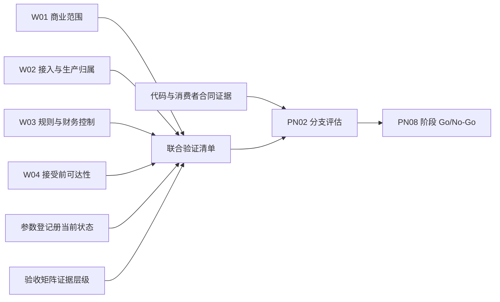

# IDP Parcel `PN02-W05` 联合验证与生产分支准入工作单

状态：业务联合验证与能力分支准入模板；不维护参数或验收场景当前状态，不替代产品级阶段 `Go/No-Go`

本文执行 [`PN-02` 真实参数取证与开发交接](./pn-02-real-parameter-evidence-and-development-handoff.md) 的 `PN02-W05`。它把 W01 至 W04 已核验的商业范围、生产归属、接单/财务策略和接受前可达性证据固定到同一联合验证范围，证明 `PN-02` 的明确能力分支可以继续稳定骨架、进入 `R/S` 配置验证，或者作为限量生产候选提交产品级阶段评审。

W05 不自行批准真实客户流量。历史回放、影子运行、限量生产和正式验收的实际阶段证据及 `Go/No-Go` 决定仍由 [`PN-08`](../product/PARCEL-NETWORK-FIRST-RELEASE-DEVELOPMENT-BASELINE.md) 统一形成。W05 也不规定 API、数据库字段、消息 Schema、部署方式、真实客户、金额、容量、阈值、角色名单或 SLA。

真实客户资料、合同、地址、货物、账户、金额、角色名单、运行日志和受限证据必须留在受控证据库；仓库只保存稳定脱敏标识、证据索引、版本、适用期间和验证规则。

## 输出边界

W05 的输出是一次明确范围的**能力分支评估结论**，不是委托状态、接受判断任务状态或新的领域生命周期：

| 可以形成 | 不能形成 |
|---|---|
| W01 至 W04 证据的不可变联合验证清单 | 参数已确认、场景已通过或产品已经上线的第二套状态 |
| 每个能力分支当前允许的稳定骨架、`R/S` 或生产候选层级 | 一个笼统的“PN-02 全部就绪”布尔值 |
| 阻断项、适用范围、责任方和安全续办入口 | 用测试通过、配置存在或页面可见代替生产准入 |
| 向 PN-08 提交的分支评估与证据版本 | 绕过 PN-08 的影子、限量生产或正式验收 `Go/No-Go` |

同一评估范围若只有部分能力满足条件，必须拆成多个有完整边界的分支结论；不得使用含糊的“部分通过”把未准入能力带入生产候选。

## 权威依据与责任

| 责任方 | 在 W05 中负责 | 不得代替 |
|---|---|---|
| 参数登记册责任方 | 维护真实参数唯一当前状态和证据索引 | 用 W05 结论自动升级参数状态 |
| 各领域结果所有者 | 提供实际商业、财务、可达性和来源判断及版本 | 共同编辑一个通用“校验结果” |
| `party-commercial` | 提供不可覆盖的已发布商业版本和两阶段唯一解析结果 | 接受、拒绝或撤回委托，或在冲突候选中任选 |
| `parcel-shipment` | 对当前提交版本逐项采用权威结果并形成唯一接受、拒绝、决定前撤回或未决结果 | 修改规则、金额、可达性或生产归属结果 |
| 试点准入控制 | 对完整拟受理范围形成生产归属，维护暂停、恢复、回退和接管边界 | 把生产归属排除写成客户业务拒绝 |
| 技术责任方 | 证明代码、事务、Repository、事件、隔离、恢复和发布基线 | 以构建或测试通过批准业务范围 |
| 试点业务责任角色 / PN-08 | 依据证据版本形成实际阶段 `Go/No-Go` | 豁免硬风险或把 W05 评估当作阶段决定 |

## 联合验证范围

每次执行必须先固定一个不可扩张的评估范围，至少包括：

- 集团租户、货主客户账户和责任法人。
- 服务产品版本、客户合同版本、接单规则包和接受前财务控制策略的独立发布结果、批准依据、商业选择锚点和当前修订。
- 客户结算模式及其合同、服务/费用与控制适用范围，合同结算币种、结算账户、销售价格规则及其责任/币种关系；产品设计已确认两种模式可独立拆分，真实锚点实例和另一分支的隔离证据仍待提供。
- 成熟线路、起止服务区域、适用服务/关务范围和候选资格边界。
- 客户生产接入渠道、完整拟受理范围、当前生产权威和生效边界。
- 具体能力分支，例如商业发布/唯一解析、来源保全、生产归属、`已提交`、接受判断、接受、拒绝、决定前撤回或安全未决。
- 目标验证层级、业务时间窗口、限量生产容量边界及明确排除能力。

“同一组参数版本”不是要求所有参数共享一个版本号，而是形成一份不可覆盖的联合验证清单。清单逐项固定参数 ID、对象/规则版本、有效区间、当前修订、受控证据索引和本次采用 `asOf`；所有直接依赖必须在本次评估范围内存在有效交集。

参数或证据变化只使受影响的分支重新评估，不追溯改写原执行记录。客户、法人、产品、合同、线路、生产权威或关键规则变化时，不能沿用旧 W05 结论扩大新范围。

## 分支与验收场景映射

W05 必须区分“本次直接闭环”“只贡献局部证据”和“独立后续分支”：

| 场景或能力 | W05 责任 | 结论边界 |
|---|---|---|
| `GOV-03..07` | 复用 W02 的阶段授权、唯一权威、完整委托准入、暂停恢复和回退证据 | 是接单分支的直接治理前置，但 W05 不形成产品阶段决定 |
| `PAR-GOV-01/02/09` | 消费回放数据、影子范围和偏差阻断/风险接受依据 | W05 不取得参数所有权；未确认时只能继续准备，不能把执行结果作为正式阶段证据 |
| `CPS-01..03` | 贯通商业快照、单一接入、接受判断、多件委托和接受基线 | 是 W05 接单主分支的直接验收范围 |
| `CPS-04` | 验证接受时永久包裹身份和成员不被静默删除 | 真实物理拆分/合并和完整谱系证据仍是独立能力分支；未验证时不得宣称 `CPS-04` 整体通过 |
| `CPS-05` | 只验证接受时预计承诺与接受基线同一提交成立 | 正式承诺、收寄、路由、ETA 和实际事实由 PN-03 以后验证 |
| `CPS-06` | 锚点网络服务实际调用外部标签渠道时，单独核验适用渠道分支 | 需要 `PAR-INT-02` 等渠道证据；文件生成或网络服务身份不能替代面单交易验收 |
| `CPS-08/09` | 验证接受基线不可覆盖及向 `UC-PS-002` 的交接边界 | 完整接受后资料更正需 `PAR-COM-13` 和独立执行证据；W01 至 W04 完成不能使其自动通过 |
| `CPS-10` | 验证 `UC-PC-001` 独立发布和 `UC-PC-002` 两阶段唯一解析 | 是 W05 的直接前置；导入成功、零匹配、多匹配或读取失败均不能伪装成唯一商业基线 |
| `CPS-11` | 验证 `UC-PS-005` 的撤回与接受/拒绝并发、判断停止和冻结释放补偿 | 是 W05 的直接验收范围；撤回先成立与接受先成立分别验证，不把释放失败改写为撤回失败 |
| `CPS-12` | 只验证接受已先行成立时转入 `UC-PS-006` | 收寄前逐包裹取消、收寄后处置及下游执行由 PN-04 直接闭合，W05 不得据此标记通过 |
| `OPS-01` | 消费 W04 的接受前可达性证据 | 只贡献可达性部分；接受后初始路由计划仍由 PN-03 负责 |
| `INT-01` | 验证唯一客户主接入、来源保全、重复、冲突、纠错和查询 | 是 W05 的直接验收范围 |
| `INT-03` | 仅在本分支实际发起不可逆外部调用时验证待确认和防重复 | 不适用时明确说明；不能用内部重试样本证明外部行为 |
| `DAT-01..03` | 验证客户隔离、最小化、审计、来源、版本、更正和派生结果 | 任何违反均为阻断，不得风险接受 |
| `NFR-01..03` | 只验证接入、接受判断和可达性子流程的真实基线、目标和恢复 | 不代表节点、履约、关务、轨迹或完整结算的非功能目标已通过 |
| `GOV-10`、`PAR-GOV-11` | 验证独立项目运行边界和正式证据引用可用 | 不在 W05 细化对象存储、部署或基础设施实现 |

完成接单主分支不能把面单交易、接受后资料更正、物理拆分合并或初始路由等相邻分支标记为通过。它们可以在同一 PN-02 下继续开发，但必须拥有各自的参数、证据层级和准入结论。

## 评估层级

| 目标层级 | 最低条件 | W05 可以得出的结论 | 不得宣称 |
|---|---|---|---|
| 稳定骨架 | 规则机制已确认，真实参数仍可未配置 | 允许继续强类型身份、来源、三类归属、三值可达性、未决和决定提交边界测试 | 真实配置、真实权威或生产可用 |
| `R/S` 配置验证 | 相关候选和版本已有受控证据，回放/模拟范围隔离 | 允许用明确版本装配规则并重复验证全部分支 | 已取得生产权威、真实外部行为或 `P` 证据 |
| PN-02 生产候选 | 精确范围内直接依赖的参数组成均已确认或有权威不适用依据；业务、技术、隔离和恢复门槛通过 | 可以把该精确能力分支及证据版本提交 PN-08 阶段评审 | 已允许真实客户流量、相关参数整体就绪、PN-02 全部完成或产品已正式验收 |
| PN-08 实际阶段 | PN-08 汇总相邻切片、在途责任及本阶段所需全部证据 | 由有权角色形成历史回放、影子、限量生产或正式验收的 `Go/No-Go` | 由 W05 自动形成或仅凭 PN-02 单独形成 |

限量生产前尚无法取得、且只有进入限量生产后才能自然形成的 `P` 证据，不得伪造。W05 必须列出这些待形成的真实生产证据及监控/暂停条件；PN-08 可以在其他前置全部成立后决定是否开放精确限量范围，再用真实对象补齐 `P` 证据。

每次阶段评审的业务决定仍只有 `Go` 或 `No-Go`。非关键偏差可以作为一个 `Go` 决定中的受控风险接受记录，但不是第三种模糊决定；存在任一阻断项时必须 `No-Go`。不同范围结论不同时应拆分决定，不能使用“部分 Go”。

## 同版本业务闭环

联合验证必须按以下顺序贯通，并保留每一步的原权威结果：

| 阶段 | 必须证明 | 禁止结论 |
|---|---|---|
| 商业权威与解析 | 客户账户、产品、合同、规则和策略分别形成不可覆盖发布版本；按独立商业选择锚点唯一解析后才形成逐项 `asOf` | 导入即发布、用系统当前时间默认锚点、多个候选任选或把解析失败写成客户拒绝 |
| 来源保全 | 原始来源或不可变引用、摘要、来源发生时间、接收时间、作用域和请求身份先成立 | 解析成功才保存来源，或迟到输入覆盖原内容 |
| 生产归属 | 完整拟受理范围使用有效治理版本形成本产品、其他权威或归属未决结果 | 默认本产品、双写或把排除解释为客户拒绝 |
| 建立`已提交` | 只有本产品取得当前唯一权威后，委托、当前提交版本、声明包裹和接受判断任务成立 | 数据到达、转发成功或任务存在等于已接受 |
| 权威判断 | 商业、资料、每项财务控制和逐包裹可达性分别返回标识、实际 `asOf`、版本、有效区间和当前修订 | 压成一个通用布尔值、用缺失结果默认通过 |
| 提交前复核 | 所有关键依据仍覆盖本次时点且未被新限制、替代版本或并发决定推翻 | 使用过期判断完成决定 |
| 接受 | 全部适用硬规则和权威结果成立；当前提交版本形成唯一决定 | 成员级部分接受、人工覆盖硬失败或隐藏审批 |
| 接受提交 | 接受状态、决定、完整成员基线、预计承诺、审计和事件发布意图同一提交成立 | 已接受但缺基线/承诺，或事件失败回退接受 |
| 拒绝提交 | 拒绝状态、结构化原因、证据、授权、审计和事件发布意图同一提交成立 | 依赖故障、生产排除或自由文本备注冒充拒绝 |
| 撤回提交 | 客户或授权代表在接受/拒绝提交前形成撤回、停止判断任务和发布意图；适用冻结按原关联异步释放 | 把撤回写成拒绝、等待释放成功才撤回，或接受先成立后仍释放合法冻结 |
| 尚未决定 | 客户待补充与内部依赖续办原因分开，委托保持`已提交` | 超时自动拒绝、资料不足写成不可达或失败 |

一个委托包含多个包裹时，每个包裹分别取得可达性判断，但当前提交版本只形成一个委托级接受或拒绝决定。任一成员确定性不满足接受条件时整份版本不能接受；不得删除成员、拆分成员或先接受其余成员。

## 必须执行的业务样本

W05 不复制应用用例的完整验收定义，执行记录必须引用 [`UC-PC-001`](../application/party-commercial/UC-PC-001-MAINTAIN-AND-PUBLISH-COMMERCIAL-AUTHORITY.md#验收示例)、[`UC-PC-002`](../application/party-commercial/UC-PC-002-RESOLVE-COMMERCIAL-BASIS.md#验收示例)、[`UC-PS-001`](../application/parcel-shipment/UC-PS-001-SUBMIT-SHIPMENT-REQUEST.md#验收示例)、[`UC-PS-005`](../application/parcel-shipment/UC-PS-005-WITHDRAW-SUBMITTED-SHIPMENT-REQUEST.md#验收示例)和 [`UC-NR-002`](../application/network-routing/UC-NR-002-ASSESS-PARCEL-REACHABILITY.md#验收示例)的当前版本：

| 样本组 | 至少覆盖 |
|---|---|
| 商业发布与解析 | `AT-PC-001..030` 的适用部分：独立发布、批准、重叠冲突、无适用依据、解析未决、两阶段 `asOf` 和提交前失效 |
| 正常接受 | `AT-PS-001`、`AT-PS-033`：多包裹全部满足、自动接受且没有隐藏人工审批 |
| 批次与成员边界 | `AT-PS-002`、`AT-PS-005`：委托分别提交，成员失败不全批回滚，也不部分接受 |
| 来源与输入 | `AT-PS-003/004/012`：重复、同键冲突和输入未受理不创建错误委托或决定 |
| 生产归属 | `AT-PS-010`：其他权威和归属未决不在本产品建单或拒绝 |
| 可达性与未决 | `AT-PS-006..008` 及 `AT-NR-016..032` 的适用部分：三值结果、待路由依据和依赖失败不混用 |
| 人工与财务 | `AT-PS-034/035`：授权复核/拒绝、组合控制、冻结、提交失败和结果查询 |
| 决定前撤回 | `AT-PS-067..076`：撤回/接受/拒绝并发、判断停止、冻结释放失败续办、已有决定和越权隔离 |
| 纠错与失效 | `AT-PS-036/037`：新提交版本、关联新委托、关键依据失效重判和历史保留 |
| 提交与投递 | `AT-PS-013`、`AT-NR-030`：决定或判断已提交后只重试原发布意图，不重复业务结果 |
| 隔离与最小化 | 跨租户、跨客户、批量错误、日志、指标、事件和测试输出不泄露存在性或业务内容 |
| 暂停与恢复 | 暂停阻止新准入但不改写在途；风险解除不自动恢复，回退不双写或盲目重提 |

高风险、不可逆或会形成真实金额/外部指令的失败分支优先使用允许的 `R/S`，不得为了验收主动制造客户、监管、资金或履约风险。

## 技术准入门槛

业务证据和技术证据相互独立且都必须成立。W05 存在或业务样本通过，不能解除 [`PS-W1-S1` 技术准入](./parcel-go-first-consumer-slice-decision-brief.md)：

1. 实际代码实现与本次能力分支一致，未实现部分明确返回未配置或不支持，不返回虚假成功。
2. 生产写入使用正式不可变 Bento 候选和精确版本，消费者合同 `PBC-01..09` 对同一代码与依赖版本通过；本地副本、`replace`、浮动分支和伪事务不构成证据。
3. 来源保全事务与委托提交事务保持既定边界；委托业务记录和对应事件发布意图在同一事务中成功或回滚。
4. 接受、拒绝和撤回分别满足其最小业务提交边界并竞争同一不可覆盖决定；提交结果不确定时可以按稳定关联查询，不盲目重放决定、冻结、释放或事件。
5. Repository、迁移、Schema、Outbox/Inbox、并发版本和作用域隔离使用真实生产技术合同验证，测试替身不能代替生产消费者证明。
6. 构建、发布、业务数据库和运行边界保持 Parcel 独立；公司级技术组件不取得领域所有权或共享其他产品业务表。
7. 响应、新鲜度、恢复和容量使用锚点真实基线与本分支目标验证；行业估算只登记缺口。

技术门槛未完成时，业务方仍可完成 W01 至 W05 的取证、场景编排和合格 `R/S` 验证，但该分支不能进入生产候选。

## 阻断、偏差与失效

以下任一情况都是 W05 生产候选阻断项，不能风险接受：

- 精确范围内直接依赖的参数组成未确认、证据过期、适用范围冲突或没有权威不适用依据。
- 完整拟受理范围没有唯一生产权威、存在双写或安全交接不可证明。
- 硬规则、必要权威结果、决定权限或客户隔离存在未知、绕过或冲突。
- 不可达候选空间不完整，却被写成确定不可达或据此拒绝。
- 商业对象没有独立发布依据、商业解析零匹配/多匹配/未决却被默认成功，或逐项 `asOf` 被一个全局时间替代。
- 接受/拒绝/撤回提交边界、来源保全、事务或事件发布意图可能产生缺失、重复或相反决定。
- 提交结果不确定无法查询，可能重复冻结、重复释放、重复接受、重复拒绝、重复撤回或重复外部指令。
- 跨客户泄露、个人信息最小化失败、审计不可追溯或来源历史可被覆盖。
- 暂停、恢复、回退、在途责任或对象级接管无法执行。
- 本次生产写入依赖的不可变技术合同和消费者证明未通过。

非关键偏差只有在验收矩阵允许时，才可以记录影响范围、临时控制、责任方、计划关闭时间、剩余风险和有权角色的风险接受。风险接受不改变参数状态、不扩大范围，也不能覆盖上述硬阻断项。

任一关键依据失效时先停止受影响范围的新准入，保留在途委托及原决定。风险解除只恢复申请重新评估的资格，不自动恢复生产准入；恢复仍需新的有效证据和 PN-08 阶段决定。

## 分支评估记录

每次 W05 执行至少形成以下索引，真实内容仍保存在受控证据库：

| 内容 | 最低要求 |
|---|---|
| 评估身份 | 稳定评估 ID、目标层级、评估时间和前序评估关系 |
| 精确范围 | 租户、客户、法人、产品、合同、线路、接入、能力分支、时间与容量边界的脱敏引用 |
| 联合验证清单 | W01 至 W04 证据、参数登记册版本、逐参数版本/有效区间/当前修订和实际 `asOf` |
| 场景证据 | 矩阵版本、场景 ID、`P/R/S/N/A`、数据范围、执行结果及是否验证真实外部行为 |
| 技术证据 | 代码/构建版本、依赖版本、消费者合同、事务/隔离/恢复结果和明确未实现范围 |
| 偏差与阻断 | 影响分支、硬阻断或非关键偏差、临时控制、责任方和续办入口 |
| W05 结论 | 保持稳定骨架、允许 `R/S`，或通过并提交 PN-08 生产候选评审；不得写成产品级 `Go` |
| 阶段决定引用 | PN-08 后续 `Go/No-Go` 的决定方、证据版本、生效范围和时间；尚未形成时明确留空 |

W05 结论不能自动更新参数登记册或验收矩阵。参数状态由登记册责任方更新；场景状态由相应执行记录依据矩阵更新；阶段决定由有权角色在 PN-08 形成。三者必须通过同一证据版本相互引用，但不能合并为一条可覆盖状态。

一个多组成参数可以在登记册整体仍保持`待提供`、`待核验`或`待决策`时，为某个精确分支保留已经核验的组成证据。W05 只能引用该组成形成局部结论，并必须记录未完成组成和不适用范围；不得据此把参数整体或其他分支写成已就绪。每次执行开始时必须重新读取登记册；存在上述阻断项时实际结论只能是 `No-Go`，不能因为本模板已经完成而预填通过。

## 给开发的交接

- W01/W02 业务语义证据完成后，才评审生产归属和`已提交`应用合同；不因此解除持久化技术门槛。
- W03/W04 证据完成后，可以实现商业两阶段解析、资料、财务和可达性端口及接受/拒绝/撤回编排测试；未配置、冲突、过期和依赖失败必须保持未决。
- W05 联合验证通过后，只说明精确分支可以提交 PN-08 生产候选评审；开发、部署或配置完成均不能自行接入真实客户流量。
- 面单交易、接受后资料更正、接受后逐包裹取消/处置、物理身份谱系和接受后初始路由按各自能力分支继续推进，未验证部分不得被接单主分支返回成功。
- 任何实现不得写入默认客户、法人、产品、合同、线路、国家、口岸、角色、金额、时点、阈值、容量或生产权威。

当前代码和依赖事实必须在每次评估时重新读取，不能把本工作单中的计划边界当作代码已经实现的证明。

## 完成清单

- [ ] 联合验证范围和目标层级完整，不存在含糊的部分范围或默认扩张。
- [ ] W01 至 W04 证据、参数登记册和执行记录引用同一有效版本组合。
- [ ] 每个多组成参数只按本次适用组成判断，未把局部证据升级为参数整体就绪。
- [ ] 商业对象独立发布、两阶段唯一解析、来源保全、三类生产归属、`已提交`、权威判断、失效复核及接受/拒绝/撤回/未决闭环通过。
- [ ] 多包裹只形成一个委托级决定，未发生成员级部分接受或静默删件。
- [ ] 接受、拒绝、撤回、基线、预计承诺、判断停止、冻结释放补偿、审计和事件发布意图满足各自提交边界。
- [ ] 重复、商业适用冲突、输入未受理、依赖失败、结果不确定、并发和补偿样本可重复。
- [ ] 客户隔离、最小化、来源版本、审计、非功能和恢复证据满足本分支要求。
- [ ] 面单交易、接受后资料更正、逐包裹取消/处置、身份谱系和初始路由等相邻能力没有被错误标记为通过。
- [ ] 业务门槛与不可变 Bento/事务/Repository/Outbox 技术门槛分别通过，或明确保持阻断。
- [ ] 硬阻断没有被风险接受；非关键偏差具有完整控制、责任和关闭计划。
- [ ] W05 结论只提交 PN-08 阶段评审，没有自行形成产品级 `Go/No-Go`。

完成 W05 只闭合 `PN-02` 指定能力分支的联合验证与生产候选证据。实际影子、限量生产、真实 `P` 证据和正式验收继续由 PN-08 按产品主线统一推进。
