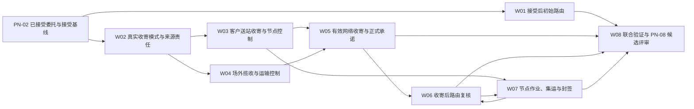

# IDP Parcel `PN-03` 网络收寄与节点作业开发交接

状态：业务机制与开发边界已确认；真实收寄、路由、节点、履约和非功能参数待提供，当前生产结论为 `No-Go / 待参数化`

本文把 [`PN-03`](../product/PARCEL-NETWORK-FIRST-RELEASE-DEVELOPMENT-BASELINE.md) 的接受后初始路由、真实收寄、正式承诺、路由复核和节点作业组织成八个可交付工作包。它不重新定义领域规则，也不维护第二套参数当前值。

本文不规定 API、数据库表或字段、消息 Schema、设备协议、对象存储、部署拓扑、真实客户、节点、地址、账号、金额、阈值、时限或角色名单。真实实例、当前状态和证据索引只在[首发试点参数与证据登记册](../product/PILOT-PARAMETER-REGISTER.md)维护。

## 交付目标

`PN-03` 必须形成以下连续但不合并所有权的业务结果：

1. 已接受包裹形成接受后初始路由、无当前有效路由或可续办的判断未决。
2. 客户送站和场外揽收分别由其事实所有者形成逐对象收寄结果。
3. `parcel-shipment` 统一解释合格来源，逐包裹形成有效网络收寄、责任起点和正式承诺。
4. 收寄发生后按实际接货位置复核路由，节点形成当前有效实测后再次复核。
5. 节点在有效方向依据下完成测量、分拣、集运、封装和封签，并形成 PN-04 可消费的节点侧交接准备证据。

这些结果不得被压缩成一个“已入库”“已收货”或“运输中”状态。`PN-03` 不形成具体班次绑定、容量预占、运输委托、订舱、节点与运输方的权威交接、实际移动、ETA、包裹终局或完整 WMS 库存能力。

## 权威依据

| 职责 | 权威文档 | 本文如何使用 |
|---|---|---|
| 产品切片与完成边界 | [国际小包网络运营首发产品基线与开发主线](../product/PARCEL-NETWORK-FIRST-RELEASE-DEVELOPMENT-BASELINE.md) | 固定 PN-03 在产品主链中的位置 |
| 参数状态与证据责任 | [首发试点参数与证据登记册](../product/PILOT-PARAMETER-REGISTER.md) | 唯一参数台账；本文只组织依赖 |
| 验收场景与证据层级 | [首发试点验收场景矩阵](../product/PILOT-ACCEPTANCE-MATRIX.md) | 使用 `P/R/S/N/A` 组织验证，不另造证据等级 |
| 初始路由 | [`UC-NR-001`](../application/network-routing/UC-NR-001-CREATE-INITIAL-ROUTE.md) | 接受后逐包裹形成初始路由或无路由结果 |
| 客户送站 | [`UC-NO-002`](../application/node-operations/UC-NO-002-RECEIVE-CUSTOMER-DELIVERED-PARCEL.md) | 形成节点收寄、节点控制和待识别实物 |
| 场外揽收 | [`UC-TF-002`](../application/transport-fulfillment/UC-TF-002-PERFORM-OFFSITE-PICKUP.md) | 形成对象级揽收、运输控制和履约参与 |
| 收寄与正式承诺 | [`UC-PS-003`](../application/parcel-shipment/UC-PS-003-ESTABLISH-NETWORK-INTAKE-AND-FORMAL-COMMITMENT.md) | 统一解释来源并形成客户责任结果 |
| 收寄及实测后路由复核 | [`UC-NR-003`](../application/network-routing/UC-NR-003-REASSESS-ROUTE-AFTER-NETWORK-INTAKE.md) | 保留原计划、形成新版本或无路由/建议/未决 |
| 节点作业与集运 | [`UC-NO-003`](../application/node-operations/UC-NO-003-PROCESS-CONSOLIDATE-AND-SEAL-PARCELS.md) | 形成测量、分拣、成员、快照、封签和交接准备证据 |
| 所有权与跨上下文协作 | [领域上下文地图](../domain/CONTEXT-MAP.md) | 防止复制事实或共同编辑业务结果 |
| 计划、承诺与事实分层 | [ADR-0004](../adr/0004-separate-commitment-plan-actual.md) | 禁止路线和实测覆盖客户承诺 |
| 来源、有效事件与派生结果 | [ADR-0005](../adr/0005-source-facts-effective-events-derived-state.md) | 保留重复、迟到、冲突和更正历史 |
| 节点非 WMS 边界 | [ADR-0006](../adr/0006-parcel-node-operations-not-full-wms.md) | 禁止扩张为商品库存模型 |

发生冲突时，领域上下文和应用用例定义业务语义，参数登记册只实例化规则，本文只决定工作包、依赖和交付顺序。

## 三档开发准入

| 档位 | 参数要求 | 可以交付 | 不得宣称 |
|---|---|---|---|
| 稳定骨架 | 不要求真实参数已确认，但 PN-02 前置对象和合同必须可用命名夹具表达 | 强类型对象与来源、逐对象结果、重复/冲突、显式未配置、不可覆盖历史、纯业务不变量和安全续办测试 | 真实收寄、真实路由、正式承诺生产写入、节点生产作业或 PN-03 已实现 |
| 配置验证 | 相关规则、候选和样本已有受控证据，可使用 `R` 或 `S` | 路由候选解释、收寄资格、逐项承诺、节点作业门禁和复杂负向分支的可重复验证 | 参数已成为生产配置、外部伙伴行为已验证或真实客户流量已准入 |
| 生产候选 | 精确分支直接依赖的参数均已确认或有权威不适用依据，技术门槛和同版本联合验证通过 | 提交 PN-08 评审的明确客户/产品/线路/节点/收寄模式能力分支 | PN-03 自行批准生产流量、正式验收或把局部确认推广到其他范围 |

参数未提供只阻断依赖该参数的生产分支，不阻断稳定骨架和合格 `R/S` 验证。当前仓库代码只覆盖建单前身份、来源重复/冲突和最小委托候选；以下工作包是开发交接，不表示已经实现。

## 业务依赖

`W06` 与 `W07` 之间允许业务上的迭代：实测变化触发路由复核，新路由指令再授权后续方向性作业。实现不得把这个迭代压成跨上下文共同维护的状态机。

## 取证与开发工作包

### `PN03-W01` 接受后初始路由

主责用例：[`UC-NR-001`](../application/network-routing/UC-NR-001-CREATE-INITIAL-ROUTE.md)。

主要参数：`PAR-COM-01/03/05/06`、`PAR-NET-01..06`、`PAR-NET-14`、`PAR-CUS-01..04` 的最小路径资格投影、`PAR-NFR-06`。

开发交付：

- 从不可覆盖的接受决定和接受基线开始，逐包裹形成初始路由、无当前有效路由或判断未决。
- 保存服务区域、网络、日历、截单、限制、策略、全部候选及选择/淘汰依据。
- 明确区分接受前可达性和接受后路由，不把可达结果复制成计划。
- 不创建班次、容量预占、订舱、装载分配或实际履约。

验收贡献：`OPS-01 P`；`OPS-02` 的初始无路由部分使用 `R/S`，自然发生时补 `P`；同时贡献 `DAT-02/03`。

### `PN03-W02` 真实收寄模式与来源责任

主责参数：`PAR-NET-13`、`PAR-COM-16`；客户送站分支同时依赖 `PAR-NET-04..06`，场外揽收分支同时依赖 `PAR-NET-07`，外部来源适用时依赖 `PAR-INT-03`。

开发交付：

- 明确首发生产启用客户送站、场外揽收或两者，以及各自适用客户、产品、合同、节点/地点和有效期。
- 固定 `node-operations` 拥有客户送站节点收寄，`transport-fulfillment` 拥有场外揽收；任何接入层不得把普通扫描升级为收寄。
- 固定有效网络收寄资格、责任起点、正式承诺内容和收寄阶段重新判断项，但不把真实实例写入领域模型。
- 参数缺失时返回显式未配置，不选择行业默认收寄模式、证据优先级或责任起点。

本工作包是生产配置门禁，不单独形成收寄事实或客户承诺。

### `PN03-W03` 客户送站收寄、节点控制与待识别实物

主责用例：[`UC-NO-002`](../application/node-operations/UC-NO-002-RECEIVE-CUSTOMER-DELIVERED-PARCEL.md)。

直接参数：`PAR-NET-04..06`、`PAR-NET-13`、`PAR-NFR-02/04/06`。`PAR-COM-05/06` 提供已接受服务范围；`PAR-COM-16` 由 W05 消费，不是节点保存真实物理来源的前置条件。

开发交付：

- 先保全客户交付、扫描、点验、拒收和现场观察，再逐件形成节点收寄、未收寄、待确认或待识别结果。
- 只有明确客户送站接收可以建立该来源下的节点控制；扫描、卸载、位置或按钮不能单独建立控制。
- 外部条码未知或冲突时建立永久待识别实物，不创建临时包裹，不以最后扫描覆盖。
- 已取消、已终局或无当前有效路由的实物仍如实接收并执行安全作业，不自动重开服务或恢复路线。

验收贡献：`OPS-03 P`、`OPS-12 S`，自然发生时补 `P`，并贡献 `DAT-02/03`。

### `PN03-W04` 场外揽收与运输控制

主责用例：[`UC-TF-002`](../application/transport-fulfillment/UC-TF-002-PERFORM-OFFSITE-PICKUP.md)。

直接参数：`PAR-NET-07/13/14`、外部来源适用时的 `PAR-INT-03`、`PAR-NFR-01/02/06`。`PAR-COM-05/06` 提供已接受服务与揽收要求；`PAR-COM-16` 由 W05 消费，不是运输履约保存真实揽收来源的前置条件。

开发交付：

- 分离揽收任务、每次履约尝试、逐对象揽收判断、运输控制和履约参与。
- 自营与外包均保存真实责任依据；代理商、渠道品牌、签约服务商和实际承运商不得相互推导。
- 只有明确对象被实际接收并进入运输控制时形成成功；到场、扫描、预约或预报不足时保持失败、拒收或待确认。
- 场外揽收成功不虚构节点到站、节点控制或节点作业。

验收贡献：生产启用时为 `OPS-14 P`；未启用生产时按矩阵使用 `S` 或有依据的 `N/A`，并贡献 `DAT-02/03`。

### `PN03-W05` 有效网络收寄、责任起点与正式承诺

主责用例：[`UC-PS-003`](../application/parcel-shipment/UC-PS-003-ESTABLISH-NETWORK-INTAKE-AND-FORMAL-COMMITMENT.md)。

主要参数：`PAR-COM-05/06/16`、`PAR-NET-13`；按实际来源消费 `PAR-NET-04..07` 和外部来源适用时的 `PAR-INT-03`。

开发交付：

- 接受节点收寄或场外揽收的稳定引用，校验来源所有者、对象、控制、业务时间、当前有效性和资格。
- 逐包裹同一提交形成来源采用结果、有效网络收寄、责任起点、正式承诺、审计和发布意图。
- 使用实际收寄业务发生时间作为责任起点；消息到达、系统处理或发布时间不得替代。
- 正式承诺引用但不覆盖预计承诺，不等待班次、容量、节点实测、ETA、关务提交或运输开始。
- 同一包裹只能形成一个责任起点；迟到、更正、撤销和取消并发保留原事实与判断历史。

验收贡献：闭合 `CPS-05 P` 中“有效网络收寄和正式承诺”部分；委托接受/预计承诺、实际运输和 ETA 仍分别由 PN-02、PN-04、PN-06 提供同对象证据。

### `PN03-W06` 收寄及节点实测后路由复核

主责用例：[`UC-NR-003`](../application/network-routing/UC-NR-003-REASSESS-ROUTE-AFTER-NETWORK-INTAKE.md)。

主要参数：`PAR-NET-01..06`、`PAR-NET-14`、`PAR-CUS-01..04` 的最小路径资格投影、`PAR-NFR-01/02/06`；只有策略明确消费能力信号时才使用 `PAR-NET-08/12`。

开发交付：

- 有效网络收寄后按实际接货位置和控制依据复核，不要求场外揽收先形成节点到站或实测。
- 节点控制和当前有效实测形成后再次复核，使用实测而不是客户声明或计费重量。
- 形成原路由仍适用、新路由、无当前有效路由、改路建议或未决，并保留旧计划和已执行前缀。
- 自动改路只在版本化策略允许、位于当前可控节点且只改变未执行范围时成立；人工决定也不能绕过硬限制。

验收贡献：补齐 `OPS-02 R/S` 的收寄/实测触发改路范围，自然发生时补 `P`；同时贡献 `OPS-01`、`DAT-02/03`。

### `PN03-W07` 节点测量、分拣、集运、封装与封签

主责用例：[`UC-NO-003`](../application/node-operations/UC-NO-003-PROCESS-CONSOLIDATE-AND-SEAL-PARCELS.md)。

主要参数：`PAR-NET-04..06`、`PAR-NET-14`、`PAR-NFR-02..04/06`；跨客户隔离模拟使用 `PAR-COM-02`，接受后资料变化分支按需使用 `PAR-COM-13`。

开发交付：

- 分离任务、批次、来源事实、有效作业事实、当前实测/位置、集运单元、成员、快照和封签。
- 无当前有效路由时允许接收、隔离、测量和核对，阻止方向性分拣、集包出运、装载和交出。
- 实际测量不可覆盖；当前实测变化触发 W06，不直接形成计费重量或改路。
- 兼容判断只授权拟共同作业，实际移入才形成成员；同一对象同时最多一个直接物理父级且不得形成循环。
- 开封、成员变化、重封和换签形成新事实与快照，封签异常不得证明成员逐件到站。
- 只形成节点侧备货、点验、物理装载和交出证据；权威运输交接留给 PN-04。

验收贡献：`OPS-03 P`、`OPS-04 P+S`、`OPS-12 S`，自然发生时补 `P`，以及 `DAT-01..03`。

### `PN03-W08` 同版本联合验证与 PN-08 候选评审

主责场景：`CPS-05`、`OPS-01..04`、`OPS-12/14`，以及适用的 `DAT-01..03`、`NFR-01..03`、`GOV-02..07/09/10`。

必须完成：

- 使用同一客户、法人、产品、合同、线路、收寄模式、规则、节点和有效区间验证公共工作包，并按 `PAR-NET-13` 的实际启用模式分别形成分支证据；不得要求一个对象经过并不适用的两种收寄来源。
- 客户送站分支在 PN-03 贯通 W01、W03、W05、W06 和 W07；场外揽收分支在 PN-03 贯通 W01、W04、W05 和首次 W06。场外揽收包裹在 PN-04 形成权威运输交接前不得进入 W07，也不得伪造节点控制、实测或第二次路由复核。
- PN-03 的完整节点作业候选仍须使用已经合法取得节点控制的适用样本闭合 W07；若首发只有场外揽收，场外收寄子分支可以先提交窄范围候选，但 PN-03 节点侧生产闭环保持阻断，待 PN-04 权威交接后续接。
- 复杂无路由、改路、待识别、封签异常和跨客户隔离按矩阵使用 `R/S`。
- 证明来源事实、采用判断、承诺、路由计划、节点事实和运输控制分别保存，任何结果都没有覆盖其他所有者。
- 证明没有有效方向依据时现场只能执行安全作业，并且未创建占位路由、容量、班次、运输交接或实际移动。
- 对每个未准入分支记录缺失参数、允许的验证层级、安全续办入口、责任方和剩余风险。
- 固定参数版本、执行记录、偏差、技术门槛和分支结论后，只提交 PN-08 评审，不自行批准真实流量。

## 验收映射

| 工作包 | 主要业务结果 | 主要验收场景 | PN-03 能否单独闭合 |
|---|---|---|---|
| `W01` | 初始路由或无当前有效路由 | `OPS-01`、`OPS-02` | 只闭合接受后初始路由范围 |
| `W02` | 收寄模式、来源和资格配置门禁 | `CPS-05`、`OPS-03/14` | 否；它只提供参数依据 |
| `W03` | 客户送站收寄、节点控制、待识别实物 | `OPS-03`、`OPS-12` | 可闭合节点来源范围 |
| `W04` | 场外揽收、运输控制和履约参与起点 | `OPS-14` | 可闭合场外揽收范围，不闭合后续运输 |
| `W05` | 有效网络收寄、责任起点、正式承诺 | `CPS-05` | 只闭合该场景的收寄与正式承诺部分 |
| `W06` | 收寄/实测后路由适用性或改路 | `OPS-01`、`OPS-02` | 可闭合本切片触发的路由复核范围 |
| `W07` | 节点测量、分拣、集运、封签和交接准备 | `OPS-03/04/12` | 可闭合节点作业范围，不闭合权威交接 |
| `W08` | 同版本联合证据与候选结论 | `DAT/NFR/GOV` 横切场景 | 否；总体证明和阶段决定属于 PN-08 |

## 首批参数取证

第一批只提交解除 PN-03 直接阻断所需的四组证据，不要求一次填完全部首发参数：

1. 商业与托运责任方提交 `PAR-COM-05/06/16` 的产品、合同、收寄资格、责任起点和正式承诺规则证据。
2. 网络规划与节点运营提交 `PAR-NET-01..06/14` 的线路、区域、节点、日历、截单、网络可用性、路由复核、集运兼容及节点作业证据。
3. 运输运营与商业责任方提交 `PAR-NET-13`，并在启用场外揽收时提交 `PAR-NET-07`；外部伙伴来源适用时由伙伴接入提交 `PAR-INT-03`。
4. 运营与技术责任方提交 `PAR-NFR-01..04/06` 的真实观察期、业务量、集运规模、扫描放大和流程目标。

关务责任方只提供候选路径资格和当前限制的最小投影，不要求 PN-03 提前完成完整关务案件、申报或监管舱单流程。所有证据只在登记册中保存受控索引，不把真实内容复制进仓库。

## 完成定义

一个精确 PN-03 能力分支只有同时满足以下条件，才能标记为“已通过 W08 联合验证并可提交 PN-08 生产候选评审”：

1. PN-02 已为同一范围合法形成接受决定、接受基线、包裹身份和预计承诺，且生产归属仍有效。
2. 初始路由、无路由和判断未决具有不同结果；未配置、依赖失败或证据不足不被伪装成无路由。
3. 首发收寄模式、来源所有者、适用范围、控制证据和有效期已经确认；普通扫描、到场或任务不得升级为收寄。
4. 每个包裹分别形成物理来源、采用判断、有效网络收寄、责任起点和正式承诺；正式承诺使用实际收寄业务时间且不覆盖预计承诺。
5. 有效网络收寄后的路由复核必须可追溯；包裹合法进入节点并形成当前有效实测后，第二次复核才成为该分支的完成条件。改路不覆盖旧计划、承诺或实际事实。
6. 对进入 W07 的节点作业分支，无有效方向依据时只允许安全作业；分拣、集运、装载和交出均受当前有效路由指令及适用兼容/授权门禁控制。
7. 对进入 W07 的节点作业分支，测量、位置、成员、快照和封签历史不可覆盖；待识别实物、封签异常、重复、迟到、冲突和更正可以安全处理。
8. PN-03 只形成节点侧交接准备，不形成 PN-04 拥有的权威交接、班次、容量或实际移动，也不形成库存可用量和库存价值。
9. 客户送站、场外揽收和节点控制后的作业分别按适用分支判定；纯场外揽收对象在 PN-04 权威交接前不得用于证明节点控制、实测或 W07 完成。
10. 参数登记册、验收矩阵、应用用例和 W08 执行记录引用同一对象范围、参数版本、有效区间和证据索引。
11. `P/R/S/N/A` 证据、技术门槛、偏差和剩余风险已经形成明确分支结论，并由 PN-08 决定是否进入下一阶段。

未满足以上条件时，团队可以继续稳定骨架和合格 `R/S` 验证，但不得宣布 PN-03 已实现、锚点范围具备生产收寄能力或试点已经通过。即使全部满足，实际影子、限量生产和正式验收仍由 PN-08 形成阶段 `Go/No-Go`。
