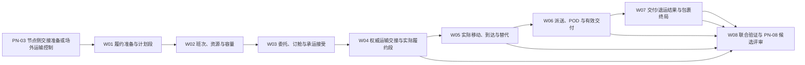

# IDP Parcel `PN-04` 运输履约与包裹终局开发交接

状态：业务机制与开发边界已确认；真实班次、容量、承运方、交接、尾程和终局参数待提供，当前生产结论为 `No-Go / 待参数化`

本文把已接受包裹从节点侧交接准备推进到常规运输履约、有效交付或其他责任结果，并把这些结果交给 `parcel-shipment` 形成包裹终局服务结果；客户在收寄前取消或收寄后请求停止服务时，由 `UC-PS-006` 形成逐包裹取消或处置决定，再由各对象所有者执行。本文只组织开发工作包、依赖和验收边界，不重新定义领域规则，也不维护第二套参数当前值。

本文不规定 API、数据库表或字段、消息 Schema、承运商协议格式、设备协议、对象存储、部署拓扑、真实客户、线路、节点、地址、账号、金额、阈值、时限或角色名单。真实实例、当前状态和证据索引只在[首发试点参数与证据登记册](../product/PILOT-PARAMETER-REGISTER.md)维护。

## 交付目标

`PN-04` 必须形成以下连续但不合并所有权的业务结果：

1. 依据当前有效路由和节点侧准备事实，形成具体运输机会、班次、资源和多维容量准备。
2. 运输委托、订舱、承运接受、容量预占、装载分配和运输单证分别形成并保留数量、范围和版本。
3. 节点与运输方按载运对象形成权威运输交接；只有已交接对象进入实际履约段和运输控制。
4. 对实际履约段分别记录实际承运商、出发、移动、到达、中断、替代和下一次交接事实；不透明外部履约保持可验证范围，不能虚构内部节点。
5. 末端派送按任务、尝试、逐对象结果和交付证明形成有效交付、失败、拒收或待确认结果。
6. `parcel-shipment` 消费有效交付、退运或其他合同责任结果，逐包裹形成独立终局服务结果；运输事实与包裹终局互不覆盖。
7. 订舱、取消、失败尝试、原旅程和替代/退运旅程分别形成运输收费发生项；`settlement-accounting` 再据此形成供应商预期成本和后续审核应付。

这些结果不得被压缩成一个“已发货”“运输中”“已签收”或“已完成”状态。`PN-04` 不拥有客户委托、路由计划、节点内作业、关务决定、客户异常案件、运营结算或资金账本，也不把监管运输处置专项用例当作常规运输主链。

## 核心边界

| 结果层 | 权威所有者 | 本切片处理 | 不得替代 |
|---|---|---|---|
| 路由计划与计划履约段 | `network-routing` | 只读引用当前有效计划、节点、时间窗口和计划段 | 不得把计划当作班次、容量或实际移动 |
| 节点侧准备与物理事实 | `node-operations` | 消费备货、点验、集运成员、封签和节点侧交出证据 | 不得由节点扫描单独形成控制转移 |
| 运输准备 | `transport-fulfillment` | 形成班次、资源、容量、委托、订舱、承运接受、分配和单证 | 不得由准备结果证明实物已接收 |
| 权威运输交接与履约事实 | `transport-fulfillment` | 逐对象形成控制转移、实际履约段和移动事实 | 不得用整批汇总吞并部分交接或未知承运商 |
| 运输收费发生项 | `transport-fulfillment` | 固定协议、原因、范围、数量/单位、时点、有效性和来源 | 不得直接形成价格、供应商预期成本、账单主张、审核应付或付款 |
| 有效交付结果 | `transport-fulfillment` | 按服务、合同和 POD 规则形成收件方控制转移 | 不得把外部状态码或消息送达自动当作交付 |
| 包裹终局服务结果 | `parcel-shipment` | 消费有效交付、退运或其他责任结果形成包裹终局 | 不得把运输完成按钮、班次关闭或单证关闭当作终局 |

班次、运输委托、订舱、容量预占、装载分配、权威交接、实际履约段、派送尝试和有效交付各自拥有生命周期。任何批量结果都只能由对象级结果派生，不能反向覆盖成员事实。

## 权威依据

| 职责 | 权威文档 | 本文如何使用 |
|---|---|---|
| 产品切片与完成边界 | [国际小包网络运营首发产品基线与开发主线](../product/PARCEL-NETWORK-FIRST-RELEASE-DEVELOPMENT-BASELINE.md) | 固定 PN-04 在产品主链中的位置和依赖 |
| 参数状态与证据责任 | [首发试点参数与证据登记册](../product/PILOT-PARAMETER-REGISTER.md) | 唯一参数台账；本文只组织依赖 |
| 验收场景与证据层级 | [首发试点验收场景矩阵](../product/PILOT-ACCEPTANCE-MATRIX.md) | 使用 `P/R/S/N/A` 组织验证，不另造证据等级 |
| 运输语言、规则与生命周期 | [运输履约上下文](../domain/transport-fulfillment/CONTEXT.md) | 唯一运输对象、事实和生命周期定义 |
| 包裹服务与终局 | [小包托运上下文](../domain/parcel-shipment/CONTEXT.md) | 统一包裹身份、服务责任和终局结果 |
| 路由计划与计划段 | [网络与路由上下文](../domain/network-routing/CONTEXT.md) | 提供当前有效执行意图，不形成实际运输 |
| 节点准备与交出事实 | [节点作业上下文](../domain/node-operations/CONTEXT.md) | 提供实物、集运、封签和节点侧证据 |
| 常规运输准备 | [`UC-TF-003`](../application/transport-fulfillment/UC-TF-003-PREPARE-TRANSPORT-OPPORTUNITY.md) | 把路由计划交给运输准备，不产生实际控制 |
| 委托、订舱与承运接受 | [`UC-TF-004`](../application/transport-fulfillment/UC-TF-004-COMMISSION-AND-ACCEPT-TRANSPORT.md) | 分层形成运输准备结果 |
| 权威交接与实际履约 | [`UC-TF-005`](../application/transport-fulfillment/UC-TF-005-ESTABLISH-HANDOVER-AND-ACTUAL-FULFILLMENT.md) | 逐对象建立控制和实际段 |
| 派送与交付证明 | [`UC-TF-006`](../application/transport-fulfillment/UC-TF-006-PERFORM-DELIVERY-AND-CAPTURE-POD.md) | 形成尝试、POD 和有效交付 |
| 替代伙伴与退运 | [`UC-TF-007`](../application/transport-fulfillment/UC-TF-007-START-ALTERNATE-OR-RETURN-JOURNEY.md) | 处理独立替代/退运旅程，不回退原事实 |
| 包裹终局交接 | [`UC-PS-004`](../application/parcel-shipment/UC-PS-004-FORM-PARCEL-FINAL-SERVICE-OUTCOME.md) | 将运输结果转为逐包裹服务终局 |
| 包裹取消与收寄后处置 | [`UC-PS-006`](../application/parcel-shipment/UC-PS-006-CANCEL-PARCEL-OR-COORDINATE-POST-INTAKE-DISPOSITION.md) | 逐包裹形成取消或处置决定；不直接执行运输动作 |
| 计划、承诺与事实分层 | [ADR-0004](../adr/0004-separate-commitment-plan-actual.md) | 禁止运输计划或预测覆盖承诺 |
| 来源事实与派生结果 | [ADR-0005](../adr/0005-source-facts-effective-events-derived-state.md) | 保留重复、迟到、冲突和更正历史 |

发生冲突时，领域上下文和应用用例定义业务语义，参数登记册只实例化规则，本文只决定工作包、依赖和交付顺序。

## 三档开发准入

| 档位 | 参数要求 | 可以交付 | 不得宣称 |
|---|---|---|---|
| 稳定骨架 | 不要求真实参数已确认，但 PN-02/03 前置对象和合同可用命名夹具表达 | 强类型对象与结果、数量守恒、逐对象交接、显式未配置、不可覆盖历史和安全续办测试 | 真实班次、真实承运接受、实际移动、尾程交付、包裹生产终局或 PN-04 已实现 |
| 配置验证 | 相关班次、容量、伙伴、交接和 POD 样本有受控证据，可使用 `R` 或 `S` | 候选解释、容量门禁、部分接受、交接冲突、外部不透明履约和交付负向分支的可重复验证 | 参数已经成为生产配置、外部伙伴行为已经稳定或真实客户流量已经准入 |
| 生产候选 | 精确分支直接依赖的参数确认或有权威不适用依据，技术门槛和同版本联合验证通过 | 提交 PN-08 评审的客户/产品/线路/履约方/尾程能力分支 | PN-04 自行批准生产流量、正式验收或把局部确认推广到其他线路 |

参数未提供只阻断依赖该参数的生产分支，不阻断稳定骨架和合格 `R/S` 验证。现有代码没有常规运输履约闭环；以下工作包是开发交接，不表示已经实现。

## 业务依赖

`W02` 至 `W05` 允许按线路和履约方式迭代：容量缩减、承运拒绝或实际中断可以触发重新分配或受控改路，但不得把已经成立的实际段回写为未开始。替代伙伴和退运必须建立新的计划/旅程关系，不覆盖原履约事实。

## 取证与开发工作包

### `PN04-W01` 常规运输履约准备与计划段交接

主责用例：[`UC-TF-003`](../application/transport-fulfillment/UC-TF-003-PREPARE-TRANSPORT-OPPORTUNITY.md)。

主要参数：`PAR-NET-08/12/14/15`、`PAR-NFR-01/02/06`；消费 `PAR-NET-01..06` 的当前有效路线/节点投影、`PAR-COM-05/06` 的服务和合同责任，以及适用的 `PAR-CUS-01..04` 限制投影。

开发交付：

- 接受当前有效路由和计划履约段，核对实际控制边界、对象范围、服务窗口、限制和剩余旅程。
- 对无当前有效路由、计划已冻结或节点准备不足分别形成待补充/待机会结果，不创建占位班次或实际段。
- 为可执行范围生成运输机会候选，保存候选、淘汰和适用规则；不把候选当作已预订资源。
- 明确场外揽收已经形成运输控制的对象与节点侧待交接对象的不同入口；不得让场外成功伪造节点到站。

验收贡献：`OPS-05` 的计划前置和 `OPS-06` 的交接范围前置，贡献 `DAT-02/03`、`NFR-02`。

### `PN04-W02` 班次、资源与多维容量

主责用例：[`UC-TF-003`](../application/transport-fulfillment/UC-TF-003-PREPARE-TRANSPORT-OPPORTUNITY.md)。

直接参数：`PAR-NET-08`、`PAR-NET-12`、`PAR-NET-14/15`、`PAR-NFR-01/02/03/06`。

开发交付：

- 区分周期安排、具体日期级班次、运输资源版本和实际使用资源；资源替换不改变班次身份。
- 按适用维度分别维护申请量、接受量、预占量、分配量、释放量和实装量，保持数量守恒，避免重复扣减。
- 物理安全/法规硬容量不可突破；商业软容量只有在版本化规则和授权范围内才允许超配并形成缺口。
- 出发前允许取消/替代并处理未消耗预占；形成首个有效出发或移动后不得把班次改写为取消。

验收贡献：`OPS-05 P`，并贡献 `DAT-02/03`、`NFR-01/02/03`。

### `PN04-W03` 运输委托、订舱与承运接受

主责用例：[`UC-TF-004`](../application/transport-fulfillment/UC-TF-004-COMMISSION-AND-ACCEPT-TRANSPORT.md)。

直接参数：`PAR-NET-08`、`PAR-NET-12`、`PAR-INT-03/07`、`PAR-COM-05/06`、`PAR-SET-03`；适用的 `PAR-CUS-01..04`、`PAR-NFR-06`。

开发交付：

- 分别形成运输委托、订舱申请/结果、承运接受和运输单证版本；部分接受、候补、拒绝、取消和失效逐范围保留。
- 保存实际采用的供应商协议、履约条件、责任角色和成本来源快照；签约方、代理商、渠道品牌和实际承运商不相互推导。
- 只有容量保障和适用授权满足时才建立/转换容量预占；接受不等于实物收寄或实际承运。
- 外部来源不确定、响应冲突或重复时保持待确认/冲突，不按最后消息覆盖。
- 对订舱、取消和已经开始的准备范围形成协议、原因、主要范围、数量/单位和来源明确的运输收费发生项；不在运输上下文形成金额。

验收贡献：`OPS-05`、`OPS-07`、`OPS-11`，以及 `SET-10` 的订舱、取消和准备收费发生事实部分；贡献 `DAT-02/03`、`NFR-02`。

### `PN04-W04` 节点与运输方权威交接、实际履约段建立

主责用例：[`UC-TF-005`](../application/transport-fulfillment/UC-TF-005-ESTABLISH-HANDOVER-AND-ACTUAL-FULFILLMENT.md)。

直接参数：`PAR-NET-08`、`PAR-NET-13/15`、`PAR-INT-03/07`、`PAR-NFR-02/04/06`；消费节点 `PAR-NET-04..06` 和适用关务动作门禁。

开发交付：

- 先保全节点侧交出、运输方接收、点验、封签和拒收证据，再按载运对象形成已交接、已拒收或待确认。
- 只有已交接对象建立实际履约段和履约参与关系；部分交接不被整批状态吞并。
- 封签连续的集运单元可形成单元控制及“随单元受控”的派生，但不能伪造成员逐件交接；封签异常时等待实际核对。
- 已成立实际履约段不得取消回未开始；运输控制只能通过下一次权威交接、有效交付或明确控制终止结束。

验收贡献：`OPS-06 P`、`OPS-07 P`，贡献 `DAT-01..03`、`NFR-02/03`。

### `PN04-W05` 实际承运商、移动、到达与受控替代

主责用例：[`UC-TF-005`](../application/transport-fulfillment/UC-TF-005-ESTABLISH-HANDOVER-AND-ACTUAL-FULFILLMENT.md)；需要替代/退运时接续 [`UC-TF-007`](../application/transport-fulfillment/UC-TF-007-START-ALTERNATE-OR-RETURN-JOURNEY.md)。

直接参数：`PAR-NET-08/10/11/14/15`、`PAR-INT-03/07`、`PAR-NFR-02/04/06`。

开发交付：

- 分别记录实际承运商判断、出发、移动、到达、资源故障、中断、改降、折返和控制责任变化；外部伙伴内部不可验证时保持不透明范围。
- 备用伙伴只提供候选和影响依据，由授权角色明确决定；原履约段、原承运接受、原成本和已发生事实继续保留。
- 退运或替代围绕新的服务目的建立独立路由、计划履约段和实际履约过程，不倒退原旅程或原包裹结果。
- 原旅程订舱、取消、尝试和履约发生项与替代/退运新旅程发生项分别关联；结算必须能同时形成两边预期成本，不能用新旅程覆盖原旅程。
- 无有效交接、控制终止或交付依据时，停运、失联或异常案件本身不消灭当前运输方责任。

验收贡献：`OPS-07`、`OPS-09 S/P`、`OPS-10 S/P`，以及 `SET-10` 的原旅程、替代/退运旅程收费发生事实部分；贡献 `DAT-02/03`、`NFR-02/03`。

### `PN04-W06` 派送任务、尝试、POD 与有效交付

主责用例：[`UC-TF-006`](../application/transport-fulfillment/UC-TF-006-PERFORM-DELIVERY-AND-CAPTURE-POD.md)。

直接参数：`PAR-NET-09/15`、`PAR-NET-14`、`PAR-INT-03/07`、`PAR-COM-05/06`、`PAR-NFR-02/04/06`。

开发交付：

- 分离末端派送任务和每次履约尝试；每个包裹分别记录成功、失败、拒收、地址问题、无人和待确认结果。
- 有效交付必须满足服务产品、客户合同、交付方式和 POD 规则，并关联对象、尝试、业务时间、地点、接收方和证据集合。
- 安全投放、智能柜、邻居代收、本人签收等方式按适用规则判断，不统一推导；外部 `DELIVERED` 状态码不能单独形成交付。
- 失败或拒收不自动转为签收、退运或服务终止；重派建立新尝试，控制责任保持清晰。
- 每次实际派送尝试分别保留运输收费发生项；后续成功、重派或退运不能删除原失败尝试，金额由结算按供应商协议判断。

验收贡献：`OPS-08 P`，以及 `SET-10` 的派送尝试收费发生事实部分；贡献 `DAT-01..03`、`NFR-02/03`。

### `PN04-W07` 有效交付/退运等责任结果与包裹终局

主责用例：[`UC-PS-004`](../application/parcel-shipment/UC-PS-004-FORM-PARCEL-FINAL-SERVICE-OUTCOME.md)；客户请求取消或停止服务先由 [`UC-PS-006`](../application/parcel-shipment/UC-PS-006-CANCEL-PARCEL-OR-COORDINATE-POST-INTAKE-DISPOSITION.md) 逐包裹决定，退运执行接续 [`UC-TF-007`](../application/transport-fulfillment/UC-TF-007-START-ALTERNATE-OR-RETURN-JOURNEY.md)。

直接参数：`PAR-COM-05/06/17` 的服务终局规则、`PAR-NET-09/11/15`、`PAR-NET-10`（适用时）、`PAR-INT-03/07`、`PAR-NFR-06`。

开发交付：

- `parcel-shipment` 逐包裹消费运输履约提供的有效交付、退运完成、服务终止或其他合同责任结果，并形成当前终局服务结果。
- 未越过取消边界的包裹由 `UC-PS-006` 形成取消终局；已经有效收寄的包裹只形成收寄后处置决定和范围化请求，不能取消回未收寄，也不能把请求接受写成执行完成。
- 有效交付结果与包裹终局分别保存；运输段关闭、班次完成、POD 上传或通知送达不得单独触发包裹终局。
- 退运、替代履约和拒收处置保留原旅程与新旅程关系；原运输事实、原交付判断和客户承诺不得倒退。
- 结果更正、POD 失效或迟到事实形成新判断版本，重新派生当前结果但不删除原证据和历史。

验收贡献：`OPS-08` 的包裹终局部分、`OPS-09/10` 的责任结果接续、`CPS-05` 的后续实际事实接口，以及 `CPS-12` 的取消/处置到终局部分；贡献 `DAT-02/03`。

### `PN04-W08` 同版本联合验证与 PN-08 候选评审

主责场景：`OPS-05..11`、`OPS-13`（适用时）、`CPS-05` 后续履约部分、`CPS-12`、`SET-10`，以及 `DAT-01..03`、`NFR-01..03`、`GOV-02..07/09/10`。

必须完成：

- 使用同一客户、法人、产品、合同、线路、节点、履约方、班次、容量、尾程规则和有效区间验证公共工作包；不把监管专项样本冒充常规运输主链。
- 以对象级关系证明计划、准备、承运接受、交接、实际移动、派送、POD 和终局分别存在；部分成功、拒收、待确认和迟到事实不被批次汇总吞并。
- 证明硬容量未被突破，软超配有版本化授权，申请/接受/预占/分配/实装/释放数量可守恒；班次开始后不以取消掩盖中断。
- 证明签约方、代理商、渠道品牌和实际承运商不互相推导；外部不透明履约只形成已知范围和可接受里程碑。
- 证明有效交付必须满足适用 POD 规则；失败、拒收和待确认不自动触发终局或退运。
- 证明备用伙伴和退运建立显式新计划/新旅程，原事实、原责任和原承诺继续可追溯。
- 证明订舱、取消、失败尝试及原/新旅程各自形成运输收费发生项，并由 PN-07 形成供应商预期成本；运输履约不直接创建金额或应付。
- 证明运输结果交给 `parcel-shipment` 后形成包裹终局，但运输履约不修改包裹身份、客户承诺或结算金额。
- 固定参数版本、执行记录、偏差、技术门槛和分支结论后，只提交 PN-08 评审，不自行批准真实流量。

## 验收映射

| 工作包 | 主要业务结果 | 主要验收场景 | PN-04 能否单独闭合 |
|---|---|---|---|
| `W01` | 计划段到运输机会的准备范围 | `OPS-05` 前置、`OPS-06` 前置 | 只闭合运输准备入口 |
| `W02` | 班次、资源、容量与装载分层 | `OPS-05` | 可闭合容量和班次范围，不闭合实际履约 |
| `W03` | 委托、订舱、承运接受、单证和准备收费发生项 | `OPS-05/07/11`、`SET-10` 的发生事实部分 | 可闭合运输准备和发生事实，不闭合控制转移或金额 |
| `W04` | 权威交接、实际承运和实际段起点 | `OPS-06/07` | 可闭合交接起点，不闭合交付 |
| `W05` | 出发、移动、到达、替代/退运旅程及各旅程发生项 | `OPS-07/09/10/11`、`SET-10` 的原/替代旅程事实部分 | 可闭合运输事实范围，不闭合包裹终局或金额 |
| `W06` | 派送尝试、POD、有效交付和尝试发生项 | `OPS-08`、`SET-10` 的尝试事实部分 | 可闭合运输交付结果，不闭合包裹服务终局或金额 |
| `W07` | 取消/收寄后处置及交付/退运等结果到包裹终局 | `OPS-08`、`CPS-05/12` | 可闭合逐包裹服务决定和终局解释范围 |
| `W08` | 同版本联合证据与候选结论 | `CPS-12`、`OPS-05..11/13`、`SET-10`、`DAT/NFR/GOV` | 否；总体证明和阶段决定属于 PN-08 |

`OPS-13` 只有在真实关务运输协作自然发生或获准使用 `R/S` 验证时纳入 PN-04 联合验证；它不能替代 `W01..W07` 的常规运输证据。未纳入真实退运或备用切换时，按矩阵登记 `S` 或有依据的 `N/A`，不制造真实外部指令、金额或责任事实。

## 首批参数取证

第一批只提交解除 PN-04 直接阻断所需的五组证据，不要求一次填完全部首发参数：

1. 运输运营与商业责任方提交 `PAR-NET-08/09/10/11/12/15`、`PAR-COM-17` 和 `PAR-SET-03` 的主履约方、班次、资源、容量维度、尾程交付、交接/控制、备用/退运路径、终局规则、供应商协议、收费发生条件、结算责任和有效区间证据。
2. 网络规划与节点运营提交 `PAR-NET-14` 及 `PAR-NET-04..06` 的计划履约段、节点侧交出、集运封签、交接边界和复核/改路证据。
3. 伙伴接入与技术责任方提交适用 `PAR-INT-03/07` 的外部履约、委托/订舱/承运接受、承运商身份、实际承运、交接、POD、单证和更正来源证据；不把接口连通当作事实准入。
4. 商业与托运责任方提交 `PAR-COM-05/06/17` 的服务产品、合同交付责任、终局结果类型、退运/其他责任边界和客户可见责任证据；`parcel-shipment` 只保存本次采用快照并独立形成终局。
5. 运营与技术责任方提交 `PAR-NFR-01/02/03/04/06` 的真实观察期、班次/容量规模、集运和履约事件放大、交付处理与恢复目标。

关务责任方只提供适用动作的当前限制和运输门禁最小投影；常规运输主链不要求 PN-04 提前完成完整关务案件、申报或监管舱单闭环。所有证据只在登记册中保存受控索引，不把真实内容复制进仓库。

## 完成定义

一个精确 PN-04 能力分支只有同时满足以下条件，才能标记为“已通过 W08 联合验证并可提交 PN-08 生产候选评审”：

1. PN-02 已形成同一范围合法接受、包裹身份、接受基线和预计承诺；PN-03 已形成适用的有效网络收寄、节点侧交接准备或场外运输控制。
2. 当前有效路由、计划履约段、服务窗口和适用限制可验证；无路由、待机会、不可达和技术未形成具有不同结果，不创建占位班次或默认承运方。
3. 班次、资源、容量池、运输委托、订舱、承运接受、预占、分配、实装、释放和单证均按各自身份、对象范围、版本和数量守恒保存；订舱、取消和已经发生的范围形成可追溯运输收费发生项，但不在本切片定价。
4. 硬容量和硬门禁不可突破；软超配或替代必须有版本化规则、授权、影响范围和新关系，不能静默切换供应商。
5. 节点侧证据与权威交接分离；仅对已交接对象建立实际履约段和实际承运关系，部分交接、封签异常和承运商未知均可安全保留。
6. 实际履约段保存出发、移动、到达、中断、折返、控制变化和下一次交接事实；开始运输后不得取消回未开始，停运或异常不自动消灭控制责任。
7. 派送任务、每次尝试、逐对象结果、POD、有效交付和控制转移分别成立；失败、拒收、证据不足和待确认不自动等于交付、退运或服务终止。
8. 退运或替代履约建立独立旅程、计划和实际段；原路线、原承诺、原运输、原交接和原交付历史继续保留，原旅程与新旅程发生项分别交给结算形成预期成本。
9. `parcel-shipment` 在取消边界前逐包裹形成取消终局，边界后只形成收寄后处置决定；它只依据有效交付、退运完成或合同约定的其他责任结果形成逐包裹终局服务结果，运输履约不直接设置包裹终局、取消或客户承诺。
10. 运输事实、运输收费发生项、供应商预期成本、包裹终局、追踪投影、异常案件和结算结果分别可追溯；更正、迟到、冲突和发布失败不会删除原事实或重复外部动作。
11. `PAR-COM-17`、`PAR-NET-08/09/12/15`、`PAR-SET-03`、`PAR-INT-07` 和适用 `PAR-INT-03` 已为同一客户/法人/产品/合同/线路/履约方范围确认；`CPS-12` 的取消/收寄并发与收寄后处置至少完成 `S`，`SET-10` 完成真实正常发生项与隔离异常分支。备用或退运分支还分别满足 `PAR-NET-10/11`，并完成 `P/R/S/N/A` 证据、技术门槛和恢复盘点。

未满足以上条件时，团队可以继续稳定骨架和合格 `R/S` 验证，但不得宣布 PN-04 已实现、锚点线路具备生产运输/交付能力或包裹终局已闭环。即使全部满足，影子、限量生产、在途盘点和正式阶段 `Go/No-Go` 仍由 PN-08 形成。
