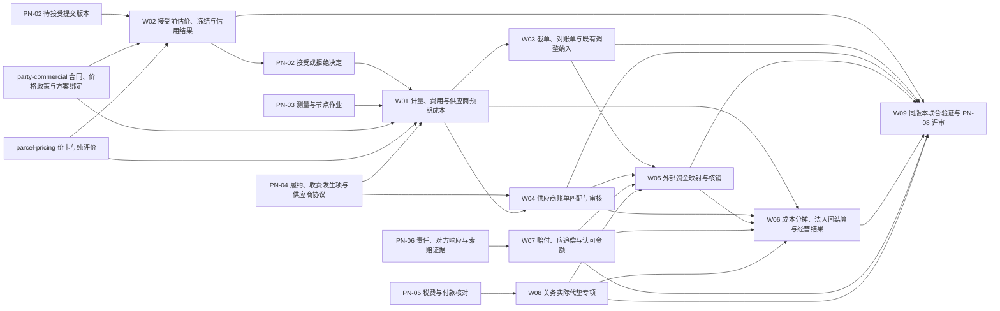

# IDP Parcel `PN-07` 运营结算与经营核算开发交接

状态：通用业务编排与开发边界已形成；真实合同、价格、结算账户、账期、供应商账单、财务交换和经营口径参数待提供，当前生产结论为 `No-Go / 待参数化`

本文把已接受的小包业务事实、`party-commercial` 的商业价格依据和 `parcel-pricing` 的纯计价评价组织成客户应收、供应商审核应付、对账、外部收付款映射、成本分摊和经营结果，并保留关务实际代垫专项的独立边界。本文不建设银行账、法定税务账、总账、独立计价平台或完整 ERP，也不规定 API、数据库表、消息 Schema、部署或真实实例参数。

真实客户、合同、价格、账户、伙伴、账期、币种和证据索引只在[首发试点参数与证据登记册](../product/PILOT-PARAMETER-REGISTER.md)维护；本文不把待提供信息写成默认配置。

## 交付目标

`PN-07` 必须形成以下相互关联但不互相覆盖的业务结果：

1. 依据有效测量、客户/供应商商业依据和 `parcel-pricing` 的 SELL/BUY `PricingEvaluation`，分别形成客户/供应商计费重量的财务采用、计算展开、客户费用与供应商预期成本；运输履约的订舱、取消、失败尝试及原/替代旅程收费发生项仍是成本来源事实，不自带金额。
2. 对客户费用和供应商预期成本分别维护预估、暂估、确认与追加版本；计价纠错、商业让利、供应商账单贷项、赔付/追偿调整由各自唯一创建用例形成。
3. 在合同要求时形成接受前估价、资金冻结、信用暴露、转扣费或显式释放；这些结果不替代委托接受决定。
4. 按结算归属日和账户截单形成不可覆盖的客户对账单；争议只指向明确金额范围，迟到事实先由金额所有者形成调整，`UC-SA-003` 只把既有调整纳入后续账期。
5. 接收供应商账单主张，与内部预期成本按金额范围匹配并形成部分审核、争议、拒绝或审核应付。
6. 外部系统继续拥有真实收付款事实；本产品内只有 `UC-SA-005` 可以采用这些事实并形成运营映射、余额、未分配金额、部分/完整核销及核销撤销关系。
7. 对共享成本形成守恒的分摊、未分摊余额和经营毛利/损失派生结果；预估毛利成对消费当前有效客户预估费用与当前有效供应商预期成本，确认与结算口径采用各自明确的运营应收、审核应付和核销分配范围，法人间债权债务不被成本分摊替代。
8. 依据 `UC-VE-007` 的责任结论和对方响应，分别形成客户赔付义务、应追偿金额和追偿认可金额；真实赔付付款、追偿到账和运营核销仍由 `UC-SA-005` 处理，各结果不得压缩为净责任。
9. 由 `UC-SA-001` 独立处理关务实际代垫成立判断和客户代垫回收；它不能替代普通运费结算主链。

以上结果不得压缩成一个“已结算”“已付款”“已收款”或“已盈利”状态。客户运营应收、供应商审核应付、实际收付款、法定会计结果和 COD 代收本金分别由各自责任方拥有。

## 核心边界

| 结果 | 权威所有者 | `PN-07` 处理 | 不得替代 |
|---|---|---|---|
| 商业合同、价格政策、方向授权、定价方案绑定、结算政策和调整授权 | `party-commercial` | 引用实际适用版本并保存采用快照 | 不在结算或计价中创建或修改商业规则 |
| 可执行价卡、费率表、计价策略、版本清单和纯价格评价 | `parcel-pricing` | 消费评价并保存费用采用、责任和结算展开 | 不把评价直接当应收应付，不在结算中重算或发布价卡 |
| 原始测量、节点作业、履约与运输收费发生项 | `node-operations` / `transport-fulfillment` | 消费已接受事实形成计费依据和供应商预期成本 | 不回写测量、扫描、交接、运输或收费发生事实 |
| 费用、客户运营应收和结算账户 | `settlement-accounting` | 拥有费用明细、账户、余额、对账和调整 | 不等同法定会计应收或银行余额 |
| 供应商账单与审核应付 | `settlement-accounting` | 接收主张、匹配范围、审核和贷项 | 不把账单到达自动解释为应付或已付款 |
| 外部收付款与税务事实 | 财务、银行、支付或税务系统 | 仅由 `UC-SA-005` 在本产品内采用并形成运营映射、核销及撤销 | 不创建、撤销或更正外部资金/法定税务事实；其他用例不得冒充到账或付款 |
| 关务税费与监管决定 | `customs-compliance` | 向 `UC-SA-001` 提供结算输入 | 不形成税费核定、放行或监管案件结果 |
| 客户索赔、追偿事项、对方响应和责任结论 | `visibility-exception` | 向 `UC-SA-007` 提供当前有效责任与认可范围依据 | 不形成赔付、追偿金额、到账或核销 |
| 客户赔付、应追偿与追偿认可金额 | `settlement-accounting` | 由 `UC-SA-007` 分别计算和追加调整 | 不把客户赔付记为客户应收，不把应追偿或认可冒充到账 |
| COD 本金与清分 | `collection-remittance` | 首发不适用；仅保留边界 | 不把代收本金塞入普通余额或运费收入 |

同一费用只能有一个主要计费范围；来源对象、分析维度和结算账户不能通过报表筛选临时推断。客户账户负责业务隔离，结算账户负责金额责任、余额和核销，两者不能合并。

## 权威依据与依赖

| 职责 | 权威文档 | 本交接如何使用 |
|---|---|---|
| 领域语言、规则和生命周期 | [结算与经营核算上下文](../domain/settlement-accounting/CONTEXT.md) | 唯一的费用、账户、对账、核销、分摊和经营结果定义 |
| 小包价卡与纯计价 | [小包计价上下文](../domain/parcel-pricing/CONTEXT.md) | 唯一的可执行价卡、版本清单、纯评价、解释和回放定义 |
| 跨上下文所有权 | [领域上下文地图](../domain/CONTEXT-MAP.md) | 固定来源事实、商业规则、结算结果和外部财务边界 |
| 计价上下文决策 | [ADR-0012](../adr/0012-parcel-pricing-context-within-idp-parcel.md) | 固定 PC → PP → SA 三层边界，并禁止复制独立计费/账务平台 |
| 运营结算与法定财务分离 | [ADR-0007](../adr/0007-separate-operational-settlement-from-statutory-finance.md) | 固定外部资金、税务、总账和运营分户账的责任边界 |
| 来源/有效/派生分层 | [ADR-0005](../adr/0005-source-facts-effective-events-derived-state.md) | 约束迟到、更正、撤销和派生结果不可覆盖 |
| 试点范围与 COD 排除 | [首发试点范围](../product/PILOT-SCOPE.md) | 固定一个客户模式、一个结算币种、一个真实账期，COD 为 `N/A` |
| 验收证据 | [首发试点验收场景矩阵](../product/PILOT-ACCEPTANCE-MATRIX.md) | 使用 `SET-01..11` 和 `P/R/S/N/A`，不另造证据等级 |
| 实例参数 | [首发试点参数与证据登记册](../product/PILOT-PARAMETER-REGISTER.md) | 唯一状态台账；本文只声明依赖和阻断 |
| 关务代垫专项 | [`UC-SA-001`](../application/settlement-accounting/UC-SA-001-ASSESS-ACTUAL-ADVANCE-AND-FORM-CUSTOMER-RECOVERY.md) | 只处理实际代垫与客户回收，不替代通用结算 |

发生冲突时，以领域上下文和已接受 ADR 为准；参数登记册只实例化已确认规则；本文件只组织开发工作包和联合验证顺序。

## 三档开发准入

| 档位 | 最低条件 | 可以交付 | 不得宣称 |
|---|---|---|---|
| 稳定骨架 | 可用命名夹具表达合同、测量、履约、账单和外部资金引用；不要求真实值 | 费用计算展开、追加式生命周期、账户隔离、部分匹配、未分配和显式未配置分支 | 真实价格、真实账期、真实收付款或生产毛利已经成立 |
| 配置验证 | 相关合同、账单、财务交换和分摊样本有隔离的 `R/S` 证据 | 规则组合、重量差异、冻结释放、账单差异、核销歧义和分摊守恒可重复验证 | 参数已成为生产配置，或模拟金额已经发送到外部系统 |
| 生产候选 | `PAR-SET-01..05`、`PAR-SET-09/10`、`PAR-COM-08..10/15`、`PAR-INT-04/05`、`PAR-NFR-06` 已确认；`PAR-SET-06..08` 按适用性已确认或登记权威 `N/A`；`PAR-VIS-08` 已确认到足以完成隔离索赔/追偿与责任复核，且 `VIS-09/SET-11 S` 已完成；真实赔付/追偿分支另须确认当前有效的 `PAR-COM-06/07` 和 `PAR-VIS-08` 真实实例参数；同一真实账期联合验证通过 | 向 PN-08 提交一个客户、一个币种和一个账期的候选分支 | 自行批准生产流量、替外部财务系统确认付款或把局部证据推广到其他客户/币种 |

参数未提供只阻断依赖该参数的生产分支，不阻断稳定骨架和合格 `R/S` 验证；但没有真实历史来源时，合成夹具只能形成隔离 `S`，不能形成 `R`。当前代码尚无完整通用结算实现；以下是开发交接，不表示能力已经上线。

## 业务依赖

流程图表达业务依赖，不表示分布式事务或技术调用顺序。每个工作包都必须保留自己的决定、版本和失败边界。

## 开发工作包

### `PN07-W01` 计量、组合计价、费用与供应商预期成本

主责用例：[`UC-SA-002`](../application/settlement-accounting/UC-SA-002-CALCULATE-CONFIRM-AND-ADJUST-OPERATIONAL-CHARGES.md)。

主要依赖：`PAR-SET-02/03/04`、`PAR-COM-09/10`、`parcel-pricing` 的已发布价卡/版本清单和纯评价，以及 `node-operations` 的当前有效实测、`parcel-shipment` 的面单/包裹和 `transport-fulfillment` 的实际履约事实与运输收费发生项；周期费用/人工调整仅在 `PAR-SET-07` 适用时启用，只有某费用确认条件明确依赖包裹终局时才消费 `PAR-COM-17`。

开发交付：

- `parcel-pricing` 保存输入快照并分别形成 SELL/BUY 评价、计价重量、价卡命中、费用行、版本清单和解释；结算保存客户/供应商计费重量的财务采用，不覆盖原始测量或评价。
- 商业价格政策、可执行价卡版本、`PricingEvaluation`、费用项目、结算计算展开和费用明细分别存在；预估、暂估、确认和调整采用追加式生命周期。
- 消费订舱、取消、失败尝试以及原旅程和替代、改送或退运旅程的运输收费发生项，按采购规则分别形成供应商预期成本；发生项不是金额、账单主张或审核应付，后续旅程成功不能覆盖原旅程成本。
- 主要计费范围只能有一个；周期最低消费、保底量和返利保留账户周期范围，向包裹分摊只作为分析结果。
- 对迟到测量、源事实或运输收费发生项更正只形成计价纠错；有效商业授权只形成商业让利。渠道退款不自动产生客户退款，供应商账单贷项由 W04 形成，任何调整都不删除原费用、预期成本或来源事实。

验收贡献：`SET-01/08/10`，并为 `SET-03` 提供冻结和最终费用输入，为 `SET-04/05` 提供可追溯的供应商预期成本。

### `PN07-S01` 无真实价卡阶段的纯计价合成验证

本工作包只用于在没有真实客户、供应商协议和价卡时验证 `parcel-pricing` 的业务语义。它不改变 `PAR-SET-02/03` 的当前状态，不形成真实费用、应收、应付、账单、付款或生产准入，也不新增独立计价平台。

`PP-S03` 的具体夹具、验收映射和开发停止条件见[证据与合成契约开发交接](./pp-s03-par-set-02-03-evidence-and-synthetic-contract.md)。本节只保留 PN-07 的工作包边界；费用项目映射仍由 `settlement-accounting` 唯一拥有。

#### 首期计价实现边界

首期只实现能够支撑 `PN07-W01/W02` 的最小纯评价能力：

- 包裹级 `PER_PACKAGE` 评价；每次评价固定租户、业务范围、价格方向、计算目的、业务时点、输入快照和完整版本清单。
- `SELL` 与 `BUY` 独立价卡；`INTERNAL` 只保留领域语义，只有 `PAR-SET-06` 证明法人间价格时才进入生产。
- 实重、一个经证据支持的尺寸/体积重策略、明确的计价重量选择和取整顺序。
- 首发主价表族分两种情形决定：有真实锚点客户时由真实 `PAR-SET-02/03` 决定；尚无客户时由[开发主线的能力范围判据](../product/PARCEL-NETWORK-FIRST-RELEASE-DEVELOPMENT-BASELINE.md)决定，不由手上任何一张样卡默认顶替。`docs/reference` 下那张美线 UPS-Ground 同行价卡是**结构参考与演示夹具**：其金额保真度已被[小包计价上下文](../domain/parcel-pricing/CONTEXT.md)的源完整性门禁降为只作结构来源，源身份也只有断言强度，因此它不构成主价表族依据。真实参数出现前仍只用合成夹具验证代表性骨架，不把任何族变成生产默认。
- 基础价、固定附加费以及真实价卡确有要求时的百分比费用或折扣；组合基数、顺序、精度和 `ADD/DEDUCT` 方向必须可解释。
- 纯 `PricingEvaluation`、版本清单、命中行、计价重量、解释、内容完整性检查和原版本回放。

以下能力不进入首期运行时，除非真实参数明确证明其必要性：票级或周期聚合、最低/封顶/多层燃油、复杂多币种换算、`COST_PLUS`/`TARGET_MARGIN`、Quote/锁价、任意脚本或自定义函数、批量导入、供应商账单和账务对象。账单、费用、应收应付、对账和核销继续由 `settlement-accounting` 负责。

**「其他价表族」已移出上述清单。** 原因是首发已确认多供应商比价择优（见[首发试点范围](../product/PILOT-SCOPE.md)与 `PAR-NET-16`），而真实候选集合跨族——「要比价」与「只给一族」不可能同时成立，本行原文与产品范围直接冲突。首重加续重与计费重乘单价按[计价规则模型最终设计](./pp-pricing-rule-model-final-design.md)进入产品就绪里程碑。**进入运行时不等于获准激活**：生产激活仍须真实价卡证据，见 `PAR-SET-03`。

#### 合成夹具与既有验收场景

| 夹具 | 覆盖内容 | 复用验收场景 |
|---|---|---|
| `SYN-PRC-SELL-01` | 合成客户/合同范围、SELL 基础价、附加费、折扣、取整和币种；费用代码只作为下游映射输入，不创建费用项目 | `AT-SA-035`、`AT-SA-040`、`AT-SA-174` |
| `SYN-PRC-BUY-01` | 合成供应商协议、BUY 价卡、订舱/取消/失败尝试/实际履约发生条件，以及原旅程与替代旅程分离 | `AT-SA-161..164` |
| `SYN-PRC-GOV-01` | BUY/SELL 隔离、区间重叠、缺版本、缺币种、缺费用映射交接、依赖冲突和确定性回放 | `AT-PC-035`、`AT-SA-036`、`AT-SA-039`、`AT-SA-050`、`AT-SA-173`、`AT-SA-174` |
| `SYN-PRC-COR-01` | 仅 SELL 或仅 BUY 更正时追加对应计价纠错，不覆盖另一方向或历史评价 | `AT-SA-053`、`AT-SA-054` |

每次执行记录至少保存夹具版本、规则/价卡版本、输入快照、适用时点、方向、预期与实际展开、结果或待判断/冲突原因、回放哈希、执行/复核方、隔离端点和证据索引。全部记录标记为 `S`；不能把参考设计的合成重放标记为 `R`。

#### 从合成验证进入真实候选

1. **真实参数核验**：取得客户合同、供应商协议、责任法人、服务/线路范围、方向、币种、有效期、价卡绑定、源文件身份和哈希；完成区间、单位、组合、税务和费用项目映射校验，并由责任方交叉复核。此时 `PAR-SET-02/03` 可从 `待提供` 进入 `待核验`，但合成 `S` 记录保持原等级。
2. **生产候选准入**：正常客户 SELL 主链取得 `SET-01` 的 `P`，正常运输收费发生项到 BUY 预期成本取得 `SET-10` 的 `P+S`，并完成同一真实账期及 PN-08 评审。取消、失败尝试或替代旅程未自然发生时可以保留 `S`，但不能用 `S` 替代正常主链的 `P`。

PN-07 只提交证据和候选结论，不能把合成验证升级为生产，也不能自行作出 PN-08 的 `Go` 决定。

### `PN07-W02` 接受前估价、资金冻结与信用控制

主责用例：[`UC-SA-002`](../application/settlement-accounting/UC-SA-002-CALCULATE-CONFIRM-AND-ADJUST-OPERATIONAL-CHARGES.md) 的财务控制分支。

直接依赖：`PAR-COM-08`、`PAR-COM-15`、`PAR-SET-01/02` 和可用于估价目的的 SELL `PricingEvaluation`。商业明确无控制时保存不适用依据；存在组合控制时分别返回估价、冻结、信用暴露和业务限制结果。

开发交付：

- 冻结只占用明确结算账户金额并关联提交版本/业务范围，不等于费用确认、客户收款或委托接受。
- 接受失败、拒绝、放弃或依据失效时按原关联显式释放；接受已经成立但事件投递失败时不得释放合法冻结。
- 最终确认费用超过冻结时完整入账，差额形成欠款或限制依据；不得截断费用或回滚已发生服务。

验收贡献：`SET-03`、`CPS-01/03` 的财务控制部分。

### `PN07-W03` 客户截单、对账单、争议与既有调整纳入

主责用例：[`UC-SA-003`](../application/settlement-accounting/UC-SA-003-CUT-OFF-PUBLISH-AND-RECONCILE-CUSTOMER-STATEMENT.md)。

主要依赖：`PAR-SET-01/09`、`PAR-COM-08..10`、已确认费用和调整。

开发交付：

- 按费用类型的结算归属日、账户时区和截单时刻形成不可覆盖快照；草稿可重算，已发布对账单不得覆盖。
- 对账单总额、费用范围、未税/税额/含税关系严格勾稽；单据、对账和结清是三个独立维度。
- 争议只锁定明确金额范围，无争议部分继续处理；争议接受只请求金额所有者复核，不能由 W03 创建借项或贷项。
- 截单后的迟到事实先交给对应唯一创建用例形成金额调整；W03 只校验既有调整身份和有效性，将其纳入后续账期并关联原周期。

验收贡献：`SET-02`、`SET-08`。

### `PN07-W04` 供应商账单与预期成本匹配、审核应付

主责用例：[`UC-SA-004`](../application/settlement-accounting/UC-SA-004-RECEIVE-MATCH-AND-AUDIT-SUPPLIER-BILL.md)。

主要依赖：`PAR-SET-01/03/04/05`、`PAR-INT-04`、`transport-fulfillment` 的履约/供应商协议快照，以及 W01 已形成并引用 BUY `PricingEvaluation` 的供应商预期成本。

开发交付：

- 预期成本、BUY 评价、供应商账单主张和审核应付分别记录；账单到达不自动形成应付，也不修改原评价或物理测量。
- 支持按金额范围的一对多、多对一、部分匹配和未匹配；无争议范围可先审核，争议范围独立保留。
- 供应商更正、贷项和迟到主张形成追加记录；需要承运商认定重算时由 `parcel-pricing` 形成新的输入快照/评价，再由本工作包匹配。供应商费用贷项保存稳定身份、借贷方向和原应付关系，并与审核应付分别发布给下游，不能静默净入应付；真实付款仍由外部财务系统拥有。

验收贡献：`SET-04`。

### `PN07-W05` 外部收付款映射、运营余额与核销

主责用例：[`UC-SA-005`](../application/settlement-accounting/UC-SA-005-MAP-EXTERNAL-FUNDS-AND-APPLY-SETTLEMENT.md)。

主要依赖：`PAR-INT-05`、`PAR-SET-01/03/04/05/09` 和外部财务系统交换边界。

开发交付：

- 财务、银行或支付系统拥有真实资金事实；`UC-SA-005` 是本产品内采用真实收付、形成运营映射、核销、核销撤销和重分配的唯一所有者，不创建支付指令或银行事实。
- 先使用付款方明确指定的范围，再按责任法人、账户、币种、金额和账期顺序匹配；有歧义时保持未分配。
- 支持一对多、多对一和部分核销；撤销形成反向关系，恢复未结金额但不删除原核销。
- 供应商净付款使用费用贷项时，必须分别形成指向审核应付和贷项的带方向核销分配，合计等于真实付款；只有金额相等而缺少贷项关系、有效性或允许抵销依据时保持未分配，不得自动结清。
- 客户赔付付款和追偿真实到账只能在此映射到对应应付或应收；资金变化不创建或改写费用、赔付、应追偿或追偿认可金额。
- 运营余额区分入账、冻结、未结和可用，不等于银行余额或 COD 本金。

验收贡献：`SET-02`、`SET-06`，消费 `SET-04` 已形成的审核应付与供应商费用贷项，为 `SET-05` 提供供应商贷项核销分配证据，并消费 `SET-09` 的专项结果。

### `PN07-W06` 共享成本、法人间结算与经营结果

主责用例：[`UC-SA-006`](../application/settlement-accounting/UC-SA-006-ALLOCATE-COSTS-AND-DERIVE-OPERATING-RESULTS.md)。

主要依赖：`PAR-SET-01/03/04/05/06/10`、适用内部协议、`UC-SA-002` 的当前有效客户预估费用、客户运营应收与供应商预期成本、`UC-SA-004` 的审核应付、供应商费用贷项及其原应付关系、`UC-SA-005` 的核销分配结果和 `UC-SA-007` 的赔付/追偿金额；`visibility-exception` 只提供责任与证据关系，不直接提供最终金额。

开发交付：

- 共享班次、集运、节点和网络成本按版本化分摊规则形成包裹/客户/产品/线路分析结果；来源金额守恒。
- 无合格分母时保留未分摊余额；有分母时尾差按稳定规则承接并保留理论/实际金额。
- 多法人服务形成内部应收与内部应付，并分别固定与责任法人、结算相对方、收付方向、币种和结算政策一致的方向结算账户；缺失或冲突时不得形成无账户金额，且不能用成本分摊替代；集团抵销由财务系统完成。
- 预估毛利必须成对消费当前有效客户预估费用与当前有效供应商预期成本；供应商账单尚未到达时不得把外部成本默认为零，也不得用审核应付冒充预估口径。
- 已确认毛利成对消费当前有效客户运营应收，以及当前有效审核应付和关联供应商费用贷项；应付与贷项按身份、有效性和借贷方向各计入一次，不把审核应付解释为已净含贷项。已结算毛利只消费 `UC-SA-005` 分别指向客户运营应收、审核应付和贷项的运营核销分配，净付款或资金映射本身不能替代。索赔调整后口径必须声明依附的预估、确认或结算基础；各口径按版本、币种和截至时点派生，迟到费用形成新版本。

验收贡献：`SET-05/11`，并为 `E2E-01/02` 提供经营结果解释。

### `PN07-W07` 客户赔付、应追偿与追偿认可金额

主责用例：[`UC-SA-007`](../application/settlement-accounting/UC-SA-007-SETTLE-CLAIMS-AND-RECOVERY-AMOUNTS.md)。

主要依赖：`PAR-VIS-08`、客户侧 `PAR-COM-06/07`、供应商/保险侧 `PAR-SET-03`、`PAR-SET-01/04`、适用 `PAR-SET-07`，以及 `UC-VE-007` 的当前责任结论、对方响应和金额范围；`PAR-SET-10` 只决定这些金额如何进入经营结果口径，不决定赔付/追偿责任或金额。

开发交付：

- 客户索赔资格/责任由 `visibility-exception` 拥有；W07 形成的客户赔付是运营企业对客户的应付、贷记或退款义务，不是客户应收，也不表示已经付款。
- 应追偿金额表达运营企业对供应商、实际承运商或保险方有权主张的应收；只有 VE 的有效对方响应或责任结论明确接受全部或部分责任时，才另行形成追偿认可金额。
- 客户赔付不等待追偿；应追偿、追偿认可、真实到账和运营核销分别存在。真实赔付付款和追偿到账只由 W05 映射与核销，任何一步都不得笼统称为“追偿成功”或净额冲抵客户赔付。
- 首发未纳入或未自然发生时使用隔离 `S`，不得制造真实赔付、追偿、运营应收/应付或资金事实。

验收贡献：`VIS-09` 的结算金额部分、`SET-05/08/11` 的赔付追偿组成和责任复核差额。

### `PN07-W08` 关务实际代垫与客户代垫回收

主责用例：[`UC-SA-001`](../application/settlement-accounting/UC-SA-001-ASSESS-ACTUAL-ADVANCE-AND-FORM-CUSTOMER-RECOVERY.md)。

仅在锚点程序存在适用税费且 `PAR-SET-08` 已确认时进入生产；复杂付款分配、撤销和退回优先使用 `R/S`。该工作包不形成普通运费、报关服务费或监管放行结果。

验收贡献：`SET-09`、`CUS-07`。

### `PN07-W09` 同版本联合验证与 PN-08 候选评审

主责场景：`SET-01..11`、`E2E-01/02`、`INT-01..03`、`DAT-01..03`、`NFR-01..03`、`GOV-02..09`。

必须完成：

- 使用同一客户、责任法人、产品、合同、账户、币种、线路、供应商和账期版本验证客户费用、供应商预期成本、供应商审核应付、供应商费用贷项、对账、外部资金映射和经营结果；不把关务专项样本冒充普通结算主链。
- 使用同一版本的商业价格政策、SELL/BUY 价卡、计价策略、输入快照和 `PricingEvaluation` 验证评价可复算、BUY/SELL 隔离、费用项目映射、解释和回放；参考设计的 Golden Case 只有在自述源价卡差异取得业务裁决后才能作为正式回归基线，且须一并接受其源身份的断言强度。
- 证明客户计费重量与供应商计费重量独立，运输收费发生项可以追溯到订舱、取消、失败尝试及原/替代旅程，并分别形成供应商预期成本；费用总额、账单匹配范围、核销金额和成本分摊来源金额守恒。供应商净付款使用贷项时，应付/贷项带方向分配合计等于真实付款，缺少抵销依据时保持未分配。
- 以同一包裹验证 POD 失效后的费用、供应商成本和毛利重派生，并与交付/控制、包裹终局、内部投影和客户普通追踪更正串联；各层只追加版本，不删除原结果。
- 以同一索赔/追偿范围验证责任复核后 `UC-SA-007` 追加金额差额、`UC-SA-006` 重派生截至时点毛利，且真实收付与核销仍只由 `UC-SA-005` 形成。
- 证明冻结、正式扣费、释放、应收、应付和外部真实收付款事实分别成立；只有 `UC-SA-005` 在本产品内形成真实收付采用、运营映射、核销及撤销，任何余额差异可定位到来源版本和金额范围。
- 证明已发布对账单不被迟到事实覆盖，金额所有者先形成调整、W03 只纳入既有调整；争议不吞并无争议金额，供应商部分审核不被整单结论吞并；供应商费用贷项与原应付分别保留、发布和追踪。
- 证明预估毛利成对消费当前有效客户预估费用与当前有效供应商预期成本；已确认毛利成对消费当前有效客户运营应收，以及当前有效审核应付和关联供应商费用贷项，应付与贷项各计入一次；已结算毛利只消费 `UC-SA-005` 分别指向客户运营应收、审核应付和贷项的运营核销分配。账单尚未到达时外部成本不为默认零，净付款不能替代核销分配，各阶段不得混用。
- 证明客户赔付义务、应追偿金额、追偿认可金额、真实到账和运营核销分别成立，客户赔付不等待或净额冲抵追偿。
- 适用时证明 `UC-SA-001` 的实际代垫、客户回收和调整不改变关务案件、监管税费或放行结果；不适用时登记权威 `N/A`。
- 固定参数版本、执行记录、偏差、技术门槛和恢复盘点后，只提交 PN-08 阶段评审，不自行批准真实流量。

## 验收映射

| 工作包 | 主要业务结果 | 主要验收场景 | PN-07 能否单独闭合 |
|---|---|---|---|
| `W01` | 计量、客户/供应商计费重量、运输收费发生项计价、费用和供应商预期成本 | `SET-01/08/10` | 只闭合计价、费用和预期成本边界 |
| `W02` | 估价、冻结、释放、信用暴露和差额 | `SET-03` | 只闭合财务控制结果 |
| `W03` | 截单快照、对账单、争议和既有调整的后续账期纳入 | `SET-02/08` | 只闭合客户对账与纳入关系，不创建调整 |
| `W04` | 供应商账单与预期成本匹配、部分审核、贷项和应付 | `SET-04` | 贷项与应付分别形成和发布，只闭合供应商结算边界 |
| `W05` | 真实收付采用、运营映射、运营余额、核销及撤销 | `SET-02/06` | 本产品内唯一闭合运营资金映射，不拥有外部资金事实 |
| `W06` | 成本分摊、法人间结算、成对消费客户预估费用与供应商预期成本的预估毛利、分别消费审核应付与供应商费用贷项的确认/结算毛利，以及阶段相容的其他经营结果 | `SET-05/11` | 只闭合经营派生边界，不预先净额或重复计入贷项 |
| `W07` | 客户赔付义务、应追偿、追偿认可及其调整 | `VIS-09`、`SET-05/08/11` | 只闭合责任到金额，不闭合真实收付或核销 |
| `W08` | 实际代垫、客户回收和调整 | `SET-09` | 只闭合关务结算协作 |
| `W09` | 同版本联合证据和候选结论 | `SET-01..11`、`E2E-01/02` | 否；总体阶段决定属于 PN-08 |

## 首批参数取证

1. 商业与结算责任方提交 `PAR-COM-08/09/10/15`、`PAR-SET-01/02/09` 的预付/账期适用范围、责任法人、客户结算账户、币种、价格、截单、付款条件和争议规则证据；产品设计已确认两种模式可独立拆分，真实实例仍不存在，先用合成样本验证两分支隔离，再提交未来两分支的闭环证据。`PAR-COM-15` 必须覆盖适用控制组合及释放/补偿条件，明确无接受前财务控制时提交权威不适用依据，不得只在预付分支取证。
2. 采购运营、运输运营、商业与结算责任方提交供应商侧 `PAR-SET-01`、`PAR-SET-03/05`、`PAR-INT-04` 的主伙伴协议、审核应付/费用贷项结算账户及其责任法人、相对方、方向、币种、结算政策和归集范围，订舱/取消/失败尝试/实际履约发生条件、原/替代旅程成本责任、采购价格、账期、账单格式、匹配范围、差异处理，以及供应商费用贷项的身份、借贷方向、原应付关系、更正语义和下游发布证据。
3. 财务集成责任方提交 `PAR-INT-05`、`PAR-SET-04` 的唯一交换边界、外部事实身份、收付款/退回/撤销/更正结果层、汇率来源和映射样本，并证明只有 `UC-SA-005` 在本产品内采用这些事实并形成运营映射与核销。
4. 经营分析与集团结算责任方提交 `PAR-SET-06/10` 的共享成本范围、法人间协议、分摊规则、毛利口径、币种和截至时点；不适用项必须由责任方登记权威 `N/A`。
5. 客户服务、异常运营、商业和结算责任方提交 `PAR-VIS-08`、客户侧 `PAR-COM-06/07`、供应商/保险侧 `PAR-SET-03`、`PAR-SET-01/04` 与适用 `PAR-SET-07` 的责任、客户赔付、应追偿、追偿认可、账户、币种换算和调整授权依据；真实收付映射另依赖 `PAR-INT-05`。真实能力未纳入时仍必须完成 `VIS-09/SET-11 S`，不得用 `N/A` 绕过。
6. 关务、商业和财务集成责任方提交 `PAR-SET-08` 及 `PAR-CUS-*`、`PAR-INT-05` 的税费/付款/责任依据；锚点程序无税费时不启用 `W08` 生产分支。
7. 技术与业务责任方提交 `PAR-NFR-06` 以及结算批处理所需的费用明细、账单行、匹配候选、对账单和收付款事实规模；不得只按包裹数推算容量。

所有真实证据只在登记册登记受控索引和版本，不把客户名称、合同原文、银行资料或金额明文复制进仓库。

参考设计导入的合成案例只能用于稳定骨架和隔离 `S` 验证（包括重放确定性）；没有真实历史来源时不得标记为 `R`。41 个 `SOURCE_RATE_CARD` 案例在自述源价卡差异取得业务裁决前必须隔离，不得把任何金额样例标记为生产验收证据；即便裁决完成，其源身份仍只有断言强度，因为参考设计声明的源文件副本已删除、哈希不可复核。Schema 指针与源文件身份已按[源完整性门禁](../domain/parcel-pricing/CONTEXT.md)结案，不再是阻塞项。

## 完成定义

一个精确 PN-07 能力分支只有同时满足以下条件，才能标记为“已通过 W09 联合验证并可提交 PN-08 生产候选评审”：

1. 相关 PN-02 至 PN-06 事实已取得唯一权威来源，且客户、责任法人、合同、账户、币种和有效区间一致。
2. 商业价格政策、可执行价卡/费率表、计价输入快照、`PricingEvaluation`、计费重量采用、运输收费发生项、结算计算展开、费用明细和供应商预期成本分别可追溯；订舱、取消、失败尝试及原/替代旅程范围不互相覆盖，每条费用只有一个主要计费范围，确认后只追加调整。
3. 预估、暂估、确认和调整生命周期可区分；接受前冻结按原关联转扣费或释放，最终费用超过冻结时差额可解释。
4. 客户对账单使用不可覆盖截单快照，单据、争议和结清维度分离；迟到事实先由金额所有者形成调整，`UC-SA-003` 只把既有调整纳入后续账期且不能创建借项或贷项。
5. 供应商预期成本、账单主张、匹配、差异、争议、审核应付和供应商费用贷项按金额范围分离；无争议部分可先行审核，贷项不覆盖或静默净入原应付，并与应付分别发布。
6. 外部系统拥有真实收付款事实；只有 `UC-SA-005` 在本产品内采用事实并形成运营映射、未分配、部分/完整核销、撤销和重分配，不把核销当作付款事实或借资金变化改写金额责任。供应商净付款使用贷项时，应付和贷项分别形成带方向分配并守恒，金额巧合不能替代贷项关系及允许抵销依据。
7. 共享成本分摊与来源金额守恒；无分母时保留未分摊余额；法人间应收应付与经营分摊分开；预估毛利成对消费当前有效客户预估费用与当前有效供应商预期成本；已确认毛利采用客户运营应收，以及审核应付和关联供应商费用贷项，并按方向各计入一次；已结算毛利只采用分别指向客户运营应收、审核应付和贷项的运营核销分配范围。经营毛利按阶段相容口径形成版本化派生指标。
8. `UC-SA-007` 依据 `UC-VE-007` 的责任版本和对方响应分别形成客户赔付义务、应追偿金额与追偿认可金额；责任复核只追加金额差额并触发新的毛利版本。真实付款、到账和运营核销由 `UC-SA-005` 独立形成，客户赔付不等待或净额冲抵追偿；未纳入真实能力时仍完成 `VIS-09/SET-11 S`。
9. `UC-SA-001` 仅在适用时形成实际代垫和客户回收；不适用时有权威 `N/A`，且不改变关务或监管事实。
10. `PAR-SET-01..05`、`PAR-SET-09/10`、`PAR-COM-08..10/15`、`PAR-INT-04/05`、`PAR-NFR-06` 已为同一范围确认；`PAR-SET-06..08` 已按适用性确认或登记权威不适用依据；`PAR-VIS-08` 已确认到足以完成隔离索赔/追偿与责任复核，且 `VIS-09/SET-11 S` 已完成，不能用 `N/A` 替代。真实赔付/追偿分支另须确认当前有效的 `PAR-COM-06/07` 和 `PAR-VIS-08` 真实实例参数；相应 `P/R/S/N/A` 证据和恢复盘点已经完成。

未满足以上条件时，可以继续稳定骨架和合格 `R/S` 验证；没有真实历史来源的合成夹具仍只能记录为 `S`。此时不得宣布真实账期、客户应收、供应商审核应付、外部收付款或经营毛利已经生产闭环。即使 W09 通过，回放、影子、限量生产、在途盘点和正式 `Go/No-Go` 仍由 PN-08 决定。
