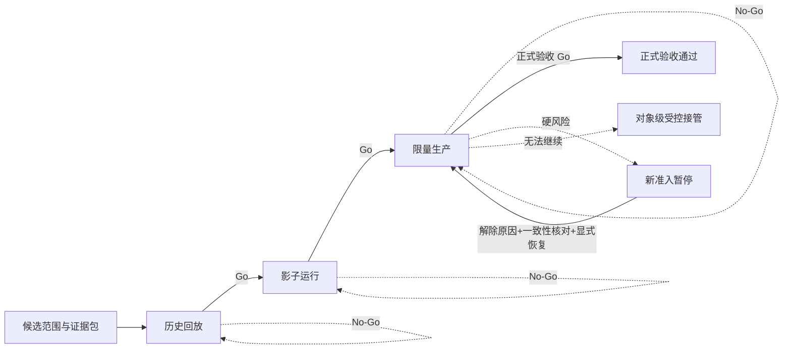

# IDP Parcel `PN-08` 端到端试点编排与阶段准入开发交接

状态：跨上下文试点治理编排边界已形成；真实试点实例、参数、证据和阶段决定待提供，当前生产结论为 `No-Go / 待参数化`

本文把 PN-02 至 PN-07 的能力候选、关务控制域的适用候选和横切运行证据组织成“历史回放 → 影子运行 → 限量生产”三个执行阶段及其后的正式验收评审。本文是产品级应用编排与开发交接，不是新的限界上下文，不建设全局运输状态机，也不规定 API、数据库表、消息 Schema、部署拓扑或 MinIO 实施细节。

真实客户、线路、伙伴、合同、容量、阈值和角色的参数状态只在[首发试点参数与证据登记册](../product/PILOT-PARAMETER-REGISTER.md)维护；场景定义和证据层级只在[首发试点验收场景矩阵](../product/PILOT-ACCEPTANCE-MATRIX.md)维护；实际阶段决定、暂停/恢复、权威区间、接管和在途盘点由实现中的不可覆盖治理记录引用受控证据对象。本文件只固定编排边界、责任和开发可验证的结果，不复制任何一类当前状态。

## 交付目标

`PN-08` 必须形成以下相互关联但不相互覆盖的治理结果：

1. 将 PN02-W05、PN03-W08、PN04-W08、PN05 适用专项候选、PN06-W08 和 PN07-W09 固定到同一客户、法人、产品、合同、线路、伙伴、账户、账期、参数和发布版本范围。
2. 形成版本化的候选范围清单和证据包索引，标出缺口、阻断项、适用的 `P/R/S/N/A` 证据和剩余风险。
3. 按顺序编排历史回放、影子运行、限量生产三个执行阶段和正式验收评审；每次升级、范围扩大或正式验收都由授权的试点业务责任角色明确作出 `Go/No-Go`。
4. 在委托接受前依据版本化准入范围决定完整委托是否纳入限量生产；同一范围内按对象、能力、事实类型和生效区间维护唯一生产权威。
5. 支持紧急暂停新准入、基于证据的显式恢复、受控回退、必要时的对象级生产接管和逐对象在途盘点。
6. 证明真实主链、适用关务控制、生产来源、客户隔离、审计、容量、非功能目标和故障恢复能够在同一试点范围内连续运行。
7. 在正式验收时证明真实完成队列和一个真实账期，并让所有未终局委托继续由明确责任方处理到真实终局。

以上结果均为治理记录或证据索引，不得压缩成一个“系统已上线”“运输已完成”或“试点已结束”状态。

## 边界与所有权

### PN-08 可以拥有

| 治理结果 | 最小含义 | 不能被解释为 |
|---|---|---|
| 候选范围清单 | 本次评审采用的对象、能力、参数和版本范围 | 参数登记册的当前值或任何业务事实 |
| 证据包索引 | 场景、执行记录、证据层级和受控对象版本的关联 | MinIO 中的业务对象或领域事实 |
| 评审决定 | 当前执行阶段、评审目标、范围、证据版本、`Go/No-Go`、生效时间 | 委托、运输段、关务案件或结算账户状态 |
| 生产权威区间 | 某对象范围、能力、事实类型在某生效区间的写入权威 | 整个系统或所有外部来源的全局权威 |
| 暂停/恢复决定 | 是否允许指定范围产生新的试点准入 | 取消、迁移或回退已经纳入的在途对象 |
| 受控接管记录 | 原权威停止写入后，指定对象范围的新权威及交接证据 | 对交接前历史的改写或批量迁移 |
| 在途盘点与偏差记录 | 当前事实、责任、下一行动、风险和复核时间的审计快照 | 对业务对象生命周期的重新决定 |

### PN-08 不拥有

- `party-commercial` 的客户、合同、产品、价格、授权和参数版本。
- `parcel-shipment` 的委托、接受、包裹身份、面单交易和终局结果。
- `network-routing` 的线路、路由计划和可达性判断。
- `node-operations` 的收寄、测量、集运、封签和物理控制事实。
- `transport-fulfillment` 的班次、容量、交接、移动、交付和实际承运事实。
- `customs-compliance` 的申报、监管结果、限制、解除和放行门禁。
- `visibility-exception` 的追踪投影、异常案件、责任结论和通知结果。
- `settlement-accounting` 的费用、应收、应付、余额、核销和经营结果。
- `collection-remittance` 的代收本金、渠道在途款、清分、应付客户款、短溢款和汇付结果。
- 合作伙伴、监管机构、财务或支付系统拥有的外部来源事实。

PN-08 只能保存对上述结果的版本化引用和治理决定。参数当前状态的唯一来源仍是参数登记册；MinIO 只保存受控证据对象，不能成为业务事实库、治理状态库或跨上下文数据通道。由于现有[上下文地图](../domain/CONTEXT-MAP.md)没有治理限界上下文，本交接不新增 `UC-GOV-*` 或治理限界上下文；实现可以在产品级应用/运营治理模块中保存治理记录，但不得取得业务对象所有权。

## 规范语言

| 术语 | 本交接中的定义 | 避免的混用 |
|---|---|---|
| 试点执行阶段 | 历史回放、影子运行或限量生产的治理阶段；正式验收是对限量生产结果的评审里程碑 | 委托、运输段、关务案件、异常案件或账期状态 |
| 候选版本组 | 本次评审采用的发布、规则、参数、契约、范围和矩阵版本组合 | “代码最新”或“配置已存在” |
| 限量生产纳入 | 在接受前对当前提交版本声明的全部成员形成一个整体结果；若后续接受，该成员集合成为接受基线 | 接受委托、承诺客户或部分接单 |
| 生产权威区间 | 对象范围 × 能力 × 事实类型 × 生效区间内唯一的生产写入方 | 系统全局唯一权威 |
| 新准入暂停 | 暂停指定范围的新委托纳入 | 取消或迁移已在途委托 |
| 发布版本回退 | 运行版本回到已批准版本，业务权威区间不自动改变 | 试点回退或对象接管 |
| 试点运营回退 | 停止新的试点纳入，保留在途原则上继续 | 自动把在途迁回旧系统 |
| 对象级生产接管 | 在原权威确实无法继续时，对明确对象范围建立新的权威区间 | 双写、盲目重提外部指令或历史迁移 |
| 在途盘点 | 逐委托、逐包裹及未完成外部动作的当前责任快照 | 把盘点结果写回源上下文 |
| 风险接受 | 对非关键偏差的明确、有限、可复核且可由后续决定前向失效或替代的治理决定；原决定不可修改 | 豁免硬风险或把 `No-Go` 改名为“部分通过” |

## 阶段模型与转换

试点执行阶段只约束准入和证据，不改变任何业务上下文的生命周期。正式验收是对限量生产证据形成最终决定的评审里程碑，不是可长期驻留的第四个运行状态。阶段转换和验收必须有不可覆盖的决定记录；日期到达、指标达标或系统建议均不自动转换。

| 执行阶段或评审里程碑 | 允许的业务副作用 | 最低证据语义 | 阶段输出 |
|---|---|---|---|
| 历史回放 | 不发送生产外部指令，不形成真实金额或生产事实 | `R`，必要的隔离执行用 `S` | 逐对象差异包、基线和剩余风险 |
| 影子运行 | 读取或接收隔离输入，只比对，不成为生产权威，不发送关务、履约、消息或财务副作用 | 执行记录仍使用矩阵规定的 `P/R/S/N/A`；通常由 `R+S` 组成，影子不是新的证据等级 | 可复现的差异分类、隔离证明和下一阶段候选 |
| 限量生产 | 只对明确范围承担生产责任；外部系统仍拥有其来源事实 | 主链自然发生使用 `P`，未自然发生的高风险分支使用允许的 `R/S` | 真实完成队列、真实账期、在途和运行监控证据 |
| 正式验收评审 | 不因验收决定迁移、关闭或重置在途对象；它不是持续运行阶段 | `P` 主链和真实账期，复杂未发生分支按矩阵使用 `R/S/N/A` | 最终 `Go/No-Go`、偏差与剩余风险、后续责任 |

影子可以消费脱敏的只读生产输入镜像，但隔离执行结果不能标记为真实外部行为；执行记录必须明确数据来源、是否验证外部参与方行为以及采用的证据层级。把影子结果升级为 `P`，或把测试端点的成功当成生产外部行为，均为阻断。

评审 `No-Go` 只表示评审目标对应的执行阶段或范围尚未获准；它不自动改变当前执行阶段、生产权威或在途责任。若证据同时发现硬风险，必须另形成暂停决定；若原权威无法继续，必须另形成对象级接管决定。

## 候选版本与证据包

每次阶段评审必须固定一个不可扩张的候选版本组，至少包含：

- `pilotScopeVersion`：客户账户、受控测试账户、责任法人、服务产品、合同、线路、节点、伙伴、结算账户、币种、账期、能力范围、纳入单元、容量和生效窗口的脱敏引用。
- `parameterSnapshot`：适用 `PAR-*` 的 ID、当前修订、有效区间和参数登记册版本；不复制真实值。
- `ruleAndContractVersions`：适用商业、网络、关务、可见性、结算规则及外部契约的实际采用版本。
- `releaseAndDependencyVersions`：候选代码/发布版本、必要的技术合同和消费者证明版本。
- `matrixVersion`：验收矩阵版本以及本次覆盖的场景 ID。
- `evidenceIndexVersion`：MinIO 逻辑命名空间中的稳定对象索引和对象版本。

版本组不是要求所有参数使用一个编号，而是要求存在同一份不可覆盖的交叉清单，并证明各直接依赖存在有效交集。客户、法人、合同、线路、生产权威、关键规则或外部契约发生变化时，只能对受影响的场景和范围重新评估；不能沿用旧证据扩大新范围，也不能覆盖旧执行记录。参数登记册的状态仍由其责任方维护，PN-08 只能引用快照。

## 开发工作包

### `PN08-W01` 同版本候选范围与证据包

主责：试点业务责任角色、各切片责任方、技术与审计协作。

主要依赖：PN02-W05、PN03-W08、PN04-W08、PN-05 适用关务专项候选、PN06-W08、PN07-W09，以及 `PAR-GOV-01..11`、适用 `PAR-COM-*`、`PAR-NET-*`、`PAR-CUS-*`、`PAR-INT-*`、`PAR-VIS-*`、`PAR-SET-*` 和 `PAR-NFR-*`。

开发交付：

- 固定客户、法人、产品、合同、线路、节点、伙伴、账户、币种、账期、能力、时间和容量范围。
- 汇总各切片候选结论，逐场景引用验收矩阵允许的场景状态，并分别记录缺口说明、只读门槛和本期不适用依据；`阻断`、`条件阻断` 是门槛而不是状态，不另建第二套状态词表，也不把多个局部候选合并成“系统已就绪”。
- 形成候选版本组和证据包索引，保存前序评估关系、有效区间和未解决风险。

不得形成：参数状态变更、生产流量批准、委托接受或任何源领域事实。

验收贡献：`GOV-01`、`GOV-03`、`DAT-02`，并为后续所有阶段提供范围身份。

### `PN08-W02` 历史数据回放

主责：运营、技术、各源领域责任方。

主要依赖：`PAR-GOV-01`、`PAR-NFR-01..06`、候选版本组和现行权威结果。

开发交付：

- 使用可追溯、脱敏、版本化的历史来源事实，按对象和业务时间重放候选规则。
- 对比现行权威结果与候选结果，区分缺失、额外、不同、迟到、无法解释和仅展示差异。
- 记录输入版本、规则版本、结果、差异分类、剩余风险和是否验证真实外部行为。

不得发送真实关务、履约、客户消息或财务指令，不得写入真实运营应收、成本、核销或结算事实。历史结果不能冒充生产结果。

验收贡献：`GOV-02`、`DAT-03`、`NFR-01/02`。

### `PN08-W03` 影子运行与差异比对

主责：技术、运营、各集成责任方。

主要依赖：回放通过、`PAR-GOV-02`、`PAR-INT-01..07`、`PAR-VIS-*`、适用 `PAR-NFR-01..06`。

开发交付：

- 在与生产写入、生产外部端点、客户消息和财务账本隔离的范围执行候选版本；只消费只读生产输入镜像，或调用明确批准的非生产测试端点。
- 对每个输入对象保存现行权威结果、候选结果、时间和差异分类，并可以重复执行同一版本组。
- 生产外部请求仍只由现行权威发起，影子只观察其已返回结果；非生产测试端点超时时保存原测试请求并查询该请求，不得从影子向生产端点补发或重提。
- 验证客户隔离、日志脱敏、审计保全和资源规模；普通 SLA/ETA/轨迹偏离只形成告警或人工依据，不自动暂停。

影子是阶段而不是证据等级。回放来源记录为 `R`，隔离执行记录为 `S`，并明确隔离输出没有生产权威；即使输入来自只读生产镜像，影子结果也不能标记为 `P`。

验收贡献：`GOV-02`、`INT-01..03`、`DAT-01..03`、`NFR-02/03`。

### `PN08-W04` 限量生产纳入与唯一生产权威

主责：试点准入控制、`parcel-shipment`、技术和运营；各上下文负责自身事实。

主要依赖：`PAR-GOV-03/04`、PN02-W05 候选结论、当前提交版本声明的完整拟受理成员范围、已通过的生产候选分支和适用 `PAR-COM-*`、`PAR-NET-*`。

开发交付：

- 在委托接受前，按客户账户、服务产品、线路、时间窗口、容量和版本化规则，对完整拟受理范围形成“本产品当前唯一权威”“其他当前权威并已安全交接”或“生产归属未决”三类结果。
- 当前提交版本声明的全部成员必须整体判断；若后续接受，该成员集合成为接受基线。不得在准入时拆分成员；后续装袋、拆袋、物理拆合、换号或改路不改变生产归属。
- 对本产品拥有的对象，按“对象范围 × 能力 × 事实类型 × 生效区间”建立唯一权威写入区间；旧系统只能读取或核对，不得双写。
- 合作伙伴、监管机构、财务和其他外部系统继续拥有其外部来源事实；`idp-parcel` 只接收和引用。

生产归属不是客户接受或拒绝。`parcel-shipment` 只消费三类结果：本产品取得当前唯一权威时才建单，其他当前权威时只保留安全交接关联，归属未决时不得建单；任何技术失败都不得写成客户拒绝。

验收贡献：`GOV-04`、`GOV-05`、`INT-01`，并消费 `CPS-01..03` 的前置结果。

### `PN08-W05` 紧急暂停与显式恢复

主责：运营值守、技术、合规和试点业务责任角色。

主要依赖：`PAR-GOV-05/06`、在途盘点能力、权威区间和 `NFR-03` 恢复证据。

开发交付：

- 授权值守角色或版本化硬风险规则可以立即暂停指定范围的新准入；优先选择可证明的最小完整范围。
- 自动阻断仅限权威写入冲突、重复不可逆指令风险、客户隔离破坏、硬合规/账号授权失效或权威事实/审计无法可靠持久化等客观硬风险。
- 无法可靠隔离时暂停整个试点的新准入；普通响应时间、ETA、轨迹新鲜度、时效或一般异常只形成告警和人工暂停依据。
- 暂停记录触发来源、规则/人工依据、证据、范围、执行身份、发生时间和生效时间；不改变阶段，不取消或迁移在途对象。
- 新准入暂停不授权继续执行不安全的在途动作。受影响对象的领域所有者按自己的规则阻断明确动作或保持待确认，PN-08 只协调并引用结果，不建立全局业务暂停状态。
- 恢复必须证明原因解除、必要一致性核对和在途盘点完成，并由试点业务责任角色明确决定；指标恢复或规则不再命中不能自动恢复。

验收贡献：`GOV-06`、`NFR-03`。

### `PN08-W06` 回退、对象级接管与在途盘点

主责：运营、技术、受影响上下文责任方和试点业务责任角色。

主要依赖：`PAR-GOV-07`、`INT-03`、`DAT-02/03`、`NFR-03` 和各上下文查询/恢复能力。

开发交付：

- 明确区分发布版本回退、试点运营回退和对象级生产接管；发布版本回退不自动改变业务权威。
- 试点运营回退先停止新增纳入；已纳入在途原则上继续由原权威完成，不批量迁回旧系统。
- 只有原权威确实无法继续时，才对明确对象、能力和事实类型建立安全接管边界。接管前停止原权威新写入，确认新权威、生效时间、责任方和交接结果。
- 接管前逐委托、逐包裹盘点稳定身份、当前有效事实、物理控制、外部不可逆指令及未知响应、未完成动作、外部标识、关务限制/提交、资金冻结/应收/应付和下一行动。
- 接管后不得双写、盲目重提外部交易、重复扣费或改写接管前历史；无法确定外部结果时先查询原请求并保持待确认。

真实自然发生的回退/接管使用 `P` 证据；未自然发生时按 `GOV-07` 使用隔离 `S`，不能把演练当成生产接管。

验收贡献：`GOV-07`、`INT-03`、`DAT-02/03`、`NFR-03`。

### `PN08-W07` 限量生产端到端主链与在途连续性

主责：试点业务责任角色、运营及 PN-02 至 PN-07 各领域责任方。

主要依赖：`PN08-W04` 的权威区间、`PAR-GOV-08`、所有适用生产候选分支、`PAR-NFR-*` 和真实客户/线路参数。

开发交付：

- 在同一候选版本组和限量范围内贯通客户提交、接受、有效网络收寄、节点作业、适用关务控制、运输与尾程、包裹终局、追踪/异常、运营费用和真实账期。
- 关务只在适用动作上提供门禁和监管结果；不得把关务专项完成解释为产品总体完成，也不得绕过适用门禁。
- 正常主链和一个真实账期使用 `P`；POD 失效端到端更正、索赔/追偿及责任复核至少完成矩阵规定的隔离 `S`。其他未自然发生的拒绝、复杂重报、退运、争议和资金异常使用允许的 `R/S/N/A`，不主动制造真实风险。
- 形成满足 `PAR-GOV-08` 的真实完成队列。未终局委托不要求被强行关闭，但必须逐项有稳定身份、当前有效事实、当前权威方、责任方、下一行动和预计复核时间。
- 不使用人工旁路替代领域决定；临时人工动作必须成为独立来源、授权和审计记录。

验收贡献：`E2E-01/02`、`GOV-08`，以及适用的 `CPS`、`OPS`、`CUS`、`VIS`、`SET`、`INT`、`DAT` 和 `NFR` 场景。

### `PN08-W08` 集成、数据、非功能与恢复证明

主责：技术、数据安全、审计、运营和各源上下文责任方。

主要依赖：`PAR-GOV-10/11`、`PAR-INT-01..07`、适用 `PAR-NFR-01..06` 以及各切片的同版本技术与恢复证据。

开发交付：

- `INT-01`：主接入来源、幂等、重复/迟到/纠错和原始提交保全可追溯。
- `INT-02`：每个伙伴、每类事实只有一种主要生产来源；人工补录是独立来源，不覆盖外部事实。
- `INT-03`：外部调用超时保持待确认，查询原请求并关联后续结果，禁止盲目重提不可逆交易。
- `DAT-01`：真实账户和受控测试账户隔离，跨客户混装/共同案件不泄露存在性、业务量或内容，个人信息按最小必要使用。
- `DAT-02/03`：决定、授权、来源事实、版本、更正、关闭/重开和派生结果完整审计；来源事实、有效事件和派生状态分层，迟到或更正不覆盖历史。
- `NFR-01/02`：容量、峰值、事件放大和各关键流程的可用性、响应、新鲜度、批处理和恢复目标均有真实基线；明确缺口只能形成 `No-Go`，不能计为 NFR 通过。
- `NFR-03`：故障恢复不造成双写、重复外部指令、丢失权威事实或跨客户影响，恢复后可盘点在途对象、未完成动作和权威区间。
- `GOV-10`：业务数据库、部署单元和发布流程保持 Parcel 独立；公司级技术组件不取得业务数据或生命周期所有权。

验收贡献：`GOV-10`、`INT-01..03`、`DAT-01..03`、`NFR-01..03`。

### `PN08-W09` 偏差、风险接受与正式 `Go/No-Go`

主责：责任法人指定的试点业务责任角色；运营、技术、关务、结算和其他责任方提供证据并负责各自偏差。

开发交付：

- 每次阶段升级、范围扩大或正式验收都记录当前执行阶段、评审目标、精确范围、候选版本组、证据包版本、偏差、剩余风险、决定方、决定时间和生效时间；首次评审进入历史回放时，当前执行阶段明确记录为“尚未进入执行阶段”。暂停/恢复与接管另记录当前执行阶段、动作类型和各自的前序决定，不伪装成阶段转换。
- 硬风险、客户隔离破坏、权威事实不明或冲突、审计完整性问题、硬合规/授权问题，以及无法解释或破坏账实平衡的结算差异，必须 `No-Go`，不得风险接受。
- 非关键偏差只有在影响范围、临时控制、责任人、计划关闭时间、剩余风险和显式风险接受决定齐全时，才可随 `Go` 保留；风险接受不改变参数状态、不扩大范围、不覆盖历史。
- 正式验收决定不关闭、迁移、重置或改变任何未终局委托、案件、运输段、费用或结算责任；它只决定未来准入和后续治理责任。
- `No-Go` 的处理方式必须显式写明是保持当前范围、暂停新准入、修复后重评还是对象级接管，不能由系统自动推断。

验收贡献：`GOV-03`、`GOV-08`、`GOV-09`，并汇总 `E2E-01/02` 和所有阻断场景。

W09 在进入历史回放、进入影子运行、进入限量生产和正式验收四个评审关口复用；编号表示治理汇总职责，不表示必须等 W01 至 W08 全部结束后才第一次执行。

## 评审关口与准入门槛

| 评审关口 | 必须先满足 | `Go` 结果 | `No-Go` 结果 |
|---|---|---|---|
| 进入历史回放 | 候选版本组、脱敏数据、现行权威结果、隔离端点和回放差异口径已固定 | 允许在精确范围执行 W02 | 保持候选准备，修复/补证后重评；不产生生产准入 |
| 进入影子运行 | 回放结果与差异可解释或有受控风险；生产端点、客户消息和财务副作用已隔离 | 允许在精确范围执行 W03 | 保持回放阶段，修复/补证后重评；不成为生产权威 |
| 进入限量生产 | `PAR-GOV-03..07` 生效；相关 PN 候选通过；客户、线路、伙伴、合同、容量、授权和集成参数就绪；影子及恢复/接管演练通过 | 对精确范围建立唯一权威区间并允许新委托纳入；在限量生产中形成 `GOV-04/05` 的 `P` 证据 | 不扩大范围；若存在硬风险另行暂停；已纳入在途处理责任不自动改变 |
| 正式验收 | `E2E-01` 主链和真实账期 `P` 通过，`E2E-02` 端到端更正 `S` 通过；全部阻断场景通过；完成样本、观察窗口、全部在途盘点、偏差、`GOV-10` 和 `PAR-GOV-11` 证据齐全 | 记录正式验收 `Go` 和后续责任 | 保持当前生产治理，或按决定暂停/接管；不得伪造完成或迁移在途 |

阶段准入不是一次性“全部产品上线”。范围扩大、规则或发布版本变更、伙伴变更或关键参数变更都要生成新的候选版本组，并对受影响场景重新评估。

## 关键交接与失败场景

| 场景 | 必须观察到的结果 | 错误结果 |
|---|---|---|
| 多包裹委托在容量边界上 | 当前提交版本声明的全部成员整体纳入或整体排除；若接受，该集合成为接受基线 | 先接收可行包裹、再把失败成员转给旧系统 |
| 影子观察到生产结果待确认或测试端点超时 | 生产请求仍由现行权威查询；影子只观察。测试请求仅查询原非生产请求 | 影子向生产端点补发或重提申报、订舱、通知 |
| 生产权威区间重叠 | 立即阻断受影响范围的新准入并保留冲突证据 | 双写后靠人工对账消除冲突 |
| 普通 ETA/SLA 偏离 | 形成告警、分诊或人工暂停依据 | 自动停单、迁移在途或改变承诺 |
| 已用于终局、追踪和计费的 POD 后来失效 | 从交付/控制开始逐层形成包裹终局、内部投影、客户视图、费用/成本和毛利的新版本，保留原事实及派生历史 | 只把页面改回“运输中”、删除原签收或直接覆盖已发布金额 |
| 硬合规或隔离风险 | 按可证明的最小完整范围暂停；无法隔离则全试点暂停新准入 | 只拒绝当前报错单，继续扩大范围 |
| 原权威无法继续且存在未完成外部动作 | 先停原权威写入，逐对象盘点和受控接管 | 批量迁移、重复指令或覆盖历史 |
| 正式验收后仍有未终局委托 | 保留原身份、事实、权威、责任、下一行动和复核时间 | 为了“清空队列”强制关闭或迁移 |
| 关键参数/规则/发布版本变更 | 建立新版本组，按影响范围重评并记录旧证据关系 | 继续引用旧证据扩大生产范围 |

## 治理记录的最小字段

受限证据内容保存在受控证据库；候选、决定、权威区间、暂停/恢复、接管和盘点等治理记录保存在本产品应用数据边界，并引用稳定证据对象版本；项目仓库只保存脱敏标识、索引和规则文档。MinIO 不是治理状态库，治理记录也不得反向修改领域事实。

| 记录 | 最低字段 |
|---|---|
| 候选范围清单 | 评估 ID、范围脱敏标识、适用参数/规则/发布/契约/矩阵版本、有效区间、前序候选、缺口和阻断 |
| 执行记录 | 矩阵版本、场景 ID、对象/能力范围、脱敏映射或证据索引版本、`P/R/S/N/A`、数据来源和时间范围、是否真实验证外部行为、执行/复核方、结果、偏差、剩余风险、证据位置 |
| 评审决定 | 当前执行阶段、评审目标、精确范围、候选版本组、证据包版本、`Go/No-Go`、偏差和风险、决定方、决定时间、生效时间及后续动作 |
| 生产权威区间 | 对象范围、能力、事实类型、旧/新权威、有效起止、纳入决定引用、适用规则版本、冲突检查和撤销/接管关系 |
| 暂停决定 | 触发来源、规则或人工依据、证据、范围、执行身份、发生/生效时间、在途影响和动作级安全处理引用 |
| 恢复决定 | 原暂停决定、原因解除证据、一致性核对、在途盘点、决定方、决定/生效时间；原暂停记录不可修改 |
| 接管与在途盘点 | 原权威停止写入证据、对象/能力/事实类型、已接受事实、外部未决动作、实际控制、资金/关务责任、下一行动、新权威、生效边界和交接结果 |
| 偏差/风险接受 | 偏差等级、影响范围、临时控制、责任人、关闭时间、剩余风险、接受决定和失效/复核条件 |

## 验收映射

| 工作包 | 主要验收场景 | PN-08 能否单独闭合 |
|---|---|---|
| `W01` | `GOV-01/03`、`DAT-02` | 只能闭合候选范围和证据包，不形成阶段 `Go` |
| `W02` | `GOV-02`、`DAT-03`、`NFR-01/02` | 只能闭合回放证据 |
| `W03` | `GOV-02`、`INT-01..03`、`DAT-01..03`、`NFR-02/03` | 只能闭合影子隔离和差异证据 |
| `W04` | `GOV-04/05`、`INT-01` | 只能闭合精确范围的纳入与权威候选 |
| `W05` | `GOV-06`、`NFR-03` | 只能闭合暂停/恢复演练或自然事件证据 |
| `W06` | `GOV-07`、`INT-03`、`DAT-02/03`、`NFR-03` | 只能闭合受控接管和在途盘点边界 |
| `W07` | `E2E-01/02`、`GOV-08` 及适用 `CPS/OPS/CUS/VIS/SET` | 只能提交真实主链、端到端更正和账期证据，不自行验收 |
| `W08` | `GOV-10`、`INT-01..03`、`DAT-01..03`、`NFR-01..03` | 只能闭合横切证明 |
| `W09` | `GOV-03/08/09` | 由授权试点业务责任角色形成阶段或正式 `Go/No-Go` |

PN02-W05、PN03-W08、PN04-W08、PN06-W08 和 PN07-W09 的“提交 PN-08”结论是候选输入，不是本表 `W09` 的重复决定。PN-05 关务专项同样只提供适用控制域候选和证据；不得把任何单一切片的通过推广为产品总体通过。

## 首批参数与证据动作

1. 试点业务责任方回填 `PAR-GOV-01..04`，至少固定回放数据、影子范围/周期、限量纳入规则、授权规则和候选版本组。
2. 运营、技术和合规回填 `PAR-GOV-05..07`，包括硬风险、值守授权、恢复核对、三种回退语义和对象级接管边界。
3. 运营与试点业务责任方回填 `PAR-GOV-08/09`，包括真实完成样本、观察周期、在途盘点口径、偏差分级和风险接受权限。
4. 技术与架构责任方核验 `PAR-GOV-10`，证明独立业务数据库、部署和发布边界；平台、审计和数据安全责任方回填 `PAR-GOV-11` 的自建 MinIO 实例引用、逻辑命名空间、对象版本和访问责任。
5. 各切片责任方提交同一版本组的 W08/W09 候选、场景执行记录、参数版本、代码/发布版本和恢复证据；缺失或冲突时只形成 `No-Go / 待参数化`。

所有真实敏感资料、客户名称、合同原文、账号凭据、银行资料和金额明文不得复制进仓库；仓库只登记稳定脱敏标识、索引和版本。

## 完成定义

一个精确试点范围只有同时满足以下条件，才能标记为“PN-08 正式验收 `Go`”：

1. `GOV-01` 范围实例化完成，且候选版本组的客户、法人、产品、合同、线路、伙伴、账户、币种、账期和有效区间一致。
2. 历史回放和影子运行的隔离、差异和剩余风险可复现；影子未形成生产权威或真实外部行为。
3. 限量生产纳入规则、唯一权威区间、暂停/恢复、回退和对象级接管已经验证；同一范围没有双写或权威不明。
4. `E2E-01` 正常主链和一个真实账期通过 `P`，`E2E-02` POD 失效端到端更正通过 `S`；`VIS-09` 与 `SET-11` 完成强制隔离 `S`。适用关务控制已经通过，其他复杂未自然发生分支按矩阵完成 `R/S/N/A` 分层。
5. `GOV-10`、`INT-01..03`、`DAT-01..03`、`NFR-01..03` 的全部阻断场景通过；这些场景没有 `N/A` 分支。独立运行边界成立，故障恢复后可以盘点权威方和在途动作。
6. 完成样本量、观察窗口、所有未终局委托的逐项盘点、未关闭偏差和剩余风险均已记录。
7. 不存在未解除的硬风险、客户隔离破坏、权威事实冲突、审计不完整、硬合规/授权问题或无法解释/不平衡的结算差异。
8. 试点业务责任角色基于明确证据包版本形成最终 `Go/No-Go`，并记录正式验收后的持续处理责任。

未满足以上条件时，可以继续稳定骨架、历史回放、影子或受控模拟，但不得宣布限量生产、真实账期或正式验收已经完成。当前代码仅包含 `parcel-shipment` 的来源/提交候选内核，没有 PN-08 治理实现；结合 `PAR-GOV-*`、`PAR-NFR-*` 和真实业务参数仍待提供，当前结论保持 `No-Go / 待参数化`。
