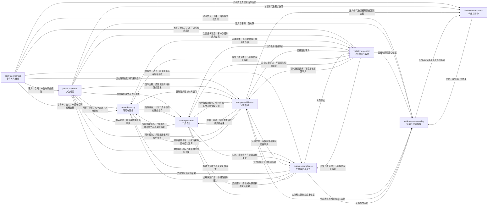

# IDP Parcel 领域上下文地图

Status: Confirmed

## 产品边界

`idp-parcel` 是面向自营国际小包网络物流企业的独立产品，拥有独立的领域模型、业务数据库、部署边界和发布周期。它不共享或直接依赖 `idp-tms` 的领域模型、业务表或运行时业务服务。

产品只复用具有明确版本和兼容性约束的公司级技术组件，例如身份认证、审计、消息、文件、配置和可观测性组件。技术组件不得取得本产品领域对象的所有权，也不得成为绕过领域边界共享业务数据的通道。

本地图中的限界上下文表达语言、规则、生命周期和数据所有权边界。**限界上下文不等于微服务、独立进程、代码模块或数据库实例**；本地图不预设技术拓扑，但任何实现都不得直接修改其他上下文拥有的数据。

## 核心区分

- 提交批次只是多份委托的提交归组；委托接受基线冻结客户声明范围，真实物理拆分或合并通过包裹身份谱系表达。
- 客户委托、包裹、集运单元、申报单元和运输履约对象具有不同身份，不能使用一个“大运单”同时表示。
- 多个客户的包裹可以进入同一集运单元、班次或运输履约过程，但不得因此混合客户合同、客户可见数据、运营应收或责任。
- 客户委托及包裹身份不因装袋、拆袋、换袋、改路、转运、清关或履约主体变化而被替换。
- 自营履约不虚构外部承运合同；外包履约必须保留明确的合作伙伴、合同责任和费用依据。
- 渠道账号持有人、渠道服务方、合同与结算相对方、底层承运商、实际承运商和责任承担方是不同交易角色；承运商代理关系不能把这些角色自动合并。
- 货主客户账户是客户业务隔离边界，结算账户是法人、相对方、方向、币种和结算政策共同确定的金额责任边界；两者不能合并。
- 物流运营费用、余额和经营指标与银行、税务、总账及法定会计事实分别拥有；运营分户账不能替代完整财务系统。
- 代收货款本金属于代收与清分，不是经营口径物流收入、客户预付余额或普通结算账户资金。
- 计划、承诺、已经发生的事实及其派生状态分别管理，任何一层不得静默覆盖另一层。
- 网络连接、线路、包裹路由计划、具体班次、装载分配和物理装载具有不同身份与所有者，稳定网络定义、未来执行意图和实际事实不得相互覆盖。

## 上下文

### [`party-commercial`](./party-commercial/CONTEXT.md)：参与方与商业

**拥有**：

- 运营企业集团及其法人、经营组织和业务身份。
- 角色中立的业务参与方身份，以及客户、合作伙伴等业务关系。
- 承运商、承运商代理商、转售商和聚合平台等参与方关系，以及渠道账号的持有人、有效范围、商业归属和业务使用授权。
- 客户账户、客户合同与供应商商业协议及其独立版本、合同责任法人、服务范围、有效期和被业务引用的商业依据。
- 运营企业服务产品及其版本、网络服务与面单渠道服务形态、面单服务终局规则、责任法人授权治理、版本化角色权限等级、合同委派、关闭责任来源规则、关闭与重开的条件和依据版本、外部渠道产品目录身份与商业适用性、产品—渠道映射、可复用渠道约束和各自的适用有效期。
- 产品适用条件、销售与采购价格规则、法人间结算价格规则、结算政策、税务分类依据、信用政策、人工费用调整授权和客户服务规则版本。

**不拥有**：

- 客户委托、包裹、具体渠道选择、面单交易或实际履约事实。
- 具体包裹的面单继续尝试关闭或重开决定。
- 线路、班次、集运单元、关务申报和异常案件。
- 运营应收、供应商预期成本、账单匹配、审核应付、结算账户、运营余额、成本分摊或经营毛利指标。

### [`parcel-shipment`](./parcel-shipment/CONTEXT.md)：小包托运

**拥有**：

- 提交批次的业务归组、客户委托、委托接受基线及多件委托中的客户声明成员关系。
- 包裹永久内部标识、包裹身份谱系、当前有效包裹和版本化外部标识关联。
- 面单交易、交易覆盖的一个或多个包裹，以及交易级和包裹级渠道业务结果。
- 面单交易定案、包裹级关闭或重开请求与决定证据、请求方、实际决定方、关闭责任来源、权威业务截断边界、关闭与重开历史、批量操作的逐包裹结果及包裹级继续尝试判断。
- 面单交易绑定的账号持有人、渠道服务方、合同与结算相对方、费率、已明确的底层承运商、责任承担方及责任依据快照。
- 寄件方、收件方、地址、货物内容、申报原始资料和客户要求的任务级快照。
- 委托提交、接受、取消、完成汇总及包裹进入网络前后的身份连续性。
- 根据客户合同和服务产品形成的客户承诺快照。
- 委托级服务责任与渠道约束快照、具体渠道选择与锁定结果，以及接受委托和实际交易分别使用的产品—渠道映射与渠道账号授权快照。

**不拥有**：

- 客户合同、服务产品及销售价格规则的版本生命周期。
- 集运单元成员关系、分拣、装卸或商品库存账。
- 正式关务申报、监管决定、线路、班次和运输资源。
- 全程追踪投影、异常案件和运营结算结果。
- 节点收寄、测量、物理拆分合并、运输交接和实际承运事实。

### [`network-routing`](./network-routing/CONTEXT.md)：网络与路由

**拥有**：

- 物流节点的网络身份、版本化服务区域和节点覆盖关系。
- 有向网络连接、由连接组成的线路，以及业务时区、服务日历、截单条件和临时网络可用性调整。
- 节点经营方、线路责任方、可使用法人、服务产品范围和合同资格的网络适用关系；参与方、产品和合同身份仍引用 `party-commercial`。
- 路由策略版本、路由候选、逻辑可达性判断、选择与淘汰依据。
- 包裹级路由计划、计划适用性、计划节点、计划履约段、计划时间窗口、路由指令、路由偏离判断、集运兼容判断及受控改路历史。

**不拥有**：

- 客户地址、客户委托、服务产品、客户合同、客户承诺或客户价格。
- 节点内实际作业、当前有效实测、物理控制、扫描和拆分合并事实。
- 具体班次、容量预占、订舱、装载分配、实际承运和交付事实。
- 关务合法性、监管限制和解除决定。
- 异常案件、客户运营应收、供应商审核应付或实际费用。
- 旅程的跨上下文实际过程或统一状态机；旅程不是网络与路由独占聚合，本上下文只拥有与该范围关联的路由计划版本和计划判断。

### [`node-operations`](./node-operations/CONTEXT.md)：节点作业

**拥有**：

- 客户送站形成的节点收寄、待识别实物、实物身份候选与冲突、节点内控制和作业位置关系。
- 作业任务、作业批次、扫描、测量、状况观察、分拣、集拆、封装、受控开封、重封、内部作业标签、物理装卸和在场核对事实。
- 集运单元实例、可复用载具作业引用、无循环物理包含关系、封装成员快照、封签记录和实例终局。
- 实际测量、当前有效实测、节点本地安全作业限制、处置执行事实，以及运输交接的节点侧点验、交出或接收证据。

**不拥有**：

- 客户委托、正式包裹身份及谱系、客户合同、客户价格和客户服务结果。
- 场外揽收、节点与运输方的权威交接结果、班次、装载分配、实际移动、外部承运合同、总单或舱单。
- 线路、路由计划、集运兼容判断、监管查验授权、关务限制、放行或处置决定。
- 客户可见全程状态、异常案件、损坏责任、计费重量或运营结算结果。
- 商品库存账、库存可用量、库存价值、补货、仓储拣选或库存调整等完整 WMS 能力。

### [`transport-fulfillment`](./transport-fulfillment/CONTEXT.md)：运输履约

**拥有**：

- 场外揽收、节点间运输和末端派送的载运对象引用、实际履约段及逐对象履约参与关系。
- 具体日期的班次、运输资源分配、多维容量池与容量预占，以及自营或外包履约方式。
- 运输委托、订舱、承运接受、装载分配，以及实际采用的供应商协议与履约条件快照。
- 节点与运输方之间逐对象成立的权威运输交接结果、实际移动、出发、到达、揽派尝试、有效交付结果和交付证明。
- 每个实际履约段已经确认或待确认的实际承运商，以及实际承运商收寄、交接和交付事实。
- 承运总单、运输舱单及外部承运凭证的身份和版本，以及履约侧代收证据、渠道代收报告和渠道回款通知等来源证据。

**不拥有**：

- 客户委托和包裹身份、客户或供应商商业协议、销售或采购价格规则、客户运营应收。
- 集运单元成员关系及节点内分拣作业。
- 线路与路由策略版本、关务申报和监管决定。
- 全程追踪投影、异常案件、供应商审核应付、代收本金账本或真实到账结果。

### [`customs-compliance`](./customs-compliance/CONTEXT.md)：关务与贸易合规

**拥有**：

- 按明确监管程序建立的稳定关务案件，以及案件关联的申报单元、替代关系和后续案件关系。
- 案件及提交版本采用的关务参与方角色、主体资格、报关服务商和申报渠道账号授权快照。
- 经字段级追溯形成的正式申报资料快照、不可覆盖的提交版本、提交尝试，以及更正、补充、撤销重报关系。
- 监管舱单的身份、版本和申报范围；运输总单、运输舱单及实际运输事实仍由运输履约拥有。
- 禁限运、归类、原产地、申报价值、监管凭证适用性等规则化合规判断及其规则版本、依据和决定方式。
- 关务限制及其明确的适用对象、依据、责任来源和解除结果。
- 监管核定税费及其版本、税费法定义务人和法定义务范围。
- 申报提交、技术回执、监管接收、业务受理、查验、扣留、放行和监管处置等已接收的外部监管事实。

**不拥有**：

- 客户提交的原始委托、包裹身份或原始商业资料。
- 监管机构最终决定的权力；本上下文只记录已接收决定及其适用范围，不替代监管机构作出决定。
- 包裹物理控制、集运单元成员关系，以及接收、测量、隔离、开封、重封、装卸、销毁或退运装载等节点执行事实。
- 运输班次、运输总单、运输舱单、运输交接或实际移动事实。
- 银行或支付系统拥有的实际付款、失败、退款和补缴事实，以及结算与经营核算拥有的客户运营应收、税费垫付回收和其他运营回收结果。
- 异常案件、供应商审核应付或公司会计结果。

### [`visibility-exception`](./visibility-exception/CONTEXT.md)：全程追踪与异常

**拥有**：

- 基于各源上下文已接受事实形成的包裹全程追踪投影、标准追踪里程碑、追踪摘要、版本化 ETA、可见性缺口判断及客户隔离视图。
- 异常信号、信号发作期、分诊、严重度、处置优先级以及相应规则版本和判断历史。
- 异常案件的根对象和版本化影响范围、责任团队、响应周期、处置请求、原因与责任结论、受控归并、关闭和重开。
- 客户异常通知决定、证据评价、客户索赔项以及供应商或保险追偿事项的责任和证据关系，但不拥有最终金额结算。

**不拥有**：

- 节点扫描、运输履约、关务结果及其更正或有效性决定等源业务事实。
- 客户委托、包裹身份及谱系、客户承诺、终局服务结果、集运单元、路由计划、班次或装载分配。
- 其他上下文拥有的业务动作、限制及其解除决定；异常处置只能提出请求并接受对象所有者的结果。
- 客户运营应收、供应商审核应付、赔付或追偿的最终金额、真实收付款及法定会计结果。

### [`settlement-accounting`](./settlement-accounting/CONTEXT.md)：结算与经营核算

**拥有**：

- 费用项目、主要计费范围、客户及供应商计费重量、计算展开、费用明细、费用调整及其版本和依据。
- 客户运营应收、供应商预期成本、供应商账单主张与内部成本的匹配、审核应付和内部履约成本。
- 结算账户、截单快照、对账单、金额范围争议、运营结算余额、资金冻结、账龄和核销关系。
- 共享班次、集运单元和网络作业成本向包裹、客户、产品或线路的受控分摊结果。
- 原币、合同结算币和报告币金额、换算依据及独立汇兑差额。
- 客户赔付、供应商或保险追偿、关税代垫回收和服务费用的金额结算，以及它们与原运营应收、成本和责任依据的关系。
- 多法人履约产生的关联内部应收与内部应付；它们与经营成本分摊分别存在。
- 由运营应收、外部成本、内部成本、赔付、追偿、分摊和适用汇兑事实按明确版本、币种及截至时点派生的经营毛利与经营损失指标。

**不拥有**：

- 客户与供应商商业协议、价格规则、结算政策、信用政策、税务分类依据或人工调整授权规则的版本生命周期。
- 原始测量、扫描、履约、关务和异常责任事实。
- 银行流水、支付清算、法定税额与发票、会计应收应付、坏账减值、总账、会计收入确认或法定报表。
- 代收货款本金、渠道在途代收款、待清分款、应付客户款或代收汇付结果。
- 通过改写源事实、已确认费用或已发布对账单修正结算结果的权力。

### `collection-remittance`：代收与清分

**拥有**：

- 依据客户代收服务要求建立的代收资金义务，以及依据已接受履约侧代收证据或支付事实形成的代收分户账结果。
- 收件人应付代收款、已接受实收金额和渠道回款范围。
- 渠道在途代收款、待清分款、应付客户款、客户汇付和代收短款。
- 代收本金在客户、责任法人、币种和代收渠道之间的隔离与对账关系。

**不拥有**：

- 客户合同、客户代收服务要求快照、包裹身份、履约侧原始收款证据、运输履约、普通运费、COD 服务费或经营口径收入。
- 银行流水、支付清算、总账和法定会计余额。
- 将未实际收到的代收款提前确认为可付客户余额的权力。

## 上下文关系

### 关系约束

- `party-commercial → parcel-shipment`：参与方与商业提供客户、客户合同版本、服务产品版本、面单服务终局规则、责任法人授权治理、角色权限等级、合同委派、关闭责任来源规则、可复用渠道约束、产品—渠道映射、渠道账号使用授权和参与方关系；小包托运保存适用依据，拥有具体包裹的请求与决定证据、权威业务截断边界、逐包裹批量结果和终局判断。关闭与重开均重新校验当前角色和客户授权，重开还须确认原关闭责任来源对应或覆盖完整面单服务范围的限制已经解除。后续商业变化不覆盖既有快照或决定历史，渠道范围、映射或账号资格变化也不自动形成包裹级关闭或重开。
- `party-commercial → network-routing`：参与方与商业提供法人、服务产品、客户合同、商业渠道约束和网络使用资格依据；网络与路由据此判断候选范围，但不取得产品、合同、客户价格或商业渠道锁定的所有权。
- `party-commercial → transport-fulfillment`：参与方与商业拥有参与方、运营法人、供应商商业协议、采购价格、责任和结算条件的版本生命周期；运输履约保存实际运输委托采用的协议、履约条件及角色快照并形成履约和成本来源事实，不得修改商业版本。自营履约记录真实运营法人，但不虚构外部供应商协议。
- `party-commercial → customs-compliance`：参与方与商业提供参与方与法人身份、业务关系、报关服务商关系及申报渠道账号使用授权；关务按案件和提交版本保存货物相关主体、进出口责任主体、申报人、报关服务商、账号持有人、税费法定义务人、实际付款方和运营责任法人的角色与资格快照。角色不得由企业类型或其他角色自动推导，后续商业变化不得覆盖既有快照。
- `party-commercial → settlement-accounting`：参与方与商业拥有客户及供应商商业协议、销售与采购价格、法人间结算价格、结算政策、税务分类依据、信用政策和人工调整授权规则的版本；结算保存实际采用依据并形成金额、余额、对账和经营指标，不得回写商业版本。
- `parcel-shipment → node-operations`：小包托运提供接受基线、正式包裹身份、外部标识关联和作业要求；节点作业拥有客户送站形成的节点收寄、待识别实物、测量、重包装及真实拆分合并事实。识别成功后以版本化关联连接正式包裹，节点不删除原实物记录；小包托运依据有效物理事实维护正式包裹身份和谱系。
- `parcel-shipment → transport-fulfillment`：小包托运拥有包裹身份、面单交易及其渠道角色快照；运输履约引用包裹作为载运对象，并拥有实际履约段、实际承运商判断及其收寄、交接和交付事实。渠道服务方、代理商、签约服务商或底层承运商不能仅凭渠道结果被认定为实际承运商。
- `transport-fulfillment → parcel-shipment`：运输履约提供场外揽收、实际承运商首次有效收寄、交接和履约的有效事实；小包托运把场外揽收与节点送站收寄统一解释为适用的有效网络收寄结果，并据首次有效收寄另行判断面单服务包裹的取消边界和默认终局。证据冲突或实际承运商待确认时不得提前触发该边界，两种判断也不能合并；面单交易责任仍来自渠道确认结果与适用合同。
- `parcel-shipment → network-routing`：小包托运提供包裹身份、客户地址、服务要求、声明快照和接受基线；网络与路由按包裹形成接受前可达性判断，接受后存在可行候选时形成初始路由及后续版本，允许待路由但仍无候选时形成无当前有效路由，同一委托中的包裹可以具有不同路由。
- `network-routing → parcel-shipment`：网络与路由提供可达性判断及其可达、不可达或资料不足结果、当前有效路由计划和无当前有效路由判断；标准网络服务的可达结果参与委托接受判断，但路由结果不能修改委托身份、服务产品、商业渠道锁定或客户承诺。
- `parcel-shipment → customs-compliance`：小包托运提供包裹身份和客户原始申报资料快照；关务保留原始值，结合节点实测、合规判断及其他合法依据形成字段级可追溯的正式申报资料快照和不可覆盖的提交版本。申报单元独立于包裹和其他物理或运输归组；受控跨客户合报不得混合逐包裹的客户、货物、价值、税费、责任和监管结果。
- `各限制源 → parcel-shipment`：关务、安全、资格、账号授权及其他硬限制的源上下文提供当前限制、适用范围和有效解除结果，小包托运只据此判断新交易或重开的适用资格，不取得限制或解除决定的所有权。原关闭责任来源对应或覆盖完整面单服务范围的限制未解除时不得重开；只覆盖单一渠道的限制不阻断包裹级重开，但仍阻断该渠道的新交易；限制解除不自动形成包裹级重开。
- `network-routing → node-operations / transport-fulfillment`：路由计划、计划节点、计划履约段、时间窗口和路由指令表达版本化执行意图，集运兼容判断表达拟共同进入下一节点或计划履约段的适用性；节点作业和运输履约分别记录实际执行。实际履约段通过逐对象履约参与关系关联适用计划段，允许一条计划段由零个、一个或多个实际段完成，双方均不得覆盖另一层历史。
- `node-operations / transport-fulfillment → network-routing`：节点作业提供节点收寄、当前有效实测、节点控制、物理拆分合并、非计划节点和物理装载事实；运输履约提供场外揽收、权威运输交接和实际移动事实。网络与路由据已知实际接货位置及当时有效证据复核，在包裹进入节点并形成有效节点实测后再按实际节点和实测复核，但不覆盖收寄、控制、测量或履约事实。
- `transport-fulfillment → network-routing`：运输履约提供班次与多维容量可用性信号、订舱、容量预占或装载分配结果、运输控制边界和实际移动事实；网络与路由不预占容量，单次分配失败也不自动等于逻辑路径失效。
- `transport-fulfillment → customs-compliance`：运输履约提供运输总单、运输舱单及其版本、实际承运商、运输交接和实际移动事实；关务可据此形成或复核监管舱单、申报资料和监管适用性，但不取得运输单证或运输事实所有权，物理同袋、同总单、同舱单或同班次也不自动构成受控跨客户合报资格。
- `customs-compliance ↔ network-routing`：关务提供合规候选区域、口岸、申报路径、限制及解除结果；路由只在合格候选中选择。拟改路改变关务区域、口岸或报关服务方时，必须先请求新的关务适用性判断，不能沿用原申报或放行结果。
- `node-operations ↔ transport-fulfillment`：节点作业拥有集运单元、备货、点验、物理装卸以及节点侧交出或接收证据；运输履约唯一拥有节点与运输方之间逐对象成立的权威交接结果，以及班次、装载分配和节点间移动。双方引用同一交接范围，整批结果由成员结果派生，不共同编辑一个结果；只有“已交接”结果转移控制，已拒收或待确认均保持原控制，扫描、位置和装卸不能单独转移控制。
- `node-operations → customs-compliance`：节点作业提供当前有效实测、状况观察、查验协作和监管处置的实际执行事实及证据；关务据此形成或复核正式申报资料、合规判断、查验结果和处置完成判断，但不得覆盖客户原始资料或节点执行事实。关务拥有查验或处置授权，节点作业拥有物理开封、隔离、重封、销毁、退运装载等执行事实；指令下达或部分执行均不自动等于处置完成。
- `customs-compliance → node-operations / transport-fulfillment`：关务提供明确适用范围的限制、查验或处置授权及外部监管结果；节点作业与运输履约只阻断受该监管门禁约束的出库、装载出发、跨关务区域移动、交付等方向性动作，不得通过异常关闭绕过限制。未放行不阻止接收、隔离、测量、查验协作及已授权处置；外部监管放行也不自动解除仍有效的内部合规限制，只有各限制来源分别解除后，相应受限动作才可继续。
- `party-commercial / parcel-shipment → visibility-exception`：参与方与商业提供货主客户账户、责任法人、服务产品、客户合同及适用异常服务规则；小包托运提供包裹身份谱系、客户承诺和终局服务结果。全程追踪保存实际采用的响应、披露和责任依据，不修改商业版本、包裹身份、承诺或终局。
- `各事实源 → visibility-exception`：小包托运、网络与路由、节点作业、运输履约和关务上下文拥有各自业务事实、有效性及更正关系；全程追踪只基于已经接受的事实形成标准追踪里程碑、全程追踪投影、ETA、异常信号和案件。来源冲突无法裁决时保持待确认并协调核实，不成为第二事实源。
- `network-routing → visibility-exception`：网络与路由拥有路由计划与实际事实的偏离判断，并提供路由版本、选择依据、无当前有效路由和路由偏离结果；全程追踪拥有由此形成的可见投影、异常信号和异常案件，但不能反向改写路由计划或实际事实。
- `visibility-exception → 业务上下文`：异常处置只能提出带目标、范围和依据的改路、重作业、重新履约或重新申报等请求；发送、接受和实际完成分别记录，是否生效及执行事实仍由拥有相应对象的上下文决定。
- `visibility-exception → settlement-accounting`：全程追踪与异常提供当前有效的客户合同责任、供应商或保险追偿责任、索赔结论和证据依据；结算独立形成赔付、追偿和费用金额，不把金额结果回写为异常事实或只保存净额。
- `visibility-exception ↔ 消息能力`：全程追踪与异常拥有客户披露决定、内容快照和通知义务判断；消息能力提供渠道接受、送达、失败和客户确认等技术结果，通知生成或渠道接受不自动等于已经送达。
- `各业务上下文 → settlement-accounting`：结算消费商业协议、价格、实测、履约、关务和责任依据形成独立费用版本；费用按各自确认条件成立，不等待包裹整体完成，结算不得回写或修饰来源事实。
- `settlement-accounting ↔ 财务、税务、银行和支付系统`：结算拥有物流运营分户账，外部系统拥有真实收付款、银行清算、法定税额与发票、会计应收应付、坏账、总账和法定报表。双方通过可追溯事实及映射协作，不共同维护一个可覆盖余额。
- `parcel-shipment / transport-fulfillment → collection-remittance`：小包托运拥有并提供包裹与客户代收服务要求快照；运输履约拥有并提供履约侧代收证据、渠道代收报告和渠道回款通知，但这些来源都不等于运营企业真实到账。代收与清分关联适用证据及银行或支付事实后形成代收本金的应收、已收、在途、清分、应付客户、短款、溢款和汇付分户账结果，不取得客户要求、履约证据或银行事实所有权。
- `settlement-accounting ↔ collection-remittance`：结算拥有 COD 服务费和有效协议允许的运费抵扣金额，代收与清分拥有代收本金及汇付。未实际收到的代收款不得进入可付客户余额，代收本金也不得计入经营口径物流收入或普通运营结算余额。

## 文档关系

- `party-commercial` 的语言、规则和生命周期见 [party-commercial/CONTEXT.md](./party-commercial/CONTEXT.md)。
- `parcel-shipment` 的语言、规则和生命周期见 [parcel-shipment/CONTEXT.md](./parcel-shipment/CONTEXT.md)。
- `network-routing` 的语言、规则和生命周期见 [network-routing/CONTEXT.md](./network-routing/CONTEXT.md)。
- `node-operations` 的语言、规则和生命周期见 [node-operations/CONTEXT.md](./node-operations/CONTEXT.md)。
- `transport-fulfillment` 的语言、规则和生命周期见 [transport-fulfillment/CONTEXT.md](./transport-fulfillment/CONTEXT.md)。
- `customs-compliance` 的语言、规则和生命周期见 [customs-compliance/CONTEXT.md](./customs-compliance/CONTEXT.md)。
- `visibility-exception` 的语言、规则和生命周期见 [visibility-exception/CONTEXT.md](./visibility-exception/CONTEXT.md)。
- `settlement-accounting` 的语言、规则和生命周期见 [settlement-accounting/CONTEXT.md](./settlement-accounting/CONTEXT.md)。
- 统一术语见 [GLOSSARY.md](./GLOSSARY.md)。
- 跨上下文业务验证见 [SCENARIOS.md](./SCENARIOS.md)。
