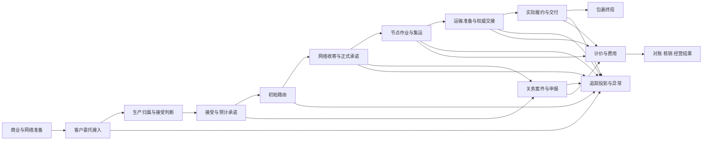

# IDP Parcel 产品业务全景与端到端流程说明书

状态：产品导览；不定义新的领域规则、应用用例、试点参数或实现完成标准

| 项目 | 说明 |
|---|---|
| 面向读者 | 产品、售前、实施、运营、关务、结算、研发、测试和架构人员 |
| 说明范围 | 业务主链、产品操作、系统协作、模块职责、异常分支和试点治理 |
| 当前状态 | 机制与界面能力的观察性快照；真实租户生产状态仍以参数登记册和 PN-08 决定为准 |
| 维护原则 | 本文只组织已有权威文档；规则、不变量、生命周期和实例参数不在本文另立口径 |

## 1. 文档定位

本文面向产品、售前、实施、运营、关务、结算、研发、测试和架构人员，系统说明 IDP Parcel 面向什么业务、完整业务如何运行、产品如何支撑这些业务，以及各模块如何协作。

本文同时组织三个观察层次：

1. **业务流程**：物流企业如何从商业准备开始，完成接单、网络收寄、节点作业、运输、关务、追踪异常、计价与运营结算。
2. **产品流程**：业务人员、客户渠道、合作伙伴渠道和后台任务如何通过页面、接入端点、登记入口、人工决定和自动编排完成业务。
3. **系统协作**：各限界上下文拥有什么事实和决定，消费什么输入，向哪些上下文交付什么结果。

本文是导览，不是另一份权威规格。规则冲突时，优先以[产品基线](./PRODUCT-BASELINE.md)、[首发开发主线](./PARCEL-NETWORK-FIRST-RELEASE-DEVELOPMENT-BASELINE.md)、[首发试点范围](./PILOT-SCOPE.md)、[领域上下文地图](../domain/CONTEXT-MAP.md)、各上下文 `CONTEXT.md` 和适用 ADR 为准；[应用用例](../application/README.md)与设计交接只把这些规则组织成可执行说明。真实租户、合同、线路、渠道、伙伴、阈值和授权状态只由[参数登记册](./PILOT-PARAMETER-REGISTER.md)维护。

### 1.1 如何阅读本文

- 商务和产品人员优先阅读第 2 至 5 章，理解产品定位、角色、全景和端到端主链。
- 实施和运营人员优先阅读第 5 至 8 章，理解正常流程、业务分支、异常恢复和产品操作面。
- 研发和测试人员应继续阅读第 9 至 12 章，理解模块所有权、跨模块交接、数据证据纪律和上线治理。
- 任何人需要确认术语精确定义时，应回到[统一领域语言](../domain/GLOSSARY.md)，不要仅凭本文的摘要作出业务决定。

## 2. 产品定位与价值

### 2.1 产品卖给谁

IDP Parcel 是卖给**自己经营国际小包网络的物流企业**的软件产品，首发试点聚焦跨境出口网络服务。购买和运营本产品的物流企业是租户；向物流企业委托包裹服务的货主是租户的客户。

本产品不是：

- 货主企业用于选择物流供应商的 TMS 功能包；
- 只负责下单取号的面单聚合工具；
- 以一个全局“物流状态”覆盖所有事实的轨迹平台；
- 只负责报关申报的关务系统；
- 完整商品库存 WMS、车队资产系统、银行支付系统、税务系统或总账系统。

它是一套国际小包网络运营系统，覆盖物流企业从商业规则准备到运营结果核算的业务闭环，并保留客户、运营法人、实际履约方、关务责任方和结算相对方之间的明确责任。

### 2.2 产品解决什么问题

传统国际小包运营往往把合同、渠道、价卡、线路、轨迹映射、异常规则和对账规则分散在表格、邮件、外部平台和个人经验中。业务可以被“做完”，但很难回答以下问题：

- 为什么这份委托当时被接受、拒绝或保持待判断？
- 一票包裹当前是谁控制、计划走哪里、实际走过哪里？
- 一条渠道消息究竟证明了技术发送、承运受理、实物收寄还是有效交付？
- 关务资料、提交、监管接收、受理和放行分别发生到哪一步？
- 为什么客户收这个金额、供应商成本是什么、账单差异如何形成？
- 迟到事实或更正发生后，当前结果如何变化，原结果为何仍可审计？

IDP Parcel 的回答不是建立一个更大的可编辑状态，而是把商业版本、业务决定、来源事实、有效事件、派生投影和金额责任分别建模，并保存它们之间的采用、替代和因果关系。

### 2.3 核心产品价值

| 价值 | 产品做法 |
|---|---|
| 商业规则受控 | 客户合同、服务产品、供应商协议、规则包、价卡和策略各自形成不可覆盖版本 |
| 接单有据可查 | 保全完整来源身份和内容摘要，区分重放、冲突、未决、拒绝与接受 |
| 物流事实可信 | 计划、承诺、扫描、控制、交接、实际移动和交付分别形成，不互相冒充 |
| 关务过程可审计 | 就绪、授权、提交、技术回执、监管接收、受理、处置和放行分层记录 |
| 轨迹和异常可解释 | 只消费已接受事实，映射、冲突裁决、ETA、信号、案件和披露均版本化 |
| 一票经营结果可追溯 | `SELL`/`BUY` 计价、客户费用、供应商成本、账单、真实资金和核销分开 |
| 变化不抹历史 | 更正、替代、撤销、重开、调整和重派生都追加形成，不覆盖历史记录 |
| 不用假默认值上线 | 产品机制与租户实例分轨；实例缺失时明确未配置，不伪造生产答案 |

## 3. 参与角色与协作方

角色名称是能力视角，不预设某个租户的岗位名称或组织结构。实际角色、授权等级和有效期必须由租户实例登记。

| 角色或系统 | 主要职责 | 不能被默认赋予的权力 |
|---|---|---|
| 租户产品与商业人员 | 维护服务产品、合同、协议、规则包、渠道关系和商业政策 | 不能修改已发生的委托、履约或结算事实 |
| 货主客户及其授权代表 | 提交委托、补充资料、决定前撤回、提出取消/处置请求、查询获授权对象 | 外部单号或来源身份本身不构成查询授权 |
| 接单与运营人员 | 处理待判断委托、人工复核、主动拒绝、取消与收寄后处置 | 不能绕过商业、财务、可达性或硬限制形成决定 |
| 网络运营人员 | 维护网络、评估候选、形成路由、复核和受控改路 | 不能预占容量、制造实际运输事实或修改客户承诺 |
| 节点作业人员 | 收寄、识别、测量、分拣、集运、封签、装卸和现场执行 | 扫描、位置或装卸不能单独形成权威运输交接 |
| 运输运营人员 | 管理揽收、班次、容量、委托、订舱、交接、移动、派送和 POD | 不能修改路线计划、关务决定、价格或审核应付 |
| 关务人员 | 建案、形成正式申报资料、评估就绪、授权提交、处理监管结果和限制 | 不能替监管机构作决定，也不拥有节点/运输执行事实 |
| 客服与异常运营人员 | 查看追踪、分诊信号、管理案件、协调处置、形成披露和通知 | 不能直接修改路由、关务限制、运输或结算对象 |
| 计价人员 | 发布价卡版本、登记参考序列版本与取值凭证、解释与回放纯价格评价 | 不能选择合同、拥有外部参考数值、形成费用责任或修改来源事实 |
| 结算与经营人员 | 费用采用、账单匹配、对账、核销、成本分摊和经营结果 | 不能把运营分户账当成银行、税务或法定会计事实 |
| 试点业务责任角色 | 决定阶段 `Go/No-Go`、生产范围、暂停恢复和接管 | 日期、指标或系统建议不能自动替代其明确决定 |
| 外部渠道与合作伙伴 | 提供下单、履约、轨迹、账单和承运商外部监管舱单等来源事实 | 渠道消息不能越权成为本产品内其他事实层的结论 |
| 监管机构 | 拥有监管接收、受理、查验、扣留、税费和放行等外部决定 | 本产品只接受和关联决定，不替监管机构决定 |
| 财务、银行、税务和支付系统 | 拥有真实收付款、清算、税额、发票、总账和法定报表 | 不直接修改本产品的业务责任和运营结算历史 |

## 4. 产品业务全景

### 4.1 全景主链

这不是一条只有单一路径的状态机。关务、追踪异常和金额链与物理主链并行：

- 关务控制根据程序和动作作用于主链，但不成为包裹、路由、节点和运输的总状态。
- 关务结果不作为运输准备的统一前置；运输准备可以先行，只有明确受关务约束的出库、装载出发、跨区域移动或交付等动作才受对应门禁控制。
- 追踪与异常持续消费各模块已接受事实，不拥有或改写这些事实。
- 计价和结算可以在接受前、履约中和履约后分别形成结果，不必等待包裹整体完成。

### 4.2 关键对象不能合并

| 对象 | 表达什么 | 不表达什么 |
|---|---|---|
| 提交批次 | 多份委托的一次提交归组 | 一个大委托或共同接受结果 |
| 委托 | 客户对一组包裹提出的服务请求 | 实物、集运袋、申报单元或旅程 |
| 包裹 | 物理服务件的永久内部身份 | 委托行、外部单号或当前状态 |
| 集运单元 | 节点形成的物理归组实例 | 客户委托、舱单或班次 |
| 申报单元 | 关务案件中的监管对象 | 包裹、集运袋、总单或舱单的别名 |
| 路由计划 | 包裹未来拟如何通过网络 | 班次锁定、实际移动或客户承诺 |
| 班次 | 具体日期上的运输运行安排 | 稳定线路或实际履约本身 |
| 实际履约段 | 已形成运输控制的实际过程 | 路由计划、订舱或装载分配 |
| 全程追踪投影 | 基于已接受事实形成的可读视图 | 各来源事实的替代存储 |
| 价格评价 | 对固定输入和版本清单的纯计算结果 | 费用责任、应收应付或到账 |
| 对账单 | 某个截单快照上的已发布金额声明 | 可覆盖余额或法定会计凭证 |

### 4.3 四条必须并行保留的业务线

一票包裹的完整产品视图至少包含以下四条并行线：

1. **客户责任线**：委托、接受基线、预计承诺、正式承诺、取消/处置和终局服务结果。
2. **计划与执行线**：可达性、路由计划、节点作业、班次、交接、实际履约和交付。
3. **合规与可见性线**：关务案件、申报、限制、监管结果、追踪投影、异常案件和客户披露。
4. **金额与经营线**：纯计价评价、客户费用、供应商成本、账单、真实资金、核销和经营结果。

任何一条线的变化都不能静默覆盖其他线。例如，改路不修改客户承诺，POD 更正不删除原履约证据，对账调整不回写计价输入。

## 5. 完整端到端业务与产品流程

### 5.1 阶段总表

| 阶段 | 业务目标 | 主要产品动作 | 主责模块 | 主要结果 |
|---|---|---|---|---|
| 1. 商业准备 | 建立可销售、可采购、可授权的商业基础 | 发布参与方关系、服务产品、合同、协议、规则包和政策 | `party-commercial` | 不可覆盖商业版本及适用关系 |
| 2. 网络与规则准备 | 建立可判断的网络、价卡、关务和追踪规则 | 登记网络目录、服务区域、价卡、参考序列、合规与追踪规则 | `network-routing`、`parcel-pricing`、`customs-compliance`、`visibility-exception` | 版本化业务目录 |
| 3. 委托接入 | 保全客户原始请求 | 认证渠道、规范化载荷、形成来源身份和摘要 | `parcel-shipment` | 来源已保全、重放或来源冲突 |
| 4. 生产归属 | 判断完整范围是否由本产品生产处理 | 评估准入范围和唯一生产权威 | `pilotgovernance` 协作、`parcel-shipment` 落委托 | 归属本产品、归属其他权威或未决 |
| 5. 接受前判断 | 判断商业、资料、逻辑可达性和财务控制 | 两阶段商业解析、逐包裹可达性、财务控制、人工复核 | `parcel-shipment` 编排，PC/NR/SA 提供判断 | 接受、拒绝、撤回或保持已提交 |
| 6. 接受与初始路由 | 冻结客户责任范围并形成执行意图 | 形成接受基线、预计承诺、包裹级初始路由 | `parcel-shipment`、`network-routing` | 已接受委托、预计承诺、路由计划/无当前有效路由 |
| 7. 收寄与节点作业 | 取得实物控制并组织网络作业 | 客户送站或场外揽收、身份核对、实测、分拣、集运和封签 | `node-operations`、`transport-fulfillment`、`parcel-shipment` | 有效网络收寄、正式承诺、节点事实 |
| 8. 关务处理 | 满足适用监管程序和动作门禁 | 建案、申报单元、正式资料、就绪、授权、提交和结果接收 | `customs-compliance` | 监管事实、限制、处置协作和放行门禁 |
| 9. 运输准备 | 把计划段转成可执行运输机会 | 班次、容量、运输委托、订舱、承运接受、装载分配 | `transport-fulfillment` | 执行准备结果，不等于实际履约 |
| 10. 交接与实际履约 | 建立运输控制并记录真实移动 | 逐对象权威交接、实际履约段、出发/到达和后续交接 | `transport-fulfillment` | 控制转移、履约参与和实际事实 |
| 11. 派送与终局 | 完成约定服务责任 | 派送任务/尝试、POD、有效交付、终局判断 | `transport-fulfillment`、`parcel-shipment` | 有效交付或其他责任结果、包裹终局 |
| 12. 追踪与异常 | 向内外部解释当前进展并闭环问题 | 事实映射、投影、ETA、信号、案件、处置请求和披露 | `visibility-exception` | 内部投影、客户视图、异常闭环 |
| 13. 计价与费用 | 解释客户收入和供应商成本来源 | `SELL`/`BUY` 评价、重量采用、费用确认和调整 | `parcel-pricing`、`settlement-accounting` | 客户费用、预期成本和金额依据 |
| 14. 对账与经营 | 完成账期、资金和经营结果闭环 | 客户对账、供应商账单、真实资金映射、核销、分摊 | `settlement-accounting` | 对账单、审核应付、核销与经营结果 |

### 5.2 阶段 1：商业与责任准备

产品人员首先分别维护运营集团租户、责任法人、货主客户账户、业务参与方及其关系。服务产品、客户合同、供应商商业协议、接单规则包、商业价格政策、结算政策、信用政策、渠道产品、产品—渠道映射和渠道账号授权各自形成版本，不能压缩成一份“大客户配置”。

发布前是草稿或待校验资料；只有经授权发布并进入明确有效区间的版本，才能成为业务决定依据。发布后不得原地覆盖；修订通过新版本或替代关系完成。退役只停止新业务采用，不倒改历史委托和交易快照。

产品操作通常表现为管理台目录维护或受控登记命令。当前仓库提供若干目录读面和登记 CLI；真实批准人、来源凭证和租户实例仍须由参数登记册提供。

关键失败边界：

- 零个适用候选是“无适用依据”；多个候选是“适用冲突”；权威读取失败是“解析未决”。
- 系统不得任选一个候选，也不得用当前系统时间、默认合同或默认账号补齐。
- 商业版本正文和业务采用快照分属不同所有者，实际委托不能回写商业目录。

### 5.3 阶段 2：网络、计价、关务与追踪规则准备

网络运营人员登记物流节点、服务区域、网络连接、线路、日历、截单条件、临时可用性和路由策略。稳定网络定义通过新版本演进；临时关闭使用独立的可用性调整，恢复只恢复候选资格，不自动切回旧路由。

计价人员登记定价方案、价卡和规则工件，并登记/发布燃油费率、汇率等参考序列的版本与取值凭证。规则和序列必须带来源、版本、生效区间、币种、单位、精度和取整语义；燃油/汇率数值由相应承运商或财务等外部责任方提供，商业口径与授权由相应责任方声明。登记参考序列不意味着计价模块拥有外部数值来源。

关务人员登记适用程序、规则、凭证和案件配置；角色资格、报关服务商关系及申报渠道账号授权由 `party-commercial` 维护，关务只引用并在案件/提交版本中保存快照。追踪与异常人员登记来源代码映射、里程碑规则、观察窗口、分诊、披露、通知和索赔资格规则。所有规则都必须明确版本和适用范围。

这一步建立的是“产品可以作出判断”的基础，不代表任何客户委托已经成立，也不代表生产实例已经通过阶段准入。

### 5.4 阶段 3：客户委托接入与来源保全

货主客户通过租户已登记的 API、标准文件、门户或其他渠道提交一份或多份委托。接入层先完成凭据验证、租户与客户作用域确定、载荷规范化和来源身份铸造，再把稳定业务命令交给小包托运模块。

来源请求身份至少包含租户、货主客户账户、来源和来源请求键。相同身份与相同业务内容摘要属于重放，返回原处理结果；相同身份携带不同内容属于来源冲突，不能建立第二份委托。业务发生时间和接收时间保留，但不应仅因传输重试而改变业务内容摘要。

来源保全是业务判断之前的独立责任：即使后续商业解析或依赖读取失败，系统仍应能够说明收到了什么、来自谁、何时收到以及是否重放或冲突。来源身份只用于幂等和追溯，不授予对象查询权。

当前生产装配在真实渠道 `Intake` 未登记时返回 `403 ACCESS_CHANNEL_NOT_CONFIGURED`，不会读取业务载荷、采信自报租户或构造命令。这是诚实的未配置状态，不是业务拒绝。

### 5.5 阶段 4：生产归属与试点准入

首发或迁移期间，同一业务范围可能由旧系统、本产品或其他权威处理。系统必须在委托接受前，根据已登记的范围、对象/能力/事实类型、生效区间及必要的容量或治理条件，对当前提交版本声明的完整成员范围作出唯一生产归属判断；容量只有在适用登记规则明确要求时才参与该判断。

生产归属不是责任法人、客户授权、委托接受或路由结果。它只回答：这份完整业务范围当前由谁作为唯一生产写入方。已经纳入的委托不因装袋、换号、改路或异常自动改变生产归属；仅在治理决定明确授权对象级接管、原权威停止新写入并完成安全交接后，才可改变后续写入责任。

结果可能是：

- 当前范围归属 IDP Parcel，准入控制为 `OPEN`，且范围摘要、规则修订和有效区间等正交门禁均匹配，才可以继续接单判断；
- 明确归属其他权威，本产品保留来源和安全交接结果但不建立重复生产事实；
- 规则缺失、范围冲突或权威读取失败，保持未决并提供恢复动作。

限量生产期间出现不可逆、违法、跨客户或事实完整性硬风险时，可以暂停新准入；暂停不取消或迁移已纳入在途对象。恢复必须在原因解除、一致性核对和在途盘点后由授权角色明确决定。

### 5.6 阶段 5：商业解析与接受前判断

一份已归属本产品的请求先建立最小委托候选并进入`已提交`，随后由 `parcel-shipment` 编排接受判断。

接受判断包含几个互相独立的维度；以下按首发 `UC-PS-001` 的编排顺序列出，不把这些维度合并成一个总状态：

1. `party-commercial` 先依据独立商业选择锚点唯一解析客户、责任法人、服务产品、合同、服务范围和接单规则包。
2. 已选规则包再声明各判断应使用的业务时点，不能让规则包决定自己被选择的时间，也不能用一个全局时间替代每项 `asOf`。
3. `parcel-shipment` 校验客户资料、成员集合、服务要求和规则声明的必要判断项。
4. `network-routing` 对标准网络服务逐包裹形成可达、不可达或资料不足判断；不适用时另带商业不适用依据。
5. `settlement-accounting` 按商业策略形成接受前估价、冻结、信用暴露或业务限制结果。合同明确不适用时必须保存不适用依据。
6. 明确要求人工复核时进入人工复核队列，授权角色可以形成复核完成或主动拒绝决定。

接受、主动拒绝和客户决定前撤回竞争同一个不可覆盖决定边界。只有先合法成立的决定生效。一份当前提交版本不做成员级部分接受；若一个成员确定性不满足整单规则，整份版本不能接受。

依赖未决时委托保持`已提交`，并区分等待客户补充、等待内部续办、等待人工复核和等待运营登记。依赖故障不能伪装成客户业务拒绝。决定形成前关键商业、财务或可达性依据失效时必须重判。

### 5.7 阶段 6：接受基线、预计承诺与初始路由

全部适用规则成立后，`parcel-shipment` 形成接受决定，冻结不可覆盖的接受基线：客户、责任法人、产品、合同、成员包裹、客户声明资料和采用依据都被固定。接受后可以追加客户原始资料版本，但不能借“资料更正”增删接受成员或改变上述商业身份。

接受时形成预计承诺。预计承诺是对客户的服务预期，不是路由计划，也不是实际履约事实。

`network-routing` 随后按包裹形成初始路由：

- 有可行候选时，形成唯一当前有效路由计划，保存计划节点、计划履约段、时间窗口、采用的网络和策略版本以及候选选择/淘汰依据。
- 明确允许待路由但当前无候选时，形成“无当前有效路由”，不创建空路由或占位计划。
- 接受前可达性判断不能直接复制成接受后路由计划，因为两者起点、输入和业务责任不同。

路由是未来意图，不锁定具体班次、容量、运输资源或实际承运商。路由变化也不自动修改预计承诺。

### 5.8 阶段 7：网络收寄、正式承诺与节点作业

网络服务可以通过两类来源形成责任起点：

- 客户将实物送到运营节点，由 `node-operations` 形成节点收寄；
- 运营企业或伙伴在场外揽收，由 `transport-fulfillment` 形成场外揽收和运输控制事实。

`parcel-shipment` 消费两类来源，校验包裹身份、业务时间、来源权威和适用资格后，统一形成有效网络收寄结果，并据此形成正式承诺。接单接受不等于收寄，扫描或预约也不等于收寄。

节点内，`node-operations` 负责：

- 对待识别实物永久建档，随后用版本化关系关联正式包裹；
- 形成节点控制、位置、扫描、测量和状况观察；
- 在安全接收、识别和测量之后，复核当前有效路由、方向性作业指令和集运成员级兼容性，再执行方向性分拣、集运、封装、封签、装卸和在场核对；受控开封、重封等不可逆动作还必须逐次引用当前有效且范围明确的授权；
- 保存集运单元成员历史和封装快照。

测量和位置均追加保存，当前值是可追溯派生结果。节点实测不是客户声明值、正式申报值或财务采用的计费重量。

网络收寄后，`network-routing` 按实际接货位置复核路由；进入节点并形成当前有效实测后，再按实际节点、实测、截单、限制和网络可用性复核。节点作业先分安全作业与方向性作业：无当前有效路由、方向性指令或成员兼容性未决时，仍可接收、识别、隔离、测量和核对，但不得执行面向下一跳的分拣、集包、装载或交出。

### 5.9 阶段 8：关务案件、申报与监管控制

关务处理是并行控制域。`customs-compliance` 按监管辖区、方向、程序和法定义务范围建立稳定关务案件；申报单元是案件内独立监管对象，不能用包裹、集运单元、总单或舱单直接替代。

标准流程如下：

1. 引用包裹身份、客户原始资料、节点实测和合法商业/角色依据，形成字段级可追溯的正式申报资料。
2. 独立评估合规判断、凭证适用性和申报就绪。
3. 由授权角色形成具体提交授权；就绪不等于授权。
4. 冻结不可覆盖的提交版本并发起提交尝试。
5. 分层接收技术回执、监管接收、业务受理、查验、扣留、税费、处置和放行结果。
6. 需要补充、更正、撤销或重报时，按真实外部程序分别记录：原案内补充/更正形成新的资料或提交版本；撤销作为独立动作；重报仅在真实程序要求时形成拟替代关系，只有外部权威结果成立后才记为有效替代。不回退原提交。
7. 全部适用义务已终结，或已被有权接收方在有效权限内明确接受并形成续办引用后，才能关闭案件；迟到事实通过受控重开或后续案件处理。

首发出口和进口监管舱单由责任承运商在外部形成并提交，本产品只接收其身份、来源版本、范围和承运商提供的变更/替代关系。承运商报告“已提交”不等于监管机构已接收或受理。

内部合规限制与外部监管扣留/放行分开。关务可以向节点或运输履约发出范围化协作事项；节点和运输方分别形成承接及执行事实，关务再做执行核对。受控开封、销毁、移交、退运装载等不可逆或责任转移动作，必须逐次引用当前有效且范围明确的授权；普通岗位权限、备注或任务创建不能替代授权。任务完成、付款成功或内部限制解除都不能直接推导监管放行。

### 5.10 阶段 9：运输机会、班次、容量与订舱

`transport-fulfillment` 将计划履约段转化为可执行运输安排，但各层必须保持独立：

1. 识别运输机会和适用履约方式；
2. 建立具体日期的班次和运输资源分配；
3. 按登记规则声明的适用维度（例如重量、体积、件数、袋位或舱位）管理容量池；未登记维度不默认启用；
4. 形成运输委托、订舱申请、承运接受和容量预占；
5. 为载运对象形成装载分配；
6. 关联运输总单、运输舱单或外部运输凭证（不指承运商外部监管舱单；后者只由关务上下文接收其外部引用）。

申请、接受、预占、分配、释放和实际使用是不同数量，不能重复扣减或同步成一个数字。物理与法规上限不可突破；商业软容量只有在版本化阈值和授权范围内才能超配。

班次、订舱、承运接受、运输舱单或装载分配都不构成实际运输；承运商外部监管舱单也只是外部监管来源，不构成实际运输。单次容量或分配失败也不自动证明逻辑路线失效；只有当前路由的可执行条件确实失效时，才请求路由重评。

### 5.11 阶段 10：权威交接与实际履约

节点作业形成备货、点验、物理装卸和节点侧证据；`transport-fulfillment` 按当时适用证据规则，对可用的节点、运输方及其他合格来源证据逐载运对象裁决权威交接结果：已交接、已拒收或待确认。只有已交接才转移控制。

实物占有已经变化但身份或合法来源不明时，必须进入控制待确认/冲突，不能为了保持页面整齐而虚构原方仍有控制。扫描、车辆离场、签名或物理装卸本身都不足以形成权威交接。

运输履约侧的有效场外揽收或权威运输交接，才使对象进入运输控制，建立实际履约段及逐对象履约参与关系；节点收寄先只形成节点控制和节点侧事实，经 `parcel-shipment` 采用后才形成有效网络收寄/网络责任起点，仍须在后续逐对象权威交接成立后才转为运输方控制。随后形成出发、移动、中断、到达和下一次交接事实。已开始的实际履约不能取消回“未开始”；故障、折返或替代必须如实追加。

实际承运商必须来自能够证明对象、主体、控制和业务时间的证据。渠道品牌、签约服务商、代理商、底层承运商或单号不能自动推导实际承运商；证据不足时允许保持待确认。

### 5.12 阶段 11：派送、POD 与包裹终局

进入尾程后，`transport-fulfillment` 建立派送任务，每次实际到场形成独立履约尝试。一项任务可以覆盖多个包裹，但成功、拒收、失败、控制和后续处置逐包裹判断。

POD 是交付证据集合，不是可编辑的通用“已签收”状态。只有符合服务产品、客户合同、交付方式和证据规则的结果才构成有效交付。失败或拒收不自动结束任务、运输控制或创建退运。

有效交付、退运完成或其他合同约定责任结果形成后，`parcel-shipment` 独立判断包裹终局服务结果。终局不是某个运输状态的别名；面单返回、渠道作废、退款、单次失败或费用调整都不能直接形成或撤销终局。

POD 后来被证明无效时，原证据和原判断继续保留，运输控制、履约参与、追踪投影、终局、费用和经营结果按当前有效事实追加重派生，而不是把页面简单改回“运输中”。

### 5.13 阶段 12：全程追踪、异常和客户披露

`visibility-exception` 持续消费托运、路由、节点、运输和关务已经接受的事实，执行版本化来源映射，形成标准追踪里程碑、内部投影、摘要和客户授权视图。

来源原文、来源代码、业务发生时间、接收时间、映射版本以及由来源上下文提供的更正/替代关系均保留；`visibility-exception` 只登记和引用这些关系，不自行裁决哪个来源替代哪个来源。无法裁决的冲突保持信息待确认，不能采用最后消息覆盖。ETA 是独立预测，带输入、规则/模型版本、范围和可信程度；它不覆盖客户承诺或路线计划。

当某服务或履约段明确预期观察且超过窗口时，可以形成可见性缺口。无扫描、运输延误和遗失分别判断。异常流程分为：

`信号 → 发作期 → 分诊 → 案件 → 处置请求 → 来源决定/执行 → 披露与通知`

异常案件拥有影响范围、严重度、优先级、责任团队和响应周期，但不拥有其他上下文的业务动作。改路、重新作业、重新履约、重新申报等只能形成结构化处置请求；发送、来源接受和实际执行分别记录。

内部案件、客户可见异常和客户通知分开。跨客户共同事故可以建立一个内部案件，但披露、通知、索赔和责任必须按客户账户与法人隔离。通知决定、渠道接受、实际送达和客户确认也是不同结果。

### 5.14 阶段 13：计价评价与运营费用

`parcel-pricing` 在固定输入和版本清单上形成纯 `PricingEvaluation`。销售 `SELL`、采购 `BUY` 和内部 `INTERNAL` 方向隔离；同一票可以针对多个供应商候选分别形成 `BUY` 评价，由路由模块按策略择优，计价模块不负责选择伙伴。

评价保存：输入快照、价卡和规则版本、参考序列、命中与未命中原因、中间金额、币种换算、精度、取整、费用行和解释。相同输入及版本清单必须可复算。规则明确排除形成“不可计价”；依据不足形成待判断；多候选冲突和技术失败另行分格。不可计价不得用零金额替代。

`settlement-accounting` 消费评价，但评价金额不自动成为金额责任。结算结合合同责任、发生项、费用确认条件和主要计费范围，分别形成：

- 接受前客户预估、冻结和信用暴露；
- 客户计费重量和供应商计费重量采用；
- 客户预估费用、客户运营应收及追加调整；
- 运输收费发生项对应的供应商预期成本；
- 关务服务费、实际代垫和客户代垫回收；
- 客户赔付、应追偿和追偿认可金额。

预估、暂估、确认和调整追加演进，后一阶段不覆盖前一阶段。每条费用只有一个主要计费范围，并固定责任法人、相对方、方向、账户、币种、合同和来源事实。

### 5.15 阶段 14：客户对账、供应商账单、资金核销与经营结果

客户侧，系统按费用结算资格、结算归属日和截单范围形成截单快照并发布对账单。已发布对账单不可覆盖；迟到费用或纠错先由金额对象的唯一用例形成调整，再纳入后续账期。整单无效使用作废和替代，局部争议不阻塞无争议金额。

供应商侧，供应商账单到达、与预期成本匹配、形成差异和审核应付分步完成。供应商主张不等于应付；允许无争议范围先行审核。供应商费用贷项与真实资金退回也必须分开。

真实收付款由外部财务、银行或支付系统拥有。IDP Parcel 只在形成可追溯映射后，把外部资金分配到客户运营应收、审核应付、供应商贷项或其他适用金额对象，形成部分或完整核销。对方认可、真实到账、映射和核销互不替代。

共享成本按版本化规则分摊，必须满足“已分摊金额 + 未分摊余额 = 来源金额”。经营结果按阶段相容的收入和成本输入派生，保存组成、版本、币种和截至时点；它是运营视角，不是法定会计利润。

## 6. 正常业务场景：一票网络服务如何贯穿产品

以下场景帮助读者建立整体认识；精确规则以[核心领域场景](../domain/SCENARIOS.md)的“正常国际小包网络服务”为准。

1. 产品经理发布一个网络服务产品、客户合同、接单规则包和结算政策；网络运营发布服务区域、线路、日历和路由策略；计价人员发布 `SELL` 与各候选伙伴 `BUY` 价卡版本，并登记燃油/汇率参考序列的取值凭证。参考数值由相应外部责任方提供，商业口径与授权由责任方声明。
2. 货主通过已认证渠道提交一份包含两个包裹的委托。系统保全来源并确认不是重放或冲突。
3. 试点准入确认整个提交版本归属 IDP Parcel，不能把两个成员随机拆给新旧系统。
4. 商业解析唯一选出客户、责任法人、服务产品、合同和规则包。系统逐包裹评估逻辑可达性，再按商业策略取得接受前财务控制。
5. 全部适用规则通过后，整份委托被接受，冻结成员和商业依据，形成预计承诺。两个包裹分别形成初始路由。
6. 客户把两个包裹送到节点。节点先对直接交付的实物做安全接收、识别、点验和测量，明确取得控制后形成节点收寄；随后复核当前有效路由和成员级集运兼容，条件成立后才逐件方向性分拣并装入集运单元。若条件未成立，只做隔离和其他安全作业，不作面向下一跳的分拣、集运、装载或交出；托运模块采用有效收寄，逐包裹形成正式承诺。
7. 关务模块建立案件和申报单元，形成正式资料；首发由当前有效授权角色逐次人工确认后提交。长期分支只有在版本化自动提交政策明确适用、全部条件和授权依据均成立时才可自动授权；政策明确不适用自动时转人工，条件未知或授权依据未形成时保持授权条件未决，不提交。系统分层接收监管结果。适用限制解除且对应出运动作门禁满足后才允许继续。
8. 运输准备可与关务并行：运输模块形成班次、订舱、容量预占和装载分配，但关务门禁只约束明确受限的出库、装载出发、跨区域移动和交付等动作。节点交出、运输方接收的可用证据按适用规则逐对象裁决后形成权威交接，实际履约段成立。
9. 包裹经过干线和目的节点，后续交接和节点作业继续追加。尾程派送形成独立尝试和合格 POD，逐包裹产生有效交付。
10. 托运模块依据合同责任结果形成两个包裹终局，并在全部成员终局后派生委托完成。
11. 追踪模块从各源事实构建内部投影和货主可见时间线；过程中若无异常，不必为了完整性制造案件。
12. 计价模块分别形成客户 `SELL`、供应商候选及实际采用伙伴的 `BUY` 评价；结算模块形成客户运营应收和供应商预期成本。
13. 客户账期到达后发布对账单；供应商账单到达后逐行匹配并审核。外部财务系统反馈真实收付款，本产品映射并核销。
14. 系统派生该票在预估、确认和已结算口径下的经营结果，并能从金额追溯到评价、合同、履约发生项和原始事实。

## 7. 关键分支、异常与恢复流程

### 7.1 未配置、未决、业务负向和技术失败

| 类型 | 含义 | 示例 | 正确恢复方向 |
|---|---|---|---|
| 未配置 | 产品机制存在，但租户实例或规则目录尚未登记 | 接入渠道、真实价卡、通知渠道未配置 | 登记参数或配置，不重试相同请求期待自愈 |
| 未决 | 当前依赖、证据或人工判断尚不能形成结论 | 权威读取失败、资料不足、等待复核 | 补资料、恢复依赖或完成人工判断后续办 |
| 业务负向 | 权威规则已明确给出否定答案 | 不可达、授权拒绝、超容量、无赔付责任 | 告知业务结果或发起合法的新业务动作 |
| 冲突 | 同一身份、范围或依据出现互不相容候选 | 同来源键异内容、商业适用冲突 | 由事实或规则所有者裁决，不能任选 |
| 技术失败 | 系统未能可靠完成原本应做的动作 | 数据库提交失败、外部发布结果不确定 | 按幂等和结果查询策略恢复，不能编造业务结果 |

### 7.2 委托决定前撤回

客户可以撤回仍处于`已提交`且尚未接受或拒绝的整份委托。撤回请求先独立保全，并在适用授权规则已登记且授权成立后，再与接受、主动拒绝竞争决定边界；客户侧授权模型尚待业务决策时不得以运营岗位权限代替。撤回成立后停止判断任务，但不删除提交历史；已形成的接受前冻结通过原关联显式释放。释放失败形成补偿续办，不会让撤回回滚或把委托恢复为已提交。

### 7.3 已接受包裹取消与收寄后处置

已接受委托按包裹判断取消：

- 在适用服务产品、客户合同和渠道规则定义的取消边界前，对允许收寄前取消的网络服务可以形成包裹取消；批量请求逐件返回，允许部分成功。
- 收寄已经先合法成立，或者取消与收寄事实冲突时，不得回退为取消，而是形成继续、拦截、改送、退运、服务终止等收寄后处置决定。
- 处置决定、下游承接、实际执行和包裹终局分别成立。不能用一个“已取消”状态遮蔽已经发生的作业、运输、关务和费用。

### 7.4 无当前有效路由与受控改路

接受前可达性按证据形成可达、不可达或资料不足；只有候选空间已经闭合且全部候选被确定淘汰时才形成不可达，技术或权威依赖失败则保持判断未形成。接受后失去当前路线才形成无当前有效路由。后者不自动取消委托或宣告服务失败。节点只能继续安全作业，方向性动作暂停。

改路必须保留原计划、触发依据和已执行前缀。新路线只作用于可控且尚未执行部分；恢复候选资格不自动切回旧线路。改路改变关务口岸、区域或服务方时，必须重新取得适用关务判断。

### 7.5 面单结果不确定与受控关闭/重开

外部面单提交超时或回执不明确时，原交易保持结果待确认，优先查询原交易，不盲目新建。多包裹交易的交易级与包裹级结果分别保存。

停止继续尝试必须由授权角色形成包裹级受控关闭，带生效时间、权威业务截断边界、原因、请求方、实际决定方和授权依据。关闭只阻止未来新交易，已有交易继续查询、作废、退款和定案。

当前无有效终局、适用硬限制已由来源解除且授权成立时，才可以形成面向未来的重开。渠道恢复、复核时间到达或限制解除都不自动重开；存在当前有效终局时正常业务不能重开原服务范围。

### 7.6 关务待确认、限制和处置

申报提交超时保持原提交结果待确认，只有安全再次发送判断成立时才能重试。技术成功、付款成功、内部限制解除和放行门禁满足均不等于监管放行。

监管查验、扣留或处置由关务形成协作事项，节点/运输方独立承接并记录执行，关务核对实际覆盖。部分执行必须如实保留；执行方称“已完成”不能直接关闭监管义务。

### 7.7 运输中断、替代和退运

班次开始移动后不能取消，只能记录中断、折返、资源替换或提前终止。替代伙伴和退运围绕新的服务目的形成关联但独立的计划与实际旅程，不能让原旅程状态倒退。原旅程和替代/退运旅程的履约、责任和收费发生项分别保留。

### 7.8 POD 更正与迟到事实

错误 POD、迟到交接、源事实更正或事件有效性变化都必须保留原事实、原判断和更正关系。各消费模块按业务发生时间、适用时间和因果关系重派生当前结果；替代关系由事实所属的源上下文明确提供，`visibility-exception` 只登记/引用，不能自行裁决来源之间的替代关系。不能按消息最后到达覆盖。

已经发布的客户视图、对账单或通知只能追加更正或替代；重派生不等于删除过去，也不自动撤销真实收付或核销。

### 7.9 异常案件、索赔、赔付与追偿

异常信号不等于案件，案件也不等于赔偿责任。客户索赔按提交批次接收、逐索赔项判断收到、资格、责任、复核和最终赔付。供应商或保险追偿可以为保全期限并行启动，不必等待客户索赔或赔付完成。

异常模块拥有证据和责任关系，结算模块形成金额。客户赔付不等待追偿；应追偿、对方认可、真实到账和核销是四个结果，未追回差额必须保留为经营损失。

### 7.10 账单争议、调整和资金差异

供应商账单主张与预期成本不一致时逐金额范围匹配，争议部分进入处理，无争议部分可以先审核。客户对账单发布后，迟到费用或纠错先形成金额调整，再纳入后续账期。

真实到账少于通知金额时，不能覆盖渠道通知或应收金额；差额保持未分配、短款、争议或其他明确结果。核销只作用于可追溯映射范围，不能用净额隐藏客户费用、赔付、供应商贷项和追偿。

## 8. 产品操作面与系统运行方式

### 8.1 租户管理台

`apps/admin-web` 是产品自带的租户管理界面，面向租户产品、运营、关务、异常、结算和治理人员。导航按业务价值链覆盖全部上下文，页面分为：

- **已接线页**：调用 `parcel-api` 的真实读写端点；真实渠道未配置时展示未配置态。
- **骨架页**：业务栏目和动作语义已按领域规则组织，但数据或编排尚未接线。
- **隔离演示页**：只消费带合成 `S` 标识的演示数据，不进入生产或普通导出。

页面的加载、空、错误和未配置是四种不同状态。“未配置”不能显示为“0 条数据”，否则会把缺实例误导为目录为空。

### 8.2 一线作业客户端

一线作业客户端属于产品范围，用于节点收寄、扫描、实测、分拣、集运、封签、点验和现场协作。其核心要求是弱网与离线条件下仍能铸造稳定作业事实身份和设备业务时间，恢复联网后按幂等与冲突语义提交。

当前仓库尚未落地独立的一线作业应用。管理台骨架不能替代高频扫描、设备身份和离线队列需求；未来客户端仍应复用同一业务端点和领域语义，不建立第二套节点事实模型。

### 8.3 客户与合作伙伴接入

货主客户优先通过租户现有 API、文件或门户接入；本产品不默认给货主建设独立门户。承运商、报关服务商、轨迹渠道、消息渠道、供应商账单和外部财务系统也通过各自接入契约协作。

接入适配器必须完成来源认证、作用域确定、字段规范化、来源事实保全和业务翻译。客户或伙伴自报的租户、客户、节点、实际承运商或监管结果不能未经权威验证直接进入领域命令。

### 8.4 后台事件派发

业务结果与 Outbox 发布意图在同一事务提交。派发进程认领 Outbox 信封，按事件类型投递给显式消费者；消费方使用 Inbox 保证重复投递不重复产生业务副作用。发布成功、发布不确定、下游未决、无订阅者和普通失败分别记录。

当前部署采用进程内直投，适合无真实负载证据时的模块化单体阶段。它不是跨进程消息总线：投递成功意味着消费者事务已提交。慢消费者会占用投递超时，漏装配事件会响亮失败，因此每个新发布方向都必须同时明确消费者、未决翻译和运维恢复方式。

### 8.5 受控登记入口

在真实租户接入界面完整形成前，若干主数据、规则和治理能力通过专用登记 CLI 写入。登记入口不是绕过产品权限的后台捷径；它仍必须校验版本、来源、授权和内容完整性，并只用于其明确拥有的目录。

### 8.6 当前业务 API 入口对照

以下是 `cmd/parcel-api/endpoints.go` 当前登记的业务入口快照，用于帮助实施和联调人员把业务步骤映射到系统入口。路径和处理器会随版本演进，外部集成不得只凭本文建立长期契约；正式字段、认证和错误语义以对应适配器与 `UC-*` 为准。

| 入口 | 类型 | 所属上下文 | 对应能力 | 当前行为 |
|---|---|---|---|---|
| `/shipment-requests` | 命令 | `parcel-shipment` | 提交委托、来源保全、生产归属和接单判断 | 真实渠道未配置时拒绝 |
| `/shipment-requests/withdrawals` | 命令 | `parcel-shipment` | 决定前撤回 | 真实渠道未配置时拒绝 |
| `/shipment-requests/parcel-cancellations` | 命令 | `parcel-shipment` | 逐包裹取消/收寄后处置 | 真实渠道未配置时拒绝 |
| `/shipment-request-views` | 查阅 | `parcel-shipment` | 委托列表与详情 | 仅在显式隔离读准入时可读 |
| `/node-operations/receptions` | 命令 | `node-operations` | 节点收寄 | 真实渠道未配置时拒绝 |
| `/transport-fulfillment/deliveries` | 命令 | `transport-fulfillment` | 有效交付登记 | 真实渠道未配置时拒绝 |
| `/transport-fulfillment/delivery-proof-corrections` | 命令 | `transport-fulfillment` | POD/交付证明更正 | 真实渠道未配置时拒绝 |
| `/customer-tracking-view` | 查阅 | `visibility-exception` | 客户授权全程追踪 | 真实客户查询渠道未配置时拒绝 |
| `/tracking-projections` | 查阅 | `visibility-exception` | 运营追踪投影 | 仅在显式隔离读准入时可读 |
| `/claims` | 命令 | `visibility-exception` | 接收客户索赔 | 真实渠道未配置时拒绝 |
| `/customs/external-results` | 命令 | `customs-compliance` | 接收外部监管结果 | 真实渠道未配置时拒绝 |
| `/pricing-price-cards` | 查阅 | `parcel-pricing` | 价卡目录 | 仅在显式隔离读准入时可读 |
| `/pricing-reference-series` | 查阅 | `parcel-pricing` | 计价参考序列 | 仅在显式隔离读准入时可读 |
| `/network-catalog` | 查阅 | `network-routing` | 网络目录与服务区域 | 仅在显式隔离读准入时可读 |
| `/customs-compliance-rules` | 查阅 | `customs-compliance` | 合规规则目录 | 仅在显式隔离读准入时可读 |
| `/customs-case-registers` | 查阅 | `customs-compliance` | 案件配置目录 | 仅在显式隔离读准入时可读 |
| `/commercial-service-products` | 查阅 | `party-commercial` | 服务产品目录 | 仅在显式隔离读准入时可读 |
| `/commercial-policies` | 查阅 | `party-commercial` | 商业政策和授权规则目录 | 仅在显式隔离读准入时可读 |
| `/commercial-customer-contracts` | 查阅 | `party-commercial` | 客户合同目录 | 仅在显式隔离读准入时可读 |
| `/commercial-supplier-agreements` | 查阅 | `party-commercial` | 供应商协议目录 | 仅在显式隔离读准入时可读 |
| `/visibility-catalogues` | 查阅 | `visibility-exception` | 追踪、披露、索赔规则目录 | 仅在显式隔离读准入时可读 |

“仅在显式隔离读准入时可读”指开发/演示环境中注入带 `SYN` 前缀的合成运营作用域；它不代表真实认证已完成，也不能用于客户生产查询。`/healthz` 和 `/version` 是进程级技术入口，不属于业务流程。

### 8.7 按角色的产品操作旅程

下面的旅程描述产品应如何承载业务责任。页面名称是当前管理台导航中的业务名称，接口或命令只是传输形态示例；真正的字段、授权和参数以对应 `UC-*`、上下文文档和租户登记为准。

#### 商业管理员：从商业资料到可接单版本

| 顺序 | 操作入口 | 用户动作 | 系统形成的结果 | 不能越过的门槛 |
|---|---|---|---|---|
| 1 | 集团与法人、业务参与方 | 登记租户、责任法人、客户和合作伙伴关系 | 参与方及关系版本 | 身份、关系范围和有效期不完整时不发布 |
| 2 | 服务产品与渠道 | 建立网络服务或面单渠道服务版本，关联渠道产品和账号授权 | 服务产品、渠道映射和授权版本 | 不把渠道服务方自动当成实际承运商 |
| 3 | 客户与合同、供应商协议 | 登记客户合同和供应商商业协议 | 独立商业协议版本 | 合同责任法人、服务范围和结算相对方必须明确 |
| 4 | 商业规则与策略 | 配置接单规则包、逐项时点策略、财务/信用/调整授权 | 可被解析的规则和政策版本 | 规则包不能选择自己被采用的时间 |
| 5 | 价卡目录、计价参考序列 | 发布销售/采购价卡版本，登记参考序列版本与取值凭证 | 可执行价卡和参考序列版本 | 外部数值来源、商业口径、币种、精度、取整和生效区间必须可追溯；不得把登记凭证写成计价模块拥有数值来源 |
| 6 | 发布/审核工作流 | 由有权角色批准并发布 | 不可覆盖的商业版本和审计/发布意图 | 草稿、同步成功或导入成功不等于已发布 |

#### 接单与运营人员：从请求到接受决定

| 顺序 | 操作入口 | 用户或系统动作 | 产品结果 | 典型停点 |
|---|---|---|---|---|
| 1 | 客户接入渠道 | 接收请求并完成认证、作用域确定和规范化 | 来源身份、内容摘要和接收记录 | 渠道未配置时返回未配置，不读取业务内容 |
| 2 | 委托查阅 | 查看来源保全、重放/冲突和当前委托 | 来源已保全、冲突或原结果 | 同身份异内容不得建第二份委托 |
| 3 | 阶段准入 | 确认完整提交范围的生产归属 | IDP Parcel、其他权威或未决 | 归属未决不能伪装成业务拒绝 |
| 4 | 委托查阅/接受前复核 | 查看商业解析、资料、可达性和财务控制结果 | 已提交及各项判断依据 | 零候选、多候选、读取失败分别处理 |
| 5 | 接受前人工复核 | 按规则要求补充证据并形成复核结果 | 复核完成、主动拒绝或继续未决 | 人工角色不能绕过未配置或硬限制 |
| 6 | 决定与撤回 | 系统/授权角色形成接受、拒绝；客户在边界前可撤回 | 不可覆盖的唯一决定 | 接受、拒绝、撤回竞争同一决定边界 |
| 7 | 结果回执 | 返回决定、已有结果、未决续办或冲突 | 客户可追踪的业务回答 | 技术失败不冒充拒绝或接受 |

#### 节点与运输人员：从实物到实际履约

| 顺序 | 操作入口 | 用户动作 | 产品结果 | 典型停点 |
|---|---|---|---|---|
| 1 | 节点收寄/一线作业端 | 对客户或授权交付方直接交付的到场实物做扫描、识别、点验和测量；节点明确接收并取得控制后才形成节点收寄 | 待识别实物、测量/观察事实，以及在接收证据成立时的节点收寄和控制 | 扫描、位置、卸载或页面操作本身不能形成节点收寄或控制；证据不足时保持待确认 |
| 2 | 路由计划与改路 | 查看当前计划、实际接货位置和实测复核结果，确认方向性指令及成员级集运兼容 | 当前有效路由、可执行方向或无当前有效路由 | 无路线、指令或兼容性未决时只能安全隔离/测量，不能方向性出运 |
| 3 | 节点作业查阅 | 在路由和兼容性成立后执行分拣、集运、封装、封签、装卸；受控开封/重封须逐次引用当前有效且范围明确的授权 | 作业事实、集运单元和封装快照 | 关闭的集运单元不能原地重开；不可逆动作不能以岗位权限或备注替代授权 |
| 4 | 运输机会、班次与容量 | 选择运输机会，登记班次、容量和资源 | 班次、容量预占和装载分配 | 申请、接受、预占、分配和实装不能合并 |
| 5 | 运输委托与订舱 | 向合作伙伴提交运输委托并接收承运接受 | 委托、订舱、运输舱单和外部运输凭证版本（不指外部监管舱单） | 订舱/运输舱单不等于实际运输；外部监管舱单由承运商形成，关务只接收引用 |
| 6 | 交接登记 | 按适用证据规则，对可用的节点、运输方及其他合格来源证据逐对象确认交接 | 已交接、已拒收或待确认 | 只有已交接才转移控制和建立实际履约段；占有已变但身份/合法来源不明时记为控制待确认/冲突 |
| 7 | 实际履约与派送 | 记录出发、移动、到达、派送尝试和 POD | 实际履约、有效交付或负向尝试 | 班次开始后不能用取消掩盖中断 |
| 8 | 终局查阅 | 查看交付、退运或其他责任结果 | 包裹终局和委托完成派生 | POD 更正追加重派生，不删除原证据 |

#### 关务人员：从案件到监管结果

| 顺序 | 操作入口 | 用户动作 | 产品结果 | 典型停点 |
|---|---|---|---|---|
| 1 | 关务案件 | 固定辖区、方向、程序和义务范围 | 稳定关务案件和申报单元 | 身份要素变化建立新案件 |
| 2 | 申报资料 | 选择客户原始资料、节点实测和角色资格依据 | 字段级正式申报资料快照 | 冲突字段未解决时不能提交 |
| 3 | 合规规则库 | 执行规则、凭证和限制适用性判断 | 合规判断、凭证适用和内部限制 | 资料不足、冲突和高风险进入复核 |
| 4 | 提交授权 | 有权角色确认此次具体提交 | 独立提交授权及采用版本 | 就绪不等于授权，授权不能由登录身份推导 |
| 5 | 申报提交 | 冻结提交版本并发起一次尝试 | 提交版本、尝试和技术回执 | 超时保持待确认，先查询原提交 |
| 6 | 外部结果 | 接收监管接收、受理、查验、扣留、税费和放行结果 | 分层监管事实和门禁 | 技术成功、付款成功不等于放行 |
| 7 | 后续与关闭 | 依真实程序分别形成补充/更正版本、撤销动作或重报关系，处理处置协作并核对关闭条件 | 新资料/提交版本、必要时的拟替代或有效替代关系、执行核对、关闭/后续案件 | 未终结且未被有权接收方有效承接的义务不能关闭，迟到事实受控重开 |

#### 客服与异常人员：从信号到闭环

| 顺序 | 操作入口 | 用户动作 | 产品结果 | 典型停点 |
|---|---|---|---|---|
| 1 | 运营追踪 | 查看来源事实、里程碑、控制、关务和预测维度 | 版本化内部投影 | 不用一个总状态覆盖来源事实 |
| 2 | 异常分诊 | 接收信号，判断发作期、可信度、影响和优先级 | 分诊结论或异常案件 | 信号不等于案件，缺扫描不等于遗失 |
| 3 | 异常案件 | 分派责任团队、设定响应周期和下一行动 | 待响应/处理中/已关闭案件 | 严重度不自动产生业务限制 |
| 4 | 处置协调 | 发送改路、拦截、重作业、重新履约或重新申报请求 | 请求已发送、已接受、执行结果 | 异常模块不能直接修改目标对象 |
| 5 | 客户披露 | 按产品、合同、客户和影响范围形成披露决定 | 客户可见异常和通知内容 | 内部案件不能整体公开给所有客户 |
| 6 | 消息执行 | 提交消息并跟踪接受、送达和客户确认 | 通知各层结果 | 渠道接受不等于送达，送达不等于确认 |
| 7 | 证据与索赔 | 收集证据，逐项受理、审核索赔并启动追偿 | 资格、责任、赔付/追偿依据 | 收到索赔不等于责任成立 |

#### 计价与结算人员：从发生项到经营结果

| 顺序 | 操作入口 | 用户动作 | 产品结果 | 典型停点 |
|---|---|---|---|---|
| 1 | 费用与计费 | 接收测量、运输发生项、关务和责任事实 | 计价输入快照 | 来源事实不能被结算修改 |
| 2 | 价卡/价格评价 | 按 `SELL` 或 `BUY` 方向评价固定版本 | 纯 `PricingEvaluation`、解释和版本清单 | 不可计价不能用零金额替代 |
| 3 | 费用采用 | 按责任范围、确认条件和计费重量形成费用 | 预估、暂估、确认费用和调整 | 评价金额不自动等于应收应付 |
| 4 | 客户对账单 | 按归属日和截单范围生成并发布快照 | 密封对账单、争议范围 | 发布后不覆盖，迟到费用走后续调整 |
| 5 | 供应商账单 | 接收、匹配、处理差异并审核 | 账单主张、匹配结果和审核应付 | 账单到达不等于应付成立 |
| 6 | 资金核销 | 接收外部真实资金并建立映射 | 未分配、部分/完整核销和撤销 | 对方认可不等于到账，净额不能隐藏差异 |
| 7 | 分摊与经营 | 按规则分摊共享成本并派生经营结果 | 未分摊余额、毛利/损失和截至时点版本 | 运营指标不是法定会计利润 |

## 9. 模块详解

### 9.0 用例级产品能力索引

应用目录当前有 49 份业务用例文档，另有一份 `UC-PS-001` 配套决策简报；其中 `UC-PC-003` 的文档状态仍是草案。下表把每个用例压缩成导览级的“触发—处理—结果”，详细输入、失败边界、验收条件和待决参数仍以链接文档为准。

#### 商业与托运

| 用例 | 业务问题 | 产品处理与结果 |
|---|---|---|
| [UC-PC-001](../application/party-commercial/UC-PC-001-MAINTAIN-AND-PUBLISH-COMMERCIAL-AUTHORITY.md) | 如何维护可被业务采用的商业依据？ | 保全来源，校验对象/正文/证据/有效区间和批准权限，发布独立不可覆盖版本；重复、冲突、失效和发布未决分别返回。 |
| [UC-PC-002](../application/party-commercial/UC-PC-002-RESOLVE-COMMERCIAL-BASIS.md) | 一次业务如何找到唯一合同、产品和规则？ | 先按独立商业锚点唯一解析基线，再按规则包逐项解析 `asOf`；返回已解析、无依据、冲突、未决或已失效。 |
| [UC-PC-003](../application/party-commercial/UC-PC-003-ADJUDICATE-COMMERCIAL-AUTHORIZATION.md) | 谁可以执行一次商业动作？ | （草案）按已确认范围读取动作授权规则，返回已授权、不允许、规则未配置或未形成；当前首切仅支撑主动拒绝授权，客户侧撤回/资料修订、取消、调整等动作的授权仍待业务决策和参数登记。 |
| [UC-PS-001](../application/parcel-shipment/UC-PS-001-SUBMIT-SHIPMENT-REQUEST.md) | 客户请求如何成为可继续判断的委托？ | 先保全来源和重放/冲突，再判生产归属、建立已提交委托和包裹，依次编排商业、资料、可达性和财务控制判断，最终接受、拒绝、撤回或保持未决。 |
| [UC-PS-002](../application/parcel-shipment/UC-PS-002-AMEND-CUSTOMER-SOURCE-DATA.md) | 接受后的客户资料如何补充或更正？ | 以新资料版本提交，校验授权和阶段边界，维护当前采用判断并通知下游重判；不改变接受基线或包裹身份。 |
| [UC-PS-003](../application/parcel-shipment/UC-PS-003-ESTABLISH-NETWORK-INTAKE-AND-FORMAL-COMMITMENT.md) | 什么时候算网络有效收寄并产生正式承诺？ | 接收节点或场外揽收的权威来源，逐包裹校验身份、责任和资格，形成有效网络收寄及正式承诺版本。 |
| [UC-PS-004](../application/parcel-shipment/UC-PS-004-FORM-PARCEL-FINAL-SERVICE-OUTCOME.md) | 包裹什么时候达到服务终局？ | 联合有效交付、退运或其他合同责任结果，按版本化终局规则逐包裹形成终局，再派生委托完成。 |
| [UC-PS-005](../application/parcel-shipment/UC-PS-005-WITHDRAW-SUBMITTED-SHIPMENT-REQUEST.md) | 客户如何撤回尚未决定的委托？ | 保全请求并校验授权，在接受/拒绝/撤回的同一决定边界竞争；撤回成立后停止判断并异步释放原冻结。 |
| [UC-PS-006](../application/parcel-shipment/UC-PS-006-CANCEL-PARCEL-OR-COORDINATE-POST-INTAKE-DISPOSITION.md) | 已接受包裹如何取消或进入收寄后处置？ | 重读取消边界，逐包裹形成取消或继续/拦截/改送/退运等处置决定，并把承接、执行和终局分开记录。 |

#### 网络与节点

| 用例 | 业务问题 | 产品处理与结果 |
|---|---|---|
| [UC-NR-001](../application/network-routing/UC-NR-001-CREATE-INITIAL-ROUTE.md) | 接受后的包裹应如何安排网络路径？ | 按接受基线重新解析网络、区域、日历、关务和策略，形成包裹级初始路由或无当前有效路由。 |
| [UC-NR-002](../application/network-routing/UC-NR-002-ASSESS-PARCEL-REACHABILITY.md) | 接受前是否存在逻辑可达路径？ | 按包裹评估服务区域、拓扑、硬约束和时间可行性，返回可达、不可达或资料不足，不创建路由或锁定资源。 |
| [UC-NR-003](../application/network-routing/UC-NR-003-REASSESS-ROUTE-AFTER-NETWORK-INTAKE.md) | 收寄和实测后原计划是否仍适用？ | 在实际接货位置和当前实测形成后重评计划，保留执行前缀，形成继续、替代、待决或无路由结果。 |
| [UC-NO-001](../application/node-operations/UC-NO-001-ACCEPT-AND-EXECUTE-CUSTOMS-NODE-COLLABORATION.md) | 节点如何承接并执行关务现场协作？ | 读取范围化关务协作事项，形成节点承接、任务和逐对象执行事实，再回交关务核对；不形成监管决定。 |
| [UC-NO-002](../application/node-operations/UC-NO-002-RECEIVE-CUSTOMER-DELIVERED-PARCEL.md) | 客户送到节点的实物如何进入系统？ | 对客户/授权交付方直接交付的实物先建待识别记录；只有节点明确接收并取得控制才建立节点收寄，随后保存身份候选、测量和观察并以版本化关系关联正式包裹。 |
| [UC-NO-003](../application/node-operations/UC-NO-003-PROCESS-CONSOLIDATE-AND-SEAL-PARCELS.md) | 节点如何完成分拣、集运和封签？ | 在当前有效路由指令和成员兼容性成立后形成任务、批次、集运单元、成员快照、封签和装卸事实；受控开封/重封等动作另须当前有效的范围化授权，所有变化均追加新事实。 |

#### 运输履约

| 用例 | 业务问题 | 产品处理与结果 |
|---|---|---|
| [UC-TF-001](../application/transport-fulfillment/UC-TF-001-ACCEPT-AND-FULFILL-REGULATORY-TRANSPORT-DISPOSITION.md) | 监管要求移动、退运或转移时如何执行？ | 接收关务范围化协作和动作门禁，逐对象形成运输承接、交接、移动及独立旅程事实。 |
| [UC-TF-002](../application/transport-fulfillment/UC-TF-002-PERFORM-OFFSITE-PICKUP.md) | 场外揽收如何形成运输控制？ | 把揽收任务与每次尝试分开记录，只有有效逐对象结果才形成控制和履约参与。 |
| [UC-TF-003](../application/transport-fulfillment/UC-TF-003-PREPARE-TRANSPORT-OPPORTUNITY.md) | 如何准备班次、资源和容量？ | 从计划履约段识别运输机会，建立班次、资源和多维容量账本，区分申请、确认、预占和使用。 |
| [UC-TF-004](../application/transport-fulfillment/UC-TF-004-COMMISSION-AND-ACCEPT-TRANSPORT.md) | 如何向伙伴委托并取得承运接受？ | 形成运输委托、订舱、承运接受、容量预占、装载分配及单证版本；任何一项不冒充实际运输。 |
| [UC-TF-005](../application/transport-fulfillment/UC-TF-005-ESTABLISH-HANDOVER-AND-ACTUAL-FULFILLMENT.md) | 什么时候真正发生运输？ | 按适用证据规则，对可用的节点、运输方及其他合格来源证据逐对象判断权威交接；只有已交接才转移控制并建立实际履约段和实际承运商判断。 |
| [UC-TF-006](../application/transport-fulfillment/UC-TF-006-PERFORM-DELIVERY-AND-CAPTURE-POD.md) | 如何处理派送、拒收和交付证明？ | 为每次到场建立独立尝试，按服务规则验证 POD，逐包裹形成有效交付、失败或拒收。 |
| [UC-TF-007](../application/transport-fulfillment/UC-TF-007-START-ALTERNATE-OR-RETURN-JOURNEY.md) | 原路线失败后如何改伙伴或退运？ | 在原旅程之外建立关联的新计划和实际旅程，保留原控制、事实、责任和收费来源。 |

#### 关务与合规

| 用例 | 业务问题 | 产品处理与结果 |
|---|---|---|
| [UC-CC-001](../application/customs-compliance/UC-CC-001-ESTABLISH-CUSTOMS-CASE.md) | 什么时候建立关务案件？ | 固定监管辖区、方向、程序和义务范围，建立稳定案件及其责任/角色快照。 |
| [UC-CC-002](../application/customs-compliance/UC-CC-002-FORM-DECLARATION-UNIT-AND-DATA.md) | 如何组建申报单元和正式资料？ | 组合包裹引用、客户资料、节点实测和字段来源，形成独立申报单元与可追溯正式资料。 |
| [UC-CC-003](../application/customs-compliance/UC-CC-003-ASSESS-DECLARATION-READINESS.md) | 资料是否达到申报就绪？ | 按义务、字段、凭证、规则和限制逐项判断就绪；缺失和冲突保持待决或进入复核。 |
| [UC-CC-004](../application/customs-compliance/UC-CC-004-AUTHORIZE-DECLARATION-SUBMISSION.md) | 谁批准一次申报提交？ | 按动作、范围、角色和时点校验提交授权，独立于申报就绪结果保存授权依据。 |
| [UC-CC-005](../application/customs-compliance/UC-CC-005-FREEZE-SUBMISSION-AND-INITIATE-ATTEMPT.md) | 如何安全地发起申报？ | 冻结不可覆盖提交版本，核对全部门禁和授权，创建一次提交尝试及其外部发送记录。 |
| [UC-CC-006](../application/customs-compliance/UC-CC-006-RECEIVE-AND-RECONCILE-EXTERNAL-RESULTS.md) | 外部监管结果如何接收和分层？ | 保全原始来源，分别记录技术回执、监管接收、业务受理、过程决定和放行，冲突不覆盖。 |
| [UC-CC-007](../application/customs-compliance/UC-CC-007-MANAGE-POST-SUBMISSION-ACTIONS-AND-REPLACEMENT.md) | 提交后如何补充、更正、撤销或重报？ | 按真实程序分别形成补充/更正资料或提交版本、独立撤销动作；重报仅在程序要求时形成拟替代关系，外部权威结果成立后才记为有效替代；原提交永不回退为未发生。 |
| [UC-CC-008](../application/customs-compliance/UC-CC-008-COORDINATE-INSPECTION-DETENTION-AND-RECONCILE-DISPOSITION.md) | 查验、扣留和处置如何协作？ | 消费已接受的外部监管决定，形成范围化关务协作事项；节点/运输方承接并执行，关务再核对实际覆盖。 |
| [UC-CC-009](../application/customs-compliance/UC-CC-009-RECONCILE-TAX-PAYMENT-RECOVERY-AND-RELEASE-GATE.md) | 税费付款和放行门禁如何判断？ | 分开核对监管税费、外部付款、实际代垫、客户回收和逐动作放行门禁。 |
| [UC-CC-010](../application/customs-compliance/UC-CC-010-CLOSE-REOPEN-AND-ESTABLISH-FOLLOW-UP-CASE.md) | 关务案件何时关闭或后续处理？ | 逐义务核对已终结，或已被有权接收方在有效权限内明确接受并形成续办引用后关闭；迟到事实受控重开，新的义务建立后续案件。 |
| [UC-CC-011](../application/customs-compliance/UC-CC-011-MANAGE-INTERNAL-COMPLIANCE-RESTRICTIONS.md) | 如何形成和解除内部合规限制？ | 以来源、范围、动作和有效期登记限制，只接受来源责任方的明确解除。 |
| [UC-CC-012](../application/customs-compliance/UC-CC-012-RECEIVE-AND-RELATE-EXTERNAL-REGULATORY-MANIFEST.md) | 承运商外部监管舱单如何进入系统？ | 只接收外部舱单身份、版本、范围及承运商提供的变更/替代关系并关联案件，不代替承运商形成或提交舱单。 |

#### 追踪、异常与客户服务

| 用例 | 业务问题 | 产品处理与结果 |
|---|---|---|
| [UC-VE-001](../application/visibility-exception/UC-VE-001-COORDINATE-CUSTOMS-EXCEPTIONS-AND-CUSTOMER-DISCLOSURE.md) | 关务异常如何协调并向客户披露？ | 消费已接受关务事实，形成异常信号/案件、范围化处置请求和客户披露决定。 |
| [UC-VE-002](../application/visibility-exception/UC-VE-002-BUILD-TRACKING-PROJECTION.md) | 如何把多来源事实变成内部追踪？ | 以版本化映射把已接受来源事实归类为里程碑和多维投影，保留原文、时间和冲突。 |
| [UC-VE-003](../application/visibility-exception/UC-VE-003-FORM-ETA-AND-VISIBILITY-GAP.md) | 如何预测 ETA 并识别可见性缺口？ | 依据输入和规则/模型版本形成 ETA；仅在预期观察超过窗口后形成缺口，不把缺口当延误或遗失。 |
| [UC-VE-004](../application/visibility-exception/UC-VE-004-TRIAGE-SIGNALS-AND-OPEN-CASES.md) | 哪些异常信号应建立案件？ | 按发作期、可信度、影响、严重度和分诊规则处理，命中条件才建立案件。 |
| [UC-VE-005](../application/visibility-exception/UC-VE-005-MANAGE-CASES-AND-COORDINATE-ACTIONS.md) | 如何管理案件并推动处置？ | 维护责任团队、响应周期、影响范围和案件生命周期，向目标上下文发出可追踪的处置请求。 |
| [UC-VE-006](../application/visibility-exception/UC-VE-006-FORM-CUSTOMER-DISCLOSURE-AND-NOTIFICATION.md) | 什么异常可以告诉哪个客户？ | 按产品、合同、可信度、影响和客户账户形成披露及通知内容，再分别记录提交、送达和确认。 |
| [UC-VE-007](../application/visibility-exception/UC-VE-007-MANAGE-EVIDENCE-CLAIMS-AND-RECOVERY.md) | 如何处理证据、索赔和追偿？ | 保存来源证据，逐索赔项判断收到/资格/责任/复核，独立启动供应商或保险追偿。 |
| [UC-VE-008](../application/visibility-exception/UC-VE-008-PROVIDE-CUSTOMER-END-TO-END-TRACKING-VIEW.md) | 客户能看到哪些全程信息？ | 校验客户账户和对象授权，组合获准里程碑、ETA、终局和客户可见异常；不暴露内部投影全量。 |

#### 结算与经营核算

| 用例 | 业务问题 | 产品处理与结果 |
|---|---|---|
| [UC-SA-001](../application/settlement-accounting/UC-SA-001-ASSESS-ACTUAL-ADVANCE-AND-FORM-CUSTOMER-RECOVERY.md) | 关税代垫是否成立、客户如何回收？ | 结合监管税费、付款事实、合同责任和账户形成实际代垫判断及客户回收金额。 |
| [UC-SA-002](../application/settlement-accounting/UC-SA-002-CALCULATE-CONFIRM-AND-ADJUST-OPERATIONAL-CHARGES.md) | 如何形成客户费用和供应商预期成本？ | 采用 `SELL`/`BUY` 评价、计费重量和发生项，按预估/确认/调整阶段形成独立费用版本。 |
| [UC-SA-003](../application/settlement-accounting/UC-SA-003-CUT-OFF-PUBLISH-AND-RECONCILE-CUSTOMER-STATEMENT.md) | 如何发布客户对账单并处理迟到费用？ | 按结算归属日形成截单快照并密封发布；迟到事实通过后续调整进入后续账期。 |
| [UC-SA-004](../application/settlement-accounting/UC-SA-004-RECEIVE-MATCH-AND-AUDIT-SUPPLIER-BILL.md) | 供应商账单如何匹配并审核？ | 接收账单主张，按金额范围与预期成本匹配，允许无争议部分先审核，形成审核应付或差异。 |
| [UC-SA-005](../application/settlement-accounting/UC-SA-005-MAP-EXTERNAL-FUNDS-AND-APPLY-SETTLEMENT.md) | 外部收付款如何进入运营账？ | 以显式来源和映射依据接收真实资金，形成未分配、部分/完整核销及撤销，不把认可当到账。 |
| [UC-SA-006](../application/settlement-accounting/UC-SA-006-ALLOCATE-COSTS-AND-DERIVE-OPERATING-RESULTS.md) | 共享成本如何分摊并计算经营结果？ | 按版本化规则形成分摊和未分摊余额，使用阶段相容的收入/成本派生经营毛利或损失。 |
| [UC-SA-007](../application/settlement-accounting/UC-SA-007-SETTLE-CLAIMS-AND-RECOVERY-AMOUNTS.md) | 索赔、赔付和追偿金额如何形成？ | 根据责任结论分别形成客户赔付、应追偿和认可金额；真实到账与核销仍由 `UC-SA-005` 处理。 |

### 9.1 `party-commercial`：参与方与商业

**模块目的**

建立“谁与谁以什么商业关系，在什么范围和时间内，可以销售、采购、接单、授权、计价和结算”的唯一商业依据。它让业务选择有稳定版本可引用，而不是从客户名称、承运商品牌或当前配置猜测。

**核心业务对象**

- 运营集团租户、责任法人、业务参与方和有时效的参与方关系；
- 货主客户账户、服务产品及版本；
- 客户合同版本、供应商商业协议版本；
- 接单规则包、逐项 `asOf` 策略、客户服务规则；
- 渠道产品、产品—渠道映射、渠道账号持有人及使用授权；
- 商业价格政策、方向授权、方案绑定、结算/信用政策和人工调整授权。

**主要生命周期**

参与方关系从候选进入生效，再到到期、撤销或替代。服务产品、合同、协议、规则和政策一般经历草稿、校验/批准、发布、生效、到期/退役或替代；已发布正文不可覆盖。

**输入与输出**

输入来自有权商业来源和批准人员。输出不是“整份客户配置”，而是按明确范围唯一解析的客户、法人、产品、合同、规则包、授权、政策和版本闭包。`parcel-shipment`、`network-routing`、`parcel-pricing`、`transport-fulfillment`、`customs-compliance`、`visibility-exception` 和 `settlement-accounting` 各自只消费所需部分。

**主要用例**

- `UC-PC-001`：维护并发布商业权威依据；
- `UC-PC-002`：按范围与时点解析商业依据；
- `UC-PC-003`（草案）：按已确认范围形成商业动作授权裁定；当前首切仅支撑主动拒绝授权，其他动作授权待业务决策和参数登记。

**产品操作面**

管理台覆盖服务产品、商业策略、客户合同、供应商协议等目录查阅；发布和规则登记主要通过受控登记入口。真实身份来源、批准人和授权实例仍待租户参数化。

**边界与典型错误**

本模块不拥有委托、具体渠道选择、面单交易、路由、实际履约、价格评价或金额。最典型的越界是把合同、服务产品、渠道产品和产品—渠道映射压成一个对象，或者让规则包决定自己被选择的时间。

**当前成熟度**

领域模型、发布/解析编排、`UC-PC-003` 已确认首切内的授权编排、PostgreSQL 持久化、跨上下文适配器和部分管理台读面已经形成；真实商业版本和接入来源仍为空，因此只能以合成或未配置状态验证。

### 9.2 `parcel-shipment`：小包托运

**模块目的**

管理客户委托和包裹身份的完整客户责任线：从来源保全、生产归属、提交、接受/拒绝/撤回，到资料版本、网络收寄采用、承诺、逐包裹取消/处置、面单交易和终局。

**核心业务对象**

- 来源提交、提交批次、委托、提交版本和接受判断任务；
- 接受、拒绝、撤回决定与接受基线；
- 包裹永久内部身份、身份谱系和当前有效判断；
- 客户原始资料版本及当前采用判断；
- 预计/正式承诺、逐包裹取消、收寄后处置和终局服务结果；
- 面单交易、包裹级结果、外部标识、定案及继续尝试关闭/重开决定。

**主要生命周期**

委托从草稿/候选进入`已提交`，再形成已接受、已拒绝或已撤回；接受后由包裹结果派生完成。包裹取消和收寄后处置按责任边界分流。客户资料与面单交易均追加版本；终局和继续尝试决定按当前有效历史派生。

**输入与输出**

输入包括认证后的客户请求、商业解析、可达性、财务控制、节点/运输收寄、限制、交付和其他责任结果。输出包括接受基线、包裹身份、承诺、取消/处置、面单交易结果和终局，并向路由、节点、运输、关务、追踪与结算提供稳定身份和采用依据。

**主要用例**

- `UC-PS-001`：提交请求并形成生产归属或接单结果；
- `UC-PS-002`：补充或更正客户原始资料；
- `UC-PS-003`：采用有效网络收寄并形成正式承诺；
- `UC-PS-004`：形成包裹终局；
- `UC-PS-005`：决定前撤回；
- `UC-PS-006`：逐包裹取消或协调收寄后处置。

**产品操作面**

管理台已覆盖提交、委托列表/详情和逐包裹取消；业务 API 已有提交、撤回、取消和查阅端点，但真实 Intake 未配置时拒绝。面单交易、人工复核和更多处置页仍处于骨架或待接线阶段。

**边界与典型错误**

本模块不拥有商业版本正文、节点实测、路线计划、实际运输、正式申报、追踪投影或结算金额。提交不等于接受，接受不等于收寄；外部号码不等于包裹身份；资料更正不能修改接受基线。

**当前成熟度**

这是当前最深的业务上下文之一，六个通用用例均有领域、应用和持久化触点，多条跨上下文消费链已接通。真实接入、取消/修订授权和若干实例规则仍是生产阻断。

### 9.3 `network-routing`：网络与路由

**模块目的**

把稳定网络定义、逻辑可达性和包裹未来执行意图组织起来：回答是否逻辑可达、有哪些候选、为什么选择某条路线、当前计划是否仍适用，以及如何受控改路。

**核心业务对象**

- 节点网络身份、服务区域、网络连接、线路、日历和临时可用性；
- 路由策略、候选、可达性判断和选择/淘汰依据；
- 包裹级路由计划、计划节点、计划履约段、时间窗口和路由指令；
- 计划适用性、无当前有效路由、偏离、集运兼容和改路决定；
- 外包伙伴的候选成本择优决定。

**主要生命周期**

网络定义通过版本演进；临时可用性单独生效与解除。可达性是一次判断。路由计划从选中生效进入当前有效，随后失效、替代或结束；失效版本不能原地恢复。改路形成新计划并保留已执行前缀与原依据。

**输入与输出**

输入来自商业资格、托运提交/接受基线、关务限制、网络目录、节点/运输事实、容量信号和候选 `BUY` 评价。输出可达性、初始/修订路线、无当前有效路由和改路依据，供托运、节点、运输及追踪消费。

**主要用例**

- `UC-NR-002`：接受前包裹可达性；
- `UC-NR-001`：已接受包裹初始路由；
- `UC-NR-003`：收寄与节点实测后的路由复核。

**产品操作面**

管理台已接网络目录和服务区域读面；路由计划与改路页仍以骨架为主。后台派发已能消费接受、节点收寄等事件并推进部分路由链。

**边界与典型错误**

路线计划不等于客户承诺、班次、容量锁定或实际运输。可达不代表有可用班次；资料不足不等于不可达；容量分配失败也不必然使路线失效。

**当前成熟度**

可达性、初始路线、适用性与改路机制、持久化和事件消费者已有实现；真实网络、商业适用性、服务日历和策略实例仍未配置，故生产纵向链会诚实停在未决。

### 9.4 `node-operations`：节点作业

**模块目的**

记录并控制运营节点内真实可观察、可执行的实物作业，建立“物在节点、当前由谁控制、测到了什么、做过什么作业、装入哪个集运单元”的可信事实链。

**核心业务对象**

- 节点收寄、作业实物、待识别实物和身份关联；
- 节点控制、作业位置、扫描、测量与状况观察；
- 作业任务、作业批次、分拣、集拆、封装、开封、重封和装卸；
- 集运单元、成员历史、封装快照、封签历史和终局；
- 节点监管协作承接与执行事实、节点侧交接证据。

**主要生命周期**

待识别实物先永久建档，再关联正式身份。节点控制由节点明确接收形成，并可按权威运输交接转移或接收；运输履约控制仍须由运输履约侧有效揽收或权威交接成立。集运单元经历开放装入、封装、授权开封、重封及终局关闭；关闭后不可重开，可复用载具再次使用需新建实例。

**输入与输出**

输入包括托运身份、路线指令、关务协作事项和运输交接结果。输出收寄、测量、控制、作业、集运、装卸和现场执行事实，供托运、路由、运输、关务、追踪、计价和结算消费。

**主要用例**

- `UC-NO-002`：接收客户送达节点的实物；
- `UC-NO-003`：正常节点作业、集运与封签；
- `UC-NO-001`：承接并执行节点监管协作。

**产品操作面**

业务 API 已有节点收寄端点，管理台有节点作业查阅骨架；高频扫描与离线作业需要未来一线客户端承载。

**边界与典型错误**

本模块不是 WMS，不拥有商品库存价值和可用量。扫描、位置、装卸和签字不等于权威运输交接；实测不等于计费重量；状况观察不等于责任结论；物理装载不等于装载分配或运输出发。节点控制须由明确接收成立，运输控制须由运输履约侧有效揽收或权威交接成立。

**当前成熟度**

节点收寄、实物控制、集运和关务协作机制已有领域、应用与存储实现；真实节点、设备、SOP、身份读口和一线作业端仍待接入。

### 9.5 `transport-fulfillment`：运输履约

**模块目的**

管理从场外揽收到末端交付的真实运输执行：把路线计划转化为运输机会、班次和委托，并以权威交接建立实际履约与控制事实。

**核心业务对象**

- 场外揽收任务、尝试和结果；
- 运输机会、班次、运输资源和多维容量；
- 运输委托、订舱、承运接受、容量预占和装载分配；
- 权威运输交接、实际履约段、履约参与和实际承运商判断；
- 实际移动、揽派任务/尝试、有效交付和 POD；
- 运输总单、运输舱单、外部运输凭证和运输收费发生项（外部监管舱单不在本模块内）；
- 替代/退运旅程及监管运输处置承接。

**主要生命周期**

运输准备各对象独立演进；只有控制成立才建立实际履约段。对象交付、再次交接或明确终止控制后退出履约参与，全部对象退出后段才结束。班次移动开始后不能取消，只能记录中断或替代事实。

**输入与输出**

输入包括路线计划、商业协议、关务门禁、节点证据和外部伙伴结果。输出揽收、交接、实际承运、移动、交付和收费发生项，供托运、路由、关务、追踪、计价、结算及未来代收模块消费。

**主要用例**

- `UC-TF-002`：场外揽收；
- `UC-TF-003`：运输机会、班次与容量；
- `UC-TF-004`：运输委托、订舱与承运接受；
- `UC-TF-005`：交接与实际履约；
- `UC-TF-006`：派送与 POD；
- `UC-TF-007`：替代伙伴或退运；
- `UC-TF-001`：监管运输处置。

**产品操作面**

业务 API 已有有效交付和 POD 更正端点；管理台有运输履约查阅骨架。班次、容量、订舱、交接和派送的完整操作台仍待产品化。

**边界与典型错误**

订舱、运输舱单、承运接受、装载分配和物理装载都不等于实际运输；承运商外部监管舱单是外部监管来源，也不等于实际运输。POD 不等于通用签收状态；有效交付不等于 COD 已收；收费发生项不含价格或应付金额。

**当前成熟度**

七个用例均有机制触点，运输主链领域和持久化覆盖较完整；真实合作伙伴、班次资源、外部来源、交接规则和一线产品界面仍待参数化与接入。

### 9.6 `customs-compliance`：关务与贸易合规

**模块目的**

在不取得物流主链所有权的前提下，完整管理关务案件、正式申报、外部监管结果的接收与解释、限制、处置协作、税费和放行动作门禁。

**核心业务对象**

- 关务案件、申报单元、参与角色和资格快照；
- 正式申报资料、合规判断、监管凭证与字段溯源；
- 申报就绪、提交授权、提交版本和尝试；
- 外部监管舱单引用和采用判断；
- 已接收的技术回执、监管接收、业务受理、查验、扣留、处置和放行外部事实；
- 内部限制及解除、监管税费、付款核对和放行门禁；
- 协作事项、执行核对、案件关闭/重开和后续案件。

**主要生命周期**

案件身份固定监管辖区、方向、程序和义务范围；身份要素变化需新案件。申报版本不可覆盖：补充/更正形成新资料或提交版本，撤销是独立动作，重报仅按真实程序形成拟替代/有效替代关系。全部义务已终结，或已被有权接收方在有效权限内明确接受并形成续办引用后案件才能关闭；迟到事实按原程序受控重开或建立后续案件。

**输入与输出**

输入包括商业角色资格、包裹和资料、节点实测、外部监管舱单引用，以及对运输总单/运输舱单的只读关联（如需），再加监管与资金来源事实。输出正式申报、合规判断、限制、已接收/解释的监管结果引用、协作事项和逐动作门禁，供路由、节点、运输、追踪和结算消费；监管机构保有外部监管决定权。

**主要用例**

`UC-CC-001..012` 覆盖建案、资料、就绪、授权、提交、结果、后续动作、监管处置、税费/放行、关闭重开、内部限制和外部监管舱单。

**产品操作面**

管理台已接合规规则和关务案件部分读面；外部监管结果接收 API 已有生产编排但真实 Intake 未配置。案件、限制、口岸路径和放行核对的完整工作台仍在持续接线。

**边界与典型错误**

技术发送成功不等于监管接收，付款成功不等于放行，执行方完成不等于监管义务终结。申报单元不是包裹或舱单；跨客户合报不允许混合客户资料、责任和结算。

**当前成熟度**

关务机制半边是当前达标切片之一，十二个用例、持久化和多条交接均已形成；真实监管程序、来源、角色、规则、报关渠道和国家实例仍全部待提供。

### 9.7 `visibility-exception`：全程追踪与异常

**模块目的**

把分散在各业务上下文中的已接受事实转化为可解释的内部追踪、客户视图和异常运营闭环，同时保持来源所有权、客户隔离与披露边界。

**核心业务对象**

- 已接受事实、标准里程碑、追踪投影、摘要和客户视图；
- ETA、可见性缺口及其版本；
- 异常信号、发作期、分诊、严重度和优先级；
- 异常案件、影响范围、响应周期、处置请求、归并、关闭与重开；
- 披露决定、通知内容和渠道执行结果；
- 证据项、客户索赔项、追偿事项和责任结论。

**主要生命周期**

投影和客户视图只增版本。信号按连续发作期管理。案件采用`待响应 → 处理中 → 已关闭`，支持受控归并和重开。处置请求、通知、索赔和追偿各有独立生命周期。

**输入与输出**

输入来自商业/托运身份和授权，以及路由、节点、运输、关务的已接受事实与更正。输出内部/客户追踪、异常案件、处置请求、披露、通知义务、证据和责任关系；向结算提供赔付和追偿金额形成所需依据。

**主要用例**

- `UC-VE-002`：追踪投影；
- `UC-VE-003`：ETA 与可见性缺口；
- `UC-VE-004`：信号分诊与建案；
- `UC-VE-005`：案件与处置协调；
- `UC-VE-006`：客户披露和通知；
- `UC-VE-007`：证据、索赔与追偿；
- `UC-VE-008`：客户普通追踪；
- `UC-VE-001`：关务异常协作。

**产品操作面**

运营追踪投影和多个规则目录已有管理台真实读面；异常分诊、案件、索赔追偿和通知工作流多为骨架。客户查询 API 存在，但真实客户授权 Intake 未配置。

**边界与典型错误**

本模块不能最后消息覆盖、建立全局来源排名或直接修改业务对象。严重度不产生业务限制；案件关闭不取消仍在执行的处置请求；查询、披露、通知生成、渠道接受和送达分别成立。

**当前成熟度**

八个用例均有机制触点，投影、异常、通知和索赔领域覆盖广；真实消息渠道、资格规则的租户读面、材料归集和外部来源映射仍是主要缺口。模块业务跨度较大，后续需持续守住聚合和并发边界。

### 9.8 `parcel-pricing`：小包计价

**模块目的**

在不拥有合同和账务的前提下，对固定输入和版本清单形成确定、可解释、可回放的纯价格评价，为客户费用、供应商成本和路线成本比较提供依据。

**核心业务对象**

- 定价方案、价表、规则工件和价卡治理案例；
- `SELL`、`BUY`、`INTERNAL` 价格方向；
- 计价参考序列及解析结果；
- 计价输入快照、`PricingEvaluation`、费用行、计价重量结果、版本清单和解释；
- 已完成、待判断、冲突、不可计价和未形成等评价结果。

**主要生命周期**

定价方案和价表经历草稿、校验、批准、发布及退役/替代。评价一旦完成即不可变；输入或版本变化形成新评价，回放使用原版本清单。

**输入与输出**

输入包括商业绑定和授权、包裹/测量/路线/履约发生项、燃油费率与汇率等外部序列。输出不可变评价、费用行、计价重量、换算步骤、版本清单和解释，供路由择优与结算采用。

**主要业务能力**

计价作为 `UC-SA-002` 的纯计算前置能力工作；当前不单独拥有报价接受或锁价用例。若未来建立对外报价生命周期，应另行定义，而不能把内部评价直接称为报价。

**产品操作面**

管理台价卡目录和参考序列已接真实读面，价格评价页仍在产品化。价卡与参考序列的版本/取值凭证通过受控登记入口发布；外部数值及其商业口径仍由相应责任方提供和声明。

**边界与典型错误**

本模块不选择合同或供应商，不拥有原始测量、费用、应收应付或付款。评价金额不能直接当费用；零金额不能冒充不可计价；结算不能另取汇率重算评价。

**当前成熟度**

规则执行、纯评价、解释/回放、持久化和目录读面已形成；真实价卡、价格政策、序列及治理证据为空，所有生产金额仍必须保持未配置或待判断。

### 9.9 `settlement-accounting`：结算与经营核算

**模块目的**

把商业责任、纯价格评价和业务发生事实采用为运营金额，完成接受前控制、客户费用、供应商成本、账单、对账、外部资金映射、核销、分摊和经营结果。

**核心业务对象**

- 接受前估价、冻结、信用暴露和控制结果；
- 客户/供应商计费重量采用、费用项目、费用版本和调整；
- 客户预估费用、客户运营应收和客户对账单；
- 供应商预期成本、账单主张、匹配、审核应付和贷项；
- 结算账户、运营余额、外部资金映射与核销；
- 实际代垫、客户回收、赔付、应追偿及认可金额；
- 成本分摊、未分摊余额、法人间结算和经营结果。

**主要生命周期**

费用按预估、暂估、确认和追加调整演进。对账单发布后密封。供应商主张、匹配和审核应付分开。冻结、扣费、释放分开。责任金额、真实资金和核销分开。

**输入与输出**

输入包括商业政策、价格评价、托运/节点/运输/关务事实、异常责任和外部资金事实。输出接受前控制、客户费用、供应商成本、账单、核销、分摊和经营指标，并向托运或未来代收模块提供范围化结果。

**主要用例**

- `UC-SA-001`：关务实际代垫和客户回收；
- `UC-SA-002`：计算、确认和调整运营费用；
- `UC-SA-003`：客户对账单；
- `UC-SA-004`：供应商账单匹配与审核；
- `UC-SA-005`：外部资金映射和运营核销；
- `UC-SA-006`：成本分摊与经营结果；
- `UC-SA-007`：赔付和追偿金额。

**产品操作面**

管理台已有费用、对账、核销和经营结果骨架，后端领域/应用/持久化覆盖广；真实账期、账户、价卡、财务交换和审核授权未配置，因此完整生产金额闭环尚不可运行。

**边界与典型错误**

运营分户账不是银行、总账或法定会计。客户账户与结算账户不能合并；跨法人、相对方、方向和币种默认不能抵销。结算不得自行解释价卡、修改来源事实或覆盖已发布对账单。

**当前成熟度**

七个用例均有机制触点，是实现覆盖最广的上下文之一；但端口和实例证据仍有少量明确余量，且没有真实联合账期、资金交换或经营结果证据。

### 9.10 `pilotgovernance`：试点治理记录能力

本节沿用代码中的模块名称；按产品基线，`pilotgovernance` 是 PN-01/PN-08 的跨上下文治理记录与编排能力，不是另一个拥有物流业务事实的全局限界上下文。

**模块目的**

支撑产品机制候选从历史回放、影子运行进入限量生产和正式验收，确保候选版本、证据、生产权威、暂停恢复、对象接管和在途盘点可审计。

**核心业务对象**

- 候选版本组与证据引用；
- 阶段评审目标和 `Go/No-Go` 决定；
- 生产权威区间及冲突；
- 新准入暂停、恢复决定和证据；
- 对象级接管、原权威停写证据和安全边界；
- 在途对象盘点及未完成动作。

**主要生命周期**

候选版本组形成后不可随意扩张。阶段不按日期自动升级，每次评审形成独立决定。生产权威按对象范围、能力、事实类型和生效区间唯一。暂停只阻止新准入；恢复和接管必须显式决定并追加记录。

**输入与输出**

输入是同版本代码、规则、参数、契约、场景和证据包，以及各责任方的评审材料。输出阶段决定、权威区间、暂停/恢复/接管和在途盘点记录；它不修改任何业务上下文事实。

**产品操作面**

管理台有阶段准入与暂停恢复骨架，治理登记 CLI 和后端记录机制已经形成。当前没有租户，因此没有真实候选、阶段执行或 `Go/No-Go`。

**边界与典型错误**

它不是新的全局物流状态机，也不拥有委托、运输、关务或金额。发布版本回滚不自动改变业务生产权威；试点回退优先停止新准入，已纳入在途对象原则上继续完成。

**当前成熟度**

机制半边已达标；实例半边按定义只能由未来租户责任法人指定角色执行，开发方不能代作生产 `Go` 决定。

### 9.11 `collection-remittance`：代收与清分

**模块目的**

在未来支持 COD 时，独立管理代收本金从应收、实收、渠道在途、清分、应付客户到汇付的资金责任，避免把商品货款混入物流运营收入和普通结算余额。

**核心业务对象**

代收义务、履约侧代收证据、渠道代收报告、真实到账、渠道在途、待清分、应付客户、短款、溢款、汇付和更正。

**输入与输出**

输入来自托运的客户代收要求、运输履约的收款证据与渠道报告，以及银行/支付系统的真实资金事实。结算模块只提供 COD 服务费和协议允许的抵扣；代收模块拥有本金及客户汇付结果。

**首发边界与当前状态**

首发明确不包含 COD，不建设该模块的后端实现。当前只有上下文地图中的边界定义和管理台骨架，不应据此宣称已有代收能力。真实范围确认前也不创建空 `CONTEXT.md` 或假资金流程。

## 10. 跨模块交接矩阵

表内缩写沿用应用用例目录：PS（托运）、PC（参与方与商业）、NR（网络与路由）、NO（节点作业）、TF（运输履约）、CC（关务）、VE（追踪异常）、PP（计价）、SA（结算）；`pilotgovernance` 是治理记录能力，CR（代收与清分）仅表示首发排除后的长期边界。

| 提供方 | 消费方 | 交接内容 | 消费方可以做什么 | 明确禁止 |
|---|---|---|---|---|
| `party-commercial` | `parcel-shipment` | 客户、法人、产品、合同、规则包、授权和策略版本 | 形成接单判断和采用快照 | 修改商业版本或默认选候选 |
| `parcel-shipment` | `network-routing` | 提交/接受基线、包裹引用、服务要求和最小地理投影 | 形成可达性和路线 | 保存地址本体或修改客户承诺 |
| `network-routing` | `parcel-shipment` | 可达性、路线、无当前有效路由及依据 | 参与接受或展示执行意图 | 把路线当承诺或实际履约 |
| `parcel-shipment` | `node-operations` | 正式包裹身份、接受基线和作业要求 | 识别实物并执行节点作业 | 修改包裹身份或客户资料 |
| `node-operations` | `parcel-shipment` | 节点收寄、测量、拆分/合并来源事实 | 采用收寄、维护正式身份谱系 | 把扫描直接当收寄或交接 |
| `parcel-shipment` | `transport-fulfillment` | 载运对象身份、客户服务要求和面单责任快照 | 组织实际运输 | 修改委托、承诺或面单交易 |
| `network-routing` | NO / TF | 路由计划、计划段、窗口和指令 | 组织节点/运输执行 | 把计划写成实际事实 |
| `node-operations` | `transport-fulfillment` | 点验、装卸和节点侧交接证据 | 形成逐对象权威交接 | 用节点扫描自动转移控制 |
| `transport-fulfillment` | `node-operations` | 已交接、已拒收或待确认结果及其证据范围 | 已交接时记录控制转移；拒收或待确认且占有未变时保持当前原控制（若有）；占有已变但身份/合法来源不明时记录控制待确认/冲突 | 用车辆位置推断交接，或把所有待确认结果笼统记为节点控制 |
| `parcel-shipment` | `customs-compliance` | 包裹身份、接受基线和客户原始资料版本 | 形成正式申报资料 | 覆盖客户原始资料 |
| `customs-compliance` | NR / NO / TF | 适用性、限制、协作事项、逐动作门禁和已接收/解释的外部监管结果引用 | 限缩候选或执行明确动作 | 把内部完成当监管放行，或把本产品判断写成监管机构决定 |
| PS / NR / NO / TF / CC | `visibility-exception` | 已接受事实及由各源上下文提供的更正/替代关系 | 登记/引用来源关系，形成投影、信号和案件 | 反向修改来源事实，或自行裁决来源替代关系 |
| `visibility-exception` | 业务上下文 | 带范围和依据的处置请求 | 由对象所有者决定是否接受和执行 | 直接改路、解除限制或执行作业 |
| `party-commercial` | `parcel-pricing` | 商业适用性、方向授权、方案绑定和计价时点 | 校验并形成纯评价 | 选择合同、政策或供应商 |
| 业务事实源 | PP / SA | 测量、履约、关务、责任和发生项 | 评价或形成金额责任 | 回写或修饰来源事实 |
| `parcel-pricing` | NR / SA | 不可变评价、费用行、版本清单和解释 | 路由择优或财务采用 | 改写评价或直接当应收应付 |
| `visibility-exception` | `settlement-accounting` | 索赔/追偿责任与证据依据 | 形成赔付和追偿金额 | 把金额回写成异常责任 |
| 外部财务/资金系统 | `settlement-accounting` | 真实收付款和税务映射事实 | 形成运营映射与核销 | 冒充银行、总账或法定报表 |
| 各业务切片 | `pilotgovernance` | 同版本候选和证据 | 形成阶段与权威决定 | 修改业务事实或自动批准生产 |

## 11. 数据、证据与审计原则

### 11.1 租户、法人和客户隔离

集团租户是最高客户边界，但租户内部仍须显式表达责任法人、货主客户账户和结算账户。集团关系不能替代合同责任，操作组织或当前处理人也不能替代责任法人。

查询必须同时校验请求方、货主客户账户和对象授权。外部标识只能定位候选，不能作为访问凭证；越权探针与真实不存在应按适用安全规则同答，避免泄露对象存在性。

### 11.2 事实时间与处理时间

系统至少区分业务发生时间、接收时间、判断时间、适用时间和记录时间。消息到达顺序不能替代业务时间或因果关系。重放和冲突摘要只包含稳定业务内容，不应因网络重试改变。

### 11.3 追加历史与版本采用

客户资料、商业版本、路线、申报、POD、追踪投影、费用和对账等重要对象均通过新版本、调整、替代或有效性关系演进。当前值是可追溯派生结果，不能成为唯一历史。

下游保存“采用了哪一版、为何采用、何时适用”，但不复制或修改上游权威正文。重放使用原版本清单，而不是读取今天的当前版本。

### 11.4 幂等、并发和结果不确定

外部请求、业务决定、事件投递和消费均使用稳定业务身份。相同身份同内容重放收敛到原结果，不同内容形成冲突。接受/拒绝/撤回、取消/收寄、关闭/新交易等并发必须在同一权威边界裁决，不能最后写入覆盖。

数据库提交或外部发送结果不确定时，系统不自动重做不可逆动作；应先按业务身份查询原结果，再决定安全恢复。Outbox/Inbox 负责至少一次投递下的意图留存和消费幂等，但不能代替业务冲突判断。

### 11.5 敏感数据最小化

跨上下文只传履行明确责任所需的最小数据投影。个人信息默认脱敏；查看明文、导出和跨境传输应具备授权、目的和审计。仓库只保存脱敏标识和证据索引，真实映射及受限材料留在约定存储。

### 11.6 证据等级

产品机制测试、历史回放、受控合成和真实生产证据不能互相冒充。隔离合成 `S` 可以证明规则和交接机制，但不能证明某租户真实合同、伙伴或金额已经就绪。只有未来租户在批准范围内形成的真实生产证据，才能支持 PN-08 的生产阶段决定。

## 12. 产品治理与上线流程

### 12.1 产品就绪与试点就绪是两条轨道

**产品就绪**回答：系统是否具备目标客户群常规业务所需的机制、边界、编排、持久化、界面和演示能力。

**试点就绪**回答：某个真实租户是否已经提供锚点客户、线路、合同、伙伴、渠道、参数和证据，并完成 PN-08 的阶段治理。

机制可以在没有租户时继续开发；实例参数为空则生产必须保持 `No-Go / 待参数化`。不能因为没有真实租户而停止机制开发，也不能因为机制测试全绿而声称真实生产就绪。

### 12.2 PN-01 至 PN-08

| 切片 | 业务范围 | 当前机制判断 |
|---|---|---|
| PN-01 | 范围、责任与治理基础 | 达标 |
| PN-02 | 商业权威、生产归属、接受前判断、委托与包裹身份 | 部分 |
| PN-03 | 接受后路由、网络收寄与节点作业 | 部分 |
| PN-04 | 取消/处置、运输履约、交付与终局 | 达标 |
| PN-05 | 关务合规控制 | 达标 |
| PN-06 | 追踪、异常与客户披露 | 部分 |
| PN-07 | 计价、账单与运营结算 | 部分 |
| PN-08 | 端到端试点与阶段准入 | 达标（记录机制） |

这里的“达标”只指首发开发主线定义的机制半边，不表示真实租户已上线。

### 12.3 从演示到生产的阶段

1. **隔离合成与机制演示**：用明确标记的 `SYN-*` 数据验证页面、规则和交接，不发送真实外部指令，不形成真实金额。
2. **历史回放**：使用获准且脱敏的历史数据运行同版本候选，比较结果但不成为生产权威。
3. **影子运行**：消费真实输入进行只读比对，外部指令和金额输出必须隔离。
4. **限量生产**：只对明确客户、产品、线路、时间和容量范围成为唯一生产写入方；旧系统不得对同一范围双写。
5. **正式验收**：在有真实完成样本、真实账期、在途盘点、偏差处理和非功能证据后，由租户授权角色作出正式决定。

### 12.4 暂停、恢复和接管

硬风险出现时先暂停新准入，不批量迁回已纳入对象。只有系统确实无法继续履行某个明确责任范围时，才在安全业务边界进行对象级接管。接管前必须盘点已发外部指令、未决结果、物理控制、关务责任和金额责任，并证明原权威已停止新写入。

恢复不是“指标变绿”自动触发。必须保存原因解除、数据一致性核对、在途盘点、授权决定和生效边界。发布版本回滚和业务权威切换也是两件事。

## 13. 当前产品实现与成熟度

本章是观察性快照，不拥有完成度定义；实现持续变化时应以代码、测试和最新主线盘点为准。

### 13.1 已形成的能力

- 按当前代码盘点口径，九个首发业务上下文加 `pilotgovernance` 治理记录能力均已有 Go 生产代码、应用编排和测试；领域地图中的 `collection-remittance` 只有边界定义和骨架，因首发排除 COD 不在首发实现范围。领域地图仍把 `collection-remittance` 作为长期边界之一，`pilotgovernance` 则是 PN-01/PN-08 的治理能力，不计入该业务上下文计数。
- Go 后端采用模块化单体、PostgreSQL、显式 SQL、Outbox/Inbox、乐观并发和追加历史。
- 业务 API 已装配委托、撤回、取消、节点收寄、交付/POD 更正、追踪、索赔、外部监管结果及多类目录查阅端点。
- 后台派发包含多类跨上下文事件路由，若干接单、路由、收寄、交付和追踪链已接通。
- 租户管理台覆盖全部上下文导航，部分业务页和目录页已接真实读面，其余为骨架或隔离演示。
- 架构测试守住领域/应用/适配器依赖、跨上下文消费侧适配、事务使用、聚合重建入口、身份和事件分区等重要纪律。

### 13.2 尚未形成或仍被阻断的能力

- 当前没有真实租户，所有真实客户、合同、线路、伙伴、价卡、账号、国家程序、授权和非功能阈值均无生产实例。
- 真实客户/伙伴接入认证方式尚未登记，生产 Intake 默认拒绝；隔离运营读面不能冒充生产认证。
- 一线作业客户端尚未实现，节点高频扫描和离线流程不能由管理台骨架替代。
- 管理台仍有大量业务页未接真实后端，前端 CI、自动测试和可复现依赖安装需要完善。
- 当前管理台依赖安装包含本地 UI tarball 路径，Windows 与 WSL 生成的命令 shim 不完全兼容；本机 `pnpm build` 不能稳定复现，且尚无前端单元/E2E 测试门禁。
- 正式部署描述、生产迁移作业、统一认证/审计中间件、指标、追踪和运行手册仍需产品化。
- 尚无真实历史回放、影子、限量生产、完整账期、容量或性能证据，也没有任何租户 `Go` 决定。

### 13.3 正确的对外表述

当前可以如实表述为：

> IDP Parcel 已形成覆盖国际小包接单、路由、节点、运输、关务、追踪异常、计价结算和试点治理的产品机制与模块化后端，并具备隔离合成演示和部分管理台真实读面；真实租户渠道、实例参数、联合验证和生产阶段准入尚未完成。

不应表述为：

- 已支持任意国家、渠道或承运商直接上线；
- 已完成真实客户金额和账期闭环；
- 所有管理台页面已经可用；
- 测试通过等于某租户已经生产就绪；
- 合成 `S` 数据等于真实生产证据。

## 14. 非功能与运行关注点

### 14.1 安全与数据隔离

生产接入必须从认证结果获得租户、客户、节点、设备和请求方作用域，不采信业务载荷自报。客户查询、运营查阅、披露、下载和跨境传输分别授权。真实凭据和敏感映射不得进入仓库。

### 14.2 可用性与恢复

接单、路由判断、节点作业、履约事件、关务、追踪查询和结算批处理具有不同业务影响，不能用一个全局 SLA 替代。具体响应、事件新鲜度、批处理窗口、RTO 和 RPO 必须依据未来锚点租户真实业务量和伙伴能力确认。

### 14.3 性能与容量

容量基线应覆盖日均/峰值委托、包裹和集运规模、扫描/轨迹放大倍数、批处理窗口及增长余量。当前进程内事件直投是无负载证据阶段的合理选择；只有实测显示隔离或吞吐不足时，才评估 broker 或服务拆分。

### 14.4 可观测性与运维

生产需要至少观察：业务端点结果分格、Outbox 积压和失败码、Inbox 重复/失败、分区阻塞、外部结果待确认、各类未决续办、数据库事务与连接池、页面/API 可用性及阶段准入硬风险。技术指标必须能关联稳定业务身份，但日志和指标不得泄露敏感客户资料。

### 14.5 数据迁移与发布

数据库迁移拥有有序计划、校验和、历史表和互斥锁，不在应用启动时自动施加。生产部署需要独立迁移作业和明确回退/对账方案。代码发布回退、数据库变更和生产业务权威切换必须分别决策。

## 15. 术语速查

| 术语 | 简要解释 |
|---|---|
| 租户 | 购买并运营 IDP Parcel 的物流企业集团，是最高客户隔离边界 |
| 货主客户账户 | 租户客户的业务与可见性隔离边界，不是结算账户 |
| 委托 | 客户对一组包裹提出的服务请求 |
| 包裹 | 具有永久内部身份的物理服务件 |
| 接受基线 | 委托接受时冻结的成员、客户声明和商业依据范围 |
| 预计承诺 | 接受时形成的客户服务预期 |
| 正式承诺 | 有效网络收寄并完成适用资格校验后形成的责任承诺 |
| 可达性 | 接受前对逻辑网络候选的判断，不代表容量已锁定 |
| 路由计划 | 包裹未来执行意图，不是实际运输 |
| 有效网络收寄 | 运营企业网络服务责任起点的权威业务结果 |
| 权威运输交接 | 逐对象形成的运输控制转移结果 |
| 实际履约段 | 已有运输控制和履约参与的实际运输过程 |
| 申报单元 | 关务案件中的独立监管对象 |
| 全程追踪投影 | 基于已接受事实形成的版本化可读视图 |
| 异常信号 / 案件 | 自动/人工发现的问题迹象与有责任团队的处置容器，两者不同 |
| 价格评价 | 固定输入和版本清单上的纯计算结果，不是费用 |
| 运输收费发生项 | 证明可能发生供应商费用的业务范围，不含金额 |
| 结算账户 | 法人、相对方、方向、币种和政策共同确定的金额责任边界 |
| 核销 | 把可追溯外部资金映射分配到运营金额对象，不等于到账本身 |
| 生产归属 | 某范围在某时段由哪个系统作为唯一生产写入方 |
| `S` 证据 | 隔离合成证据，可证明机制，不证明真实租户生产就绪 |

完整定义和禁止混用项见[统一领域语言](../domain/GLOSSARY.md)。

## 16. 权威文档导航

| 需要确认的内容 | 权威入口 |
|---|---|
| 长期产品边界与原则 | [产品基线](./PRODUCT-BASELINE.md) |
| 首发 PN 主链、机制/实例两轨和完成度 | [首发开发主线](./PARCEL-NETWORK-FIRST-RELEASE-DEVELOPMENT-BASELINE.md) |
| 首发真实业务范围原则 | [首发试点范围](./PILOT-SCOPE.md) |
| 真实参数与证据状态 | [参数登记册](./PILOT-PARAMETER-REGISTER.md) |
| 上下文所有权与跨模块关系 | [领域上下文地图](../domain/CONTEXT-MAP.md) |
| 精确术语 | [统一领域语言](../domain/GLOSSARY.md) |
| 跨模块业务场景 | [核心领域场景](../domain/SCENARIOS.md) |
| 各模块不变量与生命周期 | 各模块的 `docs/domain/<context>/CONTEXT.md` |
| 用例输入、结果、失败与验收 | [应用用例索引](../application/README.md) |
| 难逆转技术与产品取舍 | [ADR 索引](../adr/README.md) |
| 端到端阶段与 `Go/No-Go` | [PN-08 开发交接](../design/pn-08-end-to-end-pilot-and-stage-admission-development-handoff.md) |
| 隔离合成演示动线 | [合成演示脚本](../design/synthetic-demo-journey-script.md) |

## 17. 文档维护规则

- 本文只解释和组织已有规则；新增术语、不变量或生命周期应先修改对应 `CONTEXT.md`。
- 产品长期边界变化应先修改产品基线；首发范围变化应修改试点范围或参数登记册。
- 新应用行为应进入对应 `UC-*`；难逆转取舍应形成 ADR。
- 模块实现进度变化只更新第 13 章的观察性快照，不得借机改写模块长期职责。
- 引用跨文件规则时使用文档名、章节名或符号，不使用易失效行号和计数作为长期锚点。
- 任何真实客户、线路、伙伴和金额实例只登记脱敏标识与证据索引，不写入本文。
