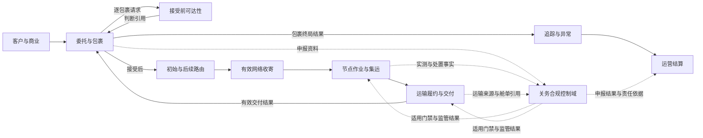

# 国际小包网络运营首发产品基线与开发主线

状态：产品级首发开发基线已确认；真实试点实例和参数仍由登记册维护

本文是 `idp-parcel` 的产品级开发入口。它把国际小包网络运营的核心闭环、限界上下文责任、首发纵向切片和端到端准入关系交给业务与开发团队。它不重新定义领域规则，不复制真实客户或线路参数，也不规定 API、数据库字段、消息 Schema、部署或对象存储实现。

## 纠偏结论

此前的关务首发工作是高风险控制域的专项验证，不是产品总体核心。关务专项继续保留并承担申报、合规、监管结果和范围化门禁责任；产品总体首发必须以包裹网络运营闭环为主线。

产品级主线与关务专项的关系如下：

流程图表达业务关系，不表示固定技术调用顺序。出口、进口和不同履约段的关务控制点可以位于不同阶段；关务只影响其明确适用的动作范围。

## 产品核心与控制域

| 层级 | 能力 | 主要所有者 | 首发要求 |
|---|---|---|---|
| 核心 | 客户账户、服务产品、合同、渠道授权和责任法人 | `party-commercial` | 商业对象独立发布、不可覆盖版本、两阶段唯一解析、客户隔离和责任依据 |
| 核心 | 客户委托、包裹永久身份、包裹谱系、面单交易、决定前撤回、包裹取消/收寄后处置、有效网络收寄解释和包裹终局 | `parcel-shipment` | 支持多包裹委托、接受基线、并发决定、逐包裹取消边界、收寄前后身份连续性和结果分层 |
| 核心 | 网络拓扑、可达性、路线和包裹路由计划 | `network-routing` | 形成可解释的可达性和路由版本，不把计划当作实际履约 |
| 核心 | 集货、分拣、测量、集运、封签和节点控制 | `node-operations` | 支持至少一个自营节点的专业小包作业，不扩展为完整 WMS |
| 核心 | 场外揽收、班次、容量、运输委托、交接、实际承运、交付和运输收费发生项 | `transport-fulfillment` | 支持自营/外包混合履约，保留逐对象交接、实际事实及原/替代旅程各自成本来源 |
| 核心 | 内部追踪投影、普通客户追踪、ETA、异常分诊、客户披露和索赔证据 | `visibility-exception` | 只消费已接受事实，按账户与对象授权隔离查询，并区分普通查询、异常披露、通知送达和客户确认 |
| 核心 | 可执行价卡、费率表、BUY/SELL/INTERNAL 纯计价评价和回放 | `parcel-pricing` | 价卡版本不可覆盖、评价可复算、价格方向隔离并通过受控案例验证 |
| 核心 | 费用采用、供应商预期成本/账单、运营应收、调整、真实收付映射、核销和经营结果 | `settlement-accounting` | 完成至少一个真实账期，固定调整唯一所有权并保持运营结算与法定财务分离 |
| 控制域 | 申报、合规判断、内部限制、监管凭证、监管结果和动作门禁 | `customs-compliance` | 对适用线路形成真实或受控验证；不拥有其他上下文事实 |

“核心”表示产品日常经营不可缺少的能力，不表示所有能力必须由同一上下文拥有。“控制域”可以阻断特定动作，但不产生全程统一状态，也不替代节点、运输、追踪或结算的决定。

## 端到端主链

主链从一份网络服务委托的提交开始，展示它最终被接受后的正常闭环。具体国家、渠道、字段、时限和税费适用性必须引用参数登记册，不由本文件推导。

| 阶段 | 业务结果 | 主要所有者 | 关务关系 |
|---|---|---|---|
| 1. 商业解析、委托接入、生产归属、接受前可达性与决定 | `party-commercial` 先从不可覆盖的已发布商业版本唯一解析客户、法人、产品、合同和规则；完整拟受理范围再取得唯一生产归属，仅在本产品取得权威后逐包裹形成接受前可达性，`parcel-shipment` 形成接受、拒绝、决定前撤回或尚未决定，并在接受时固定基线 | `party-commercial`、试点准入控制、`parcel-shipment`、`network-routing` | 可达性只消费适用合规资格和限制，不提前形成正式申报或监管结果 |
| 2. 接受后初始路由与复核 | 对已接受包裹重新评估并形成初始路由、无当前有效路由或判断未决，后续变化形成新路线版本 | `network-routing` | 消费合规区域或限制引用；不把接受前候选复制为路由计划，也不把路由选择当作监管批准 |
| 3. 有效网络收寄与节点作业 | 客户送站时由 `node-operations` 形成节点收寄，场外揽收时由 `transport-fulfillment` 形成揽收交接；`parcel-shipment` 消费适用来源形成统一的有效网络收寄结果，节点继续形成测量、作业、集运和封签事实 | `node-operations`、`transport-fulfillment`、`parcel-shipment` | 提供实测、状况和协作事实；不形成监管决定 |
| 4. 适用关务控制 | 建立案件、资料快照、申报授权、监管引用和范围化门禁 | `customs-compliance` | 只阻断受门禁约束的出库、移动、交付或提交动作 |
| 5. 取消/处置、运输履约、交付与包裹终局 | 接受后按包裹判断收寄前取消或收寄后服务处置；`transport-fulfillment` 形成承运接受、容量、交接、移动、派送尝试、有效交付、交付证据和适用运输收费发生项；`parcel-shipment` 再依据取消、交付、退运或其他合同责任结果逐包裹形成终局 | `parcel-shipment`、`transport-fulfillment` | 消费有效门禁和监管处置授权；处置决定、实际执行、运输交付、收费发生事实和包裹终局分别成立，互不覆盖 |
| 6. 普通追踪、异常与客户披露 | 由各源事实形成内部投影、标准里程碑、客户账户隔离的普通追踪视图、ETA、异常案件和披露决定 | `visibility-exception` | 消费关务事实；普通查询不代替异常披露或主动通知，不把异常或消息结果写回关务 |
| 7. 计价与结算 | `parcel-pricing` 按已解析商业依据和来源事实形成 SELL/BUY 纯评价；`settlement-accounting` 采用评价形成费用、供应商预期成本、账单/应收应付、调整、真实收付映射、核销和经营结果 | `parcel-pricing`、`settlement-accounting` | 消费税费核定、资金引用和责任依据；不把评价或发生项直接当金额责任，不把对方认可当到账或付款覆盖推导为放行 |

阶段不是单一全局状态机。每个上下文拥有自己的生命周期；端到端摘要只能由各自有效结果派生，不能由人工直接改写。

## 首发纵向开发切片

这些切片是产品主线，不是技术微服务拆分。每个切片都应穿过必要上下文，形成可验收的业务结果；缺少参数时只保留稳定骨架、`R/S` 验证或明确未配置分支。

| 顺序 | 产品切片 | 主要覆盖 | 完成定义 |
|---|---|---|---|
| PN-01 | 范围、责任与治理基础 | `PILOT-SCOPE`、`PILOT-PARAMETER-REGISTER`、`GOV-01`、`GOV-10`、`PAR-GOV-01..11` | 固定一个锚点客户、一条成熟主线路、责任法人和独立项目边界；建立阶段、权威方、准入、暂停恢复、接管及证据参数，不把尚未执行的阶段验收写成已完成 |
| PN-02 | 商业权威、生产归属、接受前可达性、委托与包裹身份 | 试点准入控制、`party-commercial`、`parcel-shipment`、`network-routing`、`UC-PC-001/002`、`UC-PS-001/002/005`、`UC-NR-002`、`CPS-01..04`、`CPS-06..11` 及 `CPS-05` 的预计承诺机制 | 商业对象分别形成不可覆盖发布版本并通过两阶段机制唯一解析；完整拟受理范围取得唯一生产归属后逐包裹形成可达性，再形成接受、拒绝、决定前撤回或尚未决定。并发决定、冻结释放、包裹身份、资料版本、判断依据和预计承诺可追溯 |
| PN-03 | 接受后路由、有效网络收寄与节点作业 | `network-routing`、`node-operations`、`transport-fulfillment`、`parcel-shipment`、`UC-NR-001/003`、`UC-NO-002/003`、`UC-TF-002`、`UC-PS-003`、`CPS-05`、`OPS-01..04/12/14` | 已接受包裹形成初始路由；客户送站与场外揽收分别由事实所有者形成逐对象结果，小包托运统一形成有效网络收寄与正式承诺；按实际接货位置和节点当前有效实测复核路线，并完成测量、分拣、集运和封签主链；不形成权威运输交接、容量预占或库存职责 |
| PN-04 | 包裹取消/收寄后处置、运输履约、交付与包裹终局 | `transport-fulfillment`、`parcel-shipment`、`UC-PS-004/006`、`UC-TF-003..007`、`OPS-05..11/13`、`CPS-12`、`SET-10` 的运输收费发生项部分 | 收寄前逐包裹取消与收寄后处置分流可追溯；班次、容量、承运接受、逐对象交接、实际移动、派送、有效交付、POD 和运输收费发生项分层形成；小包托运再形成独立终局 |
| PN-05 | 关务合规控制 | `customs-compliance`、`UC-CC-001..012` 及专项协作用例 `UC-NO-001`、`UC-TF-001`、`UC-VE-001`、`UC-SA-001`，`CUS-01..10`、关务专项切片 0 至 6（切片 0 含 `CC-S0-W01..W08`） | 适用程序完成申报和监管结果闭环；关务门禁只作用于明确动作，不取得网络事实所有权 |
| PN-06 | 普通追踪、异常与客户披露 | `visibility-exception`、`UC-VE-002..008`、`VIS-01..11` | 由源事实分别形成内部投影与客户授权追踪视图，再形成 ETA、异常、处置请求和逐客户披露；普通查询、异常通知和消息结果互不冒充 |
| PN-07 | 计价、账单与运营结算 | `parcel-pricing`、`settlement-accounting`、`UC-SA-001..007`、`SET-01..11` | 运输收费发生项经 BUY 纯评价后形成供应商预期成本；各类金额调整由唯一用例创建，对账只纳入既有调整；客户赔付、应追偿、认可、真实到账和核销分层；至少完成一个真实账期 |
| PN-08 | [端到端试点与阶段准入](../design/pn-08-end-to-end-pilot-and-stage-admission-development-handoff.md) | `E2E-01/02`、`GOV-01..10`、`INT-01..03`、`DAT-01..03`、`NFR-01..03`、`PAR-GOV-01..11`、`PAR-NFR-01..06` | 按 W01 至 W09 固定同版本候选包，完成回放、影子、限量生产、唯一权威、暂停恢复、对象级接管、真实主链/账期、POD 失效端到端更正、在途盘点和正式 `Go/No-Go`；不建立新的业务上下文或全局状态机 |

PN-01 建立 `GOV-02..09` 所需的规则、参数槽位和责任，不宣称已经取得回放、影子、限量生产或正式验收证据；这些证据和决定只在 PN-08 按实际阶段形成。`INT-01..03`、`DAT-01..03` 和 `NFR-01..03` 是从 PN-02 起随切片持续落实的横切验收要求，PN-08 负责总体证明，不能把它们推迟到最后才实现。

PN-08 是产品级试点治理与跨上下文应用编排，不是新的限界上下文。它可以保存候选清单、阶段决定、生产权威区间、暂停/恢复、接管和在途盘点等治理记录，但不拥有委托、包裹、路由、节点、运输、关务、追踪或结算事实，也不创建 `UC-GOV-*`。

关务专项可以与 PN-03、PN-04 并行准备，但其生产准入必须由端到端主链按依赖关系消费；完成 PN-05 不代表产品总体完成，完成其他切片也不能绕过适用关务门禁。

## 当前应用用例覆盖缺口

领域模型和验收矩阵已经覆盖产品全链路，但应用用例的细化程度明显不均衡。以下结论只描述当前文档覆盖，不代表未列出的能力不存在：

| 产品切片 | 当前已有通用用例 | 当前主要缺口 | 下一步 |
|---|---|---|---|
| PN-02 | `UC-PC-001/002`、`UC-PS-001/002/005`、`UC-NR-002` | 商业对象发布、两阶段唯一解析、接单机制、建单前来源重放/冲突、最小委托候选、决定前撤回和同租户提交批次边界已形成；生产持久化、归属端口、`已提交`聚合和事件事务尚未实现，真实商业版本、规则包、财务策略、角色、时点和试点参数仍待提供 | 按 [`PN-02` 真实参数取证与开发交接](../design/pn-02-real-parameter-evidence-and-development-handoff.md)并行落实稳定骨架、参数未配置和真实取证，保持“商业唯一解析 → 可达/财务判断 → 接受、拒绝或撤回”的决定边界 |
| PN-03 | `UC-NR-001/003`、`UC-NO-002/003`、`UC-TF-002`、`UC-PS-003` | 通用应用用例已经覆盖初始路由、两类真实收寄来源、正式承诺、路由复核和正常节点作业；真实收寄模式、资格、路由策略、节点/设备/SOP、外部来源和非功能参数仍待提供，当前代码尚未实现这些上下文 | 按 [`PN-03` 网络收寄与节点作业开发交接](../design/pn-03-network-intake-and-node-operations-development-handoff.md)推进 W01 至 W08；先实现稳定骨架和显式未配置，再以同版本参数完成 `P/R/S` 证据，不把文档完成解释为生产实现完成 |
| PN-04 | `UC-TF-003..007`、`UC-PS-004/006`；监管专项继续使用 `UC-TF-001` | 通用用例已经覆盖收寄前逐包裹取消、收寄后服务处置、运输机会、班次、容量、运输委托、承运接受、权威交接、实际履约段、派送、POD、收费发生项、替代/退运旅程及包裹终局；真实取消/处置、班次、容量、伙伴、交接、尾程、成本发生、终局和非功能参数仍待提供 | 按 [`PN-04` 运输履约与包裹终局开发交接](../design/pn-04-transport-fulfillment-and-parcel-finalization-development-handoff.md)推进 W01 至 W08；监管专项不得替代常规运输主链，文档完成不得解释为生产实现完成 |
| PN-05 | `UC-CC-001..012` | 真实程序、来源、角色、规则和复杂验证参数仍未确认 | 保留现有专项，不继续以增加关务用例替代真实取证 |
| PN-06 | `UC-VE-002..008`；关务专项继续使用 `UC-VE-001` | 通用用例已经覆盖内部投影、普通客户追踪、内部 ETA、ETA 对客可见性判断、可见性缺口、异常分诊/建案、案件响应/处置请求取消替代、客户通知和证据/索赔/追偿生命周期；真实来源、公开规则、合同、渠道和索赔参数仍待补齐 | 按 [`PN-06` 追踪、异常与客户披露开发交接](../design/pn-06-visibility-and-exception-development-handoff.md)推进 W01 至 W08；普通客户追踪不得直接暴露内部投影，关务专项不得替代通用主链 |
| PN-07 | `UC-SA-001..007` | 通用用例已经覆盖发生项到供应商预期成本、计价/财务控制、调整唯一所有权、既有调整后续账期纳入、供应商账单、客户对账、真实收付映射/核销、成本分摊、经营结果及赔付/追偿金额分层；真实价格、账户、账期、财务交换、分摊/毛利和联合账期参数仍待提供 | 按 [`PN-07` 运营结算与经营核算开发交接](../design/pn-07-operational-settlement-and-accounting-development-handoff.md)推进 W01 至 W09；先实现稳定骨架和显式未配置，再以同版本真实账期证据提交 PN-08 |
| PN-08 | 不新增独立业务用例；复用 `E2E-01/02`、`GOV-01..10` 和各切片候选 | [端到端试点与阶段准入开发交接](../design/pn-08-end-to-end-pilot-and-stage-admission-development-handoff.md)已形成 W01 至 W09 的稳定治理编排；真实 `PAR-GOV-*`、同版本证据、代码实现和阶段决定仍待完成 | 先建立候选版本组，依次执行回放、影子、限量生产和正式验收；任何局部切片不得自行批准生产范围 |

因此，PN-02 至 PN-07 的通用应用编排和 PN-08 的产品级试点治理交接均已形成；下一阶段按各交接文档取得真实参数、完成稳定骨架和同版本联合验证，再由 PN-08 形成实际阶段决定。每组用例只编排已有领域规则；遇到真实业务选择时回到参数登记册或单项业务决策，不用技术默认值补齐。

## 已确认的首发范围约束

以下范围以[首发试点范围](./PILOT-SCOPE.md)为准，本表只说明其在产品主线中的位置：

- 网络服务是首发对客服务形态；独立面单渠道服务不进入首发生产。
- 首发只覆盖一个真实锚点客户、一条成熟主线路、一个目的服务区域、至少一个自营节点和外部履约环节。
- 首发生产只有一个真实锚点客户；跨客户集运只使用受控测试账户和脱敏或合成数据按 `S` 验证，不形成第二个真实客户合同、运营应收或结算责任。长期产品允许跨客户集运，但客户合同、可见性、费用和责任必须隔离。
- 首发不包含 COD，不建设完整 WMS，不启用生产自动申报。
- 首发允许多份供应商价卡并存，对同一票逐候选形成 `BUY` 评价后按成本与时效、稳定性、赔付条件等维度择优；这是内部成本决策，不对客户形成价格承诺。系统从供应商最终价卡开始，不建设向承运商询价、竞价、招标或授予的采购过程。生产结算闭环仍只要求每个外包环节一个日常主合作伙伴完成真实账期。
- 备用伙伴切换、退运、复杂撤销重报、复杂税费/资金分支和自动异常/通知按参数与验收矩阵决定进入 `P`、`R/S` 或 `N/A`。

这些是首发范围约束，不应被误读为长期产品能力的永久禁止；长期边界仍由产品基线、上下文和 ADR 约束。

## 给开发的交接规则

- 先实现各核心上下文的稳定业务骨架，再按 PN 切片接入真实范围；不要把关务用例当作全局工作流或全局状态机。
- 每个跨上下文交接只传递其拥有的事实、判断或授权引用；接收方形成自己的结果，不共同编辑一个可覆盖结果。
- 关务限制、运输交接、节点控制、客户披露和运营结算分别拥有；任何一个结果都不能以“统一状态”覆盖其他结果。
- 真实参数和证据状态只在[首发试点参数与证据登记册](./PILOT-PARAMETER-REGISTER.md)维护。未确认值不能变成默认国家、角色、渠道、阈值、时限或动作顺序。
- 验收优先使用[首发试点验收场景矩阵](./PILOT-ACCEPTANCE-MATRIX.md)的 `P/R/S/N/A` 规则；不得为验收主动制造真实监管、履约、通知或金额事实。
- 任一核心能力未就绪时，只阻断依赖它的生产分支；已接受委托和在途对象必须保留稳定身份、当前责任方、下一行动和恢复边界。
- 阶段、暂停、恢复、发布版本回退、停止新准入和对象级接管是治理决定，不得被实现为包裹或运输全局状态；生产权威必须按对象范围、能力、事实类型和生效区间唯一。

## 权威关系与下一工作顺序

1. 本文件定义产品总体核心、纵向切片和关务控制域的相对位置。
2. [产品基线](./PRODUCT-BASELINE.md)和[领域上下文地图](../domain/CONTEXT-MAP.md)定义长期产品边界、语言和所有权。
3. [首发试点范围](./PILOT-SCOPE.md)、[验收场景矩阵](./PILOT-ACCEPTANCE-MATRIX.md)和[参数登记册](./PILOT-PARAMETER-REGISTER.md)定义本期真实范围、证据层级和参数状态。
4. [关务与贸易合规专项开发基线](./CUSTOMS-FIRST-RELEASE-DEVELOPMENT-BASELINE.md)及其工作单只负责 PN-05 的专项细化，不替代本文件。
5. 文档和开发先按 [`PN-02` 真实参数取证与开发交接](../design/pn-02-real-parameter-evidence-and-development-handoff.md)落实接单前置，再按 [`PN-03` 网络收寄与节点作业开发交接](../design/pn-03-network-intake-and-node-operations-development-handoff.md)推进接受后路由、收寄和节点作业，并按 [`PN-04` 运输履约与包裹终局开发交接](../design/pn-04-transport-fulfillment-and-parcel-finalization-development-handoff.md)推进常规运输与终局，再按 [`PN-06` 追踪、异常与客户披露开发交接](../design/pn-06-visibility-and-exception-development-handoff.md)和 [`PN-07` 运营结算与经营核算开发交接](../design/pn-07-operational-settlement-and-accounting-development-handoff.md)推进通用追踪/异常和运营结算工作包；PN-05 复用现有关务专项，最后按 [`PN-08` 端到端试点与阶段准入开发交接](../design/pn-08-end-to-end-pilot-and-stage-admission-development-handoff.md)执行 W01 至 W09。具体并行窗口由业务责任方根据参数登记册决定。

本文件不宣称任何真实线路、角色、规则、渠道或容量已经就绪。它只纠正产品主线，保留所有待确认参数和专项证据门槛。
