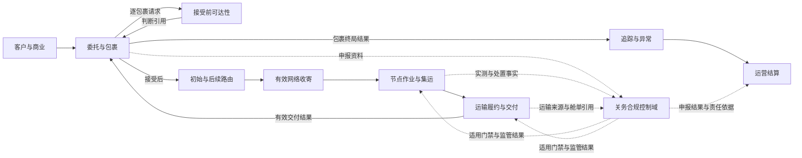

# 国际小包网络运营首发产品基线与开发主线

状态：产品级首发开发基线已确认；真实试点实例和参数仍由登记册维护

本文是 `idp-parcel` 的产品级开发入口。它把国际小包网络运营的核心闭环、限界上下文责任、首发纵向切片和端到端准入关系交给业务与开发团队。它不重新定义领域规则，不复制真实客户或线路参数，也不规定 API、数据库字段、消息 Schema、部署或对象存储实现。

## 纠偏结论

此前的关务首发工作是高风险控制域的专项验证，不是产品总体核心。关务专项继续保留并承担申报、合规、监管结果和范围化门禁责任；产品总体首发必须以包裹网络运营闭环为主线。

产品级主线与关务专项的关系如下：

流程图表达业务关系，不表示固定技术调用顺序。出口、进口和不同履约段的关务控制点可以位于不同阶段；关务只影响其明确适用的动作范围。

## 产品核心与控制域

| 层级 | 能力 | 主要所有者 | 首发要求 |
|---|---|---|---|
| 核心 | 客户账户、服务产品、合同、渠道授权和责任法人 | `party-commercial` | 商业对象独立发布、不可覆盖版本、两阶段唯一解析、客户隔离和责任依据 |
| 核心 | 客户委托、包裹永久身份、包裹谱系、面单交易、决定前撤回、包裹取消/收寄后处置、有效网络收寄解释和包裹终局 | `parcel-shipment` | 支持多包裹委托、接受基线、并发决定、逐包裹取消边界、收寄前后身份连续性和结果分层 |
| 核心 | 网络拓扑、可达性、路线和包裹路由计划 | `network-routing` | 形成可解释的可达性和路由版本，不把计划当作实际履约 |
| 核心 | 集货、分拣、测量、集运、封签和节点控制 | `node-operations` | 支持至少一个自营节点的专业小包作业，不扩展为完整 WMS |
| 核心 | 场外揽收、班次、容量、运输委托、交接、实际承运、交付和运输收费发生项 | `transport-fulfillment` | 支持自营/外包混合履约，保留逐对象交接、实际事实及原/替代旅程各自成本来源 |
| 核心 | 内部追踪投影、普通客户追踪、ETA、异常分诊、客户披露和索赔证据 | `visibility-exception` | 只消费已接受事实，按账户与对象授权隔离查询，并区分普通查询、异常披露、通知送达和客户确认 |
| 核心 | 可执行价卡、费率表、BUY/SELL/INTERNAL 纯计价评价和回放 | `parcel-pricing` | 价卡版本不可覆盖、评价可复算、价格方向隔离并通过受控案例验证 |
| 核心 | 费用采用、供应商预期成本/账单、运营应收、调整、真实收付映射、核销和经营结果 | `settlement-accounting` | 完成至少一个真实账期，固定调整唯一所有权并保持运营结算与法定财务分离 |
| 控制域 | 申报、合规判断、内部限制、监管凭证、监管结果和动作门禁 | `customs-compliance` | 对适用线路形成真实或受控验证；不拥有其他上下文事实 |

“核心”表示产品日常经营不可缺少的能力，不表示所有能力必须由同一上下文拥有。“控制域”可以阻断特定动作，但不产生全程统一状态，也不替代节点、运输、追踪或结算的决定。

## 端到端主链

主链从一份网络服务委托的提交开始，展示它最终被接受后的正常闭环。具体国家、渠道、字段、时限和税费适用性必须引用参数登记册，不由本文件推导。

| 阶段 | 业务结果 | 主要所有者 | 关务关系 |
|---|---|---|---|
| 1. 商业解析、委托接入、生产归属、接受前可达性与决定 | `party-commercial` 先从不可覆盖的已发布商业版本唯一解析客户、法人、产品、合同和规则；完整拟受理范围再取得唯一生产归属，仅在本产品取得权威后逐包裹形成接受前可达性，`parcel-shipment` 形成接受、拒绝、决定前撤回或尚未决定，并在接受时固定基线 | `party-commercial`、试点准入控制、`parcel-shipment`、`network-routing` | 可达性只消费适用合规资格和限制，不提前形成正式申报或监管结果 |
| 2. 接受后初始路由与复核 | 对已接受包裹重新评估并形成初始路由、无当前有效路由或判断未决，后续变化形成新路线版本 | `network-routing` | 消费合规区域或限制引用；不把接受前候选复制为路由计划，也不把路由选择当作监管批准 |
| 3. 有效网络收寄与节点作业 | 客户送站时由 `node-operations` 形成节点收寄，场外揽收时由 `transport-fulfillment` 形成揽收交接；`parcel-shipment` 消费适用来源形成统一的有效网络收寄结果，节点继续形成测量、作业、集运和封签事实 | `node-operations`、`transport-fulfillment`、`parcel-shipment` | 提供实测、状况和协作事实；不形成监管决定 |
| 4. 适用关务控制 | 建立案件、资料快照、申报授权、监管引用和范围化门禁 | `customs-compliance` | 只阻断受门禁约束的出库、移动、交付或提交动作 |
| 5. 取消/处置、运输履约、交付与包裹终局 | 接受后按包裹判断收寄前取消或收寄后服务处置；`transport-fulfillment` 形成承运接受、容量、交接、移动、派送尝试、有效交付、交付证据和适用运输收费发生项；`parcel-shipment` 再依据取消、交付、退运或其他合同责任结果逐包裹形成终局 | `parcel-shipment`、`transport-fulfillment` | 消费有效门禁和监管处置授权；处置决定、实际执行、运输交付、收费发生事实和包裹终局分别成立，互不覆盖 |
| 6. 普通追踪、异常与客户披露 | 由各源事实形成内部投影、标准里程碑、客户账户隔离的普通追踪视图、ETA、异常案件和披露决定 | `visibility-exception` | 消费关务事实；普通查询不代替异常披露或主动通知，不把异常或消息结果写回关务 |
| 7. 计价与结算 | `parcel-pricing` 按已解析商业依据和来源事实形成 SELL/BUY 纯评价；`settlement-accounting` 采用评价形成费用、供应商预期成本、账单/应收应付、调整、真实收付映射、核销和经营结果 | `parcel-pricing`、`settlement-accounting` | 消费税费核定、资金引用和责任依据；不把评价或发生项直接当金额责任，不把对方认可当到账或付款覆盖推导为放行 |

阶段不是单一全局状态机。每个上下文拥有自己的生命周期；端到端摘要只能由各自有效结果派生，不能由人工直接改写。

## 首发纵向开发切片

这些切片是产品主线，不是技术微服务拆分。每个切片都应穿过必要上下文，形成可验收的业务结果；缺少参数时只保留稳定骨架、`R/S` 验证或明确未配置分支。

| 顺序 | 产品切片 | 主要覆盖 | 完成定义 |
|---|---|---|---|
| PN-01 | 范围、责任与治理基础 | `PILOT-SCOPE`、`PILOT-PARAMETER-REGISTER`、`GOV-01`、`GOV-10`、`PAR-GOV-01..11` | 固定一个锚点客户、一条成熟主线路、责任法人和独立项目边界；建立阶段、权威方、准入、暂停恢复、接管及证据参数，不把尚未执行的阶段验收写成已完成 |
| PN-02 | 商业权威、生产归属、接受前可达性、委托与包裹身份 | 试点准入控制、`party-commercial`、`parcel-shipment`、`network-routing`、`UC-PC-001/002`、`UC-PS-001/002/005`、`UC-NR-002`、`CPS-01..04`、`CPS-06..11` 及 `CPS-05` 的预计承诺机制 | 商业对象分别形成不可覆盖发布版本并通过两阶段机制唯一解析；完整拟受理范围取得唯一生产归属后逐包裹形成可达性，再形成接受、拒绝、决定前撤回或尚未决定。并发决定、冻结释放、包裹身份、资料版本、判断依据和预计承诺可追溯 |
| PN-03 | 接受后路由、有效网络收寄与节点作业 | `network-routing`、`node-operations`、`transport-fulfillment`、`parcel-shipment`、`UC-NR-001/003`、`UC-NO-002/003`、`UC-TF-002`、`UC-PS-003`、`CPS-05`、`OPS-01..04/12/14` | 已接受包裹形成初始路由；客户送站与场外揽收分别由事实所有者形成逐对象结果，小包托运统一形成有效网络收寄与正式承诺；按实际接货位置和节点当前有效实测复核路线，并完成测量、分拣、集运和封签主链；不形成权威运输交接、容量预占或库存职责 |
| PN-04 | 包裹取消/收寄后处置、运输履约、交付与包裹终局 | `transport-fulfillment`、`parcel-shipment`、`UC-PS-004/006`、`UC-TF-003..007`、`OPS-05..11/13`、`CPS-12`、`SET-10` 的运输收费发生项部分 | 收寄前逐包裹取消与收寄后处置分流可追溯；班次、容量、承运接受、逐对象交接、实际移动、派送、有效交付、POD 和运输收费发生项分层形成；小包托运再形成独立终局 |
| PN-05 | 关务合规控制 | `customs-compliance`、`UC-CC-001..012` 及专项协作用例 `UC-NO-001`、`UC-TF-001`、`UC-VE-001`、`UC-SA-001`，`CUS-01..10`、关务专项切片 0 至 6（切片 0 含 `CC-S0-W01..W08`） | 适用程序完成申报和监管结果闭环；关务门禁只作用于明确动作，不取得网络事实所有权 |
| PN-06 | 普通追踪、异常与客户披露 | `visibility-exception`、`UC-VE-002..008`、`VIS-01..11` | 由源事实分别形成内部投影与客户授权追踪视图，再形成 ETA、异常、处置请求和逐客户披露；普通查询、异常通知和消息结果互不冒充 |
| PN-07 | 计价、账单与运营结算 | `parcel-pricing`、`settlement-accounting`、`UC-SA-001..007`、`SET-01..11` | 运输收费发生项经 BUY 纯评价后形成供应商预期成本；各类金额调整由唯一用例创建，对账只纳入既有调整；客户赔付、应追偿、认可、真实到账和核销分层；至少完成一个真实账期 |
| PN-08 | [端到端试点与阶段准入](../design/pn-08-end-to-end-pilot-and-stage-admission-development-handoff.md) | `E2E-01/02`、`GOV-01..10`、`INT-01..03`、`DAT-01..03`、`NFR-01..03`、`PAR-GOV-01..11`、`PAR-NFR-01..06` | 按 W01 至 W09 固定同版本候选包，完成回放、影子、限量生产、唯一权威、暂停恢复、对象级接管、真实主链/账期、POD 失效端到端更正、在途盘点和正式 `Go/No-Go`；不建立新的业务上下文或全局状态机 |

PN-01 建立 `GOV-02..09` 所需的规则、参数槽位和责任，不宣称已经取得回放、影子、限量生产或正式验收证据；这些证据和决定只在 PN-08 按实际阶段形成。`INT-01..03`、`DAT-01..03` 和 `NFR-01..03` 是从 PN-02 起随切片持续落实的横切验收要求，PN-08 负责总体证明，不能把它们推迟到最后才实现。

PN-08 是产品级试点治理与跨上下文应用编排，不是新的限界上下文。它可以保存候选清单、阶段决定、生产权威区间、暂停/恢复、接管和在途盘点等治理记录，但不拥有委托、包裹、路由、节点、运输、关务、追踪或结算事实，也不创建 `UC-GOV-*`。

关务专项可以与 PN-03、PN-04 并行准备，但其生产准入必须由端到端主链按依赖关系消费；完成 PN-05 不代表产品总体完成，完成其他切片也不能绕过适用关务门禁。

## 当前应用用例覆盖缺口

领域模型和验收矩阵已经覆盖产品全链路，但应用用例的细化程度明显不均衡。以下结论只描述当前文档覆盖，不代表未列出的能力不存在：

| 产品切片 | 当前已有通用用例 | 当前主要缺口 | 下一步 |
|---|---|---|---|
| PN-02 | `UC-PC-001/002`、`UC-PS-001/002/005`、`UC-NR-002` | 商业对象发布、两阶段唯一解析、接单机制、建单前来源重放/冲突、最小委托候选、决定前撤回和同租户提交批次边界的用例口径已经写全；真实商业版本、规则包、财务策略、角色、时点和试点参数仍待提供。**代码落到哪一步不写在本行**：本节按开头的声明只说文档覆盖，实现现状以[机制半边现状](#机制半边现状)为准。此前本行复述实现进度，已经因此烂过一次——它写着「客户原始资料版本仍只有领域层、尚无应用编排」时，那份编排早已落地并走到步骤 9 | 按 [`PN-02` 真实参数取证与开发交接](../design/pn-02-real-parameter-evidence-and-development-handoff.md)并行落实稳定骨架、参数未配置和真实取证，保持“商业唯一解析 → 可达/财务判断 → 接受、拒绝或撤回”的决定边界 |
| PN-03 | `UC-NR-001/003`、`UC-NO-002/003`、`UC-TF-002`、`UC-PS-003` | 通用应用用例已经覆盖初始路由、两类真实收寄来源、正式承诺、路由复核和正常节点作业；真实收寄模式、资格、路由策略、节点/设备/SOP、外部来源和非功能参数仍待提供，当前代码尚未实现这些上下文 | 按 [`PN-03` 网络收寄与节点作业开发交接](../design/pn-03-network-intake-and-node-operations-development-handoff.md)推进 W01 至 W08；先实现稳定骨架和显式未配置，再以同版本参数完成 `P/R/S` 证据，不把文档完成解释为生产实现完成 |
| PN-04 | `UC-TF-003..007`、`UC-PS-004/006`；监管专项继续使用 `UC-TF-001` | 通用用例已经覆盖收寄前逐包裹取消、收寄后服务处置、运输机会、班次、容量、运输委托、承运接受、权威交接、实际履约段、派送、POD、收费发生项、替代/退运旅程及包裹终局；真实取消/处置、班次、容量、伙伴、交接、尾程、成本发生、终局和非功能参数仍待提供 | 按 [`PN-04` 运输履约与包裹终局开发交接](../design/pn-04-transport-fulfillment-and-parcel-finalization-development-handoff.md)推进 W01 至 W08；监管专项不得替代常规运输主链，文档完成不得解释为生产实现完成 |
| PN-05 | `UC-CC-001..012` | 真实程序、来源、角色、规则和复杂验证参数仍未确认 | 保留现有专项，不继续以增加关务用例替代真实取证 |
| PN-06 | `UC-VE-002..008`；关务专项继续使用 `UC-VE-001` | 通用用例已经覆盖内部投影、普通客户追踪、内部 ETA、ETA 对客可见性判断、可见性缺口、异常分诊/建案、案件响应/处置请求取消替代、客户通知和证据/索赔/追偿生命周期；真实来源、公开规则、合同、渠道和索赔参数仍待补齐 | 按 [`PN-06` 追踪、异常与客户披露开发交接](../design/pn-06-visibility-and-exception-development-handoff.md)推进 W01 至 W08；普通客户追踪不得直接暴露内部投影，关务专项不得替代通用主链 |
| PN-07 | `UC-SA-001..007` | 通用用例已经覆盖发生项到供应商预期成本、计价/财务控制、调整唯一所有权、既有调整后续账期纳入、供应商账单、客户对账、真实收付映射/核销、成本分摊、经营结果及赔付/追偿金额分层；真实价格、账户、账期、财务交换、分摊/毛利和联合账期参数仍待提供 | 按 [`PN-07` 运营结算与经营核算开发交接](../design/pn-07-operational-settlement-and-accounting-development-handoff.md)推进 W01 至 W09；先实现稳定骨架和显式未配置，再以同版本真实账期证据提交 PN-08 |
| PN-08 | 不新增独立业务用例；复用 `E2E-01/02`、`GOV-01..10` 和各切片候选 | [端到端试点与阶段准入开发交接](../design/pn-08-end-to-end-pilot-and-stage-admission-development-handoff.md)已形成 W01 至 W09 的稳定治理编排；真实 `PAR-GOV-*`、同版本证据、代码实现和阶段决定仍待完成 | 先建立候选版本组，依次执行回放、影子、限量生产和正式验收；任何局部切片不得自行批准生产范围 |

因此，PN-02 至 PN-07 的通用应用编排和 PN-08 的产品级试点治理交接均已形成。每组用例只编排已有领域规则；遇到真实业务选择时回到参数登记册或单项业务决策，不用技术默认值补齐。

上表各行「仍待提供」的真实参数属**实例半边**，见下文[切片的机制半边与实例半边](#切片的机制半边与实例半边)。它们在尚无租户时不可能取得，因此不构成机制半边的完成障碍，也不得反过来当作推迟机制实现的理由。

## 已确认的首发范围约束

以下范围以[首发试点范围](./PILOT-SCOPE.md)为准，本表只说明其在产品主线中的位置：

- 首发对客服务形态是网络服务与面单渠道服务的明确组合（[ADR-0088](../adr/0088-label-channel-service-enters-the-first-release-service-forms.md) 修订；此前为「独立面单渠道服务不进入首发生产」）。两种形态分别表达责任，一份委托属哪种形态按其采用的服务产品版本判断。
- 首发只覆盖一个真实锚点客户、一条成熟主线路、一个目的服务区域、至少一个自营节点和外部履约环节。「一条主线路」作用于网络服务主链路；面单渠道服务的首发范围以登记的渠道产品与产品—渠道映射为界，不以线路表达。
- 首发生产只有一个真实锚点客户；跨客户集运只使用受控测试账户和脱敏或合成数据按 `S` 验证，不形成第二个真实客户合同、运营应收或结算责任。长期产品允许跨客户集运，但客户合同、可见性、费用和责任必须隔离。
- 首发不包含 COD，不建设完整 WMS，不启用生产自动申报。
- 首发允许多份供应商价卡并存，对同一票逐候选形成 `BUY` 评价后按成本单维择优，择优由 `network-routing` 形成；这是内部成本决策，不对客户形成价格承诺。系统从供应商最终价卡开始，不建设向承运商询价、竞价、招标或授予的采购过程。生产结算闭环仍只要求每个外包环节一个日常主合作伙伴完成真实账期。
- 备用伙伴切换、退运、复杂撤销重报、复杂税费/资金分支和自动异常/通知按参数与验收矩阵决定进入 `P`、`R/S` 或 `N/A`。

这些是首发范围约束，不应被误读为长期产品能力的永久禁止；长期边界仍由产品基线、上下文和 ADR 约束。

## 产品就绪与试点就绪

首发有两个不同的就绪概念。此前文档只承认后者，于是每个能力问题都被迫套用「等真实证据」的口径。

**试点就绪**：某个**运营集团租户**有真实锚点货主客户、真实线路和真实参数，可按[验收场景矩阵](./PILOT-ACCEPTANCE-MATRIX.md)形成 `P` 级证据并由 PN-08 作出正式 `Go/No-Go`。它的验收对象是**真实业务证据**。

**产品就绪**：能力覆盖足以承接目标客户群的常规业务形态，可以演示、可以进入商务洽谈。它的验收对象是**能力覆盖**，不是真实业务证据。

两者是顺序关系而非替代关系：没有产品就绪就谈不下租户，没有租户就没有锚点客户，没有锚点客户就取不到真实参数。只承认试点就绪会让这三步互相等待。

**本产品是软件产品，`idp-parcel` 的开发方不是运营企业。** 文档中的「运营企业」一律指购买本产品的租户，其定义见 [`party-commercial`](../domain/party-commercial/CONTEXT.md) 的运营集团租户与 [ADR-0003](../adr/0003-group-tenant-legal-entity-customer-account.md)。锚点货主客户是租户的客户，与开发方隔着两级。价卡、客户合同、供应商协议、业务量基线都是租户与其相对方之间的文件，开发方不可能持有；当前**尚无租户实例**，因此这些参数不是"还没拿到"，是尚无产生它们的关系。

### 切片的机制半边与实例半边

每个 `PN-*` 切片都含两半。**机制半边**是产品必须具备的能力——规则、判断、版本化、门禁与记录形态；**实例半边**是把某个租户的真实客户、线路、伙伴、参数和阶段决定填进去。上表的「完成定义」把两半写在同一句里，于是每个切片看起来都不可达。

以 PN-01 为例：「建立阶段、权威方、准入、暂停恢复、接管及证据参数」是机制，现在就能做完；「固定一个锚点客户、一条成熟主线路、责任法人」是实例，没有租户填不了。PN-08 同样分得开：保存候选清单、阶段决定、生产权威区间、暂停恢复、接管与在途盘点的**记录能力**是机制，实际执行回放、影子、限量生产并作出 `Go/No-Go` 是实例。

**产品就绪 = 八个切片的机制半边全部达标**，判据三项：

| 判据 | 含义 |
|---|---|
| 骨架完整 | 该切片的规则与判断都有执行器，不靠「尚未实现」分支蒙混过关 |
| 受控案例可复算 | 有受控案例集，结果可重放且与声明一致 |
| 参数显式未配置 | 实例位置留空并拒绝默认值，不写死任何取值 |

**试点就绪 = 某个租户把实例半边填满并走完 PN-08。** 它不是开发方的里程碑，也不在开发方的可达路线图内——`Go/No-Go` 按定义由该租户责任法人指定的试点业务责任角色作出，开发方作不了这个决定。

这条划分不放松任何门禁：机制达标不等于任何租户可以上生产，实例证据仍按原规则形成。两条轨道的完整决定与被否决的替代方案见 [ADR-0016](../adr/0016-product-delivery-and-tenant-pilot-as-parallel-tracks.md)。

**`No-Go / 待参数化` 只约束生产结论，不约束能力范围。** 「未确认参数不得成为生产默认值」这条红线完全不变——它约束的是取值，不是产品支持哪些形态。

### 机制半边现状

上节定了判据却没说现在站在哪里，判据因此还用不上。下表按三条判据逐切片定级，**只描述机制半边**；实例半边一律为空且不计入。代码事实核对于 `internal/` 与 `cmd/`，用例与规则事实核对于各 `CONTEXT.md` 与 `UC-*`。

**本节只定级，不再报数。** 它与本文其余部分性质不同：其余部分说明产品长期必须保持什么，本节只说明某一刻站在哪里。

**所有可由代码算出的数在[机制半边清点](./MECHANISM-INVENTORY.md)**——逐上下文的生产/测试文件、应用编排、PostgreSQL 与 HTTP 适配器、Outbox 投递、跨上下文消费缝、迁移份数、接线面的接入面端点／消费适配器／直投路由表条目，与端口两口径缺口。那份报告由 `tools/mechanism-inventory` 生成，CI 每次重新生成并与提交进来的那份比对，不一致即失败。**引计数一律引它，不要引本节正文。**

**本节正文里仍留着的数是历史叙述，锚在 `f6f0029`（2026-08-27，第二十七轮手工重盘，原始取证在 `.scratch/mechanism-reinventory-r27/`），一律已被上述报告取代。** 它们记的是各项能力当时怎么长起来的，不是现状；照它们判断今天有多少东西会判错。手工重盘就此停止——二十七轮里每一轮都在追一个当天就会变旧的数，而那份追赶从来没有一次追上过。

状态列于 2026-08-28 随受托认可更新（认可记录见 `.scratch/development-plan-2026-08-20.md` 复核记录末条）。**读到与代码不符时以代码为准**，不要据本节推断某项能力不存在。

定级触发条件两项，任一成立即须重新定级：某上下文首次出现生产代码；某切片的状态定级发生变化。**计数不再是触发条件**——它由生成物承担，人不必再看。

状态三种：**达标**（三条判据都满足）、**部分**（有生产代码但判据未齐）、**未开始**（无生产代码）。「达标」可带「显式留待已认可」注：留待项经受托裁断认可后，骨架完整按「余量全为有裁定的实例半边或排期留待」口径读（清单与认可见 r27 报告第五节）。

| 切片 | 主要上下文 | 状态 | 机制半边缺什么 |
|---|---|---|---|
| PN-01 | 治理，`pilotgovernance` 承载记录能力 | 达标 | 记录能力已有代码：候选版本组（三引用一次进入不可扩张）、阶段评审决定（首评如实记`尚未进入执行阶段`、No-Go 必带封闭四值处置、Go 偏差六件齐全）、生产权威区间冲突检测（同维重叠逐对列出）、暂停/恢复/接管/在途盘点（恢复必带盘点、接管停写证据先行、盘点逐项六件不重）。编排两例：阶段评审（候选组引用完整性、同键一次决定、权威冲突先于落库、区间追加失败留续办重放补追加）与治理事件（恢复挂暂停、接管撞开区间即阻断、记录不可覆盖）。真实 `PAR-GOV-*` 参数与实际阶段决定属实例半边不计 |
| PN-02 | `party-commercial`、`parcel-shipment`、`network-routing` | 达标（显式留待已认可） | 三个上下文都已有生产代码：`parcel-shipment` 覆盖来源身份与保全、生产归属决定、安全交接判定、提交候选与批次，并有 `UC-PS-001` 的应用编排与自有端口；`party-commercial` 的领域层已基本铺满——参与方关系、服务产品、客户合同、接单规则包、结算/信用/价格政策、供应商协议、授权授予各有模型，之上是商业版本共同不变量、发布登记册、`UC-PC-002` 两阶段解析（含范围级权威视图修订与提交前重解）与引用闭包，并有该用例第一阶段的应用编排与自有端口，其后补上步骤 8 的提交前重解：闭包一级的重校验按原查询重解而不是逐个检查已采用对象（同范围新增竞争候选时那些对象一字未动，解析却已不再唯一），解析键随闭包走以免一次「校验」拿另一范围的视图作证，`已失效`与`适用冲突`分成两种答案（前者要重解，后者要商业责任方去修），权威读不回则既不确认也不否定而保持可续办的`解析未决`；步骤 6 的逐项 `asOf` 编排其后也补上，`UC-PC-002` 两阶段与提交前重解至此都有编排：时点政策端口与权威视图端口分开（合成一个，规则包就有机会参与决定它自己被选中的时间，而两阶段拆开的全部理由正是避免这一点），编排的输入是第一阶段的结果本身而非调用方另给的规则包，逐项时点各自成形而不压成一个全局时间，未成形分成`未配置`（等 `PAR-COM-14` 落地）、`未决`（等依赖恢复）、`值不合法`（调用方改请求）与`依据未解析`（先回第一阶段）四格，且全有或全无不逐项部分成功。没有租户时这条必然停在`未配置`——那是首发唯一走得到的真实分支，不拿系统当前时间顶替。**那条时点翻译缝其后由第一个跨上下文适配器接上**：`internal/parcelshipment/adapters/partycommercial/` 实现了消费方 `CommercialBasisResolver` 全部三个阶段（解析与快照、逐项时点、提交前重解），值按声明语义在适配器形成、未配置停在`未配置`，内容声明按 ADR-0042 端口在唯一选出后读取；第二个适配器 `adapters/settlementaccounting/` 随后接通接受前财务控制的施加与释放，作用域与金额仍是实例半边（各等 ADR-0044 缝与计价缝）；`network-routing` 覆盖接受前可达性的三值结论与证据缺口判定，并有 `UC-NR-002` 的应用编排与自有端口，覆盖受理、幂等与冲突、商业适用与不适用、候选装配和三值结论。`UC-PS-001` 此后走完到步骤 8：三条腿的权威判断译成校验结果，适用校验组由接单规则包声明、覆盖检查落在聚合，据以形成接受、拒绝或`尚未决定`；接受判断任务带追加式处理尝试，人工复核完成与授权角色主动拒绝各有入口且竞争同一决定边界，接受确定未成立时按原关联释放冻结；未决按接受判断任务的三个等待态分流续办路径，客户可补充缺口、内部续办与人工复核各走各的原因与路径。`UC-PS-005` 决定前撤回与客户原始资料版本此后都开了代码：撤回成为决定边界的第三个竞争者（先到者胜、任务停止而非完成、释放作为可补偿编排不回滚已成立的撤回），应用编排此后补齐步骤 1 而覆盖步骤 1-6：撤回请求的来源身份与产生委托的那次提交分开登记，因此保全先于一切业务判断，同身份同内容在来源层短路而不再走一遍授权与决定边界，`AT-PS-069`「同一请求身份携带不同内容形成来源冲突」随之落地；客户原始资料版本有版本追加、采用判断两层与接受基线成员守卫，`UC-PS-002` 的应用编排此后也开了：授权与已登记规则两道闸门都排在版本标识签发之前，因此未获授权或规则没放行的尝试不消耗稀缺身份，未获授权、未登记（停`待复核`）与已登记为不允许（业务拒绝）分成三种答案而不合成一格；重放读回它当初形成的那份版本且不重跑授权与规则，同身份不同内容成请求冲突，`AT-PS-016`/`AT-PS-017` 随之落地。接受基线成员守卫此后交回 `AT-PS-023` 要的业务拒绝，并挪到了规则矩阵查询之前——用例的步骤 5 本就排在步骤 6 之前，而接受基线自己就是成员集合的权威，这一拒不需要任何已登记目录；压在矩阵之后时，一次矩阵读不回会把一个确定的业务拒绝变成未决，客户被告知「等依赖恢复」，而真相是这个请求无论矩阵怎么登记都不成立。它是上面「两道闸门排在版本标识签发之前」的延伸：本上下文自己答得出的拒绝，排在任何外部查询之前。目前只此一例，因此不记为第六条共有编排形状。步骤 9 的下游交接此后也开了，`UC-PS-002` 的机制半边因此走完步骤 1-9，`AT-PS-031`「版本只形成一次、仅重试同一发布意图」落地：一份版本发一份「资料版本已形成」意图而不按下游拆端口（哪些下游该重新判断是下游自己的事，拆端口会把那份判断搬进本上下文），意图带版本引用、范围与当前采用判断而不带资料内容，交接排在落库之后（反过来则保存失败时下游已按一份不存在的版本判过了），首次交接失败停在`技术未形成`且版本不重形成，重放重发同一份意图并由版本标识认领。编排刻意不记「意图完没完成」——那份状态要与版本同一事务落库才算数。**那份原子性此后被证明**：`OutboxSourceDataHandoff` 入队走 `RequireExecutor`，无事务直接报错而不是悄悄用连接池，意图因此只可能与调用方同一事务落库、回滚时一并消失，`AT-PS-031` 要的「仅重试同一发布意图」由 `outboxintent.EnqueueOnce` 的先查后插承担。PC 侧此后再补两件：解析闭包按标识落库（`CommercialResolutionStore` 的 Save 不覆盖，第一阶段固定的那份闭包写下来供第二阶段回读），以及解析内容冲突从技术错误改判为业务答案（`Fixed()` 交回三格代数，消费侧穷举写入结果、冲突落`无法判定`而不是`无适用依据`，认不出的取值上抛 `ErrUntranslatableAnswer` 而不留 default 兜底）。第二十七轮前后又收四件：SA 接受前控制策略视图有了生产适配器（ADR-0079 凭商业解析回指提问，SA→PC 消费缝落在 ADR-0054 预留落点，实现期同笔修复闭包「写得进读不回」的持久化缺陷）；结算政策正文接上发布通道、解析键登记面扩结算三维（商业闭包结算键两票）；接受判断改为信封驱动（ADR-0081：提交即交出「委托已提交」信封，推进在派发一拍，往返取证过生产消费门）。剩下的与其余切片同一组，见下方横切缺口 |
| PN-03 | `network-routing`、`node-operations`、`transport-fulfillment`、`parcel-shipment` | 达标（显式留待已认可） | 主链每环有编排且相互接通：NR 有 `UC-NR-001` 初始路由（评估管线五层进领域、ADR-0046）与 `UC-NR-003` 复核（计划适用性生命周期、触发权威性、7B/7C 受控改路三态分派）；NO 有节点收寄对象与 `UC-NO-002` 收寄编排（接收观察三态×身份三走向）、实物控制生命周期（两来源成立、仅凭已交接转出、逐对象）、集运单元实例（封装冻结快照不覆盖、终局不重开）；PS 有 `UC-PS-003` 采用编排（幂等键+内容指纹、责任起点唯一、资格未配置即未决）与正式承诺（生效恒取物理时间、调整换版本）；跨上下文适配器把 NO/TF→PS→NR 物理接通（收寄采用触发路由复核端到端有测试）。余量为外部标识关系子域（`CONTEXT` 判归 PS 所有而零代码，「不由消费侧端口倒逼开子域」的裁定与等排期记录在案）与 NO 身份读口的显式未配置桩（第二十七轮计数） |
| PN-04 | `transport-fulfillment`、`parcel-shipment` | 达标 | TF 机制骨架收口：揽收/履约尝试（逐对象结果、失败不造段）、揽派任务（工作范围不等于到场、改约不改身份、关闭带依据一次为限）、派送与 POD（有效交付只由妥投形成、更正版本链）、权威交接（三值、转出引用只在已交接、批次只派生）、实际履约段（控制事实成段、中断不结束）、替代/退运旅程（关联但独立、监管来路分格）、收费发生项（无金额字段、原/替代旅程不合并）、班次容量（三量守恒）、委托/订舱/承运接受（接受才成约）、装载分配与实际移动（意图与事实分开、门禁出发可阻断）；TF 编排三例接通三大控制事实：交付生效（按对象尝试幂等、失败结果业务负向、更正走版本链）、揽收登记（失败到访无可登、控制依据与接货时间保全为责任起点锚）、交接登记（三裁决都可登但拒收/待确认不给转出引用、只翻裁决同字段也算冲突）；PS 有 `UC-PS-006` 取消（提交边界重读、待处置分流）与 `UC-PS-004` 终局（责任结果联合封闭四值、规则版本必备、同源重派生、委托完成派生）；第八/九适配器接通交付→终局与交接→控制转出。TF 编排八例对应七个 UC 全触（委托订舱一订舱一应答、替代/退运旅程监管双链非监管单链、运输机会班次容量分立超限带余量拒、监管处置承接三格决定且扣留不是移动授权——承接记录携依据种类供旅程启动直接消费）；NO 补齐加工合箱（跨单元单父级核对、封装快照随意图、终局不重演）。端口已接满（第二十七轮：TF 24 口两口径 0 缺） |
| PN-05 | `customs-compliance` | 达标 | 领域面全链有代码：监管决定四件唯一关联、处置执行核对五值（决定推导不出执行）、监管限制与方向动作门禁（接收/隔离/测量无格可阻断、解除只凭监管结果）、申报单元/就绪与授权双形（分别形成和失效）/不可覆盖提交版本/受控重发（安全再发判断必备）、税费核对三轴独立（互斥总状态明禁）与税费付款协作事项（缺结果不等于不用付）、放行三值只来自监管来源、放行门禁五值绑定动作与边界、外部舱单引用（只接受不代作、三维唯一匹配）、案件关闭核对与受控重开、合规判断四件与凭证三维适用性、后续申报动作目标四道分立（拟替代生效只凭外部结果）、外部监管结果六层分立（层间不派生、同层冲突不覆盖）、关务案件（四维身份责任容器、包裹关联只引用、角色不推导）。编排九例（立案、外部结果接收、提交申报、处置执行核对、案件关闭、内部限制、放行门禁核对、后续申报动作、外部舱单引用）——十二个 UC 全部有对应机制触点；端口已接满（第二十七轮：CC 40 口两口径 0 缺——门禁条件与案件三册两张目录读口本轮新开同绿，编排 12 份，含原案内更正/补充与外部舱单） |
| PN-06 | `visibility-exception` | 达标（显式留待已认可） | 领域面收口：已接受源事实（三时间分存、源上下文封闭五值）、里程碑归类（未归类是真话）、投影版本化（只引用不复制）、冲突裁决按业务时间（无来源排名/最后消息两格）、客户视图四维三态（投影锚+账户隔离）、信号发作期（连续命中更新、恢复后关联新发作期）、分诊四走向、案件三态精简生命周期与受控归并、处置请求（七件、过期拒晚受、取消替代只改未来意图）、ETA 七件与可见性缺口（窗口届满才成）、索赔三判分立与受控复核、追偿事项（独立发起、通知与主张分立）、披露三值与通知六节点、证据项（收到不等于采信、披露锚定原件）。编排七例（投影派生、客户视图派生、信号发作期与分诊、客户通知、处置请求、ETA 与可见性缺口、索赔与追偿）——八个 UC 全部有对应机制触点；余量一件（第二十七轮）：通知网关等真实渠道凭证（实例半边，全仓十处「今天没有实现」注释经实测更正后它是唯一真话）；资格规则视图带租户维读法与材料归集面两件已收（`.scratch/ve-claims-read-seams/` 两票 resolved，材料归集面同笔把索赔证据视图从显式未配置桩换成真库读） |
| PN-07 | `parcel-pricing`、`settlement-accounting` | 达标（显式留待已认可） | `parcel-pricing` 规则模型七步全部有执行器、特征来源十项闭合，并有评价编排（同标识冒名冲突用纯函数重算比语义摘要、失败评价照样入册交付、编排零算术）；`settlement-accounting` 全链领域面就位：接受前冻结/信用暴露、供应商预期成本（发生项+协议+BUY 评价三方合成、跨币种换算只采评价内步骤）、客户费用三段演进与调整封闭二值（另有确认编排：条件未配置不默认转正、确认不改金额）、供应商账单（到达≠应付、匹配五格、审核成应付、贷项不净额）、账单接收编排、客户对账单（截单快照、发布密封、后续纳入不回填）、外部资金映射与核销（映射须显式依据、分配守恒、撤销一次）、赔付与追偿金额（责任结论成额、认可≠到账）、成本分摊与经营结果（无规则不分摊、指标只派生）、代垫评估与客户回收。编排九例对应七个 UC 全触（第十八轮曾凭摘要误记全编排、第十九轮文件级核对揭出五票空缺，其后补齐并经独立评审复核）：代垫合同未配置不默认可回收、对账单勾稽不平阻断不修正为约等于、资金凭巧合不映射越界不静默截断、分摊无规则不默认均摊指标不可编辑、赔付追偿两族不混差额可见；余量为 SA 三口登记面留待实例证据的视图（合同责任/金额规则/审核授权，见横切缺口节第二十七轮计数；PP 7 口两口径 0 缺）；上轮点名的 SA 接受前控制策略视图「可做未做」已随 ADR-0079 收口（记在 PN-02 行） |
| PN-08 | 跨上下文治理编排（`pilotgovernance`） | 达标 | 记录能力与编排两例同 PN-01 行；候选版本组、阶段决定、权威区间、暂停恢复、接管与在途盘点全部有代码、编排与测试。真实候选、证据包与阶段决定属实例半边 |

**八个切片全数达标（PN-01/04/05/08 自第二十六轮维持；PN-02/03/06/07 为「达标—有裁定的显式留待」，留待清单见 `.scratch/mechanism-reinventory-r27/` 第五节，2026-08-28 经用户委托受托裁断逐项认可、无一翻案——产品就绪里程碑就此成立，认可记录见 `.scratch/development-plan-2026-08-20.md` 复核记录末条），未开始清零，无一张可派的机制工作票。** 十个上下文全部有生产代码与应用编排（`internal/` 下 `parcelshipment`、`partycommercial`、`networkrouting`、`parcelpricing`、`settlementaccounting`、`nodeoperations`、`transportfulfillment`、`visibilityexception`、`customscompliance`、`pilotgovernance`，另有 `platform` 与 `architecture` 两个非业务目录）。`docs/application/` 下四十八个 UC（另有一份 `UC-PS-001` 配套商业简报不是独立 UC）**每一个都有对应编排触点，48/48 无空缺**——第十九轮曾凭会话摘要提前下此断言被评审驳回（当时 SA 五票与 `UC-TF-001` 仍是「领域件在而编排为零」），六票补齐后经文件级清点与独立评审复核两道确认，其后一轮按文件重数过一遍（SA 九个 handler 对应七个 UC、TF 八个对七个、CC 九个对十二个——`receive_manifest.go` 是外部舱单那一票的编排）；第二十七轮 `application` 生产文件 69→71（CC 12、PS 13、SA 9、TF 8、VE 9、NR 6、PC 5、NO 3、PG 3、PP 3——PS 增的是接受判断链编排、VE 增的是材料归集编排），增量对应其后收口各票的 resolved 记录，逐 UC 触点映射未重走、以各票记录为准。跨上下文消费适配器已铺到十六组消费方侧缝、共 43 个生产文件（`internal/<消费方>/adapters/<提供方>/`，第二十七轮重数——此前记载的「八组缝十二个文件」是旧轮快照；最新一组是 SA→PC 的接受前控制策略读缝，ADR-0079）。数文件时当心 `judgment_as_of.go`：它是 `CommercialBasisAdapter` 的逐项时点那一段，不是独立适配器。**卡住达标的原因此后又换过一次内容**：持久化闸门已解除、投递侧四十六口全部换真，而**派发未装配这一处已经关闭**（详见下方投递条目——组合根接通了真实连接池、Outbox/Inbox、直投发布通道与首个消费者）。机制半边只剩一处——**端口没接满，且缺口已点名到口**（计数盘于 `f6f0029`，第二十七轮两口径复点，工具沿 r26 且其对 r25 发布树的复现校验在案：`internal/*/ports` 共声明 240 个接口；基线口径「名字在适配器/平台生产文件出现过」缺 7；精确口径 `go/types.Implements` 缺 6——四口登记面形状留待实例证据（SA 合同责任/金额规则/审核授权三目录与 PS 的 `PAR-COM-13` 规则登记，端口注释即留待记录），一口等真实渠道凭证（VE 通知网关），一口建模未决（PS 修订授权，`BD-PS-009`）；r26 唯一的「可做未做」（SA 接受前控制策略视图）已随 ADR-0079 生产适配器收口，该分类清零，本轮新开的五张读口两口径全部记已实现。虚低两例走向不同：VE 索赔证据视图随材料归集面换真库读退出名单，NO 身份读口维持 `cmd/parcel-api` 显式未配置桩（ADR-0063 形状，松口径只扫 `internal/` 记缺、精确口径记有）。端口计数之外的两条装配缝级机制余量（VE 资格规则视图带租户维读法、材料归集面）已随 `.scratch/ve-claims-read-seams/` 两票收口。差 3 悬案维持（r24 记 65 对重算 62），绝对数与更早记载的可比仍以差式为准；数字明细、分类依据与原始输出在 `.scratch/mechanism-reinventory-r27/`，工具源码在 `.scratch/mechanism-reinventory-r26/tool/`）。HTTP 接入面不在此列：它的机制半边已成型，缺的 Intake 认证方式属 `PAR-INT-01`，是实例半边，按本节规则不计入缺口。

#### 2026-09-02 裁决：生产接线棘轮那 32 条计入差量，「可派机制工作清零」不再成立

上表各行的差量格与紧接其上那句「**无一张可派的机制工作票**」，**在本节范围内已被本条更正**。
各行正文未逐格重写（那些单元格很长且正被多条线引用），差量以本条为准。

`internal/architecture/production_wiring_baseline.txt` 冻着 32 条**零生产调用点的导出领域
工厂**。棘轮门禁明确声明自己不判「接过线后来烂了还是切片还没到」，理由是那属产品判断。
2026-09-02 逐条做了那次判断，**32/32 全部逐条取证**，记录在
[`.scratch/mechanism-executor-triage/`](../../.scratch/mechanism-executor-triage/spec.md)。
结论两条：

- **「实例半边等租户」解释不了缺调用点。** 缺失的调用点是代码事实不是数据事实——接线若在，
  无租户时它会照常返回「查无此行」或停在`未配置`。没有租户解释得了册子是空的，解释不了没有
  人去读那本册子。
- 棘轮基线里那句免责「切片还没开工的能力本来就该是这样」是**排期**主张，写于 2026-08-21；
  八切片全数达标宣布于 08-28 之后它不再成立，而它没有跟着改。

因此 32 条**无一可归入实例半边**，全部计入机制半边差量。逐上下文：`transport-fulfillment` 7、
`visibility-exception` 6、`settlement-accounting` 4、`customs-compliance` 4、
`party-commercial` 4、`parcel-shipment` 3、`parcel-pricing` 4。另有
[`party-commercial` 四处](../../.scratch/party-commercial-context-gaps/spec.md)属同类而不在
棘轮网内（它排除 `New*` 构造）。

**2026-09-03 补记（钉 `e3dbf3f`，仅作此刻取证，不作别人的基准）**：上面「32」与逐上下文
那串数是 09-02 裁决时点的快照，名单是活的。`transport-fulfillment` 那 7 条已随
[`tf-unwired-seven`](../../.scratch/tf-unwired-seven/spec.md) 八票全部有了生产调用方，棘轮
该组清空；在 `e3dbf3f` 的干净检出上重数名单为 **25**（PS 2、VE 6、SA 4、CC 4、PC 5、PP 4、
TF 0；其余上下文的增减各归各票，本条不追）。**一句要如实**：接上的是
`internal/transportfulfillment/application/` 这一层的编排，`cmd/parcel-api` 对这批新编排尚无
装配与端点——「该组清空」量的是导出工厂有了生产调用点，不等于真进程已能跨过 CONTEXT 那条
「进入运输方控制」的成立边界；后者只有票面与端点接线守得住，该 spec 完工判据一节写的是同一句。
差量口径不变，本条只更新数与它的限度。

**这不改本节的定级列**——定级是人的决定；改的是「差量为无」这一句。三条处置路（逐条认可为
显式留待 / 下调相关切片定级 / 改「骨架完整」判据口径为「UC 有编排触点」）见
[triage 票 01](../../.scratch/mechanism-executor-triage/issues/01-skeleton-criterion-and-its-instruments-measure-different-things.md)。
**取第三条路要改的是本文「切片的机制半边与实例半边」一节的判据正文**，它现在写的是「该切片
的规则与判断都有执行器」。

一句要说清的量具事实：「骨架完整」此前的三样证据——生产代码零 `TODO|FIXME|not implemented|panic(`、
编排与适配器计数、端口两口径缺口——**对这一类在构造上全盲**。端口两个口径都从
`internal/*/ports` 已声明的接口出发（见 `portcensus.go` 头注），量的是「声明的端口 → 实现」，
不是「规则 → 端口」；一条从未开过端口的规则不在样本里。这不是量得不准，是不在样本内。

#### 三条判据各自的现状

**骨架完整——已写的部分没有作假，未写的部分是干净的空缺。** 生产代码搜不到 `TODO`、`FIXME`、`not implemented` 或 `panic(`（测试脚手架的替身与门禁合成源码字符串不在此列），没有用空实现顶住的假完成。这使定级可信：各「部分」列出的剩余就是剩余，不是被 stub 掩盖的部分完成。此前点名的具名缺口——`parcel-pricing` 的 `FeatureSource` 实现五项而 `CONTEXT` 声明十项——已经闭合：三项类别特征（分区、地址类型、服务选项）按取值相等判定且与次序运算的配对在构造期互拦，体积重与计价重量作为评价器填入的派生量可被条件读取、缺席时判定报特征不可用而不是悄悄未命中。

**受控案例可复算——已满足并有本机复算证据。** `internal/` 与 `cmd/` 下 552 份测试文件对 543 份生产文件（第二十七轮重数；`internal/` 逐上下文：`parcel-shipment` 90——含 `SYN-CHAIN` 联检、`UC-PS-001` 编排的逐结果断言与该用例接入面处理器的逐状态码断言，`visibility-exception` 78、`customs-compliance` 61、`party-commercial` 57、`network-routing` 44、`parcel-pricing` 42——含规范化摘要回放与逐案例断言，`transport-fulfillment` 41、`settlement-accounting` 41、`node-operations` 20、`pilot-governance` 14，另 `platform` 11、`architecture` 9 与 `cmd/` 各入口合计 44）。数 PC 时当心 `customer_contract_test.go`：那是客户合同这个领域概念的测试，不是契约测试，按文件名数会多出一份。CI（`.github/workflows/ci.yml`）在 `main` 的 push 与每个 PR 上跑 `gofmt`、`go vet`、`go test -race` 与 `go build`，并起一个 `postgres:16.14` 服务把 `IDP_PARCEL_POSTGRES_DSN` 设进环境，因此真库适配器在 CI 上实跑而不是跳过；可复算有持续保证，不是一次性事实。**运行事实加注（2026-08-28 核验）**：Actions 自 2026-08-20T12:18Z 后因账户账务停摆未再实跑（每次 push 3–4 秒内账务拒启，取证见 r27 报告追补节），门禁配置在而运行停；恢复属用户侧账务动作，恢复前可复算证据以各轮本机真库锚定实跑为准（本段下句即本轮那次），恢复后本加注可删。第二十七轮另在本机对真库全量 `-race` 实跑：80 包全 ok、零竞态、退出码 0（WSL go1.26.5 + cgo——Windows 侧无 gcc 跑不了 `-race`，DSN 指 `postgres:16.14` 门禁容器；日志存 `.scratch/mechanism-reinventory-r27/raw/`，比上一轮多出的第 80 包是 ADR-0079 的 SA→PC 消费缝）。

**参数显式未配置——目前满足，且是被刻意维持的。** 全仓直接依赖三个：`github.com/go-chi/chi/v5`、`github.com/jackc/pgx/v5` 与 `go.idp.xyz/idp-bento-go`（后两个随持久化闸门解除进来，不是业务取值来源）；生产代码中没有任何业务阈值、金额、费率或系数常量，计价的阈值一律由价卡版本携带。

#### 契约测试不计入骨架完整

`party-commercial`、`settlement-accounting` 与 `parcel-shipment` 的部分边界曾采用**只写测试的契约**（`*_contract_test.go`）：文件内自带合成类型，并明确声明不引入生产模型、仓储、事务、outbox 或外部适配器。它钉住边界形状与调用顺序，作用是防止后续实现偏离已定的边界，但判据要的是**规则有执行器**，契约测试只证明期望被写了下来。把它读成实现会高估产品就绪度，因此上表把只有契约测试的上下文记为无生产模型——**这一类现在一个都不剩**，`settlement-accounting` 开出资金冻结后，凡有契约测试的上下文都同时有了生产模型。此后连「只写测试」这一类本身也在收缩：全仓九份 `*_contract_test.go` 里，仍不 import 任何生产包的只剩 PC 两份与 SA 一份；PS 四份已改成对生产模型的测试，自带的合成夹具只覆盖**被消费的那条边界**（认证、授权、存储），PP 那份用的也是生产模型（另一份 `customer_contract_test.go` 见上文，按文件名数会误计）。契约钉边界，模型担执行，两者不互相替代。

#### 横切缺口，不属任何单一切片

- **应用层编排已铺满十个上下文，端口的生产实现仍有明确缺口。** 本节此前记「十例分布在四个上下文、`parcel-pricing` 仍只有 `domain` 包」，那一段的例数与分布已被后续批次全面超越：十个上下文的 `application` 包共 71 份编排生产文件（CC 12、PS 13、SA 9、TF 8、VE 9、NR 6、PC 5、NO 3、PG 3、PP 3，第二十七轮重数）；端口的 PostgreSQL 适配器已铺到 165 个（见下方持久化条目），精确口径（`go/types.Implements`）下没有生产实现的端口剩 6 个，其分类与两口径明细见上方「机制半边只剩一处」段。全部编排复现同一套形状：租户显式入参而不从 context 里补、最小身份先于任何权威读取、判断时间由应用层从时钟取且与业务时点分开、依赖失败形成本上下文自己的未决结果而不上抛技术错误、未决结果携带封闭原因与续办引用。样本从十例扩到数十例没有推翻这五条，沉淀出的并列条目也稳定复现：补偿续办与判断续办分开交回；未决交回已知事实而不编状态；来源保全一侧的失败仍然上抛（保不住来源就谈不上「原始请求已保全」）；「未配置」「未决」「业务负向」三格分开——规则目录没登记是等实例参数、依赖读不回是等恢复、明确的业务否定各有专格带恢复动作，混格会把恢复动作指错。历史演进记录（第九例改正未决状态硬写、第十例 `d71f593` 补齐五处未决）保留在版本历史里，不再逐例复述。
- **同一形状下有两处真实分歧，因此仍不宜提炼共享抽象。** 幂等与请求冲突的判定位置不同：`settlement-accounting` 交给领域聚合 `FreezeLedger`（它持有原请求摘要），`network-routing` 放在应用层按判断范围比对。应用结果枚举的粗细也不同：领域结果越富，应用枚举越小——`settlement-accounting` 把「余额不足」装进冻结状态而不另设应用结果，`network-routing` 则必须把`不适用`与三值判断分开表达。这两处分歧不是不一致，是各自领域模型深浅不同的合理结果；抽出一个共同基类会把它们抹平，而抹平处正是各上下文语言的差别所在。
- **持久化已从「每个上下文的首库」铺成 165 个适配器。** 本节此前记「无持久化」，Bento 闸门解除（`v0.1.0-rc.2` 经 `PBC-01`/`PBC-06` 锁定）后先是每个上下文各落第一批端口，此后又逐上下文成批推进，现在 `internal/*/adapters/postgres/` 共 165 个生产文件（CC 29、SA 29、VE 25、TF 21、PS 16、PC 16、NR 12、NO 7、PP 5、PG 5，第二十七轮重数；其中 outbox handoff 47 个，见下一条）。首库那批立下的形状仍在其上复用：PS 来源保全/委托聚合全快照/资料版本登记册、NR 可达性判断（ADR-0031 代数落库首例）、NO 收寄库（两格在场规则入库内 CHECK）、VE 客户视图库（替代乐观锁 `WHERE version=prior`）、SA 冻结与信用暴露两本账（指纹十六进制携带）、CC 外部结果登记册（留存不猜形状入 CHECK）、TF 交付登记库（`is_current` 部分唯一索引、更正翻旧插新）、治理三库（候选组不可扩张结构性落库——适配器无 UPDATE 语句）、PC 发布登记册（发布版本不可覆盖）与其后的解析闭包库、PP 评价登记册（序列化形状收进领域，读回整图重验）。迁移是十个业务模块共 92 份 SQL（第二十七轮重数——此前记载的 62 是旧轮快照，长期未重数），经 `internal/platform/migrate` 统一计划；真库门禁 CI 缺 DSN 即失败、本机无 DSN 诚实跳过。沉淀的真库纪律：「已存在」一律 `ON CONFLICT DO NOTHING` 或先查后插（同事务撞 23505 打中止态）；测试事务闭包里不 `Fatalf`（Goexit 挂死连接）；**真库适配器不实跑不推**；领域不变量在库内 CHECK 再守一遍；共享接线文件占号、四件同笔、add 前逐块核（两次断远端复盘后的三纪律，`docs/agents/parallel-sessions.md` 有专节）。未落库的端口按批次推进，不再有闸门阻断。
- **投递侧、派发循环与消费侧均已换真。** 投递侧：十个上下文共 47 个 `Outbox*Handoff` 适配器（第二十七轮重数）把「发布意图与业务结果同一提交」证在真实 PostgreSQL 上（同事务提交两者都在、回滚都不在、重发同一份不出第二份、无事务拒；信封 ID 取结果标识——ADR-0043 的落库形态）。三例同形后「重发不出第二份」被提炼成平台件 `internal/platform/outboxintent` 的 `EnqueueOnce`：先查后插，因为同事务撞 23505 会把调用方的业务写入连带回滚。消费侧：`AcceptanceConsumer`（NR 消费 PS 接受决定信封）证消费门四条——恰一次处理、重复投递幂等跳过、处理失败整体回滚可重投、毒丸显式拒收入账；**它是第一个消费者，那四条此后被其余方向逐个复用**。派发 runner 此后开了两层：一拍在 `internal/platform/dispatch` 的 `Dispatcher`（发布即定稿、失败到点重试、分区互不拖累），进程循环在 `cmd/parcel-dispatch`（按间隔调一拍、ctx 取消即停、一拍失败不拖死进程，`loop_test.go` 钉住）。**组合根已经接通，这一处不再是缺口。** `assembleDispatcher` 现在读部署形态、开真实连接池、接完整依赖图并交回收尾函数（装配中途失败就地关池——半开的池会在下一次尝试时耗掉连接数，而那种耗尽看起来像数据库出了问题）。发布通道按 [ADR-0049](../adr/0049-publish-channel-is-in-process-delivery-until-load-evidence.md) 裁定的**进程内直投**实现：`dispatch.NewDirectPublisher` 按信封类型查一张显式路由表，Claimer 与 Finalizer 同取框架的 `postgres/outbox.Store`，Clock 是 `time.Now()` 的生产实现。**路由表此后随消费者长开**（条目数与按消费方分布见[机制半边清点](./MECHANISM-INVENTORY.md)「接线面」一节），覆盖委托已提交、复核已完成、接受决定、网络收寄采用、节点收寄、场外揽收、有效交付与 VE 那七条投影；本节此前记「今天只有一条（PS 接受决定 → NR 初始路由）」，那是首批装配当时的实况，其后被逐个开出来的消费者成批超越。**登记克制的理由不变且仍在守**：按 ADR-0049 第三条，登记一个本进程接不住的类型比不登记更糟——它会把「无订阅者」变成「订阅了但处理不了」，所以路由表只随消费者一起长，不为将来的类型预先占位。未决哨兵的翻译落在**路由条目**处而不在 NR 侧也不在派发器里：NR 的 `ErrRouteHandoffUndecided` 不翻，失败码会塌成 `dispatch.publish_failed`，运维据此去查传输，而实际要查的是消费方等的那个依赖。部署形态参数（DSN、服务目的、投递超时、批量、租约、失败预算、重试间隔）**全部必填、一个默认值都不给**：ADR-0049 第四条要求超时显式且明显小于租约，而一个没人调过的节奏在生产上表现为「事件好像卡住了」，现场看不出那个数是谁定的。ADR-0049 自记的「失败码分不出漏装配与下游挂了」也已闭合（四码已分）。**接通之后首发路径走到哪里，如实记在这里，而且两道哨兵的先后要写准**：第一道是**商业适用性**——把判断键折成解析标识的映射属实例半边、今天没有任何租户登记过，视图据此按依赖不可用答复，而适用性是**服务级**判断，编排在逐包裹取证据之前就把整份交接判成 `ROUTING_APPLICABILITY_UNAVAILABLE`；只有过了那一关，才轮到第二道**网络定义登记册**按 ADR-0053 答`未配置`、逐包裹停在 `ROUTE_EVIDENCE_NOT_CONFIGURED`。顺序写反的代价很具体：下一个人会拿第二道当第一道去排查，而那条路今天根本走不到。两道都不是接线错误，而是**实例半边缺参数**的如实表现，按本节规则不计入机制缺口。**接通不等于能干活**——纵向闭环阻在实例半边，不是阻在接线上。代价是 ADR-0049 认下的那一条：首条真实事件会因未决而回滚重投，卡住其分区直到失败预算耗尽进 `ABANDONED`。红线仍在且已被遵守：装配里没有任何「开发用」的空转一拍或内存 Outbox。**消费装配此后逐方向开满**：`internal/*/adapters/` 下 `inbox`、`adoptconsume`、`finalconsume`、`veconsume` 四类目录的生产文件数与按消费方分布见[机制半边清点](./MECHANISM-INVENTORY.md)「接线面」一节。因此「接线未开」不再是任何一条链路走不通的原因——走不通的都停在实例半边的哨兵上。
- **进程对外的业务 HTTP 面已经打开：接入面端点按 [ADR-0055](../adr/0055-business-endpoint-intake-has-an-unconfigured-grade.md) 带「未配置即拒」Intake 进装配**（总数与按上下文分布见[机制半边清点](./MECHANISM-INVENTORY.md)「接线面」一节；首批八端点 `93165cd`），未配置时一律 `403` + `ACCESS_CHANNEL_NOT_CONFIGURED`，不折 404、不冒充依赖故障。端点按 ADR-0018 落在各上下文自己的 `adapters/http/`，覆盖客户提交、扫描作业、主数据登记写面、查阅读面与外部通道五类；`cmd/parcel-api` 的装配测试与端点表互为对照，多一项少一项都 Fatal。**本节此前记「九个」并逐个点名到端点**，那是首批装配当时的实况；其后登记写面与查阅读面成批推进，而逐个点名的写法每加一批就旧一次，因此改为只记类别、总数引清点报告，逐端点实况以那张装配测试的端点表为准。它们全部按 ADR-0022（状态码只报有没有形成答案）、ADR-0023（设备与外部事实的身份时间不代铸）与 ADR-0029（越权探针与真不存在同答）写成并有传输层测试；`httpapi.NewWithEndpoints` 收成品端点挂路由，`assembleBusinessEndpoints` 是具名装配点。未配置 Intake 不读业务内容、不铸来源信封、不出命令；PS 三格的第二参已接真——提交与撤回编排经真库与真授权/释放桥（`buildSubmissionOrchestration`/`buildWithdrawalOrchestration`，装配测试对真库实跑），委托查阅接真库读适配器，均由 `main` 构造入参交入，未配置 Intake 仍拒在它们之前、渠道就位前一次也不会被调到（撤回授权的请求映射与释放的作用域/金额映射属实例半边显式留空，`PAR-COM-14`）；**`unwired*` 守卫此后从生产装配里退干净**——`cmd/parcel-api/main.go` 已无一处引用（取证锚 `c60ec2c`），各格都由 `main` 构造真库适配器或真编排交入，那批类型只剩装配测试当脚手架用。它们当初的职责仍然成立、只是换了守的位置：显式落 ADR-0022 已有的 5xx `NO_ANSWER_FORMED`，不拿 nil 接口换一次没有稳定码的 panic。缺口因此收敛为「逐端点等真渠道 Intake」（实例半边：客户委托面 `PAR-INT-01`、外部结果面 `PAR-INT-03` 等，以参数登记册为准）：就位时在装配点逐端点替换，不再动路由层或处理器；载荷规范化摘要与准入范围装配两项未决仍拦着真渠道 Intake（ADR-0055 Decision 五）。本节此前「HTTP 接入面属实例半边、不计机制缺口」的折叠由 ADR-0055 裁定纠正——「渠道未配置」与「端点不存在」是两件事，前者的诚实表达属机制半边。ADR-0021 的离线弱网约束已体现在处理器的 4xx/5xx 分流（出队交人 vs 留队重发）与幂等重放形状上，未配置格取 4xx 正是按该分流：重发不会自己好，出队交人去配渠道。
- **五条编排出口是技术错误而非业务取值**：形成决定、主动拒绝、客户撤回、资料修订与新提交版本形成在委托查不到时上抛 `ErrInvalidShipmentRequest`，其中撤回与资料修订各有两处（重放路径上走的是同一出口），因此共七处。这是有意的——指名一份查不到的委托是调用方的错，给它业务取值会让编程错误混进未决统计。但接 HTTP 时它必须映射为 CONTEXT 的`统一不可见结果`，因为 `FindBySourceIdentity` 的否定结果不区分「不存在」与「属于别的租户」；七处 `!found` 分支里六处旁边就地记下了该约束，只剩撤回的重放路径没有，补 HTTP 面时容易漏掉那一处。

这六项在八个切片里都会再出现，逐切片各补一次要重复付代价；它们的处置顺序应先于或至少并行于下一个上下文的领域建模。本节只记录现状与该观察，不在此决定顺序。

### 目标客户群

**经营跨境出口小包网络的物流企业，首发以中国出口为起运侧。**

这是下文能力范围判据的适用范围，不是销售策略，也不限制长期市场。客户群一旦放宽（例如纳入本地小包网络），依据它作出的能力范围结论必须重新评估。

#### 三层与各自的常规业务形态

上面那一句划的是外边界，判据要问的却是「常规形态」——外边界答不了这个问题，判断只能靠直觉。下表把客户群拆成三层并逐层写出日常业务形态，**它是判据里「常规形态」一词的输入**：问某个形态是否常规，就是问它在哪一层是日常业务；三层里指不到任何一层，即为边缘情形。

| 层 | 是谁 | 常规业务形态 |
|---|---|---|
| 物流产品设计者与整合者 | 不一定持有干线运力或场站，靠组合多家供应商的渠道资源形成可销售的物流产品对外经营 | 同一目的国并行接入多家渠道并逐票按成本择优；按客户分层配不同产品与价格政策；供应商涨价、爆仓或时效恶化时改产品—渠道映射与规则包版本，并要求影响可追溯；纯面单渠道转售是其核心形态之一——客户下单、取渠道面单、轨迹回传、结算，无自营现场作业；每票要算得出真实成本与毛利 |
| 小包专线与货代 | 经营一条或数条成熟主线路，头程自营或半自营、尾程交末端渠道 | 揽收、集运、报关、干线、尾程派送的完整链路；场站现场扫描、点验、测量、封签与集运单元处理；旺季舱位紧张，物理上限与商业软容量分别管理；尾程大量走末端渠道面单，把这段单独对客销售是常见产品线 |
| 3PL 与集运干线运营商 | 以仓配或集运为主业，跨境干线是其中一段 | 多货主客户并存，商业条件、可见范围与费用必须相互隔离；集运单元的装入、拆出与重新组合；跨法人履约，签约法人与实际履约法人不同且各自留证；结算按客户与按供应商两头分别成账 |

**分层不改变已按原判据作出的结论。** [ADR-0088](../adr/0088-label-channel-service-enters-the-first-release-service-forms.md) 用「常规形态而非边缘情形」把纯面单渠道转售判进首发服务形态；在本表里它是第一层的核心形态、第二层的常见产品线，结论不变。分层要改的不是结论，是判断方式——从凭直觉答，换成指得到具体哪一层。

**两类客户明确不在内。** 三层收窄自[产品战略与产品蓝图 V1.0（参考）](../reference/IDP_Parcel_Product_Strategy_Blueprint_V1.0.md)第 6 章「IDP Parcel 战略定位与目标客户」的核心客户优先级表，收窄掉的是跨境卖家与电商 ERP / SaaS 平台：卖家是货主，ERP / SaaS 平台服务的也是货主，而[产品基线](./PRODUCT-BASELINE.md)开篇即写本产品不是货主运输管理系统的国际运输功能包。把它们引进来，「常规形态」会同时指向两种互不相容的日常，判据随之失效。蓝图非本仓权威，此处只借它的分层结构。

商务洽谈需要的另一半——**按什么计量向租户收钱**——在[产品自身收费模型](./PRODUCT-MONETIZATION-MODEL.md)，其各收费层「主要面向」一列所指即本表三层。

### 能力范围判据

[计价规则模型最终设计](../design/pp-pricing-rule-model-final-design.md)原有的范围判据把「指得出来」锚在手上那张价卡的某一行，它同时承担着防止把产品建成第二套通用计费平台的职责。产品就绪里程碑成立（2026-08-28 受托认可，见[机制半边现状](#机制半边现状)）后该锚点已失效，替代判据为：

**必须能指出一类真实存在的承运或渠道商业模式需要它，且该模式在上述目标客户群里是常规形态而非边缘情形。指不出来就不进。**

判据结构没变，仍是「指得出来才进」，变的只是所指对象——从一张卡换成市场上可命名的模式；它同样要挡住无边界扩张。

**一条硬边界不随判据变化：任何取值仍必须由价卡或商业政策版本携带，不得内置为常量。** 能力可以按市场形态建，数值不行。这是「行业估算不能直接转为已确认」在产品语境下的准确形式——形态决定支持什么结构，实例值永远等真实价卡。

### 产品需求假设

按上述判据形成、但尚无一手材料支撑的形态结论登记在此，**不进[参数登记册](./PILOT-PARAMETER-REGISTER.md)**——登记册只登真实实例。每条在第一个真实客户到来时必须复核。

| 编号 | 假设 | 依据强度 | 影响 |
|---|---|---|---|
| `PA-PP-01` | 小包价表族有三种常规形态并存：首重加续重、计费重乘单价、重量段阶梯，各自可叠加分区 | 行业形态，联网核对，无一手价卡 | 决定 `parcel-pricing` 价表族的取值集合与规范化形状 |
| `PA-PP-02` | 抛重系数是渠道属性而非行业常数，须逐份价卡给出 | 同上 | 已由[小包计价上下文](../domain/parcel-pricing/CONTEXT.md)「不得内置系数常量」承接，无需另行实现 |
| `PA-PP-03` | 进位可能在同一渠道内按重量分段 | 同上 | 决定重量取整策略的规范化形状 |
| `PA-CR-01` | 跨境出口小包在中东/东南亚等目的市场以 COD 为常规收款形态，承运/渠道商代收货款并周期回汇 | 行业形态，专家判断，无一手协议 | 决定 `collection-remittance` 上下文按能力范围判据准入及其分户账/回汇批次的机制形状（2026-08-28 受托裁定，批次记录见 `.scratch/admin-remainder-mechanism-batch/spec.md`）；汇率、回汇周期、手续费等取值一律等真实协议 |

「依据强度」一栏写明这些不是已确认参数。据其决定**能力范围**允许，据其决定**任何取值**不允许。

## 给开发的交接规则

- 先实现各核心上下文的稳定业务骨架，再按 PN 切片接入真实范围；不要把关务用例当作全局工作流或全局状态机。
- 每个跨上下文交接只传递其拥有的事实、判断或授权引用；接收方形成自己的结果，不共同编辑一个可覆盖结果。
- 关务限制、运输交接、节点控制、客户披露和运营结算分别拥有；任何一个结果都不能以“统一状态”覆盖其他结果。
- 真实参数和证据状态只在[首发试点参数与证据登记册](./PILOT-PARAMETER-REGISTER.md)维护。未确认值不能变成默认国家、角色、渠道、阈值、时限或动作顺序。
- 验收优先使用[首发试点验收场景矩阵](./PILOT-ACCEPTANCE-MATRIX.md)的 `P/R/S/N/A` 规则；不得为验收主动制造真实监管、履约、通知或金额事实。
- 任一核心能力未就绪时，只阻断依赖它的生产分支；已接受委托和在途对象必须保留稳定身份、当前责任方、下一行动和恢复边界。
- 阶段、暂停、恢复、发布版本回退、停止新准入和对象级接管是治理决定，不得被实现为包裹或运输全局状态；生产权威必须按对象范围、能力、事实类型和生效区间唯一。

## 权威关系与下一工作顺序

1. 本文件定义产品总体核心、纵向切片和关务控制域的相对位置。
2. [产品基线](./PRODUCT-BASELINE.md)和[领域上下文地图](../domain/CONTEXT-MAP.md)定义长期产品边界、语言和所有权。
3. [首发试点范围](./PILOT-SCOPE.md)、[验收场景矩阵](./PILOT-ACCEPTANCE-MATRIX.md)和[参数登记册](./PILOT-PARAMETER-REGISTER.md)定义本期真实范围、证据层级和参数状态。
4. [关务与贸易合规专项开发基线](./CUSTOMS-FIRST-RELEASE-DEVELOPMENT-BASELINE.md)及其工作单只负责 PN-05 的专项细化，不替代本文件。
5. 文档和开发先按 [`PN-02` 真实参数取证与开发交接](../design/pn-02-real-parameter-evidence-and-development-handoff.md)落实接单前置，再按 [`PN-03` 网络收寄与节点作业开发交接](../design/pn-03-network-intake-and-node-operations-development-handoff.md)推进接受后路由、收寄和节点作业，并按 [`PN-04` 运输履约与包裹终局开发交接](../design/pn-04-transport-fulfillment-and-parcel-finalization-development-handoff.md)推进常规运输与终局，再按 [`PN-06` 追踪、异常与客户披露开发交接](../design/pn-06-visibility-and-exception-development-handoff.md)和 [`PN-07` 运营结算与经营核算开发交接](../design/pn-07-operational-settlement-and-accounting-development-handoff.md)推进通用追踪/异常和运营结算工作包；PN-05 复用现有关务专项，最后按 [`PN-08` 端到端试点与阶段准入开发交接](../design/pn-08-end-to-end-pilot-and-stage-admission-development-handoff.md)执行 W01 至 W09。具体并行窗口由业务责任方根据参数登记册决定。

本文件不宣称任何真实线路、角色、规则、渠道或容量已经就绪。它只纠正产品主线，保留所有待确认参数和专项证据门槛。
