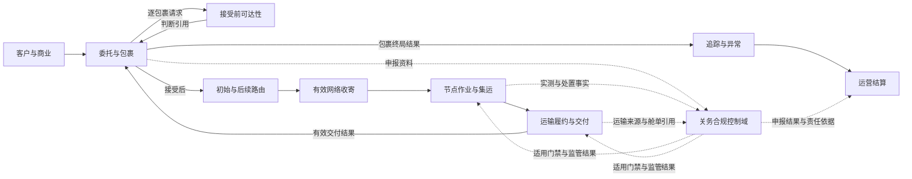

# 国际小包网络运营首发产品基线与开发主线

状态：产品级首发开发基线已确认；真实试点实例和参数仍由登记册维护

本文是 `idp-parcel` 的产品级开发入口。它把国际小包网络运营的核心闭环、限界上下文责任、首发纵向切片和端到端准入关系交给业务与开发团队。它不重新定义领域规则，不复制真实客户或线路参数，也不规定 API、数据库字段、消息 Schema、部署或对象存储实现。

## 纠偏结论

此前的关务首发工作是高风险控制域的专项验证，不是产品总体核心。关务专项继续保留并承担申报、合规、监管结果和范围化门禁责任；产品总体首发必须以包裹网络运营闭环为主线。

产品级主线与关务专项的关系如下：

流程图表达业务关系，不表示固定技术调用顺序。出口、进口和不同履约段的关务控制点可以位于不同阶段；关务只影响其明确适用的动作范围。

## 产品核心与控制域

| 层级 | 能力 | 主要所有者 | 首发要求 |
|---|---|---|---|
| 核心 | 客户账户、服务产品、合同、渠道授权和责任法人 | `party-commercial` | 商业对象独立发布、不可覆盖版本、两阶段唯一解析、客户隔离和责任依据 |
| 核心 | 客户委托、包裹永久身份、包裹谱系、面单交易、决定前撤回、包裹取消/收寄后处置、有效网络收寄解释和包裹终局 | `parcel-shipment` | 支持多包裹委托、接受基线、并发决定、逐包裹取消边界、收寄前后身份连续性和结果分层 |
| 核心 | 网络拓扑、可达性、路线和包裹路由计划 | `network-routing` | 形成可解释的可达性和路由版本，不把计划当作实际履约 |
| 核心 | 集货、分拣、测量、集运、封签和节点控制 | `node-operations` | 支持至少一个自营节点的专业小包作业，不扩展为完整 WMS |
| 核心 | 场外揽收、班次、容量、运输委托、交接、实际承运、交付和运输收费发生项 | `transport-fulfillment` | 支持自营/外包混合履约，保留逐对象交接、实际事实及原/替代旅程各自成本来源 |
| 核心 | 内部追踪投影、普通客户追踪、ETA、异常分诊、客户披露和索赔证据 | `visibility-exception` | 只消费已接受事实，按账户与对象授权隔离查询，并区分普通查询、异常披露、通知送达和客户确认 |
| 核心 | 可执行价卡、费率表、BUY/SELL/INTERNAL 纯计价评价和回放 | `parcel-pricing` | 价卡版本不可覆盖、评价可复算、价格方向隔离并通过受控案例验证 |
| 核心 | 费用采用、供应商预期成本/账单、运营应收、调整、真实收付映射、核销和经营结果 | `settlement-accounting` | 完成至少一个真实账期，固定调整唯一所有权并保持运营结算与法定财务分离 |
| 控制域 | 申报、合规判断、内部限制、监管凭证、监管结果和动作门禁 | `customs-compliance` | 对适用线路形成真实或受控验证；不拥有其他上下文事实 |

“核心”表示产品日常经营不可缺少的能力，不表示所有能力必须由同一上下文拥有。“控制域”可以阻断特定动作，但不产生全程统一状态，也不替代节点、运输、追踪或结算的决定。

## 端到端主链

主链从一份网络服务委托的提交开始，展示它最终被接受后的正常闭环。具体国家、渠道、字段、时限和税费适用性必须引用参数登记册，不由本文件推导。

| 阶段 | 业务结果 | 主要所有者 | 关务关系 |
|---|---|---|---|
| 1. 商业解析、委托接入、生产归属、接受前可达性与决定 | `party-commercial` 先从不可覆盖的已发布商业版本唯一解析客户、法人、产品、合同和规则；完整拟受理范围再取得唯一生产归属，仅在本产品取得权威后逐包裹形成接受前可达性，`parcel-shipment` 形成接受、拒绝、决定前撤回或尚未决定，并在接受时固定基线 | `party-commercial`、试点准入控制、`parcel-shipment`、`network-routing` | 可达性只消费适用合规资格和限制，不提前形成正式申报或监管结果 |
| 2. 接受后初始路由与复核 | 对已接受包裹重新评估并形成初始路由、无当前有效路由或判断未决，后续变化形成新路线版本 | `network-routing` | 消费合规区域或限制引用；不把接受前候选复制为路由计划，也不把路由选择当作监管批准 |
| 3. 有效网络收寄与节点作业 | 客户送站时由 `node-operations` 形成节点收寄，场外揽收时由 `transport-fulfillment` 形成揽收交接；`parcel-shipment` 消费适用来源形成统一的有效网络收寄结果，节点继续形成测量、作业、集运和封签事实 | `node-operations`、`transport-fulfillment`、`parcel-shipment` | 提供实测、状况和协作事实；不形成监管决定 |
| 4. 适用关务控制 | 建立案件、资料快照、申报授权、监管引用和范围化门禁 | `customs-compliance` | 只阻断受门禁约束的出库、移动、交付或提交动作 |
| 5. 取消/处置、运输履约、交付与包裹终局 | 接受后按包裹判断收寄前取消或收寄后服务处置；`transport-fulfillment` 形成承运接受、容量、交接、移动、派送尝试、有效交付、交付证据和适用运输收费发生项；`parcel-shipment` 再依据取消、交付、退运或其他合同责任结果逐包裹形成终局 | `parcel-shipment`、`transport-fulfillment` | 消费有效门禁和监管处置授权；处置决定、实际执行、运输交付、收费发生事实和包裹终局分别成立，互不覆盖 |
| 6. 普通追踪、异常与客户披露 | 由各源事实形成内部投影、标准里程碑、客户账户隔离的普通追踪视图、ETA、异常案件和披露决定 | `visibility-exception` | 消费关务事实；普通查询不代替异常披露或主动通知，不把异常或消息结果写回关务 |
| 7. 计价与结算 | `parcel-pricing` 按已解析商业依据和来源事实形成 SELL/BUY 纯评价；`settlement-accounting` 采用评价形成费用、供应商预期成本、账单/应收应付、调整、真实收付映射、核销和经营结果 | `parcel-pricing`、`settlement-accounting` | 消费税费核定、资金引用和责任依据；不把评价或发生项直接当金额责任，不把对方认可当到账或付款覆盖推导为放行 |

阶段不是单一全局状态机。每个上下文拥有自己的生命周期；端到端摘要只能由各自有效结果派生，不能由人工直接改写。

## 首发纵向开发切片

这些切片是产品主线，不是技术微服务拆分。每个切片都应穿过必要上下文，形成可验收的业务结果；缺少参数时只保留稳定骨架、`R/S` 验证或明确未配置分支。

| 顺序 | 产品切片 | 主要覆盖 | 完成定义 |
|---|---|---|---|
| PN-01 | 范围、责任与治理基础 | `PILOT-SCOPE`、`PILOT-PARAMETER-REGISTER`、`GOV-01`、`GOV-10`、`PAR-GOV-01..11` | 固定一个锚点客户、一条成熟主线路、责任法人和独立项目边界；建立阶段、权威方、准入、暂停恢复、接管及证据参数，不把尚未执行的阶段验收写成已完成 |
| PN-02 | 商业权威、生产归属、接受前可达性、委托与包裹身份 | 试点准入控制、`party-commercial`、`parcel-shipment`、`network-routing`、`UC-PC-001/002`、`UC-PS-001/002/005`、`UC-NR-002`、`CPS-01..04`、`CPS-06..11` 及 `CPS-05` 的预计承诺机制 | 商业对象分别形成不可覆盖发布版本并通过两阶段机制唯一解析；完整拟受理范围取得唯一生产归属后逐包裹形成可达性，再形成接受、拒绝、决定前撤回或尚未决定。并发决定、冻结释放、包裹身份、资料版本、判断依据和预计承诺可追溯 |
| PN-03 | 接受后路由、有效网络收寄与节点作业 | `network-routing`、`node-operations`、`transport-fulfillment`、`parcel-shipment`、`UC-NR-001/003`、`UC-NO-002/003`、`UC-TF-002`、`UC-PS-003`、`CPS-05`、`OPS-01..04/12/14` | 已接受包裹形成初始路由；客户送站与场外揽收分别由事实所有者形成逐对象结果，小包托运统一形成有效网络收寄与正式承诺；按实际接货位置和节点当前有效实测复核路线，并完成测量、分拣、集运和封签主链；不形成权威运输交接、容量预占或库存职责 |
| PN-04 | 包裹取消/收寄后处置、运输履约、交付与包裹终局 | `transport-fulfillment`、`parcel-shipment`、`UC-PS-004/006`、`UC-TF-003..007`、`OPS-05..11/13`、`CPS-12`、`SET-10` 的运输收费发生项部分 | 收寄前逐包裹取消与收寄后处置分流可追溯；班次、容量、承运接受、逐对象交接、实际移动、派送、有效交付、POD 和运输收费发生项分层形成；小包托运再形成独立终局 |
| PN-05 | 关务合规控制 | `customs-compliance`、`UC-CC-001..012` 及专项协作用例 `UC-NO-001`、`UC-TF-001`、`UC-VE-001`、`UC-SA-001`，`CUS-01..10`、关务专项切片 0 至 6（切片 0 含 `CC-S0-W01..W08`） | 适用程序完成申报和监管结果闭环；关务门禁只作用于明确动作，不取得网络事实所有权 |
| PN-06 | 普通追踪、异常与客户披露 | `visibility-exception`、`UC-VE-002..008`、`VIS-01..11` | 由源事实分别形成内部投影与客户授权追踪视图，再形成 ETA、异常、处置请求和逐客户披露；普通查询、异常通知和消息结果互不冒充 |
| PN-07 | 计价、账单与运营结算 | `parcel-pricing`、`settlement-accounting`、`UC-SA-001..007`、`SET-01..11` | 运输收费发生项经 BUY 纯评价后形成供应商预期成本；各类金额调整由唯一用例创建，对账只纳入既有调整；客户赔付、应追偿、认可、真实到账和核销分层；至少完成一个真实账期 |
| PN-08 | [端到端试点与阶段准入](../design/pn-08-end-to-end-pilot-and-stage-admission-development-handoff.md) | `E2E-01/02`、`GOV-01..10`、`INT-01..03`、`DAT-01..03`、`NFR-01..03`、`PAR-GOV-01..11`、`PAR-NFR-01..06` | 按 W01 至 W09 固定同版本候选包，完成回放、影子、限量生产、唯一权威、暂停恢复、对象级接管、真实主链/账期、POD 失效端到端更正、在途盘点和正式 `Go/No-Go`；不建立新的业务上下文或全局状态机 |

PN-01 建立 `GOV-02..09` 所需的规则、参数槽位和责任，不宣称已经取得回放、影子、限量生产或正式验收证据；这些证据和决定只在 PN-08 按实际阶段形成。`INT-01..03`、`DAT-01..03` 和 `NFR-01..03` 是从 PN-02 起随切片持续落实的横切验收要求，PN-08 负责总体证明，不能把它们推迟到最后才实现。

PN-08 是产品级试点治理与跨上下文应用编排，不是新的限界上下文。它可以保存候选清单、阶段决定、生产权威区间、暂停/恢复、接管和在途盘点等治理记录，但不拥有委托、包裹、路由、节点、运输、关务、追踪或结算事实，也不创建 `UC-GOV-*`。

关务专项可以与 PN-03、PN-04 并行准备，但其生产准入必须由端到端主链按依赖关系消费；完成 PN-05 不代表产品总体完成，完成其他切片也不能绕过适用关务门禁。

## 当前应用用例覆盖缺口

领域模型和验收矩阵已经覆盖产品全链路，但应用用例的细化程度明显不均衡。以下结论只描述当前文档覆盖，不代表未列出的能力不存在：

| 产品切片 | 当前已有通用用例 | 当前主要缺口 | 下一步 |
|---|---|---|---|
| PN-02 | `UC-PC-001/002`、`UC-PS-001/002/005`、`UC-NR-002` | 商业对象发布、两阶段唯一解析、接单机制、建单前来源重放/冲突、最小委托候选、决定前撤回和同租户提交批次边界已形成；生产持久化、归属端口、`已提交`聚合和事件事务尚未实现，真实商业版本、规则包、财务策略、角色、时点和试点参数仍待提供 | 按 [`PN-02` 真实参数取证与开发交接](../design/pn-02-real-parameter-evidence-and-development-handoff.md)并行落实稳定骨架、参数未配置和真实取证，保持“商业唯一解析 → 可达/财务判断 → 接受、拒绝或撤回”的决定边界 |
| PN-03 | `UC-NR-001/003`、`UC-NO-002/003`、`UC-TF-002`、`UC-PS-003` | 通用应用用例已经覆盖初始路由、两类真实收寄来源、正式承诺、路由复核和正常节点作业；真实收寄模式、资格、路由策略、节点/设备/SOP、外部来源和非功能参数仍待提供，当前代码尚未实现这些上下文 | 按 [`PN-03` 网络收寄与节点作业开发交接](../design/pn-03-network-intake-and-node-operations-development-handoff.md)推进 W01 至 W08；先实现稳定骨架和显式未配置，再以同版本参数完成 `P/R/S` 证据，不把文档完成解释为生产实现完成 |
| PN-04 | `UC-TF-003..007`、`UC-PS-004/006`；监管专项继续使用 `UC-TF-001` | 通用用例已经覆盖收寄前逐包裹取消、收寄后服务处置、运输机会、班次、容量、运输委托、承运接受、权威交接、实际履约段、派送、POD、收费发生项、替代/退运旅程及包裹终局；真实取消/处置、班次、容量、伙伴、交接、尾程、成本发生、终局和非功能参数仍待提供 | 按 [`PN-04` 运输履约与包裹终局开发交接](../design/pn-04-transport-fulfillment-and-parcel-finalization-development-handoff.md)推进 W01 至 W08；监管专项不得替代常规运输主链，文档完成不得解释为生产实现完成 |
| PN-05 | `UC-CC-001..012` | 真实程序、来源、角色、规则和复杂验证参数仍未确认 | 保留现有专项，不继续以增加关务用例替代真实取证 |
| PN-06 | `UC-VE-002..008`；关务专项继续使用 `UC-VE-001` | 通用用例已经覆盖内部投影、普通客户追踪、内部 ETA、ETA 对客可见性判断、可见性缺口、异常分诊/建案、案件响应/处置请求取消替代、客户通知和证据/索赔/追偿生命周期；真实来源、公开规则、合同、渠道和索赔参数仍待补齐 | 按 [`PN-06` 追踪、异常与客户披露开发交接](../design/pn-06-visibility-and-exception-development-handoff.md)推进 W01 至 W08；普通客户追踪不得直接暴露内部投影，关务专项不得替代通用主链 |
| PN-07 | `UC-SA-001..007` | 通用用例已经覆盖发生项到供应商预期成本、计价/财务控制、调整唯一所有权、既有调整后续账期纳入、供应商账单、客户对账、真实收付映射/核销、成本分摊、经营结果及赔付/追偿金额分层；真实价格、账户、账期、财务交换、分摊/毛利和联合账期参数仍待提供 | 按 [`PN-07` 运营结算与经营核算开发交接](../design/pn-07-operational-settlement-and-accounting-development-handoff.md)推进 W01 至 W09；先实现稳定骨架和显式未配置，再以同版本真实账期证据提交 PN-08 |
| PN-08 | 不新增独立业务用例；复用 `E2E-01/02`、`GOV-01..10` 和各切片候选 | [端到端试点与阶段准入开发交接](../design/pn-08-end-to-end-pilot-and-stage-admission-development-handoff.md)已形成 W01 至 W09 的稳定治理编排；真实 `PAR-GOV-*`、同版本证据、代码实现和阶段决定仍待完成 | 先建立候选版本组，依次执行回放、影子、限量生产和正式验收；任何局部切片不得自行批准生产范围 |

因此，PN-02 至 PN-07 的通用应用编排和 PN-08 的产品级试点治理交接均已形成。每组用例只编排已有领域规则；遇到真实业务选择时回到参数登记册或单项业务决策，不用技术默认值补齐。

上表各行「仍待提供」的真实参数属**实例半边**，见下文[切片的机制半边与实例半边](#切片的机制半边与实例半边)。它们在尚无租户时不可能取得，因此不构成机制半边的完成障碍，也不得反过来当作推迟机制实现的理由。

## 已确认的首发范围约束

以下范围以[首发试点范围](./PILOT-SCOPE.md)为准，本表只说明其在产品主线中的位置：

- 网络服务是首发对客服务形态；独立面单渠道服务不进入首发生产。
- 首发只覆盖一个真实锚点客户、一条成熟主线路、一个目的服务区域、至少一个自营节点和外部履约环节。
- 首发生产只有一个真实锚点客户；跨客户集运只使用受控测试账户和脱敏或合成数据按 `S` 验证，不形成第二个真实客户合同、运营应收或结算责任。长期产品允许跨客户集运，但客户合同、可见性、费用和责任必须隔离。
- 首发不包含 COD，不建设完整 WMS，不启用生产自动申报。
- 首发允许多份供应商价卡并存，对同一票逐候选形成 `BUY` 评价后按成本单维择优，择优由 `network-routing` 形成；这是内部成本决策，不对客户形成价格承诺。系统从供应商最终价卡开始，不建设向承运商询价、竞价、招标或授予的采购过程。生产结算闭环仍只要求每个外包环节一个日常主合作伙伴完成真实账期。
- 备用伙伴切换、退运、复杂撤销重报、复杂税费/资金分支和自动异常/通知按参数与验收矩阵决定进入 `P`、`R/S` 或 `N/A`。

这些是首发范围约束，不应被误读为长期产品能力的永久禁止；长期边界仍由产品基线、上下文和 ADR 约束。

## 产品就绪与试点就绪

首发有两个不同的就绪概念。此前文档只承认后者，于是每个能力问题都被迫套用「等真实证据」的口径。

**试点就绪**：某个**运营集团租户**有真实锚点货主客户、真实线路和真实参数，可按[验收场景矩阵](./PILOT-ACCEPTANCE-MATRIX.md)形成 `P` 级证据并由 PN-08 作出正式 `Go/No-Go`。它的验收对象是**真实业务证据**。

**产品就绪**：能力覆盖足以承接目标客户群的常规业务形态，可以演示、可以进入商务洽谈。它的验收对象是**能力覆盖**，不是真实业务证据。

两者是顺序关系而非替代关系：没有产品就绪就谈不下租户，没有租户就没有锚点客户，没有锚点客户就取不到真实参数。只承认试点就绪会让这三步互相等待。

**本产品是软件产品，`idp-parcel` 的开发方不是运营企业。** 文档中的「运营企业」一律指购买本产品的租户，其定义见 [`party-commercial`](../domain/party-commercial/CONTEXT.md) 的运营集团租户与 [ADR-0003](../adr/0003-group-tenant-legal-entity-customer-account.md)。锚点货主客户是租户的客户，与开发方隔着两级。价卡、客户合同、供应商协议、业务量基线都是租户与其相对方之间的文件，开发方不可能持有；当前**尚无租户实例**，因此这些参数不是"还没拿到"，是尚无产生它们的关系。

### 切片的机制半边与实例半边

每个 `PN-*` 切片都含两半。**机制半边**是产品必须具备的能力——规则、判断、版本化、门禁与记录形态；**实例半边**是把某个租户的真实客户、线路、伙伴、参数和阶段决定填进去。上表的「完成定义」把两半写在同一句里，于是每个切片看起来都不可达。

以 PN-01 为例：「建立阶段、权威方、准入、暂停恢复、接管及证据参数」是机制，现在就能做完；「固定一个锚点客户、一条成熟主线路、责任法人」是实例，没有租户填不了。PN-08 同样分得开：保存候选清单、阶段决定、生产权威区间、暂停恢复、接管与在途盘点的**记录能力**是机制，实际执行回放、影子、限量生产并作出 `Go/No-Go` 是实例。

**产品就绪 = 八个切片的机制半边全部达标**，判据三项：

| 判据 | 含义 |
|---|---|
| 骨架完整 | 该切片的规则与判断都有执行器，不靠「尚未实现」分支蒙混过关 |
| 受控案例可复算 | 有受控案例集，结果可重放且与声明一致 |
| 参数显式未配置 | 实例位置留空并拒绝默认值，不写死任何取值 |

**试点就绪 = 某个租户把实例半边填满并走完 PN-08。** 它不是开发方的里程碑，也不在开发方的可达路线图内——`Go/No-Go` 按定义由该租户责任法人指定的试点业务责任角色作出，开发方作不了这个决定。

这条划分不放松任何门禁：机制达标不等于任何租户可以上生产，实例证据仍按原规则形成。两条轨道的完整决定与被否决的替代方案见 [ADR-0016](../adr/0016-product-delivery-and-tenant-pilot-as-parallel-tracks.md)。

**`No-Go / 待参数化` 只约束生产结论，不约束能力范围。** 「未确认参数不得成为生产默认值」这条红线完全不变——它约束的是取值，不是产品支持哪些形态。

### 机制半边现状

上节定了判据却没说现在站在哪里，判据因此还用不上。下表按三条判据逐切片定级，**只描述机制半边**；实例半边一律为空且不计入。代码事实核对于 `internal/` 与 `cmd/`，用例与规则事实核对于各 `CONTEXT.md` 与 `UC-*`。

**本节是快照，盘于 `f327558`（2026-08-10）。** 它与本文其余部分性质不同：其余部分说明产品长期必须保持什么，本节只说明某一刻站在哪里。它记录的对象是代码，每次提交都可能使它过期——立节当天它就被并行落地的提交先后带假三次。**读到与代码不符时以代码为准**，不要据本节推断某项能力不存在。

重盘触发条件三项，任一成立即须重盘并更新上面的盘点戳：某上下文首次出现生产代码；某切片的状态定级发生变化；本节引用的任何计数与实际不符。

状态三种：**达标**（三条判据都满足）、**部分**（有生产代码但判据未齐）、**未开始**（无生产代码）。

| 切片 | 主要上下文 | 状态 | 机制半边缺什么 |
|---|---|---|---|
| PN-01 | 治理，无专属上下文 | 未开始 | 阶段、权威方、准入、暂停恢复、接管的**记录能力**无代码；参数槽位已在三份模板中建立 |
| PN-02 | `party-commercial`、`parcel-shipment`、`network-routing` | 部分 | 三个上下文都已有生产代码：`parcel-shipment` 覆盖来源身份与保全、生产归属决定、安全交接判定、提交候选与批次，并有 `UC-PS-001` 的应用编排与自有端口；`party-commercial` 覆盖商业版本模型（生效区间、发布后内容固定、版本迁移）、发布登记册与 `UC-PC-002` 两阶段解析（含范围级权威视图修订与提交前重解）；`network-routing` 覆盖接受前可达性的三值结论与证据缺口判定。仍缺的持久化与事件事务被 ADR-0017 的闸门挡住，属下方横切缺口而非本切片自身 |
| PN-03 | `network-routing`、`node-operations`、`transport-fulfillment`、`parcel-shipment` | 未开始 | `node-operations` 与 `transport-fulfillment` 无任何代码；`network-routing` 只有 PN-02 的接受前可达性，本切片要的初始路由与收寄/实测后路由复核无代码 |
| PN-04 | `transport-fulfillment`、`parcel-shipment` | 未开始 | `transport-fulfillment` 无代码；`parcel-shipment` 侧的包裹终局未实现 |
| PN-05 | `customs-compliance` | 未开始 | 无代码 |
| PN-06 | `visibility-exception` | 未开始 | 无代码 |
| PN-07 | `parcel-pricing`、`settlement-accounting` | 部分 | `parcel-pricing` 是本仓最成熟的上下文，规则模型七步全部有执行器；`settlement-accounting` 只有 `S01-W03` 财务控制边界的契约测试，无生产结算模型 |
| PN-08 | 跨上下文治理编排 | 未开始 | 候选清单、阶段决定、生产权威区间、暂停恢复、接管与在途盘点的记录能力无代码 |

**八个切片没有一个达标：两个部分，六个未开始。** 这个分布是旧口径的产物——只有计价手上有一张真实价卡可研究，别处都停在「等真实证据」。ADR-0016 解除的正是这个停顿，因此该分布此后不再有正当理由。

#### 三条判据各自的现状

**骨架完整——已写的部分没有作假，未写的部分是干净的空缺。** 全仓搜不到 `TODO`、`FIXME`、`not implemented` 或 `panic(`，没有用空实现顶住的假完成。这使定级可信：六个「未开始」就是未开始，不是被 stub 掩盖的部分完成。已有部分仍有具名缺口，例如 `parcel-pricing` 的 `FeatureSource` 实现五项而 `CONTEXT` 声明的闭合集合有十项，分区、地址类型与服务选项三项分类特征需要相等而非比较，尚无执行器；代码已就地声明该延后与理由（`internal/parcelpricing/domain/feature_condition.go`），按「枚举取值与产生它的规则同时出现」处理，不单独计为缺陷。

**受控案例可复算——三条里最接近满足的一条。** `parcel-pricing` 有 26 份测试，覆盖规范化摘要回放、合成契约与逐案例断言；`parcel-shipment` 有 14 份，含 `SYN-CHAIN` 联检与 `UC-PS-001` 编排的逐结果断言；`party-commercial` 有 9 份，其中两份是契约测试；`network-routing` 有 2 份。CI（`.github/workflows/ci.yml`）在每次 push 与 PR 上跑 `gofmt`、`go vet`、`go test -race` 与 `go build`，因此可复算有持续保证，不是一次性事实。

**参数显式未配置——目前满足，且是被刻意维持的。** 全仓唯一第三方依赖是 `github.com/go-chi/chi/v5`；生产代码中没有任何业务阈值、金额、费率或系数常量，计价的阈值一律由价卡版本携带。

#### 契约测试不计入骨架完整

`party-commercial`、`settlement-accounting` 与 `parcel-shipment` 的部分边界采用**只写测试的契约**（`*_contract_test.go`）：文件内自带合成类型，并明确声明不引入生产模型、仓储、事务、outbox 或外部适配器。它钉住边界形状与调用顺序，作用是防止后续实现偏离已定的边界，但判据要的是**规则有执行器**，契约测试只证明期望被写了下来。把它读成实现会高估产品就绪度，因此上表把只有契约测试的上下文记为无生产模型——现在只剩 `settlement-accounting` 一个。`party-commercial` 与 `parcel-shipment` 的契约测试此后与各自的生产模型并存：契约钉边界，模型担执行，两者不互相替代。

#### 横切缺口，不属任何单一切片

- **应用层只有一例，端口无生产实现。** `parcel-shipment` 已有用例编排与自有端口（`application/`、`ports/`），其余上下文仍只有 `domain` 包；端口是纯接口，今天唯一的实现是测试用替身，PostgreSQL 适配器仍被 ADR-0017 的持久化闸门挡住。
- **无持久化。** 没有仓储实现、迁移或数据库驱动依赖。这一点此前是「形状可零成本改动」的前提，[ADR-0014](../adr/0014-versioned-canonicalization-shape-for-content-digest.md) 之后不再是硬约束，但它仍使「受控案例可复算」目前只在进程内成立。
- **无事件机制**，无 outbox 或发布侧。
- **HTTP 面只有 `/healthz` 与 `/version`**（`internal/platform/httpapi/router.go`），没有任何业务端点。

这四项在八个切片里都会再出现，逐切片各补一次要重复付代价；它们的处置顺序应先于或至少并行于下一个上下文的领域建模。本节只记录现状与该观察，不在此决定顺序。

### 目标客户群

**经营跨境出口小包网络的物流企业，首发以中国出口为起运侧。**

这是下文能力范围判据的适用范围，不是销售策略，也不限制长期市场。客户群一旦放宽（例如纳入本地小包网络），依据它作出的能力范围结论必须重新评估。

### 能力范围判据

[计价规则模型最终设计](../design/pp-pricing-rule-model-final-design.md)原有的范围判据把「指得出来」锚在手上那张价卡的某一行，它同时承担着防止把产品建成第二套通用计费平台的职责。产品就绪里程碑成立后该锚点失效，替代判据为：

**必须能指出一类真实存在的承运或渠道商业模式需要它，且该模式在上述目标客户群里是常规形态而非边缘情形。指不出来就不进。**

判据结构没变，仍是「指得出来才进」，变的只是所指对象——从一张卡换成市场上可命名的模式；它同样要挡住无边界扩张。

**一条硬边界不随判据变化：任何取值仍必须由价卡或商业政策版本携带，不得内置为常量。** 能力可以按市场形态建，数值不行。这是「行业估算不能直接转为已确认」在产品语境下的准确形式——形态决定支持什么结构，实例值永远等真实价卡。

### 产品需求假设

按上述判据形成、但尚无一手材料支撑的形态结论登记在此，**不进[参数登记册](./PILOT-PARAMETER-REGISTER.md)**——登记册只登真实实例。每条在第一个真实客户到来时必须复核。

| 编号 | 假设 | 依据强度 | 影响 |
|---|---|---|---|
| `PA-PP-01` | 小包价表族有三种常规形态并存：首重加续重、计费重乘单价、重量段阶梯，各自可叠加分区 | 行业形态，联网核对，无一手价卡 | 决定 `parcel-pricing` 价表族的取值集合与规范化形状 |
| `PA-PP-02` | 抛重系数是渠道属性而非行业常数，须逐份价卡给出 | 同上 | 已由[小包计价上下文](../domain/parcel-pricing/CONTEXT.md)「不得内置系数常量」承接，无需另行实现 |
| `PA-PP-03` | 进位可能在同一渠道内按重量分段 | 同上 | 决定重量取整策略的规范化形状 |

「依据强度」一栏写明这些不是已确认参数。据其决定**能力范围**允许，据其决定**任何取值**不允许。

## 给开发的交接规则

- 先实现各核心上下文的稳定业务骨架，再按 PN 切片接入真实范围；不要把关务用例当作全局工作流或全局状态机。
- 每个跨上下文交接只传递其拥有的事实、判断或授权引用；接收方形成自己的结果，不共同编辑一个可覆盖结果。
- 关务限制、运输交接、节点控制、客户披露和运营结算分别拥有；任何一个结果都不能以“统一状态”覆盖其他结果。
- 真实参数和证据状态只在[首发试点参数与证据登记册](./PILOT-PARAMETER-REGISTER.md)维护。未确认值不能变成默认国家、角色、渠道、阈值、时限或动作顺序。
- 验收优先使用[首发试点验收场景矩阵](./PILOT-ACCEPTANCE-MATRIX.md)的 `P/R/S/N/A` 规则；不得为验收主动制造真实监管、履约、通知或金额事实。
- 任一核心能力未就绪时，只阻断依赖它的生产分支；已接受委托和在途对象必须保留稳定身份、当前责任方、下一行动和恢复边界。
- 阶段、暂停、恢复、发布版本回退、停止新准入和对象级接管是治理决定，不得被实现为包裹或运输全局状态；生产权威必须按对象范围、能力、事实类型和生效区间唯一。

## 权威关系与下一工作顺序

1. 本文件定义产品总体核心、纵向切片和关务控制域的相对位置。
2. [产品基线](./PRODUCT-BASELINE.md)和[领域上下文地图](../domain/CONTEXT-MAP.md)定义长期产品边界、语言和所有权。
3. [首发试点范围](./PILOT-SCOPE.md)、[验收场景矩阵](./PILOT-ACCEPTANCE-MATRIX.md)和[参数登记册](./PILOT-PARAMETER-REGISTER.md)定义本期真实范围、证据层级和参数状态。
4. [关务与贸易合规专项开发基线](./CUSTOMS-FIRST-RELEASE-DEVELOPMENT-BASELINE.md)及其工作单只负责 PN-05 的专项细化，不替代本文件。
5. 文档和开发先按 [`PN-02` 真实参数取证与开发交接](../design/pn-02-real-parameter-evidence-and-development-handoff.md)落实接单前置，再按 [`PN-03` 网络收寄与节点作业开发交接](../design/pn-03-network-intake-and-node-operations-development-handoff.md)推进接受后路由、收寄和节点作业，并按 [`PN-04` 运输履约与包裹终局开发交接](../design/pn-04-transport-fulfillment-and-parcel-finalization-development-handoff.md)推进常规运输与终局，再按 [`PN-06` 追踪、异常与客户披露开发交接](../design/pn-06-visibility-and-exception-development-handoff.md)和 [`PN-07` 运营结算与经营核算开发交接](../design/pn-07-operational-settlement-and-accounting-development-handoff.md)推进通用追踪/异常和运营结算工作包；PN-05 复用现有关务专项，最后按 [`PN-08` 端到端试点与阶段准入开发交接](../design/pn-08-end-to-end-pilot-and-stage-admission-development-handoff.md)执行 W01 至 W09。具体并行窗口由业务责任方根据参数登记册决定。

本文件不宣称任何真实线路、角色、规则、渠道或容量已经就绪。它只纠正产品主线，保留所有待确认参数和专项证据门槛。
