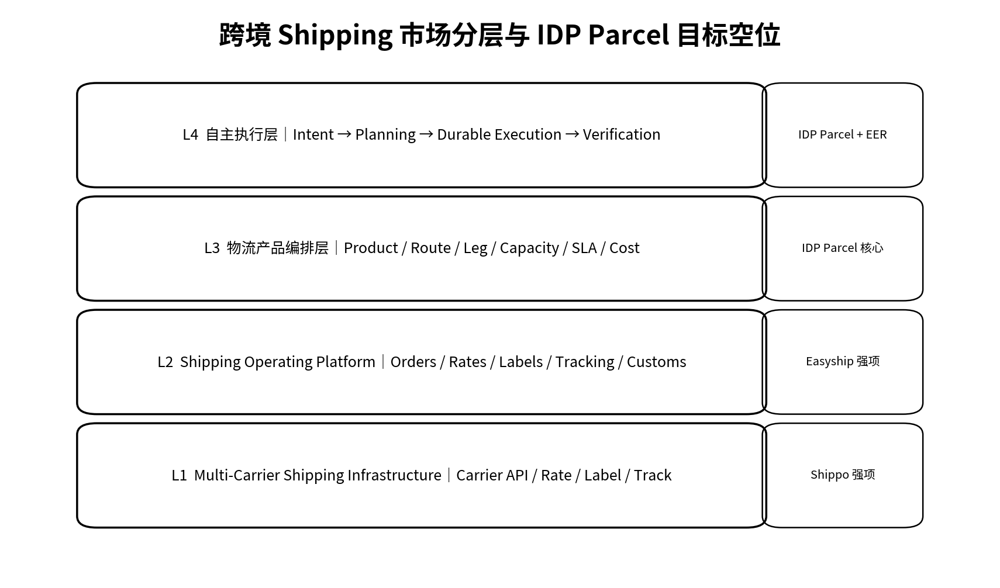
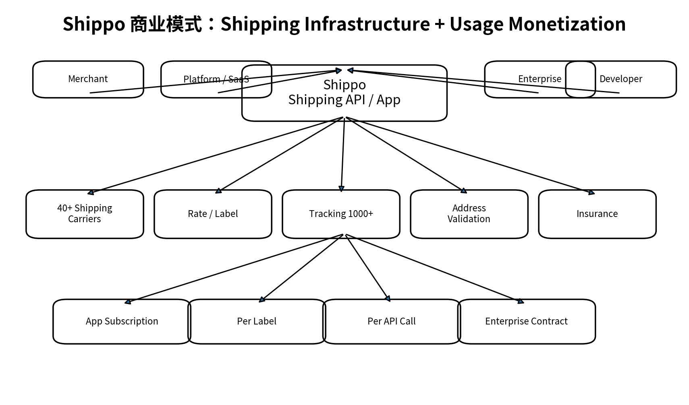
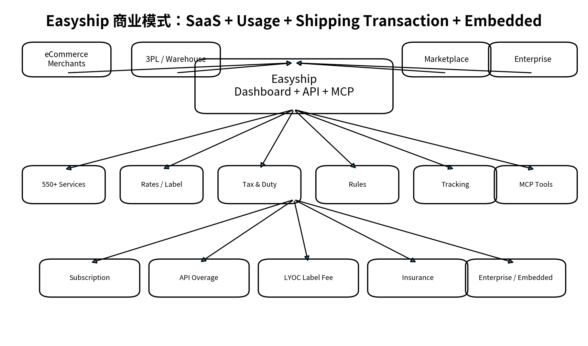
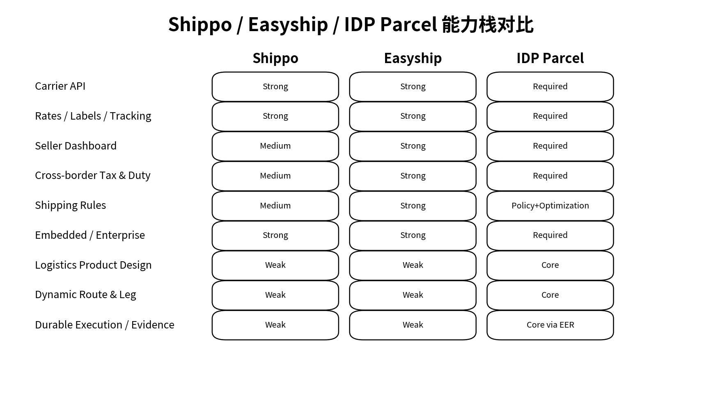
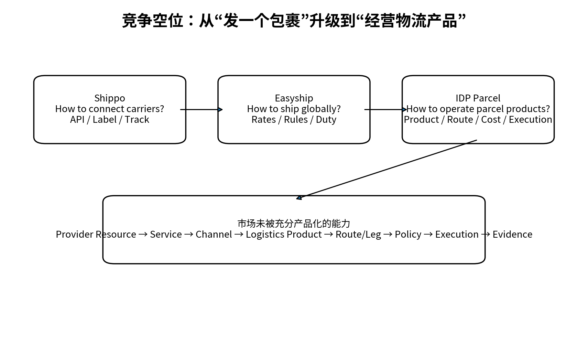
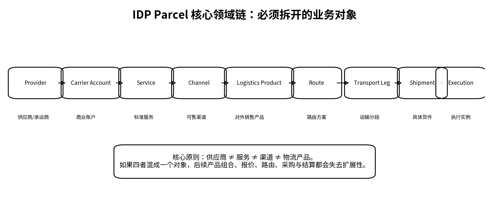
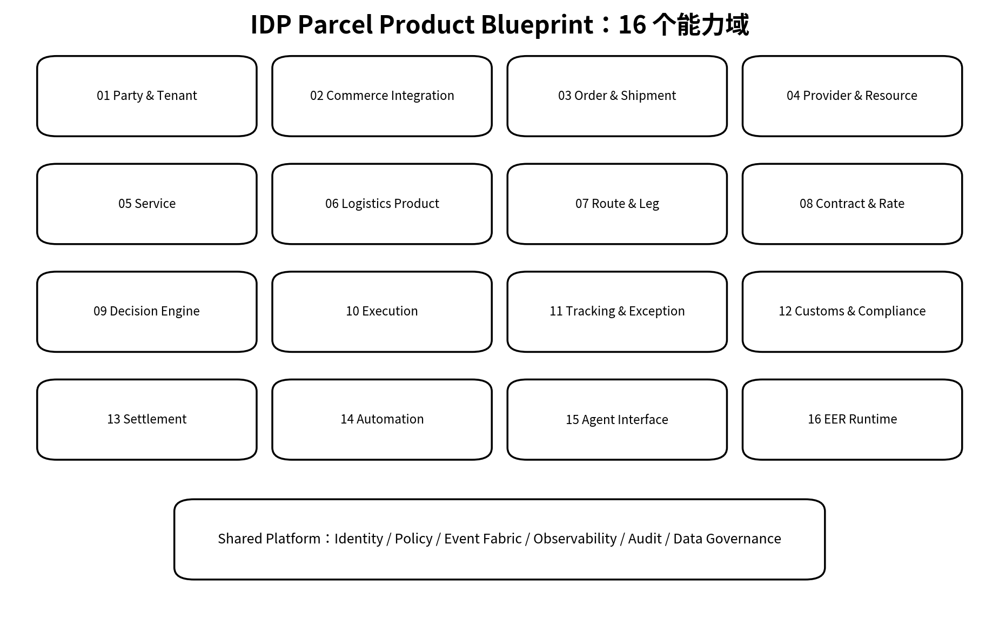
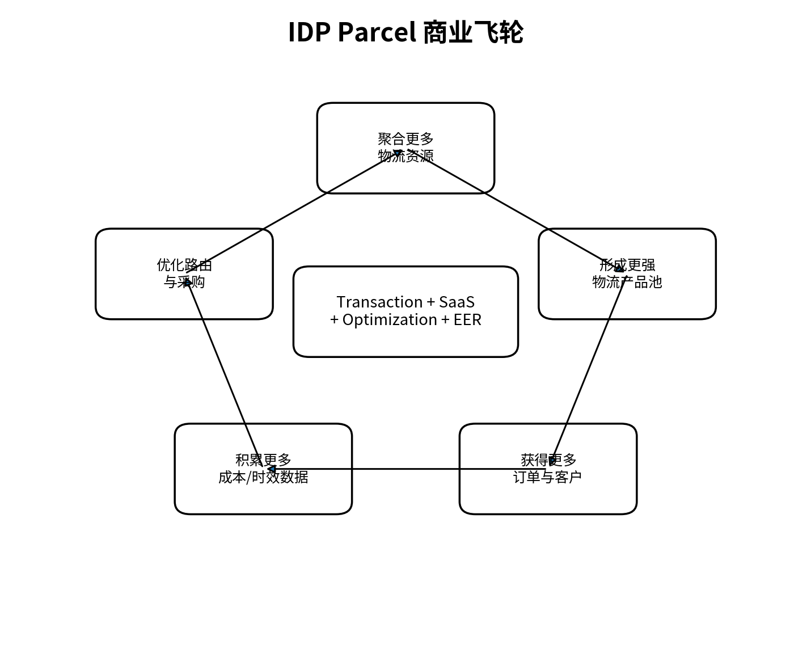
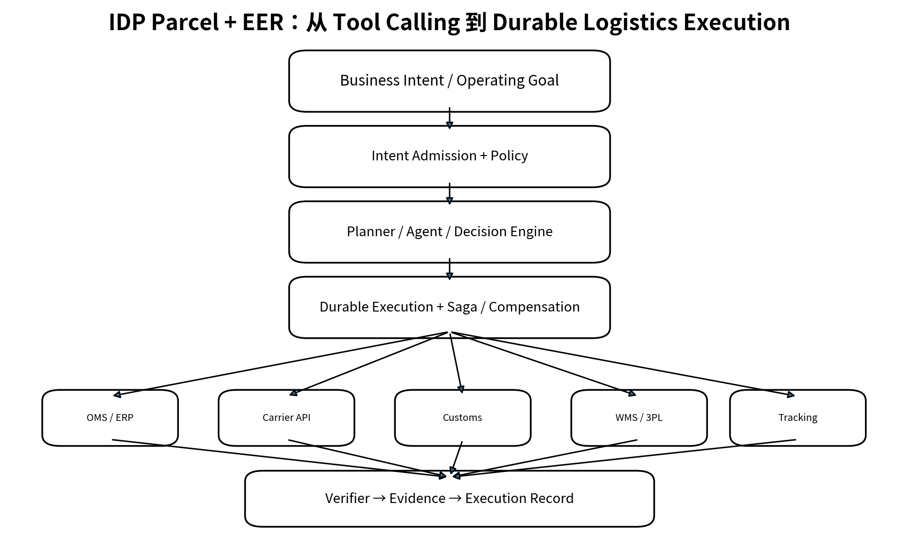
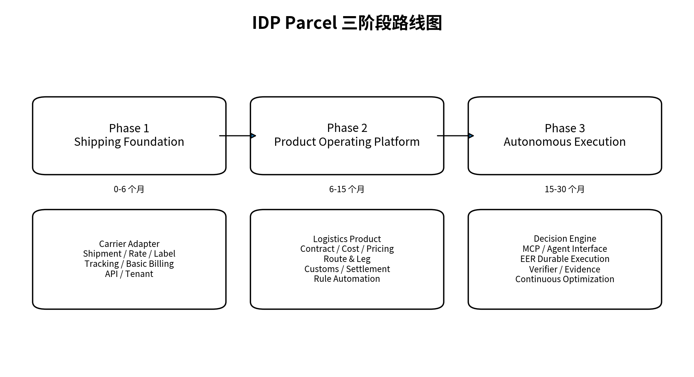

# IDP Parcel 产品战略与产品蓝图 V1.0

**Product Strategy & Product Blueprint**

基于 Shippo / Easyship 竞争研究，沉淀 IDP Parcel 的市场定位、领域模型、产品架构、商业模式与 EER 演进路径。

版本日期：2026-08-27  
文档属性：产品母文档 / 战略与蓝图基线

# 执行摘要

> **一句话定位**
> IDP Parcel 不是“又一个 Shipping SaaS”，而是面向跨境小包运营商、物流产品设计者与整合者的 Logistics Product Orchestration & Execution Platform。

市场已经证明 Multi-Carrier API、Rates、Labels、Tracking、Seller Dashboard、Shipping Rules、Cross-border Tax & Duty 都是成熟且正在商品化的基础能力。Shippo 强在开发者优先的 Shipping Infrastructure；Easyship 则已扩展为 Dashboard + API + Carrier Network + Cross-border Compliance + Enterprise + MCP 的复合平台。

因此 IDP Parcel 的竞争价值不能建立在“我们也能聚合多个承运商”之上。真正需要产品化的是物流产品层：将 Provider、Carrier Account、Service、Channel、Logistics Product、Route、Transport Leg、Contract、Cost、SLA 与 Execution 拆开管理，并支持组合、路由、定价、执行和持续优化。

EER 不是用来给现有 API 加一个聊天入口，而是承担 Business Intent → Policy → Planning → Durable Execution → Saga/Compensation → Verification → Evidence → Execution Record 的执行治理。MCP 只是 Agent Interface 的一种标准接口，不应被视为长期壁垒。

## 本文件的决策输出

- 确定 IDP Parcel 的市场类别与竞争边界

- 明确 Shippo / Easyship 哪些能力应作为“行业基线”而非差异化

- 建立 IDP Parcel 核心领域链与 16 个能力域

- 定义可落地的商业模式与价值计量方式

- 明确 MVP → Product OS → Autonomous Execution 三阶段路线图

- 为后续 PRD V2.0、DDD 建模、系统架构、融资/销售材料提供统一母版

# 目录

01 市场定义与行业分层

02 竞争基准：Shippo

03 竞争基准：Easyship

04 Shippo vs Easyship：能力与商业模式比较

05 Competitive Gap：IDP Parcel 的市场空位

06 IDP Parcel 战略定位与目标客户

07 核心领域模型与业务对象

08 产品蓝图：16 个能力域

09 决策引擎、路由与物流产品编排

10 商业模式与单位经济模型

11 AI / MCP / EER 集成战略

12 路线图、MVP 与关键指标

附录 A 竞品事实台账与资料来源

附录 B 后续文档体系

# 01 市场定义与行业分层

## 1.1 行业不是一个市场，而是四个层级

“国际小包聚合平台”是业务描述，不是足够精确的产品类别。对于 IDP Parcel，更有价值的做法是把市场拆为基础设施、运营平台、物流产品编排、自主执行四层。不同层级的客户、护城河和收费方式完全不同。

*图 1｜跨境 Shipping 市场四层结构*

| **层级** | **行业术语**                          | **核心问题**             | **典型能力**                        | **代表/目标**    |
|----------|---------------------------------------|--------------------------|-------------------------------------|------------------|
| L1       | Multi-Carrier Shipping Infrastructure | 如何统一连接承运商       | Rate / Label / Tracking / Address   | Shippo           |
| L2       | Shipping Operating Platform           | 如何高效完成全球发货     | Dashboard / Rules / Duty / Returns  | Easyship         |
| L3       | Logistics Product Orchestration       | 如何设计并经营物流产品   | Product / Route / Leg / Cost / SLA  | IDP Parcel 核心  |
| L4       | Autonomous Logistics Execution        | 如何围绕经营目标持续执行 | Intent / Durable Execution / Verify | IDP Parcel + EER |

## 1.2 IDP Parcel 不应进入的红海

- 不做单纯“面单聚合器”：API 接入数量很容易被规模更大的平台追平。

- 不做卖家 ERP 的全功能替代：SKU、广告、财务、店铺经营不是核心域。

- 不做重资产物流公司：仓、干线、机位、末端网络应作为可编排资源，而不是平台必须自营的资产。

- 不把 AI 聊天入口当作差异化：MCP 已经成为行业可用接口，竞争将转向决策质量与执行治理。

# 02 竞争基准：Shippo

## 2.1 战略定位

Shippo 的核心价值是把承运商异构接口抽象成统一 Shipping API，并同时提供面向商家的 App。官方当前强调 “one API” 提供 labels、rating、tracking、address validation 等能力；Shipping API 覆盖 40+ shipping carriers，而 tracking 能覆盖 1000+ carriers。

*图 2｜Shippo 商业模式与变现路径*

## 2.2 当前公开收费结构（2026-08-27 核对）

- App：Starter 免费；Pro 起价 \$17/月；Premier 定制。Starter 连接自有承运商账号时按 label 收费，Pro/Premier 可免该项费用。

- API Starter：每月前 30 个 label 免费，之后 \$0.07 / label；API Premier 按规模定制并提供量级折扣。

- 独立 API 计量：Tracking \$0.02 / track；Rating \$0.01 / rate generation；美国地址验证 \$0.02 / 次，非美国地址验证 \$0.08 / 次。

- 保险按声明价值与运费的一定比例计费；Enterprise/Premier 通过定制合同和更高支持等级变现。

## 2.3 技术模型值得学习的地方

Shippo 把 Shipment、Rate、Carrier Account、Service Level、Transaction、Tracking Event 等对象分离。购买 label 的动作形成 Transaction；Rate 是 Shipment 的候选运输方案。对 IDP Parcel 来说，最重要的学习不是字段，而是“领域对象解耦 + Carrier Adapter”。

> **IDP 决策**
> Shippo 的 Rate / Label / Tracking / Carrier Adapter 应视为 Phase 1 行业基线。IDP Parcel 不应在这些能力上追求“概念创新”，而应追求稳定性、统一模型和接入效率。

# 03 竞争基准：Easyship

## 3.1 Easyship 已经不只是卖家 Shipping SaaS

Easyship 当前同时面向电商商家、平台、Marketplace、3PL/Warehouse 和企业客户，形成 Dashboard + API + Carrier Network + Cross-border Compliance + Embedded Shipping + Enterprise + MCP 的双栈。官方开发者资料称其可连接 550+ courier services，覆盖 200+ 国家和地区。

*图 3｜Easyship 复合商业模式*

## 3.2 收费与变现结构

- Subscription：Free / Plus / Premier / Scale / Enterprise。官方 2026 年跨境结账说明中，Plus 从 \$29/月起，Premier 从 \$69/月起；年度方案通常有折扣。

- Usage-based API：2026 年起将高级 API 能力更广泛开放，采用“套餐内额度 + 超额按调用量”模式。成功调用计量，失败调用不计费；Enterprise 的具体计费按合同。

- LYOC（Link Your Own Courier）：客户连接自己的 DHL/FedEx 等账户时，Easyship 对通过平台生成的 label 收取固定平台费，费率取决于套餐或合同。

- Shipping Transaction：使用 Easyship 预协商承运商价格时，平台把采购规模转化为客户价值；公开资料不披露具体承运商返点/价差，因此本文件不把“运费差价”作为已证实收入项。

- Insurance / Embedded / Enterprise：保险、白标/嵌入式 Shipping、企业多租户与 3PL/fulfillment 延伸，构成进一步的变现轨道。

## 3.3 关键产品能力

- Rate：同时比较 cheapest / fastest / best value，best value 会综合价格、时效、tracking level 与 courier rating。

- Shipping Rules：典型 IF condition THEN action 的规则自动化，可按目的地、SKU、订单价值、重量、店铺、邮编、品类等条件执行策略。

- Cross-border：HS Code、Tax & Duty、DDP/DDU、国际结账等是 Easyship 相比 Shippo 更鲜明的能力。

- Enterprise：OAuth2、child company、delegated access 等体现其已经进入平台多租户与嵌入式 Shipping。

- MCP：2026 年推出 Shipping MCP，把比价、创建 Shipment、购买 label、pickup、tracking、tax/duty、analytics 等 API 能力映射为 Agent 可调用工具。

# 04 Shippo vs Easyship：能力与商业模式比较

*图 4｜能力栈比较：基础能力已高度重叠*

| **维度** | **Shippo**                              | **Easyship**                             | **对 IDP Parcel 的含义**           |
|----------|-----------------------------------------|------------------------------------------|------------------------------------|
| 核心范式 | Developer-first Shipping Infrastructure | Cross-border Shipping Operating Platform | 两者基础层都应吸收                 |
| 主对象   | Shipment / Rate / Transaction           | Shipment / Rate / Courier Service        | IDP 需再向上引入 Logistics Product |
| 自动化   | API + 基础自动化                        | Shipping Rules + Intelligent Selection   | IDP 应升级为 Policy + Optimization |
| 跨境能力 | 有，但不是唯一核心                      | Tax/Duty/DDP/DDU 更突出                  | IDP 必须把 Customs 作为一等能力域  |
| 企业平台 | API Premier / Platform                  | Enterprise / Child Company / OAuth       | IDP 从一开始做多租户 B2B 平台      |
| AI 接口  | API 易于 Agent 化                       | 已公开 MCP Server                        | MCP 是接口，不是护城河             |
| 缺口     | 物流产品设计不足                        | 物流产品设计不足                         | IDP 的核心机会                     |

## 4.1 商业模式共同趋势

- 订阅收入只是底座，交易与用量收入随业务规模增长。

- 允许客户连接自有 Carrier Account，但平台仍可对执行基础设施收费。

- 企业级客户会从“账号订阅”转向 API、SLA、支持、多租户、嵌入式能力的合同定价。

- 跨境平台逐渐把 Tax/Duty、Insurance、Returns、Analytics 等能力转成独立的 monetization rail。

# 05 Competitive Gap：IDP Parcel 的市场空位

*图 5｜竞争空位：从 Shipping Execution 进入 Logistics Product Operating*

## 5.1 已商品化的能力

- Carrier API aggregation

- Rate shopping

- Label generation

- Tracking normalization

- Address validation

- Basic shipping rules

- Store / Marketplace integrations

- 基础 MCP Tool Calling

## 5.2 尚未被充分产品化的能力

- 物流产品（Logistics Product）作为独立、可版本化、可销售、可核算的核心对象。

- 多段 Route / Leg 的资源编排，而不仅是选择某一个 Courier Service。

- 采购合同、容量、成本、SLA、附加费与销售价格之间的完整经济模型。

- 围绕利润、时效、签收率、异常率等目标进行多目标路由与策略优化。

- 长周期业务目标的 Durable Execution、失败补偿、验证与 Evidence。

> **战略结论**
> IDP Parcel 的竞争单位不是“一个 Shipment”，而是“一种物流产品及其持续运营结果”。

# 06 IDP Parcel 战略定位与目标客户

## 6.1 推荐正式定位

> **英文定位**
> Cross-border Parcel Product Orchestration & Execution Platform

> **中文定位**
> 跨境小包物流产品编排与执行平台

对外市场传播可以根据对象简化为“跨境物流运营平台”或“多承运商智能物流平台”；但内部产品定义必须坚持“物流产品 + 编排 + 执行”三件事，否则产品很容易退化成 Shipping API Aggregator。

## 6.2 核心客户优先级

| **客户类型**          | **痛点强度** | **支付能力** | **IDP 差异化** | **优先级** |
|-----------------------|--------------|--------------|----------------|------------|
| 物流产品设计者/整合者 | 高           | 高           | 极高           | P0         |
| 小包专线/货代         | 高           | 中高         | 高             | P0         |
| 3PL/集运/干线运营商   | 中高         | 高           | 高             | P1         |
| 跨境卖家              | 中           | 中           | 中             | P2         |
| 电商 ERP / SaaS 平台  | 中高         | 高           | 高（Embedded） | P1         |

## 6.3 典型 Job-to-be-Done

- 我要把来自多个供应商的渠道资源组合成可销售的欧洲小包产品，并知道每一票的真实成本与利润。

- 我要让系统根据国家、重量、品类、客户等级、价格、时效和异常率自动选择产品，而不是运营人员凭经验切渠道。

- 我要在某个供应商涨价、爆仓或时效恶化时，快速调整 Route / Policy，并可追溯影响。

- 我要把 Shipping 能力嵌入自己的 ERP/OMS/平台，但不想维护几十家承运商接口。

- 我要用 AI 发出经营目标，而不是只让 AI 替我调用一个 label API。

# 07 核心领域模型与业务对象

*图 6｜IDP Parcel 核心领域链*

## 7.1 对象定义

| **对象**              | **定义**                                                                 | **为什么必须独立**                       |
|-----------------------|--------------------------------------------------------------------------|------------------------------------------|
| **Provider**          | 提供物流能力的企业主体：承运商、专线商、清关商、仓库、末端商。           | 一个 Provider 可有多账户、多服务、多合同 |
| **Carrier Account**   | 平台或客户与 Provider 建立的商业/技术账户，承载合同、凭证、结算关系。    | 决定认证、结算、价格与权限               |
| **Service**           | 供应商提供的标准服务，如 DHL Express Worldwide。                         | 标准能力不能等同于销售渠道               |
| **Channel**           | 平台可运营、可报价、可路由的渠道实例，连接 Service 与具体合同/资源条件。 | 承载可运营实例与供应条件                 |
| **Logistics Product** | 面向客户销售的物流产品，具备覆盖范围、SLA、定价、限制、版本与生命周期。  | 客户购买的是产品，不是内部资源           |
| **Route**             | 实现某个物流产品的候选路径。                                             | 同一产品可有多个备选路径                 |
| **Transport Leg**     | Route 的具体运输/清关/末端分段。                                         | 支持多段组合、成本与事件拆分             |
| **Shipment**          | 一次具体货件需求。                                                       | 客户每一票需求                           |
| **Execution**         | 某个 Shipment 在选定 Product/Route 后形成的可持久执行实例。              | 保证状态、补偿、证据与审计               |

## 7.2 聚合根建议

- LogisticsProduct Aggregate：产品版本、适用区间、SLA、服务承诺、允许 Route。

- Route Aggregate：Route、Leg、Resource Binding、约束、优先级与切换策略。

- Shipment Aggregate：地址、包裹、报关信息、订单引用、候选/选中方案。

- Execution Aggregate：执行状态机、命令、事件、补偿、Verifier、Evidence。

- Contract/Rate Aggregate：采购合同、费率卡、附加费、有效期、币种、阶梯。

# 08 产品蓝图：16 个能力域

*图 7｜IDP Parcel 16 个能力域*

## 01 Party & Tenant

组织、客户、供应商、站点、业务单元、租户隔离、角色与权限

## 02 Commerce Integration

ERP/OMS/Marketplace/API/CSV/Webhook 接入

## 03 Order & Shipment

订单导入、Shipment、Parcel、Address、Item、申报信息

## 04 Provider & Resource

Provider、账户、资源、容量、日历、认证凭证

## 05 Service

Carrier Service、Service Level、限制、能力标签

## 06 Logistics Product

产品定义、版本、市场、SLA、规则、销售状态

## 07 Route & Leg

线路、运输段、清关段、末端段、备用路径

## 08 Contract & Rate

采购合同、费率、附加费、汇率、销售价、毛利

## 09 Decision Engine

Rate、Cost、SLA、Reliability、多目标路由、Policy

## 10 Execution

下单、Label、Manifest、Pickup、Handover、Cancel

## 11 Tracking & Exception

轨迹标准化、ETA、异常、告警、工单

## 12 Customs & Compliance

HS、申报、税费、DDP/DDU、禁限品、文件

## 13 Settlement

客户账单、供应商账单、对账、调整、赔付

## 14 Automation

Rule、Workflow、Policy、审批、触发器

## 15 Agent Interface

MCP、Function、Skills、Tool Registry、权限

## 16 EER Runtime

Intent、Durable Execution、Saga、Verifier、Evidence

# 09 决策引擎、路由与物流产品编排

## 9.1 从 Rate Shopping 到 Multi-objective Decision

Shippo/Easyship 的 Rate 层主要回答“有哪些服务、多少钱、多久”。IDP Parcel 的 Decision Engine 需要回答“在经营约束下选哪个 Logistics Product、哪条 Route、哪些资源，并预估对利润和 SLA 的影响”。

> **决策评分示意**
> Score = w_cost·Cost + w_time·Transit + w_sla·SLA_Risk + w_exception·Exception_Risk + w_capacity·Capacity_Risk + w_margin·Margin 实际实现不应固定为单一线性函数，而应支持硬约束过滤 + 多目标优化 + 策略分层。

## 9.2 决策流程

1.  Eligibility Filter：国家、邮编、重量、尺寸、品类、禁限品、客户等级、服务范围。

2.  Contract & Capacity Filter：合同有效性、额度、容量、cut-off、账户可用性。

3.  Cost Calculation：基础费率 + 重量段 + 附加费 + 税费 + 操作费 + 汇率。

4.  SLA Prediction：承诺时效、历史分位数、异常率、轨迹完整度。

5.  Policy Application：客户约定、利润底线、优先供应商、合规要求。

6.  Optimization：生成候选 Product/Route 并排序，必要时保留 fallback。

7.  Execution Binding：将决策固化为 Execution Plan 并进入 EER/Workflow。

## 9.3 物流产品版本化

物流产品必须支持版本和生效区间。价格、供应商、清关方案、末端承运商或 SLA 变化时，历史 Shipment 仍应可重现当时的产品定义与成本依据。建议采用 ProductVersion + EffectiveFrom/To + RoutePolicyVersion。

# 10 商业模式与单位经济模型

*图 8｜IDP Parcel 商业飞轮*

## 10.1 推荐的多层收费模型

| **收费层**            | **计量单位**                   | **适用客户**      | **价值逻辑**       |
|-----------------------|--------------------------------|-------------------|--------------------|
| Platform Subscription | 租户/月、站点/月               | 中小物流商        | 基础能力与组织管理 |
| Shipment Transaction  | Shipment / Label / Execution   | 全客户            | 随业务规模增长     |
| API Usage             | Rate/Track/Validation 等调用   | 平台/ERP/开发者   | 基础设施计量       |
| Logistics Product Fee | 产品数/渠道数/Route 数         | 产品运营商        | 产品管理复杂度     |
| Optimization Fee      | 节省额、毛利改善、策略执行量   | 规模客户          | 直接绑定业务价值   |
| Enterprise / Private  | 年度合同                       | 大型物流集团/平台 | SLA、私有化、治理  |
| EER / Agent           | 执行实例、Agent seat、目标任务 | 高级客户          | 自主执行与治理价值 |

## 10.2 不建议一开始依赖的收入

- 不要把“运费价差”作为唯一盈利逻辑：需要规模采购、信用资金和承运商关系，且透明度/合规复杂。

- 不要只按账号收费：与物流业务价值脱节，ARPU 上限低。

- 不要只卖 AI Agent seat：客户购买的是运营结果，不是聊天席位。

## 10.3 Unit Economics 需要持续跟踪的指标

- Revenue per Shipment

- Gross Margin per Shipment / Product

- Carrier/API Cost per Shipment

- Support Cost per 1,000 Shipments

- Label/Execution Failure Rate

- Average Cost Saving from Routing

- Customer Retention by Shipment Volume

- Working Capital Exposure（如果平台代收运费）

# 11 AI / MCP / EER 集成战略

*图 9｜EER 把 Agent Tool Calling 升级为可治理的长期业务执行*

## 11.1 MCP 的正确位置

Easyship 已在 2026 年公开 Shipping MCP Server，并把 Rate、Shipment、Label、Pickup、Tracking、Tax & Duty、Billing/Analytics 等能力暴露为 Agent Tool。因此 IDP Parcel 不应把“支持 MCP”当成核心差异化。

> **架构原则**
> MCP / Function / Skill 属于 Agent Interface；EER 属于 Execution Runtime。接口负责“能调用什么”，Runtime 负责“为什么执行、能否执行、执行到哪里、失败怎么办、如何验证”。

## 11.2 EER 的物流价值

- Intent Admission：判断经营目标是否合法、是否需要审批、预算和权限。

- Durable Execution：跨小时/天/月执行策略，不因 LLM 会话终止而丢失。

- Saga/Compensation：渠道切换、下单、撤单、资金/标签失败时执行补偿。

- Verifier：验证时效、成本、签收率、异常率是否达到目标。

- Evidence：保存价格、规则、调用结果、轨迹与决策依据。

- Execution Record：形成可审计、可复盘、可问责的业务执行记录。

## 11.3 示例：降低欧洲小包综合成本 8%

1. 读取过去 90 天产品、渠道、成本、时效、异常与客户 SLA。

2. 建立 baseline，并筛选可替换 Route/Provider。

3. 模拟成本与 SLA 影响，输出候选策略。

4. 通过权限/审批后，发布 Routing Policy 新版本。

5. 在限定订单比例上灰度执行，持续采集 Evidence。

6. 若 SLA 超阈值，自动回滚或切 fallback；否则扩大流量。

7. 周期结束后 Verifier 验证是否达到 8% 目标并生成 Execution Record。

# 12 路线图、MVP 与关键指标

*图 10｜三阶段产品演进路线图*

## 12.1 Phase 1：Shipping Foundation（0-6 个月）

- Tenant / Party / RBAC

- Provider / Carrier Account / Service

- Order / Shipment / Parcel / Address

- Carrier Adapter Framework

- Rate / Label / Tracking

- Webhook/Event Normalization

- Basic Contract/Rate

- Basic Customer Billing

- Open API / API Key / OAuth 基础

> **Phase 1 成功标准**
> 可以稳定接入首批承运商/渠道，在不修改核心域模型的情况下扩展 Adapter；完成真实订单从接入到 label、tracking、基础结算闭环。

## 12.2 Phase 2：Product Operating Platform（6-15 个月）

- Logistics Product / Product Version

- Route / Transport Leg / Resource Binding

- Contract / Cost / Pricing / Surcharge

- Customs / Compliance

- Settlement / Reconciliation

- Policy / Shipping Rules

- Multi-objective Routing V1

- Analytics / Product P&L

## 12.3 Phase 3：Autonomous Execution（15-30 个月）

- Agent Interface / MCP

- Decision Engine V2

- EER Intent Admission

- Durable Execution

- Saga/Compensation

- Verifier / Evidence / Execution Record

- 持续优化与灰度策略

## 12.4 北极星指标与产品指标

| **指标类型** | **指标**                                  | **意义**                            |
|--------------|-------------------------------------------|-------------------------------------|
| North Star   | Executed Shipments under Managed Products | 真正使用 IDP 产品与执行能力的业务量 |
| Product      | Active Logistics Products / Routes        | 产品化程度                          |
| Economics    | Gross Margin / Shipment                   | 单位经济                            |
| Decision     | Auto-routed Shipment %                    | 决策自动化                          |
| Reliability  | Label Success / Tracking Completeness     | 基础设施质量                        |
| SLA          | On-time Delivery P95 / Exception Rate     | 履约质量                            |
| EER          | Verified Goal Execution Rate              | 自主执行是否产生可验证结果          |

# 结论：这份蓝图给 IDP Parcel 的 10 个硬决策

1. IDP Parcel 内部正式类别定义为 Logistics Product Orchestration & Execution Platform。

2. Multi-Carrier API、Rate、Label、Tracking 是基础设施，不是核心差异化。

3. Logistics Product 必须成为核心业务对象和核心聚合根之一。

4. Provider、Account、Service、Channel、Product 必须解耦。

5. Route / Transport Leg 必须一等建模，不能仅有 carrier/service 字段。

6. Contract / Rate / Cost / Pricing / Settlement 必须与执行数据贯通。

7. Decision Engine 从硬规则开始，但数据模型要为多目标优化预留空间。

8. MCP 属于 Agent Interface，不等同于自主执行。

9. EER 负责 Durable Execution、Saga、Verifier、Evidence 和 Execution Record。

10. 产品路线先打通真实 Shipping 闭环，再上物流产品层，最后上自主执行；不反过来。

> **下一份应派生的正式文档**
> 《IDP Parcel PRD V2.0》：按 16 个能力域拆 Epic / Use Case / Business Rule / State Machine / Event / API / Acceptance Criteria，并将本蓝图中的领域对象作为不可随意更改的建模基线。

# 附录 A｜竞品事实台账与资料来源

核对日期：2026-08-27。以下只记录用于本蓝图的公开事实；关于 IDP Parcel 的定位、架构和商业模式均为本项目产品决策，不代表竞品官方表述。

**\[S1\] Shippo Shipping API Pricing** — [https://goshippo.com/pricing/api](https://goshippo.com/pricing/api)。API Starter、label/rating/tracking/address validation 等公开价格。

**\[S2\] Shippo App Pricing** — [https://goshippo.com/pricing](https://goshippo.com/pricing)。Starter/Pro/Premier 及自有 carrier account label fee。

**\[S3\] Shippo Shipping API** — [https://goshippo.com/products/api](https://goshippo.com/products/api)。40+ shipping carriers、1000+ tracking carriers 等能力。

**\[S4\] Shippo Rates API** — [https://docs.goshippo.com/api-reference/rates/retrieve-shipment-rates](https://docs.goshippo.com/api-reference/rates/retrieve-shipment-rates)。Rate / service level / shipment 等领域对象示例。

**\[S5\] Shippo Transaction / Label** — [https://docs.goshippo.com/shippoapi/public-api/transactions/createtransaction](https://docs.goshippo.com/shippoapi/public-api/transactions/createtransaction)。Transaction 购买 label 的执行模型。

**\[S6\] Easyship Overview Flow Guide** — [https://developers.easyship.com/docs/overview-flow-guide](https://developers.easyship.com/docs/overview-flow-guide)。Shipment → rates → label → tracking 的标准流程。

**\[S7\] Easyship Plans** — [https://www.easyship.com/plans](https://www.easyship.com/plans)。Free/Plus/Premier/Scale、LYOC、功能矩阵。

**\[S8\] Easyship API Usage Billing** — [https://support.easyship.com/hc/en-us/articles/34766246620562-API-Usage-Billing](https://support.easyship.com/hc/en-us/articles/34766246620562-API-Usage-Billing)。套餐内 API 配额、超额计费、成功调用计量。

**\[S9\] Easyship LYOC Billing** — [https://support.easyship.com/hc/en-us/articles/34766491011602-Usage-Billing-for-Link-Your-Own-Courier-Account-LYOC-Customers](https://support.easyship.com/hc/en-us/articles/34766491011602-Usage-Billing-for-Link-Your-Own-Courier-Account-LYOC-Customers)。客户自有 courier account 的 label 平台费与按月 usage billing。

**\[S10\] Easyship 2026 API Upgrade** — [https://www.easyship.com/blog/easyships-upgraded-global-shipping-api-for-ecommerce](https://www.easyship.com/blog/easyships-upgraded-global-shipping-api-for-ecommerce)。2026 年 usage-based API、550+ carrier services。

**\[S11\] Easyship Rates API** — [https://developers.easyship.com/reference/rates_request](https://developers.easyship.com/reference/rates_request)。cheapest / fastest / best value 及 rate 请求模型。

**\[S12\] Easyship MCP Server** — [https://developers.easyship.com/docs/easyship-mcp-server](https://developers.easyship.com/docs/easyship-mcp-server)。MCP tools：rates、shipments、labels、pickups、tracking 等。

**\[S13\] Easyship MCP Launch** — [https://www.easyship.com/blog/easyship-mcp-server](https://www.easyship.com/blog/easyship-mcp-server)。2026-04-30 发布、25 tools、550+ courier services、200+ countries/territories。

**\[S14\] Easyship OAuth2 Enterprise** — [https://developers.easyship.com/reference/oauth2_token](https://developers.easyship.com/reference/oauth2_token)。child company、client credentials、delegated access。

**\[S15\] Easyship International Checkout** — [https://www.easyship.com/blog/international-checkout-to-show-accurate-rates-taxes-duties-upfront-for-cross-border-shipping-services](https://www.easyship.com/blog/international-checkout-to-show-accurate-rates-taxes-duties-upfront-for-cross-border-shipping-services)。Plus/Premier 起价及 Tax/Duty/DDP/DDU 能力。

# 附录 B｜IDP Parcel 后续文档体系

本文件是“母文档”，后续所有研发、架构、商业与销售材料应从它派生，而不是各自重新定义产品。

| **文档**                  | **用途**   | **输入**     | **核心输出**                              |
|---------------------------|------------|--------------|-------------------------------------------|
| PRD V2.0                  | 产品研发   | 本蓝图       | Epic / Use Case / Rule / Acceptance       |
| Domain Model Spec         | DDD 建模   | 第 7-9 章    | Aggregate / Entity / Value Object / Event |
| Architecture ADR Pack     | 技术架构   | PRD + Domain | 服务边界、事件、存储、集成决策            |
| Carrier Adapter Spec      | 承运商接入 | Phase 1      | 统一接口、错误码、幂等、回调              |
| Pricing & Settlement Spec | 财务业务   | 第 10 章     | Rate Card、Cost、Billing、Reconciliation  |
| EER Integration Spec      | AI执行     | 第 11 章     | Intent、Policy、Saga、Verifier、Evidence  |
| GTM / Sales Deck          | 商业销售   | 第 5-6/10 章 | 客户价值、竞争差异、收费                  |
| Investor Narrative        | 融资       | 全篇         | 市场、护城河、飞轮、演进路径              |
