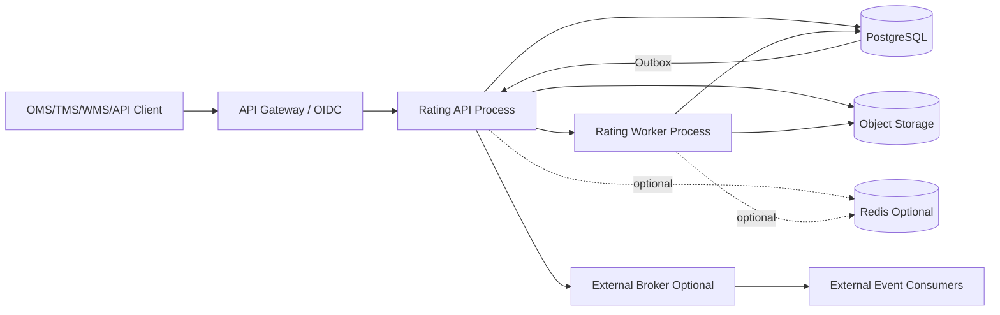
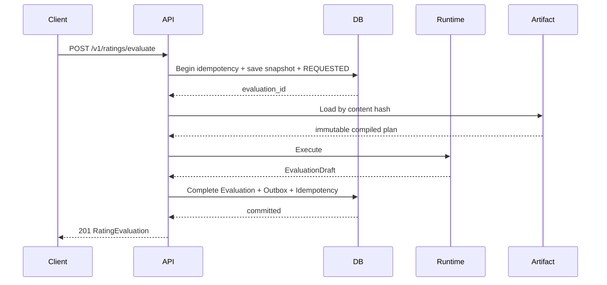
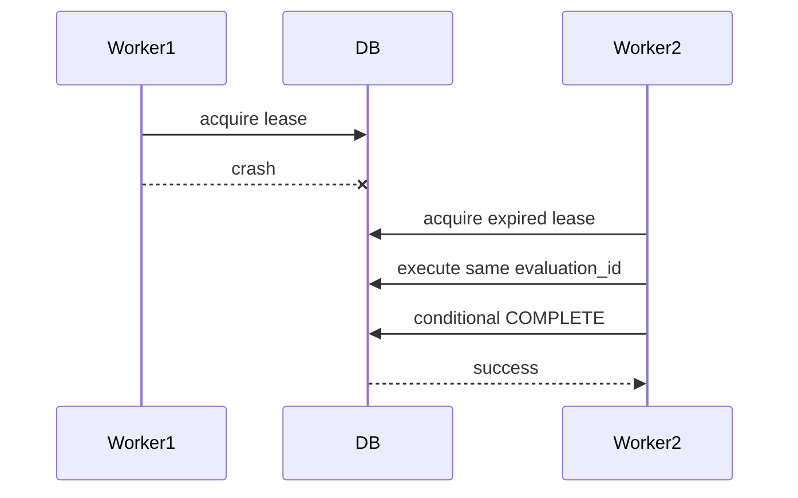

# Rating Runtime 技术设计

**文档版本：** V1.0.1  
**文档状态：** 终审技术基线 / 可进入 PostgreSQL 数据模型与 MVP 实现阶段  
**参考实现语言：** Go  
**架构基线：** 模块化单体优先，计算 Worker 可独立横向扩展  
**配套机器工件：**

- `rating-runtime-architecture-manifest-v1.0.1.yaml`
- `compiled-pricing-plan-manifest-v1.0.1.schema.json`
- `compiled-pricing-plan-manifest-example-v1.0.1.json`
- `validate_rating_runtime_tech_design_v1_0_1.py`

**上游冻结基线：**

1. 《国际小包计费与结算平台最终解决方案 V1.2 审定版》
2. 《国际小包计费领域模型 V1.0.1 终审版》
3. 《Rating Runtime 计算语义规范 V1.0.1 终审版》
4. 《国际小包计费 Golden Cases V1.0.1 终审版》
5. 《Rating API Contract V1.0.1 终审版》

---

# 目录

1. 文档控制与终审结论  
2. 架构目标和非目标  
3. 技术决策摘要  
4. 系统上下文与部署拓扑  
5. 模块边界与依赖方向  
6. Go 工程结构  
7. 运行时核心对象  
8. Port 与 Adapter  
9. 命令处理与事务边界  
10. 26 阶段执行管线  
11. Stage Executor  
12. Compiled Pricing Plan  
13. Plan Compiler 与发布边界  
14. Artifact 格式与内容寻址  
15. 缓存设计  
16. Decimal、Money、Quantity 与单位内核  
17. Fact 选择和快照构建  
18. Geometry Engine  
19. Weight Engine  
20. Aggregation Engine  
21. Rate Lookup Engine  
22. Charge Engine 与 DAG  
23. Fuel、商业转换和多币种  
24. RatingEvaluation 构建与持久化  
25. 幂等与请求规范化  
26. 同步、异步、批量与比较  
27. Replay  
28. Quote 集成边界  
29. 错误处理与恢复  
30. 并发、确定性与排序  
31. 安全与字段投影  
32. 可观测性与审计  
33. 性能设计与容量模型  
34. 高可用和部署  
35. 数据保留与归档  
36. 测试策略  
37. 发布与回滚  
38. 运维 Runbook  
39. 实施分期  
40. 技术验收标准  
41. 风险与控制  
42. 上游追踪矩阵  
43. 终审自洽检查  
附录 A：核心接口  
附录 B：关键伪代码  
附录 C：序列图  
附录 D：ADR  
附录 E：机器校验规则

---

# 0. 文档控制与终审结论

## 0.1 文档权威边界

本文负责定义 Rating Runtime 的实现结构，不重新定义业务公式。

发生冲突时，权威顺序为：

```text
正式合同与已批准价卡
        ↓
Rating Runtime 计算语义规范 V1.0.1
        ↓
Rating API Contract V1.0.1
        ↓
国际小包计费领域模型 V1.0.1
        ↓
本技术设计
        ↓
代码、数据库和部署配置
```

技术实现不得通过缓存、并发、数据库字段或第三方库改变计算语义。

## 0.2 终审结论

本设计冻结以下技术决策：

1. MVP 采用模块化单体，不先拆分微服务；
2. Rating API 与异步 Rating Worker 可以由同一代码库、不同进程角色运行；
3. PostgreSQL 是交易状态、幂等、Evaluation、Quote 和 Outbox 的权威存储；
4. 编译后的 Pricing Plan 使用不可变内容寻址工件；
5. 对象存储保存大型 Artifact、原始导入文件和证据附件；
6. Redis 是可选 L2 缓存，不是计算正确性的依赖；
7. 外部消息中间件是可选事件出口，不在单票计算热路径；
8. 运行时只消费 PricingRelease 中冻结的 Artifact；
9. 26 个宏观阶段固定，阶段内使用稳定 DAG；
10. 所有业务数值使用 Decimal；
11. RatingEvaluation 采用不可变写入模型；
12. 失败不持久化可被后续业务引用的部分总额；
13. Replay 使用原始 Snapshot、Fact 和 Artifact；
14. 所有排序、并行合并和余数分配必须稳定；
15. API、Worker 和 Replay 共用同一执行内核。

## 0.3 技术冻结层级

本文可以冻结：

- 组件边界；
- 依赖方向；
- 执行顺序；
- Artifact 结构；
- Port 接口；
- 幂等和事务策略；
- 缓存正确性原则；
- 故障恢复策略；
- 性能目标；
- 部署角色。

本文不冻结 PostgreSQL 具体表名、列类型和索引名称；这些由下一份数据模型文档冻结。

---

# 1. 架构目标和非目标

## 1.1 目标

Rating Runtime 必须实现：

- 相同输入和版本得到相同结果；
- 单票低延迟；
- 多包裹稳定聚合；
- 规则和价表可发布、可回放；
- 每条费用可解释；
- BUY 与 SELL 隔离；
- 同步、异步和批量共享同一语义；
- 不可变 Evaluation；
- 可横向扩展；
- 部分基础设施故障时不产生错误金额；
- 100% Golden Cases 回归。

## 1.2 非目标

Runtime 不负责：

- 价卡人工审批 UI；
- 财务入账；
- 周期返利；
- 承运商争议流程；
- 任意脚本执行；
- 图片识别尺寸；
- 订单主数据维护；
- 通用 BPMN；
- 任意行业规则执行；
- 自动解释歧义价卡并直接发布。

## 1.3 质量属性优先级

```text
正确性
> 可重放
> 可解释
> 安全隔离
> 可用性
> 性能
> 开发便利性
```

不得以性能为理由降低前五项。

---

# 2. 技术决策摘要

| 决策 | 选择 | 理由 |
|---|---|---|
| 架构形态 | 模块化单体 + 可扩展 Worker | 降低分布式复杂度，保留横向能力 |
| 参考语言 | Go | 静态类型、并发控制、单二进制部署 |
| 业务数值 | Decimal 库封装 | 禁止 binary float |
| 主存储 | PostgreSQL | 事务、约束、JSONB、Outbox |
| Artifact 存储 | 对象存储 + 内容哈希 | 不可变、可回放、大工件 |
| L1 缓存 | 进程内不可变缓存 | 热路径低延迟 |
| L2 缓存 | Redis 可选 | 加速但不影响正确性 |
| 异步队列 | PostgreSQL Operation/Job 表起步 | MVP 无需先引入 Broker |
| 事件 | Transactional Outbox | 业务提交与事件一致 |
| API | OpenAPI 3.1 | 已冻结机器合同 |
| 规则执行 | 固定阶段 + 稳定 DAG | 灵活且可控 |
| Evaluation | Append-only | 历史不可变 |
| 批量 | Item 独立事务 | 局部失败，不长事务 |
| Replay | 原工件内容寻址 | 不使用 latest |
| 发布 | PricingRelease 原子指针 | 防止混合版本 |

---

# 3. 系统上下文与部署拓扑

## 3.1 逻辑拓扑



## 3.2 进程角色

### rating-api

负责：

- HTTP；
- 认证上下文；
- Scope 和字段投影；
- 请求 Schema 和业务前置校验；
- 幂等准入；
- 同步计费；
- Comparison；
- Quote 命令；
- 资源查询。

### rating-worker

负责：

- 异步 Evaluation；
- Batch Item；
- Replay；
- 长时间 Simulation；
- 可重试 Operation。

### outbox-publisher

负责：

- 锁定未发布 Outbox；
- 发布到外部 Broker 或 Webhook；
- 记录发布确认；
- 与核心计算解耦。

### plan-compiler

属于 Pricing Governance 的发布边界，不应在每票运行：

- 加载已审批版本；
- 校验类型和依赖；
- 构建索引；
- 生成 Artifact；
- 运行 Golden Cases；
- 发布 PricingRelease。

## 3.3 单二进制与多角色

推荐同一代码库构建一个或少量二进制，通过角色参数运行：

```bash
rating-service --role=api
rating-service --role=worker
rating-service --role=outbox
rating-service --role=compiler
```

生产环境可以独立扩容，开发环境可以合并运行。

## 3.4 热路径基础设施

同步计算热路径必须只依赖：

- 本进程内已加载 Artifact；
- 必需 Fact/快照读取；
- PostgreSQL 幂等和 Evaluation 事务；
- 必要时对象存储首次加载。

不得强制依赖：

- Redis；
- 外部 Broker；
- 工作流引擎；
- 远程规则服务；
- 非确定性推理服务。

---

# 4. 模块边界与依赖方向

## 4.1 分层

```text
Adapters
    ↓
Application
    ↓
Domain + Engine
    ↓
Shared Kernel
```

Infrastructure 实现 Application 定义的 Port。

## 4.2 Domain

Domain 只包含：

- 聚合；
- 值对象；
- 不变量；
- 领域错误；
- 领域事件；
- 纯领域服务接口。

不得依赖：

- HTTP；
- SQL；
- Redis；
- 对象存储 SDK；
- 日志框架；
- OpenTelemetry；
- 环境变量。

## 4.3 Engine

Engine 实现确定性计算：

- Decimal；
- Unit；
- Geometry；
- Weight；
- Geography；
- Rate Lookup；
- Aggregation；
- Charge DAG；
- Currency；
- Stage Executor。

Engine 不直接访问数据库和网络。

## 4.4 Application

Application 负责：

- 用例协调；
- 事务边界；
- Port 调用；
- Idempotency；
- Snapshot 构建；
- Runtime 调用；
- Evaluation 持久化；
- Outbox；
- 授权后的输出投影。

## 4.5 Adapter 与 Infrastructure

Adapter 负责协议转换。

Infrastructure 负责：

- PostgreSQL；
- Object Storage；
- Redis；
- Telemetry；
- 外部 Broker。

业务分支不能写入 Adapter。

## 4.6 禁止反向依赖

- Domain → Application/Adapter/Infrastructure：禁止；
- Engine → Adapter/Infrastructure：禁止；
- Rating Domain → Quote Domain：禁止；
- BUY Runtime → SELL Runtime：禁止；
- Replay → Current Release Resolver：禁止。

---

# 5. Go 工程结构

```text
/cmd
  /rating-service
/internal
  /shared
    /decimal
    /money
    /quantity
    /unit
    /identity
    /time
    /errors
  /domain
    /producteligibility
    /pricingcatalog
    /contractpolicy
    /facts
    /rating
    /quote
  /engine
    /plan
    /stage
    /geometry
    /weight
    /geography
    /ratelookup
    /aggregation
    /charge
    /currency
    /rounding
    /trace
  /application
    /rating
    /eligibility
    /comparison
    /batch
    /replay
    /quote
    /ports
  /adapters
    /http
    /postgres
    /objectstore
    /redis
    /outbox
    /telemetry
  /generated
    /openapi
    /schemas
/test
  /golden
  /contract
  /integration
  /performance
/migrations
/docs
```

## 5.1 包级约束

- `internal/shared` 不包含业务策略；
- `domain` 不导入 `engine`；
- `engine` 可以消费 Domain 值对象，但不修改聚合；
- `application` 组装 Engine；
- `generated` 不允许被 Domain 导入；
- `adapters/http` 只能调用 Application Command/Query。

## 5.2 生成代码

OpenAPI 生成代码只作为：

- DTO；
- 路由骨架；
- 客户端 SDK；
- Schema 校验辅助。

生成 DTO 不得成为领域对象。

---

# 6. 运行时核心对象

## 6.1 RatingExecutionContext

```go
type RatingExecutionContext struct {
    TenantID          TenantID
    Principal         PrincipalContext
    Purpose           CalculationPurpose
    PriceRole         PriceRole
    CalculationBasis  *CalculationBasis
    BusinessTime      BusinessTime
    KnowledgeTime     time.Time
    InputSnapshot     RatingInputSnapshot
    SelectedFacts     SelectedFactSet
    ContractPolicy    ResolvedContractPolicy
    PricingRelease    PricingReleaseManifest
    CompiledPlan      *CompiledPricingPlan
    ExecutionID       ExecutionID
    Deadline          time.Time
}
```

创建后视为不可变。

## 6.2 StageState

阶段之间不传无类型 map。

```go
type StageState struct {
    GeometryResults       PackageMap[GeometryResult]
    ClassificationResults ClassificationSet
    WeightResults         PackageMap[WeightResult]
    AggregationResult     *AggregationResult
    ChargeCandidates      []ChargeCandidate
    ChargeLines           []EvaluationChargeLine
    CurrencyEvidence      []FXEvidence
    Trace                 ExecutionTrace
}
```

每个阶段只能写自己负责的字段。

## 6.3 CompiledPricingPlan

```go
type CompiledPricingPlan struct {
    ArtifactID          ArtifactID
    ContentHash         ContentHash
    ReleaseID           PricingReleaseID
    Compatibility       CompatibilitySet
    StagePlan           []CompiledStage
    GeometryProfile     GeometryProfile
    WeightProfile       WeightProfile
    AggregationProfile  RatingAggregationProfile
    RateIndexes         RateIndexRegistry
    ChargeGraph         CompiledChargeGraph
    FuelPolicies        []FuelPolicy
    CurrencyPolicy      CurrencyPolicy
    VersionManifest     VersionManifest
}
```

整个对象不可变并可并发共享。

## 6.4 RatingExecutionResult

Engine 返回：

```go
type RatingExecutionResult struct {
    Evaluation RatingEvaluationDraft
    Diagnostics []Diagnostic
}
```

`RatingEvaluationDraft` 只有 Application 成功持久化后才获得正式 EvaluationID 和 COMPLETED 状态。

---

# 7. Port 与 Adapter

## 7.1 原则

Port 由 Application 定义，Adapter 实现。

Port 不返回数据库 Row 或 SDK 类型。

## 7.2 核心 Port

```go
type IdempotencyRepository interface {
    Begin(ctx context.Context, key IdempotencyKey, requestHash ContentHash) (IdempotencyLease, error)
    Complete(ctx context.Context, lease IdempotencyLease, result ResourceReference) error
    Fail(ctx context.Context, lease IdempotencyLease, failure FailureReference) error
}

type PricingReleaseRepository interface {
    ResolveActive(ctx context.Context, query ReleaseResolutionQuery) (PricingReleaseManifest, error)
    GetByID(ctx context.Context, tenant TenantID, id PricingReleaseID) (PricingReleaseManifest, error)
}

type CompiledPlanArtifactRepository interface {
    GetManifest(ctx context.Context, hash ContentHash) (CompiledPlanManifest, error)
    OpenArtifact(ctx context.Context, hash ContentHash) (io.ReadCloser, error)
}

type RatingEvaluationRepository interface {
    CreateRequested(ctx context.Context, cmd CreateEvaluationRecord) (EvaluationID, error)
    MarkEvaluating(ctx context.Context, id EvaluationID, startedAt time.Time) error
    Complete(ctx context.Context, evaluation RatingEvaluation) error
    Fail(ctx context.Context, id EvaluationID, failure EvaluationFailure) error
    Get(ctx context.Context, tenant TenantID, id EvaluationID) (RatingEvaluation, error)
}

type RatingSnapshotRepository interface {
    Save(ctx context.Context, snapshot RatingInputSnapshot) error
    Get(ctx context.Context, tenant TenantID, id SnapshotID) (RatingInputSnapshot, error)
}

type FactRepository interface {
    LoadCandidates(ctx context.Context, query FactQuery) (FactSet, error)
    LoadFrozen(ctx context.Context, refs []FactRef) (FactSet, error)
}

type OutboxRepository interface {
    Append(ctx context.Context, events []DomainEvent) error
}
```

## 7.3 Port 调用预算

- 同步热路径中每类 Port 应批量调用；
- 禁止每 Package 单独数据库往返；
- Artifact 首次加载后使用 L1；
- Fact 应一次批量读取；
- Evaluation 完成使用单事务。

---

# 8. 命令处理与事务边界

## 8.1 同步 Rating

分为两个短事务和一个纯计算区间：

```text
事务 A：
  幂等 Begin
  创建 Snapshot
  创建 Evaluation REQUESTED
  Commit

纯计算：
  解析 Release
  加载 Artifact
  选择 Fact
  执行 Runtime

事务 B：
  Evaluation COMPLETED/FAILED
  幂等 Complete/Fail
  写 Outbox
  Commit
```

不在整个计算期间持有数据库事务。

## 8.2 为什么不使用单长事务

长事务会导致：

- 锁等待；
- MVCC 膨胀；
- 异步不可恢复；
- 外部 Artifact 加载期间占用连接；
- 超时后状态不清晰。

## 8.3 REQUESTED 恢复

如果进程在事务 A 后崩溃：

- Operation Reaper 查找超时 REQUESTED/EVALUATING；
- 根据 execution lease 判断是否重新调度；
- 同一 EvaluationID 重试；
- 不创建第二个 Evaluation。

## 8.4 完成竞争

`Complete` 必须使用状态条件：

```sql
WHERE status IN ('REQUESTED','EVALUATING')
```

只有一个执行者可以完成。

其他执行者读取已完成结果并结束。

## 8.5 Evaluation 与 Outbox

COMPLETED 状态、费用行、版本清单和 `RatingEvaluationCompleted` Outbox 在同一事务。

---

# 9. 26 阶段执行管线

固定顺序：

```text
01. RequestValidation
02. PurposeAndTimeResolution
03. SnapshotValidation
04. ProductEligibility
05. ContractPolicyResolution
06. VersionManifestResolution
07. FactSelection
08. UnitNormalization
09. GeometryNormalization
10. AddressAndGeographyClassification
11. PackageFeatureEvaluation
12. WeightCalculation
13. Aggregation
14. BaseRateLookup
15. CandidateChargeGeneration
16. ChargeBasisResolution
17. ChargeMethodExecution
18. ChargeComposition
19. DerivedCharges
20. BuySellTransformation
21. MinimumAndCap
22. MultiLegAndShipmentSummary
23. CurrencyConversion
24. RoundingFinalization
25. EvaluationValidation
26. RatingEvaluationBuild
```

## 9.1 Stage Contract

```go
type Stage interface {
    Name() StageName
    Execute(ctx context.Context, exec *RatingExecutionContext, state StageState) (StageState, error)
}
```

实际实现应通过类型化输入输出缩小写权限，而不是任意修改整个 state。

## 9.2 阶段启停

Artifact 可以声明某阶段无业务节点，但不能删除阶段位置。

例如无多币种时：

```text
CurrencyConversion.enabled = true
operation = IDENTITY
```

这样 Trace 和 Replay 顺序保持一致。

## 9.3 阶段前置条件

每个 Stage 声明：

- required state；
- produced state；
- allowed Purpose；
- allowed PriceRole；
- timeout budget；
- trace policy。

## 9.4 阶段错误

任何强制阶段失败：

- 停止后续正式计算；
- 保留诊断 Trace；
- 返回 DomainError；
- Application 将 Evaluation 置为 FAILED；
- 不产生正式总额。

---

# 10. Stage Executor

## 10.1 执行模型

Stage Executor 是纯协调器：

```go
for _, stage := range plan.StagePlan {
    state, err = stage.Execute(ctx, execCtx, state)
    if err != nil {
        return FailedExecution(err, state.Trace)
    }
}
```

## 10.2 Deadline

总 Deadline 来自 Application。

每阶段使用剩余预算，不单独创建超出总 Deadline 的 context。

## 10.3 并行阶段

可并行的计算只允许在阶段内部：

- 多 Package Geometry；
- 多 Package Weight；
- 无依赖 Charge Node；
- 多候选渠道由 Comparison 层并行。

阶段顺序不能并行跨越。

## 10.4 确定性合并

并行结果合并前按稳定 key 排序：

```text
package_sequence
package_id
node phase
explicit_order
node_id
```

不能按 goroutine 完成顺序合并。

## 10.5 Panic

Engine 边界捕获 panic：

- 转为 `SYSTEM_ERROR`；
- 记录 stack 到受控内部日志；
- 不把内部 stack 返回客户端；
- Evaluation FAILED；
- 触发告警。

Panic 不能用于业务错误。

---

# 11. Compiled Pricing Plan

## 11.1 目标

运行时不应每票：

- 解析大型 JSON；
- 动态拼 SQL；
- 构建区间树；
- 检查 DAG；
- 解析合同覆盖链；
- 验证单位；
- 编译公式模板。

这些工作在发布时完成。

## 11.2 Artifact 内容

```text
Header
VersionManifest
Compatibility Matrix
Resolved Contract Policy
Typed Profiles
Stage Plan
Rate Lookup Indexes
Charge Node Registry
Charge Dependency Graph
Fuel Policies
Currency Policy
Custom Function Descriptors
Golden Case Result Digest
Content Hash
```

## 11.3 Artifact 不包含

- 客户 Shipment 数据；
- MeasurementFact；
- 动态燃油值，除非已作为版本组件冻结；
- 当前时间；
- 环境变量；
- 数据库连接；
- 可变缓存指针。

## 11.4 兼容性

加载时检查：

- Artifact format version；
- Runtime minimum/maximum supported version；
- PriceRole；
- CalculationPurpose；
- tenant；
- service product；
- content hash；
- CustomFunction ABI；
- Decimal semantic version。

不兼容返回：

```text
COMPILED_PLAN_INCOMPATIBLE
```

---

# 12. Plan Compiler 与发布边界

## 12.1 输入

Compiler 只接受：

- APPROVED/READY 的版本组件；
- PricingChangeSet；
- PricingRelease Candidate；
- GoldenCaseSuite；
- 编译器版本。

## 12.2 编译步骤

```text
1. 加载所有 FormalVersionEnvelope
2. 校验 ownership scope
3. 解析合同覆盖
4. 类型和单位检查
5. 构建 Geometry/Weight/Aggregation Profile
6. 构建 Rate Index
7. 构建 Charge Nodes
8. 构建 DAG
9. 稳定拓扑排序
10. 编译 CustomFunction descriptor
11. 生成 VersionManifest
12. 运行 Golden Cases
13. 生成内容哈希
14. 写入对象存储
15. 创建 PricingRelease Manifest
16. 原子激活
```

## 12.3 Golden Case Gate

任何必需案例失败：

- 不生成 ACTIVE Release；
- 保存失败报告；
- 编译 Artifact 可作为测试工件保留；
- 不能被生产 Rating 使用。

## 12.4 原子激活

数据库事务中：

```text
Candidate Release READY
Current Active Release RETIRED
Candidate Release ACTIVE
Active pointer updated
Outbox appended
```

运行请求先读取一个 ReleaseID，之后只使用该 ID。

## 12.5 追溯生效

追溯价卡使用新的 Release 和 valid time，不修改旧 Artifact。

历史 Evaluation 保持原 VersionManifest。

---

# 13. Artifact 格式与内容寻址

## 13.1 内容哈希

推荐：

```text
sha256(canonical_manifest + canonical_payloads)
```

必须定义 canonical serialization。

## 13.2 存储键

```text
rating-artifacts/sha256/ab/cd/<full-hash>
```

路径只是实现细节，权威标识是 content hash。

## 13.3 完整性

加载流程：

```text
读取 manifest
→ 校验 hash 格式
→ 下载 artifact
→ 计算实际 hash
→ 比较
→ 反序列化
→ 兼容性校验
→ 加入 L1
```

任何不一致：

```text
ARTIFACT_INTEGRITY_ERROR
```

## 13.4 序列化

初期可以使用稳定 JSON/MessagePack/自定义二进制之一。

必须满足：

- 跨版本可识别；
- 不依赖 Go 内存布局；
- 字段顺序不影响内容语义；
- Decimal 以字符串或规范十进制编码；
- 能离线验证。

不得直接 `gob` 序列化领域对象作为长期工件格式。

---

# 14. 缓存设计

## 14.1 L1

进程内缓存：

```text
key = artifact content hash
value = immutable *CompiledPricingPlan
```

- 并发只读；
- singleflight 防止重复加载；
- 有界容量；
- LRU 只影响性能；
- 被淘汰后可从对象存储重新加载。

## 14.2 L2

Redis 可选：

- 保存压缩 Artifact 或 Artifact location；
- key 仍是 content hash；
- miss 不影响正确性；
- Redis 数据不得成为唯一历史副本。

## 14.3 负缓存

只允许短期缓存不可变错误：

- Artifact hash 不存在；
- Artifact integrity failure。

不得长期缓存“当前 Active Release 不存在”，因为发布后会变化。

## 14.4 Release Cache

Active Release 指针可以短缓存，但每个 Rating 请求必须冻结解析到的具体 ReleaseID。

TTL 不能决定计算版本。

## 14.5 缓存污染防护

缓存 key 必须包括：

- tenant scope 或 Artifact 已证明全局共享；
- content hash；
- artifact format version。

不得只用 customer_id + service_product_id。

---

# 15. Decimal、Money、Quantity 与单位内核

## 15.1 Decimal Wrapper

禁止业务代码直接使用第三方 Decimal 类型。

统一封装：

```go
type Decimal struct { /* private */ }
```

提供：

- ParseCanonical；
- Add/Sub/Mul/Div；
- Compare；
- Quantize；
- RoundToIncrement；
- CanonicalString；
- PrecisionCheck。

## 15.2 禁止接口

- Float64() 进入业务计算；
- 从 float 创建 Decimal；
- fmt 默认科学计数；
- 隐式 scale 截断。

如需监控近似值，可在 Telemetry Adapter 中转换，不进入结果。

## 15.3 Money

```go
type Money struct {
    Amount   NonNegativeDecimal
    Currency CurrencyCode
}
```

费用方向独立：

```go
type DirectedMoney struct {
    Effect ChargeEffect
    Money  Money
}
```

## 15.4 Quantity

`Quantity` 必须携带 Dimension 和 Unit。

Unit Converter 使用精确常量。

## 15.5 运算约束

- 不同 Currency 不能直接加减；
- 不同 Dimension 不能相乘之外的任意组合；
- Rate 明确 numerator/denominator；
- 除零返回领域错误；
- Precision 超限立即失败。

## 15.6 金额总计

总计使用：

```text
sum ADD amounts
sum DEDUCT amounts
net = additions - deductions
```

如果 net < 0，按计算语义返回错误，而不是构造负 Money。

---

# 16. Fact 选择和快照构建

## 16.1 Snapshot Builder

HTTP DTO 进入 Application 后：

```text
Schema validated DTO
→ authorization context
→ normalized identifiers
→ immutable RatingInputSnapshot
```

Snapshot Builder 不做：

- 单位换算；
- 尺寸排序；
- 重量舍入；
- 价卡解析；
- 费用计算。

## 16.2 Fact 批量加载

若请求内携带 Fact：

- 验证来源；
- 创建不可变 Fact；
- 写 Fact Repository；
- Snapshot 保存 FactRef。

若只携带 Ref：

- 批量加载；
- 验证 tenant 和 subject；
- 不自动替换为最新 Fact。

## 16.3 Fact Selector

Fact Selector 是纯函数：

```go
Select(policy, purpose, candidates, cutoff) -> FactSelectionResult
```

结果记录 rejected reasons。

## 16.4 CarrierAssessment

Carrier Assessment 使用独立类型。

`BILLED_WEIGHT_AUTHORITATIVE` 时：

- billed weight 作为 rated weight；
- 不执行系统 Billable Method；
- 仍可计算物理差异用于 Trace；
- 不覆盖 Measurement。

## 16.5 快照持久化

Snapshot 应保存：

- 原始请求语义；
- 来源；
- Package 稳定 ID；
- FactRefs；
- BusinessTime；
- PricingSelection；
- RequestHash。

PII 字段可加密或 Token 化，但 Replay 必须可恢复。

---

# 17. Geometry Engine

## 17.1 输入与输出

输入：

- selected MeasurementFact；
- GeometryProfile；
- Package packaging/shape。

输出：

- normalized longest/second/shortest；
- volume；
- girth；
- rounding trace；
- evidence。

## 17.2 并行

每个 Package 可独立并行。

最大并发由请求级 semaphore 控制，避免大票创建过多 goroutine。

## 17.3 排序

三个边排序使用固定比较。

相等时数值相同，原始字段位置只作为审计信息，不影响最长边结果。

## 17.4 非规则形状

Runtime 不执行视觉推断。

`BOUNDING_BOX` 需要已存在的外接尺寸 Fact。

## 17.5 错误

任何必需 Package 几何失败，整个单 Evaluation 失败。

Comparison 中其他渠道可以继续。

---

# 18. Weight Engine

## 18.1 Calculator Registry

```go
type BillableWeightStrategy interface {
    Method() BillableWeightMethod
    Calculate(input WeightStrategyInput) (WeightStrategyResult, error)
}
```

注册：

- MAX；
- ACTUAL_ONLY；
- VOLUMETRIC_ONLY；
- THRESHOLD_MAX；
- PARTIAL_DIMENSIONAL；
- BLENDED；
- CARRIER_BILLED_WEIGHT。

## 18.2 体积重

Divisor 必须是类型化单位：

```text
IN3_PER_LB
CM3_PER_KG
```

不允许裸 Decimal divisor。

## 18.3 舍入

每个 Profile 编译为明确步骤：

```text
actual candidate rounding
volumetric candidate rounding
billable method
minimum stage
final billable rounding
```

Engine 不推断缺省顺序。

## 18.4 条件最低重量

所有命中规则生成证据集合。

组合逻辑编译为：

- MAX；
- FIRST_MATCH；
- EXCLUSIVE；
- Custom。

## 18.5 结果缓存

WeightResult 不跨 Evaluation 缓存，因为 Fact、Purpose 和 Profile 版本都可能不同。

单 Evaluation 内可复用。

---

# 19. Aggregation Engine

## 19.1 模式

实现五种模式，与上游枚举完全一致。

## 19.2 稳定顺序

```text
master DESC
package_sequence ASC
package_id ASC
```

原请求数组顺序不影响结果。

## 19.3 SHIPMENT_TOTAL

Profile 必须指定聚合来源：

- SUM_ACTUAL；
- SUM_VOLUMETRIC；
- SUM_PACKAGE_BILLABLE；
- RECALCULATE_FROM_AGGREGATED_VOLUME；
- Custom。

## 19.4 Allocation

最大余数法使用货币最小单位整数执行：

```text
totalMinorUnits
floor shares
remaining units
sort remainder DESC, package_id ASC
```

避免 Decimal 累计误差。

## 19.5 分摊边界

每个 source charge line、effect、currency、cost leg 单独分配。

不能先净额合并。

---

# 20. Rate Lookup Engine

## 20.1 Index Registry

```go
type RateIndex interface {
    Family() RateTableFamily
    Lookup(key RateLookupKey) (RateLookupResult, error)
}
```

## 20.2 WEIGHT_ZONE

建议结构：

```text
zone -> sorted non-overlapping weight intervals
```

二分查找：

```text
O(log n)
```

## 20.3 COUNTRY_WEIGHT

```text
country -> sorted intervals
```

## 20.4 REGION_WEIGHT

发布时将国家映射到唯一 Region，再查 Region Index。

## 20.5 FIRST_CONTINUE

无需大型索引，使用编译参数。

## 20.6 TIERED

发布时校验：

- 左闭右开；
- 无重叠；
- gap 是否允许；
- band method；
- 单位一致。

## 20.7 CUSTOM_LOOKUP

使用编译后的复合 key，不在运行时拼接未经规范化的字符串。

## 20.8 价表结果

返回：

- entry ID；
- rate value；
- unit；
- version；
- matched interval；
- lookup evidence。

---

# 21. Charge Engine 与 DAG

## 21.1 节点接口

```go
type ChargeNode interface {
    ID() NodeID
    Phase() ChargePhase
    Dependencies() []NodeID
    Evaluate(ctx ChargeEvaluationContext) (ChargeNodeResult, error)
}
```

## 21.2 编译时 DAG

Compiler 完成：

- 节点存在性；
- 类型匹配；
- 无环；
- phase 不回退；
- PriceRole 无环；
- 自引用检查；
- 稳定拓扑序。

Runtime 不重新求解业务语义，只验证 Artifact 完整性。

## 21.3 并行层

拓扑图可分层：

```text
Level 0: base, residential, AHS
Level 1: fuel
Level 2: discount/minimum
```

同 Level 节点可并行。

合并仍按 Artifact 中稳定 topological order。

## 21.4 Candidate、Line 与 Adjustment

内部类型分开：

- CandidateCharge；
- CalculatedCharge；
- ComposedCharge；
- EvaluationChargeLine。

Minimum 和 Cap 生成新 adjustment line，不修改原 line。

## 21.5 Scope Key

组合 key：

```text
composition_group
scope
subject_ref
currency
price_role
cost_leg
```

## 21.6 Basis Resolver

Basis Resolver 只能读取当前节点之前已正式生成的 state。

不得读取未来节点或未冻结外部状态。

## 21.7 Zero Line

默认金额为 0 的候选不生成正式费用行。

Trace 可保留未触发结果。

---

# 22. Fuel、商业转换和多币种

## 22.1 Fuel

Fuel 节点输入：

- 官方 Index version；
- discount factor；
- include/exclude selector；
- comparison currency；
- rounding policy。

输出必须保存所有 source line IDs。

## 22.2 BUY/SELL

推荐执行模式：

```text
BUY Evaluation 完成
→ SELL Evaluation command 显式引用 BUY evaluation_id/content_hash
→ SELL Artifact 执行独立价卡或转换
```

同一同步 API 内部需要 cost-plus 时，可以先执行 BUY 子用例，但仍创建两个独立 Evaluation。

外部响应主资源是 SELL，CommercialSummary 仅授权投影。

## 22.3 Target Margin

使用计算语义定义：

```text
sell = cost / (1 - margin)
```

Decimal Engine 检查 margin < 1。

## 22.4 Currency

Currency Engine 接受冻结 FX Index。

每次转换保存：

- source；
- target；
- rate；
- direction；
- path；
- version；
- raw；
- rounded。

## 22.5 Comparison Currency

MAX、Cap、Minimum 或多币种汇总前，节点必须指定 comparison currency。

---

# 23. RatingEvaluation 构建与持久化

## 23.1 Draft

Engine 只构建 Draft，不管理数据库 ID。

Application 分配：

- EvaluationID；
- SnapshotID；
- ExecutionID。

## 23.2 完整性校验

完成前验证：

- 所有必需 Package 有结果；
- ChargeLine ID 唯一；
- dependency line 存在；
- Money 非负；
- Currency 总计一致；
- net total 公式成立；
- VersionManifest 非空；
- PricingRelease 与 Artifact 一致；
- content hash 可计算；
- Purpose/Role 兼容。

## 23.3 Content Hash

只包含语义字段，不包含：

- request ID；
- trace span ID；
- duration；
- process hostname；
- 数据库行号。

Trace 可有独立 hash。

## 23.4 写入策略

推荐：

- Evaluation Header；
- Package Result；
- Charge Lines；
- Version Manifest；
- Trace Summary；
- Large Trace/Evidence object reference。

同一事务完成。

## 23.5 不可变

COMPLETED Evaluation：

- 无 UPDATE 业务接口；
- 只能追加 Replay 或关联资源；
- 数据修复必须产生新 Evaluation 或修复事件，不能改金额。

---

# 24. 幂等与请求规范化

## 24.1 Idempotency Scope

```text
tenant
principal
operation
idempotency key
```

## 24.2 Canonical Request

规范化：

- 对象 key 稳定；
- Decimal 规范字符串；
- Package 按稳定 ID/sequence 表示；
- 不删除业务相关 metadata；
- Headers 中 correlation/trace 不参与；
- PricingSelection 和 BusinessTime 参与。

## 24.3 Begin 状态

幂等记录：

```text
IN_PROGRESS
COMPLETED
FAILED_RETRYABLE
FAILED_FINAL
```

同 key 请求：

- COMPLETED：返回原资源；
- IN_PROGRESS：返回 202/409 取决 API；
- FINAL 且请求相同：返回原 Problem；
- RETRYABLE：允许取得新 execution lease。

## 24.4 租约

Worker 使用 lease owner 和 lease expiry。

续租失败必须停止提交完成结果。

## 24.5 数据保留

幂等保留时间必须不短于：

- 客户重试窗口；
- 异步任务最大时长；
- Quote 创建窗口。

正式资源存在时，可长期保存 compact mapping。

---

# 25. 同步、异步、批量与比较

## 25.1 同步

API 进程直接调用 RatingApplication。

达到软 Deadline 前无法完成，可转为 202，但必须复用同一 EvaluationID。

## 25.2 异步 Operation

Operation 状态：

```text
ACCEPTED
RUNNING
COMPLETED
FAILED
CANCELLED
```

Operation 是执行跟踪，不替代 Evaluation。

## 25.3 Batch

- Batch Header 单事务；
- 每个 Item 独立幂等和 Evaluation；
- Worker 使用 `FOR UPDATE SKIP LOCKED` 或等价任务领取；
- Item 失败不回滚其他项；
- 批次状态由 item 汇总；
- 结果 Cursor 分页。

## 25.4 Comparison

Comparison Application：

1. 冻结共同 Snapshot；
2. 对每个候选建立独立 Eligibility/Evaluation；
3. 受控并行；
4. 聚合 Candidate 状态；
5. 只按授权字段排序；
6. 不创建跨渠道混合 Evaluation。

## 25.5 并发上限

每个 Comparison/Batch 使用：

- 全局 Worker concurrency；
- tenant concurrency；
- request candidate concurrency；
- Package concurrency。

防止一个大客户耗尽所有 Worker。

---

# 26. Replay

## 26.1 输入

Replay 只需要：

- original evaluation ID；
- reason；
- verify hash；
- include trace。

## 26.2 恢复

加载：

- original Snapshot；
- original SelectedFactRefs；
- original VersionManifest；
- original Artifact hash；
- original CustomFunction version。

## 26.3 禁止 Current Resolver

Replay 代码路径不允许调用：

```text
ResolveActiveRelease
SelectLatestFact
CurrentFX
CurrentZoneScheme
```

建议用不同 Application Service 和 Port 接口降低误用。

## 26.4 输出

创建新的 REPLAY Evaluation。

比较：

- content hash；
- package results；
- charge lines；
- totals；
- version manifest。

## 26.5 Artifact 缺失

失败并告警。

不能从当前配置重新编译“相似 Artifact”冒充原 Artifact。

---

# 27. Quote 集成边界

Quote 属于相邻上下文。

Rating Runtime 只提供：

- Evaluation 查询；
- SELL/PUBLIC 状态检查；
- amount；
- content hash；
- business time；
- version manifest。

Quote Application 负责状态机和 ETag。

Quote Accept 不调用 Financial 或 Assessment。

Quote Reprice 必须先产生新 Evaluation。

---

# 28. 错误处理与恢复

## 28.1 错误分类

使用上游 DomainError：

- INPUT；
- POLICY；
- VERSION；
- FACT；
- ELIGIBILITY；
- RATE；
- CALCULATION；
- CURRENCY；
- CUSTOM_FUNCTION；
- SYSTEM。

## 28.2 业务错误

返回稳定 code，不重试：

- RATE_NOT_FOUND；
- FACT_SELECTION_AMBIGUOUS；
- INVALID_GEOMETRY；
- EXCLUSIVE conflict。

## 28.3 暂时故障

可重试：

- PostgreSQL 临时连接失败；
- Object Storage timeout；
- Redis timeout（应直接绕过）；
- Worker lease interruption。

## 28.4 Redis 故障

- 记录 warning；
- 回退对象存储；
- 不改变结果；
- 不返回 503，除非对象存储也不可用。

## 28.5 Artifact 故障

- 缓存 hash 不匹配：丢弃缓存，重新加载；
- 对象存储 hash 不匹配：503/系统错误并告警；
- Artifact 缺失：生产计算失败；
- 不回退到其他 Release。

## 28.6 数据库提交不确定

客户端使用同一 Idempotency-Key 重试。

服务端先查幂等和 Evaluation，不能直接重新创建。

---

# 29. 并发、确定性与排序

## 29.1 禁止非确定来源

- map 遍历；
- SQL 无 ORDER BY；
- goroutine 完成顺序；
- 当前时间；
- 随机数；
- CPU 架构浮点；
- Redis key scan 顺序；
- 文件系统目录顺序。

## 29.2 稳定排序函数

统一库：

```go
PackageOrder
ChargeNodeOrder
ChargeLineOrder
CandidateServiceOrder
AllocationRemainderOrder
VersionManifestOrder
```

不得各模块自行实现不同排序。

## 29.3 并行纯度

并行任务只能写自己的 slot，完成后单线程稳定合并。

## 29.4 Race 检查

Go CI 必须运行：

```bash
go test -race ./...
```

Compiled Plan 不得包含运行时可变 slice/map 暴露给调用方。

## 29.5 时间

Engine 不调用 `time.Now()`。

KnowledgeTime 和 execution timestamps 由 Application 注入。

时间只进入 Trace，不改变公式，除非作为已冻结 BusinessTime/Version 输入。

---

# 30. 安全与字段投影

## 30.1 授权位置

API Adapter 验证 Token，Application 验证命令权限和 tenant。

Repository 查询仍必须带 tenant 条件，形成纵深防御。

## 30.2 Cost Projection

Projection Builder 根据 FieldAccessPolicy 生成：

- SUMMARY；
- CUSTOMER；
- INTERNAL。

禁止先序列化完整 Evaluation 再用字符串删除成本字段。

## 30.3 Artifact 权限

Artifact 访问由服务身份执行，对象存储不向客户端暴露原始 URL。

## 30.4 加密

- TLS；
- PostgreSQL 磁盘加密；
- 对象存储服务端加密；
- 敏感 Snapshot 字段应用级加密可选；
- 密钥来自 Secret Manager，不写环境日志。

## 30.5 审计

读取 BUY、Replay、Quote Accept 等写 Audit Event。

Audit 不能进入计算 content hash。

---

# 31. 可观测性与审计

## 31.1 Metrics

```text
rating_requests_total
rating_completed_total
rating_failed_total
rating_duration_seconds
rating_stage_duration_seconds
artifact_cache_hit_total
artifact_load_duration_seconds
rate_lookup_total
rate_not_found_total
fact_selection_fallback_total
decimal_precision_error_total
batch_items_total
comparison_candidates_total
replay_hash_mismatch_total
```

标签必须控制基数。

不得用 customer_id、shipment_id 作为 Metrics label。

## 31.2 Trace

一个 Rating 为 root span。

阶段为 child span。

Charge Node 只对慢节点或采样生成 span，完整节点信息进入业务 Trace，避免高基数。

## 31.3 Logs

结构化字段：

- request_id；
- evaluation_id；
- tenant；
- purpose；
- role；
- release；
- artifact hash 前缀；
- stage；
- error code；
- duration。

不记录完整地址、Token、采购费用明细。

## 31.4 Business Trace

业务 Trace 与 OpenTelemetry Trace 分开：

- OTEL 用于系统诊断；
- Business Trace 用于计费解释和 Replay。

---

# 32. 性能设计与容量模型

## 32.1 延迟预算示例

单包裹同步目标：

| 环节 | 预算 |
|---|---:|
| API/鉴权/Schema | 5 ms |
| 幂等和 Snapshot 事务 A | 8 ms |
| Release/Artifact L1 | 1 ms |
| Fact 批量读取 | 5 ms |
| Engine | 20 ms |
| Evaluation 事务 B | 10 ms |
| 投影与响应 | 6 ms |
| 总预算 | 55 ms |

实际 SLA 以压测确定。

## 32.2 Engine 复杂度

- Geometry：O(package count)；
- Weight：O(package count)；
- Rate Lookup：每项 O(log n)；
- Charge DAG：O(nodes + edges)；
- Allocation：O(package count log package count)。

## 32.3 Artifact 预热

部署或 Release 激活后：

- 异步预热高频 Artifact；
- 预热失败不阻止进程启动；
- 首请求可加载；
- 不允许预热写入不同 hash。

## 32.4 内存

Compiled Plan 应共享。

请求 State 按请求释放。

大型 Trace 可流式写临时缓冲或对象存储，不能无限驻留内存。

## 32.5 背压

- API 并发 semaphore；
- tenant token bucket；
- Worker queue depth；
- DB pool；
- Artifact load singleflight；
- Batch size 最大 1000；
- Package 最大 200。

---

# 33. 高可用和部署

## 33.1 无状态进程

API 和 Worker 除 L1 Cache 外无状态。

重启不丢业务状态。

## 33.2 PostgreSQL

需要：

- 高可用主库；
- 备份和 PITR；
- 连接池；
- Migration 锁；
- 事务隔离策略；
- Outbox 清理。

读副本只用于允许延迟的查询，不能用于刚创建 Evaluation 的读己之写。

## 33.3 Object Storage

需要：

- 版本化或不可变 bucket；
- retention；
- checksum；
- 跨可用区；
- 生命周期归档；
- 禁止覆盖同 hash key。

## 33.4 Redis

可用性不影响正确性。

Redis 全部不可用时系统仍可计算，只是 Artifact 加载变慢。

## 33.5 多区域

初期单写区域。

跨区域只读或灾备。

同一 tenant 同一 Evaluation 不允许多区域并发双写。

---

# 34. 数据保留与归档

## 34.1 必须长期保留

- PricingRelease；
- Artifact；
- VersionManifest；
- COMPLETED Evaluation；
- Snapshot；
- Selected FactRef；
- Quote；
- Audit；
- Replay 关联。

期限由合同和财务合规决定。

## 34.2 Trace 分层

- 核心解释证据：随 Evaluation；
- 详细节点 Trace：对象存储；
- OTEL 系统 Trace：短期。

## 34.3 删除

删除客户 PII 时，必须保留不可逆业务证据或依法脱敏。

不能删除导致 Replay 无法进行的 Artifact，除非正式保留策略允许且记录不可回放状态。

---

# 35. 测试策略

## 35.1 单元测试

- Decimal；
- Unit；
- Geometry；
- Weight；
- Rate families；
- Composition；
- DAG；
- Allocation；
- FX；
- Hash canonicalization。

## 35.2 Golden Cases

136 个案例作为最低门槛。

每次提交：

```text
validator
→ engine execution
→ full intermediate assertions
→ content hash check
```

## 35.3 Contract Test

OpenAPI 示例和真实 Handler：

- 请求拒绝未知字段；
- Decimal 字符串；
- ProblemDetails；
- Idempotency；
- If-Match；
- 字段投影。

## 35.4 Property Test

生成随机合法区间验证：

- 无重叠 lookup 唯一；
- Allocation 总和守恒；
- ADD/DEDUCT 总计；
- Replay 稳定；
- Package 输入顺序不影响结果。

## 35.5 Fuzz

Go fuzz：

- Decimal parser；
- postal normalization；
- Artifact decoder；
- Custom lookup key；
- OpenAPI DTO mapper。

## 35.6 故障注入

- DB 事务 A 后崩溃；
- Engine 后事务 B 前崩溃；
- Artifact 下载中断；
- Redis miss/timeout；
- Worker lease 过期；
- Outbox 发布重复；
- Replay Artifact 缺失。

## 35.7 性能测试

- 单件；
- 200 Package；
- 1000 Batch；
- 50 Candidate Comparison；
- 冷 Artifact；
- 热 Artifact；
- RateTable 100 万条；
- 高 Charge Node 数。

---

# 36. 发布与回滚

## 36.1 应用发布

应用二进制必须兼容现有 Artifact format。

不兼容时：

- 先部署兼容 Reader；
- 再生成新 format；
- 双读期；
- 最后停止旧 format。

## 36.2 Pricing 发布

只切换 PricingRelease pointer。

旧 Artifact 不删除。

## 36.3 回滚

应用回滚前检查：

- 旧应用是否支持当前 Artifact；
- DB Migration 是否向后兼容；
- OpenAPI 是否兼容。

Pricing 回滚通过激活新 Release 指向旧组件，不直接恢复旧记录状态。

## 36.4 Feature Flag

Feature Flag 只能控制：

- 新引擎实现路由；
- Trace 采样；
- Cache；
- 异步方式。

不得在未版本化情况下改变计算公式。

---

# 37. 运维 Runbook

## 37.1 RATE_NOT_FOUND 激增

检查：

1. Release；
2. Rate table coverage；
3. Zone mapping；
4. BusinessTime；
5. Contract binding；
6. 最近发布差异。

禁止直接代码 fallback 到邻近重量段。

## 37.2 Artifact Integrity Error

1. 隔离缓存；
2. 从对象存储重读；
3. 校验对象 hash；
4. 检查发布日志；
5. 若对象损坏，停止相关 Release；
6. 不切换 latest。

## 37.3 Replay Hash Mismatch

1. 比较 VersionManifest；
2. 比较 Artifact hash；
3. 比较 Decimal/Runtime version；
4. 比较 stable ordering；
5. 比较 CustomFunction；
6. 将事件视为 P1 正确性事故。

## 37.4 DB 压力

优先：

- 限制 Batch；
- 减少 Trace 内联；
- 增加 Worker 背压；
- 检查 N+1；
- 优化索引。

不得跳过持久化直接返回“成功”。

## 37.5 Redis 故障

绕过 Redis，观察对象存储负载。

不需要停止 Rating，除非对象存储也不可用。

---

# 38. 实施分期

## Phase 0：内核脚手架

- Shared Kernel；
- Decimal/Unit；
- Domain Error；
- Artifact Manifest；
- Stage Executor；
- Golden Test Harness。

## Phase 1：MVP Rating

- Eligibility；
- Snapshot；
- Fact Selection；
- Geometry；
- Weight；
- PER_PACKAGE；
- WEIGHT_ZONE/COUNTRY_WEIGHT/FIRST_CONTINUE；
- 标准 Charge；
- Fuel；
- RatingEvaluation；
- 同步 API。

## Phase 2：商业定价

- BUY/SELL；
- cost-plus；
- target margin；
- multi-currency；
- Comparison；
- Quote。

## Phase 3：异步运营

- Worker；
- Batch；
- Replay；
- Outbox；
- Artifact L2 cache；
- 运维 Dashboard。

## Phase 4：扩展

- 多件复杂聚合；
- Published Tariff；
- Large rate tables；
- CustomFunction sandbox；
- 多段费用。

---

# 39. 技术验收标准

## 39.1 正确性

- 136 Golden Cases 全部通过；
- 重放一致率 100%；
- 输入 Package 顺序改变不影响结果；
- 并行与串行结果相同；
- 所有 Money 非负；
- 总计守恒；
- 核心枚举无差异。

## 39.2 API

- OpenAPI Validator 通过；
- 所有 POST 幂等；
- Quote 状态 ETag；
- 未知字段拒绝；
- Cost projection 安全。

## 39.3 性能

- 热 Artifact 单包裹 P95 目标 < 50 ms；
- 多包裹 P95 目标 < 100 ms；
- 1000 Item Batch 可恢复；
- 缓存故障不改变结果。

## 39.4 恢复

- 事务 A 后崩溃可恢复；
- 事务 B 提交不确定可通过幂等确认；
- Worker 重复执行只有一个完成；
- Outbox 至少一次且消费者可幂等。

## 39.5 安全

- tenant 越权测试通过；
- BUY 字段泄露为 0；
- Artifact URL 不暴露；
- Audit 完整。

---

# 40. 风险与控制

| 风险 | 控制 |
|---|---|
| 模块化单体变成无边界大包 | CI 依赖图和包级规则 |
| Artifact 组合爆炸 | Base Artifact + Sparse Override + 热组合缓存 |
| Redis 被误当权威 | 代码路径可完全绕过 |
| 并行导致非确定顺序 | 稳定排序和串行合并 |
| Decimal 库行为漂移 | Wrapper + Golden Cases + 版本记录 |
| 大 Trace 影响延迟 | 分层保存、采样、对象存储 |
| Worker 重复完成 | 状态条件更新 + lease |
| 发布混合版本 | 单一 PricingRelease manifest |
| BUY 泄露 | Projection Builder + field scope |
| CustomFunction 破坏纯度 | Sandbox、ABI、hash、无网络数据库 |
| 数据库反向塑造领域 | 下一阶段从聚合和访问模式设计 Schema |
| 过早微服务化 | MVP 固定模块化单体 |

---

# 41. 上游追踪矩阵

| 技术主题 | 总体方案 V1.2 | 领域模型 V1.0.1 | 计算语义 V1.0.1 | API V1.0.1 |
|---|---|---|---|---|
| Runtime 边界 | 25–26 | 25 | 1 | 9 |
| Snapshot | 11 | 24.2 | 6 | 14 |
| Fact | 12–14 | 24 | 8 | 14 |
| Geometry | 15 | 25.4 | 10 | 16 |
| Weight | 16 | 25.5 | 13–17 | 16 |
| Aggregation | 17 | 25.6 | 18 | 16 |
| Rate Index | 9 | 22.5 | 19 | Rating response |
| Charge DAG | 19–22 | 22.7、25.7 | 21–26 | 16 |
| BUY/SELL | 7–10 | 34 | 28 | 6、16 |
| Currency | 31 | 25.7 | 29 | Money schema |
| Evaluation | 27–28 | 25.3 | 32 | 9、16 |
| Idempotency | 45 | 应用服务 | 35 | 4、18 |
| Replay | 45 | 25.8、39 | 35 | 10 |
| Release | 38、45 | 31.4 | 36 | 15 |
| Security | 40–41 | 32 | projection | 3 |

---

# 42. 终审自洽检查

## 42.1 领域边界

- Runtime 不创建 Assessment 和 Financial；
- Quote 独立；
- Pricing Compiler 在 Governance 边界；
- 外部主数据只快照引用。

## 42.2 语义

- 26 阶段完全一致；
- Money 非负、Effect 表方向；
- BUY/SELL 无隐式继承；
- Replay 不使用 Current；
- CarrierAssessment 不覆盖 Measurement。

## 42.3 API

- 14 个 operation 均有技术处理组件；
- 同步和异步使用同一 Application；
- Comparison/Batch 只组合独立结果；
- Quote 状态使用 ETag。

## 42.4 基础设施

- Redis 和 Broker 均非正确性依赖；
- PostgreSQL 与对象存储是权威；
- 缓存按 content hash；
- Artifact 不可变。

## 42.5 确定性

- Engine 无网络数据库；
- Engine 无 current time；
- 稳定排序；
- Decimal；
- 并行结果稳定合并；
- Artifact 和 Snapshot 冻结。

---

# 附录 A：核心接口

```go
type RatingApplication interface {
    Evaluate(ctx context.Context, cmd EvaluateRatingCommand) (EvaluationReference, error)
    Replay(ctx context.Context, cmd ReplayRatingCommand) (ReplayReference, error)
}

type RatingRuntime interface {
    Execute(ctx context.Context, input RatingExecutionContext) (RatingExecutionResult, error)
}

type CompiledPlanLoader interface {
    Load(ctx context.Context, release PricingReleaseManifest, query PlanQuery) (*CompiledPricingPlan, error)
}

type StageExecutor interface {
    Execute(ctx context.Context, exec RatingExecutionContext, plan *CompiledPricingPlan) (RatingExecutionResult, error)
}

type EvaluationProjector interface {
    Project(evaluation RatingEvaluation, access FieldAccessPolicy) (EvaluationView, error)
}
```

---

# 附录 B：关键伪代码

## B.1 Evaluate

```text
canonical = canonicalize(request)
lease = idempotency.begin(key, hash(canonical))

if lease.completed:
    return original resource

txA:
    snapshot = build immutable snapshot
    evaluation = create REQUESTED
    save snapshot
    save evaluation
commit

try:
    release = resolve and freeze release
    plan = load immutable artifact
    facts = select facts
    mark EVALUATING
    draft = runtime.execute(snapshot, facts, plan)
    validate draft
    completed = finalize IDs and hashes

    txB:
        persist completed evaluation
        complete idempotency
        append outbox
    commit

    return completed
catch domain error:
    txB:
        mark evaluation FAILED
        fail idempotency
        append failure outbox
    commit
    return ProblemDetails
```

## B.2 Artifact Load

```text
if L1 contains hash:
    return pointer

singleflight(hash):
    if optional L2 contains:
        verify hash and decode
    else:
        download object
        verify hash and decode
        optional write L2
    compatibility check
    insert L1
```

## B.3 Stable Charge DAG

```text
for level in compiledGraph.levels:
    results = execute nodes in parallel
    sort results by compiled topological index
    append to state
```

---

# 附录 C：序列图

## C.1 同步计费



## C.2 Worker 恢复



---

# 附录 D：ADR

## ADR-001 模块化单体优先

**决定：** 不在 MVP 拆分 Rating、Facts、Pricing 为独立网络服务。  
**原因：** 计算需要强语义一致，分布式调用增加延迟和失败点。  
**后果：** 通过模块依赖约束保留未来拆分能力。

## ADR-002 Artifact 内容寻址

**决定：** Runtime 使用 content hash 加载不可变 Artifact。  
**原因：** Replay、完整性和缓存。  
**后果：** 发布系统必须长期保存旧 Artifact。

## ADR-003 Redis 非权威

**决定：** Redis 只做缓存。  
**原因：** 缓存故障不能改变价格。  
**后果：** 对象存储和数据库必须承受冷加载。

## ADR-004 两段事务

**决定：** Snapshot/REQUESTED 与 COMPLETED 分开事务。  
**原因：** 避免长事务并支持恢复。  
**后果：** 需要 Operation Reaper 和 lease。

## ADR-005 Engine 纯计算

**决定：** Engine 不访问数据库和网络。  
**原因：** 可测试、确定性、回放。  
**后果：** Application 必须提前准备全部输入。

## ADR-006 Evaluation Append-only

**决定：** COMPLETED Evaluation 不更新。  
**原因：** 审计和历史一致性。  
**后果：** 修订通过新 Evaluation。

---

# 附录 E：机器校验规则

配套 Validator 检查：

1. 26 个阶段名称和顺序；
2. 模块依赖无环；
3. Domain/Engine 禁止依赖方向；
4. 必需模块存在；
5. 14 个 API operation 有处理组件；
6. 核心枚举一致；
7. Artifact 示例通过 JSON Schema；
8. Charge Graph 无环且拓扑序正确；
9. Artifact 阶段与语义规范一致；
10. Markdown 代码块闭合、标题无重复；
11. 设计中无外部编排平台依赖；
12. OpenAPI operationId 与 Manifest 映射一致。
